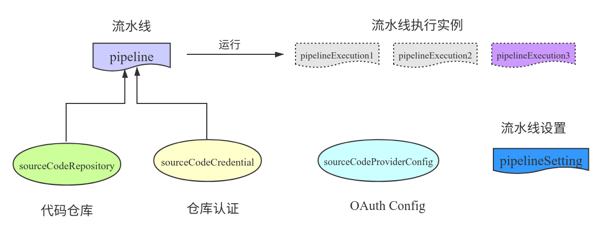
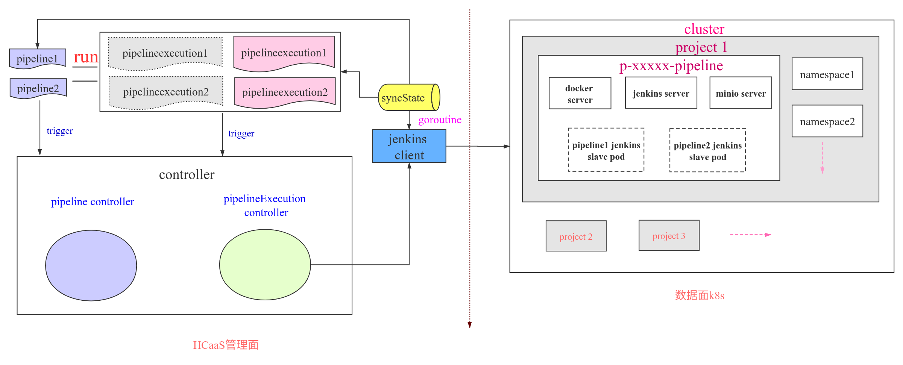
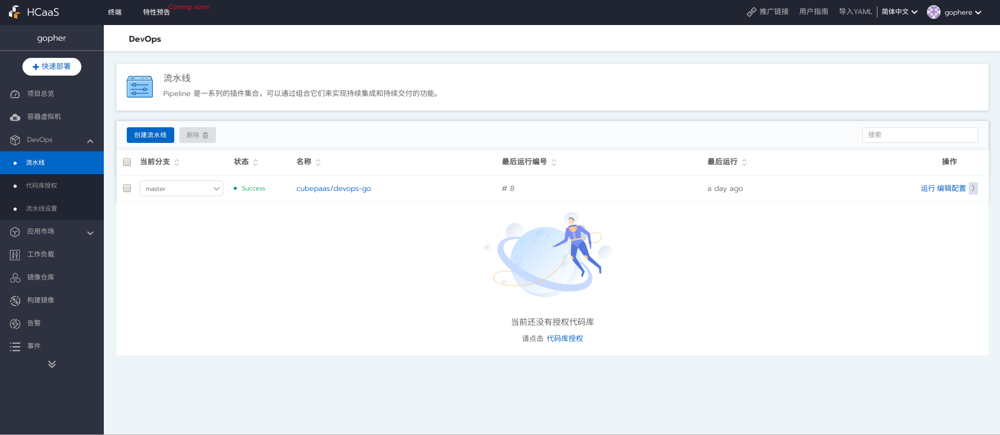
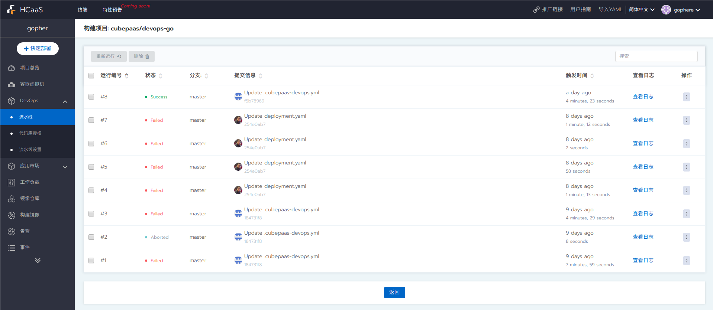
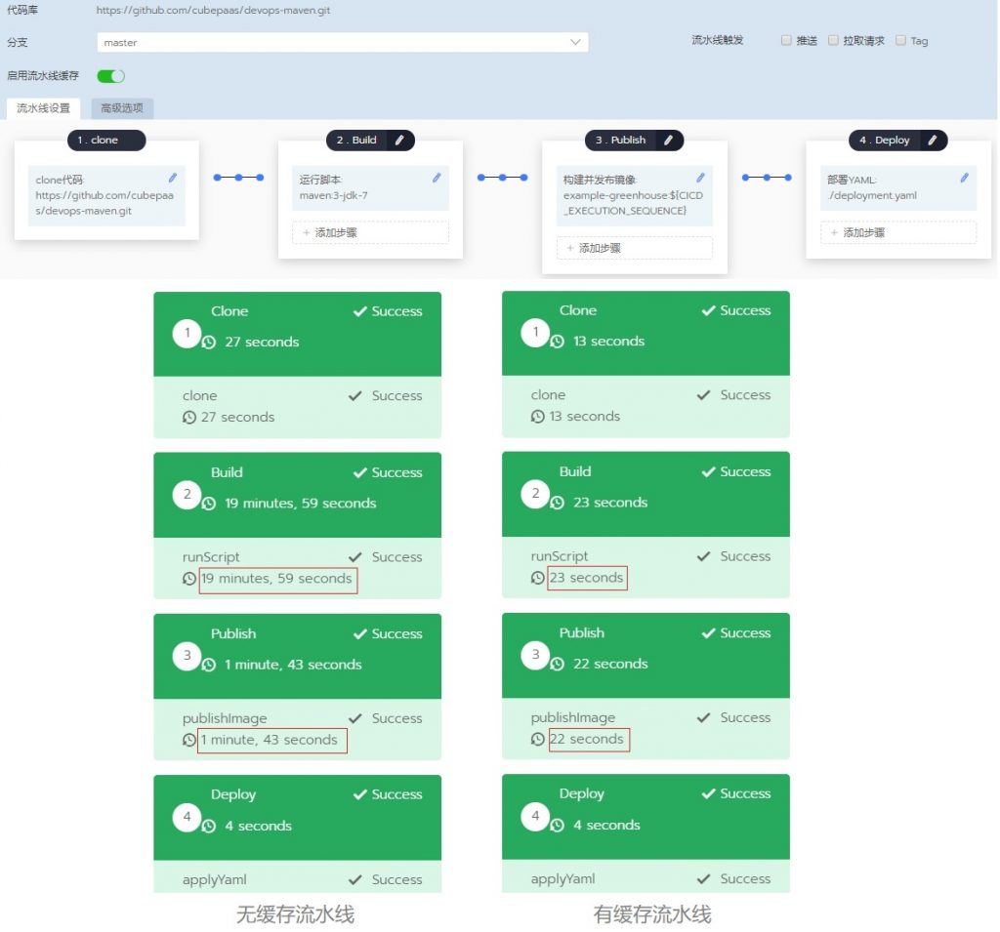
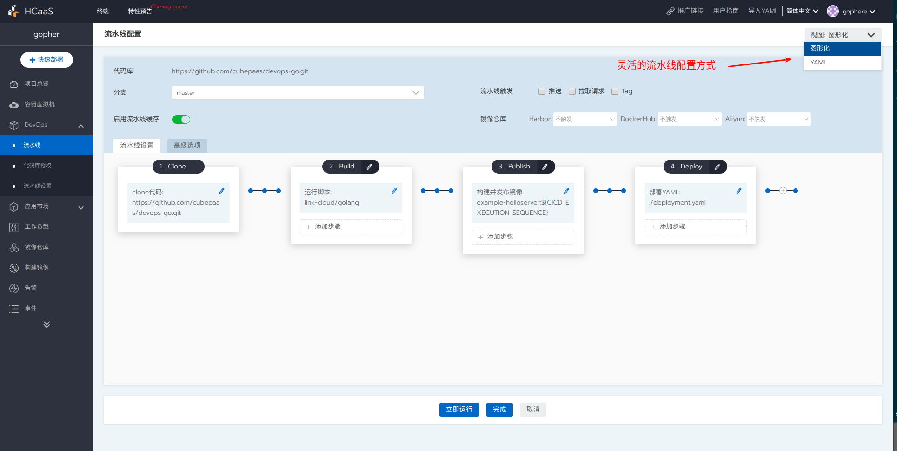
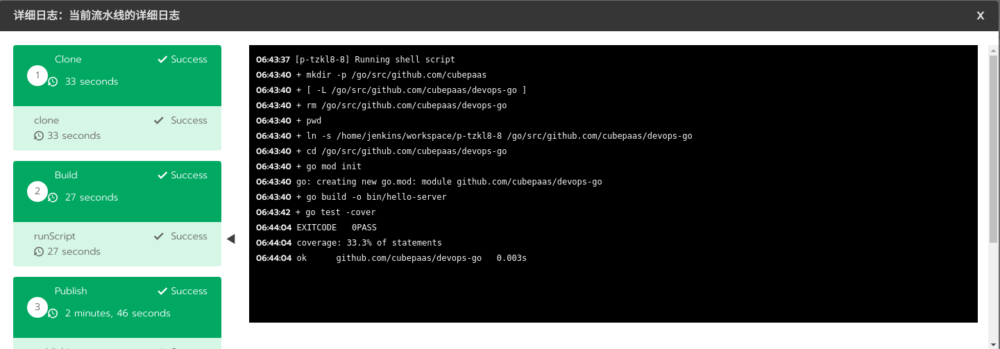

## DevOps简述

顾名思义，DevOps就是开发（Development）与运维（Operations）的结合体，其目的就是打通开发与运维之间的壁垒，促进开发、运营和质量保障（QA）等部门之间的沟通协作，以便对产品进行小规模、快速迭代式地开发和部署，快速响应客户的需求变化。它强调的是开发运维一体化，加强团队间的沟通和快速反馈，达到快速交付产品和提高交付质量的目的。

DevOps并不是一种新的工具集，而是一种思想，一种文化，用以改变传统开发运维模式的一组最佳实践。一般做法是通过一些CI/CD（持续集成、持续部署）自动化的工具和流程来实现DevOps的思想，以流水线（pipeline）的形式改变传统开发人员和测试人员发布软件的方式。随着Docker和Kubernetes（以下简称k8s）等技术的普及，容器云平台基础设施越来越完善，加速了开发和运维角色的融合，使云原生的DevOps实践成为以后的趋势。下面我们基于混合容器云平台详细讲解下云平台下DevOps的落地方案。

## 云原生DevOps特点

DevOps是PaaS平台里很关键的功能模块，包含以下重要能力：支持代码克隆、编译代码、运行脚本、构建发布镜像、部署yaml文件以及部署Helm应用等环节；支持丰富的流水线设置，比如资源限额、流水线运行条数、推送代码以及推送镜像触发流水线运行等，提供了用户在不同环境下的端到端高效流水线能力；提供开箱即用的镜像仓库中心；提供流水线缓存功能，可以自由配置整个流水线或每个步骤的运行缓存，在代码克隆、编译代码、构建镜像等步骤时均可利用缓存大大缩短运行时间，提升执行效率。具体功能清单如下：

- 缓存加速：自研容器化流水线的缓存技术，通过代码编译和镜像构建的缓存复用，平均加速流水线3~5倍；
- 细粒度缓存配置：任一阶段、步骤可以控制是否开启缓存及缓存路径；
- 支持临时配置：用户无需提交即可运行临时配置，避免频繁提交配置文件污染代码仓库；
- 开箱即用的镜像仓库；
- 提供完整的日志功能；
- 可视化编辑界面，灵活配置流水线；
- 支持多种代码仓库授权：GitHub、GitLab、Bitbucket等；
- 多种流水线触发方式：代码仓库触发，镜像推送触发等；
- 网络优化，加快镜像或依赖包的下载速度；


## 云原生DevOps实现

简单地说，云原生DevOps内部功能的设计基本上均是通过k8s提供的自定义controller功能来实现的，基本逻辑就是根据业务需要抽象出多个CRD（Custom Resource Definition，自定义资源对象），并编写对应的controller来实现业务逻辑。为了实现CI/CD功能，我们抽象出了多个CRD对象，如下图所示：



<center>图1 CRD对象定义</center>

我们知道配置流水线通常需要对接代码仓库，包括仓库地址，仓库授权信息等，因此我们需要有3个CRD对象来记录源代码仓库的相关信息。

- `sourceCodeProviderConfig`：记录仓库OAuth Apps的客户端ID、客户端秘钥；
- `sourceCodeCredential`：记录仓库的认证信息；
- `sourceCodeRepository`：记录仓库地址等信息。

设计好了DevOps中与仓库相关的3个CRD对象后，我们需要再定义3个CRD对象来描述流水线相关的信息。
- `pipeline`：记录该流水线的配置信息：仓库的认证信息、钩子触发配置以及项目代码地址等等；
- `pipelineExecution`：记录流水线运行时信息与执行结果信息等；
- `pipelineSetting`：记录整个项目下pipeline运行环境信息：内存、CPU的限制，最大流水线并行运行个数等等。

pipeline步骤功能有很多种类型，包括运行脚本、构建发布镜像、发布应用模板、部署YAML、部署应用等等。为了提供这些功能，我们采用Jenkins作为底层的CI/CD工具，docker registry 作为镜像仓库中心，minio作为日志存储中心等等。这些服务是运行在pipeline所在项目的命名空间下。综上，我们设计的CI/CD系统功能的实现逻辑如图所示：



<center>图2 逻辑示意图</center>

如上，当第一次运行流水线时，系统会在数据面k8s中部署Jenkins、minio等基础工具的服务，同时在管理面启动一个goroutine，实时同步数据面中流水线的作业状态到管理面的CRD对象中。当触发pipeline执行逻辑时，会产生一个pipelineExecution CRD对象，以记录本次运行pipeline的状态信息。当goroutine（syncState）发现有新的执行实例产生时，就会通过Jenkins引擎接口启动Jenkins server端流水线作业的运行，Jenkins server端收到信息后会启动单独的一个Jenkins slave pod进行流水线作业的响应。同时，goroutine（syncState）会不断地通过引擎接口轮询pipeline执行实例的运行情况进而更新 pipelineExecution CRD的状态（运行成功或失败等等）。当pipeline执行实例发生状态变化时，就会触发其对应的controller业务逻辑，进而通过Jenkins引擎接口与Jenkins server 通信进行不同的操作，比如，暂停流水线的运行，运行完清除不需要的资源等等。当流水线作业发生状态变化时，又会通过goroutine（syncState）更改pipeline执行实例的状态，进而又触发对应的controller业务代码进行不同的业务逻辑处理，往复循环，直到流水线运行结束。这就是整个pipeline执行时的一个逻辑流程。

### CRD定义

下面是详细的CRD结构体讲解，敏感信息使用了'*'代替。

`pipelineSetting`：该结构体保存着整个项目下所有pipeline的运行环境信息，比如CPU/内存资源限额、缓存路径以及流水线运行的最大并行个数等等，不同功能的配置信息保存在不同的CRD下。
```go
devops-cache-dir            12d
executor-cpu-limit          12d
executor-cpu-request        12d
executor-memory-limit       12d
executor-memory-request     12d
executor-quota              12d
...

// 比如，看下executor-quota详细信息
apiVersion: project.cubepaas.com/v3
kind: PipelineSetting
metadata:
  labels:
    cubepaas.com/creator: linkcloud
  name: executor-quota
  namespace: p-zwmcv
default: "2" // 默认最多可同时运行2个pipeline
projectName: c-86tgg:p-zwmcv
value: "3" // 自定义设置，最多可同时运行3个pipeline，没有值会取上面默认值
```

`pipeline`：该结构体记录着流水线的配置元信息，比如该流水线对接哪个项目代码、与仓库通信的认证信息以及上次该流水线运行的结果等等。如下图所示：



<center>图3 流水线列表</center>

详细的结构字段讲解如下：
```go
apiVersion: project.cubepaas.com/v3
kind: Pipeline
metadata:
  labels:
    cubepaas.com/creator: linkcloud
  name: p-d5frn
  namespace: p-zwmcv
spec:
  currentBranch: master // 流水线运行时默认代码分支
  imageWebHookToken: // 这是推送镜像时触发该流水线运行的设置信息
  - branches:
    - master
    comment: a
    imageType: harbor // 支持 harbor dockerhub aliyun等镜像仓库
    token: 7c102c82-66d9-44c1-8718-**** // 推送镜像触发流水线运行时的 token 认证 
    trigger: nginx // 当推送 nginx 镜像时会触发流水线运行
  projectName: c-86tgg:p-zwmcv
  repositoryUrl: https://github.com/gophere/devops-go.git // 项目代码地址
  sourceCodeCredentialName: u-8sq**:p-zwmcv-github-gophere // 指向对应的用户认证信息
  triggerWebhookPush: true // 钩子操作，当push代码到仓库时会触发该流水线执行
status:
  lastRunState: Success // 最新一次运行的最后结果
  nextRun: 2 // 下次运行时执行实例对应的序号
  pipelineState: active // 该流水线处于有效状态
  sourceCodeCredential: // 上述已介绍，此处不再赘述
    ...
    ...
  token: e667bbb9-7230-48d4-9d29-***** // 用于代码仓库触发流水线运行时的 token 认证
  webhookId: "245901183" // 代码仓库的钩子信息
```

`pipelineExecution`：流水线执行实例，每当流水线运行一次，会产生一个该对象记录着流水线的执行结果等信息。如下图所示：



<center>图4 流水线执行记录列表</center>

详细的结构字段讲解如下：
```go
apiVersion: project.cubepaas.com/v3
kind: PipelineExecution
metadata:
  labels:
    cubepaas.com/creator: linkcloud
    pipeline.project.cubepaas.com/finish: "true"
  name: p-d5frn-2
  namespace: p-zwmcv
spec:
  branch: master // 本次运行的代码分支
  commit: f5b78969586cd90918020cb7a138fe88c7e25f9d // 代码 commitid
  message: Update .cubepaas-devops.yml // 代码 commit 说明
  pipelineConfig: // 以下是pipeline具体的stage和step的配置信息，每次运行时从代码仓库的配置文件（.cubepaas.devops.ymal）拉取下来填充该结构
    stages:
    - name: Clone // 克隆代码
      steps:
      - sourceCodeConfig: {}
    - name: Build // 运行脚本编译代码
      ...
  pipelineName: p-zwmcv:p-d5frn
  projectName: c-86tgg:p-zwmcv
  ref: master
  repositoryUrl: https://github.com/gophere/devops-go.git // 项目代码地址
  run: 2 // 此次运行序号
  triggerUserName: u-8sq** // 触发用户
  triggeredBy: user
status: // 以下记录着pipeline每个stage和step的运行结果信息
  executionState: Success
  stages:
  - ended: 2020-09-03T06:01:01Z
    state: Success
    steps:
    - ended: 2020-09-03T06:01:01Z
      state: Success
  ...
  ...
```

至此，我们完成了流水线功能的基础对象定义。

### controller 实现

除了抽象出对应的CRD外，我们还需要编写对应的controller代码实现对应的业务逻辑，比如当pipeline运行时，我们需要产生pipeline执行实例，并实时同步其运行的状态信息等等。

当触发流水线执行逻辑时，系统会根据pipeline CRD对象和该流水线对应的代码仓库中的配置文件（.cubepaas.devops.ymal）产生一个pipelineExecution CRD对象，这时会触发pipelineExecution对应的controller运行业务逻辑。下面只摘取重要的代码逻辑，如下所示：

```go
func (l *Lifecycle) Sync(obj *v3.PipelineExecution) (runtime.Object, error) {

    ...

    // 如果 pipeline 执行实例被暂停，则会停止流水线作业
    if obj.Status.ExecutionState == utils.StateAborted {
        if err := l.doStop(obj); err != nil {
            return obj, err
        }
    }

    // 如果 pipeline 执行实例运行完毕，则会清理流水线作业的一些资源
    // 比如，产生的Jenkins slave pod
    if obj.Labels != nil && obj.Labels[utils.PipelineFinishLabel] == "true" {
        return l.doFinish(obj)
    }

    // 如果 pipeline 执行实例正在运行中，则直接返回，无操作
    if v3.PipelineExecutionConditionInitialized.GetStatus(obj) != "" {
        return obj, nil
    }

    // 判断流水线作业是否超出资源限额
    exceed, err := l.exceedQuota(obj)
    if err != nil {
        return obj, err
    }
    // 如果超出资源限额，则会设置当前 pipeline 执行实例为阻塞状态
    if exceed {
        obj.Status.ExecutionState = utils.StateQueueing
        obj.Labels[utils.PipelineFinishLabel] = ""

        if err := l.newExecutionUpdateLastRunState(obj); err != nil {
            return obj, err
        }

        return obj, nil
    } else if obj.Status.ExecutionState == utils.StateQueueing {
        obj.Status.ExecutionState = utils.StateWaiting
    }

    // 更新 pipeline 执行实例的状态: 比如运行序号+1
    if err := l.newExecutionUpdateLastRunState(obj); err != nil {
        return obj, err
    }
    v3.PipelineExecutionConditionInitialized.CreateUnknownIfNotExists(obj)
    obj.Labels[utils.PipelineFinishLabel] = "false"

    // 在数据面部署pipeline功能所需资源
    if err := l.deploy(obj.Spec.ProjectName); err != nil {
        obj.Labels[utils.PipelineFinishLabel] = "true"
        obj.Status.ExecutionState = utils.StateFailed
        v3.PipelineExecutionConditionInitialized.False(obj)
        v3.PipelineExecutionConditionInitialized.ReasonAndMessageFromError(obj, err)
    }

    // 将 configMap 存储的docker镜像仓库端口信息同步到pipeline执行实例中去.
    if err := l.markLocalRegistryPort(obj); err != nil {
        return obj, err
    }

    return obj, nil
}
```

其中，deploy函数的逻辑就是第一次运行时通过判断数据面中是否存在pipeline的命名空间，如果存在就代表基础资源已经配置完成，直接走reconcileRb函数，该函数的逻辑见下面；如果不存在，就会在数据面中初始化必要的基础资源，比如：pipeline命名空间, Jenkins docker minio服务, 配置configMap, secret等等。

```go
func (l *Lifecycle) deploy(projectName string) error {
    clusterID, projectID := ref.Parse(projectName)
    ns := getPipelineNamespace(clusterID, projectID)
    // 如果该pipeline的namespace已经有了，说明下面的资源部署已经完成了，则直接走reconcileRb流程
    // 否则走下面的资源部署流程
    if _, err := l.namespaceLister.Get("", ns.Name); err == nil {
        return l.reconcileRb(projectName)
    } else if !apierrors.IsNotFound(err) {
        return err
    }

    // 创建pipeline对应的命名空间，如p-qqxs7-pipeline
    if _, err := l.namespaces.Create(ns); err != nil && !apierrors.IsAlreadyExists(err) {
        return errors.Wrapf(err, "Error creating the pipeline namespace")
    }

    ...

    // 随机产生一个token，用于配置下面的secret
    token, err := randomtoken.Generate()

    nsName := utils.GetPipelineCommonName(projectName)
    ns = getCommonPipelineNamespace()
    // 创建用于部署docker镜像仓库的代理服务的命名空间
    if _, err := l.namespaces.Create(ns); err != nil && !apierrors.IsAlreadyExists(err) {
        return errors.Wrapf(err, "Error creating the cattle-pipeline namespace")
    }

    // 在 pipeline namespace 内创建secret : pipeline-secret
    secret := getPipelineSecret(nsName, token)
    l.secrets.Create(secret); 

    ...

    // 获取管理面项目的系统用户token
    apikey, err := l.systemAccountManager.GetOrCreateProjectSystemToken(projectID)

    ...

    // 在 pipeline namespace 内创建secret: pipeline-api-key，用于数据面与管理面通信的凭证
    secret = GetAPIKeySecret(nsName, apikey)
    l.secrets.Create(secret); 

    // 调谐 docker 镜像仓库的证书配置（在控制面中）
    if err := l.reconcileRegistryCASecret(clusterID); err != nil {
        return err
    }

    // 将控制面中的 docker 镜像仓库的证书配置同步到数据面中
    if err := l.reconcileRegistryCrtSecret(clusterID, projectID); err != nil {
        return err
    }

    // 在 pipeline namespace 内创建 serviceAccount : jenkins
    sa := getServiceAccount(nsName)
    if _, err := l.serviceAccounts.Create(sa); err != nil && !apierrors.IsAlreadyExists(err) {
        return errors.Wrapf(err, "Error creating a pipeline service account")
    }

    ... 

    // 在 pipeline namespace 内创建 service: jenkins
    jenkinsService := getJenkinsService(nsName)
    if _, err := l.services.Create(jenkinsService); err != nil && !apierrors.IsAlreadyExists(err) {
        return errors.Wrapf(err, "Error creating the jenkins service")
    }

    // 在 pipeline namespace 内创建 deployment: jenkins
    jenkinsDeployment := GetJenkinsDeployment(nsName)
    if _, err := l.deployments.Create(jenkinsDeployment); err != nil && !apierrors.IsAlreadyExists(err) {
        return errors.Wrapf(err, "Error creating the jenkins deployment")
    }

    // 在 pipeline namespace 内创建 service: docker-registry
    registryService := getRegistryService(nsName)
    if _, err := l.services.Create(registryService); err != nil && !apierrors.IsAlreadyExists(err) {
        return errors.Wrapf(err, "Error creating the registry service")
    }

    // 在 pipeline namespace 内创建 deployment: docker-registry
    registryDeployment := GetRegistryDeployment(nsName)
    if _, err := l.deployments.Create(registryDeployment); err != nil && !apierrors.IsAlreadyExists(err) {
        return errors.Wrapf(err, "Error creating the registry deployment")
    }

    // 在 pipeline namespace 内创建 service: minio
    minioService := getMinioService(nsName)
    if _, err := l.services.Create(minioService); err != nil && !apierrors.IsAlreadyExists(err) {
        return errors.Wrapf(err, "Error creating the minio service")
    }

    // 在 pipeline namespace 内创建 deployment: minio
    minioDeployment := GetMinioDeployment(nsName)
    if _, err := l.deployments.Create(minioDeployment); err != nil && !apierrors.IsAlreadyExists(err) {
        return errors.Wrapf(err, "Error creating the minio deployment")
    }

    // 调谐 configMap: proxy-mappings，用于配置docker镜像仓库代理服务的端口信息
    if err := l.reconcileProxyConfigMap(projectID); err != nil {
        return err
    }

    // 创建secret: devops-docker-registry，存储访问docker仓库的认证信息
    if err := l.reconcileRegistryCredential(projectName, token); err != nil {
        return err
    }

    // 创建 daemonset: registry-proxy，每个节点部署一套docker镜像仓库的nginx代理服务
    // 可以在任意一个节点上通过不同的端口即可访问到不同的docker镜像仓库
    nginxDaemonset := getProxyDaemonset()
    if _, err := l.daemonsets.Create(nginxDaemonset); err != nil && !apierrors.IsAlreadyExists(err) {
        return errors.Wrapf(err, "Error creating the nginx proxy")
    }

    return l.reconcileRb(projectName)
}
```

reconcileRb函数的功能就是遍历所有namespace, 对其调谐rolebindings, 目的是让 pipeline serviceAccount(jenkins) 对该project下的所有namespace具有所需要的操作权限，这样Jenkins server才能够在数据面中正常提供CI/CD基础服务。

```go
func (l *Lifecycle) reconcileRb(projectName string) error {

    ...

    var namespacesInProject []*corev1.Namespace
    for _, namespace := range namespaces {
        parts := strings.Split(namespace.Annotations[projectIDLabel], ":")
        if len(parts) == 2 && parts[1] == projectID {
            // 过滤出属于该project下的所有namespace
            namespacesInProject = append(namespacesInProject, namespace)
        } else {
            // 对非该project下的namespace, 清除有关该 pipeline 的 rolebinding
            if err := l.roleBindings.DeleteNamespaced(namespace.Name, commonName, &metav1.DeleteOptions{}); err != nil && !apierrors.IsNotFound(err) {
                return err
            }
        }
    }

    for _, namespace := range namespacesInProject {
        // 对属于该project下的namespace, 创建 rolebinding: 对 jenkins serviceAccount 绑定角色
        // 即赋予 jenkins serviceAccount 对该project下的所有namespace所需要的操作权限
        rb := getRoleBindings(namespace.Name, commonName)
        if _, err := l.roleBindings.Create(rb); err != nil && !apierrors.IsAlreadyExists(err) {
            return errors.Wrapf(err, "Error create role binding")
        }
    }

    // 赋予 jenkins serviceAccount 在 cluster 内创建和修改 namespace 的权限
    // 当部署应用时可以指定创建新的命名空间
    clusterRbs := []string{roleCreateNs, projectID + roleEditNsSuffix}
    for _, crbName := range clusterRbs {
        crb := getClusterRoleBindings(commonName, crbName)
        if _, err := l.clusterRoleBindings.Create(crb); err != nil && !apierrors.IsAlreadyExists(err) {
            return errors.Wrapf(err, "Error create cluster role binding")
        }
    }

    return nil
}
```

goroutine（syncState）的代码逻辑比较简单，当产生新的pipeline执行实例时就会启动Jenkins server端流水线作业的运行并实时同步其运行状态到pipeline执行实例中。代码逻辑如下：

```go
func (s *ExecutionStateSyncer) syncState() {
    set := labels.Set(map[string]string{utils.PipelineFinishLabel: "false"})
    allExecutions, err := s.pipelineExecutionLister.List("", set.AsSelector())
    executions := []*v3.PipelineExecution{}
    // 遍历该cluster下的 pipeline 执行实例
    for _, e := range allExecutions {
        if controller.ObjectInCluster(s.clusterName, e) {
            executions = append(executions, e)
        }
    }

    for _, execution := range executions {
        if v3.PipelineExecutionConditionInitialized.IsUnknown(execution) {
            // 检查数据面k8s中 Jenkins pod 是否正常，正常则运行该 pipeline job
            s.checkAndRun(execution)
        } else if v3.PipelineExecutionConditionInitialized.IsTrue(execution) {
            e := execution.DeepCopy()
            // 如果已经启动了，则同步运行状态
            updated, err := s.pipelineEngine.SyncExecution(e)
            if updated {
                // 更新最新的状态到 pipelineExecution crd 中
                s.updateExecutionAndLastRunState(e);
            }
        } else {
            // 更新最新的状态到 pipelineExecution crd 中
            s.updateExecutionAndLastRunState(execution);
        }
    }

    logrus.Debugf("Sync pipeline execution state complete")
}
```

### 缓存支持

云环境下的流水线是通过启动容器来运行具体的功能步骤，每次运行流水线可能会被调度到不同的计算节点上，这会导致一个问题：容器运行完是不会保存数据的，每当流水线重新运行时，又会重新拉取代码、编译代码、下载依赖包等等，失去了本地宿主机编译代码、构建镜像时缓存的作用，大大延长了流水线运行时间，浪费很多不必要的时间、网络和计算成本等。为了提高用户使用流水线的体验，加入支持缓存的功能。

为了让流水线具有缓存功能，我们需要在流水线运行时加入持久化数据的能力。首先想到的就是k8s提供的本地持久化存储（即Local Persistent Volume，以下简称Local PV），或依赖远程存储服务器来提供持久化，远程存储效率依赖于网络，并且还需要保证远程存储高可用，这回带来很多复杂性，也一定程度上失去了缓存的作用。综合考虑，我们选择本地存储实现缓存，但是k8s提供的Local PV是需要和节点绑定在一起的，也就是说一旦流水线调度到某个节点上运行，那么下次运行还会绑定到该节点运行，虽然实现了缓存的作用，但是也造成了流水线每次只能在该节点上运行，如果有多条流水线同时跑，可能会导致该节点资源耗尽或者缓存冲突，失去了云平台本身根据资源使用情况平衡调度的特性。

因此，为了平衡缓存与调度间的关系，我们采用了挂载hostPath Volume方式，这样依托于k8s强大的容器调度能力，我们可以同时运行很多条流水线而不用担心资源耗尽或缓存冲突的问题，但是流水线每次运行时可能会被调度到不同的节点上，如果当前节点没有运行过流水线，则起不到缓存的作用。那么如何解决hostPath Volume缓存与调度间的尴尬关系呢？我们巧妙地利用了k8s提供的亲和性调度特性，当流水线运行时我们会记录当前运行节点，下次运行时通过设置Pod的亲和性优先调度到该节点上，随着流水线运行次数越来越多，我们会得到一个运行节点列表。如下所示：

```go
// 按时间排序，最近运行流水线的节点排在最前面
executionScheduledInfo:
    - creationTimestamp: "2020-09-02T06:42:45Z"
      executionId: 8
      nodeName: ******
    - creationTimestamp: "2020-08-26T14:19:21Z"
      executionId: 7
      nodeName: ******
    - creationTimestamp: "2020-08-26T10:52:15Z"
      executionId: 5
      nodeName: ******
    - creationTimestamp: "2020-08-26T10:48:43Z"
      executionId: 4
      nodeName: ******
    - creationTimestamp: "2020-08-25T07:47:27Z"
      executionId: 3
      nodeName: ******
    - creationTimestamp: "2020-08-25T07:16:29Z"
      executionId: 1
      nodeName: ******
    ......
```

执行实例调度信息会保存到pipeline CRD对象中，每次运行流水线时，系统会根据节点列表设置Pod的亲和性，默认我们会取最近运行流水线的10个节点，原则是最近运行流水线的节点优先级越高。代码如下：

```go
// 获取流水线的节点调度列表
esi := c.pipeline.Status.ExecutionScheduledInfo
nodes := make([]v1.PreferredSchedulingTerm, 0)
for i, v := range esi {
    // 设置亲和性
	n := v1.PreferredSchedulingTerm{
		Weight: int32(100 - i*10), // 最近运行的节点权重越高
		Preference: v1.NodeSelectorTerm{
			MatchExpressions: []v1.NodeSelectorRequirement{
				{
					Key:      "kubernetes.io/hostname",
					Operator: v1.NodeSelectorOpIn,
					Values:   []string{v.NodeName},
				},
			},
		},
	}
	nodes = append(nodes, n)
}
nodeAff.PreferredDuringSchedulingIgnoredDuringExecution = nodes
```

创新性的“Hostpath Volume + 亲和性调度”缓存设计方案，不仅实现了流水线的并发性缓存功能，而且实现复杂度低，可自由配置任一阶段、步骤的缓存开关以及缓存路径。无缓存与有缓存运行的对比如下图所示，可见通过缓存加速大大提高了流水线的运行效率。



<center>图5 缓存效果</center>

## HCaaS DevOps使用

以上设计在HCaaS平台上得到实现（<https://cubepaas.com>）在HCaaS控制台上点击DevOps标签，通过代码授权后，即可通过UI界面轻松地编辑流水线，也可通过编辑yaml文件配置具体的功能步骤，如图所示：



<center>图6 流水线编辑</center>

通过点击查看日志，你可以看到pipeline各个阶段运行的详细日志信息，如下图所示：



<center>图7 流水线运行日志</center>

【注意】首次运行pipeline时系统会从网络下载Jenkins、docker、minio以及其他pipeline-tools镜像，请稍作等待。如果长时间未运行，请查看网络是否有问题。
