2020 年是云原生社区的起步之年，感谢所有云原生社区的参与者和合作伙伴们！在此新春佳节之际，祝大家新春快乐，万事如意！

下面我们一起回顾下云原生社区在过去一年来的进展，同时感谢社区讲师、贡献者、志愿者、SIG 负责人和城市站站长。

## 城市站

云原生社区相继成立了北京站、上海站、成都站、杭州站、深圳站等 20 个[城市站](/city/)。

### 北京站

社区由核心成员罗广明、王殿进、王福印来组织与筹划社区发展与线下活动等事宜。我们热爱开源事业，热爱云原生技术。希望有更多人加入社区，一起组织线下活动，在北京推广云原生技术。

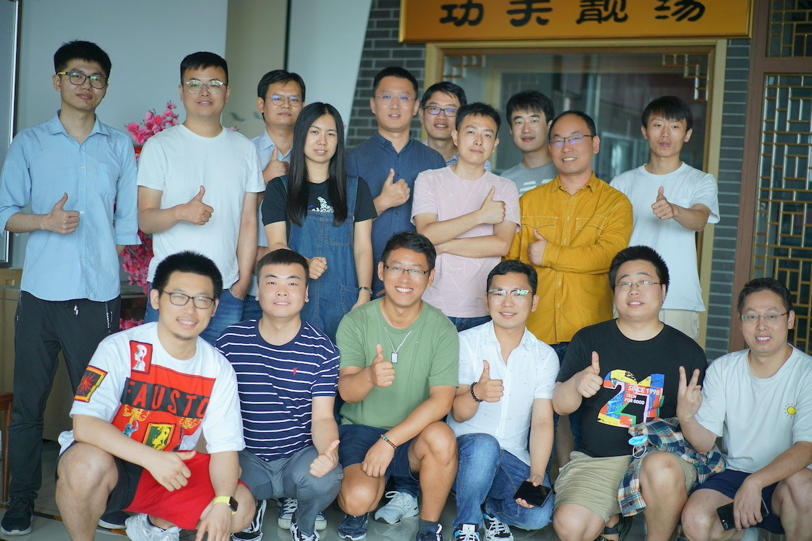

2020 年 8 月 30 日，云原生社区北京站成立活动。

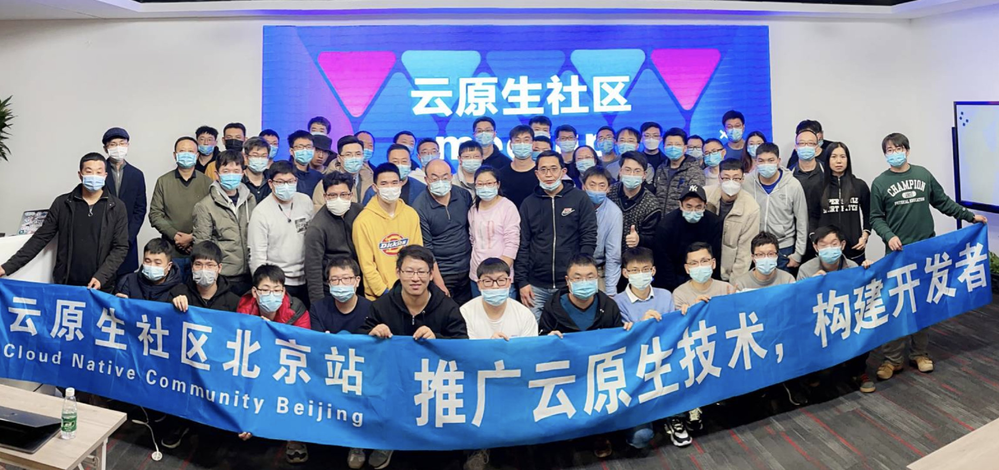

 2020 年 12 月 20 日，云原生社区meetup，第二期，北京站合影。

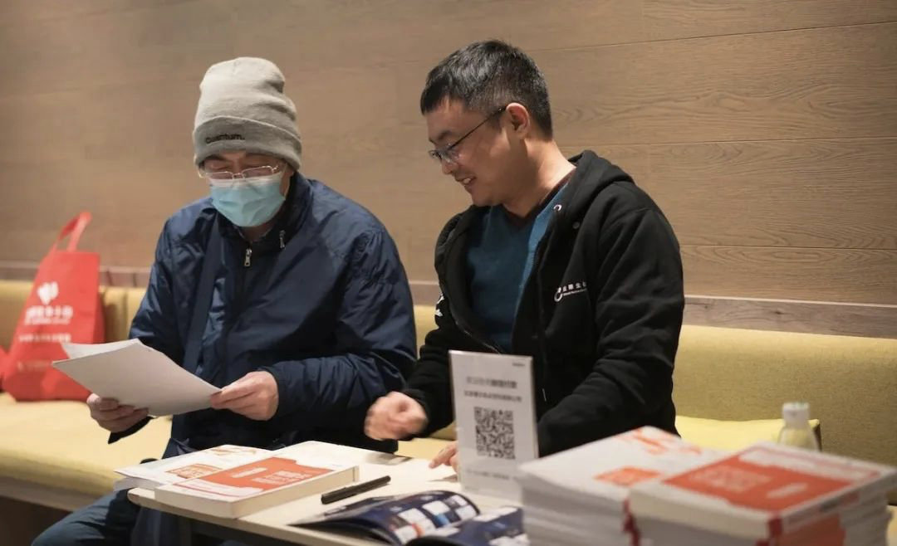

在中场环节《云原生操作系统 Kubernetes》作者之一张城在签字售书。

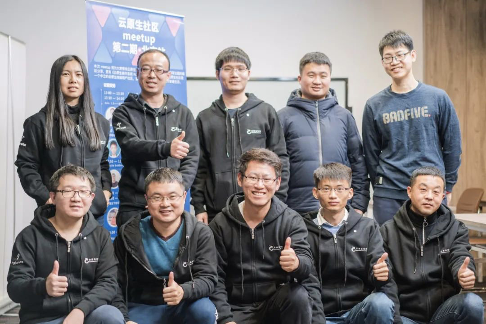

本次活动由云原生社区及 Tetrate 联合举办，感谢中国信通院 CCSA、电子工业出版社博文视点赞助，Dubbo Go 社区、ServiceMesher 社区及 CNCF 的大力支持。

### 上海站

云原生社区上海站成立于2020年8月，由核心成员郭旭东、沈旭、任增刚、张海立、申红磊、刘德涵组织与策划社区发展和线下活动。热烈欢迎上海云原生技术爱好者和企业的加入，积极参与云原生社区的建设、知识分享等。

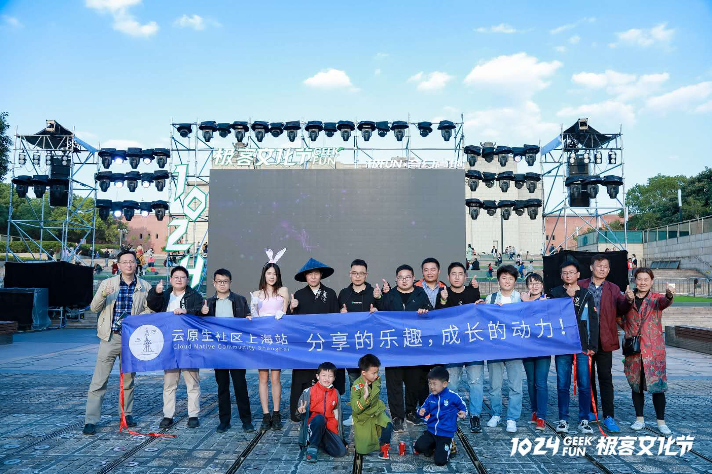

2020 年 10 月 24 日，上海站成员在 1024 极客文化节上。

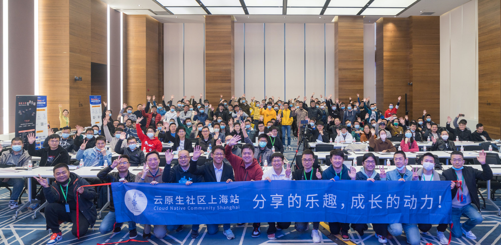

2020 年 11 月 28 日，云原生社区 meetup，第一期，上海站合影。

### 大连站

云原生社区大连站成立于 2020 年 9 月，由核心成员马景贺、李震、康志华、孔令伟、郭嘉懿、刘金龙、刘洋、彭紫来、王德宝组织与策划社区发展和线下活动。热烈欢迎大连云原生技术爱好者和企业的加入，积极参与云原生社区的建设、知识分享等。

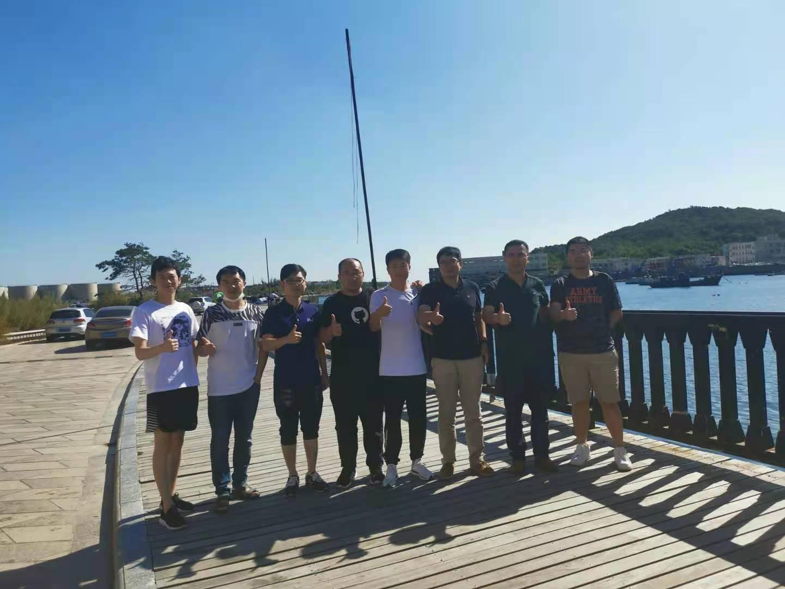

2020 年 9 月 26 日：在小平岛圣汐湾举行了成立仪式

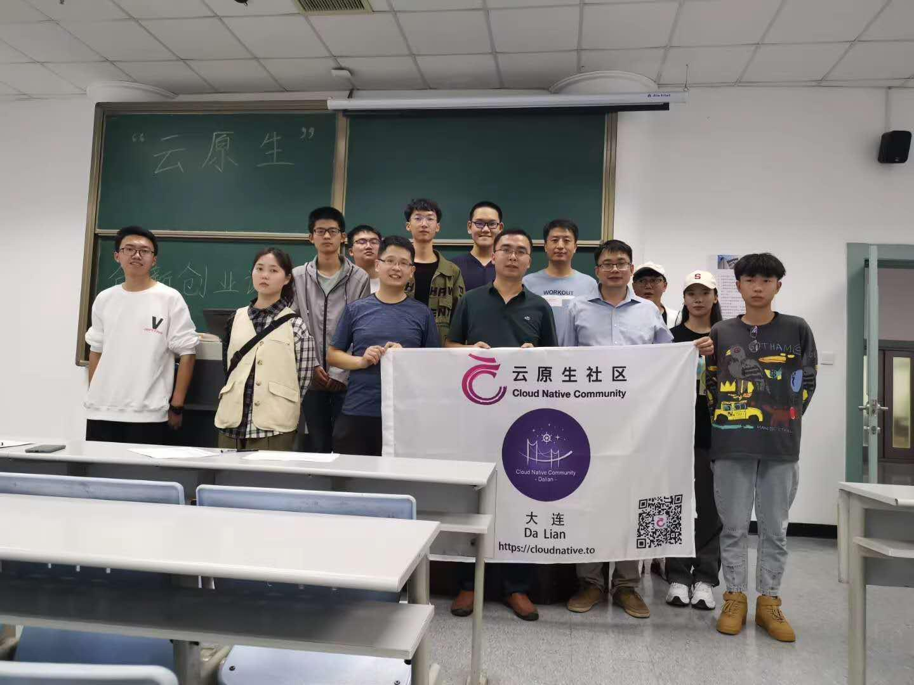

2020 年 9 月 24 日：东软信息学院第一期分享

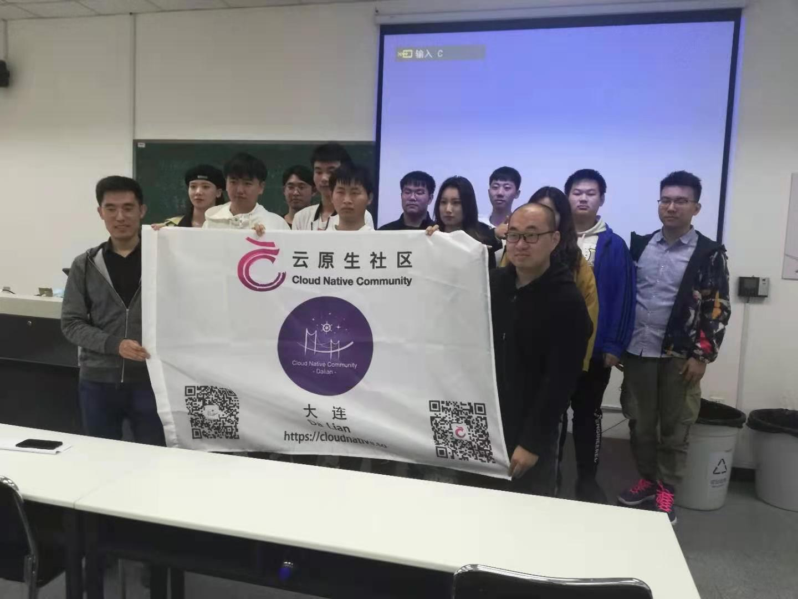

2020 年 12 月 5 日：东软信息学院第三期分享

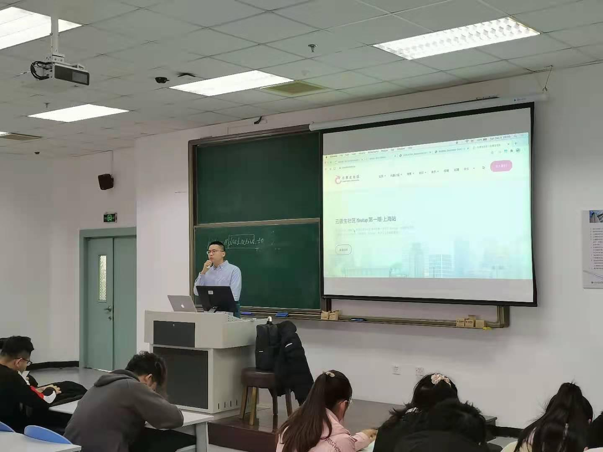

2020 年 12 月 5 日：东软信息学院第三期分享

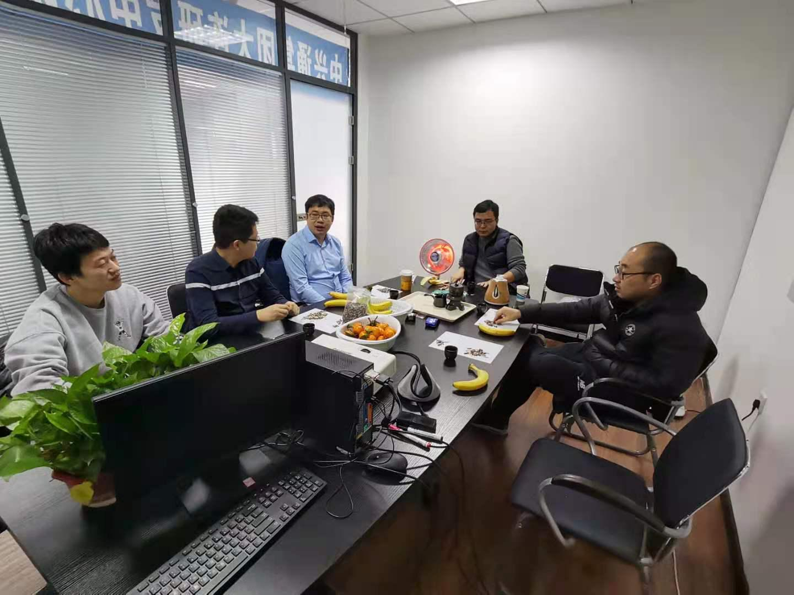

2020 年 12 月 12 日：线下 webinar

原定于 2020 年 1 月 16 日的第一次线下 meetup 由于大连疫情的原因，被迫取消，敬请期待春节过后的活动。

## 云原生学院

云原生学院致力于云原生知识的传播和普及。云原生学院定期举办线上直播活动，直播分享云原生领域的前沿知识和动向，另一方面，云原生学院也组织了 Kubernetes Client-go 源码研习活动，共同研读 Kubernetes 源码，共同进步。

### 线上直播

云原生学院的线上直播选题范围包括但不限于容器、Kubernetes、Service Mesh、Ingress、可观测性、DevOps等领域。2020年云原生学院邀请了17位来自于国内外多家（谷歌、Tetrate、阿里云、腾讯云、网易、VMWare、PingCAP、支流科技、StreamNative、IBM、京东、Coding等）公司的技术专家来进行线上分享。线上直播的回放链接以及嘉宾分享PPT均可以在云原生学院Github项目中找到，Github链接：<https://github.com/cloudnativeto/academy>，欢迎大家持续关注。

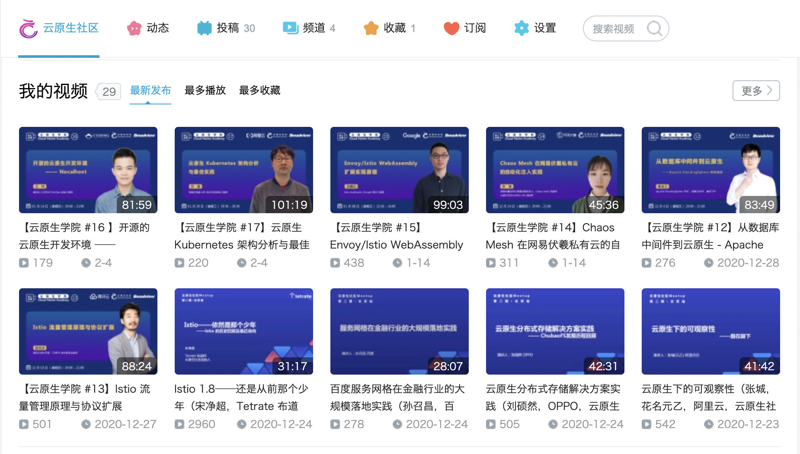

转到[云原生社区 B 站空间](https://space.bilibili.com/515485124)查看分享回放。

云原生学院的线上直播后续会聚焦于云原生领域、Kubernetes、服务网格领域，希望能够给大家带来更多更丰富更有价值的端到端的云原生落地案例以及体系化的线上直播分享，敬请期待。

### 源码研习社

Kubernetes 源码研习社是由 云原生社区 组织的 Kubernetes 源码特别兴趣小组（SIG），由热爱学习、注重个人成长的一帮小伙伴们自由、自愿成立的小组。每个人都非常希望从 Kubernetes 上学到知识，帮助自己实现成长和进步。Kubernetes 源码研习社第一期活动 Client-go 源码阅读，本次活动共有96位同学参与，381人参与交流，产生读书笔记115篇，优秀笔记39篇，公众号文章3篇；另一方面，Kubernetes 源码研习社也升级为 Kubernetes 源码特别兴趣小组（SIG），一群已经500人满人，群内的技术交流氛围也是个人加入的云原生技术交流微信群中技术氛围最好的群，没有之一。

考虑到大家感兴趣的云原生和Kubernetes 技术各不相同，Kubernetes SIG 后续会考虑组织云原生自习室，大家可以通过加入视频会议的方式，即使独自在家也可以像在图书馆或者教室一样，和社群内的小伙伴一起自习，一起交流。欢迎加入 Kubernetes SIG ，一起坚持，一起克服，一起成长。

## 开源贡献

为了方便国内开发者学习使用 kubebuilder，云原生社区在 2020 年 7 月份开始组织翻译 kubebuilder，前后历时一个月，共有 14 位志愿者参与，14 位志愿者均被评为云原生社区优秀志愿者，并将颁发社区认证证书。kubebuilder 的中文地址为：http://cloudnative.to/kubebuilder。近期，社区也在积极和社区沟通，将翻译的中文合入上游分支。具体的 PR 为：https://github.com/kubernetes-sigs/kubebuilder/pull/1888。

与此同时，为了帮助大家学习 Envoy 的相关知识，云原生社区组织成立了 Envoy SIG。Envoy SIG 目前着手展开的活动时组织志愿者翻译 Envoy 官方文档（基于 1.16 分支）。Envoy 中文文档地址位：http://cloudnative.to/envoy。 活动已经持续三个月，共有 64 位志愿者进行了登记并参与了翻译活动，目前活动已经接近尾声，将在春节过后结束剩余的收尾工作。翻译完毕，将和上游社区沟通，商量合入的适宜。关于 Envoy SIG 的所有信息（申请加入、参与翻译等）均可在此网站进行查阅：https://i.cloudnative.to/envoy/。在翻译过程中做出突出贡献的志愿者（评定条件为认领 5  个翻译任务或者长期参加 review 活动）也将收到由社区颁发的优秀志愿者认证证书。

### 云原生技术生态图景平台发布

在2020.10.21日上午召开的 2020 云原生产业大会上，中国信通院云大所云计算部副主任陈屹力发布了云原生产业联盟与云原生社区共建的「云原生技术生态图景平台」Beta版 👉https://landscape.opensourcecloud.cn（为了保证浏览体验，请在PC上访问）

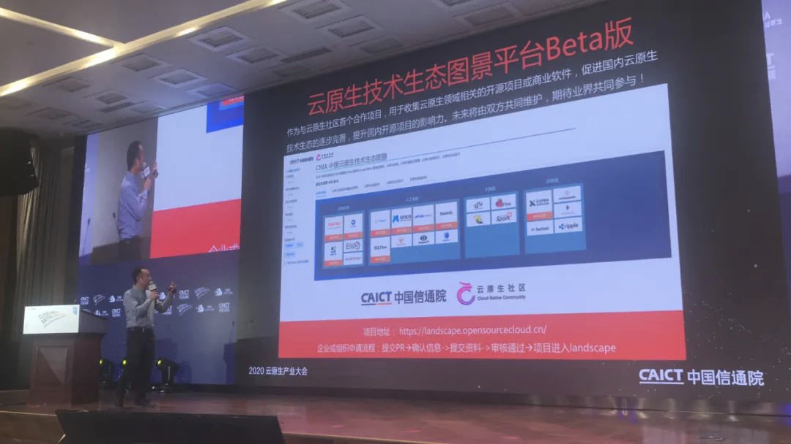

宋净超、罗广明在会上介绍了云原生社区。

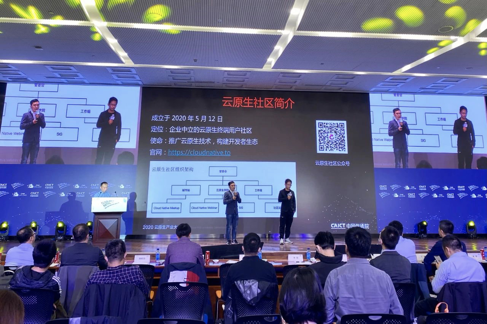

## 合作伙伴

感谢我们的合作伙伴们的大力支持。

### 开源项目

- [Apache APISIX](https://apisix.apache.org/)
- [Apache Pulsar](https://pulsar.apache.org/)
- [Apache ShardingSphere](https://shardingsphere.apache.org/)
- [Apache SkyWalking](https://skywalking.apache.org/)
- [ChaosMesh](https://chaos-mesh.org/)
- [ChubaoFS](https://chubao.io/)
- [Dapr](https://dapr.io/)
- [Envoy](https://envoyproxy.io/)
- [Harbor](https://goharbor.io/)
- [Istio](https://istio.io/)
- [KubeSphere](https://kubesphere.io/)
- [KubeVela](https://kubevela.io/)
- [Kubernetes](https://kubernetes.io/)
- [Open Application Model](https://oam.dev/)
- [TiDB](https://github.com/pingcap/tidb)

### 开源社区

- [中国 DevOps 社区](https://devopschina.org/)
- [边缘计算社区](http://byjs.com.cn/)
- [Apache Local Community](https://alc-beijing.github.io/alc-site/)

### 合作企业

- [Tetrate](https://www.tetrate.io/)
- [PingCAP](https://pingcap.com/)
- [StreamNative](https://streamnative.io/)
- [API7](https://www.apiseven.com/)
- [UCloud](https://www.ucloud.cn/)
- [阿里云](https://www.aliyun.com/)
- [腾讯云](https://cloud.tencent.com/)
- [网易数帆](https://www.163yun.com/)

### 合作机构

- [CNCF](https://www.cncf.io/)
- [百林哲](http://www.bailinzhe.com/)
- [麦斯博](https://www.msup.com.cn/)
- [中国信通院](http://www.caict.ac.cn/)
- [NJSD](https://t.1yb.co/9ty3)
- [博文视点](http://www.broadview.com.cn/)
- [华章图书](http://www.hzbook.com/)

## 贡献者

云原生社区每年会根据社区成员的贡献为成员颁发证书，鼓励更多的成员参与到社区活动中。详见：[2020 年度社区证书](https://i.cloudnative.to/community/certificate)。

### 优秀讲师

感谢您在 2020 年为社区做出的突出贡献！

（排名不分先后）

- [刘硕然](https://github.com/cloudnativeto/community/tree/8bc3a6e711ca29df892b86badc50aabab21f474d/certificate/2020/lecturer/刘硕然.png)
- [张城（元乙）](https://github.com/cloudnativeto/community/tree/8bc3a6e711ca29df892b86badc50aabab21f474d/certificate/2020/lecturer/张城（元乙）.png)
- [赵新（于雨）](https://github.com/cloudnativeto/community/tree/8bc3a6e711ca29df892b86badc50aabab21f474d/certificate/2020/lecturer/赵新（于雨）.png)
- [孙召昌](https://github.com/cloudnativeto/community/tree/8bc3a6e711ca29df892b86badc50aabab21f474d/certificate/2020/lecturer/孙召昌.png)
- [程亮](https://github.com/cloudnativeto/community/tree/8bc3a6e711ca29df892b86badc50aabab21f474d/certificate/2020/lecturer/程亮.png)
- [侯诗军](https://github.com/cloudnativeto/community/tree/8bc3a6e711ca29df892b86badc50aabab21f474d/certificate/2020/lecturer/侯诗军.png)
- [杨可奥](https://github.com/cloudnativeto/community/tree/8bc3a6e711ca29df892b86badc50aabab21f474d/certificate/2020/lecturer/杨可奥.png)
- [高洪涛](https://github.com/cloudnativeto/community/tree/8bc3a6e711ca29df892b86badc50aabab21f474d/certificate/2020/lecturer/高洪涛.png)
- [高鹏](https://github.com/cloudnativeto/community/tree/8bc3a6e711ca29df892b86badc50aabab21f474d/certificate/2020/lecturer/高鹏.png)
- [苏夏](https://github.com/cloudnativeto/community/tree/8bc3a6e711ca29df892b86badc50aabab21f474d/certificate/2020/lecturer/苏夏.png)
- [王炜](https://github.com/cloudnativeto/community/tree/8bc3a6e711ca29df892b86badc50aabab21f474d/certificate/2020/lecturer/王炜.png)
- [边鹏远](https://github.com/cloudnativeto/community/tree/8bc3a6e711ca29df892b86badc50aabab21f474d/certificate/2020/lecturer/边鹏远.png)
- [张慧](https://github.com/cloudnativeto/community/tree/8bc3a6e711ca29df892b86badc50aabab21f474d/certificate/2020/lecturer/张慧.png)
- [赵化冰](https://github.com/cloudnativeto/community/tree/8bc3a6e711ca29df892b86badc50aabab21f474d/certificate/2020/lecturer/赵化冰.png)
- [秦金卫](https://github.com/cloudnativeto/community/tree/8bc3a6e711ca29df892b86badc50aabab21f474d/certificate/2020/lecturer/秦金卫.png)
- [范建明](https://github.com/cloudnativeto/community/tree/8bc3a6e711ca29df892b86badc50aabab21f474d/certificate/2020/lecturer/范建明.png)
- [王院生](https://github.com/cloudnativeto/community/tree/8bc3a6e711ca29df892b86badc50aabab21f474d/certificate/2020/lecturer/王院生.png)
- [邹佳](https://github.com/cloudnativeto/community/tree/8bc3a6e711ca29df892b86badc50aabab21f474d/certificate/2020/lecturer/邹佳.png)
- [周正喜](https://github.com/cloudnativeto/community/tree/8bc3a6e711ca29df892b86badc50aabab21f474d/certificate/2020/lecturer/周正喜.png)
- [周礼赞](https://github.com/cloudnativeto/community/tree/8bc3a6e711ca29df892b86badc50aabab21f474d/certificate/2020/lecturer/周礼赞.png)
- [魏新宇](https://github.com/cloudnativeto/community/tree/8bc3a6e711ca29df892b86badc50aabab21f474d/certificate/2020/lecturer/魏新宇.png)
- [翟佳](https://github.com/cloudnativeto/community/tree/8bc3a6e711ca29df892b86badc50aabab21f474d/certificate/2020/lecturer/翟佳.png)
- [王夕宁](https://github.com/cloudnativeto/community/tree/8bc3a6e711ca29df892b86badc50aabab21f474d/certificate/2020/lecturer/王夕宁.png)
- [温铭](https://github.com/cloudnativeto/community/tree/8bc3a6e711ca29df892b86badc50aabab21f474d/certificate/2020/lecturer/温铭.png)
- [付业成](https://github.com/cloudnativeto/community/tree/8bc3a6e711ca29df892b86badc50aabab21f474d/certificate/2020/lecturer/付业成.png)
- [吴晟](https://github.com/cloudnativeto/community/tree/8bc3a6e711ca29df892b86badc50aabab21f474d/certificate/2020/lecturer/吴晟.png)

### 优秀志愿者

感谢在社区的贡献，根据 2020 年的突出表现，经社区管委会考评，被评为 **“2020 年度优秀志愿者”**。

（排名不分先后）

| 编号                                                         | 姓名   |
| ------------------------------------------------------------ | ------ |
| [V20200001](https://github.com/cloudnativeto/community/tree/8bc3a6e711ca29df892b86badc50aabab21f474d/certificate/2020/volunteer/V20200001.png) | 沈旭   |
| [V20200002](https://github.com/cloudnativeto/community/tree/8bc3a6e711ca29df892b86badc50aabab21f474d/certificate/2020/volunteer/V20200002.png) | 任增刚 |
| [V20200003](https://github.com/cloudnativeto/community/tree/8bc3a6e711ca29df892b86badc50aabab21f474d/certificate/2020/volunteer/V20200003.png) | 刘德涵 |
| [V20200004](https://github.com/cloudnativeto/community/tree/8bc3a6e711ca29df892b86badc50aabab21f474d/certificate/2020/volunteer/V20200004.png) | 詹骏南 |
| [V20200005](https://github.com/cloudnativeto/community/tree/8bc3a6e711ca29df892b86badc50aabab21f474d/certificate/2020/volunteer/V20200005.png) | 李可卉 |
| [V20200006](https://github.com/cloudnativeto/community/tree/8bc3a6e711ca29df892b86badc50aabab21f474d/certificate/2020/volunteer/V20200006.png) | 周亚珊 |
| [V20200009](https://github.com/cloudnativeto/community/tree/8bc3a6e711ca29df892b86badc50aabab21f474d/certificate/2020/volunteer/V20200009.png) | 张凯   |
| [V20200010](https://github.com/cloudnativeto/community/tree/8bc3a6e711ca29df892b86badc50aabab21f474d/certificate/2020/volunteer/V20200010.png) | 刘戎   |
| [V20200011](https://github.com/cloudnativeto/community/tree/8bc3a6e711ca29df892b86badc50aabab21f474d/certificate/2020/volunteer/V20200011.png) | 刘洋   |
| [V20200012](https://github.com/cloudnativeto/community/tree/8bc3a6e711ca29df892b86badc50aabab21f474d/certificate/2020/volunteer/V20200012.png) | 侯超英 |
| [V20200013](https://github.com/cloudnativeto/community/tree/8bc3a6e711ca29df892b86badc50aabab21f474d/certificate/2020/volunteer/V20200013.png) | 段帅星 |
| [V20200014](https://github.com/cloudnativeto/community/tree/8bc3a6e711ca29df892b86badc50aabab21f474d/certificate/2020/volunteer/V20200014.png) | 张桂元 |

### 优秀贡献者

感谢在社区的贡献，根据 2020 年的突出表现，经社区管委会考评，选出 **“2020 年度优秀贡献者”**。

（排名不分先后）

| 编号                                                         | 姓名   |
| ------------------------------------------------------------ | ------ |
| [C20200001](https://github.com/cloudnativeto/community/tree/8bc3a6e711ca29df892b86badc50aabab21f474d/certificate/2020/contributor/C20200001.png) | 许振文 |
| [C20200002](https://github.com/cloudnativeto/community/tree/8bc3a6e711ca29df892b86badc50aabab21f474d/certificate/2020/contributor/C20200002.png) | 张晓辉 |
| [C20200003](https://github.com/cloudnativeto/community/tree/8bc3a6e711ca29df892b86badc50aabab21f474d/certificate/2020/contributor/C20200003.png) | 刘金欣 |
| [C20200004](https://github.com/cloudnativeto/community/tree/8bc3a6e711ca29df892b86badc50aabab21f474d/certificate/2020/contributor/C20200004.png) | 梁斌   |
| [C20200005](https://github.com/cloudnativeto/community/tree/8bc3a6e711ca29df892b86badc50aabab21f474d/certificate/2020/contributor/C20200005.png) | 李云龙 |
| [C20200006](https://github.com/cloudnativeto/community/tree/8bc3a6e711ca29df892b86badc50aabab21f474d/certificate/2020/contributor/C20200006.png) | 王泓智 |
| [C20200007](https://github.com/cloudnativeto/community/tree/8bc3a6e711ca29df892b86badc50aabab21f474d/certificate/2020/contributor/C20200007.png) | 张海立 |
| [C20200008](https://github.com/cloudnativeto/community/tree/8bc3a6e711ca29df892b86badc50aabab21f474d/certificate/2020/contributor/C20200008.png) | 包仁义 |
| [C20200009](https://github.com/cloudnativeto/community/tree/8bc3a6e711ca29df892b86badc50aabab21f474d/certificate/2020/contributor/C20200009.png) | 黄晓芬 |
| [C20200010](https://github.com/cloudnativeto/community/tree/8bc3a6e711ca29df892b86badc50aabab21f474d/certificate/2020/contributor/C20200010.png) | 孟显超 |
| [C20200011](https://github.com/cloudnativeto/community/tree/8bc3a6e711ca29df892b86badc50aabab21f474d/certificate/2020/contributor/C20200011.png) | 官余鹏 |
| [C20200012](https://github.com/cloudnativeto/community/tree/8bc3a6e711ca29df892b86badc50aabab21f474d/certificate/2020/contributor/C20200012.png) | 申红磊 |
| [C20200013](https://github.com/cloudnativeto/community/tree/8bc3a6e711ca29df892b86badc50aabab21f474d/certificate/2020/contributor/C20200013.png) | 徐龙   |
| [C20200014](https://github.com/cloudnativeto/community/tree/8bc3a6e711ca29df892b86badc50aabab21f474d/certificate/2020/contributor/C20200014.png) | 曾祥龙 |
| [C20200015](https://github.com/cloudnativeto/community/tree/8bc3a6e711ca29df892b86badc50aabab21f474d/certificate/2020/contributor/C20200015.png) | 姚沈结 |
| [C20200016](https://github.com/cloudnativeto/community/tree/8bc3a6e711ca29df892b86badc50aabab21f474d/certificate/2020/contributor/C20200016.png) | 尚坤   |
| [C20200017](https://github.com/cloudnativeto/community/tree/8bc3a6e711ca29df892b86badc50aabab21f474d/certificate/2020/contributor/C20200017.png) | 文彦   |
| [C20200018](https://github.com/cloudnativeto/community/tree/8bc3a6e711ca29df892b86badc50aabab21f474d/certificate/2020/contributor/C20200018.png) | 刘晓敏 |
| [C20200019](https://github.com/cloudnativeto/community/tree/8bc3a6e711ca29df892b86badc50aabab21f474d/certificate/2020/contributor/C20200019.png) | 杨冉宁 |
| [C20200020](https://github.com/cloudnativeto/community/tree/8bc3a6e711ca29df892b86badc50aabab21f474d/certificate/2020/contributor/C20200020.png) | 柯维星 |
| [C20200021](https://github.com/cloudnativeto/community/tree/8bc3a6e711ca29df892b86badc50aabab21f474d/certificate/2020/contributor/C20200021.png) | 崔皓   |
| [C20200022](https://github.com/cloudnativeto/community/tree/8bc3a6e711ca29df892b86badc50aabab21f474d/certificate/2020/contributor/C20200022.png) | 黄乐平 |
| [C20200023](https://github.com/cloudnativeto/community/tree/8bc3a6e711ca29df892b86badc50aabab21f474d/certificate/2020/contributor/C20200023.png) | 王冬   |
| [C20200024](https://github.com/cloudnativeto/community/tree/8bc3a6e711ca29df892b86badc50aabab21f474d/certificate/2020/contributor/C20200024.png) | 赵卫国 |
| [C20200025](https://github.com/cloudnativeto/community/tree/8bc3a6e711ca29df892b86badc50aabab21f474d/certificate/2020/contributor/C20200025.png) | 王文虎 |
| [C20200026](https://github.com/cloudnativeto/community/tree/8bc3a6e711ca29df892b86badc50aabab21f474d/certificate/2020/contributor/C20200026.png) | 赵卫国 |
| [C20200027](https://github.com/cloudnativeto/community/tree/8bc3a6e711ca29df892b86badc50aabab21f474d/certificate/2020/contributor/C20200027.png) | 金润森 |
| [C20200028](https://github.com/cloudnativeto/community/tree/8bc3a6e711ca29df892b86badc50aabab21f474d/certificate/2020/contributor/C20200028.png) | 梁远鹏 |
| [C20200029](https://github.com/cloudnativeto/community/tree/8bc3a6e711ca29df892b86badc50aabab21f474d/certificate/2020/contributor/C20200029.png) | 刘娟   |
| [C20200030](https://github.com/cloudnativeto/community/tree/8bc3a6e711ca29df892b86badc50aabab21f474d/certificate/2020/contributor/C20200030.png) | 丁晓华 |
| [C20200031](https://github.com/cloudnativeto/community/tree/8bc3a6e711ca29df892b86badc50aabab21f474d/certificate/2020/contributor/C20200031.png) | 王博峰 |

### 优秀 SIG 组织者

感谢在社区的贡献，根据 2020 年的突出表现，经社区管委会考评，被评为 **“2020 年度优秀 SIG 组织者”**。

（排名不分先后）

| 编号                                                         | 姓名   |
| ------------------------------------------------------------ | ------ |
| [S20200001](https://github.com/cloudnativeto/community/tree/8bc3a6e711ca29df892b86badc50aabab21f474d/certificate/2020/sig-owner/S20200001.png) | 厉辉   |
| [S20200002](https://github.com/cloudnativeto/community/tree/8bc3a6e711ca29df892b86badc50aabab21f474d/certificate/2020/sig-owner/S20200002.png) | 张慧   |
| [S20200003](https://github.com/cloudnativeto/community/tree/8bc3a6e711ca29df892b86badc50aabab21f474d/certificate/2020/sig-owner/S20200003.png) | 杨鼎瑞 |
| [S20200004](https://github.com/cloudnativeto/community/tree/8bc3a6e711ca29df892b86badc50aabab21f474d/certificate/2020/sig-owner/S20200004.png) | 陈晨   |

### 优秀城市站站长

感谢在社区的贡献，根据 2020 年的突出表现，经社区管委会考评，被评为 **“2020 年度优秀城市站站长”**。

（排名不分先后）

| 编号                                                         | 姓名   | 城市站 |
| ------------------------------------------------------------ | ------ | ------ |
| [M20200001](https://github.com/cloudnativeto/community/tree/8bc3a6e711ca29df892b86badc50aabab21f474d/certificate/2020/city-manager/M20200001.png) | 郭旭东 | 上海站 |
| [M20200002](https://github.com/cloudnativeto/community/tree/8bc3a6e711ca29df892b86badc50aabab21f474d/certificate/2020/city-manager/M20200002.png) | 马景贺 | 大连站 |
| [M20200003](https://github.com/cloudnativeto/community/tree/8bc3a6e711ca29df892b86badc50aabab21f474d/certificate/2020/city-manager/M20200003.png) | 李震   | 大连站 |
| [M20200004](https://github.com/cloudnativeto/community/tree/8bc3a6e711ca29df892b86badc50aabab21f474d/certificate/2020/city-manager/M20200004.png) | 杨宙   | 杭州站 |
| [M20200005](https://github.com/cloudnativeto/community/tree/8bc3a6e711ca29df892b86badc50aabab21f474d/certificate/2020/city-manager/M20200005.png) | 王福印 | 北京站 |
| [M20200006](https://github.com/cloudnativeto/community/tree/8bc3a6e711ca29df892b86badc50aabab21f474d/certificate/2020/city-manager/M20200006.png) | 王殿进 | 北京站 |
| [M20200007](https://github.com/cloudnativeto/community/tree/8bc3a6e711ca29df892b86badc50aabab21f474d/certificate/2020/city-manager/M20200007.png) | 朱慧君 | 南京站 |
| [M20200008](https://github.com/cloudnativeto/community/tree/8bc3a6e711ca29df892b86badc50aabab21f474d/certificate/2020/city-manager/M20200008.png) | 粟伟   | 成都站 |
| [M20200009](https://github.com/cloudnativeto/community/tree/8bc3a6e711ca29df892b86badc50aabab21f474d/certificate/2020/city-manager/M20200009.png) | 龙恒   | 成都站 |
| [M20200010](https://github.com/cloudnativeto/community/tree/8bc3a6e711ca29df892b86badc50aabab21f474d/certificate/2020/city-manager/M20200010.png) | 徐龙   | 武汉站 |
| [M20200011](https://github.com/cloudnativeto/community/tree/8bc3a6e711ca29df892b86badc50aabab21f474d/certificate/2020/city-manager/M20200011.png) | 王红阳 | 武汉站 |

## 展望 2021

2021 年云原生社区将进一步晚上社区机制，在 SIG 组织、城市站建设上更进一步，为广大的云原生爱好者及开源贡献者们构建一个共同的家园。