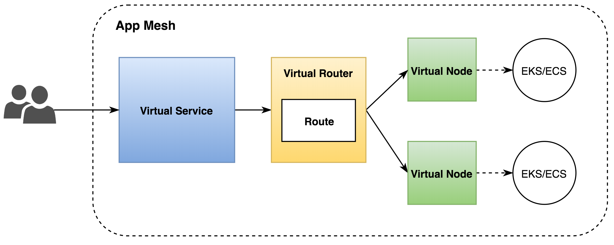
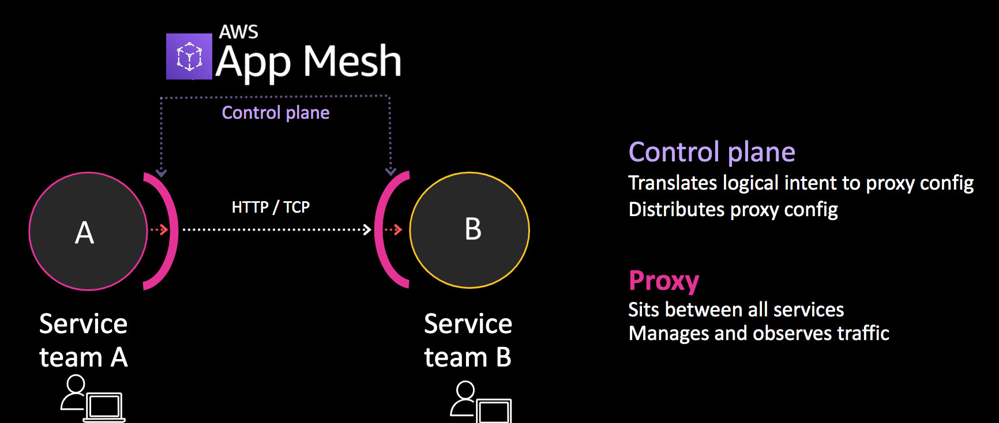
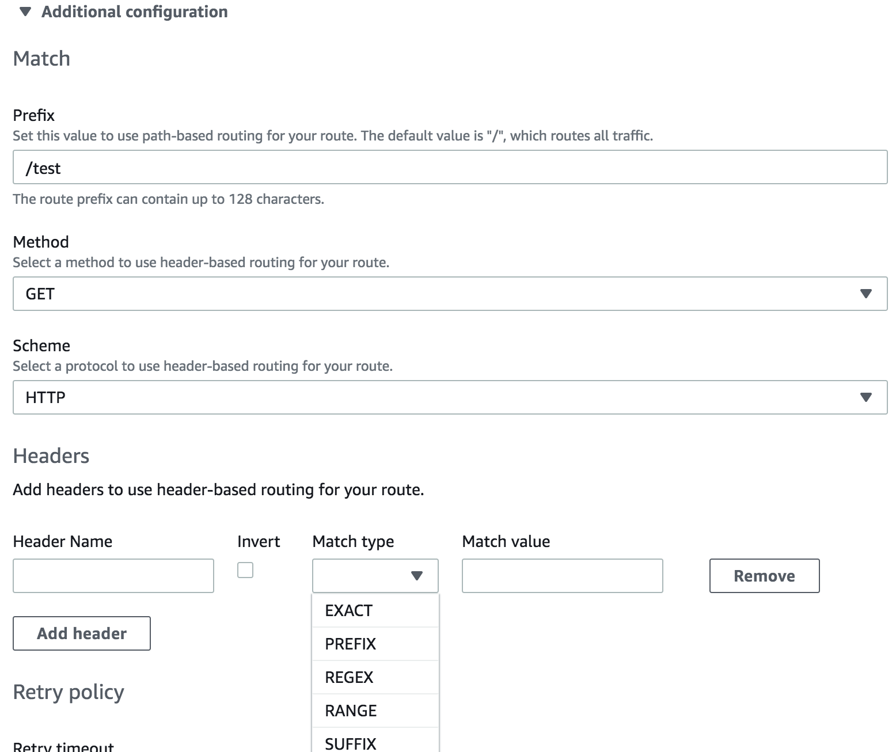
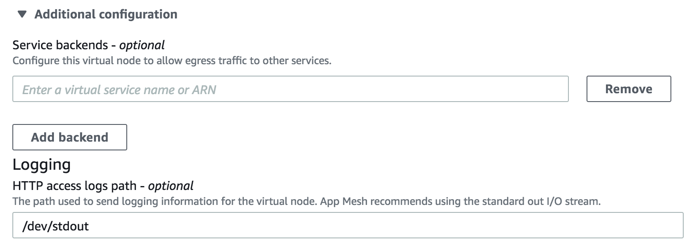

作者：马若飞，lead software engineer in FreeWheel，《Istio实战指南》作者，ServiceMesher社区管委会成员。

## 前言

近两年随着微服务架构的流行，服务网格（Service Mesh）技术受到了越来越多的人关注，并拥有了大批的拥趸。目前市面上比较成熟的开源服务网格主要有下面几个：Linkerd，这是第一个出现在公众视野的服务网格产品，由Twitter的finagle库衍生而来，目前由Buoyant公司负责开发和维护；Envoy，Lyft开发并且是第一个从CNCF孵化的服务网格产品，定位于通用的数据平面或者单独作为Sidecar代理使用；Istio，由Google、IBM、Lyft联合开发的所谓第二代服务网格产品，控制平面的加入使得服务网格产品的形态更加完整。

服务网格技术作为构建云原生应用的重要一环，逐渐的被越来越多的人和厂商认可，并看好它的发展前景。在Istio大红大紫的今天，作为和Google在云服务市场竞争的Amazon来说，自然不愿错失这块巨大的蛋糕。他们在今年4月份发布了自己的服务网格产品：AWS App Mesh。本文会聚焦于Istio和App Mesh这两个产品，通过横向的对比分析让大家对它们有一个更深入的认识。

## 概念

### 产品定位

从官方的介绍来看，Istio和App Mesh都比较明确的表示自己是一种服务网格产品。Istio强调了自己在连接、安全、控制和可视化4个方面的能力；而App Mesh主要强调了一致的可见性和流量控制这两方面能力，当然也少不了强调作为云平台下的产品的好处：托管服务，无需自己维护。

从某种程度上讲，Istio是一个相对重一点的解决方案，提供了不限于流量管理的各个方面的能力；而App Mesh是更加纯粹的服务于运行在AWS之上的应用并提供流控功能。笔者认为这和它目前的产品形态还不完善有关（后面会具体提到）。从与AWS内部开发人员的沟通中可以感觉到，App Mesh应该是一盘很大的棋，目前只是初期阶段而已。

### 核心术语

和AWS里很多产品一样，App Mesh也不是独创，而是基于Envoy开发的。AWS这样的闭环生态必然要对其进行改进和整合。同时，也为了把它封装成一个对外的服务，提供适当的API接口，在App Mesh这个产品中提出了下面几个重要的技术术语，我们来一一介绍一下。

- 服务网格（Service mesh）：服务间网络流量的逻辑边界。这个概念比较好理解，就是为使用App mesh的服务圈一个虚拟的边界。
- 虚拟服务（Virtual services）：是真实服务的抽象。真实服务可以是部署于抽象节点的服务，也可以是间接的通过路由指向的服务。
- 虚拟节点（Virtual nodes）：虚拟节点是指向特殊工作组（task group）的逻辑指针。例如AWS的ECS服务，或者Kubernetes的Deployment。可以简单的把它理解为是物理节点或逻辑节点的抽象。
- Envoy：AWS改造后的Envoy（未来会合并到Envoy的官方版本），作为App Mesh里的数据平面，Sidecar代理。
- 虚拟路由器（Virtual routers）：用来处理来自虚拟服务的流量。可以理解为它是一组路由规则的封装。
- 路由（Routes）：就是路由规则，用来根据这个规则分发请求。



上面的图展示了这几个概念的关系：当用户请求一个虚拟服务时，服务配置的路由器根据路由策略将请求指向对应的虚拟节点，这些节点本质上是AWS里的EKS或者ECS的节点。

那么这些App Mesh自创的术语是否能在Istio中找到相似甚至相同的对象呢？我归纳了下面的表格来做一个对比：

| App Mesh                      | Istio                                                        |
| ----------------------------- | ------------------------------------------------------------ |
| 服务网格（Service mesh）      | Istio并未显示的定义这一概念，我们可以认为在一个集群中，由Istio管理的服务集合，它们组成的网络拓扑即是服务网格。 |
| 虚拟服务（Virtual services）  | Istio中也存在虚拟服务的概念。它的主要功能是定义路由规则，使请求可以根据这些规则被分发到对应的服务。从这一点来说，它和App Mesh的虚拟服务的概念基本上是一致的。 |
| 虚拟节点（Virtual nodes）     | Istio没有虚拟节点的概念，可以认为类似Kubernetes里的Deployment。 |
| 虚拟路由器（Virtual routers） | Istio也没有虚拟路由器的概念。                                |
| 路由（Routes）                | Istio中的目标规则（DestinationRule）和路由的概念类似，为路由设置一些策略。从配置层面讲，其中的子集（subset）和App Mesh路由里选择的目标即虚拟节点对应。但Istio的目标规则更加灵活，也支持更多的路由策略。 |

从上面的对比看出，App Mesh目前基本上实现了最主要的流量控制（路由）的功能，但像超时重试、熔断、流量复制等高级一些的功能还没有提供，有待进一步完善。

## 架构

AWS App Mesh是一个商业产品，目前还没有找到架构上的技术细节，不过我们依然可以从现有的、公开的文档或介绍中发现一些有用的信息。


从这张官网的结构图中可以看出，每个服务的橙色部分就是Sidecar代理：Envoy。而中间的AWS App Mesh其实就是控制平面，用来控制服务间的交互。那么这个控制平面具体的功能是什么呢？我们可以从今年的AWS Summit的一篇PPT中看到这样的字样：

>控制平面用来把逻辑意图转换成代理配置，并进行分发。



熟悉Istio架构的朋友有没有觉得似曾相识？没错，这个控制平面的职责和Pilot基本一致。由此可见，不管什么产品的控制平面，也必须具备这些核心的功能。

那么在平台的支持方面呢？下面这张图展示了App Mesh可以被运行在如下的基础设施中，包括EKS、ECS、EC2等等。当然，这些都必须存在于AWS这个闭环生态中。


而Istio这方面就相对弱一些。尽管Istio宣称是支持多平台的，但目前来看和Kubernetes还是强依赖。不过它并不受限于单一的云平台，这一点有较大的优势。

从可观测性来看，App Mesh依然发挥了自家生态的优势，可以方便的接入CloudWatch、X-Ray对服务进行观测。另外，App Mesh也提供了更大的灵活性，可以在虚拟节点里配置服务后端（可以是虚拟服务或者ARN），流量可以出站到这些配置的服务。这一点来说，和Istio的Mixer又有了异曲同工之妙。Mixer通过插件方式为Istio提供了极大的可扩展性，App Mesh在这一点上也不算落下风。

Istio的架构大家都非常熟悉了，这里就不再赘述了，感兴趣的同学可以直接去[官网](https://istio.io/docs/concepts/what-is-istio/)查看。

## 功能与实现方式

### 部署

Istio部署后类似一个网一样附着在你的Kubernetes集群上， 控制平面会使用你设置的资源；而App Mesh是一种托管方式，只会使用Envoy代理。完整安装后的Istio需要添加50个左右的CRD，而App Mesh只添加了3个CRD：`meshes.appmesh.k8s.aws`，`virtualnodes.appmesh.k8s.aws`和`virtualservices.appmesh.k8s.aws`。这一点也反映出了功能上的区别。

### 流量控制

尽管两者的数据平面都是基于Envoy，但它们提供的流量控制能力目前还是有比较大的差距的。在路由的设置方面，App Mesh提供了相对比较丰富的匹配策略，基本能满足大部分使用场景。下面是App Mesh控制台里的路由配置截图，可以看出，除了基本的URI前缀、HTTP Method和Scheme外，也支持请求头的匹配。



Istio的匹配策略更加完善，除了上面提到的，还包括HTTP Authority，端口匹配，请求参数匹配等，具体信息可以从官方文档的虚拟服务[设置](https://istio.io/docs/reference/config/networking/v1alpha3/virtual-service/#HTTPMatchRequest)查看。下面两段yaml分别展示了两个产品在虚拟服务配置上的差异。

App Mesh配置：

```yaml
apiVersion: appmesh.k8s.aws/v1beta1
kind: VirtualService
metadata:
  name: my-svc-a
  namespace: my-namespace
spec:
  meshName: my-mesh
  routes:
    - name: route-to-svc-a
      http:
        match:
          prefix: /
        action:
          weightedTargets:
            - virtualNodeName: my-app-a
              weight: 1
```

Istio配置：

```yaml
apiVersion: networking.istio.io/v1alpha3
kind: VirtualService
metadata:
  name: ratings-route
spec:
  hosts:
  - ratings.prod.svc.cluster.local
  http:
  - match:
    - headers:
        end-user:
          exact: jason
      uri:
        prefix: "/ratings/v2/"
      ignoreUriCase: true
    route:
    - destination:
        host: ratings.prod.svc.cluster.local
```

另外一个比较大的不同是，App Mesh需要你对不同版本的服务分开定义（即定义成不同的虚拟服务），而Istio是通过目标规则 `DestinationRule` 里的子集 `subsets` 和路由配置做的关联。本质上它们没有太大区别。

除了路由功能外，App Mesh就显得捉襟见肘了。就在笔者撰写本文时，AWS刚刚添加了重试功能。而Istio借助于强大的Envoy，提供了全面的流量控制能力，如超时重试、故障注入、熔断、流量镜像等。

### 安全

在安全方面，两者的实现方式具有较大区别。默认情况下，一个用户不能直接访问App Mesh的资源，需要通过AWS的[IAM策略](https://docs.aws.amazon.com/app-mesh/latest/userguide/IAM_policies.html)给用户授权。比如下面的配置是容许用户用任意行为去操作网格内的任意资源：

```json
{
    "Version": "2012-10-17",
    "Statement": [
        {
            "Effect": "Allow",
            "Action": [
                "appmesh:*"
            ],
            "Resource": "*"
        }
    ]
}
```

而虚拟节点间的授权方面，App Mesh目前只有TLS访问的支持，且仅仅是预览版（Preview）并未正式发布。下面的配置展示了一个虚拟节点只容许`tls`方式的访问：

```json
{
   "meshName" : "app1",
   "spec" : {
      "listeners" : [
         {
            "portMapping" : {
               "port" : 80,
               "protocol" : "http"
            },
            "tls" : {
               "mode" : "STRICT",
               "certificate" : {
                  "acm" : {
                     "certificateArn" : "arn:aws:acm:us-west-2:123456789012:certificate/12345678-1234-1234-1234-123456789012"
                  }
               }
            }
         }
      ],
      "serviceDiscovery" : {
         "dns" : {
            "hostname" : "serviceBv1.mesh.local"
         }
      }
   },
   "virtualNodeName" : "serviceBv1"
}
```

而Istio中端到端的认证是支持mTLS的，同时还支持JWT的用户身份认证。下面的配置分别展示了这两种认证方式：

```yaml
apiVersion: "authentication.istio.io/v1alpha1"
kind: "Policy"
metadata:
  name: "reviews"
spec:
  targets:
  - name: reviews
  peers:
  - mtls: {}
```

```yaml
origins:
- jwt:
    issuer: "https://accounts.google.com"
    jwksUri: "https://www.googleapis.com/oauth2/v3/certs"
    trigger_rules:
    - excluded_paths:
      - exact: /health
```

Istio的授权是通过RBAC实现的，可以提供基于命名空间、服务和HTTP方法级别的访问控制。这里就不具体展示了，大家可以通过官网[文档](https://istio.io/docs/concepts/security/#authorization-policy)来查看。

### 可观察性

一般来说，可以通过三种方式来观察你的应用：指标数据、分布式追踪、日志。Istio在这三个方面都有比较完整的支持。指标方面，可以通过Envoy获取请求相关的数据，同时还提供了服务级别的指标，以及控制平面的指标来检测各个组件的运行情况。通过内置的Prometheus来收集指标，并使用Grafana展示出来。分布式追踪也支持各种主流的OpenTracing工具，如Jaeger、Zipkin等。访问日志一般都通过ELK去完成收集、分析和展示。另外，Istio还拥有Kiali这样的可视化工具，给你提供整个网格以及微服务应用的拓扑视图。总体来说，Istio在可观察方面的能力是非常强大的，这主要是因为Mixer组件的插件特性带来了巨大的灵活性。

App Mesh在这方面做的也不错。在如下图虚拟节点的配置中可以看到，你可以配置服务的后端基础设施，这样流量就可以出站到这些服务。同时，在日志收集方面，也可以配置到本地日志，或者是其他的日志系统。



另一方面，AWS又一次发挥了自己闭环生态的优势，提供了App Mesh与自家的CloudWatch、X-Ray这两个监控工具的整合。总的来说，App Mesh在可观察性上也不落下风。

## 总结

AWS App Mesh作为一个今年4月份才发布的产品，在功能的完整性上和Istio有差距也是情有可原的。从App Mesh的[Roadmap](https://github.com/aws/aws-app-mesh-roadmap/projects/1)可以看出，很多重要的功能，比如熔断已经在开发计划中。以笔者与AWS的开发人员了解的信息来看，他们还是相当重视这个产品，优先级很高，进度也比较快，之前还在预览阶段的重试功能在上个月也正式发布了。另外，App Mesh是可以免费使用的，用户只需要对其中的实例资源付费即可，没有额外费用。App Mesh一部分的开发重点是和现有产品的整合，比如Roadmap列出的使用AWS Gateway作为App Mesh的Ingress。借助着自己的生态优势，这种整合即方便快捷的完善了App Mesh，同时又让生态内的产品结合的更紧密，使得闭环更加的牢固，不得不说是一步好棋。

和App Mesh目前只强调流控能力不同，Istio更多的是把自己打造成一个更加完善的、全面的服务网格系统。架构优雅，功能强大，但性能上受到质疑。在产品的更迭上貌似也做的不尽如人意（不过近期接连发布了1.3到1.3.3版本，让我们对它的未来发展又有了期待）。Istio的优势在于3大顶级技术公司加持的强大资源，加上开源社区的反哺，控制好的话容易形成可持续发展的局面，并成为下一个明星级产品。但目前各大厂商都意识到了网格的重要性并推出自己的产品（AWS App Mesh，Kong的Kuma等），竞争也会逐渐激烈。未来是三分天下还是一统山河，让我们拭目以待。

## 参考

[what is app mesh](https://docs.aws.amazon.com/app-mesh/latest/userguide/what-is-app-mesh.html)

[aws app mesh roadmap](https://github.com/aws/aws-app-mesh-roadmap/projects/1)

[Redefining application communications with AWS App Mesh](https://www.allthingsdistributed.com/2019/03/redefining-application-communications-with-aws-app-mesh.html)

[istio offical](https://istio.io/)


