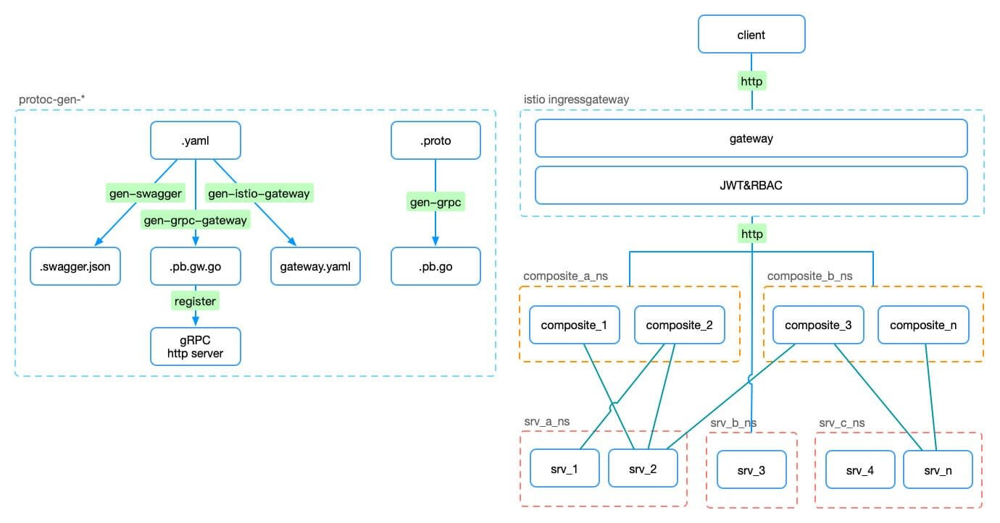
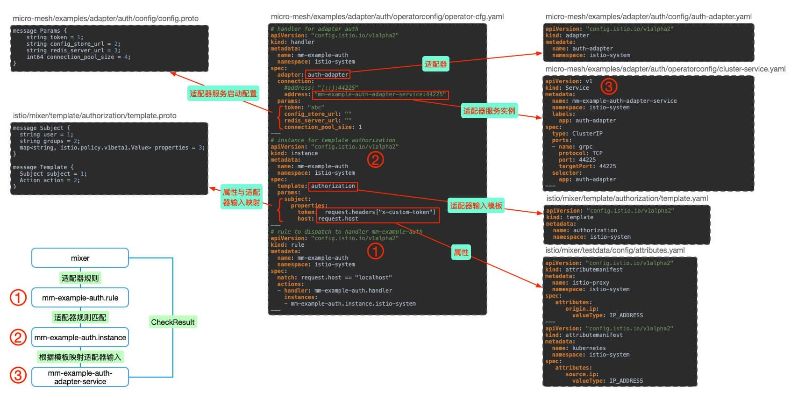

快速开始：[https://micro-mesh/examples/adapter/auth](https://github.com/hb-go/micro-mesh/tree/master/examples/adapter/auth)源码传送门。

研究Istio下构建简洁的微服务架构，对Istio的研究也更深入，自定义Mixer Adapter必不可少，以下结合使用场景做一个自定义适配器的实践分享。

## 背景



结合[https://github.com/hb-go/micro-mesh](https://github.com/hb-go/micro-mesh#micro-mesh)的实践场景，需要在`ingressgateway`与`API service`间加入认证&鉴权(JWT&RBAC)，自然考虑Istio提供的[安全](https://istio.io/zh/docs/concepts/security/)方案，但使用JWT做认证鉴权在后端是无状态的，这样在使用场景上有一定限制，如:

- 密码修改、终端连接限制等场景下无法踢除
- 访问控制策略无法实时生效

> 默认方案只是在一些场景下不合适，根据具体需求考虑。

基于这样的场景可以自定义Adapter来实现，目标:

- Token-JWT
  - 服务端验证token有效性
  - 应对密码修改、终端数量限制等场景
- ACL-[Casbin](http://github.com/casbin/casbin)
  - 服务端获取用户角色，做API访问控制
  - 用户角色及接口授权策略实时生效

以下示例对token验证、访问控制不做具体设计，重点介绍如何自定义一个`auth-adapter`

## 自定义Adapter介绍

配置关系及执行流程如图：



- 属性：使用`istio`的`attributes`，`istio/mixer/testdata/config/attributes.yaml`
- 属性与适配器输入映射模板：使用`istio`的`authorization`模板，`istio/mixer/template/authorization/template.yaml`，通过`template.proto`查看协议内容
- 适配器，`micro-mesh/examples/adapter/auth/config/auth-adapter.yaml`
  - `go generate ./...`自动生成
- 适配器服务启动配置，`micro-mesh/examples/adapter/auth/config/config.proto`
- 适配器服务实例，`micro-mesh/examples/adapter/auth/operatorconfig/cluster-service.yaml`
- 适配器配置，`micro-mesh/examples/adapter/auth/operatorconfig/operator-cfg.yaml`

##### 目录结构

```bash
bin                         执行文件
cmd                         
  └ main.go                 适配器入口
config                      配置协议
  ├ adapter.auth.config.pb.html                 #go generate ./... 自动生成
  ├ auth-adapter.yaml       适配器描述文件       #go generate ./... 自动生成
  ├ config.pb.go                                #go generate ./... 自动生成
  ├ config.proto            适配器服务启动配置
  └ config.proto_descriptor                     #go generate ./... 自动生成
operatorconfig              k8s配置
  ├ attributes.yaml         属性                  #copy istio/mixer/testdata/config/attributes.yaml
  ├ cluster-service.yaml    适配器服务实例
  ├ operator-cfg.yaml       适配器配置
  └ template.yaml           属性与适配器输入模板    #copy istio/mixer/template/authorization/template.yaml
testdata                    测试配置
  ├ attributes.yaml         属性                  #copy istio/mixer/testdata/config/attributes.yaml
  ├ auth-adapter.yaml       适配器描述文件         #copy config/auth-adapter.yaml
  ├ operator-cfg.yaml       适配器配置
  └ template.yaml           属性与适配器输入模板    #copy istio/mixer/template/authorization/template.yaml
auth.go                     适配器服务实现
Dockerfile                  Docker镜像
```

有3处与适配器实现相关：

- 适配器服务启动配置`config/config.proto`
- 适配器服务实现`auth.go`
- 适配器入口`cmd/main.go`

------

> 接下来使用[micro-mesh/examples/adapter/auth](https://github.com/hb-go/micro-mesh/tree/master/examples/adapter/auth)源码按步骤操作，实现本地及`K8S`环境的测试部署。

## 步骤

**开发环境**

- OSX
- Go **1.11.1**
- protoc **libprotoc 3.6.1**
- Istio **1.0.6**

### 1.Istio源码

```bash
mkdir -p $GOPATH/src/istio.io/
cd $GOPATH/src/istio.io/
git clone https://github.com/istio/istio.git
```

### 2.micro-mesh源码

```bash
git clone https://github.com/hb-go/micro-mesh.git
```

### 3.Mixer开发工具

```bash
# build mixer server & client 
cd istio
make mixs
make mixc
```

在`$GOPATH/out/darwin_amd64/release/`生成`mixs`、`mixc`。

### 4.构建Auth adapter项目

```bash
# copy auth adapter example
cp {micro-mesh path}/examples/adapter/auth mixer/adapter/auth

cd mixer/adapter/auth
```

**Optional**

可以删除`config`目录除`config.proto`外的其他文件，看执行go generate后的结果

```bash
go generate ./...
go build ./...
```

`go generate`根据`config/config.proto`以及`auth.go`的注释自动生成`config`目录下的其他文件:

- adapter.auth.config.pb.html
- auth-adapter.yaml
- config.pb.go
- config.proto_descriptor

> 根据`auth.go`的以下注释，`mixer_codegen.sh`使用`authorization`模板生成`name`为`auth-adapter`的适配器。

```go
// nolint:lll
// Generates the auth adapter's resource yaml. It contains the adapter's configuration, name, supported template
// names (metric in this case), and whether it is session or no-session based.
//go:generate $GOPATH/src/istio.io/istio/bin/mixer_codegen.sh -a mixer/adapter/auth/config/config.proto -x "-s=false -n auth-adapter -t authorization"
```

### 5.本地测试

本地测试使用testdata下的配置，其中`operator-cfg.yaml`有几处与正式部署不同：

- `handler`的`address`使用本地服务`"[::]:44225"`
- 为了方便测试`instance`的`params`参数以及`rule`的`math`条件做了简化

```bash
# 启动适配器服务
go run cmd/main.go 44225

# 使用testdata下配置启动mixer server
$GOPATH/out/darwin_amd64/release/mixs server \
--configStoreURL=fs://$GOPATH/src/istio.io/istio/mixer/adapter/auth/testdata \
--log_output_level=attributes:debug

# 测试Adapter是否生效
$GOPATH/out/darwin_amd64/release/mixc check -s request.host="localhost" --stringmap_attributes "request.headers=x-custom-token:efg"
# Check RPC completed successfully. Check status was PERMISSION_DENIED (mm-example-auth.handler.istio-system:Unauthorized...)

$GOPATH/out/darwin_amd64/release/mixc check -s request.host="localhost" --stringmap_attributes "request.headers=x-custom-token:abc"
# Check RPC completed successfully. Check status was OK
```

> NOTE:出现预期结果不一致可能是由于mixer cache导致`Valid use count: 10000, valid duration: 9.726875254s`，请参考[Istio Mixer Cache](http://www.servicemesher.com/categories/istio-mixer-cache)系列文章了解。

### 6.打包镜像

```bash
# build执行文件
CGO_ENABLED=0 GOOS=linux \
    go build -a -installsuffix cgo -v -o bin/auth ./cmd/
    
# docker镜像
docker build -t hbchen/micro-mesh-example-adapter-auth:v0.0.1 .
docker push hbchen/micro-mesh-example-adapter-auth:v0.0.1
```

### 7.Istio环境部署

**部署环境**

- GKE **1.11.7-gke.4**
- Istio **1.0.0**

```bash
# 属性、模板
# attributes.yaml -> istio/mixer/testdata/config/attributes.yaml 
# template.yaml -> istio/mixer/template/authorization/template.yaml
kubectl apply -f examples/adapter/auth/testdata/attributes.yaml -f examples/adapter/auth/testdata/template.yaml

# 适配器
kubectl apply -f examples/adapter/auth/config/auth-adapter.yaml
```

> 这里是以[micro-mesh](https://github.com/hb-go/micro-mesh)示例为基础的配置，如果使用`bookinfo`或者自己的服务需要做相应的修改

`operator-cfg.yaml`与本地测试配置不同：

- `handler`的`address`使用集群服务`"mm-example-auth-adapter-service:44225"`
- `instance`的`params`根据`authorization`模板及`auth-adapter`服务的需求配置
- `rule`的`match`条件使用`destination.service == "mm-example-api.default.svc.cluster.local"`，仅对`mm-example-api`服务生效

```bash
# 适配器服务实例部署
kubectl apply -f examples/adapter/auth/operatorconfig/cluser-service.yaml

# 适配器配置
kubectl apply -f examples/adapter/auth/operatorconfig/operator-cfg.yaml
```

### 8.Istio环境部署测试

> 如果没有开Gateway的JWT验证可以忽略`Authorization`，其实做了自定义Auth后是多余的😂

```bash
TOKEN=$(curl https://raw.githubusercontent.com/istio/istio/release-1.1/security/tools/jwt/samples/demo.jwt -s)

curl -H "Authorization: Bearer $TOKEN" -H "x-custom-token: efg" -X GET http://35.193.180.18/v1/example/call/Hobo
curl -H "Authorization: Bearer $TOKEN" -H "x-custom-token: abc" -X GET http://35.193.180.18/v1/example/call/Hobo
```

## 参考

- [Mixer Out of Process Adapter Walkthrough](https://github.com/istio/istio/wiki/Mixer-Out-of-Process-Adapter-Walkthrough)
- [Simple Istio Mixer Out of Process Authorization Adapter](https://medium.com/google-cloud/simple-istio-mixer-out-of-process-authorization-adapter-5f9363cd9bbc)
