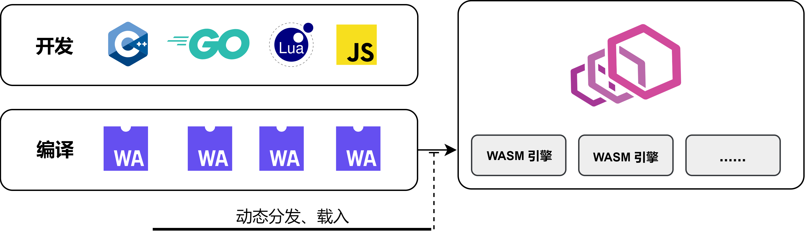
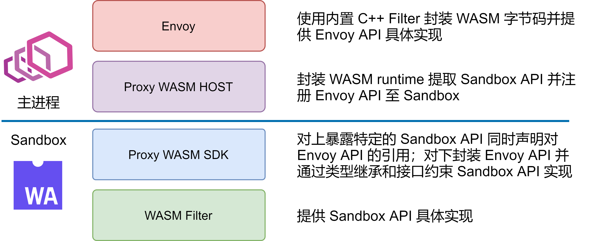

在 Envoy 网关和 Service Mesh 服务网格落地过程中，大部分组织和公司几乎不可避免的需要对 Envoy 做一些二次开发和功能增强，以应对自身的个性化需求，只是或多或少的问题。虽然 Envoy 本身基于 L4/L7 Filter 提供了非常灵活可扩展性，可以让开发者在各个层级对 Envoy 进行扩展。然而以现有的 Filter 开发流程太过繁琐沉重。一个简单的功能扩展都需要重新构建整个 Envoy，升级和部署也涉及到服务重启等问题。

为此，Envoy 社区在 Envoy 中嵌入了 WASM 虚拟机以获得一个安全的沙箱环境，用于动态加载和运行可拔插的扩展代码（被编译为 WASM 字节码），简化 Envoy 二次开发和功能增强的复杂度。实际上，在 Envoy 社区将该特性合入主干之前，Istio 社区就已经在力推该特性，并基于该特性重写了部分的功能扩展。

网易数帆旗下轻舟云原生团队也一直在关注社区的进展和动态。轻舟微服务在各个业务方落地的过程中，业务方的定制化需求往往难以避免，而随着业务方的不断增多，如何管理这些不断横向膨胀的定制化需求，避免它们成为轻舟微服务产品本身演进的负累是一个关键问题。而 WASM 则是一个可能的答案。此外，轻舟团队自研的类 OpenResty Lua 框架也是一个解决方案，其原理本质上也和 WASM 类似，利用 Envoy 中嵌入的 LuaJIT 来运行动态 Lua 脚本，不过这不是本文的讨论范畴。

说回到 WASM。WASM 本身是源自前端的技术，是为了解决日益复杂的前端 Web 应用以及有限的 JS 脚本解释性能而诞生的技术（有别于 JIT 的另一条路线）。WASM 并不是一种语言，而是字节码标准。理论上任何一种语言，都可以被编译成 WASM 字节码，然后在WASM虚拟机中执行。其原理如下图所示：



本文旨在从源码角度解析 Envoy 和 WASM 沙箱是如何桥接的。希望读者通过阅读本文，能够对 Envoy WASM 的接入有一定的了解。在实践的过程之中，能够帮助读者在繁杂的类型关系和调用链路中理清思路。本文默认读者具备一定的 Envoy 知识基础并且对 Envoy Filter 机制具备一定的了解。如果仅仅是希望使用 WASM 而不需要深入了解或者二次开发 Envoy WASM，那么可以阅读 SDK 文档即可。

```cpp
commit: f6cc741026445382d5869e97cf7c9c36a44b57a9
```

## 1. 从 Envoy 开始

Envoy 支持使用使用 WASM 来扩展七层 HTTP Filter 或者四层 Network Filter。但是无论是七层 HTTP Filter 还是四层 Network Filter，其本质都是类似的。Envoy 内置了一个原生 C++ HTTP Filter 和一个原生 C++ Network Filter 用于封装 WASM API，管理 WASM Sandbox，载入 WASM 字节码并且对 Envoy 暴露标准的 HTTP Filter 和 Network Filter 接口。它们是 WASM 字节码管理者，也是 WASM 沙箱和 Envoy 主干交互的桥梁。

此处使用接口相对更加复杂的 HTTP Filter 作为示例来作为源码阅读的起点。（在具体的实践当中，一个功能完备的 Network Filter 往往会比 HTTP Filter 复杂不少，但是这种复杂性主要在 Filter 实现内部。就暴露的接口来说，反而是 HTTP Filter 具备更多的接口和相对复杂的处理。）

一般来说，对于一个普通的 C++ HTTP Filter，在配置的初始化阶段，Envoy 会完成 Proto 配置（通过静态文件或者 xDS 协议获取）的加载和初始化。**而在请求阶段，对于每个 HTTP 请求，Envoy 会根据 HCM（HTTP Connection Manager，用于处理 HTTP 协议的四层 Network Filter） 的配置创建一个 HTTP Filter 链。并且将每个 HTTP Filter 的配置注入到对应的 Filter 实例中。**

所以了解 WASM 扩展的第一步，就是看 Envoy 是如何创建一个 HTTP WASM Filter 的。前面提到过，WASM 扩展会经过内置 C++ 插件的包装，所以在 Envoy 主体看来，创建 WASM 扩展的过程其实就是创建一个普通的 C++ Filter 的过程，只不过该 Filter 使用 WASM 字节码作为它的输入配置（本质上就是 Lua Filter 和 Lua 脚本的关系）。

其源码如下所示。`createFilterFactoryFromProtoTyped` 只会在配置初始化阶段执行一次。之后，每当请求到来，其返回的闭包函数就会被执行，用于创建 WASM HTTP Filter 实例来请求处理。

从代码不难看出 `FilterConfig` 是一个关键类型。因为最终的 Filter 实例是调用 `FilterConfig` 的 `createFilter` 接口创建出来的。

```cpp
// source/extensions/filters/http/wasm/config.cc

Http::FilterFactoryCb WasmFilterConfig::createFilterFactoryFromProtoTyped(
    const envoy::extensions::filters::http::wasm::v3::Wasm& proto_config, const std::string&,
    Server::Configuration::FactoryContext& context) {
  // 根据 Proto 配置初始化 filter_config
  auto filter_config = std::make_shared<FilterConfig>(proto_config, context);
  return [filter_config](Http::FilterChainFactoryCallbacks& callbacks) -> void {
    // 创建 WASM HTTP Filter 实例
    auto filter = filter_config->createFilter();
    if (!filter) { // Fail open
      return;
    }
    callbacks.addStreamFilter(filter);
    callbacks.addAccessLogHandler(filter);
  };
}
```

**小结：Envoy 通过一个内置的七层 HTTP Filter 和一个内置的四层 Network Filter 充当包装器，管理 WASM runtime 并与 WASM Sandbox 交互以实现 HTTP Filter 或者 Network Filter 的相关功能。**

## 2. 创建一个沙箱

`FilterConfig` 只提供了一个 `createFilter` 接口。其核心的内容都在构造函数当中。其构造函数源码如下：

```cpp
// source/extensions/filters/http/wasm/wasm_filter.cc

FilterConfig::FilterConfig(const envoy::extensions::filters::http::wasm::v3::Wasm& config,
                           Server::Configuration::FactoryContext& context)
    : tls_slot_(
          ThreadLocal::TypedSlot<Common::Wasm::PluginHandle>::makeUnique(context.threadLocal())) {
  plugin_ = std::make_shared<Common::Wasm::Plugin>(
      config.config().name(), config.config().root_id(), config.config().vm_config().vm_id(),
      config.config().vm_config().runtime(),
      Common::Wasm::anyToBytes(config.config().configuration()), config.config().fail_open(),
      context.direction(), context.localInfo(), &context.listenerMetadata());

  auto plugin = plugin_;、
  // 回调函数，当成功创建 WASM 虚拟机之后执行，用于在每个 Worker 线程之中都拷贝创建一个 WASM 虚拟机
  auto callback = [plugin, this](const Common::Wasm::WasmHandleSharedPtr& base_wasm) {
    // NB: the Slot set() call doesn't complete inline, so all arguments must outlive this call.
    tls_slot_->set([base_wasm, plugin](Event::Dispatcher& dispatcher) {
      return Common::Wasm::getOrCreateThreadLocalPlugin(base_wasm, plugin, dispatcher);
    });
  };
	// 根据配置创建 WASM 虚拟机
  if (!Common::Wasm::createWasm(
          config.config().vm_config(), plugin_, context.scope().createScope(""),
          context.clusterManager(), context.initManager(), context.dispatcher(), context.api(),
          context.lifecycleNotifier(), remote_data_provider_, std::move(callback))) {
    throw Common::Wasm::WasmException(
        fmt::format("Unable to create Wasm HTTP filter {}", plugin->name_));
  }
}
```

`Common::Wasm::Plugin` 此处略去对它的介绍。读者只需要知道它是对 **WASM 字节码、字节码插件本身配置**以及一些 Filter 状态的封装和集合即可。

在 `FilterConfig` 的构造函数当中，有一个关键函数，`Common::Wasm::createWasm`。它用于创建一个 WASM 虚拟机。该函数相对复杂，故而此处只粘贴出关键内容。其主要工作如下：

- 根据配置中 WASM 字节码位置（本地或者远程），读取字节码
- 创建 WASM 虚拟机

```cpp
// source/extensions/common/wasm/wasm.cc

static bool createWasmInternal(const VmConfig& vm_config, const PluginSharedPtr& plugin,
                               const Stats::ScopeSharedPtr& scope,
                               Upstream::ClusterManager& cluster_manager,
                               Init::Manager& init_manager, Event::Dispatcher& dispatcher,
                               Api::Api& api, Server::ServerLifecycleNotifier& lifecycle_notifier,
                               Config::DataSource::RemoteAsyncDataProviderPtr& remote_data_provider,
                               CreateWasmCallback&& cb,
                               CreateContextFn create_root_context_for_testing = nullptr) {
  // ......

	// 该闭包函数接受字节码 code 为参数，并捕获了相关的配置以及关键上下文
  auto complete_cb = [cb, vm_config, plugin, scope, &cluster_manager, &dispatcher,
                      &lifecycle_notifier, create_root_context_for_testing,
                      wasm_extension](std::string code) -> bool {
    if (code.empty()) {
      cb(nullptr);
      return false;
    }
    // proxy_wasm 是一个关键外部依赖，是对 WASM 虚拟机环境的封装
    auto vm_key =
        proxy_wasm::makeVmKey(vm_config.vm_id(), anyToBytes(vm_config.configuration()), code);
    auto wasm_factory = wasm_extension->wasmFactory();
    proxy_wasm::WasmHandleFactory proxy_wasm_factory =
        [&vm_config, scope, &cluster_manager, &dispatcher, &lifecycle_notifier,
         wasm_factory](absl::string_view vm_key) -> WasmHandleBaseSharedPtr {
      return wasm_factory(vm_config, scope, cluster_manager, dispatcher, lifecycle_notifier,
                          vm_key);
    };
    // 调用 proxy_wasm 中 createWasm 函数创建 WASM 沙箱
    auto wasm = proxy_wasm::createWasm(
        vm_key, code, plugin, proxy_wasm_factory,
        getCloneFactory(wasm_extension, dispatcher, create_root_context_for_testing),
        vm_config.allow_precompiled());
    Stats::ScopeSharedPtr create_wasm_stats_scope =
        wasm_extension->lockAndCreateStats(scope, plugin);
    wasm_extension->onEvent(toWasmEvent(wasm), plugin);
    if (!wasm || wasm->wasm()->isFailed()) {
      ENVOY_LOG_TO_LOGGER(Envoy::Logger::Registry::getLog(Envoy::Logger::Id::wasm), trace,
                          "Unable to create Wasm");
      cb(nullptr);
      return false;
    }
    // 执行 FilterConfig 中的回调函数，在各个 Worker 中创建 WASM 沙箱
    cb(std::static_pointer_cast<WasmHandle>(wasm));
    return true;
  };

  // ......
}
```

此处出现了一个全新的名称空间，`proxy_wasm`。`prxoy_wasm` 由一个关键的外部依赖提供，由 Envoy 社区和 Istio 社区等共同维护。它包含了对 WASM 虚拟机的封装。

其工程路径为：

```cpp
[https://github.com/proxy-wasm/proxy-wasm-cpp-host](https://github.com/proxy-wasm/proxy-wasm-cpp-host)
commit: cce535101c3b1cab61fb6bf83a61b0e9834bd957
```

**小结：FilterConfig 是 Envoy HTTP WASM Filter 机制的核心。它会在构造过程中根据配置以及字节码创建 WASM Sandbox。而 WASM Sandbox 创建需要外部依赖 proxy_wasm 的介入。**

## 3. 创建一个沙箱-续

从前文的代码不难发现，WASM 沙箱的创建需要 `proxy_wasm` 的介入。 现在开始进入 `proxy_wasm` 的世界。在前文源码中，主要包含 `proxy_wasm` 中两个函数。其中 `proxy_wasm::makeVmKey` 相对简单，主要作用是根据 WASM 字节码、WASM 沙箱配置（是沙箱本身配置而非运行在沙箱中的字节码插件配置）计算出一个 WASM 虚拟机 ID。该 ID 将唯一标识同一线程中的一个沙箱。

关键是第二个函数 `proxy_wasm::createWasm`。其中有四个重要的参数：

- vm_key：沙箱唯一标识
- code：字节码
- plugin：FilterConfig 构造函数中创建的 `Common::Wasm::Plugin` 对象实例
- proxy_wasm_factory：创建 WASM 虚拟机环境的工厂闭包函数

接下来，看看 `proxy_wasm::createWasm` 函数的源码：

```cpp
std::shared_ptr<WasmHandleBase> createWasm(std::string vm_key, std::string code,
                                           std::shared_ptr<PluginBase> plugin,
                                           WasmHandleFactory factory,
                                           WasmHandleCloneFactory clone_factory,
                                           bool allow_precompiled) {
  std::shared_ptr<WasmHandleBase> wasm_handle;
  {
    std::lock_guard<std::mutex> guard(base_wasms_mutex);
    if (!base_wasms) {
      base_wasms = new std::remove_reference<decltype(*base_wasms)>::type;
    }
    // base_wasms 管理 vm_key 到已有 WASM 虚拟机的映射。如果 vm_key 已经存在一个对应的 WASM 虚拟机
		// 则可以直接复用。否者就调用传入的工厂闭包函数创建一个新的虚拟机。
    auto it = base_wasms->find(vm_key);
    if (it != base_wasms->end()) {
      wasm_handle = it->second.lock();
      if (!wasm_handle) {
        base_wasms->erase(it);
      }
    }
    if (wasm_handle) {
      return wasm_handle;
    }
    wasm_handle = factory(vm_key);
    if (!wasm_handle) {
      return nullptr;
    }
    (*base_wasms)[vm_key] = wasm_handle;
  }

  if (!wasm_handle->wasm()->initialize(code, allow_precompiled)) {
    wasm_handle->wasm()->fail(FailState::UnableToInitializeCode, "Failed to initialize Wasm code");
    return nullptr;
  }
  auto configuration_canary_handle = clone_factory(wasm_handle);
  if (!configuration_canary_handle) {
    wasm_handle->wasm()->fail(FailState::UnableToCloneVM, "Failed to clone Base Wasm");
    return nullptr;
  }
  if (!configuration_canary_handle->wasm()->initialize(code, allow_precompiled)) {
    wasm_handle->wasm()->fail(FailState::UnableToInitializeCode, "Failed to initialize Wasm code");
    return nullptr;
  }
  auto root_context = configuration_canary_handle->wasm()->start(plugin);
  if (!root_context) {
    configuration_canary_handle->wasm()->fail(FailState::StartFailed, "Failed to start base Wasm");
    return nullptr;
  }
  if (!configuration_canary_handle->wasm()->configure(root_context, plugin)) {
    configuration_canary_handle->wasm()->fail(FailState::ConfigureFailed,
                                              "Failed to configure base Wasm plugin");
    return nullptr;
  }
  configuration_canary_handle->kill();
  return wasm_handle;
};
```

---

可以从源码中看到，在 Envoy 主干函数代码中传入的工厂闭包函数在此（可能）会被调用，用于创建一个 WASM 虚拟机环境。

所以，此处需要回到 Envoy 中查看其该闭包工厂函数是如何实现的。经过几次请求的转发，该工厂函数最终会创建一个 `Wasm::Wasm` 实例，并封装在一个  `WasmHandle` 实例中（继承自 `proxy_wasm::WasmHandleBase`）：

```cpp
// source/extensions/common/wasm/wasm_extension.cc

WasmHandleExtensionFactory EnvoyWasm::wasmFactory() {
  return [](const VmConfig vm_config, const Stats::ScopeSharedPtr& scope,
            Upstream::ClusterManager& cluster_manager, Event::Dispatcher& dispatcher,
            Server::ServerLifecycleNotifier& lifecycle_notifier,
            absl::string_view vm_key) -> WasmHandleBaseSharedPtr {
    auto wasm = std::make_shared<Wasm>(vm_config.runtime(), vm_config.vm_id(),
                                       anyToBytes(vm_config.configuration()), vm_key, scope,
                                       cluster_manager, dispatcher);
    wasm->initializeLifecycle(lifecycle_notifier);
    return std::static_pointer_cast<WasmHandleBase>(std::make_shared<WasmHandle>(std::move(wasm)));
  };
}
```

而 `Wasm::Wasm` 则继承了 `proxy_wasm::WasmBase`。`proxy_wasm::WasmBase` 是对 `proxy_wasm` 中管理 WASM 虚拟机以及Envoy 和 Sandbox 交互 API 的的一个基础类型：（不得不吐槽一句，封装的真的好好好好复杂，此处的绕了一层一层又一层）

```cpp
// source/extensions/common/wasm/wasm.cc

Wasm::Wasm(absl::string_view runtime, absl::string_view vm_id, absl::string_view vm_configuration,
           absl::string_view vm_key, const Stats::ScopeSharedPtr& scope,
           Upstream::ClusterManager& cluster_manager, Event::Dispatcher& dispatcher)
    : WasmBase(createWasmVm(runtime, scope), vm_id, vm_configuration, vm_key), scope_(scope),
      cluster_manager_(cluster_manager), dispatcher_(dispatcher),
      time_source_(dispatcher.timeSource()),
      wasm_stats_(WasmStats{
          ALL_WASM_STATS(POOL_COUNTER_PREFIX(*scope_, absl::StrCat("wasm.", runtime, ".")),
                         POOL_GAUGE_PREFIX(*scope_, absl::StrCat("wasm.", runtime, ".")))}) {
  initializeStats();
  ENVOY_LOG(debug, "Base Wasm created {} now active", active_wasms);
}
```

此处的关键是 createWasmVm 函数。该函数会根据 runtime 类型创建某一种的 WASM 运行时环境。目前支持：null、v8、wasmtime、wavm 四种不同的 runtime。你可以在以下目录找到它们的相关工厂类：

```cpp
// source/extensions/wasm_runtime
```

Envoy 中封装的工厂类本质上又仅仅是对 `proxy_wasm` 中对应 runtime 的函数的封装，以 V8 为例：

```cpp
// source/extensions/wasm_runtime/v8/config.cc

class V8RuntimeFactory : public WasmRuntimeFactory {
public:
  WasmVmPtr createWasmVm() override { return proxy_wasm::createV8Vm(); }
  // ......
};
```

```cpp
// proxy_wasm src/v8/v8.cc

// proxy_wasm::WasmVm
std::unique_ptr<WasmVm> createV8Vm() { return std::make_unique<V8>(); }
```

其中 `proxy_wasm::WasmVm` 类型是对各种不同 WASM runtime 的一个统一封装。

---

小结：**在配置初始化阶段，Envoy 会创建 WASM 虚拟机运行环境，最终调用 `proxy_wasm::createWasm` 函数。 `proxy_wasm::createWasm` 最终会反向调用 Envoy 中一个工厂函数用于创建 `Wasm::Wasm` 实例以及包装该实例的 `WasmHandle` 实例（`proxy::WasmHandleBase`）。**

**该过程中涉及到的相关类型以及关系则是：`Wasm::Wasm` 是 Envoy 中对 WASM runtime 的抽象和封装，它直接继承自 `proxy_wasm::WasmBase`。`proxy_wasm::WasmBase` 会组合（包含）一个 WASM 虚拟机实例 `proxy_wasm::WasmVm`，同时负责沙箱的 API 暴露（后文详述）。而 `proxy_wasm::WasmVm` 则封装了 V8/WAVM 等 WASM runtime 的一些通用功能。**

## 4. 沙箱初始化

现在回到 `proxy_wasm::createWasm` 函数。在创建 `Wasm::Wasm` 实例（在 proxy_wasm 中也即是 `proxy_wasm::WasmBase` 实例）之后，会调用其 `initialize` 方法。该方法会向其管理的内部 WASM 沙箱注册相关的接口函数，同时也会把 WASM 沙箱暴露的函数绑定到 `proxy_wasm::WasmBase` 实例中。

`initialize` 方法是整个过程中最为核心的内容。也是 Envoy 与 WASM 沙箱实现交互的关键。注意到，`proxy_wasm::WasmBase` 实例包含的沙箱 runtime 根据配置的不同也可能会有不同，所以此处仍旧以 V8 runtime 为例。

```cpp
bool WasmBase::initialize(const std::string &code, bool allow_precompiled) {
  if (!wasm_vm_) {
    return false;
  }

  if (started_from_ == Cloneable::NotCloneable) {
    // 载入字节码至虚拟机之中
    auto ok = wasm_vm_->load(code, allow_precompiled);
    if (!ok) {
      fail(FailState::UnableToInitializeCode, "Failed to load Wasm code");
      return false;
    }
    code_ = code;
    allow_precompiled_ = allow_precompiled;
  }

  abi_version_ = wasm_vm_->getAbiVersion();
  if (abi_version_ == AbiVersion::Unknown) {
    fail(FailState::UnableToInitializeCode, "Missing or unknown Proxy-Wasm ABI version");
    return false;
  }

  if (started_from_ != Cloneable::InstantiatedModule) {
		// 向 WASM runtime 注册 API
    registerCallbacks();
    if (!wasm_vm_->link(vm_id_)) {
      return false;
    }
  }

  vm_context_.reset(createVmContext());
  // 获取 WASM runtime 对外暴露 API
  getFunctions();

  if (started_from_ != Cloneable::InstantiatedModule) {
    // Base VM was already started, so don't try to start cloned VMs again.
    startVm(vm_context_.get());
  }

  return !isFailed();
}
```

其中需要关注的有三个函数（Envoy WASM 已经相当复杂了，所以切忌过多的关注细节，不然会陷入到无穷的细节之中，耗时长久，反而一无所获）：

- registerCallbacks
- link（`proxy_wasm::WasmVm`）
- getFunctions

`registerCallbacks` 会向 WASM runtime 注册相关的 API，由于 API 数量很多，所以此处同样省去大部分代码，只截取部分：

```cpp
// proxy_wasm src/wasm.cc

void WasmBase::registerCallbacks() {
  // ......

  // Calls with the "proxy_" prefix.
#define _REGISTER_PROXY(_fn)                                                                       \
  wasm_vm_->registerCallback(                                                                      \
      "env", "proxy_" #_fn, &exports::_fn,                                                         \
      &ConvertFunctionWordToUint32<decltype(exports::_fn),                                         \
                                   exports::_fn>::convertFunctionWordToUint32);
  // ......

  _REGISTER_PROXY(get_header_map_value);
  _REGISTER_PROXY(add_header_map_value);
  _REGISTER_PROXY(replace_header_map_value);
  _REGISTER_PROXY(remove_header_map_value);

  // ......
#undef _REGISTER_PROXY
}
```

由上述的代码可知，`registerCallbacks` 会将 `proxy_wasm::exports` 中相关函数通过 WASM runtime 提供的 `registerCallback` 注册到 WASM runtime 中去。WASM 沙箱中的相关代码就可以执行对应的函数了。此处只需要了解 `proxy_wasm::exports` 中是一个个注册到沙箱并允许沙箱内调用的 API，并且使用 `proxy_wasm::ContextBase` 指针作为第一个参数。后文在讲到 Context 时会有更详细的示例说明 API 的调用过程。

下面以 V8 runtime 为例，查看 `registerCallback`  的具体实现。其中 `wasm::` 名称空间下的相关类型和相关函数是 V8 runtime 本身提供的的 C++ API，用于外部代码和 Sandbox 内代码交互。可以看到，`registerCallback`  将原本的函数包装之后添加到 `host_functions_` 中。包装后的函数将会使用 `current_context_` 作为实际注入函数的第一个参数。

```cpp
// proxy_wasm src/v8/v8.cc

template <typename R, typename... Args>
void V8::registerHostFunctionImpl(std::string_view module_name, std::string_view function_name,
                                  R (*function)(void *, Args...)) {
  auto data =
      std::make_unique<FuncData>(std::string(module_name) + "." + std::string(function_name));
  auto type = wasm::FuncType::make(convertArgsTupleToValTypes<std::tuple<Args...>>(),
                                   convertArgsTupleToValTypes<std::tuple<R>>());
  auto func = wasm::Func::make(
      store_.get(), type.get(),
      [](void *data, const wasm::Val params[], wasm::Val results[]) -> wasm::own<wasm::Trap> {
        auto func_data = reinterpret_cast<FuncData *>(data);
        auto args_tuple = convertValTypesToArgsTuple<std::tuple<Args...>>(params);
        auto args = std::tuple_cat(std::make_tuple(current_context_), args_tuple);
        auto function = reinterpret_cast<R (*)(void *, Args...)>(func_data->raw_func_);
        R rvalue = absl::apply(function, args);
        results[0] = makeVal(rvalue);
        return nullptr;
      },
      data.get());
  data->callback_ = std::move(func);
  data->raw_func_ = reinterpret_cast<void *>(function);
  host_functions_.insert_or_assign(std::string(module_name) + "." + std::string(function_name),
                                   std::move(data));
}
```

`current_context_` 是一个 thread_local 的全局变量。每当 Envoy 从外部调用 WASM 沙箱内 API 时，将会设置该 context（后文也会讲到）。当 WASM 沙箱中代码调用 Envoy API 时，就可以获得正确的 context。

```cpp
// proxy_wasm include/proxy-wasm/wasm_vm.h

**// Thread local state set during a call into a WASM VM so that calls coming out of the
// VM can be attributed correctly to calling Filter. We use thread_local instead of ThreadLocal
// because this state is live only during the calls and does not need to be initialized consistently
// over all workers as with ThreadLocal data.**
extern thread_local ContextBase *current_context_;
```

通过以上的方法，就可以实现沙箱外的代码/API（`proxy_wasm` 中代码仍旧是沙箱外代码）向沙箱内的注册（目前仍旧没有注册，只是通过 runtime API 完成了函数类型的封装）。（实际上，更底层的函数注册过程、类型的转换过程等实际上就是 WASM C++ API 的工作，就超出本文的范畴了）

在 `initialize` 中，完成 `registerCallbacks` 之后，就可以开始进一步的操作，`link`。link 主要完成两个操作：第一，将 `registerCallbacks` 所封装好的 API 注册绑定到 WASM 沙箱中去；将 WASM 沙箱中暴露的 API 导出到 `proxy_wasm` 中来。仍旧以 V8 为例，其 `link` 方法源码如下（略出了部分代码）：

```cpp
bool V8::link(std::string_view debug_name) {
  assert(module_ != nullptr);

  const auto import_types = module_.get()->imports();
  std::vector<const wasm::Extern *> imports;

  for (size_t i = 0; i < import_types.size(); i++) {
    std::string_view module(import_types[i]->module().get(), import_types[i]->module().size());
    std::string_view name(import_types[i]->name().get(), import_types[i]->name().size());
    auto import_type = import_types[i]->type();

    switch (import_type->kind()) {
    case wasm::EXTERN_FUNC: {
      auto it = host_functions_.find(std::string(module) + "." + std::string(name));
      // ......
      auto func = it->second.get()->callback_.get();
      // ......
      imports.push_back(func);
    } break;
    // ......
    }
  }

  // ......

  const auto export_types = module_.get()->exports();
  const auto exports = instance_.get()->exports();
  assert(export_types.size() == exports.size());

  for (size_t i = 0; i < export_types.size(); i++) {
    std::string_view name(export_types[i]->name().get(), export_types[i]->name().size());
    auto export_type = export_types[i]->type();
    auto export_item = exports[i].get();
    assert(export_type->kind() == export_item->kind());

    switch (export_type->kind()) {

    case wasm::EXTERN_FUNC: {
      assert(export_item->func() != nullptr);
      module_functions_.insert_or_assign(name, export_item->func()->copy());
    } break;
    // ......
    }
  }
  return !isFailed();
}
```

此处的代码虽然仍旧是 WASM 沙箱之外，但是已经开始大量使用 WASM runtime 提供的和沙箱交互的类型和 API 了。再次强调，忽略细节，关注核心。载入字节码之后，可以获取导入符号表和导出符号表。imports 是在沙箱中需要使用但未在沙箱中实现或者创建的函数 API、内存块等（需要从外部引入）。此时可以看到 `link` 根据 imports 中名称从  `host_functions_` 搜索函数并注入到 WASM Module 中供 Sandbox 调用。而反向的，link 也会将 WASM 沙箱本身对外暴露的 API  添加到 `module_functions_` 中。

具体到 Envoy HTTP Filter 当中，WASM 沙箱需要从外部引入的 Envoy API 以及自身对外暴露的 Filter API 都有哪些在后续介绍到 SDK 后，各位读者就会有更明确的认知。

回到当前，在 `link` 方法执行完成之后，就会执行 `getFunctions` 方法。该方法会将从 WASM 沙箱中导出的函数（存储在 `module_functions_` 中）绑定到 `proxy_wasm::WasmBase` 的成员当中，以供后续调用。

```cpp
void WasmBase::getFunctions() {
  // ......
#define _GET_PROXY(_fn) wasm_vm_->getFunction("proxy_" #_fn, &_fn##_);
#define _GET_PROXY_ABI(_fn, _abi) wasm_vm_->getFunction("proxy_" #_fn, &_fn##_abi##_);
  // ......

  _GET_PROXY(on_request_body);
  _GET_PROXY(on_request_trailers);
  _GET_PROXY(on_request_metadata);
  _GET_PROXY(on_response_body);
  _GET_PROXY(on_response_trailers);

  // ......
  if (abiVersion() == AbiVersion::ProxyWasm_0_1_0) {
    _GET_PROXY_ABI(on_request_headers, _abi_01);
    _GET_PROXY_ABI(on_response_headers, _abi_01);
  } else if (abiVersion() == AbiVersion::ProxyWasm_0_2_0 ||
             abiVersion() == AbiVersion::ProxyWasm_0_2_1) {
    _GET_PROXY_ABI(on_request_headers, _abi_02);
    _GET_PROXY_ABI(on_response_headers, _abi_02);
    _GET_PROXY(on_foreign_function);
  }
#undef _GET_PROXY_ABI
#undef _GET_PROXY
}
```

```cpp
template <typename... Args>
void V8::getModuleFunctionImpl(std::string_view function_name,
                               std::function<void(ContextBase *, Args...)> *function) {
  // ......
  *function = [func, function_name, this](ContextBase *context, Args... args) -> void {
    wasm::Val params[] = {makeVal(args)...};
    // 将 API 分装为一个闭包函数。且在执行 API 之前，会通过 SaveRestoreContext 的构造和析构来设置
    // current_context_
    SaveRestoreContext saved_context(context);
    auto trap = func->call(params, nullptr);
    if (trap) {
      fail(FailState::RuntimeError, "Function: " + std::string(function_name) + " failed: " +
                                        std::string(trap->message().get(), trap->message().size()));
    }
  };
}
```

在 `getFunctions` 中需要注意的一个细节是，将 WASM 沙箱暴露的 API 绑定到 `proxy_wasm::WasmBase` 成员时，会将 API 再次包装，并在 API 调用前后，通过 `SaveRestoreContext` 的构造和析构来完成 `current_context_` 的设置和重置。

再次回到 `proxy_wasm::createWasm` 函数，它还没有结束。可以从代码看到，在完成WASM 沙箱的 `initialize` 之后，函数立刻克隆了一个新的沙箱并且调用其 start 以及 configure 等方法，校验字节码以及字节码配置。最后，一开始创建的 WASM 沙箱被包装在 `WasmHandleBase` 中被返回。

另外，要注意到，在 `proxy_wasm::createWasm` 创建并初始化完成的 WASM 沙箱或者说虚拟机会以参数中的 vm_key 为 key 存储在 `base_wasms` 中。

**小结：`initialize` 是在创建 WASM 虚拟机过程中最为关键的一个函数。它完成的 Envoy 主进程和 Sandbox 的对接和交互。通过 `registerCallbacks` 将 Envoy 需要暴露的 API 封装为沙箱可以执行的函数类型（WASM runtime 提供 C++ API 实现）。`link` 将封装好的 Envoy API 根据名称注册到沙箱中，并从 WASM 沙箱 中导出 Envoy 主进程所需要的 API。最后，`getFunctions` 将沙箱导出的 API 绑定到 `proxy_wasm::WasmBase` 上，供后续 Envoy 调用。**

## 5. 只有 Worker 工作

注意到，上述创建的 WASM 沙箱只在主线程当中。但是实际上 HTTP 请求都是在工作线程中的。所以还有一步工作要做。

回到最最开始的 `FilterConfig` 构造函数，其中有一个回调函数。在 WASM Sandbox 完成创建之后，在 Envoy 的 createWasmInternal 函数中，该回调函数会被执行：

```cpp
// source/extensions/filters/http/wasm/wasm_filter.cc

FilterConfig::FilterConfig(const envoy::extensions::filters::http::wasm::v3::Wasm& config,
                           Server::Configuration::FactoryContext& context)
    : tls_slot_(
          ThreadLocal::TypedSlot<Common::Wasm::PluginHandle>::makeUnique(context.threadLocal())) {
  // .......

  auto plugin = plugin_;、
  // 回调函数，当成功创建 WASM 虚拟机之后执行，用于在每个 Worker 线程之中都拷贝创建一个 WASM 虚拟机
  auto callback = [plugin, this](const Common::Wasm::WasmHandleSharedPtr& base_wasm) {
    // NB: the Slot set() call doesn't complete inline, so all arguments must outlive this call.
    tls_slot_->set([base_wasm, plugin](Event::Dispatcher& dispatcher) {
      return Common::Wasm::getOrCreateThreadLocalPlugin(base_wasm, plugin, dispatcher);
    });
  };
  // ......
}
```

该 Callback 会在每个线程（包括主线程）中，调用 `Common::Wasm::getOrCreateThreadLocalPlugin` 方法，并最终调用 `proxy_wasm::proxy_wasm::getOrCreateThreadLocalPlugin` 方法：

```cpp
// proxy_wasm src/wasm.cc

static std::shared_ptr<WasmHandleBase>
getOrCreateThreadLocalWasm(std::shared_ptr<WasmHandleBase> base_handle,
                           WasmHandleCloneFactory clone_factory) {
  std::string vm_key(base_handle->wasm()->vm_key());
  // Get existing thread-local WasmVM.
  auto it = local_wasms.find(vm_key);
  if (it != local_wasms.end()) {
    auto wasm_handle = it->second.lock();
    if (wasm_handle) {
      return wasm_handle;
    }
    // Remove stale entry.
    local_wasms.erase(vm_key);
  }
  // Create and initialize new thread-local WasmVM.
  auto wasm_handle = clone_factory(base_handle);
  if (!wasm_handle) {
    base_handle->wasm()->fail(FailState::UnableToCloneVM, "Failed to clone Base Wasm");
    return nullptr;
  }
  if (!wasm_handle->wasm()->initialize(base_handle->wasm()->code(),
                                       base_handle->wasm()->allow_precompiled())) {
    base_handle->wasm()->fail(FailState::UnableToInitializeCode, "Failed to initialize Wasm code");
    return nullptr;
  }
  local_wasms[vm_key] = wasm_handle;
  return wasm_handle;
}

std::shared_ptr<PluginHandleBase> getOrCreateThreadLocalPlugin(
    std::shared_ptr<WasmHandleBase> base_handle, std::shared_ptr<PluginBase> plugin,
    WasmHandleCloneFactory clone_factory, PluginHandleFactory plugin_factory) {
  std::string key(std::string(base_handle->wasm()->vm_key()) + "||" + plugin->key());
  // Get existing thread-local Plugin handle.
  auto it = local_plugins.find(key);
  if (it != local_plugins.end()) {
    auto plugin_handle = it->second.lock();
    if (plugin_handle) {
      return plugin_handle;
    }
    // Remove stale entry.
    local_plugins.erase(key);
  }
  // Get thread-local WasmVM.
  auto wasm_handle = getOrCreateThreadLocalWasm(base_handle, clone_factory);
  if (!wasm_handle) {
    return nullptr;
  }
  // Create and initialize new thread-local Plugin.
  auto plugin_context = wasm_handle->wasm()->start(plugin);
  if (!plugin_context) {
    base_handle->wasm()->fail(FailState::StartFailed, "Failed to start thread-local Wasm");
    return nullptr;
  }
  if (!wasm_handle->wasm()->configure(plugin_context, plugin)) {
    base_handle->wasm()->fail(FailState::ConfigureFailed,
                              "Failed to configure thread-local Wasm plugin");
    return nullptr;
  }
  auto plugin_handle = plugin_factory(wasm_handle, plugin->key());
  local_plugins[key] = plugin_handle;
  return plugin_handle;
}
```

该方法首先会在 `local_plugins` 中尝试搜索，确认是否已经存在所需要的 Plugin（vm key 与 plugin key 共同确定唯一的一个 plugin）。如果不存在，则再次尝试再 `local_wasms` 中搜索是否存在对应的 WASM 沙箱。如果 local_wasms 中不存在对应的沙箱，则会按前所述的方法，从刚刚主线程所创建的基础沙箱中拷贝一份并完成初始化。

`local_plugins` 和 `local_wasms` 是 threadlocal 类型，用于存储特定线程中的 WASM 沙箱以及 Plugin。

在创建完成 ThreadLocal 的 WASM Sandbox 之后，会进一步执行该沙箱的 start 和 configure 方法以实现字节码 Filter 的配置初始化。

最后，`getOrCreateThreadLocalPlugin` 会调用 Envoy 传入的一个闭包工厂函数来创建对应一个 `proxy_wasm::PluginHandleBase`（`Wasm::PluginHandle`）实例。`PluginHandleBase` 是对 WASM 沙箱的一个简单包装，目前只是包含指向沙箱的指针以及一个 Plugin Key，所以此处不再多做赘述。

在完成了以上的步骤之后，FilterConfig 的构造才算真正完成。Envoy WASM HTTP Filter 的配置才刚刚初始化好，接下来，就可以开始服务 HTTP 请求了。

**小结：为了保证线程安全，也为了更好的性能，在每个线程之上，都至少有一个独立的 WASM 沙箱（Sandbox 的个数与 vm_key 有关，不同的 vm_key 标识唯一一个 沙箱）。**

## 6. 一个 HTTP 请求

当请求到来时，FilterConfig 的 createFilter 方法会被调用，创建一个 HTTP Filter。它首先会从通过 Envoy 的 TLS 机制获取配置初始化阶段最后创建的 PluginHandle 并获取对应的 WASM 沙箱。然后基于该沙箱创建一个 `Wasm::Context` 实例：

```cpp
// source/extensions/filters/http/wasm/wasm_filter.h

// ......
  std::shared_ptr<Context> createFilter() {
    Wasm* wasm = nullptr;
    auto handle = tls_slot_->get();
    if (handle.has_value()) {
      wasm = handle->wasm().get();
    }
    if (plugin_->fail_open_ && (!wasm || wasm->isFailed())) {
      return nullptr;
    }
    if (wasm && !root_context_id_) {
      root_context_id_ = wasm->getRootContext(plugin_, false)->id();
    }
    return std::make_shared<Context>(wasm, root_context_id_, plugin_);
  }
// ......
```

`Wasm::Context` 是 Envoy WASM 中第二个核心类型。`FilterConfig` 负责了 WASM 沙箱的创建和管理。而 `Wasm::Context` 则负责了 Envoy API 的实现以及 Filter 的包装。

`Wasm::Context` 实现了 HTTP Filter/Network Filter 的的接口，同时继承了 `proxy_wasm::ContextBase` 类型。几乎 Envoy 所有对 WASM 沙箱暴露的 API 都由 `Wasm::Context` 实际实现。

`Wasm::Context` 虽然源码量大，但是反而没有特别复杂的地方。接下来，将通过一次 HTTP Filter 的请求调用来带领读者快速了解 `Wasm::Context` 是如何工作并与 WASM 沙箱交互的。

当 Envoy 中 HCM 调用 `Wasm::Context` 的 `decodeTrailers` 方法时。将会调用到基类 `proxy_wasm::ContextBase` 的 `onRequestTrailers` 方法，并最终调用沙箱对外暴露的相关 API。（绑定在 `proxy::WasmBase` 中）

```cpp
// source/extensions/filters/common/context.cc

Http::FilterTrailersStatus Context::decodeTrailers(Http::RequestTrailerMap& trailers) {
  if (!http_request_started_) {
    return Http::FilterTrailersStatus::Continue;
  }
  request_trailers_ = &trailers;
  auto result = convertFilterTrailersStatus(onRequestTrailers(headerSize(&trailers)));
  if (result == Http::FilterTrailersStatus::Continue) {
    request_trailers_ = nullptr;
  }
  return result;
}

// proxy_wasm src/context.cc

FilterTrailersStatus ContextBase::onRequestTrailers(uint32_t trailers) {
  CHECK_HTTP(on_request_trailers_, FilterTrailersStatus::Continue,
             FilterTrailersStatus::StopIteration);
  DeferAfterCallActions actions(this);
  // 前文中 link 处将 Sandbox API 导出，getFunctions 完成 API 绑定
  return convertVmCallResultToFilterTrailersStatus(
      wasm_->on_request_trailers_(this, id_, trailers).u64_);
}
```

而在 WASM 沙箱内部，当对应的 API 被调用，在代码的执行过程当中同样可能会调用外部主进程向沙箱注册的一些 API（前文中提到的 `proxy_wasm::exports` 名称空间下的相关函数）。举例来说，当在沙箱中调用 API 来获取 HTTP request 中 Headers 时，将会调用 `proxy_wasm::exports` 中 `get_header_map_value` 函数。

其中第一个参数为一个 void 类型指针，用于传递请求上下文。由前文的 `registerCallbacks` 相关内容可知，`current_context_` 将被作为实参传入。也即是说，最终，context 本身的 `getHeaderMapValue` 方法会被调用。如此就完成了 Envoy 调用沙箱 API，沙箱内调用 Envoy API 的完整交互过程了。

```cpp
// proxy_wasm src/exports.cc

Word get_header_map_value(void *raw_context, Word type, Word key_ptr, Word key_size,
                          Word value_ptr_ptr, Word value_size_ptr) {
  if (type > static_cast<uint64_t>(WasmHeaderMapType::MAX)) {
    return WasmResult::BadArgument;
  }
	// 将 raw_context 转换为 ContextBase 类型。ContextBase 会对请求上下文的封装，后文将会详细介绍
  auto context = WASM_CONTEXT(raw_context);
  auto key = context->wasmVm()->getMemory(key_ptr, key_size);
  if (!key) {
    return WasmResult::InvalidMemoryAccess;
  }
  std::string_view value;
  auto result =
      context->getHeaderMapValue(static_cast<WasmHeaderMapType>(type.u64_), key.value(), &value);
  if (result != WasmResult::Ok) {
    return result;
  }
  if (!context->wasm()->copyToPointerSize(value, value_ptr_ptr, value_size_ptr)) {
    return WasmResult::InvalidMemoryAccess;
  }
  return WasmResult::Ok;
}
```

**小结：在 Envoy 请求处理过程中，当插件链执行到 WASM Filter 时，作为 HTTP Filter 和 Network Filter 包装器的 Wasm::Context 的相应接口会被调用，并且最终会调用沙箱 API。而沙箱在执行过程中，也会通过调用 Envoy API （`proxy_wasm::exports` 中的各个函数）获取或者修改请求状态。Envoy API 的最终也会调用 `Wasm::Context` 中的某个成员方法如 `getHeaderMapValue` 来实现对特定请求的处理。**

## 7. 走在沙箱之内

如果细细看完了前文，那么相信对于 Envoy 与 WASM 沙箱的交互已经有所了解。但是，还会有一个小小的问题。如何保证沙箱 API 与 proxy::WasmBase 中待绑定的成员一一对应？（沙箱 API 最终都会在包装之后绑定到 proxy::WasmBase 的成员中待调用，前文已经多次说明了）如何保证 Envoy API 与沙箱需要引用的外部 API 一一对应？（沙箱可以调用的外部方法都在 `proxy_wasm::exports` 中，必须保证沙箱只引入这一部分 API。）

要理解这一部分内容，就必须阅读 SDK 代码。此处，以 C++ SDK 为例。其工程路径如下：

```cpp
https://github.com/proxy-wasm/proxy-wasm-cpp-sdk
commit: 956f0d500c380cc1656a2d861b7ee12c2515a664
```

前文中 Envoy 主干代码以及 `proxy_wasm` 中代码，本质上都是在主进程中执行。而 SDK 则进入了 WASM 沙箱的世界。SDK 主要的责任在于两点：

- **对 Envoy 主进程：暴露特定的沙箱 API 同时声明对 Envoy API 的引用；**
- **对 WASM Filter：通过良好的封装隐藏 Envoy API 的细节；通过继承关系和接口的约束，保证暴露的沙箱 API 具备相应的实现。**

如果由 Lua C API 开发经验，相信大家很容易就能够理解，因为本质都是大同小异。

下面是SDK 中沙箱 API 和 Envoy API 的相关声明。可以注意到，沙箱 API 声明和 `proxy_wasm::WasmBase` 中待绑定 API 的数据成员具备对应关系。而 Envoy API 声明则和 `proxy_wasm::exports` 中函数具备对应关系。

```cpp
// C++ SDK proxy_wasm_externs.h

// ......

// Sandbox API 声明
extern "C" FilterTrailersStatus proxy_on_request_trailers(uint32_t context_id, uint32_t trailers);
extern "C" FilterMetadataStatus proxy_on_request_metadata(uint32_t context_id, uint32_t nelements);

// Envoy API 声明
extern "C" WasmResult proxy_add_header_map_value(WasmHeaderMapType type, const char *key_ptr,
                                                 size_t key_size, const char *value_ptr,
                                                 size_t value_size);
extern "C" WasmResult proxy_get_header_map_value(WasmHeaderMapType type, const char *key_ptr,
                                                 size_t key_size, const char **value_ptr,
                                                 size_t *value_size);

// ......

```

下面一段源码则是沙箱 API 的实现（Envoy API 在 SDK 内没有实现只能加载后绑定 Envoy 主进程提供的实现）。可以看到，沙箱 API 最终会通过 context_id 找到和 Envoy 主进程中 `Wasm::Context`（`proxy_wasm::ContextBase`）实例对应的一个 WASM 沙箱内 SDK Context 实例，并调用其对应的接口实现。

```cpp
// C++ SDK proxy_wasm_intrinsics.cc

// ......

// Sandbox API 实现
extern "C" PROXY_WASM_KEEPALIVE FilterMetadataStatus proxy_on_request_metadata(uint32_t context_id,
                                                                               uint32_t elements) {
  return getContext(context_id)->onRequestMetadata(elements);
}

extern "C" PROXY_WASM_KEEPALIVE FilterTrailersStatus proxy_on_request_trailers(uint32_t context_id,
                                                                               uint32_t trailers) {
  return getContext(context_id)->onRequestTrailers(trailers);
}

// ......
```

SDK Context 的部分定义如下：

```cpp
// Context for a stream. The distinguished context id == 0 is used for
// non-stream calls.
class Context : public ContextBase {
public:
  // ......
  virtual FilterHeadersStatus onRequestHeaders(uint32_t, bool) {
    return FilterHeadersStatus::Continue;
  }
  virtual FilterMetadataStatus onRequestMetadata(uint32_t) {
    return FilterMetadataStatus::Continue;
  }
  virtual FilterDataStatus onRequestBody(size_t /* body_buffer_length */,
                                         bool /* end_of_stream */) {
    return FilterDataStatus::Continue;
  }
  virtual FilterTrailersStatus onRequestTrailers(uint32_t) {
    return FilterTrailersStatus::Continue;
  }
  virtual FilterHeadersStatus onResponseHeaders(uint32_t, bool) {
    return FilterHeadersStatus::Continue;
  }
  // ......
};
```

**小结：见本小节加粗内容。**

## 8. 精简版总结



- `Wasm::Context`：封装 HTTP/Network Filter 接口使得 Envoy 上层可以将其嵌入到插件链中。同时提供了对 Envoy API 的具体实现。封装了请求上下文。继承自 `proxy_wasm::ContextBase`。
- `proxy_wasm::ContextBase`：封装 `proxy_wasm::WasmBase` 中绑定的 WASM 沙箱 API。
- `Wasm::Wasm`：对 WASM 沙箱的上层封装，继承自 `proxy_wasm::WasmBase`。相比于其基类，增加了 Envoy 相关的一些状态，如 stats 指标监控，日志以及一些全局的 API 如 Cluster Manager 等。
- `proxy_wasm::WasmBase`：proxy_wasm 中对 WASM 沙箱的封装。通过组合管理 `proxy_wasm::WasmVM`。绑定 WASM 沙箱 API 以提供给 `proxy_wasm::ContextBase` 调用。
- `proxy_wasm::WasmVM`：对不同类型 WSAM runtime 的封装，暴露处统一的对外接口，如注册 API，获取 API 等。
- `proxy_wasm::exports`：名称空间。其中包含所有 Envoy 提供给 WASM 沙箱的 Envoy API 函数。

**作者简介**

王佰平，网易数帆资深工程师，负责轻舟Envoy网关与轻舟Service Mesh数据面开发、功能增强、性能优化等工作。对于Envoy数据面开发、增强、落地具有较为丰富的经验。