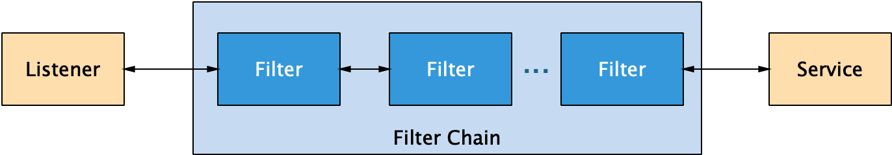
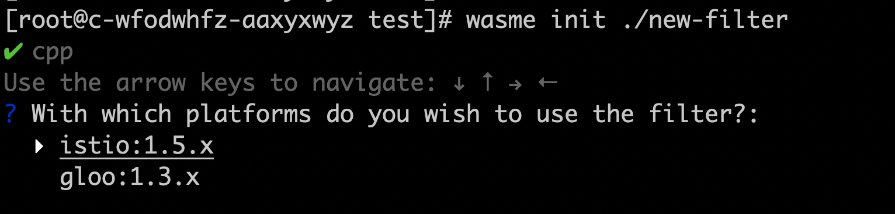
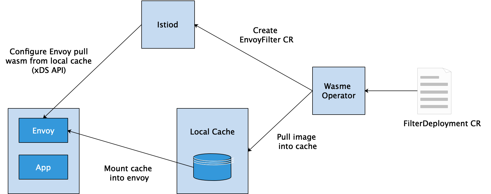

## 背景

Istio 从发布开始就使用 Envoy 作为自己的数据平面，充分利用了 Envoy 提供的服务发现、路由、熔断、负载均衡等功能。与此同时，Istio 项目也一直致力于提供一个便于灵活扩展的平台，以满足用户多样化的需求。在过去的一年半中， Google 的团队一直在努力用 WebAssembly 技术为 Envoy 代理添加动态扩展，并推出了针对 Envoy 代理的 WebAssembly (以下简称为WASM) 扩展机制，包括标准化的 ABI，SDK，以及该扩展机制的第一个重点实现：全新的、低延迟的 Istio 遥测系统。

本文主要对 Envoy 和 WebAssembly 技术进行介绍，并使用 solo.io 团队推出的 wasme 工具完成 WASM filter 的构建、发布和部署，方便读者了解 Envoy WASM Filter 的扩展方式及其实现原理。

## Envoy 的过滤器机制

Envoy 是 Istio 中的 Sidecar 官方标配，是一个面向服务架构的高性能网络代理，由 C++ 语言实现，拥有强大的定制化能力。Envoy 提供了进程外架构、支持L3/L4 filter、HTTP L7 filter、服务发现和动态配置、健康检查等高级功能。这里我们重点介绍一下 Envoy 流量处理过程中的 filter 机制。 

### 过滤器机制

Envoy 是面向服务架构设计的L7代理和通信总线，核心是一个 L3/L4 网络代理。可插入 filter 链机制允许开发人员编写 filter 来执行不同的 TCP 代理任务并将其插入到主体服务中。Envoy 还支持额外的 HTTP L7 filter 层。可以将 HTTP filter 插入执行不同任务的 HTTP 连接管理子系统。



目前，Envoy 提供的过滤器包括侦听器过滤器（Listener Filters）、网络过滤器（Network Filters）、HTTP过滤器（HTTP Filters）三种类型，它们共同组成了一个层次化的过滤器链。

**1、侦听器过滤器**

侦听器过滤器在初始连接阶段访问原始数据并操作 L4 连接的元数据。例如，TLS 检查器过滤器（TLS Inspector Filter）标识连接是否经过 TLS 加密，并解析与该连接关联的 TLS 元数据（SNI或ALPN协商的协议类型）；HTTP Inspector Filter 检测应用协议是否是 HTTP，如果是的话，再进一步检测 HTTP 协议类型 (HTTP/1.x or HTTP/2) ，这两种过滤器解析到的元数据都可以和 FilterChainMatch 结合使用。

**2、网络过滤器**

网络过滤器访问和操作 L4 连接上的原始数据，即TCP数据包。例如，TCP代理过滤器（TCP Proxy Filter）将客户端连接数据路由到上游主机，它还可以生成连接统计数据。此外，MySQL proxy、Redis proxy、Dubbo proxy、Thrift proxy等都属于网络过滤器。

**3、HTTP过滤器**

HTTP 过滤器在 L7 上运行，由网络过滤器（即 HTTP 连接管理器，HTTP Connection Manager）创建。这些过滤器用于访问、操作 HTTP 请求和响应，例如，gRPC-JSON 转码器过滤器（gRPC-JSON Transcoder Filter）可以为 gRPC 后端提供一个 REST API，并将请求和响应转换为相应的格式。此外，还包括  JWT、Router、RBAC 等多种过滤器。

整体来看，Envoy 的过滤器机制为用户提供了很多好处，比如：用户可以创建一个中间层，以便在与不兼容的服务器通信时优雅地处理客户端请求；代理可以执行协议转换，允许不同的协议互操作；代理可以通过过滤器做出智能路由决策等。

### 扩展方式

现有的 Filter 可能无法满足用户的使用需求，这时候就需要对 Envoy 进行功能扩展，通过在现有的过滤链基础上自定义新的 filter，实现定制化需求。用户可以通过以下三种方式对 Envoy 进行扩展。

**1、编写 C++ 代码扩展 Envoy**

这种方式直接在 Envoy 基础上编写 C++ 代码进行功能增强，实现自定义的 filter 之后，重新编译新的二进制可执行文件，完成现有业务的升级替换。这种方式有以下两方面问题：

受语言限制，只能使用 C++ 进行扩展，不利于生态发展；
提高了部署、运维、升级的复杂性，Envoy将会变得越来越重，并且每次更改都需要重新编译二进制文件，不利于技术迭代和管理。

**2、使用 lua 脚本扩展 filter**

Lua 是一种轻量小巧的脚本语言，用标准C语言编写并以源代码形式开放， 其设计目的是为了嵌入应用程序中，从而为应用程序提供灵活的扩展和定制功能。HTTP Lua Filter 允许在请求和响应流程中运行 Lua 脚本，在运行时使用 LuaJIT。该过滤器仅支持在配置中直接加载 Lua 代码。

目前支持的主要功能包括：对传输的请求或响应流，提供头部、正文和尾部的检查；对头部和尾部进行修改；对上游主机执行异步HTTP调用；直接执行响应并跳过后续的过滤器等。

然而，HTTP Lua Filter 是实验性的，在生产中使用需要自担风险。若存在非常复杂或更高性能的场景，建议使用本地 C++ 过滤器。

**3、使用 WASM 扩展 envoy**

为了提供更加方便、更加灵活的扩展方式，Google 团队计划用 WebAssembly 为 Envoy 代理添加动态扩展。用户可以使用自己擅长的编程语言编写 filter，并使用工具编译成 wasm 格式，嵌入到 Envoy 中运行即可。目前，Google 也与社区紧密合作，以确保为用户提供良好的开发者体验，帮助用户快速上手。Google 团队也一直与 Solo.io 团队紧密合作，Solo 团队已经建立了 WebAssembly Hub 服务，用于构建，共享，发现和部署 WASM 扩展。有了 WebAssembly Hub，WASM 扩展就会像容器一样易于管理，安装和运行。

## WASM 概述

### 介绍

WebAssembly（WASM）是一种由多种语言编写的，可移植的字节码格式，它能以接近本机的速度执行。作为一种可移植、体积小、加载快并且兼容 Web 的全新格式，wasm具有以下特点：

* 高效：WASM 有一套完整的语义，实际上 WASM 是体积小且加载快的二进制格式， 其目标就是充分发挥硬件能力以达到原生执行效率。
* 安全：WASM 运行在一个沙箱化的执行环境中，甚至可以在现有的 JavaScript 虚拟机中实现。
* 开放：WASM 设计了一个非常规整的文本格式，用于调试、测试、实验、优化、学习、教学或者编写程序。
* 标准：WASM 在 web 中被设计成无版本、特性可测试、向后兼容的特点。WASM 不仅可以运行在浏览器上，也可以运行在非web环境下。

需要注意的是，WASM 是一个编译目标，不是一种编程语言。WebAssembly 是经过编译器编译之后的目标格式，体积小、起步快。在语法上完全脱离 JavaScript，同时具有沙盒化的执行环境。

尽管 WASM 最初是作为客户端技术诞生的，但它应用于服务器端时也有很多优势。比如运行时是内存安全的，并且以沙盒方式运行以确保其安全性。

### 工具链

这里简单介绍一下 WASM 编译相关的工具链。传统的编译器设计都是三步式的：Frontend(前端)，Optimizer（优化器），Backend(后端)。

* Frontend ：源代码解析，错误检查，然后构建一个语言相关的抽象语法树(AST)来表示输入的代码。
* Optimizer：优化器会做很多的转换来减少代码的运行时间，比如说减少冗余的计算。
* Backend：将优化后的代码映射到目标指令集，也可以被称为代码生成器。

而在一个基于 LLVM 的编译器中，一个 Frontend 的任务是对源代码进行解析、错误诊断，然后将解析后的的代码转换为 LLVM IR（Intermediate Representation），IR 会经过一系列的分析和优化以便提高代码性能，最后基于优化后的代码生成相应的机器代码。这种方式十分灵活，当扩展编程语言或硬件类型时，添加对应的前端或后端即可，优化阶段则成为了一个通用的阶段。

Emscripten 的底层就是 LLVM 编译器，可以将 LLVM 字节码编译成 JavaScript，还支持 WebAssembly 这一更加先进的 Web 技术，可以生成 WASM 字节码文件。

## WASM与Envoy和Istio

### Istio 引入 WebAssembly

该特性在 Istio 1.5 自带的 Envoy 中以 Alpha 版本推出，其源代码在 envoy-wasm 开发分支中，并且正在努力将其合并到 Envoy 主干上。该实现使用了 Google 高性能 V8 引擎 中内置的 WebAssembly 运行时。

除了构建底层的运行时，Google 团队还开展了以下关键工作：

* 制定 Wasm 嵌入代理的通用应用程序二进制接口（ABI），这意味着编译后的扩展将可以在不同版本的 Envoy 中工作，甚至其它代理也可以，前提是其它代理实现了 ABI
* 用 C++, Rust 和 AssemblyScript 可以方便进行扩展开发的 SDK，后续还会支持更多类型的编程语言
* 全面的示例和说明，介绍如何在 Istio 和独立的 Envoy 中部署
* 允许使用其它 WASM 运行时的抽象，包括把扩展直接编译进 Envoy 中 “null” 运行时，这对于测试和调试非常有用

使用 WASM 扩展 Envoy 带来了很多好处：

* 敏捷性：可以用 Istio 控制平面在运行时下发和重载扩展，这就可以快速的进行开发、测试、发布，而无需重启 Envoy。
* 可靠性和隔离性：扩展模块部署在具有资源限制的沙箱中，这意味着虽然该模块可能崩溃或泄漏内存，但不会让整个 Envoy 挂掉。
* 灵活性：可以将多种编程语言编译为 WASM，让各种技术背景的开发人员都可以选择自己的语言来编写 Envoy 扩展，比如：C++，Go，Rust，Java，TypeScript 等。

### WASME 实践

Solo.io 团队发布了 WebAssembly Hub，这是一套为 Envoy 和 Istio 准备的，用于构建、部署、共享和发现 Envoy Proxy WASM 扩展的工具和仓库。

WebAssembly Hub 将开发和部署 Wasm 扩展所需的许多步骤都自动化了。使用 WebAssembly Hub 提供的工具，用户可以轻松地把任何受支持语言开发的代码编译为 WASM 扩展，并将这些扩展上传到 Hub 仓库，使用单个命令就将其在 Istio 中部署和删除。

WebAssembly Hub 工具提供了功能强大的 CLI 和优雅且易于使用的图形用户界面，该产品的一个重要目标是简化构建 WASM 模块的体验。下面介绍一下使用 wasme 工具开发、构建和部署 filter 的整体流程。

**1、安装 wasme cli**

wasme 命令行工具用于构建、管理 wasm filter，作用和流程有点像 docker 构建和管理容器。
```bash
# 安装wasme
curl -sL https://run.solo.io/wasme/install | sh
export PATH=$HOME/.wasme/bin:$PATH
# 查看版本号
wasme --version
```

**2、初始化filter项目**

创建一个新的filter项目：
```bash
wasme init ./new-filter
```
根据命令行的提示可以知道，现在只支持cpp、assemblyscript两种语言；可以选择部署到 Istio 或 Gloo 平台。这里我们选择cpp、istio选项，完成项目创建。



我们可以看一下生成的项目包括哪些文件：
```bash
# tree
.
|-- bazel
|   `-- external
|       |-- BUILD
|       |-- emscripten-toolchain.BUILD
|       `-- envoy-wasm-api.BUILD
|-- BUILD
|-- filter.cc
|-- filter.proto
|-- README.md
|-- runtime-config.json
|-- toolchain
|   |-- BUILD
|   |-- cc_toolchain_config.bzl
|   |-- common.sh
|   |-- emar.sh
|   `-- emcc.sh
`-- WORKSPACE
 
3 directories, 14 files
```

这些文件的作用分别为：

* BUILD：用于编译 filter 的 bazel 编译文件
* WORKSPACE：用于编译 filter 的 bazel WORKSPACE 文件
* bazel/：bazel 外部依赖
* toolchain/：编译 WASM 模块的 bazel 工具链
* filter.cc：filter 源代码，这里是C++语言
* filter.proto：filter配置的 protobuf schema
* runtime-config.json：和 filter 镜像共同存储的 config 文件，用于在运行时加载 filter

这里重点关注 filter.cc 文件即可，里面定义了一组接口和实现，只需要对相关的方法进行修改，就可以实现自定义的filter。其他文件主要用于编译，可以看到这里也引入了 emscripten 工具链，用于编译成 wasm 字节码格式。

**3、修改和编译**

这里我们在响应头添加一组 header 信息，以验证 filter 功能是否符合预期。
```C++
FilterHeadersStatus AddHeaderContext::onResponseHeaders(uint32_t) {
  LOG_DEBUG(std::string("onResponseHeaders ") + std::to_string(id()));
  addResponseHeader(root_->header_name_, root_->header_value_);
  replaceResponseHeader("location", "envoy-wasm");
  addResponseHeader("hello", "world!");
  return FilterHeadersStatus::Continue;
}
```

接下来使用 wasme 命令编译 filter，这里会自动拉取quay.io/solo-io/ee-builder镜像完成编译过程，构建完成的filter镜像将会存储在本地的 registry中。
```bash
wasme build cpp -t webassemblyhub.io/sunboy0213/add-header:v0.1 .
```
查看本地编译完成的filter镜像：
```bash
wasme list
NAME                                    TAG  SIZE   SHA      UPDATED
webassemblyhub.io/sunboy0213/add-header v0.1 1.0 MB 72ad74e2 15 Apr 20 11:03 CST
```
这里可以看一下我们最终编译生成的文件如下，目标文件 filter.wasm 只有 1021K，可以很方便的集成到 envoy 中。
```bash
ls store/41aabc92e1f91207d4b4e12385fd5bca/ -alh
total 1.1M
drwxr-xr-x 2 root root  4.0K Apr 15 12:19 .
drwxr-xr-x 4 root root  4.0K Apr 15 12:19 ..
-rw-r--r-- 1 root root   226 Apr 15 20:58 descriptor.json
-rw-r--r-- 1 root root 1021K Apr 15 20:58 filter.wasm
-rw-r--r-- 1 root root    44 Apr 15 20:58 image_ref
-rw-r--r-- 1 root root   128 Apr 15 20:58 runtime-config.json
```

**4、推送到 WebAssembly hub**

这里需要首先注册https://webassemblyhub.io账号，然后将本地编译完成的镜像推送到远程仓库。
```bash
# 登录账号
wasme login -u $YOUR_USERNAME -p $YOUR_PASSWORD
# 推送镜像
wasme push webassemblyhub.io/sunboy0213/add-header:v0.1
# 查找我的远程镜像
wasme list --search $YOUR_USERNAME
```

**5、部署到istio集群**

这一步的前提是已经搭建了 Istio 运行环境，并部署好了 bookinfo 示例应用。测试服务间的访问连通性如下：
```bash
# kubectl exec -ti deploy/productpage-v1 -c istio-proxy -- curl -v http://details:9080/details/123
*   Trying 172.18.233.86...
* TCP_NODELAY set
* Connected to details (172.18.233.86) port 9080 (#0)
> GET /details/123 HTTP/1.1
> Host: details:9080
> User-Agent: curl/7.58.0
> Accept: */*
>
< HTTP/1.1 200 OK
< content-type: application/json
< server: istio-envoy
< date: Thu, 23 Apr 2020 09:16:53 GMT
< content-length: 180
< x-envoy-upstream-service-time: 1
< x-envoy-peer-metadata: Ch4KDElOU1RBTkNFX0lQUxIOGgwxNzIuMTYuMC4yMDYK1QEKBkxBQkVMUxLKASrHAQoQCgNhcHASCRoHZGV0YWlscwohChFwb2QtdGVtcGxhdGUtaGFzaBIMGgo3NWQ5NGM0OGY1CiQKGXNlY3VyaXR5LmlzdGlvLmlvL3Rsc01vZGUSBxoFaXN0aW8KLAofc2VydmljZS5pc3Rpby5pby9jYW5vbmljYWwtbmFtZRIJGgdkZXRhaWxzCisKI3NlcnZpY2UuaXN0aW8uaW8vY2Fub25pY2FsLXJldmlzaW9uEgQaAnYxCg8KB3ZlcnNpb24SBBoCdjEKGgoHTUVTSF9JRBIPGg1jbHVzdGVyLmxvY2FsCiUKBE5BTUUSHRobZGV0YWlscy12MS03NWQ5NGM0OGY1LTdibHhtChYKCU5BTUVTUEFDRRIJGgdkZWZhdWx0Ck4KBU9XTkVSEkUaQ2t1YmVybmV0ZXM6Ly9hcGlzL2FwcHMvdjEvbmFtZXNwYWNlcy9kZWZhdWx0L2RlcGxveW1lbnRzL2RldGFpbHMtdjEKJQoPU0VSVklDRV9BQ0NPVU5UEhIaEGJvb2tpbmZvLWRldGFpbHMKHQoNV09SS0xPQURfTkFNRRIMGgpkZXRhaWxzLXYx
< x-envoy-peer-metadata-id: sidecar~172.16.0.206~details-v1-75d94c48f5-7blxm.default~default.svc.cluster.local
< x-envoy-decorator-operation: details.default.svc.cluster.local:9080/*
<
* Connection #0 to host details left intact
{"id":123,"author":"William Shakespeare","year":1595,"type":"paperback","pages":200,"publisher":"PublisherA","language":"English","ISBN-10":"1234567890","ISBN-13":"123-1234567890"}
```

部署我们刚才定制开发的filter：
```bash
wasme deploy istio webassemblyhub.io/sunboy0213/add-header:v0.1 --id=myfilter
```
再次访问，可以发现响应头已经增加了 "hello: world!" 键值对。注意：该部署过程会触发pod重建操作。
```bash
kubectl exec -ti deploy/productpage-v1 -c istio-proxy -- curl -v http://details:9080/details/123
*   Trying 172.18.233.86...
* TCP_NODELAY set
* Connected to details (172.18.233.86) port 9080 (#0)
> GET /details/123 HTTP/1.1
> Host: details:9080
> User-Agent: curl/7.58.0
> Accept: */*
>
< HTTP/1.1 200 OK
< content-type: application/json
< server: istio-envoy
< date: Thu, 23 Apr 2020 09:20:12 GMT
< content-length: 180
< x-envoy-upstream-service-time: 2
< :
< location: envoy-wasm
< hello: world!
< x-envoy-peer-metadata: Ch4KDElOU1RBTkNFX0lQUxIOGgwxNzIuMTYuMC4yMDgK1QEKBkxBQkVMUxLKASrHAQoQCgNhcHASCRoHZGV0YWlscwohChFwb2QtdGVtcGxhdGUtaGFzaBIMGgo3NzdkOGY1NDc1CiQKGXNlY3VyaXR5LmlzdGlvLmlvL3Rsc01vZGUSBxoFaXN0aW8KLAofc2VydmljZS5pc3Rpby5pby9jYW5vbmljYWwtbmFtZRIJGgdkZXRhaWxzCisKI3NlcnZpY2UuaXN0aW8uaW8vY2Fub25pY2FsLXJldmlzaW9uEgQaAnYxCg8KB3ZlcnNpb24SBBoCdjEKGgoHTUVTSF9JRBIPGg1jbHVzdGVyLmxvY2FsCiUKBE5BTUUSHRobZGV0YWlscy12MS03NzdkOGY1NDc1LWY0Z3c0ChYKCU5BTUVTUEFDRRIJGgdkZWZhdWx0Ck4KBU9XTkVSEkUaQ2t1YmVybmV0ZXM6Ly9hcGlzL2FwcHMvdjEvbmFtZXNwYWNlcy9kZWZhdWx0L2RlcGxveW1lbnRzL2RldGFpbHMtdjEKJQoPU0VSVklDRV9BQ0NPVU5UEhIaEGJvb2tpbmZvLWRldGFpbHMKHQoNV09SS0xPQURfTkFNRRIMGgpkZXRhaWxzLXYx
< x-envoy-peer-metadata-id: sidecar~172.16.0.208~details-v1-777d8f5475-f4gw4.default~default.svc.cluster.local
< x-envoy-decorator-operation: details.default.svc.cluster.local:9080/*
<
* Connection #0 to host details left intact
{"id":123,"author":"William Shakespeare","year":1595,"type":"paperback","pages":200,"publisher":"PublisherA","language":"English","ISBN-10":"1234567890","ISBN-13":"123-1234567890"}
```

**6、生产环境的部署**

前面我们使用的 wasme 命令行提供了一种编译、部署 wasm filter 的简单方式，可以方便的在开发和测试环境中使用，但该方式显然无法用于声明式、无状态的k8s生产环境中。

为此，官方推荐使用 Wasme Operator 管理 Service Mesh 集群中的 wasm filter。主要包括两个组件：

* 镜像缓存：从 filter registry 拉取 filter 镜像，并缓存到本地，该组件以 DaemonSet 的形式进行部署；
* operator：安装、配置 wasm filter 到数据面代理，以 Kubernetes Deployment 的形式部署。

用户提交的 FilterDeployment 示例如下：
```yaml
apiVersion: wasme.io/v1
kind: FilterDeployment
metadata:
  name: bookinfo-custom-filter
  namespace: bookinfo
spec:
  deployment:
    istio:
      kind: Deployment
  filter:
    config: '{"name":"hello","value":"world"}'
    image: webassemblyhub.io/ilackarms/istio-test:1.5.0-0
```

### 工作原理分析

刚才我们使用 wasme 命令行工具完成了 wasm filter 的构建、部署过程，其背后的工作原理简单描述如下：

1. 由 Wasme Operator 设置 wasm filter 的本地缓存信息，同时生成 EnvoyFilter 资源提交给k8s；
2. 镜像缓存模块拉取需要的 wasm filter 到本地缓存中，该模块以 DaemonSet 的形式部署在集群节点中；
3. 缓存模块拉取完成后，将 wasm 文件挂载到目标的workload中；
4. 同时，Istiod 监测到 EnvoyFilter 变更，通过 xDS API 将 wasm 文件的信息下发到 envoy 代理。



目前，WASM 扩展是通过 mount 机制来分发给对应的 workload，这种方式显然不够灵活，理想的方案是通过网络拉取 WASM 文件，完成实时加载。针对该问题，社区也正在积极优化。

结合前面的实践内容和原理分析，这里我们可以查看已经添加的 EnvoyFilter 资源。
```bash
[root@c-wfodwhfz-aaxyxwyz ~]# kubectl get envoyfilters.networking.istio.io
NAME                      AGE
details-v1-myfilter       50m
productpage-v1-myfilter   50m
ratings-v1-myfilter       50m
reviews-v1-myfilter       50m
reviews-v2-myfilter       50m
reviews-v3-myfilter       50m
```

这里的 EnvoyFilter 是 Istio 提供的一种资源对象，用来更新配置 Envoy 中的 filter，为服务网格控制面提供了强大的扩展能力。可以详细看一下 productpage-v1-myfilter 的具体描述。
```bash
apiVersion: networking.istio.io/v1alpha3
kind: EnvoyFilter
metadata:
  creationTimestamp: "2020-04-23T09:19:34Z"
  generation: 1
  name: productpage-v1-myfilter
  namespace: default
  resourceVersion: "9071122"
  selfLink: /apis/networking.istio.io/v1alpha3/namespaces/default/envoyfilters/productpage-v1-myfilter
  uid: b528b175-5e08-4b08-85ed-a324a2418a64
spec:
  configPatches:
  - applyTo: HTTP_FILTER
    match:
      context: SIDECAR_INBOUND
      listener:
        filterChain:
          filter:
            name: envoy.http_connection_manager
            subFilter:
              name: envoy.router
    patch:
      operation: INSERT_BEFORE
      value:
        config:
          config:
            name: myfilter
            rootId: add_header_root_id
            vmConfig:
              code:
                local:
                  filename: /var/local/lib/wasme-cache/72ad74e260c99fd77bbfd62f5dfab16af666dbdee8bacca39d97eafe60c69584
              runtime: envoy.wasm.runtime.v8
              vmId: myfilter
        name: envoy.filters.http.wasm
  workloadSelector:
    labels:
      app: productpage
      version: v1
```

该配置内容通过 xDS API 下发到 Envoy 代理之后，envoy 的运行时配置就会出现如下类型的 http filter，可以看到该 filter 指定了wasm文件的位置，并将wasm的运行时设置为v8引擎，从而实现了 wasm filter 的加载和运行。

```json
{
 "name": "envoy.filters.http.wasm",
 "config": {
  "config": {
   "name": "myfilter",
   "rootId": "add_header_root_id",
   "vmConfig": {
    "code": {
     "local": {
      "filename": "/var/local/lib/wasme-cache/72ad74e260c99fd77bbfd62f5dfab16af666dbdee8bacca39d97eafe60c69584"
     }
    },
    "runtime": "envoy.wasm.runtime.v8",
    "vmId": "myfilter"
   }
  }
 }
},
```

## 小结

本文首先介绍了 Envoy 的过滤器模型和 WASM 扩展技术，并结合 Solo 团队提供的 wasme 工具完成了 WASM 扩展的构建、部署过程，最后对背后的工作原理进行了分析。可以看到，使用 WASM 可以很方便的将自定义 filter 集成到 Envoy 中，实现 Envoy 代理的功能增强，同时我们也发现 envoy-wasm 仍然处于初步阶段，在支持的语言类型、运行性能、部署运维等方面仍然有待完善，相信在社区的不断努力下，WASM 技术能够走向成熟并应用于更多的使用场景中。

## 参考

[重新定义代理的扩展性：Envoy 和 Istio 引入 WebAssembly](https://istio.io/latest/zh/blog/2020/wasm-announce/)

[如何高效地编写Envoy过滤器！第1部分](https://cloud.tencent.com/developer/article/1548607)

[WebAssembly for Proxies (ABI specification)](https://github.com/proxy-wasm/spec)

[Declarative WebAssembly deployment for Istio](https://istio.io/latest/blog/2020/deploy-wasm-declarative/)