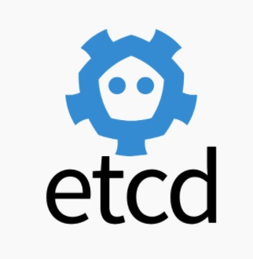
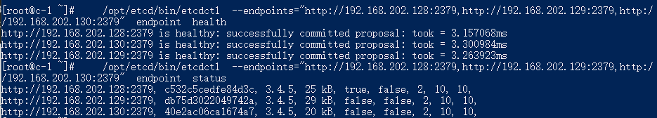
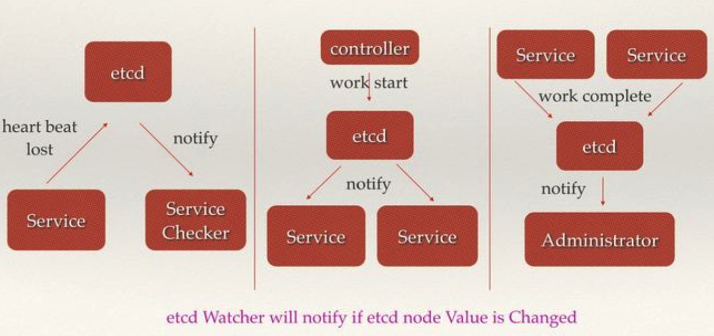
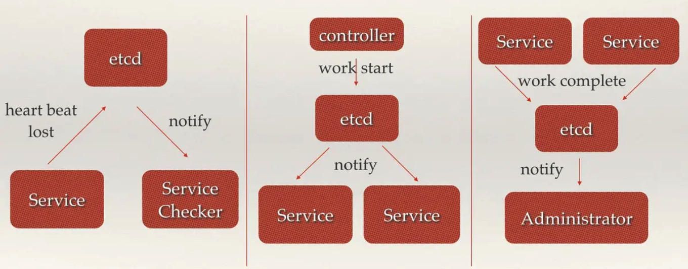

> 作者介绍：aoho，一线码农，对云原生、微服务、Go 语言、容器化感兴趣，并做了深入研究。闲暇时间会分享一些技术思考和实践，与大家讨论交流，共同进步。

## 0 专辑概述
etcd 是云原生架构中重要的基础组件，由 CNCF 孵化托管。etcd 在微服务和 Kubernates 集群中不仅可以作为服务注册于发现，还可以作为 key-value 存储的中间件。

《彻底搞懂 etcd 系列文章》将会从 etcd 的基本功能实践、API 接口、实现原理、源码分析，以及实现中的踩坑经验等几方面具体展开介绍 etcd。预计会有 20 篇左右的文章，笔者将会每周持续更新，欢迎关注。
## 1 etcd 介绍
etcd 是 CoreOS 团队于 2013 年 6 月发起的开源项目，它的目标是构建一个高可用的分布式键值(key-value)数据库。具有以下特点：

- 简单：安装配置简单，而且提供了 HTTP API 进行交互，使用也很简单
- 键值对存储：将数据存储在分层组织的目录中，如同在标准文件系统中
- 监测变更：监测特定的键或目录以进行更改，并对值的更改做出反应
- 安全：支持 SSL 证书验证
- 快速：根据官方提供的 benchmark 数据，单实例支持每秒 2k+ 读操作
- 可靠：采用 raft 算法，实现分布式系统数据的可用性和一致性

etcd 采用 Go 语言编写，它具有出色的跨平台支持，很小的二进制文件和强大的社区。 etcd 机器之间的通信通过 Raft 算法处理。

etcd 是一个高度一致的分布式键值存储，它提供了一种可靠的方式来存储需要由分布式系统或机器集群访问的数据。它可以优雅地处理网络分区期间的 leader 选举，以应对机器的故障，即使是在 leader 节点发生故障时。

从简单的 Web 应用程序到 Kubernetes 集群，任何复杂的应用程序都可以从 etcd 中读取数据或将数据写入 etcd。

etcd 于 2018 年 12 月正式加入云原生计算基金会(CNCF，全称 Cloud Native Computing Foundation)，并由 CNCF 支持。CNCF 是一个厂商中立的基金会、云原生技术推广和普及的领导者。

## 2 使用场景
etcd 比较多的应用场景是用于服务注册与发现，除此之外，也可以用于键值对存储，应用程序可以读取和写入 etcd 中的数据。

一个简单的用例是将数据库连接详细信息或功能标志存储在 etcd 中作为键值对。 可以观察这些值，使我们的应用在更改时可以重新配置自己。高级用法是利用 etcd 的一致性保证来实施数据库 leader 选举或在一组 follower 之间执行分布式锁定。

### 2.1 键值对存储

> A highly-available key value store for shared configuration and service discovery.   
> 一个用于配置共享和服务发现的键值存储系统。

归根结底，etcd 是一个**键值存储**的组件，其他的应用都是基于其键值存储的功能展开。etcd 的存储有如下特点：

- 采用kv型数据存储，一般情况下比关系型数据库快。
- 支持动态存储(内存)以及静态存储(磁盘)。
- 分布式存储，可集成为多节点集群。
- 存储方式，采用类似目录结构。
	- 只有叶子节点才能真正存储数据，相当于文件。
	- 叶子节点的父节点一定是目录，目录不能存储数据。

etcd leader 的延迟是要跟踪的最重要的指标，并且内置仪表板具有专用于此的视图。在我们的测试中，严重的延迟会在群集内造成不稳定，因为 Raft 的速度仅与大多数机器中最慢的机器一样快。我们可以通过适当地调整群集来缓解此问题。etcd 已在具有高度可变网络的云提供商上进行了预调。

### 2.2 服务注册与发现
服务注册与发现(Service Discovery)要解决的是分布式系统中最常见的问题之一，即在同一个分布式集群中的进程或服务如何才能找到对方并建立连接。从本质上说，服务发现就是要了解集群中是否有进程在监听 UDP 或者 TCP 端口，并且通过名字就可以进行查找和链接。

要解决服务发现的问题，需要下面三大支柱，缺一不可。

- 强一致性、高可用的服务存储目录。
基于 Raft 算法的 etcd 天生就是这样一个强一致性、高可用的服务存储目录。

- 一种注册服务和服务健康状况的机制。
用户可以在 etcd 中注册服务，并且对注册的服务配置 key TTL，定时保持服务的心跳以达到监控健康状态的效果。

- 一种查找和连接服务的机制。通过在 etcd 指定的主题下注册的服务业能在对应的主题下查找到。为了确保连接，我们可以在每个服务机器上都部署一个 Proxy 模式的 etcd，这样就可以确保访问 etcd 集群的服务都能够互相连接。

etcd2 中引入的 etcd/raft 库，是目前最稳定、功能丰富的开源一致性协议之一。作为 etcd、TiKV、CockcorachDB、Dgraph 等知名分布式数据库的核心数据复制引擎，etcd/raft 驱动了超过十万个集群，是被最为广泛采用一致性协议实现之一。etcd3 中引入的多版本控制、事务等功能，大大的简化了分布式应用的开发流程，提高了效率和稳定性。经过 5 年的演进，etcd 也已经成为了各种容器编排系统的默认存储选项。Kubernetes 是流行的容器平台，运行在任何环境的 Kubernetes 集群都依赖 etcd 来提供稳定而可靠的存储服务。

### 2.3 消息发布与订阅
在分布式系统中，最适用的一种组件间通信方式就是消息发布与订阅。即构建一个配置共享中心，数据提供者在这个配置中心发布消息，而消息使用者则订阅他们关心的主题，一旦主题有消息发布，就会实时通知订阅者。通过这种方式可以做到分布式系统配置的集中式管理与动态更新。

应用中用到的一些配置信息放到 etcd 上进行集中管理。这类场景的使用方式通常是这样：应用在启动的时候主动从 etcd 获取一次配置信息，同时，在 etcd 节点上注册一个Watcher并等待，以后每次配置有更新的时候，etcd 都会实时通知订阅者，以此达到获取最新配置信息的目的。

分布式搜索服务中，索引的元信息和服务器集群机器的节点状态存放在etcd中，供各个客户端订阅使用。使用etcd的key TTL功能可以确保机器状态是实时更新的。

分布式日志收集系统。这个系统的核心工作是收集分布在不同机器的日志。收集器通常是按照应用（或主题）来分配收集任务单元，因此可以在 etcd 上创建一个以应用（主题）命名的目录P，并将这个应用（主题相关）的所有机器ip，以子目录的形式存储到目录P上，然后设置一个 etcd 递归的Watcher，递归式的监控应用（主题）目录下所有信息的变动。这样就实现了机器IP（消息）变动的时候，能够实时通知到收集器调整任务分配。

系统中信息需要动态自动获取与人工干预修改信息请求内容的情况。通常是暴露出接口，例如 JMX 接口，来获取一些运行时的信息。引入 etcd 之后，就不用自己实现一套方案了，只要将这些信息存放到指定的 etcd 目录中即可，etcd 的这些目录就可以通过 HTTP 的接口在外部访问。

### 2.4 分布式通知与协调
这里说到的分布式通知与协调，与消息发布和订阅有些相似。在分布式系统中，最适用的一种组件间通信方式就是消息发布与订阅。即构建一个配置共享中心，数据提供者在这个配置中心发布消息，而消息使用者则订阅他们关心的主题，一旦主题有消息发布，就会实时通知订阅者。通过这种方式可以做到分布式系统配置的集中式管理与动态更新。

这里用到了 etcd 中的 Watcher 机制，通过注册与异步通知机制，实现分布式环境下不同系统之间的通知与协调，从而对数据变更做到实时处理。实现方式通常是这样：不同系统都在 etcd 上对同一个目录进行注册，同时设置 Watcher 观测该目录的变化（如果对子目录的变化也有需要，可以设置递归模式），当某个系统更新了 etcd 的目录，那么设置了 Watcher 的系统就会收到通知，并作出相应处理。

通过 etcd 进行低耦合的心跳检测。检测系统和被检测系统通过 etcd 上某个目录关联而非直接关联起来，这样可以大大减少系统的耦合性。

通过 etcd 完成系统调度。某系统有控制台和推送系统两部分组成，控制台的职责是控制推送系统进行相应的推送工作。管理人员在控制台作的一些操作，实际上是修改了 etcd 上某些目录节点的状态，而 etcd 就把这些变化通知给注册了Watcher的推送系统客户端，推送系统再作出相应的推送任务。

通过 etcd 完成工作汇报。大部分类似的任务分发系统，子任务启动后，到 etcd 来注册一个临时工作目录，并且定时将自己的进度进行汇报（将进度写入到这个临时目录），这样任务管理者就能够实时知道任务进度。

### 2.5 分布式锁

当在分布式系统中，数据只有一份（或有限制），此时需要利用锁的技术控制某一时刻修改数据的进程数。与单机模式下的锁不仅需要保证进程可见，分布式环境下还需要考虑进程与锁之间的网络问题。

分布式锁可以将标记存在内存，只是该内存不是某个进程分配的内存而是公共内存如 Redis、Memcache。至于利用数据库、文件等做锁与单机的实现是一样的，只要保证标记能互斥就行。

因为etcd使用Raft算法保持了数据的强一致性，某次操作存储到集群中的值必然是全局一致的，所以很容易实现分布式锁。锁服务有两种使用方式，一是保持独占，二是控制时序。

保持独占即所有获取锁的用户最终只有一个可以得到。etcd 为此提供了一套实现分布式锁原子操作 CAS （CompareAndSwap）的 API。通过设置 prevExist 值，可以保证在多个节点同时去创建某个目录时，只有一个成功。而创建成功的用户就可以认为是获得了锁。

控制时序，即所有想要获得锁的用户都会被安排执行，但是获得锁的顺序也是全局唯一的，同时决定了执行顺序。etcd 为此也提供了一套 API（自动创建有序键），对一个目录建值时指定为 POST 动作，这样 etcd 会自动在目录下生成一个当前最大的值为键，存储这个新的值（客户端编号）。同时还可以使用API按顺序列出所有当前目录下的键值。此时这些键的值就是客户端的时序，而这些键中存储的值可以是代表客户端的编号。

## 3. 小结
本章主要介绍了 etcd 的相关概念，以及 etcd 主要的使用场景。etcd 在分布式环境中是一个利器，在一致性存储方面有广泛的应用。下一篇将会具体介绍 etcd 的安装以及使用的实践。

### 参考
- [etcd 官方文档](https://etcd.io/docs/v3.4.0/op-guide/clustering/#error-cases)