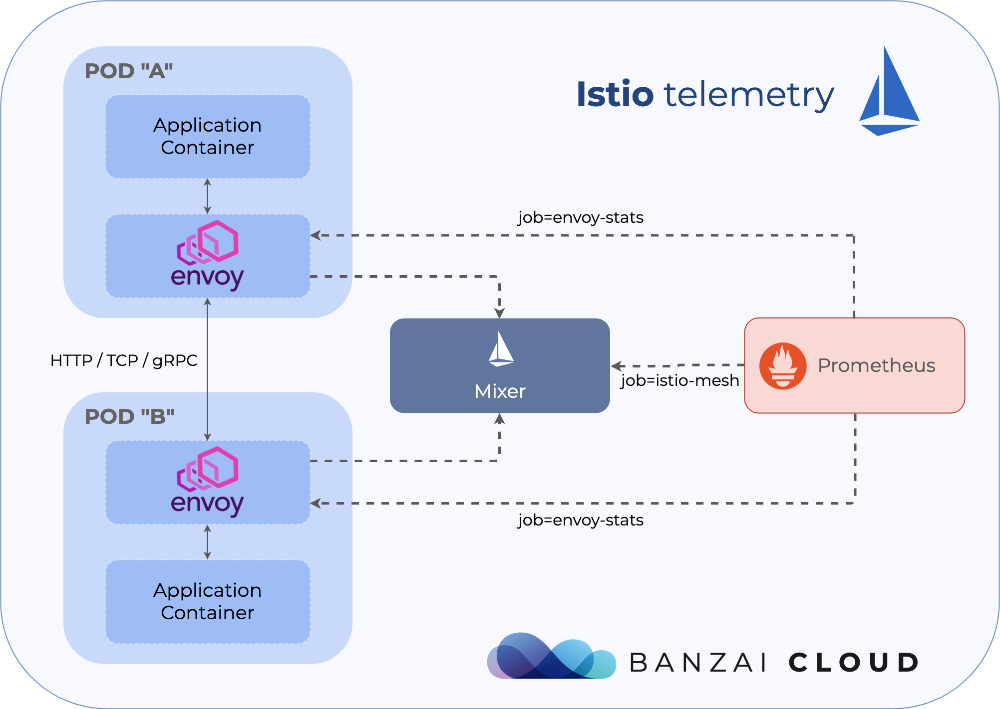
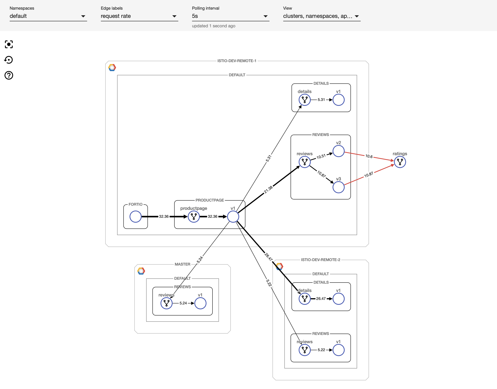

本文为翻译文章，[点击查看原文](https://banzaicloud.com/blog/istio-telemetry/)。

**编者按**

>作者是Banzai Cloud的工程师，文章介绍了istio环境下，如何结合Prometheus进行网络度量指标监测，给出了一些示例配置。最后，还推广了一下Banzai Cloud自家的Pipeline，天然支持跨云、混合云情况下的网络度量监测，欢迎体验。

Istio的一个核心功能就是网络流量的可观察性。因为所有服务间的通信都通过Envoy代理，而且Istio的控制平面可以从这些代理收集日志和指标，服务网格能够让你深入了解你的网络状况。虽然Istio的基本安装就装好了收集遥测数据所需的全部组件，但是理解这些组件如何配合，并且使他们能够工作在生产环境中却不是一个容易的事情。如果服务网格扩展到跨越多个云服务提供商的多个群集时，或者在混合云情况下，甚至在边缘计算环境下，这个工作就更加困难。我们在这篇文章中，尽可能解释清楚Istio的遥测是怎么工作的，并且会完整浏览一些监控例子，包括如何配置Prometheus的目标和尝试不同可用的指标。看完这篇文章，你将会对Banzai云中新的[Pipeline](https://github.com/banzaicloud/pipeline)组件有一个提前了解-它是一个跨云和混合云管理平台，基于顶尖的[Istio Operator](https://github.com/banzaicloud/istio-operator)开发。

## Mixer与智能代理（Envoy）

Istio的控制平面由几个不同部分组成，其中一个是Mixer。Mixer自身在Kubernetes里面又有两个不同的独立部署。一个叫做`istio-policy`，另一个叫`istio-telemetry`。就像它们的名字，这些组件负责提供控制策略和遥测数据收集功能。

应用pod的sidecar在发起每一个请求前调用`istio-policy`来进行前置条件检查，并在请求结束后发送遥测数据。sidecar本地缓存了一大批前置检查，使得大量的检查只需要通过缓存就能获得结果。此外，sidecar还对输出的遥测数据进行了缓存，以减少调用mixer的频率。

在Istio的控制平面上运行mixer是可选的，如果你不需要集中式的策略检查和遥测，那么你可以把这些组件彻底关掉。这些组件具有非常高的扩展性，并且能够在自定义资源配置中进行完整配置。如果不想涉及Istio配置过深，或者不想使用自己的后端基础设施去收集日志和遥测数据，而想完全采用默认值（stdio logs，Prometheus指标），你完全可以一点不操心这些。

如果你想用一个不同的*adapter* - 如`Stackdriver`- 你需要更新mixer的自定义资源配置。Istio中有几个概念叫做`handlers`，`instances`以及`rules`。`Handlers`决定一系列后端基础设置适配器是怎么工作以及如何操作的，`instances`描述了如何把请求的属性映射到适配器的输入上，最后`rules`把`handlers`和`instances`拼接在一起。这些概念如果你想了解更多，你可以查看[官方文档](https://istio.io/docs/concepts/policies-and-telemetry/#configuration-model)，这篇文章最后也会演示一下一些默认的例子。



## 配置Prometheus收集网格数据

Istio的文档列举了[收集自定义指标](https://istio.io/docs/tasks/telemetry/metrics/collecting-metrics/)，以及[从Prometheus中查询指标](https://istio.io/docs/tasks/telemetry/metrics/querying-metrics/)的例子，但缺少一个重要的内容：理解和配置Prometheus的收集目标。

如果你只是想试一试Istio，多半你会部署了它的官方工具Helm Chart（我们更推荐[Istio operator](https://github.com/banzaicloud/istio-operator)以获取更好的体验）。Helm Chart默认包含了Prometheus部署并且也已经配置好。但是在生产环境下，你通常需要自定义设置Prometheus以及配置它的收集目标。这样情况下，你需要手工将Istio抓取目标也配置进去。

首先，我们来看看这些目标。如果你打开这里的配置，你会发现Istio给Prometheus添加了十多个job。大部分是从Istio控制平面收集自定义指标的。你可以看到Pilot通过类似`pilot_xds_pushes`, `pilot_xds_push_timeout` 与 `pilot_total_xds_internal_errors`这些指标上报遥测数据，如`xDS`推送，超时或内部错误。这些job紧跟在组件名称后，并通过Kubernetes服务中`http-monitoring`对应的端口上报。下面列举了一个pilot的例子：

```yaml
- job_name: 'pilot'
  kubernetes_sd_configs:
  - role: endpoints
    namespaces:
      names:
      - {{ .Release.Namespace }}
  relabel_configs:
  - source_labels: [__meta_kubernetes_service_name, __meta_kubernetes_endpoint_port_name]
    action: keep
    regex: istio-pilot;http-monitoring
```

最重要的两个目标是`istio-mesh`和`envoy-stats`。`prometheus.yml`里面第一项允许Prometheus抓取Mixer，它也含在了以服务遥测数据为中心的，Envoy代理间的所有网络流量数据中。另一方面来说，`envoy-stats`直接查询Envoy的代理，并收集网络内中央节点的遥测数据（可以查看类似`envoy_cluster_upstream_rq`这样的指标）。

Mixer通过Pilot来加强Kubernetes中Envoys上报的采样数据，所以从Mixer来的数据包含更丰富的信息，包括服务、负载名称以及其它Kubernetes特定的内容。但也有一些[博文](https://medium.com/@michael_87395/benchmarking-istio-linkerd-cpu-at-scale-5f2cfc97c7fa)提到，从群集中的每一个sidecar代理收集遥测数据，有时候会引起性能问题，所以在一个大的群集里面，有时候完全关闭Mixer，只通过`envoy-stats`中转也是值得的，即使这意味着会丢失部分功能。

下面是一个`istio-mesh`添加一个job，查询`istio-telemetry`服务的`prometheus`端口的`yaml`配置，

```yaml
- job_name: 'istio-mesh'
  kubernetes_sd_configs:
  - role: endpoints
    namespaces:
      names:
      - {{ .Release.Namespace }}
  relabel_configs:
  - source_labels: [__meta_kubernetes_service_name, __meta_kubernetes_endpoint_port_name]
    action: keep
    regex: istio-telemetry;prometheus
```

`envoy-stats`的`yaml`配置更加复杂，但也很重要。它选择pod的条件是端口名称为`*-envoy-prom`，指标为`/stats/prometheus`：

```yaml
- job_name: 'envoy-stats'
  metrics_path: /stats/prometheus
  kubernetes_sd_configs:
  - role: pod
  relabel_configs:
  - source_labels: [__meta_kubernetes_pod_container_port_name]
    action: keep
    regex: '.*-envoy-prom'
```

使用[Helm Chart](https://github.com/helm/charts/tree/master/stable/prometheus)部署Prometheus到群集中，部署目的地添加到`values.yaml`文件，或者直接编辑包含`premetheus.yaml`的`configmap`，并把它挂载到Prometheus的服务端pod上。

### 使用Prometheus Operator

群集中部署Prometheus的一个更好的方法是用[Prometheus Operator](https://github.com/coreos/prometheus-operator/)。这种情况下，目标配置稍稍有点不同-不再直接用`prometheus.yml，`而是通过定义`ServiceMonitor`的自定义资源，来声明一些列用于监控的服务，并且这个operator在后台自动把这些配置转换为Prometheus的`yaml`配置。举个例子，一条收集`mixer`指标的`ServiceMonitor`记录定义如下：

```yaml
apiVersion: monitoring.coreos.com/v1
kind: ServiceMonitor
metadata:
  name: istio-monitor
  labels:
    monitoring: services
spec:
  selector:
    matchExpressions:
      - {key: istio, operator: In, values: [mixer]}
  namespaceSelector:
    matchNames:
      - istio-system
  jobLabel: istio-mesh
  endpoints:
  - port: prometheus
    interval: 5s
  - port: http-monitoring
    interval: 5s
```

它示范了通过匹配标签`istio=mixer`以及每5秒查询一次终结点端口`prometheus`和`http-monitoring`的配置。就像上面这个配置，Mixer通过`http-monitoring`端口，提供了关于它自己操作的自定义度量指标，也通过`prometheus`端口提供了聚合的以网络流量服务为中心的一些度量指标。

## 默认度量指标

Istio文档中提到，度量指标的第一个任务就是[Collecting new metrics](https://istio.io/docs/tasks/telemetry/metrics/collecting-metrics/)。它很好地描述了Istio如何最大化的自定义资源去配置`instance`，`handlers`和`rules`，并演示了如何创建一个自定义的，Istio生成并且自动收集的度量指标，当然这属于高级别的话题范畴。大部分普通场景里，默认的度量值就足够覆盖使用场景了，Istio用户也不需要了解背后的概念。

[Istio operator](https://github.com/banzaicloud/istio-operator)（Istio Helm图表也一样）开箱就初始化了默认指标。如果Istio运行在群集中，并配置了Prometheus以从Mixer收集遥测数据，你将不需要做任何网格中服务间的网络流量遥测数据的配置。直到你开始使用Envoy sidecar，你可以使用Prometheus UI（或者用它的查询API）来收集Prometheus收集的指标。

默认指标都是一些标准的信息，如`HTTP`，`gRPC`以及`TCP`请求和响应。每一个请求都是由`source`代理和`destination`代理上报的，用以提供流量的不同视角的结果。也许有的请求不是通过`destination`上报（如果这个请求根本没有经过destination），但是一些标签（如`connection_security_policy`）只在`destination`上有效。下面列举一些重要的*HTTP*指标：

- `istion_request_total`是一个`计数器（COUNTER）`，聚合Kubernetes负载中请求总数，并按照响应码、响应标志和安全策略分组。这在计算负载间的请求量（`RPS`）的时候很有用。这有一个[Bookinfo](https://istio.io/docs/examples/bookinfo)的例子。它计算`productpage`和`review`服务间，最近一小时的每秒请求数`request per second，`并且按照工作负载域和响应码分组。

```yaml
sum(rate(istio_requests_total{reporter="source",source_workload="productpage-v1",destination_service_name="reviews"}[1m])) by (source_workload,source_version,destination_service_name,destination_workload,destination_version,request_protocol,response_code)
{destination_service_name="reviews",destination_version="v2",destination_workload="reviews-v2",request_protocol="http",response_code="200",source_version="v1",source_workload="productpage-v1"}    12.71
{destination_service_name="reviews",destination_version="v3",destination_workload="reviews-v3",request_protocol="http",response_code="200",source_version="v1",source_workload="productpage-v1"}    12.72
{destination_service_name="reviews",destination_version="v1",destination_workload="reviews-v1",request_protocol="http",response_code="200",source_version="v1",source_workload="productpage-v1"}    6.35
{destination_service_name="reviews",destination_version="v1",destination_workload="reviews-v1",request_protocol="http",response_code="503",source_version="v1",source_workload="productpage-v1"}    6.37
```

- `istio_request_duration_seconds` 是收集负载间延迟的直方图。以下示例计算`productpage`和`reviews`服务之间成功请求的第95百分位延迟，并按工作负载子集对结果进行分组。

```yaml
histogram_quantile(0.95, sum(rate(istio_request_duration_seconds_bucket{reporter="source",source_workload="productpage-v1",destination_service_name="reviews",response_code="200"}[60m])) by (le,source_workload,source_version,destination_service_name,destination_workload,destination_version,request_protocol))
{destination_service_name="reviews",destination_version="v2",destination_workload="reviews-v2",request_protocol="http",source_version="v1",source_workload="productpage-v1"}    0.1201
{destination_service_name="reviews",destination_version="v3",destination_workload="reviews-v3",request_protocol="http",source_version="v1",source_workload="productpage-v1"}    0.1345
{destination_service_name="reviews",destination_version="v1",destination_workload="reviews-v1",request_protocol="http",source_version="v1",source_workload="productpage-v1"}    0.1234
```

- 剩下的两个HTTP度量指标是`istio_request_bytes`和`istio_response_bytes`。 这些也是直方图，可以用与`istio_request_duration_seconds`类似的方式查询。

### 默认内部度量指标

如果您仍然对如何在Mixer中配置这些指标感兴趣，可以查看群集中相应的Istio自定义资源。 如果从集群中获得`metric` CRs，它会列出八个不同的资源，这些资源将转换为Prometheus指标：

```shell
kubectl get metric -n istio-system
NAME                   AGE
requestcount           17h
requestduration        17h
requestsize            17h
responsesize           17h
tcpbytereceived        17h
tcpbytesent            17h
tcpconnectionsclosed   17h
tcpconnectionsopened   17h
```

`handler`配置描述了Prometheus度量指标，并引用了`instance_name`字段中的先前`metric`自定义资源。 它还定义了以后可以在Prometheus查询中使用的名称（使用`istio`前缀），例如`requests_total`：

```yaml
kubectl get handler -n istio-system prometheus -o yaml
apiVersion: config.istio.io/v1alpha2
kind: handler
metadata:
  ...
spec:
  compiledAdapter: prometheus
  params:
    metrics:
    - instance_name: requestcount.metric.istio-system
      kind: COUNTER
      label_names:
      - reporter
      - source_app
      ...
      name: requests_total
```

最后一个构建块是`rule`自定义资源，它将度量指标绑定到处理程序：

```yaml
kubectl get rule -n istio-system  promhttp -o yaml
apiVersion: config.istio.io/v1alpha2
kind: rule
metadata:
  ...
spec:
  actions:
  - handler: prometheus
    instances:
    - requestcount.metric
    - requestduration.metric
    - requestsize.metric
    - responsesize.metric
  match: (context.protocol == "http" || context.protocol == "grpc") && (match((request.useragent
    | "-"), "kube-probe*") == false)
```

如果您仍需要自定义一些有关网络流量的指标，你需要添加这些类型的自定义资源。 为此，您可以参考[Istio文档](https://istio.io/docs/tasks/telemetry/metrics/collecting-metrics/)。

## 用于ISTIO的多/混合云监测和控制平面工具

Istio及其遥测组件最初可能会令人生畏，特别是如果涉及多个集群。 我们非常关注简化多集群环境中的服务网格使用，因为我们专注于在Banzai Cloud构建多云和混合云平台。 我们的劳动成果即将发布在KubeCon：一个用于监控和配置服务网格活动的可视化工具。 我们考虑过使用其他工具，如Kiali，但它缺乏多集群支持以及通过UI指定配置选项的能力。 因此，我们最终编写了自己的UI和后端基础架构，以便与服务网格进行通信。 这个新工具将很快在KubeCon上发布，并将作为[Pipeline](https://github.com/banzaicloud/pipeline)平台的一部分提供，敬请期待！



## 关于[PIPELINE](https://github.com/banzaicloud/pipeline)

Banzai Cloud的[Pipeline](https://github.com/banzaicloud/pipeline)提供了一个平台，允许企业开发，部署和扩展基于容器的应用程序。 它利用最佳的云组件（如Kubernetes）为开发人员和运维团队创建高效，灵活的环境。 强大的安全措施 - 多身份验证后端，细粒度授权，动态密钥管理，使用TLS的组件之间的自动安全通信，漏洞扫描，静态代码分析，CI / CD等等 -是[流水线平台](https://github.com/banzaicloud/pipeline)的*零级*特征，我们努力为所有企业赋能以实现自动化。

## 关于[BANZAI CLOUD](https://banzaicloud.com/)

[Banzai Cloud](https://banzaicloud.com/)改变私有云的构建方式，以简化复杂应用程序的开发，部署和扩展，将Kubernetes和Cloud Native技术的全部功能带给各地的开发人员和企业。
如果你对我们的技术或开源项目感兴趣，可以从[GitHub](https://github.com/banzaicloud/pipeline/), [LinkedIn](https://www.linkedin.com/company/banzaicloud/) 或 [Twitter](https://twitter.com/BanzaiCloud?ref_src=twsrc%5Etfw/)来联系我们。
