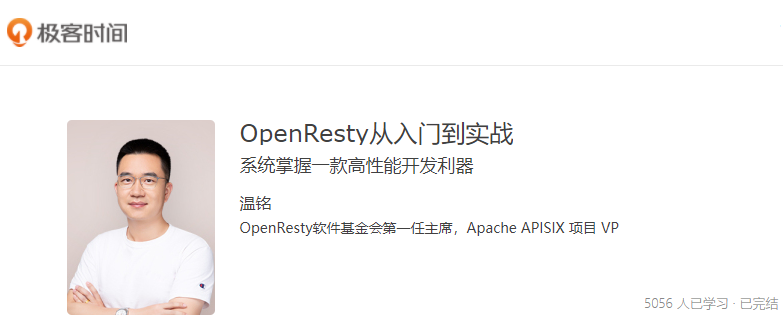
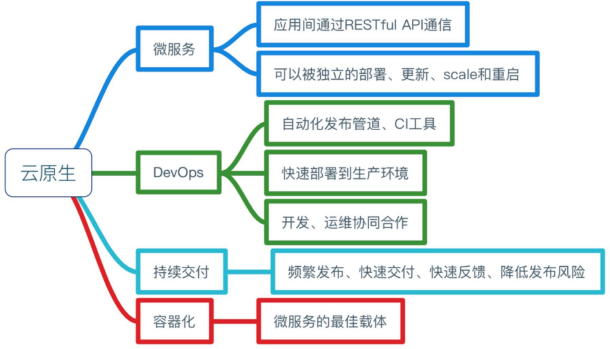
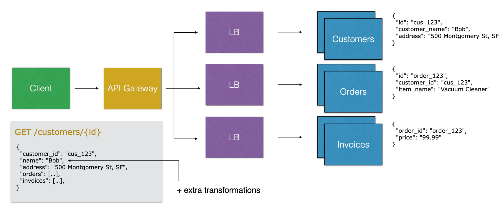
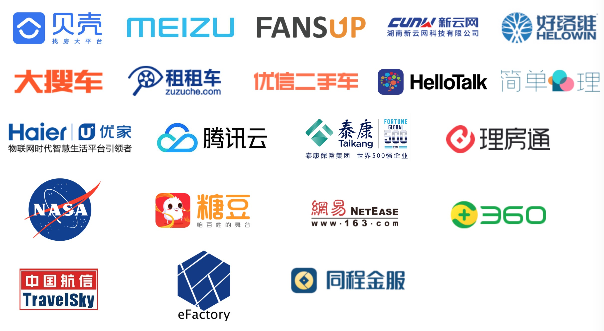
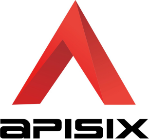

# APACHE APISIX的全流量API网关

温铭, 来自一家在远程工作方式下商业化开源项目的创业公司(支流科技), 担任CEO&联合创始人, 与支流科技(ApiSix)类似的公司有Confluent(Kafka产品)、PinCap(TiDB产品), 支流科技是Linux 基金会白银会员、Linux 微服务 TARS 基金会创始会员。

Apache顶级项目APISIX的PMC主席。

Skywalking开源项目的贡献者(committer)。

在创业之前, 在360做企业安全, 360开源委员会的发起人, 腾讯的TVP, TARS基金会的TOC成员, 在安全领域有四十多个专利。

最近三年全职在做服务端的开源项目开发。在极客时间专栏著有OpenResty从入门到实战。

ApiSix是中国唯一由初创公司贡献的 Apache 顶级项目，也是最快毕业的项目(历时9个月)

很多应用和服务都在向微服务、容器化迁移, 形成新的云原生时代。云原生是下一个五～十年的技术颠覆, 重写了传统企业的技术架构, 例如云原生中的K8S颠覆了传统操作系统, 所有的"主机"(node上的容器)由k8s来控制和编排, 非常适用于公有云、私有云、混合云等各种环境。云原生体系的特点之一就是由各种开源项目组成, 不同于以往的商业闭源项目, 缓解了收费贵等问题, 加速了技术落地。现代公司的技术是非常重要的组成部分, 在一个商业竞争激烈的时代, 公司愈早的占据技术顶峰愈是能够占据商业顶峰。网关作为云原生入口, 是掌握云原生的一个必经之地, 是开启"财富"的关键钥匙。

## 预期目录

云原生带来了哪些的机会, 对个人的机会以及对企业的机会(上面)

微服务和API网关的演进, 为什么我们会需要微服务、API网关

为什么在云原生里面会有新的这样的产品、项目会出现

大概的介绍一下APISIX、是什么、APISIX是怎么做的

APISIX可以帮大家做哪些事情

未来的的规划

## 微服务和 API 网关的演进

### 从2014-2015年, 谷歌搜索引擎上"微服务"关键字的搜索趋势呈直线上升

### 在单体架构上, 任一请求都会负载到整个的单体服务集群上

### 在微服务架构上, 对应请求会负载到微服务中对应的的子服务集群上

### 微服务的精细管理带来很多好处

服务的弹性伸缩、开发团队变得敏捷、服务之间隔离、降低故障率

在流量变动的时候, 只需要对有可能变动流量的服务进行对应资源的扩缩容即可, 这样可以很明显的节省服务器成本以及更高的承受度

在业务变动的时候, 只需要对有可能变动业务的服务进行对应业务模块的变动即可, 这样可以很明显的节省人力成本以及更高的控制力

在出现故障时不会导致整体服务不可用

### 但是同样的带来的一些问题

接口之间通用的功能重复开发、膨胀的服务数量、难以管理

### 使用API网关模式

将功能型的功能统一放到网关上, 例如可观测性metrics、应用性能apm tracing、限速、身份认证、日志等等

### 使用API网关进行API聚合

### 使用API网关实现灰度发布

在上一个新功能时, 例如: 原来的版本是一点零, 然后再上一个小版本(一点零点一),  把10%的流量嵌到新的版本, 观测是否有问题, 当没有问题是在增加到20%、30%、40%。这种功能是很正常的, 但是如果在网关上天统一做就很困难。

而且可以通过判断网络请求信息去划分到不同版本中去。例如: 当IP为广东或者一些API的请求参数含有特定值可以划分到不同的版本中去。

APISIX支持读取到的请求参数中包含了NGINX的所有变量。

APISIX甚至支持LUA代码去运算处理请求的请求体、请求参数。

### 使用API网关实现服务熔断

当Invoices服务出现大量常见错误时就可以直接熔断不接收请求了。

### 与传统API网关的功能

• 让 API 请求更安全、更高效的得到处理

• 覆盖 Nginx 的所有功能：反向代理、负载均衡

• 动态上游、动态 SSL 证书、动态限流限速

​	区别于Nginx是由配置文件驱动以及需要reload配置文件

• 主动/被动健康检查、服务熔断

### 不同的云原生下的新功能

• 对接 Prometheus、Zipkin、Skywalking

• gRPC 代理和协议转换（REST <=> gRPC）

• 身份认证：OpenID Relying Party、OP（Auth0、okta…）

• 高性能、无状态、随意扩容和缩容

• 动态配置，不用 reload 服务

• 支持多云、混合云

• 容器优先，Kubernetes 友好

### 在GANTER报告上有很多顶级厂商做API全生命周期管理

API生命周期指的是从API的设计到API的文档和他的SDK以及他的API的上线之类，甚至还包括API的市场等等一整套的解决方案, 网关在其中是核心角色。

在上半象限都是一些巨头公司, 例如Google、IBM等等, 都是公有云的闭源项目, 具有领导地位, 跟各自产品深度绑定在一起

在下半象限都是援建者, 都是开源项目, 例如: Kong, 挑战着闭源项目

随着时间的推移我们发现: 软件在吞噬世界、开源软件在吞噬软件

而且随着时间的推移, 发生了很多API网关厂商相关的收购案例:

• 2015 年，IBM 收购 StrongLoop

• 2015 年，谷歌 6.25 亿美元收购 apigee

• 2018 年，Salesforce 65 亿美元收购 MuleSoft

• 2018 年， Broadcom 189 亿美元收购 CA Technologies

• 2019 年，F5 收购 6.7 亿美元收购 NGINX

## Apache APISIX 简介

### 关于 Apache APISIX

• 天然的云原生 API 网关

• 中国最快毕业的 Apache 顶级项目

• 全动态：路由、SSL 证书、上游、插件…

​	插件的动态意味着插件本身也做成了热插拔

• 40 多个插件，覆盖：身份认证、安全、日志、可观测性…

### Apache APISIX 设计思路

• API 网关的数据面和控制面分离

​	控制面不仅能控制ApiSix还能控制其他组件

​	数据面不仅仅能被我的控制面控制, 还能被其他组件所控制

• 通过插件机制来方便二次开发和运维

​	为了写一个一个插件

​	与Envoy不同, Envoy的插件是使用C++编写的, C++本身就具有很大的复杂性

​	与Kong不同, Kong的插件需要写300+行代码、并且分布在3~4个文件中

​	ApiSix中只需要写一个并且只需要70行代码

• 高可用，没有单点故障

​	因为使用了ETCD来存储数据

• 安全和稳定第一：基于 Nginx 实现；mTLS 认证；敏感信息加密加盐(salt)保存

​	Nginx是基于C语言开发的程序, 性能优化到极致, Nginx的底层开发做的非常好, 并且在大规模适用上得到充分有效的验证, 从性能角度上是最佳选择

• 高性能：单核心 QPS 1.5 万，延迟低于 0.7 毫秒

​	基于Nginx的网络层

• 运维友好：Prometheus， SkyWalking，流量复制，故障注入等

#### 技术架构

DP和CP完全剥离, 通过ETCD来进行通信, 注册数据、WATCH数据

支持非常多的协议: 例如HTTP、HTTPS、GRPC、TARS、DUBBO、TCP、MQTT、QUIC等等

因为ApiSix使用了ETCD, 在对应其他组件时会非常方便, 可以把ETCD直接就当做服务注册中心来使用(服务注册、发现), 当然同时也支持Consul、Eureka、Nacos等等

### Apache APISIX 能做什么？

• 处理 L4、L7 层流量：HTTP、HTTPS、TCP、UDP、MQTT、Dubbo、gRPC…

• 替代 Nginx 处理南北向流量

• 替代 Envoy 处理服务间东西向流量

• k8s ingress controller

• 借助 MQTT 插件作为 IoT 网关

• 借助 IdP 插件成为零信任网关

## Apache APISIX 的技术优势

### Apache APISIX 的技术优势

ApiSix只是使用了Nginx的网络库而并没有使用路由库, 重写优化了路由算法

• Apache APISIX 的路由复杂度是 O(k)，只和 uri 的长度有关，和路由数量无关；kong 的路由时间复杂度是 O(n)，随着路由数量线性增长。

​	K指URI长度, 和路由数量没有关系, 例如有一百万条路由, ApiSix路由的时间复杂度都是一样的, 而Kong却不是这样的

• Apache APISIX 的 IP 匹配时间复杂度是 O(1)，不会随着大量 IP 判断而导致 cpu 资源跑满；kong 的最新版本也换用了 Apache APISIX 的 IP 匹配库；

​	不管有多少IP都是一次命中, 而Kong却不是这样的

• Apache APISIX 的路由匹配，接受 nginx 的所有变量作为条件，并且支持自定义函数；其他网关都是内置的几个条件；

• Apache APISIX 使用 etcd 作为配置中心，没有单点，任意宕掉一台机器，网关集群还能正常运行。其他基于 mysql，postgres 的网关都会有单点问题

• Apache APISIX 的配置下发只要 1 毫秒就能达到所有网关节点，使用的是 etcd 的 watch；其他网关是定期轮询数据库，一般需要 5 秒才能获取到最新配置

• 只有 Apache APISIX 开放了自定义负载均衡的挂载点，其他网关都不支持

### 独创的插件编排/低代码 API 网关

基于已有插件的基础上, 通过在界面上拖拖拽拽就可以生成一个全新的插件

通过插件编排的方式可以把ApiSix的四十多个插件的上下游关系全部串联起来形成一个新的插件

• Kong：支持 Go 编写的插件

• Envoy：支持 Lua、WASM 编写的 filter

• Apache APISIX：为什么要“写”插件？ops、PM 也可以直接创造一个插件

• 解决方案：微插件、低代码，需要底层架构和插件足够灵活

### 有众多信赖的全球领军企业, 挖掘出足够多的尖端问题, 迭代出更加完美的产品

#### 行业细分

• 公有云：腾讯、华为、中国移动、DaoCloud

• 航天：NASA、中国航信、航天智云

• 物联网：欧盟数字工厂、特斯联

• 租车：大搜车、租租车、优信二手车

• 金融：泰康、同程金服、空中云汇

• 在线教育：好未来、作业帮、腾讯教育、网易有道

### APISIX 和 Kong 的对比

| 对⽐比项                                   | APISIX                           | Kong                   |
| ------------------------------------------ | -------------------------------- | ---------------------- |
| 技术架构                                   | Nginx + etcd                     | Nginx + postgres       |
| 高可⽤用                                   | 非常可靠，没有单点               | 一般，有数据库的单点   |
| 精细化路路由                               | 支持 Nginx 变量量和⾃自定义函数  | 固定的⼏几个条件       |
| 配置⽣生效时间                             | 事件驱动，小于 1 毫秒            | 轮询拉取，5 秒         |
| 处理理延迟                                 | 0.2 毫秒                         | 2 毫秒                 |
| 性能（单核，开启两个限流和prometheus插件） | 18000                            | 1700                   |
| 支持流量量复制和故障                       | 是                               | 否                     |
| 注⼊                                       | 是                               | 否                     |
| 支持SkyWalking                             | 是                               | 否                     |
| 插件热更新                                 | 新增、删除、更新插件不用重载服务 | 无, 每次都需要重载服务 |
| 二次开发                                   | 难度低                           | 难度中等               |
| 本地技术支持                               | 有, 1小时响应                    | 无                     |
| 定期巡检和培训                             | 有                               | 无                     |

## 基于 Apache APISIX 的全流量网关

### Nginx 遇到的挑战

• 社区不活跃：没有 github issue 和 PR

• 没有跟进云原生：nginx-k8s-controller、nginx unit 的尝试都失败了

• 配置不能热加载

• 非 http、https 流量的兴起（微服务、物联网…）

• 商业化不成功

• 被 F5 收购

### Nginx 的替代者

• API 网关：Kong、Apache APISIX

• service proxy：Envoy

• 公有云：CLB + API 网关、CLB + k8s ingress controller

### 东西向流量

• 随着微服务而兴起

• service mesh 和 API 网关的位置和愿景不同，但功能基本一致

• istio + Envoy 已经成为 service mesh 的标准

### 全流量通吃

• 南北向 API 网关 -> 东西向微服务

• 东西向服务网格 -> 南北向接入层

• Envoy、Kong、Apache APISIX：全流量接入层

• 接入层不再是 Nginx 和 F5 的传统功能和领地

• 开源项目百花齐放：BFE、MOSN

### Apache APISIX 全流量通吃计划

• 以 Nginx 的网络库为基础，抛弃 Nginx 的路由匹配、静态配置和 C 模块

• 增加独立的控制平面（CP），调度所有数据平面（DP），不局限于 APISIX

• 增加 AI  平面（AP），接入层本身没有价值，分析流动的数据并反哺业务，才有价值

• 低代码：整个过程不希望增加学习成本和使用成本

## Apache APISIX 的开源和社区规划

### 最省心的 Apache 孵化器项目

• 最快毕业的 Apache 中国项目

• 来自 Apache 孵化器主席和 Apache APISIX champion 的评价

• 每个月一个版本，雷打不动，让社区和用户保持习惯和预期

• 当天回复邮件列表和 github issue、PR

• 频繁的布道和走访用户：每个月一次  meetup，走访过美团、腾讯、华为、贝壳、平安、又拍云、中国移动、思必驰、空中云汇、中国航信等几十家企 业

### 活跃是我们的唯一目标

• 不看 github star

• 更关注：如何吸引新的贡献者；如何让贡献者更加活跃

• 贡献不止代码，文档、测试、文章都是贡献，都可以成为 committer 和 PMC

• 多样性：近 30 位 committer，其中两位欧洲开发者；至少 4 位大学生

• 后浪：00 后的 Apache APISIX committer

### 服气：社区大于代码

• The Apache Way

• 活跃的社区，会重构坏的代码；但再好的代码，也会死于独裁的社区

• 案例：Apache APISIX dashboard 的重构，社区对于 MySQL 的方案不满， “怨声载道”，然后来自 5 家公司的贡献者一起重构掉它

### 规划

• 2.0 版本（即将发布）：使用 etcd v3 替代 v2

• 3.0 版本：废弃 admin API，分离 DP 和 CP

• 2021 年的 flag：Apache APISIX 的贡献者超过 200 位

# 最后

记住我们的图标

欢迎大家给 Apache APISIX 贡献！

项目地址: https://github.com/apache/apisix

邮箱:      wenming@apache.org

QQ 群：578997126