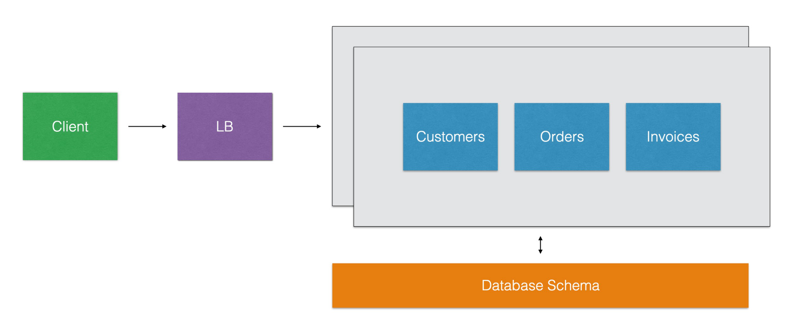

文章出处视频: https://www.bilibili.com/video/BV1Gt4y1q7qC, 云原生学院分享的文字整理

> 本文将从云原生时代的机遇和挑战说起，介绍一个全新的开源高性能云原生 API 网关————Apache APISIX，探讨如何解决云原生时代 API 网关所面临的一些痛点，最后介绍该开源项目未来的规划。

## 背景

### 云原生的机遇和挑战

很多应用和服务都在向微服务、容器化迁移，形成新的云原生时代。云原生是下一个 5-10 年的技术颠覆，重写了传统企业的技术架构，例如云原生中的 Kubernetes 颠覆了传统操作系统，所有的“主机”（node 上的容器）由 Kubernetes 来控制和编排，非常适用于公有云、私有云、混合云等各种环境。云原生体系的特点之一就是由各种开源项目组成，不同于以往的商业闭源项目，缓解了收费贵等问题，加速了技术落地。现代公司的技术是非常重要的组成部分，在一个商业竞争激烈的时代，公司愈早的占据技术顶峰愈是能够占据商业顶峰。网关作为云原生入口，是掌握云原生的一个必经之地，是开启“财富”的关键钥匙。

### 微服务的演进

从 2014-2015 年，谷歌搜索引擎上“微服务”关键字的搜索趋势呈直线上升。

在单体架构上，任一请求都会负载到整个的单体服务集群上。

在微服务架构上，对应请求会负载到微服务中对应的的子服务集群上。

使用微服务进行精细管理后，服务的弹性伸缩、开发团队变得敏捷、服务之间隔离、降低故障率；在流量变动的时候，只需要对有可能变动流量的服务进行对应资源的扩缩容即可，这样可以很明显的节省服务器成本以及更高的承受度；在业务变动的时候，只需要对有可能变动业务的服务进行对应业务模块的变动即可，这样可以很明显的节省人力成本以及更高的控制力；在出现故障时不会导致整体服务不可用

但是落地微服务同样的带来了一些问题，比如接口之间通用的功能重复开发、膨胀的服务数量、难以管理。通常的解决方案便是使用 API 网关对其进行管理。

### 微服务与 API 网关

使用 API 网关进行管理，通常的做法是将微服务框架中功能型的功能统一放到网关上，例如可观测性 metrics、应用性能 apm tracing、限速、身份认证、日志等等。

#### 灰度发布

灰度发布也叫金丝雀发布，起源是，矿井工人发现，金丝雀对瓦斯气体很敏感，矿工会在下井之前，先放一只金丝雀到井中，如果金丝雀不叫了，就代表瓦斯浓度高。灰度发布会将流量按比例划分给已经上线的版本（比如1.0，占比90%）以及正在上线的版本（比如1.01，占比10%），若观测没有问题，逐步调整二者的流量占比直到流量完全切到1.01版本。Apache APISIX 内置的灰度发布支持读取到的 HTTP 请求参数中包含了 NGINX 的所有变量，可以依据变量进行灰度，甚至支持 LUA 代码去运算处理请求的请求体、请求参数。

#### 服务熔断

如图所示，当 Invoices 服务出现大量常见错误达到配置的熔断阈值就可以直接熔断不接收请求了。

#### Apache APISIX 在传统和云原生领域的支持粒度

| 作用在传统API网关领域的功能                                  | 作用在云原生API网关领域的功能                                |
| ------------------------------------------------------------ | ------------------------------------------------------------ |
| 让 API 请求更安全、更高效的得到处理； 覆盖 Nginx 的所有功能：反向代理、负载均衡； 动态上游、动态 SSL 证书、动态限流限速；主动/被动健康检查、服务熔断 | 对接 Prometheus、Zipkin、Skywalking； gRPC 代理和协议转换 (REST <-> gRPC)； 身份认证：OpenID Relying Party、OP（Auth0、okta……） 高性能、无状态、随意扩容和缩容 动态配置，不用 reload 服务 支持多云、混合云 容器优先，Kubernetes 友好 |

### API 生命周期管理全景图

API 生命周期指的是从 API 的设计到 API 的文档和他的 SDK 以及他的 API 的上线之类，甚至还包括 API 的市场等等一整套的解决方案，网关在其中是核心角色。

在上半象限都是一些巨头公司，例如 Google、IBM 等等，都是公有云的闭源项目，具有领导地位，跟各自产品深度绑定在一起。在下半象限都是援建者，都是开源项目，例如: Kong，挑战着闭源项目, 随着时间的推移我们发现——软件在吞噬世界、开源软件在吞噬软件。以下是近几年发生的很多 API 网关厂商相关的收购案例：

* 2015 年，IBM 收购 StrongLoop

* 2015 年，谷歌 6.25 亿美元收购 apigee

* 2018 年，Salesforce 65 亿美元收购 MuleSoft

* 2018 年，Broadcom 189 亿美元收购 CA Technologies

* 2019 年，F5 收购 6.7 亿美元收购 NGINX

说明 API 网关在云原生时代依然扮演者重要的角色

## 深入浅出 Apache APISIX

### 设计思路

API 网关的数据面和控制面分离。控制面不仅能控制 Apache APISIX 还能控制其他组件；数据面不仅仅能被我的控制面控制，还能被其他组件所控制

通过插件机制来方便二次开发和运维。拿 Envoy 来说，Envoy 的插件是使用 C++ 编写的，C++ 本身就具有很大的复杂性；再来对比下 Kong，Kong 开发一个 IP 黑白名单插件需要写 300+ 行代码，并且插件配置解析、插件逻辑等代码分布在 3-4 个文件中；而 Apache APISIX 开发同样功能的插件只需要一个文件并且只需要70行代码。

默认高可用，没有单点故障。因为使用了 ETCD 来存储和分发路由数据

安全和稳定第一。Apache APISIX 基于 Nginx 实现，支持mTLS 认证以及敏感信息加密加盐 (salt) 保存。为什么选择 Nginx 呢？它是基于 C 语言开发的程序，性能优化到极致，Nginx 的底层开发做的非常好，并且在大规模适用上得到充分有效的验证，从性能角度上是最佳选择

高性能。Apache APISIX 基于 Nginx 的网络层，其单核心 QPS 1.5 万，延迟低于 0.7 毫秒。

运维友好。它支持 Prometheus、SkyWalking 动态追踪、流量复制、故障注入等功能

### 技术架构

Apache APISIX 架构如图，其主要分为数据面和控制面。

- 数据面：以 Nginx 的网络库为基础，（弃用 Nginx 的路由匹配、静态配置和 C 模块），使用 Lua 和 Nginx 动态控制请求流量，通过插件机制来实现各种流量处理和分发的功能：限流限速、日志记录、安全检测、故障注入等，同时支持用户编写自定义插件来对数据面进行扩充。
- 控制面：使用 etcd 来存储和同步网关的配置数据，管理员通过 admin API 或者 dashboard 可以在毫秒级别内通知到所有的数据面节点，同时 etcd 集群也保证了系统的高可用。

因为 Apache APISIX 使用了 ETCD 作为配置中心，在对应其他组件时会非常方便，可以把 ETCD 直接就当做服务注册发现中心来使用（服务注册、发现），当然同时也支持 Consul、Eureka、Nacos 等服务注册中心。

### 高性能

Apache 只是使用了 Nginx 的网络库而并没有使用路由库，重写优化了路由算法。

* Apache APISIX 的路由复杂度是 O (k)，只和 URI 的长度有关，和路由数量无关；kong 的路由时间复杂度是 O (n) ，随着路由数量线性增长，K 指 URI 长度，和路由数量没有关系，例如有一百万条路由，ApiSix 路由的时间复杂度都是一样的，而 Kong 却不是这样的

* Apache APISIX 的 IP 匹配时间复杂度是 O (1)，不会随着大量 IP 判断而导致 CPU 资源跑满；kong 的最新版本也换用了 Apache APISIX 的 IP 匹配库；不管有多少IP都是一次命中，而 Kong 却不是这样的

* Apache APISIX 的路由匹配，接受 nginx 的所有变量作为条件，并且支持自定义函数；其他网关都是内置的几个条件；

* Apache APISIX 使用 etcd 作为配置中心，没有单点，任意宕掉一台机器，网关集群还能正常运行。其他基于 mysql，postgres 的网关都会有单点问题

* Apache APISIX 的配置下发只要 1 毫秒就能达到所有网关节点，使用的是 etcd 的 watch；其他网关是定期轮询数据库，一般需要 5 秒才能获取到最新配置

* 只有 Apache APISIX 开放了自定义负载均衡的挂载点，其他网关都不支持

### 独创的插件编排

基于已有插件的基础上，通过在界面上拖拖拽拽就可以生成一个全新的插件。

通过插件编排的方式可以把 Apache APISIX 的四十多个插件的上下游关系全部串联起来形成一个新的插件。

当前，Kong支持 Go 编写的插件，Envoy支持 Lua、WASM 编写的 filter。那么，Apache APISIX 的使用者为什么要“写”插件？我们认为运维、PM 也可以直接通过浏览器页面创造一个自己的插件。

为了支持插件编排，Apache APISIX 一方面需要实现微插件、低代码，同时需要底层架构和插件足够灵活。

### 同类技术对比

#### Apache APISIX vs Kong

有对比才更有说服力，Apache APISIX 和 Kong 都是基于 Openresty/LuaJIT 实现的高性能 API 网关，让我们来对比下他们的异同。

| 对⽐比项                                     | APISIX                           | Kong                   |
| -------------------------------------------- | -------------------------------- | ---------------------- |
| 技术架构                                     | Nginx + etcd                     | Nginx + postgres       |
| 高可用                                       | 非常可靠，没有单点               | 一般，有数据库的单点   |
| 精细化路由                                   | 支持 Nginx 变量和自定义函数      | 固定的⼏个条件         |
| 配置⽣效时间                                 | 事件驱动，小于 1 毫秒            | 轮询拉取，5 秒         |
| 处理延迟                                     | 0.2 毫秒                         | 2 毫秒                 |
| 性能（单核，开启两个限流和 prometheus 插件） | 18000                            | 1700                   |
| 支持流量复制和故障                           | 是                               | 否                     |
| 注⼊                                         | 是                               | 否                     |
| 支持 SkyWalking                              | 是                               | 否                     |
| 插件热更新                                   | 新增、删除、更新插件不用重载服务 | 无，每次都需要重载服务 |
| 二次开发                                     | 难度低                           | 难度中等               |
| 本地技术支持                                 | 有，1 小时响应                   | 无                     |
| 定期巡检和培训                               | 有                               | 无                     |

因此我们发现Apache APISIX的分布式可靠性强，路由支持丰富，配置变更生效时间快，网关处理速度快, 资源消耗率低，混沌测试支持度高，监控系统(如SkyWalking)支持度高，插件变动动态化程度高以及二次开发难度低。

#### Apache APISIX vs Nginx

Nginx 是一款轻量级 Web 服务器、反向代理服务器，由于它的内存占用少、启动极快、高并发能力强，故其在互联网项目中得到广泛应用，距今已经有十多年的历史。但 Nginx 在步入云原生时代后遇到了更多的挑战：

* 社区不活跃：没有 github issue 和 PR

* 没有跟进云原生：nginx-k8s-controller、nginx unit 的尝试都失败了

* 配置不能热加载

* 非 http、https 流量的兴起（微服务、物联网……）

* 商业化不成功

* 被 F5 收购

* 后浪：API 网关比如 Kong 和 Apache APISIX，serviceMesh proxy 比如 Envoy 等

## 开源社区规划

### 运营 Apache 孵化器项目的经验

* 为了让社区和用户保持习惯和预期，每个月一个版本，雷打不动。

* 当天回复邮件列表和 github issue、PR

* 频繁的布道和走访用户：每个月一次 meetup，走访过美团、腾讯、华为、贝壳、平安、又拍云、中国移动、思必驰、空中云汇、中国航信等几十家企业，深入了解用户的需求

### The Apache Way

* 不看重 github star，更关注如何吸引新的贡献者以及如何让贡献者更加活跃

* 贡献不止代码，文档、测试、文章都是贡献，都可以成为 committer 和 PMC

* 社区多样性：近 30 位 committer，其中两位欧洲开发者；至少 4 位大学生，甚至有 00 后的后浪贡献者，是 Apache APISIX committer

### 社区大于代码

* The Apache Way

* 活跃的社区，会重构坏的代码；但再好的代码，也会死于独裁的社区

* 案例：Apache APISIX dashboard 的重构，社区对于 MySQL 的方案不满，“怨声载道”，然后来自 5 家公司的贡献者一起重构掉它

### 规划

* 2.0 版本（即将发布）：废弃 admin API，分离 DP 和 CP

* 2021 年的 flag：Apache APISIX 的贡献者超过 200 位

## 最后

如果你还在被 Nginx 或者 Nginx Ingress 的 reload 性能问题所折磨，又或者对 Kong 的转发能力并不满意，欢迎大家使用 Apache APISIX

欢迎大家给 Apache APISIX 贡献！

| 名称     | 地址                             |
| -------- | -------------------------------- |
| 项目地址 | https://github.com/apache/apisix |
| 邮箱     | wenming@apache.org               |
| QQ 群    | 578997126                        |