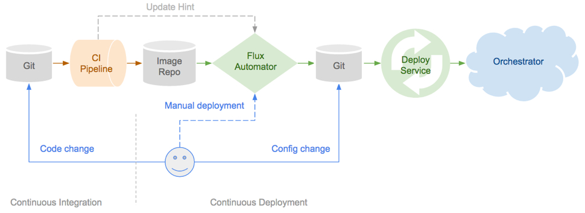
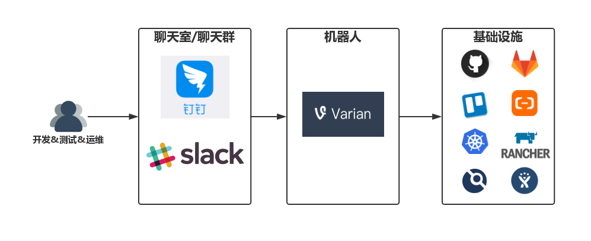
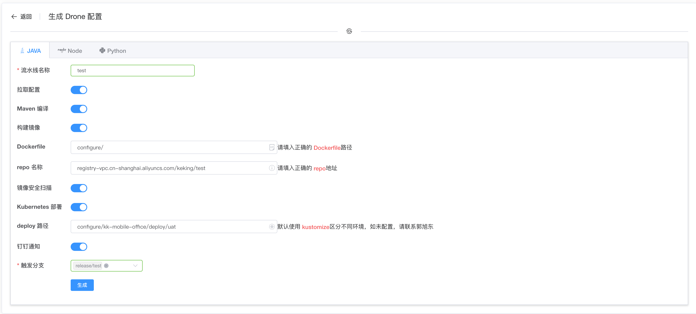
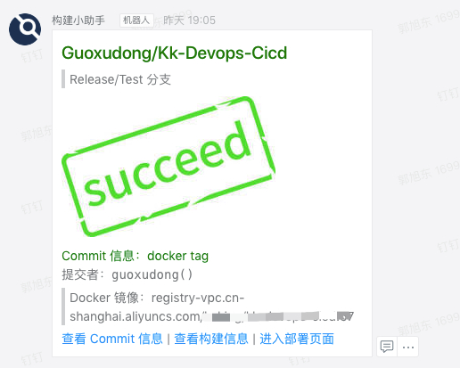
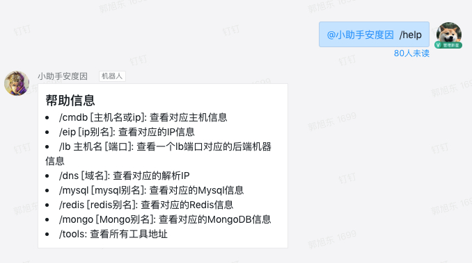

说到 GitOps 和 ChatOps ，那就不得不谈到 DevOps 。 DevOps 作为一种文化，旨在促进开发、测试和运维人员之间的沟通与协作。而促进合作的方式，往往是使用一系列工具，完成这三个角色的相互协作。这带来的好处也是显而易见的：更快的交付速度和更低的人力成本。获益于 DevOps 和公有云，一个近百人的研发团队，可以只配备一到两个专职运维人员，降低的成本不言而喻。既然 DevOps 是一种文化，那么在不同的团队则会有不同的实践，而无论实践如何，其最终目的都是一样的：最大化的实现自动化，释放更多的人力资源，创建更大价值。

而 GitOps 和 ChatOps ，则是 DevOps 的两种实践。这两种实践分别通过使用 `版本控制软件 Git` 和`实时聊天软件`来达到提升交付速度和研发效率的目的。

## GitOps

GitOps 是一种实现持续交付的模型，它的核心思想是将应用系统的声明性基础架构和应用程序存放在 Git 的版本控制库中。

将 Git 作为交付流水线的核心，每个开发人员都可以提交拉取请求（Pull Request）并使用 Gi​​t 来加速和简化 Kubernetes 的应用程序部署和运维任务。通过使用像 Git 这样的简单熟悉工具，开发人员可以更高效地将注意力集中在创建新功能而不是运维相关任务上。

通过应用 GitOps ，应用系统的基础架构和应用程序代码可以快速查找来源——基础架构和应用程序代码都存放在 gitlab 、或者 github 等版本控制系统上。这使开发团队可以提高开发和部署速度并提高应用系统可靠性。

将 GitOps 应用在持续交付流水线上，有诸多优势和特点：

- 安全的云原生 CI/CD 管道模型
- 更快的平均部署时间和平均恢复时间
- 稳定且可重现的回滚（例如，根据Git恢复/回滚/ fork）
- 与监控和可视化工具相结合，对已经部署的应用进行全方位的监控

在我看来 GitOps 的最大优势就是通过完善的 git 分支管理来达到管理所有 CI/CD 管道流水线的目的，不同的环境可以对应不同分支，在该环境出现问题时候，可以直接查找对应分支代码，达到快速排查问题的目的。而对于 Git 的熟悉，更是省去学习使用一般 DevOps 工具所需的学习成本和配置时间，开发人员可以无任何培训直接上手使用，进一步降低了时间与人力成本。

## ChatOps

ChatOps 以聊天室（聊天群），即实时聊天软件为中心，通过一系列的机器人去对接后台的各种服务，开发&测试&运维人员只需要在聊天窗口中与机器人对话，即可与后台服务进行交互，整个工作的展开就像是使唤一个智能助手那样简单自然。

ChatOps 带来了很多好处：

- 公开透明。所有的工作消息都在同一个聊天平台中沉淀并公开给所有相关成员，消除沟通壁垒，工作历史有迹可循，团队合作更加顺畅。
- 上下文共享。减少因工作台切换等对消息的截断，保证消息的完整性，让工作承接有序，各角色，各工具都成为完成工作流中的一环，打造真正流畅的工作体验。
- 移动友好。只需要在前台与预设好的机器人对话即可完成与后台工具、系统的交互，在移动环境下无需再与众多复杂的工具直接对接，大大提升移动办公的可行性。
- DevOps 文化打造。用与机器人对话这种简单的方式降低 DevOps 的接受门槛，让这种自动化办公的理念更容易的扩展到团队的每一个角落。

对于 ChatOps 的理解最早要源于在 GitHub 上参与开源项目的一些经历，在向 Kubernetes 相关项目提交 PR 时，会有一个名叫 `k8s-ci-robot` 的小机器人来自动为该 RP 打上标签，并且根据你提交 PR 时的 comment 信息来为你分配 Reviewers，如果没有填的话，则会自动为你分配 Reviewers 等功能。同时可以在 comment 中输入命令，还可以进行其他的操作，详见：[命令列表](https://prow.k8s.io/command-help)。而其实这个机器人的后端就是名为 [Prow](https://github.com/kubernetes/test-infra/tree/master/prow#bots-home) 的由 Google 发起的适应云原生 CI/CD 开源项目，有兴趣的话推荐阅读：[Prow 快速入门向导](https://www.servicemesher.com/blog/prow-quick-start-guide/)。

而一篇名为：[《湾区日报是如何运作的？》](https://wanqu.co/b/7/%E6%B9%BE%E5%8C%BA%E6%97%A5%E6%8A%A5%E6%98%AF%E5%A6%82%E4%BD%95%E8%BF%90%E4%BD%9C%E7%9A%84/) 文章更是让我坚定信心开始开发自己 ChatOps 系统。该文章介绍作者是怎么运营一个名叫湾区日报的个人博客，这个博客通过11个渠道（网站，iOS app，Android app、微博，微信，Twitter，Chrome 浏览器推送、Facebook、邮件订阅、RSS、Telegram）推荐给读者，而这个11个渠道的发布都是通过 slack 和作者开发的小机器人完成。在我还在为使用脚本可以在多渠道发布个人技术博客而沾沾自喜的时候，人家早在多年前就开始使用 ChatOps 模式向多渠道使用多格式自动推送文章了。这也坚定了我开发我们自己的 ChatOps 系统的决心。

## GitOps & ChatOps 的实践

### 使用 Drone 实现 GitOps

DevOps 文化早已在我司落地，这也是为什么我们有将近百人的研发团队，却只有两个专职运维的原因。CI/CD 方面我们之前使用的是 jenkins ， jenkins 是一个十分强大的工具，但是随着公司的发展，项目也越来越多，粗略统计了一下我们在 jenkins 中有几百个 Job ，虽然所有项目都使用 Jenkinsfile 的方式将 pipeline 持久化到了 gitlab 中，但是所有的 Job 配置，包括参数化构建配置，SCM 配置等都是保存在 jenkins 上，一旦有失，几百个 Job ...哭都没有地方哭去（别问我是怎么知道的）。

经过调研我们选择了 [drone CI](https://drone.io/) 进行 GitOps ，通过自己开发不同功能的插件，完善了我们的整个 CI/CD 流水线。而插件的开发也并不是从头开始，而是直接 fork 现有的插件进行定制化的二次开发。

将项目配置进行了分离，配置使用单独的 git 仓库维护，同时整合了镜像安全扫描，钉钉通知等功能。

由于 drone CI 的配置文件 `.drone.yml` 需要统一规范，所以我们在自己的 DevOps 平台开发了 Drone 配置页面，帮助开发自主配置。我们提供了 `Java` 、 `Node` 、 `Python` 三种配置模板，并且由于 DevOps 平台已与 GitLab 集成，可以直接将生成的 `.drone.yml` 文件插入到相应 git 项目中。

同时也提供了钉钉构建通知，在构建成功后会发送到相应的开发群组中，如果需希望自动发布的话，也可点击通知中的连接自行发布。

### 自研平台配合钉钉 Outgoing 功能实现 ChatOps

前面的构建通知机器人使用的是钉钉的[自定义机器人](https://open-doc.dingtalk.com/microapp/serverapi2/qf2nxq)，将构建信息推送到各个项目群中。而钉钉机器人的 Outgoing 功能，则可用来实现 ChatOps 的功能（__注意：钉钉的 Outgoing 功能目前还处于灰度测试阶段，想要使用的需要联系官方管理员开启该功能__）。

由于我司专职运维人员只有两位，管理着整个团队全部的基础设施。但是随着开发团队的扩张，运维人员每天要处理大量的咨询类工作，而这类工作有着重复性强和技术性弱的特点，对于运维人员的技术水平毫无提升，那么这类工作交给机器人岂不是更好。得益于我们 DevOps 平台完善的 API ，小助手机器人的开发并不困难。

小助手机器人的诞生，极大的提高了咨询类工作的效率，同时也释放了运维人员的工作时间，运维人员可以将更多精力投注到更有技术含量的事情上。

小助手机器人还有运维版本，功能包括：批量操作虚拟机、重启服务、DNS 解析、Kubernetes 信息检测&操作等功能，由于还是测试版本，这里就不做详细介绍了。

## 结语

上文中简要的介绍了 GitOps 和 ChatOps 在我司的落地实践，从决定落地 GitOps 和 ChatOps 至今不过短短的2个月。得益于我司浓厚的 DevOps 文化氛围，让我可以在极短的时间内将 GitOps 和 ChatOps 落地实践。但毕竟实践的时间还短，很多需求还在收集和调研中，后续的开发还在持续进行。欢迎对 GitOps 和 ChatOps 感兴趣的同学一起交流，共同提升。

## 参考资料

1. [GitOps](https://www.weave.works/technologies/gitops/)
2. [DevOps 理念升级，ChatOps 概述及实践经验](http://bearyinnovative.com/salon-chatops/)
