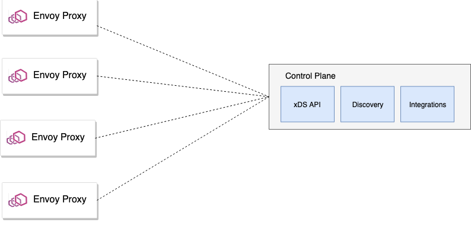
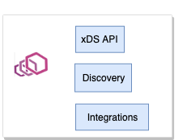
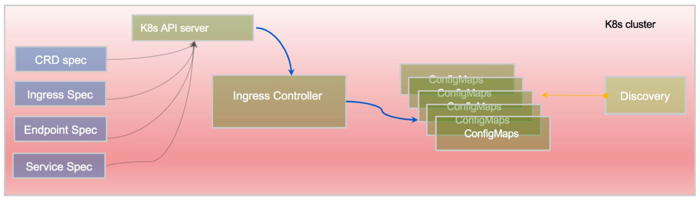
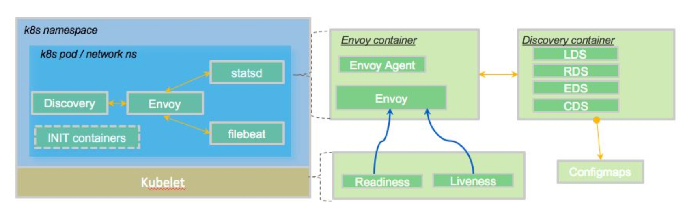

本文为翻译文章，[点击查看原文](https://blog.christianposta.com/guidance-for-building-a-control-plane-for-envoy-deployment-tradeoffs/)。

## 编者按

作为探索为Envoy构建控制平面系列文章的第5部分，本文介绍了部署控制平面的选项与权衡，着重阐述了保持控制平面与数据平面解耦的几大好处，并且在文章结尾建议构建一个可拔插的控制平面以支持各种新特性、拓展和适配。

## 前言

这是探索为Envoy构建控制平面[系列文章](https://blog.christianposta.com/envoy/guidfor-build-a-control-plane-to-management-Envoy-Proxy-based-infrastructure/)的第5部分。

- [采用一种机制来动态更新Enovy的路由、服务发现和其他配置](https://blog.christianposta.com/envoy/guidance-for-building-a-control-plane-to-manage-envoy-proxy-based-infrastructure/)
- [识别构成控制平面的组件，包括支持存储、服务发现api、安全组件等](https://blog.christianposta.com/envoy/guidance-for-building-a-control-plane-for-envoy-identify-components/)
- [构建最适合你的使用场景和组织架构的特定域的配置对象和api](https://blog.christianposta.com/envoy/guidance-for-building-a-control-plane-for-envoy-domain-specific-configuration-api/)
- [考虑如何最好地使你的控制平面可插在你需要它的地方](https://blog.christianposta.com/guidance-for-building-a-control-plane-for-envoy-build-for-pluggability/)
- 部署各种控制平面组件的选项 (本文)
- 基于控制平面的测试工具的思考

在上一篇文章中，我们探讨了为什么可拔插控制平面对于跟上快速迭代的Envoy API以及与组织可能采用的不同工作流集成至关重要。在本文中，我们将讨论部署各种控制平面组件时的权衡。

## 部署控制平面组件

一旦您构建并设计了控制平面及其各种支持组件，您就需要准确地决定如何部署它的组件。在确定最适合您的实现时，您需要权衡各种安全性、可伸缩性和可用性问题。这些选项里包括将控制平面组件与数据平面一起部署，以及将控制平面与数据平面完全解耦。这里也有一个折中方案：部署一些与控制平面共存的组件，并保持一些集中。让我们来看看。

在Istio service-mesh项目中，控制平面组件与数据平面分别部署和运行。这在服务网格实现中非常常见。也就是说，数据平面与应用程序一起运行，处理所有的应用程序流量，并通过gRPC流上的xDS API与控制平面通信。控制平面组件通常在它们自己的命名空间中运行，并且在理想情况下，不当操作或者意外使用将导致组件被锁定。

Gloo项目作为一个API网关，遵循类似的部署模型。控制平面组件与数据平面解耦，Envoy数据平面使用xDS gRPC流来收集关于监听器、路由、端点和集群等的配置。您可以使用Gloo部署与数据平面代理共存的控制面板组件，但不建议这样做。我们稍后会看一些权衡。

最后，我们研究了控制平面组件与数据平面的协同部署。在Contour项目中，默认情况下，控制平面组件是与数据平面一起部署的，尽管[存在一个拆分部署的选项](https://github.com/heptio/contour/blob/master/docs/deploy-seperate-pods.md)。Contour实际上利用CRD或Ingress资源进行配置，所以所有的配置文件处理和监控都发生在Kubernetes中。然而，xDS服务却是与数据平面共同部署(同样，这是默认情况—您依然可以将它们拆分)。

当[eBay为他们的Envoy部署构建了控制平面](https://www.youtube.com/watch?v=a1tXFUrqt5M&list=PLj6h78yzYM2PF_iYEBntfR0m4KAZET18Q&index=14&t=0s)时，他们还将控制平面(discovery pieces)的*部分组件*与数据平面联合部署。他们基本上自己实现了一个控制器来监视CRD、Ingress和服务资源，并且生成配置映射。然后，这些配置映射将由与Pod一起运行的`discovery`容器使用，并随着改动重新热启动，以及更新Envoy。

在Ebay的案例中，我们看到了一种“混合”的方法，并且深受其架构其余部分的具体影响。那么，在为Envoy评估控制平面时，或者考虑自己构建控制平面时，应该如何部署控制平面组件?

### 我应该将控制平面与数据平面分开吗?

各种方法都有优缺点。[Gloo团队](https://github.com/solo-io/gloo/graphs/contributor)认为，对于大多数应用场景来说，保持控制平面独立是正确的选择，应该避免将控制平面与数据平面完全部署在一起。

如果Envoy是L7网络的核心和灵魂，那么控制平面就是大脑。部署与数据平面分离的控制平面非常重要，原因如下:

- 安全性—如果您的数据平面中的某个节点受到攻击，您肯定不希望因为允许您的控制平面受到攻击而放弃对其他应用程序和网络的控制，从而加剧您的情况。此外，控制平面可以处理密钥、证书或其他机密的分发，这些机密信息应该与数据平面分开保存。
- 伸缩性—您可能最终会以不同的方式伸缩数据平面和控制平面。例如，如果您的控制平面正在轮询Kubernetes中的服务/端点等，那么您肯定不希望将这些组件与您的数据平面放在一起—您将扼杀任何可伸缩性的机会。
- 分组—您的数据平面可能具有不同的角色和职责；例如，您可能在边缘有数据平面Envoy，这将需要不同的安全性和网络状态，而不是用于微服务的共享代理池与您可能部署的任何sidecar代理。将控制平面与数据平面放在一起会使数据和配置分开变得更加困难。
- 资源利用—您可能希望根据组件分配或限制某些资源使用。例如，您的数据平面可能比控制平面更需要计算(控制平面可能更需要内存)，并且您将使用不同的资源限制来满足这些角色的需求。将它们分开可以让您获得更多细粒度的资源池选项，而不只是将它们集中在一起。此外，如果控制平面和数据平面被配置在一起，并且争夺相同的资源，您可能会得到难以诊断的奇怪的尾延迟(Tail Latency)。
- 部署/生命周期—您可能希望独立于数据平面对控制平面进行补丁、升级或其他服务。
- 存储—如果您的控制平面需要任何类型的存储，那么您可以单独配置它，如果您将组件分离出来，则不需要涉及数据平面。

由于这些原因，我们建议保持控制平面与数据平面解耦。

## 要点

为Envoy构建控制平面并不容易，一旦您了解了工作流需要从控制平面得到什么，您就需要了解如何最好地部署它。Gloo团队建议构建一个可拔插的控制平面，并将其与数据平面分开，原因如上所述。Gloo的体系结构是这样构建的，它使[Gloo团队](https://github.com/solo-io/gloo/graphs/contributor)能够快速添加任何新特性和扩展，以支持任何平台、配置、过滤器，以及更多。
