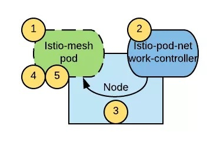

本文为翻译文章，[点击查看原文](https://blog.openshift.com/increasing-security-of-istio-deployments-by-removing-the-need-for-privileged-containers/)。

随着 Istio 1.0 版本的发布，Istio 正在为开发云原生应用并希望采用服务网格解决方案的公司准备黄金时间。但是，有一个潜在的问题可能会降低这些公司的采用率：服务网格内的 Pod 需要提升权限才能正常运行。

为了从一定程度上缓解这个问题，本文将介绍一个新的工具：[istio-pod-network-controller](https://github.com/sabre1041/istio-pod-network-controller)。

## 问题

作为服务网格正常操作的一部分，Istio 需要操作 Pod 的 `iptables` 规则，以拦截所有的进出 Pod 的流量，并注入使 Istio 能够发挥作用的 `Sidecar`。由于 iptables 规则是针对网络命名空间操作的，所以在某个 Pod 中修改 iptables 规则不会影响到其他 Pod 或运行该 Pod 的节点。

`init` 容器是 Istio Pod 的一部分，负责在应用程序容器启动之前添加这些 iptables 规则。如果想在容器中操作 iptables 规则，必须通过开启 [NET_ADMIN capability](http://man7.org/linux/man-pages/man7/capabilities.7.html) 来提升操作权限。`NET_ADMIN` 是一种允许你重新配置网络的 [`Linux Capability`](http://man7.org/linux/man-pages/man7/capabilities.7.html)，这意味着具有该特权的 Pod 不仅可以将自身添加到 Istio 网格，还可以干扰其他 Pod 的网络配置以及节点本身的网络配置。但是在通常情况下，我们是不建议在共享租户的集群中运行具有此特权权限的应用程序 Pod 的。

`OpenShift` 提供了一种通过称为 [Security Context Context (SCC)](https://docs.openshift.com/container-platform/3.10/admin_guide/manage_scc.html) 的机制来控制 Pod 可以拥有的权限的方法（在本例中指的是 Linux Capabilities）。Openshift 中提供了一些开箱即用的 `SCC` 配置文件，集群管理员还可以添加更多自定义配置文件。允许正常运行 Istio 的唯一开箱即用的 `SCC` 配置文件是 `privileged` 配置文件。为了将某个命名空间中的 Pod 添加到 Istio 服务网格，必须执行以下命令才能访问 `privileged SCC`：

```bash
$ oc adm policy add-scc-to-user privileged -z default -n <target-namespace>
```

但是这样做本质上就为此命名空间中的所有 Pod 提供了 `root` 权限。而运行普通应用程序时，由于潜在的安全隐患，通常又不建议使用 root 权限。

虽然这个问题一直困扰着 Istio 社区，但迄今为止 Kubernetes 还没有提供一种机制来控制给予 Pod 的权限。从 [Kubernetes 1.11](https://github.com/kubernetes/kubernetes/blob/master/CHANGELOG-1.11.md) 开始，[Pod 安全策略（PSP）](https://kubernetes.io/docs/concepts/policy/pod-security-policy/)功能已经作为 `beta feature` 引入，PSP 与 SCC 的功能类似。一旦其他 Kubernetes 发行版开始支持开箱即用的 PSP，Istio 网格中的 Pod 就需要提升权限才能正常运行。

## 解决方案

解决这个问题的一种方法是将配置 Pod 的 iptables 规则的逻辑移出 Pod 本身。该方案通过一个名叫 `istio-pod-network-controller` 的 DaemonSet 控制器，来监视新 Pod 的创建，并在创建后立即在这些新 Pod 中配置相应的 iptables 规则。下图描绘了该解决方案的整体架构：



流程如下：

1. 创建一个新 Pod。
2. 创建该 Pod 的节点上运行的 `istio-pod-network-controller` 检测新创建的 Pod 是否属于 Istio 网格，如果属于则对其进行初始化。
3. Pod 中的 init 容器等待初始化 `annotation` 出现，确保应用程序容器和 [Sidecar](https://istio.io/zh/docs/setup/kubernetes/sidecar-injection/) Envoy 代理仅在 iptables 初始化完成后再启动。
4. 启动 Sidecar 容器和应用程序容器。

有了这个解决方案，由于 Envoy Sidecar 需要以特定的非 root 用户 ID 运行，在 Istio 网格中运行的 Pod 只需要 `nonroot` SCC 就行了。

理想情况下，我们希望 Istio 中的应用程序通过 `restricted` SCC 运行，这是 Openshift 中的默认值。虽然 `nonroot` SCC 比 `restricted` SCC 的权限稍微宽泛一些，但这种折衷方案是可以接受的，这与使用 `privileged` SCC 运行每个 Istio 应用程序 Pod 相比，是一个巨大的进步。

现在，我们通过给 `istio-pod-network-controller` 提供 privileged 配置文件和 `NET_ADMIN` capability 来允许它修改其他 Pod 的 iptables 规则，这通常是可以接受的方案，因为该组件将由集群管理员以与 Istio 控制平面类似的方式安装和管理。

## 安装指南

根据安装指南假设 Istio 已成功安装在 `istio-system` 命名空间中，并且已经开启了[自动注入功能](https://istio.io/zh/docs/setup/kubernetes/sidecar-injection/#automatic-sidecar-injection)。克隆 istio-pod-network-controller [仓库](https://github.com/sabre1041/istio-pod-network-controller)，然后执行以下命令以使用 `Helm` 安装 `istio-pod-network-controller`：

```bash
$ helm template -n istio-pod-network-controller ./chart/istio-pod-network-controller | kubectl apply -f -
```

#### 测试自动注入功能

执行以下命令测试自动注入功能：

```bash
$ kubectl create namespace bookinfo
$ kubectl label namespace bookinfo istio-injection=enabled
$ kubectl annotate namespace bookinfo istio-pod-network-controller/initialize=true
$ kubectl apply -f examples/bookinfo.yaml -n bookinfo
```

其他部署方案请参考[官方仓库的文档](https://github.com/sabre1041/istio-pod-network-controller)。

## 总结

`istio-pod-network-controller` 是一个用来提高 Istio Deployment 安全性的可选工具，它通过消除在 Istio 网格中运行使用 privileged SCC 的 Pod 的需求，并让这些 Pod 只通过 nonroot SCC 运行，以此来提高安全性。如果您决定采用此解决方案，请注意这并不是 `Red Hat` 正式支持的项目。
