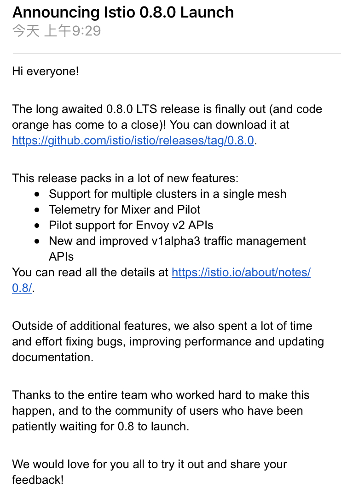

北京时间 2018 年 6 月 1 日（儿童节）上午 9: 30 Istio 0.8.0 LTS（长期支持版本）发布。该版本除了常见的一堆错误修复和性能改进之外，还包含以下更新和新功能。

### 网络

- **改进了流量管理模型**。我们终于准备好了推出[新的流量管理配置模型](https://istio.io/blog/2018/v1alpha3-routing/)。该模型增加了许多新功能并解决了先前模型的可用性问题。`istioctl` 中内置了一个转换工具来帮助您迁移旧模型。[试用新的流量管理模型](https://istio.io/docs/tasks/traffic-management)。
- **Ingress/Egress 网关**。我们不再支持将 Kubernetes Ingress 配置与 Istio 路由规则相结合，因为这会导致一些错误和可靠性问题。Istio 现在支持独立于 Kubernetes 和 Cloud Foundry 平台的 ingress/egress [网关](https://istio.io/docs/concepts/traffic-management/rules-configuration/#gateways)，并与路由规则无缝集成。
- **新的网关支持基于[服务器名称指示（Server Name Indication）](https://en.wikipedia.org/wiki/Server_Name_Indication)**的路由，以及根据 SNI 值提供证书。HTTPS 访问外部服务将基于 SNI自动配置。
- **Envoy v2**。用户可以选择使用 Envoy 的 v2 API 注入 sidecar。在这种模式下，Pilot使用 [Envoy 的 v2 聚合发现服务 API](https://www.envoyproxy.io/docs/envoy/latest/configuration/overview/v2_overview)将配置推送到数据平面。该方式提高了控制平面的可扩展性。
- **受限入站端口**。我们现在将 Pod 中的入站端口限制为由该 Pod 内运行的应用程序所声明的端口。

### 安全

- **介绍 Citadel**。我们终于给安全组件确定了名字。它就是我们之前称呼的 Istio-Auth 或 Istio-CA，现在我们将它称之为 Citadel。
- **多集群支持**。对于多集群部署，支持在每集群中使用 Citadel，以便所有 Citade 都拥有相同的根证书且工作负载可以通过网格彼此验证。
- **验证策略**。我们引入了可用于配置服务间认证策略身份认证（相互 TLS）和最终用户认证。这是启用相互 TLS 的推荐方式（通过现有的配置标志和服务注释）。[了解更多](https://istio.io/docs/tasks/security/authn-policy/)。

### 遥测

- **自我报告**。现在 Mixer 和 Pilot 产生的流量也会通过 Isitio 的遥测管道，就像网格中的其他服务一样。

### 部署

- **上碟 Istio 小菜**。Istio 有丰富的功能，但是用户不一定要全部安装和使用。通过使用 Helm 或 `istioctl gen-deploy`，用户可以选择安装他们想要的功能。例如，用户可能只想安装 Pilot 并享受流量管理功能，无需处理 Mixer 或 Citadel。详细了解[通过 Helm 定制](https://istio.io/docs/setup/kubernetes/helm-install/#customization-with-helm)和 [`istioctl gen-deploy`](https://istio.io/docs/reference/commands/istioctl/#istioctl%20gen-deploy)。

### Mixer 适配器

- **CloudWatch**。Mixer 现在可以向 AWS CloudWatch 报告指标。[了解更多](https://istio.io/docs/reference/config/policy-and-telemetry/adapters/cloudwatch/)。

### 0.8 版本的已知问题

- 指向 headless serivce 的虚拟服务网关不起作用（[Issue #5005](https://github.com/istio/istio/issues/5005)）。
- [在 Kubernetes 1.10.2 中有问题](https://github.com/istio/istio/issues/5723)。解决方法是使用 Kubernetes 1.9 或将节点镜像切换到 Ubuntu。
