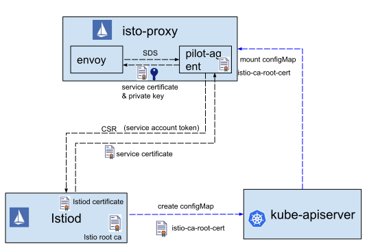
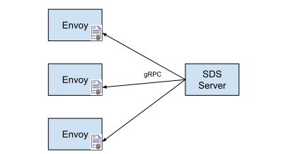
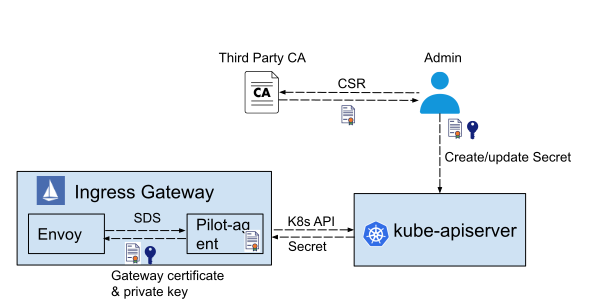
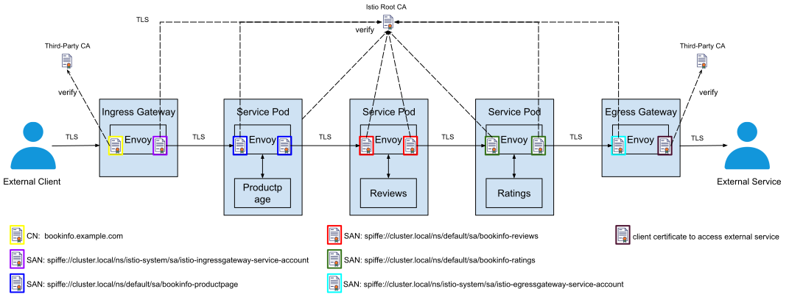

在上一篇文章[一文带你彻底厘清 Kubernetes 中的证书工作机制](/blog/k8s-certificate/)中，我们介绍了 Kubernetes 中证书的工作机制。在这篇文章中，我们继续探讨 Istio 是如何使用证书来实现网格中服务的身份认证和安全通信的。

本文是对 Istio 认证工作机制的深度分析，假设读者已经了解 Service Mesh 以及 Istio 的相关基础概念，因此在本文对此类基础概念不再解释。对于 Istio 不熟悉的读者，建议先阅读 Istio 官方网站上的的这篇基础介绍 [What is Istio?](https://istio.io/docs/concepts/what-is-istio/)。

## Istio 安全架构

Istio 为微服务提供了无侵入，可插拔的安全框架。应用不需要修改代码，就可以利用 Istio 提供的双向 TLS 认证实现服务身份认证，并基于服务身份信息提供细粒度的访问控制。Istio 安全的高层架构如下图所示：


图1. Istio Security Architecture，图片来源[istio.io](https://istio.io/docs/concepts/security/#high-level-architecture)

图中展示了 Istio 中的服务认证和授权两部分内容。让我们暂时忽略掉授权部分，先关注认证部分。服务认证是通过控制面和数据面一起实现的：
 * 控制面：Istiod 中实现了一个 CA （Certificate Authority，证书机构） 服务器。该 CA 服务器负责为网格中的各个服务签发证书，并将证书分发给数据面的各个服务的sidecar代理。
 * 数据面：在网格中的服务相互之间发起 plain HTTP/TCP 通信时，和服务同一个 pod 中的sidecar代理会拦截服务请求，采用证书和对端服务的sidecar代理进行双向 TLS 认证并建立一个 TLS 连接，使用该 TLS 连接来在网络中传输数据。

## 控制面证书签发流程

图1是对 Istio 安全架构的一个高度概括的描述，让我们把图1中控制面的交互展开，看一下其中的细节。


图2. Istio 证书分发流程

我们先暂时忽略图中右边蓝色虚线的部分（稍后会在 [控制面身份认证](#heading1) 部分讲到），图中左半部分描述了 Istio 控制面向 Envoy 签发证书的流程：
1. Envoy 向 pilot-agent 发起一个 SDS (Secret Discovery Service) 请求，要求获取自己的证书和私钥。
2. Pilot-agent 生成私钥和 CSR （Certificates Signing Request，证书签名请求），向 Istiod 发送证书签发请求，请求中包含 CSR 和该 pod 中服务的身份信息。
3. Istiod 根据请求中服务的身份信息（Service Account）为其签发证书，将证书返回给 Pilot-agent。
4. Pilot-agent 将证书和私钥通过 SDS 接口返回给 Envoy。

### 为什么要通过 Pilot-agent 中转？

从图2可以看到，Istio 证书签发的过程中涉及到了三个组件： Istiod (Istio CA) ---> Pilot-agent ---> Enovy。为什么其他 xDS 接口都是由 Istiod 直接向 Envoy 提供，但 SDS 却要通过 Pilot-agent 进行一次中转，而不是直接由 Envoy 通过 SDS 接口从 Istiod 获取证书呢？这样做主要有两个原因。

首先，在 Istio 的证书签发流程中，由 Pilot-agent 生成私钥和 CSR，再通过 CSR 向 Istiod 中的 CA 申请证书。在整个过程中，私钥只存在于本地的 Istio-proxy 容器中。如果去掉中间 Pilot-agent 这一步，直接由 Envoy 向 Istiod 申请证书，则需要由 Istiod 生成私钥，并将私钥和证书一起通过网络返回给 Envoy，这将大大增加私钥泄露的风险。

另一方面，通过 Pilot-agent 来提供 SDS 服务，由 Pilot-agent 生成标准的 CSR 证书签名请求，可以很容易地对接不同的 CA 服务器，方便 Istio 和其他证书机构进行集成。

### 控制面身份认证

要通过服务证书来实现网格中服务的身份认证，必须首先确保服务从控制面获取自身证书的流程是安全的。Istio 通过 Istiod 和 Pilog-agent 之间的 gRPC 通道传递 CSR 和证书，因此在这两个组件进行通信时，双方需要先验证对方的身份，以避免恶意第三方伪造 CSR 请求或者假冒 Istiod CA 服务器。在目前的版本中(Istio1.6)，Pilot-agent 和 Istiod 分布采用了不同的认证方式。

* Istiod 身份认证
	* Istiod 采用其内置的 CA 服务器为自身签发一个服务器证书（图2中的 Istiod certificate），并采用该服务器证书对外提供基于 TLS 的 gPRC 服务。
	* Istiod 调用 Kube-apiserver 生成一个 ConfigMap， 在该 ConfigMap 中放入了 Istiod 的 CA 根证书(图2中的 istio-ca-root-cert)。
	* 该 ConfigMap 被 Mount 到 Istio-proxy 容器中，被 Pilot-agent 用于验证 Istiod 的服务器证书。
	* 在 Pilot-agent 和 Istiod 建立 gRPC 连接时，Pilot-agent 采用标准的 TLS 服务器认证流程对 Istiod 的服务器证书进行认证。
* Pilot-agent 身份认证
	* 在 Kubernetes 中可以为每一个 pod 关联一个 [Service Account](https://kubernetes.io/docs/tasks/configure-pod-container/configure-service-account/)，以表明该 pod 中运行的服务的身份信息。例如 bookinfo 中 reviews 服务的 service accout 是 “bookinfo-reviews” 。
	* Kubernetes 会为该 service account 生成一个 jwt token，并将该 token 通过 secret 加载到 pod 中的一个文件。
	* Pilot-agent 在向 Istiod 发送 CSR 时，将其所在 pod 的 service account token 也随请求发送给 Istiod。
	* Istiod 调用 Kube-apiserver 接口验证请求中附带的 service account token，以确认请求证书的服务身份是否合法。

备注：除了 Kubernetes 之外， Istio 也支持虚机部署，在虚机部署的场景下，由于没有 service account，Pilot-agent 和 Pilotd 之间的身份认证方式有所不同。由于 Istio 的主要使用场景还是 Kubernetes，本文只分析 Kubernetes 部署场景。

## SDS 工作原理

和其他 [xDS](https://www.envoyproxy.io/docs/envoy/latest/api-docs/xds_protocol) 接口一样，SDS 也是 Envoy 支持的一种动态配置服务接口。Envoy 可以通过 [SDS（secret discovery service）](https://www.envoyproxy.io/docs/envoy/latest/configuration/security/secret) 接口从 SDS 服务器自动获取证书。和之前的方式相比，SDS 最大的好处就是简化了证书管理。在没有使用 SDS 前，Istio 中的服务证书被创建为 Kubernetes secret，并挂载到代理容器中。如果证书过期了，则需要更新 secret 并重启 Envoy 容器，以启用新的证书。使用SDS后，SDS 服务器（Pilot-agent充当了 SDS 服务器的角色）将向 Envoy 实例主动推送证书。如果证书过期，SDS 服务器只需将新的证书推送到 Envoy 例中，Envoy 会使用新的证书来创建链接，无需重新启动。


图3. Envoy SDS 服务

可以看到，Istio 采用 SDS 后，避免了在证书更新后重启 Envoy，大大减少了证书更新对业务的影响。同时，由于 Pilot-agent 和 Envoy 处于同一容器中，私钥只存在于本地容器，避免了在网络中传递私钥，也降低了私钥泄露的安全风险。

SDS 服务向 Envoy 下发的数据结构为```extensions.transport_sockets.tls.v3.Secret```,其结构如下：

```json
{
  "name": "...",                            // Secret 名称
  "tls_certificate": "{...}",               // 数字证书
  "session_ticket_keys": "{...}",
  "validation_context": "{...}",            // 证书验证信息
  "generic_secret": "{...}"
}
```

其中在 Istio 中用到的主要是 ```tls_certificate``` 和 ```validation_context```。 分别用于传递数字证书和验证对方证书使用到的根证书。下面是这两个字段的结构，结构中标注了我们主要需要关注的内容。

```tls_certificate```
```json
{
  "certificate_chain": "{...}",           // 证书内容
  "private_key": "{...}",                 // 证书的私钥
  "private_key_provider": "{...}",
  "password": "{...}"
}
```

```validation_context```
```json
{
  "trusted_ca": "{...}",                 // CA 根证书
  "verify_certificate_spki": [],
  "verify_certificate_hash": [],
  "match_subject_alt_names": [],         // 需要验证的 subject alt name
  "crl": "{...}",
  "allow_expired_certificate": "...",
  "trust_chain_verification": "..."
}
```

## 网格 Sidecar 证书配置

在 Istio 的 Enovy sidecar 配置中，有两处需要通过 SDS 来配置证书：

* Inbound Listener：由于Enovy 通过 Listener 对外提供服务，需要通过 SDS 配置服务器证书，服务器证书私钥，以及验证下游客户端证书的 CA 根证书。
* Outbound Cluster：对于上游的 Cluster 而言，Envoy 是客户端的角色，因此需要在 Cluster 中通过 SDS 配置客户端证书，客户端证书私钥，以及验证上游服务器的 CA 根证书。

下面我们来看一下 bookinfo 示例中 Envoy sidecar代理上 reviews 微服务相关的证书配置，以对 Istio 中 SDS 的运作机制有一个更清晰的认识。为了简略起见，本文只显示了部分关键的配置。你也可以查看 Github 上的[完整配置](https://github.com/zhaohuabing/bookinfo-bookinfo-config-dump/blob/istio1.5.4/reviews-config-dump)。

通过 Envoy 的管理端口，可以导出 Envoy 中的当前配置，导出命令如下：
```bash
kubectl exec reviews-v1-6d8bc58dd7-ts8kw -c istio-proxy curl http://127.0.0.1:15000/config_dump > config_dump
```

配置文件中 SDS 服务器的定义如下，Pilot-agent 在 ```/etc/istio/proxy/SDS``` 这路径上通过 unix domain socket 提供了一个 SDS 服务器。

```json
{
  "name": "sds-grpc",
  "type": "STATIC",
  "connect_timeout": "10s",
  "hidden_envoy_deprecated_hosts": [
   {
    "pipe": {
     "path": "/etc/istio/proxy/SDS"
    }
   }
  ],
  "http2_protocol_options": {}
}
```

Details Pod 在 9080 端口对外提供服务，因此需要通过 SDS 配置 9080 端口上的服务端证书和验证客户端证书的 CA 根证书。

```json
{
  "name": "virtualInbound",                                // 15006端口上的虚拟入向监听器
  "active_state": {
  "version_info": "2020-05-14T03:59:54Z/25",
  "listener": {
   "@type": "type.googleapis.com/envoy.api.v2.Listener",
   "name": "virtualInbound",
   "address": {
    "socket_address": {
     "address": "0.0.0.0",
     "port_value": 15006
    }
   },
   "filter_chains": [
   {
     "filter_chain_match": {
      "prefix_ranges": [
       {
        "address_prefix": "10.44.0.8",
        "prefix_len": 32
       }
      ],
      "destination_port": 9080                            // 用于处理发向reviews服务9080端口的业务请求的filter chain
     },
     "filters": [...],
     "transport_socket": {
      "name": "envoy.transport_sockets.tls",
      "typed_config": {
       "@type": "type.googleapis.com/envoy.api.v2.auth.DownstreamTlsContext",
       "common_tls_context": {
        "alpn_protocols": [
         "h2",
         "http/1.1"
        ],
        "tls_certificate_sds_secret_configs": [          // 配置服务器端证书
         {
          "name": "default",                             // 服务器证书 Secret 名称
          "sds_config": {
           "api_config_source": {
            "api_type": "GRPC",
            "grpc_services": [
             {
              "envoy_grpc": {
               "cluster_name": "sds-grpc"               // 配置用于获取服务器端证书的 SDS 服务器
              }
             }
            ]
           }
          }
         }
        ],
        "combined_validation_context": {
         "default_validation_context": {},
         "validation_context_sds_secret_config": {     // 配置验证客户端证书的 CA 根证书
          "name": "ROOTCA",                            // CA 根证书 Secret 名称
          "sds_config": {
           "api_config_source": {
            "api_type": "GRPC",
            "grpc_services": [
             {
              "envoy_grpc": {
               "cluster_name": "sds-grpc"             // 配置用于获取 CA 根证书的 SDS 服务器
              }
             }
            ]
           }
          }
         }
        }
       },
       "require_client_certificate": true
      }
     }
    }
   ],
 }
}
```

客户端 Pod 上的 Enovy 通过 reviews outbound cluster 访问上游 reviews 服务，因此需要在该 cluster 上配置客户端证书以及验证服务器端证书的 CA 根证书。在这里我们需要注意的是，Envoy 在验证服务器端证书时会同时验证证书中的 subject alternative name 字段。该字段中设置的是 reviews 服务 Pod 关联的 Service Account 名称。 由于 Service Account 是 Istio 中认可的一种用户账户，因此通过为 Service Account 设置不同的资源访问权限，可以进一步实现细粒度的权限控制，例如按照 URL 进行授权。

```json
 {
  "version_info": "2020-05-14T03:15:47Z/18",
  "cluster": {
   "@type": "type.googleapis.com/envoy.api.v2.Cluster",
   "name": "outbound|9080||reviews.default.svc.cluster.local",
   "type": "EDS",
   "eds_cluster_config": {
    "eds_config": {
     "ads": {}
    },
    "service_name": "outbound|9080||reviews.default.svc.cluster.local"
   },
   "service_name": "outbound|9080||reviews.default.svc.cluster.local"
  },
  "circuit_breakers": {...},
  "filters": [...],
  "transport_socket_matches": [
   {
    "name": "tlsMode-istio",
    "match": {
     "tlsMode": "istio"
    },
    "transport_socket": {
     "name": "envoy.transport_sockets.tls",
     "typed_config": {
      "@type": "type.googleapis.com/envoy.api.v2.auth.UpstreamTlsContext",
      "common_tls_context": {
       "alpn_protocols": [
        "istio-peer-exchange",
        "istio"
       ],
       "tls_certificate_sds_secret_configs": [
        {
         "name": "default",                                     // 配置用于访问 reviews 服务的客户端证书
         "sds_config": {
          "api_config_source": {
           "api_type": "GRPC",
           "grpc_services": [
            {
             "envoy_grpc": {
              "cluster_name": "sds-grpc"                        // 配置用于获取客户端证书的 SDS 服务器
             }
            }
           ]
          }
         }
        }
       ],
       "combined_validation_context": {
        "default_validation_context": {
         "verify_subject_alt_name": [
          "spiffe://cluster.local/ns/default/sa/bookinfo-reviews"  // 验证服务器证书时需要验证 SAN 中的 service account 名称
         ]
        },
        "validation_context_sds_secret_config": {
         "name": "ROOTCA",                                     // 配置验证 reviews 服务器证书的 CA 根证书
         "sds_config": {
          "api_config_source": {
           "api_type": "GRPC",
           "grpc_services": [
            {
             "envoy_grpc": {
              "cluster_name": "sds-grpc"                       // 配置用于获取 CA 根证书的 SDS 服务器
             }
            }
           ]
          }
         }
        }
       }
      },
      "sni": "outbound_.9080_._.reviews.default.svc.cluster.local"
     }
    }
   },
  ]
 },
 "last_updated": "2020-05-14T03:16:33.061Z"
}
```

上面配置中 SAN 中的 service account 名称来自于 reviews pod 中的 service account 配置。

```yaml
apiVersion: apps/v1
kind: Deployment
metadata:
  name: reviews-v1
  labels:
    app: reviews
    version: v1
spec:
  replicas: 1
  selector:
    matchLabels:
      app: reviews
      version: v1
  template:
    metadata:
      labels:
        app: reviews
        version: v1
    spec:
      serviceAccountName: bookinfo-reviews                             // 设置 reviews pod 的 service account
      containers:
      - name: reviews
        image: docker.io/istio/examples-bookinfo-reviews-v1:1.15.0
        imagePullPolicy: IfNotPresent
        env:
        - name: LOG_DIR
          value: "/tmp/logs"
        ports:
        - containerPort: 9080
...

```

在导出的配置中可以看到 Envoy 通过 SDS 服务器获取到的证书（为了简略起见，省略了证书中间的部分内容）。

```json
 {
   "@type": "type.googleapis.com/envoy.admin.v3.SecretsConfigDump",
   "dynamic_active_secrets": [
    {
     "name": "default",
     "version_info": "05-14 03:16:30.900",
     "last_updated": "2020-05-14T03:16:31.125Z",
     "secret": {
      "@type": "type.googleapis.com/envoy.extensions.transport_sockets.tls.v3.Secret",
      "name": "default",
      "tls_certificate": {
       "certificate_chain": {
        "inline_bytes": "LS0tLS1CRUdJTiBDRVJUSUZJQ0FUXXXXXXXXXXXXXXUZJQ0FURS0tLS0tCg=="           // details 服务的证书，该证书被同时用作了服务器证书和客户端证书
       },
       "private_key": {
        "inline_bytes": "W3JlZGFjdGVkXQ=="                                                        // detatils 服务证书对应的私钥
       }
      }
     }
    },
    {
     "name": "ROOTCA",
     "version_info": "2020-05-14 03:16:31.300416193 +0000 UTC m=+1.537483882",
     "last_updated": "2020-05-14T03:16:31.343Z",
     "secret": {
      "@type": "type.googleapis.com/envoy.extensions.transport_sockets.tls.v3.Secret",
      "name": "ROOTCA",
      "validation_context": {
       "trusted_ca": {
        "inline_bytes": "LS0tLS1CRUdJTiBDRVJUSUZJQ0XXXXXXXXXXXXXXXXXXXXJQ0FURS0tLS0tCg=="       // 用于验证通信对方证书的 CA 根证书
       }
      }
     }
    }
   ]
  }
```

通过上面的配置，我们可以看到，虽然需要在 Enovy sidecar配置文件中不同的位置为 Envoy 配置服务器、客户端证书以及验证对方的 CA 根证书，但 Istio 中实际上只采用了一个服务证书和 CA 根证书。Istio 将名称为 default 的证书被同时用于 Inbound Listener 的服务器证书和 Outbound Cluster 的客户端证书，并将名称为 ROOTCA 的证书被用于验证下游客户端证书和上游服务器证书的根证书。

## Gateway 证书配置

除了需要和网格内部的服务进行通信之外，Ingress Gateway 和 Egress Gateway 还需要连接到网格外部的系统。如果这些外部连接也需要采用 TLS，则 Gateway 中也要配置这些外部系统的相关证书。

Ingress Gateway 中需要如下证书相关的配置：
* 作为客户端和网格内部其他服务进行通信的客户端证书和私钥，和其他服务使用的证书类似，该证书也是由 Istio CA 颁发的。
* 验证网格内其他服务证书的 CA 根证书，该根证书是 Istio CA 的根证书。
* 作为网关向网格外部提供服务使用的服务器端证书和私钥，该证书一般是由一个权威 CA 或者第三方 CA 签发的。如果有多个 host，需要为每一个 host 分别配置配置不同的证书。
* 如果对外提供的服务需要双向 TLS 认证，还需要配置用于验证客户端证书的 CA 根证书。

Egress Gateway 中需要如下证书相关的配置：
* 作为服务器接受网格内部其他服务访问的服务器证书和私钥，和其他服务使用的证书类似，该证书也是由 Istio CA 颁发的。
* 验证网格内其他服务证书的 CA 根证书，该根证书是 Istio CA 的根证书。
* 作为出口网关访问外部服务时，如果该外部服务采用了 TLS，则需要配置一个验证该服务器证书的 CA 根证书来验证该服务器。该根证书一般是一个权威 CA 或者第三方 CA。
* 如果访问的外部服务要求双向 TLS 认证，则还需要网关配置一个该外部服务认可的客户端证书。该证书一般是由一个权威 CA 或者第三方 CA 签发的。

由于 Gateway 中配置的和外部系统相关的证书不是通过 SDS 从 Istio CA 获取的，而是采用第三方 CA 颁发的，因此到期后并不能自动更新，而需要手动进行更新。因此需要注意这些证书的有效期，在证书过期前及时重新申请证书并更新到 Gateway 配置中，以避免影响业务。

在 Gateway 上配置第三方证书的方法是采用 Kubernetes Secret 和 Istio Gateway CRD。例如我们可以采用下面的步骤在 Ingress Gateway 上配置对外提供服务使用的服务器证书。

首先创建一个 secret，该 secret 中包含了服务器证书和私钥：

```bash
kubectl create -n istio-system secret tls bookinfo-credential --key=bookinfo.example.com.key --cert=bookinfo.example.com.crt
```

然后通过 Gateway CRD 定义一个对外提供服务的虚拟主机，并指定使用刚才定义的 secret。

```yaml
apiVersion: networking.istio.io/v1alpha3
kind: Gateway
metadata:
  name: mygateway
spec:
  selector:
    istio: ingressgateway
  servers:
  - port:
      number: 443
      name: https
      protocol: HTTPS
    tls:
      mode: SIMPLE
      credentialName: httpbin-credential # 在此处设置包含了服务器证书和私钥的 secret
    hosts:
    - bookinfo.example.com
```

Istio 将此配置通过 xDS 接口下发到 Ingress Gateway Pod 中的 Envoy 上，可以在该 Envoy 的配置导出中看到 Ingress 网关对外提供的 443 端口上的证书配置（配置文件中的端口是8443，这是因为 Pod 内使用了8443端口，但对外暴露的 LoadBalancer 上的端口是443）。

```json
{
  "name": "0.0.0.0_8443",
  "active_state": {
   "version_info": "2020-05-27T07:43:51Z/21",
   "listener": {
    "@type": "type.googleapis.com/envoy.api.v2.Listener",
    "name": "0.0.0.0_8443",
    "address": {
     "socket_address": {
      "address": "0.0.0.0",
      "port_value": 8443
     }
    },
    "filter_chains": [
     {
      "filter_chain_match": {
       "server_names": [
        "bookinfo.example.com"
       ]
      },
      "filters": [...],
      "transport_socket": {
       "name": "envoy.transport_sockets.tls",
       "typed_config": {
        "@type": "type.googleapis.com/envoy.api.v2.auth.DownstreamTlsContext",
        "common_tls_context": {
         "alpn_protocols": [
          "h2",
          "http/1.1"
         ],
         "tls_certificate_sds_secret_configs": [
          {
           "name": "bookinfo-credential",                            // Ingress Gateway 中配置的 Kubernetes secret
           "sds_config": {
            "api_config_source": {
             "api_type": "GRPC",
             "grpc_services": [
              {
               "google_grpc": {
                "target_uri": "unix:/var/run/ingress_gateway/sds",   // 从本地 unix domain socket 上的 SDS 服务器获取服务器证书
                "stat_prefix": "sdsstat"
               }
              }
             ]
            }
           }
          }
         ]
        },
        "require_client_certificate": false
       }
      }
     }
    ],
   },
  }
 }
```

从配置中可以看出，Ingress Gateway 使用的服务器证书也是通过 SDS 服务获取的。Pilot-agent 在路径```unix:/var/run/ingress_gateway/sds``` 上为 Ingress Gateway 提供了一个基于 unix domain socket 的 SDS 服务。Ingress Gateway 中的 Envoy 向该 SDS 服务器请求上述配置文件中的 secret，Pilot-agent 从 Kubernetes 中查到该 同名 secret，然后转换为 SDS 消息返回给 Envoy。

备注：
1. Ingress Gateway 用于和网格内其他服务通信的服务身份证书还是由 Istio CA 颁发的，其证书获取的流程同图2。
2. Egress Gateway 未使用 SDS 获取用于访问外部服务的客户端证书（1.6 现状，后续也许会修改）。


图4. Ingress Gateway 证书获取流程

## 数据面使用的所有证书

下图中以 bookinfo 来举例说明 Istio 在数据面使用到的所有证书。为了方便说明 Gateway 的证书配置，我们假设在 Ingress Gateway 上以 bookinfo.example.com 的主机名对外提供服务，并且 ratings 服务通过 Egress Gateway 访问了一个网格外部的第三方 TLS 服务。

图中不同颜色边框的图标代表了不同的证书。该示例中一共使用了七个不同的证书，分别为3个服务的证书（同时用作服务器和客户端证书），Ingress Gateway 自身的客户端证书，Ingress Gateway 对外部提供服务的服务器证书，Egress Gateway 自身的服务器证书，Egress Gateway 访问外部服务使用的客户端证书。

除了 Ingress Gateway 对外提供服务的服务器证书和 Egress Gateway 访问第三方服务的客户端证书之外，其他证书都是 Envoy 通过 SDS 服务从 Istio CA 获取的，因此都使用 Istio Root CA 证书进行验证。这两个第三方证书则需要采用第三方 CA 根证书进行验证。


图5. Istio 数据面使用到的所有证书

## 小结

微服务应用本质上是一个分布式的网络程序，在微服务应用内存在大量的服务间网络通信。在云化部署环境中，服务间的身份认证和安全通信是微服务面临的一大挑战。Istio 建立了一套以数字证书为基础的服务认证安全框架，在不修改应用的前提下提供了服务之间的身份认证和安全通信，并以身份认证为基础提供了强大的授权机制。

## 参考文档

* [Istio Secure Gateways](https://istio.io/docs/tasks/traffic-management/ingress/secure-ingress/)
* [Istio Egress Gateways with TLS Origination](https://istio.io/docs/tasks/traffic-management/egress/egress-gateway-tls-origination/#perform-tls-origination-with-an-egress-gateway)

