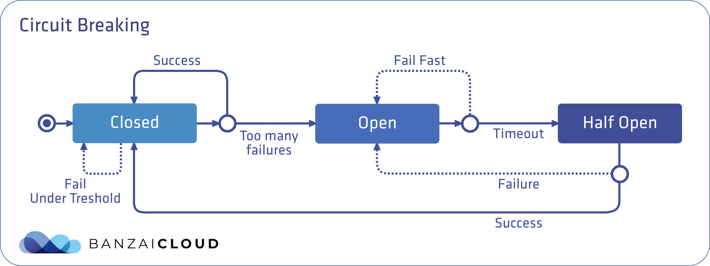
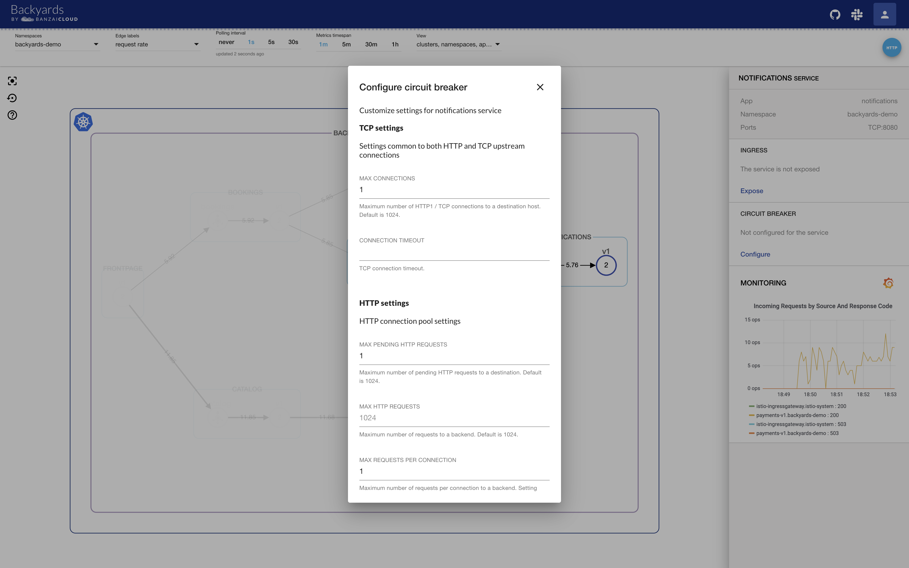
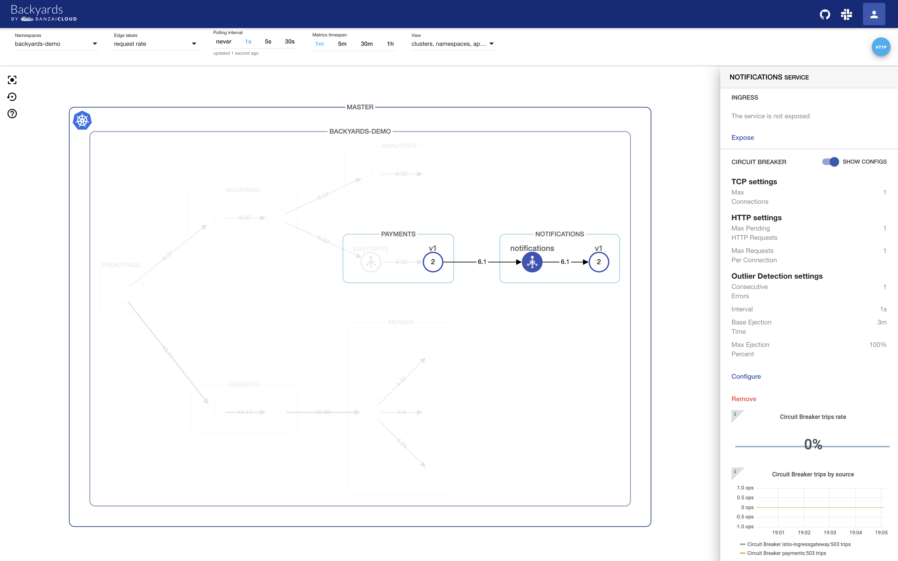
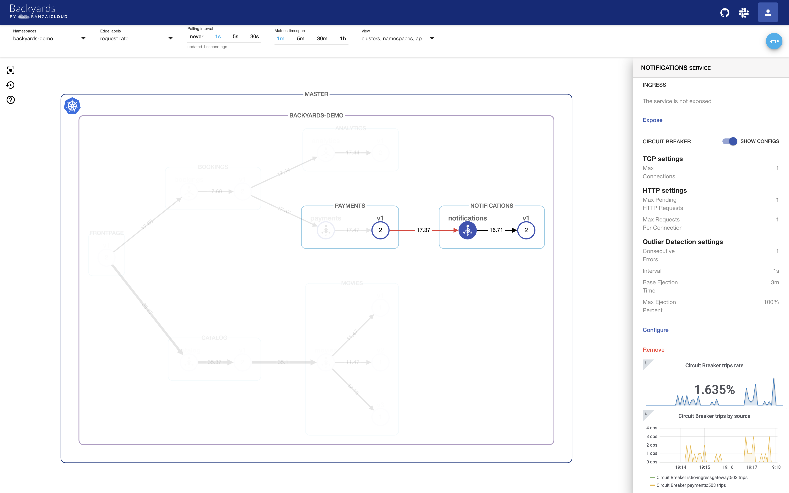
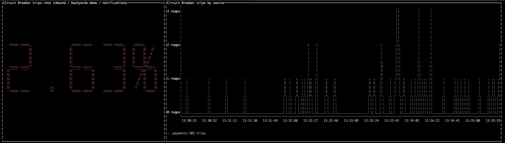

原文地址：<https://banzaicloud.com/blog/istio-circuit-breaking/>。

## 编者按

作者简要介绍了熔断的概念，然后以实战演练的方式分别演示了如何通过Backyards UI、CLI等方式创建并设置熔断功能。注：Backyards是Banzai Cloud开发的一款基于Istio的服务网格产品，本文是该产品功能介绍系列中的一篇。

## 前言

Istio因灵活的可观察性和安全的服务间通信受到了赞许。然而，其他更重要的功能才真正使得Istio成为了服务网格里的瑞士军刀，当遇到运行时长、延迟和错误率等SLO问题时，服务间的流量管理能力是至关重要的。

在今年早些时候发布 [Istio operator](https://github.com/banzaicloud/istio-operator) 时，我们的目标（除了管理Istio的安装和升级）是为这些出色的流量路由特性提供支持，同时使所有的功能都更加易用。最后，我们创建了一个简单且自动化的服务网格[Backyards](https://banzaicloud.com/blog/istio-the-easy-way/)，它在Istio operator之上提供了管理UI、[CLI](https://github.com/banzaicloud/backyards-cli) 和GraphQL API的能力。Backyards集成到了Banzai Cloud的容器管理平台 [Pipeline](https://github.com/banzaicloud/pipeline)中，也可以作为一个单一的产品独立工作。当然，将Backyards与Pipeline一起使用会为用户提供特别的好处（比如在[多云和混合云](https://banzaicloud.com/blog/istio-multicluster-the-easy-way/)环境中管理应用程序），Backyards也可以被用于任何Kubernetes的安装环境。

> 我们已经发布了一些Backyards相关特性的文章比如：
>
> - [使用Backyards自动金丝雀部署](https://banzaicloud.com/blog/istio-canary/)
> - [流量切换](https://banzaicloud.com/blog/istio-traffic-shifting/)

## 熔断：失败是一个选项

在微服务架构中，服务可能会用不同的语言实现并部署在多个节点或集群上，具有不同的响应时间或故障率。如果服务成功（并且及时地）响应了请求，那么它的性能就算是令人满意的。但现实情况并非如此，下游客户端应该在上游服务过于缓慢时受到保护。反之，上游服务也必须被保护，以免被积压的请求拖垮。在多客户端下情况会更加复杂，并可能导致整个基础设施出现一系列的连锁故障。这一问题的解决方案是采用经过时间检验的熔断器模式。

一个熔断器可以有三种状态：关闭、打开和半开，默认情况下处于关闭状态。在关闭状态下，无论请求成功或失败，到达预先设定的故障数量阈值前，都不会触发熔断。而当达到阈值时，熔断器就会打开。当调用处于打开状态的服务时，熔断器将断开请求，这意味着它会直接返回一个错误，而不去执行调用。通过在客户端断开下游请求的方式，可以在生产环境中防止级联故障的发生。在经过事先配置的超时时长后，熔断器进入半开状态，这种状态下故障服务有时间从其中断的行为中恢复。如果请求在这种状态下继续失败，则熔断器将再次打开并继续阻断请求。否则熔断器将关闭，服务将被允许再次处理请求。



## [Istio](https://istio.io/)中的熔断

Istio的 [熔断](https://istio.io/docs/tasks/traffic-management/circuit-breaking/) 可以在 [流量策略](https://istio.io/docs/reference/config/networking/v1alpha3/destination-rule/#TrafficPolicy) 中配置。Istio的 [自定义资源](https://kubernetes.io/docs/concepts/extend-kubernetes/api-extension/custom-resources/)`Destination Rule`里，`TrafficPolicy`字段下有两个和熔断相关的配置： [ConnectionPoolSettings](https://istio.io/docs/reference/config/networking/v1alpha3/destination-rule/#ConnectionPoolSettings) 和 [OutlierDetection](https://istio.io/docs/reference/config/networking/v1alpha3/destination-rule/#OutlierDetection)。

`ConnectionPoolSettings`可以为服务配置连接的数量。`OutlierDetection`用来控制从负载均衡池中剔除不健康的实例。

例如，`ConnectionPoolSettings`控制请求的最大数量，挂起请求，重试或者超时；`OutlierDetection` 设置服务被从连接池剔除时发生错误的请求数，可以设置最小逐出时间和最大逐出百分比。有关完整的字段列表，请参考[文档](https://istio.io/docs/reference/config/networking/v1alpha3/destination-rule/#TrafficPolicy).

> Istio在底层使用了[Envoy的熔断特性](https://www.envoyproxy.io/learn/circuit-breaking)。

让我们来看看`Destination Rule`中有关熔断的配置：

```yaml
apiVersion: networking.istio.io/v1alpha3
kind: DestinationRule
metadata:
  name: notifications
spec:
  host: notifications
  trafficPolicy:
    connectionPool:
      tcp:
        maxConnections: 1
      http:
        http1MaxPendingRequests: 1
        maxRequestsPerConnection: 1
    outlierDetection:
      consecutiveErrors: 1
      interval: 1s
      baseEjectionTime: 3m
      maxEjectionPercent: 100
```

使用`ConnectionPoolSettings`字段中的这些设置，在给定的时间内只能和`notifications` 服务建立一个连接：每个连接最多只能有一个挂起的请求。如果达到阈值，熔断器将开始阻断请求。

`OutlierDetection`部分的设置用来检查每秒调用服务是否有错误发生。如果有，则将服务从负载均衡池中逐出至少三分钟（100%最大弹出百分比表示，如果需要，所有的服务实例都可以同时被逐出）。

> 在手动创建`Destination Rule`资源时有一件事需要特别注意，那就是是否为该服务启用了mTLS。如果是的话，还需要在`Destination Rule`中设置如下字段，否则当调用`movies`服务时，调用方可能会收到503错误：

```yaml
trafficPolicy:
   tls:
  mode: ISTIO_MUTUAL
```

> 还可以为特定[namespace](https://istio.io/docs/tasks/security/authn-policy/#namespace-wide-policy) 或特定[服务](https://istio.io/docs/tasks/security/authn-policy/#service-specific-policy)启用[全局](https://istio.io/docs/tasks/security/authn-policy/#globally-enabling-istio-mutual-tls)的mTLS。你应该了解这些设置以便确定是否把`trafficPolicy.tls.mode`设置为 `ISTIO_MUTUAL`。更重要的是，当你试图配置一个完全不同的功能（例如熔断）时，很容易忘记设置此字段。
>
> 提示：在创建`Destination Rule`前总是考虑mTLS！

为了触发熔断，让我们同时从两个连接来调用 `notifications`服务。`maxConnections`字段被设置为1。这时应该会看到503与200的响应同时到达。

当一个服务从客户端接收到的负载大于它所能处理的负载（如熔断器中配置的那样），它会在调用之前返回503错误。这是防止错误级联的一种方法。

### 监控

在生产环境中必须要监控你的服务，以便得到通知并能够在系统发生错误时进行检查。因此，如果你已经为你的服务配置了一个熔断器，你就会想知道它什么时候跳闸；熔断器拦截了百分之多少的请求；何时触发，来自哪个下游客户端？如果能够回答这些问题，你就可以确定熔断器是否工作正常，并根据需要微调配置，或者优化服务来处理额外的并发请求。

> 提示：如果你继续阅读，可以在Backyards UI中看到和配置所有的这些设置。

让我们看看怎样在Istio里确定熔断器跳闸：

熔断器跳闸时的响应码是503，因此你无法仅根据该响应与其他的503错误区分开来。在Envoy中，有一个计数器叫`upstream_rq_pending_overflow`，它记录了熔断且失败的请求总数。如果为你的服务深入研究Envoy的统计数据就可以获得这些信息，但这并不容易。

除了响应代码，Envoy还返回[响应标志](https://www.envoyproxy.io/docs/envoy/latest/configuration/observability/access_log#config-access-log-format-response-flags) ，并且存在一个专用响应标志来表示熔断器跳闸：**UO**。如果这个标志只能通过Envoy的日志获得，这将不会特别有用。幸运的是，它在Istio中[实现](https://github.com/istio/istio/pull/9945)了，因此响应标志在Istio指标中是可用的并且能被Prometheus获取到。

熔断器的跳闸可以像这样查询到：

```basic
sum(istio_requests_total{response_code="503", response_flags="UO"}) by (source_workload, destination_workload, response_code)
```

## [Backyards](https://banzaicloud.com/blog/istio-the-easy-way/)的熔断更简单

使用Backyards时，你不需要手动编辑`Destination Rules`来设置熔断。可以通过一个方便的UI界面或者（如果你愿意的话）是[Backyards CLI](https://github.com/banzaicloud/backyards-cli) 命令行工具来达到相同的结果。

不必担心由于忘记把`trafficPolicy.tls.mode` 设置为 `ISTIO_MUTUAL`而配错了`Destination Rules`。Backyards会为你解决这个问题；它会找到启用了mTLS的服务并相应地设置上述字段。

> 上面只是Backyards验证特性的一个例子，这能避免你设置错误。后面还有更多的特性。

在此之上，你可以看到服务和请求的可视化界面和活动仪表板，因此可以轻松地确定有多少请求被熔断器触发，以及它来自哪个调用者和何时触发。

## 熔断实战

### 创建一个集群

首先，我们需要一个Kubernetes集群。

> 我通过[Pipeline platform](https://beta.banzaicloud.io/)的免费开发版本在GKE上创建了一个Kubernetes集群。如果你也想这样做，可以在我们支持的五个云提供商或使用[Pipeline](https://beta.banzaicloud.io/)在本地创建集群。否则，你需要提供自己的Kubernetes集群。

### 安装BACKYARDS

在一个新集群安装Istio，Backyards和demo应用的最简单的办法是使用[Backyards CLI](https://github.com/banzaicloud/backyards-cli)。

你只需要执行下面的命令（集群必须设置了`KUBECONFIG`）：

```bash
$ backyards install -a --run-demo
```

该命令首先使用我们开源的[Istio operator](https://github.com/banzaicloud/istio-operator)安装Istio，然后安装Backyards和demo应用程序。安装完成后，Backyards UI将自动打开并向demo应用发送一些流量。通过这个简单的命令，你可以看到Backyards在几分钟内启动了一个全新的Istio集群！试试吧！

> 你也可以按顺序执行所有这些步骤。Backyards需要一个Istio集群——如果没有，可以通过`$ backyards istio install`安装。一旦安装了Istio，就可以使用`$ backyards install`安装Backyards。最后，使用`$ backyards demoapp install`部署demo应用程序。
>
> 提示：Backyards是[Pipeline](https://github.com/banzaicloud/pipeline)平台的核心组件——可以尝试[开发者版本](https://beta.banzaicloud.io/)（Service Mesh 标签页）。

### 使用BACKYARDS UI创建熔断

#### 配置熔断器

你不需要手动创建或编辑`Destination Rule`，可以很容易的在UI界面中改变熔断的配置。让我们先创建一个demo。

> 正如你将看到的，Backyards（与Kiali相比）不仅是为可观察性构建的web UI，而且是具有丰富功能的服务网格管理工具，支持单集群和多集群，并且具有强大的CLI和GraphQL API。



#### 查看熔断器设置

你不需要通过`Destination Rule`（例如通过kubectl）来查看熔断器的配置，当你点击`notification` 服务图标并切换`SHOW CONFIGS`滑块时，可以在Backyards UI的右侧看到它们。



#### 监控熔断器

根据刚才的设置，当两个连接同时产生流量时，熔断器将发出跳闸请求。在Backyards UI中，你将看到图形的边缘出现了红色。如果单击该服务，你将了解有关错误的更多信息，并将看到两个专门用来显示熔断器跳闸的实时Grafana仪表板。

第一个仪表板展示了熔断器触发的总请求的百分比。当没有熔断器错误，而你的服务工作正常，这张图将显示`0%`。否则，你将能够立即看到有多少请求被熔断器触发。

第二个仪表板提供了由源熔断器引起的跳闸故障。如果没有发生跳闸，则此图中不会出现尖峰。否则，你将看到哪个服务导致了跳闸，何时跳闸，以及跳闸次数。可以通过此图来追踪恶意的客户端。



> 这些是实时的Grafana仪表盘，用于显示熔断相关的信息。在默认情况下Backyards集成了Grafana和Prometheus——还有更多的仪表板可以帮助你深入查看服务的指标。

#### 移除熔断器配置

可以通过 `Remove` 按钮很容易的移除熔断配置。

#### Backyards UI 的熔断实战

这个[视频](https://www.youtube.com/embed/JH2xRv4a37M)总结了所有这些UI操作（译者注：视频来自YouTube）

### 使用[BACKYARDS-CLI](https://github.com/banzaicloud/backyards-cli)创建熔断

从经验来看，可以从UI界面做的事一定也可以通过 [Backyards CLI](https://github.com/banzaicloud/backyards-cli) 命令行工具完成。

#### 配置熔断

让我们再做一次创建熔断的测试，这次通过CLI命令行。

可以以交互模式进行：

```bash
$ backyards r cb set backyards-demo/notifications
? Maximum number of HTTP1/TCP connections 1
? TCP connection timeout 3s
? Maximum number of pending HTTP requests 1
? Maximum number of requests 1024
? Maximum number of requests per connection 1
? Maximum number of retries 1024
? Number of errors before a host is ejected 1
? Time interval between ejection sweep analysis 1s
? Minimum ejection duration 3m
? Maximum ejection percentage 100
INFO[0043] circuit breaker rules successfully applied to 'backyards-demo/notifications'
Connections  Timeout  Pending Requests  Requests  RPC  Retries  Errors  Interval  Ejection time  percentage
1            3s       1                 1024      1    1024     1       1s        3m             100
```

或者用非交互模式，指定要设置的值：

```bash
$ backyards r cb set backyards-demo/notifications --non-interactive --max-connections=1 --max-pending-requests=1 --max-requests-per-connection=1 --consecutiveErrors=1 --interval=1s --baseEjectionTime=3m --maxEjectionPercent=100
Connections  Timeout  Pending Requests  Requests  RPC  Retries  Errors  Interval  Ejection time  percentage
1            3s       1                 1024      1    1024     5       1s        3m             100
```

命令执行后，熔断配置会立刻获取到并显示出来。

#### 查看熔断设置

你可以用下面的命令通过namespace来列出熔断的设置：

```bash
$ backyards r cb get backyards-demo/notifications
  Connections  Timeout  Pending Requests  Requests  RPC  Retries  Errors  Interval  Ejection time  percentage
  1            3s       1                 1024      1    1024     5       1s        3m             100
```

默认情况结果以表格的方式显示，也支持JSON或者YMAL格式：

```bash
$ backyards r cb get backyards-demo/notifications -o json
  {
    "maxConnections": 1,
    "connectTimeout": "3s",
    "http1MaxPendingRequests": 1,
    "http2MaxRequests": 1024,
    "maxRequestsPerConnection": 1,
    "maxRetries": 1024,
    "consecutiveErrors": 5,
    "interval": "1s",
    "baseEjectionTime": "3m",
    "maxEjectionPercent": 100
  }

$ backyards r cb get backyards-demo/notifications -o yaml
  maxConnections: 1
  connectTimeout: 3s
  http1MaxPendingRequests: 1
  http2MaxRequests: 1024
  maxRequestsPerConnection: 1
  maxRetries: 1024
  consecutiveErrors: 5
  interval: 1s
  baseEjectionTime: 3m
  maxEjectionPercent: 100
```

#### 监控熔断

要从CLI中查看和前面Grafana UI界面类似的仪表板，可以通过从多个连接调用服务来触发跳闸，执行命令：

```bash
$ backyards r cb graph backyards-demo/notifications
```

可以看到类似下面的结果：



#### 移除熔断配置

移除熔断执行下面的命令：

```bash
$ backyards r cb delete backyards-demo/notifications
INFO[0000] current settings
Connections  Timeout  Pending Requests  Requests  RPC  Retries  Errors  Interval  Ejection time  percentage
1            3s       1                 1024      1    1024     5       1s        3m             100
? Do you want to DELETE the circuit breaker rules? Yes
INFO[0008] circuit breaker rules set to backyards-demo/notifications successfully deleted
```

使用下面的命令验证是否成功：

```bash
$ backyards r cb get backyards-demo/notifications
  INFO[0001] no circuit breaker rules set for backyards-demo/notifications
```

### 使用BACKYARDS GRAPHQL API创建熔断

Backyards由多个组件组成，比如Istio、Banzai Cloud的[Istio operator](https://github.com/banzaicloud/istio-operator)，多集群[Canary release operator](https://banzaicloud.com/blog/istio-canary/)，以及多个后端基础设施。所有的这些都在**Backyards’ GraphQL API**的后面。

Backyards UI和CLI都使用Backyards的GraphQL API，它将在9月底与GA版本一起发布。用户将很快能够使用我们的工具来管理Istio和构建他们自己的客户端。

### 清理

从你的集群移除demo应用、Backyards和Istio，执行下面的命令，它将按顺序卸载这些组件：

```bash
$ backyards uninstall -a
```

## 总结

使用Backyards，你可以通过UI或CLI命令行工具轻松的配置熔断器。然后通过嵌入的Grafana仪表板从Backyards UI实时的监控熔断器，来查看跳闸率和按源计算的跳闸次数。

下一次我们将介绍错误注入，请继续关注！