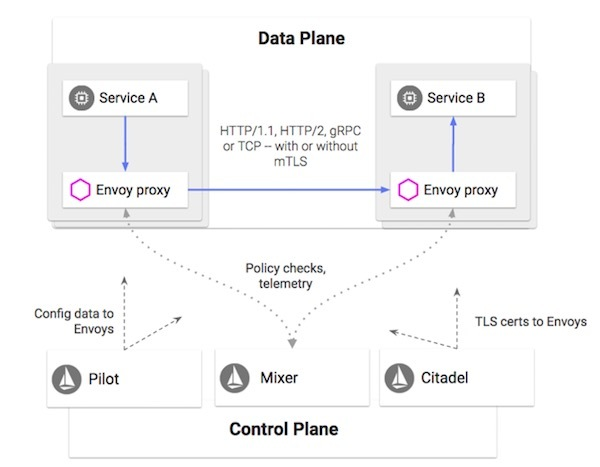

本文转载自[InfoQ](http://www.infoq.com/cn/articles/istio-future-service-mesh)。

## 重要结论

- 微服务风格的架构能够简化单个服务的开发。然而，对于成百上千个微服务的通信、监控以及安全性的管理并不是一件简单的事。
- Service Mesh 提供了一种透明的、与编程语言无关的方式，使网络配置、安全配置以及服务观察等操作能够灵活而简便地实现自动化。从本质上说，它解耦了服务的开发与运维工作。
- Istio Service Mesh 由两部分组成。1. 由 Envoy 代理组成的数据面板，它能够拦截网络请求，并控制服务之间的通信。2. 支持服务的运行时管理的控制面板，它提供策略实施、遥测数据收集以及证书轮换等功能。
- 近期的项目目标是在关键的功能进入 beta 阶段后发布 Istio 1.0 版本（其中包括对于混合环境的支持）。
- 长期的项目目标则是使 Istio 能够融入各种不同的环境中。

---

不夸张的说，正是 Istio 的出现使 “Service Mesh” 这一概念开始流行起来。在深入介绍 Istio 的细节之前，让我们首先简单地了解一下 Service Mesh 是什么，以及它的重要性体现在哪里。我们都已经了解单体应用所面对的挑战，一种显而易见的方案是将其分解为多个微服务。虽然这种方式简化了单个服务的开发，但对于成百上千的微服务的通信、监控以及安全性的管理并不是一件简单的事。直至目前，对于这些问题的解决方案也只是通过自定义脚本、类库等方式将服务串联在一起，并且投入专门的人力以处理分布式系统的管理任务。但这种方式降低了各个团队的效率，并且提高了维护的成本。这正是 Service Mesh 大显身手的时机。

Service Mesh 提供了一种透明的、与编程语言无关的方式，使网络配置、安全配置以及遥测等操作能够灵活而简便地实现自动化。从本质上说，它解耦了服务的开发与运维工作。如果你是一名开发者，那么在部署新服务，或是修改现有服务的时候，就无需担心这些操作会对你的分布式系统带来哪些运维层面的影响。与之类似，运维人员可以放心地对服务之间的运维控制进行变更，而无需重新部署服务或是修改服务的源代码。处于服务与底层网络之间的这一层基础设施通常被称为 Service Mesh。

在 Google 内部，我们通过一个分布式平台对服务进行管理，通过代理处理内部与外部的协议。这些代理的背后是一个控制面板，它在开发者与运维人员之间提供了一层额外的抽象，在这层抽象之上对跨语言与系统平台的服务进行管理。经过实战的检验，这套架构已经证明它能够确保高伸缩性、低延迟性，并为 Google 的各项服务提供了丰富的特性。

在 2016 年，我们决定开发一个对微服务进行管理的开源项目，它与我们在 Google 内部使用的平台有很大的相似性。我们决定将该项目命名为“[Istio](https://istio.io/)”。之所以会取这样一个名字，是因为 Istio 在希腊语中的意思是“启航”。而在方案启动时，我们就决定它需要支持 Kubernetes，而后者在希腊语中可以翻译为“舵手”或“驾驶员”。需要强调的是，Istio 对于服务部署环境并没有加以限定，它的开发目标就是能够管理在不同环境中运行的服务。

就在我们开始 Istio 项目开发工作的几乎同一时间，IBM 也发布了一个名为 [Amalgam8](https://github.com/amalgam8) 的开源项目，这是一个基于 NGINX 技术，为微服务提供基于内容的路由方案的项目。随后，IBM 意识到这两个项目在使用场景与产品愿景上存在很大一部分交集，于是答应成为我们的合作伙伴，放弃 Amalgam8 的开发，共同基于 [Lyft公司 的 Envoy](https://github.com/envoyproxy/envoy) 项目打造 Istio 这款产品。

## Istio 是如何运行的？

一般来说，Istio Service Mesh 由两部分组成。1. 由 Envoy 代理组成的数据面板，它能够拦截网络请求，并控制服务之间的通信。2. 支持服务的运行时管理的控制面板，它提供策略实施、遥测数据收集以及证书轮换等功能。

**图片来源：Istio 项目的 PM，Dan Ciruli**

### 代理

Envoy 是由 Lyft 公司基于 C++ 编写的一个高性能、开源的分布式代理（在 Lyft 公司内部用于处理生产环境中的网络请求）。Envoy 作为 sidecar 部署在系统中，对所有流入与流出的网络请求进行拦截，实现各种网络策略，并与 Istio 控制面板集成。Istio 利用了 Envoy 内建的大量特性，例如服务发现与负载均衡、流量拆分、故障注入（fault injection）、熔断器以及分阶段发布等功能。

### Pilot

作为控制面板的重要组成部分之一，Pilot 负责管理代理的配置，并将服务的通信策略分发至 Istio mesh 中所有的 Envoy 实例。它能够接受高级别的规则（例如发布策略），将其解释为低级别的 Envoy 配置，并将配置分发至 sidecar，而且不会导致停机或是重新部署。虽然 Pilot 本身不依赖于底层平台，但运维人员可以利用特定于平台的适配器，将服务发现的信息推送给 Pilot。

### Mixer

Mixer 能够在 Istio 中集成各种生态的基础设施后端系统，它通过即插即用的适配器集，通过标准的配置模型，使 Istio 能够方便地与现有的服务进行集成。适配器对 Mixer 的功能进行了扩展，并将特定的接口暴露给监控、日志、追踪、配额管理及其他功能。适配器是按需加载的，并按照运维人员的配置在运行时发挥作用。

### Citadel

Citadel 即之前的 Istio Auth，它为跨 mesh 的服务与服务之间的通信进行证书签名与轮换，提供双向认证与双向授权功能。Envoy 通过 Citadel 证书，在每个调用中以透明的方式注入双向的TLS，通过自动化的身份与凭证管理，对流量进行安全管理与加密。Citadel 符合 Istio 的整体设计，只需少量的服务代码（甚至完全不需要服务代码）即可配置认证与授权功能，并且能够无缝地支持多个集群与平台。

## 为什么要使用 Istio？

Istio 具有高度模块化的特性，适用于多种场景。对于它带来的各种益处的详细解释可能已经超出了本文的范围，但我还是会简单地做个介绍，体验一下如何通过它简化网络运维、安全运维以及 DevOps 的日常工作。

### 灵活性

Istio 能够保护应用不被片状网络和雪崩式故障所影响。如果你是一位网络 运维人员，就可以通过故障注入等特性在系统中注入网络延迟及网络隔离等故障，系统性地检验应用的灵活性。如果你希望将某个版本的服务迁移至另一个版本，可通过基于权重的流量路由方式，逐渐将流量导向新版本的服务，以此降低风险。更好的办法是，在进行实际的切换之前，你可以模拟出真实的流量指向新的部署服务的行为，以观察它的运行情况。此外，你还可以通过 Istio Gateway 对流入与流出的流量进行负载均衡，并对流量应用各种路由规则，例如超时、重试以及熔断等等，以减少潜在的故障，并从故障中恢复。

### 安全性

Istio 的一个主要使用场景是在异构的系统中对服务间的通信进行安全加密。安全运维人员能够以统一的方式进行大规模的操作，例如开启流量加密、在不破坏其他服务的前提下阻止对某个服务的访问、开启双向身份认证、通过访问控制（ACL）管理服务白名单、对服务与服务间的通信进行授权，以及分析服务的安全性状况等等。运维人员可以在单个服务、单个命名空间或整个 mesh 的范围内实施这些安全策略。这些功能的存在可以减少对于防火墙层次的依赖，减少安全运维人员的工作负担。

### 可观测性

微服务所带来的一大挑战是如何以可视化方式了解基础设施的运行情况。直至近期，最佳的方式仍然是对每个服务进行扩展，以实现端到端的服务交付。除非你打算投入一个团队的人力专门对二进制文件进行调整，否则仍然很难对整个平台有一个全局性的认识，对于系统瓶颈的故障诊断依然十分不便。

而通过 Istio 自带的功能，你就可以通过可视化的方式了解系统的关键指标，并且能够跨服务进行请求的追踪。如此一来，你就可以实现基于应用指标进行自动扩展等操作。虽然 Istio 支持多种扩展，例如 Prometheus、 Stackdriver、Zipkin 和 Jaeger 等等，但其本身并不受限于后端平台的选择。如果你找不到趁手的工具，完全可以自行编写适配工具，与 Istio 进行集成。

## Istio的发展现状如何？

新的特性正在不断地加入 Istio 中，同时，我们也在改进现有的功能。Istio 的开发遵循标准的敏捷风格，每个特性都需要通过自身的生命周期进行交付（dev/alpha/beta/stable）。虽然有一部分功能仍在改进中，但有许多功能已经可以在生产环境中使用了（beta/stable）。欢迎在 [istio.io](https://istio.io/about/feature-stages.html) 网站上查看最新的功能列表。

Istio 遵循严格的发布节奏，虽然我们提供每日和每周构建的版本，但并不提供相应的支持，也不确保其可靠性。另一方面，每月构建的 snapshot 版本则相对更安全，并且通常会包含新的特性。不过，如果你打算在生产环境中使用 Istio，请选择包含“LTS”（长期支持）标签的版本。在本文编写时，最新的 LTS 版本号是 0.8。你可以在 [GitHub](https://github.com/istio/istio/releases) 上找到该版本以及其他各版本。

## 后续有什么计划？

自从在 GlueCon 大会上正式发布 Istio 0.1 版本以来，已经过了一年时间。虽然我们取得了很大的进展，但仍有许多工作需要完成。近期的目标是在关键的功能都进入 beta 阶段（某些情况下或许需要等待 stable 阶段）后发布 Istio 1.0 版本。需要指出的是，该版本并非 Istio 功能的全部，而只是我们基于社区的反馈，所选出的最重要功能。为了本次发布，我们也在尽力改进一些非功能性的需求，例如性能与扩展性，同时也在改进我们的文档以及上手体验。

Istio 的一个重要目标是支持混合型环境。举例来说，用户可以将虚拟机运行在 GCE、本地 Cloud Foundry 集群，或是其他公有云的服务上。Istio 能够为整体服务平台提供一个统一的视图，管理这些环境之间的连接并确保安全性。我们目前正在致力于实现多集群的架构，允许你在扁平网络中将多个 Kubernetes 集群加入一个单独的 mesh 中，并启用跨集群的服务发现功能，这项工作在 0.8 LTS 版本中还处于 alpha 阶段。在不远的将来，它还将支持全球化的集群级别的负载均衡，并通过 Gateway 对等互联提供对非扁平网络的支持。

除了 1.0 版本的发布之外，我们的另一个工作重心是 API 管理功能。仅举一例，我们计划推出一个 service broker API，它能够对各个服务提供服务发现与上线功能，将服务消费者与服务管理者相关联在一起。我们还将为 API 管理功能提供一个统一的接口，这些功能包括 API 业务分析、API 密钥验证、认证检验（例如JWT、OAuth等等）、编码转换（JSON/REST 至 gRPC 转换）、路由，以及与多种 API 管理系统的集成，例如 Google Endpoints 与 Apigee。

所有这些短期目标都是为了最终实现我们的长期目标，即将 Istio 融入至不同的环境中。按照我们的技术主管，同时也 Istio 的创始者 Sven Mawson 所说：“我们所希望实现的理想，是让 Istio 能够融入每个环境中，无论你使用的是哪一种环境或平台，都能够为你提供服务管理的功能“。

虽然 Istio 仍然处于早期阶段，但它的开发速度与接受度正在稳步地提升。无论对于主流云厂商还是个人贡献者来说，Istio 都已经成为了 Service Mesh 的代名词，同时也是基础设计发展路线图中的一个重要组成部分。每一次的发布，都意味着我们向目标更近了一步。

## 关于作者

**Jasmine Jaksic** Jasmine Jaksic 在 Google 担任 [Istio](https://istio.io/) 项目的技术项目经理主管，她在软件产品与服务的开发与支持方面已有15年经验。此外，她也是 [Posture Monitor](https://posturemonitor.org/)的联合创始人之一，该产品的功能是通过 3D 相机进行姿势纠正。她同时也是纽约时报、连线杂志以及赫芬顿邮报的特约撰稿人。欢迎关注她的推特：[@JasmineJaksic](https://twitter.com/JasmineJaksic)。

**查看英文原文**：[Istio and the Future of Service Meshes](https://www.infoq.com/articles/istio-future-service-mesh)
