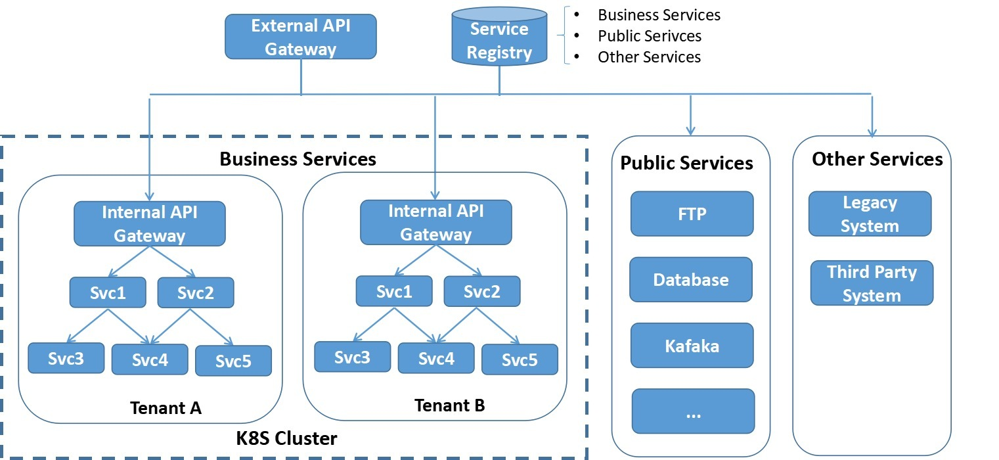

> 本文转载自[赵化冰的博客](https://zhaohuabing.com)。

Istio发布1.0版本后，其服务发现和路由规则功能已基本具备production能力，我们也开始了Istio和公司内部微服务平台的集成工作，打算以Istio为基础打造一个微服务管控中心，在这里把目前的进展和遇到的坑和大家分享一下。

# 现有系统架构

目前公司的微服务架构如图所示，系统中主要包含三类服务：

- 业务服务，大部分的业务服务都已经实现了微服务化和无状态，采用docker容器部署在K8s集群中，利用K8s的容器管理能力进行服务部署，弹缩。但也有部分服务只做了容器化，但并未进行微服务改造，此类服务属于SOA架构，一个服务可能对外暴露多个业务API，这和敖小剑老师在[《SOFAMesh中的多协议通用解决方案》](http://www.servicemesher.com/blog/x-protocol-common-address-solution/)系列文章中提到的情况是类似的。
- 一些有状态的公共服务，例如数据库，FTP服务器，共享缓存等，目前未放入到K8s集群中，但业务服务对这些公共服务存在大量的依赖。
- 其他未纳入K8S集群的服务，如遗留系统和第三方系统提供的服务。某些业务服务和这些服务之间存在互相访问的需求。

## 服务注册

电信领域与IT领域相比有一些特殊性，其中一点就是多网络平面的需求。多网络平面是电信领域的一个术语，通俗来讲就是系统中存在多个网络。采用多个网络的目的一般是为了管理原因，例如管理系统采用一个网络进行通信，而应用之间的通信在另一个网络上，这多个网络之间是相互隔离的。

采用多网络平面后，和标准的K8S网络模型有所不同，标准的K8S集群中的一个Pod上只会有一个网络接口。我们的PaaS对K8S的网络进行了扩展，使其支持多个网络，即一个Pod上可以有多个网络接口（该解决方案已开源，参见[https://github.com/ZTE/Knitter](https://github.com/ZTE/Knitter)）。

由于需要支持多网络平面，我们开发了自己的服务注册系统，该服务注册系统中同时包含了K8s租户中的微服务，公共服务和外部服务的所有服务相关信息。服务注册系统通过REST接口对外提供服务注册接口，也提供管理界面。K8S集群中的服务启动后通过代理检测并自动注册，外部服务可以通过管理界面注册，也可以开发第三方代理进行注册。

采用了定制的服务注册系统后的另一个优势是K8S中部署的运行实例和注册的服务关系是很灵活的，一个运行实例可以注册多个服务，以支持尚未进行微服务改造的SOA类型的应用。

## 服务发现

系统内部服务之间采用客户端发现机制，先通过服务发现接口从Service Registry中查询到对端服务地址再发起请求。平台提供了封装好的SDK提供给应用微服务使用，SDK中封装了服务发现以及LB，重试，断路等服务底层通讯机制。

## API Gateway

系统外部对内的调用通过API Gateway进入，采用服务端服务发现机制。服务名编码在请求URL中，API Gateway解析URL得到服务名后，再根据Service Registry的服务注册信息进行分发。

根据PaaS的部署场景，系统可以采用1级或者2级API Gateway进行请求分发。单租户场景下采用1级API Gateway；多租户场景下可采用2级API Gateway。第一级的Gateway在K8S集群外，是整个系统的总入口，负责分流K8s不同租户以及外部服务的流量。第二级Gateway在K8S租户中，是租户内服务的请求入口。两级API Gateway都从Service Registry获取服务信息，考虑到安全和效率因素，每个Gateway只能拉取和自己负责部分的服务信息。

API Gateway支持虚拟主机，提供4层和7层的LB。除此以外，API Gateway被设计为一个可插拔的平台，可以采用插件方式进行扩展，目前实现了下述插件功能：

- 对外部请求进行性能数据收集和统计分析。
- 调用认证服务对外部请求进行登录验证。
- 实现了限流、熔断、黑白名单等功能。
- 可以通过分流规则实现应用的灰度发布。

## 痛点

- 在系统的初始阶段，大部分的微服务都是基于JAVA编写的，我们通过SDK封装了服务发现，重试，限流，熔断等用于服务间点对点通讯的逻辑提供给各个业务微服务使用。但随着系统的发展，越来越多微服务开始采用Golang编写，还有相当一部分基于Python的微服务，而且作为一个平台，可以预见到将来还可能会有更多其他语言。为每一种语言编写一套SDK的方案渐渐变得难以维护。将微服务的通讯层下沉到Mesh层是一个趋势。
- 在API Gateway处可以对外部请求的性能数据进行统计分析，但无法对系统内部各个微服务之间调用的性能数据进行收集处理。如果采用侵入式的方案，则需要在各个语言和框架中采用一套标准的接口，并且要针对不同语言编写对应的SDK，维护工作量很大，而且对于业务微服务的编码有较大的限制，因此采用sidecar方式对微服务之间调用性能数据进行收集是一个更为合理的方式。
- 通过在API Gateway处使用分流规则来实现灰度发布的方案有较大限制，只能对应用整体进行分流，而无法对应用中的单个微服务的不同版本进行分流配置。因此基本上无法通过灰度发布来实现微服务粒度的快速升级迭代。

# Istio集成方案

引入Istio后，系统架构如下图所示：

## 控制面

引入Istio Pilot提供服务发现和流量规则。Service Registry是基于Consul自研的，由于Pilot已经支持Consul的适配器，因此可以很容易地将我们的Service Registry作为服务信息提供者集成到Pilot中。

提供用户界面对Mesh中的traffic rule进行配置，规则可以在设计应用蓝图时进行配置，也可以在运行期进行动态修改、添加和删除。

引入Mixer进行Metrics收集，后端连接到Promeheus，打算采用自己开发界面对指标进行呈现。

目前采用Zipkin和Envoy直连进行分布式跟踪，后续可能改用jaeger，因为jager采用了open tracing协议，开放性更好一些，而且是go编写的，和我们目前的技术栈匹配。

## 数据面

在各个业务微服务的Pod中加入Envoy proxy，提供服务发现，可靠通讯，并根据Pilot下发的路由规则对服务通讯进行路由。

虽然Istio提供了Ingress Gateway，但Ingress Gateway只是提供了一个虚拟主机和Https终结的功能，并不能满足我们的业务需求。因此我们决定继续采用自研的API Gateway。但API Gateway的服务发现，LB功能交给Envoy接管，并将API Gateway上已实现的限流、熔断、重试等规则切换为Pilot的Traffic rule，改为由Envoy处理。处理方式是在Internal API Gateway处也部署一个Envoy代理。

# 目前的进展

1. 目前我们已经完成了Pilot和Mixer的集成，由于系统内部采用了是自己的安全方案，暂未考虑Citadel的集成。
2. 验证了服务发现，路由规则，Metrics收集和Distributed Tracing
3. 开发用户友好的界面对Istio的路由规则进行配置和管理。
4. 基于Istio的路由规则，结合K8S开发了微服务的在线灰度升级。

# 遇到的坑和待解决问题

1. Istio不支持多网络平面，导致Envoy在进行服务转发时出现了死循环，环境中Envoy由于File Descriptor被耗光不停重启。这个问题隐藏较深，花了差不多两周时间定位和排除。我们正在基于Istio进行扩展以支持多网络平面，并准备向社区贡献这部分代码。
2. 社区没有给出Mixer如何在K8S外进行部署的详细文档，在部署Mixer时遇到了较多的坑。
3. Mixer没有Consul environment的 Adapter，因此上报的Metrics中缺失部分attribute，我们正在评估编写该适配器，并准备向社区贡献这部分代码。
4. Istio目前主要支持的是HTTP和GRPC，对于异步消息如Kafaka并未支持。而要完成一个业务级的端到端路由控制，异步消息是必不可少的一环，可喜的是Envoy社区已经有计划要对Kafaka进行支持。 (<https://github.com/envoyproxy/envoy/issues/2852>)
5. 对于IT应用来说，Service Mesh面对的主要是用户（北向）流量和服务间（东西向）流量，但对于CT应用来说，还有很大一部分属于网元到管理系统（南向）的流量，这部分流量基本上都是采用的自定义协议，目前尚不能被Istio理解。敖小剑老师在 [《SOFAMesh中的多协议通用解决方案x-protocol介绍系列（3）——TCP协议扩展》](http://www.servicemesher.com/blog/x-protocol-tcp-protocol-extension/)介绍的阿里SOFAMesh的扩展方案已经提出了一个很好的思路。

# 参考阅读

1. [SOFAMesh中的多协议通用解决方案x-protocol介绍系列（1）DNS通用寻址方案](http://www.servicemesher.com/blog/x-protocol-common-address-solution/)
2. [SOFAMesh中的多协议通用解决方案x-protocol介绍系列（2）快速解码转发](http://www.servicemesher.com/blog/x-protocol-rapid-decode-forward/)
3. [SOFAMesh中的多协议通用解决方案x-protocol介绍系列（3）TCP协议扩展](http://www.servicemesher.com/blog/x-protocol-tcp-protocol-extension/)
