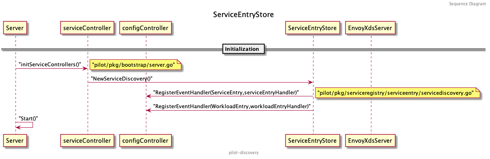
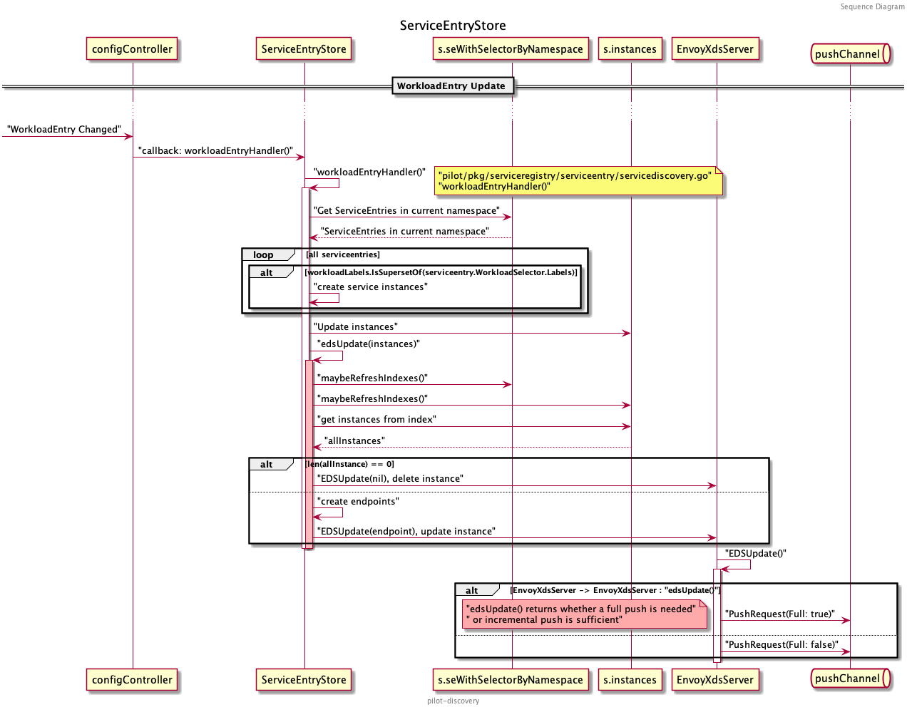
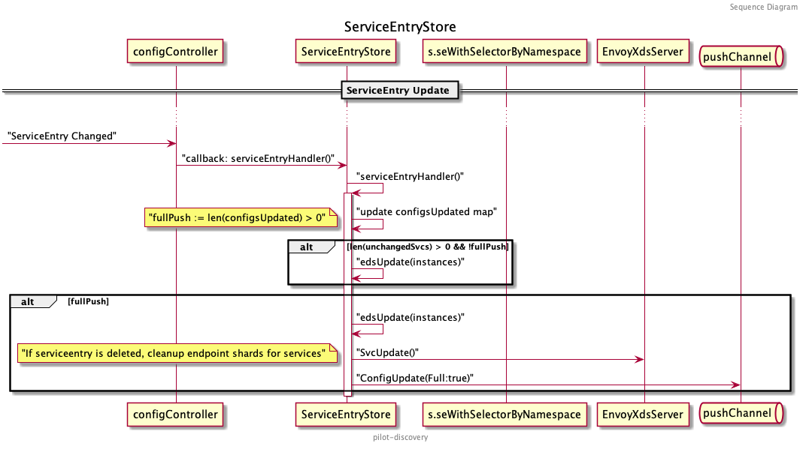

了解了 `Pilot` 源码的基本结构和启动流程之后，我们可以深入探索 `Pilot` 究竟是怎么下发 `xDS` 协议的，以及协议的生成逻辑。相信大家都会有这些疑问：控制面与数据面详细的交互过程是什么？到底什么时候才会增量推送？增量推送判断的逻辑是什么？ 非 `Kubernetes` 原生的服务（如存在于虚拟机的服务、 `Dubbo` 服务等）到底是怎么注册并且经过一系列转化下发至数据面的？

带着这些问题，开始我们今天对 `Pilot` 的探索。

*注：本文基于 `istio release-1.7` 分支分析，其他版本的代码结构会有所不同。*

## ServiceEntryStore

在多点落地 `ServiceMesh` 的过程中，大量的用到了 `ServiceEntry` ，每一个 `Dubbo` 服务都会映射一个 `ServiceEntry` 创建在 `Kubernetes` 里。 `ServiceEntry` 的作用就是将集群外部的服务注册到 `Pilot` 中，再统一由 `ServiceController` 进行管理。相应的，管理外部服务实例的对象为 `WorkloadEntry` ， `ServiceEntry` 可以通过 `LabelSelector` 筛选出自身对应的实例。

`ServiceEntry` 是作为 CR (Custome Resource) 保存在 `Kubernetes` 集群里的（也可以通过 MCP 服务直接发送给 `Pilot` ），暂时只讨论在集群中创建 CR 的情况。在上一篇源码分析中我们介绍到， `Pilot` 是通过 `ConfigController` 来监听创建在集群中的 CR 的， `ServiceEntry` 也不例外，保存这些 CR 的 `ConfigStore` 会被转化为 `ServiceEntryStore` 中的 `store` （转化的详情见上一篇源码分析），这就是最终 `Pilot` 存储 `ServiceEntry` 的地方。当监听的资源推送更改的事件时，会触发 `ServiceEntryStore` 对应的 `handler` 处理后续的流程。

我们先来看一下 `ServiceEntryStore` 的结构和它提供的方法：

```go
// istio/pilot/pkg/serviceregistry/serviceentry/servicediscovery.go:61

// ServiceEntryStore communicates with ServiceEntry CRDs and monitors for changes
type ServiceEntryStore struct {
  XdsUpdater model.XDSUpdater  // 用来接收 EnvoyXdsServer 的接口，主要用来 Push 相应的 xDS 更新请求
  store      model.IstioConfigStore // 保存 ServiceEntry 实例的地方
  storeMutex sync.RWMutex  // 读写 store 时需要的锁
  // 以 hostname/namespace 以及类型（是服务还是实例）等作为索引的服务实例表
  instances map[instancesKey]map[configKey][]*model.ServiceInstance
  // seWithSelectorByNamespace 保存了每个 namespace 里所有的 ServiceEntry，也是作为一个索引供 handler 使用
  seWithSelectorByNamespace map[string][]servicesWithEntry
  refreshIndexes            bool
  ...
}
```

可以看到除了 `XdsUpdater` 和 `store` 两个必须的结构外，其余大部分都是些资源的缓存和索引（索引键不同），为后续 `handler` 处理事件时提供便利。除了结构，还需要关注两个比较重要的 `handler` :

```go
// WorkloadEntry 变化时的处理逻辑
func (s *ServiceEntryStore) workloadEntryHandler(old, curr model.Config, event model.Event) {}
// ServiceEntry 变化时的处理逻辑
func (s *ServiceEntryStore) serviceEntryHandler(old, curr model.Config, event model.Event) {}
```

这两个 `handler` 的业务逻辑后文中再详细讨论，先来回忆下 `ServiceEntryStore` 的初始化流程：



在 `Server` 初始化 `ServiceController` 的时候，通过调用 `NewServiceDiscovery()` 方法初始化 `ServiceEntryStore` ，这里除了将 `EnvoyXdsServer` 和 `IstioConfigStore` 与 `ServiceEntryStore` 关联起来外，最重要的就是向 `ConfigController` 注册了 `ServiceEntry` 和 `WorkloadEntry` 的事件 `Handler`:

```go
func NewServiceDiscovery(configController model.ConfigStoreCache, store model.IstioConfigStore, xdsUpdater model.XDSUpdater) *ServiceEntryStore {
  s := &ServiceEntryStore{
    XdsUpdater:            xdsUpdater,
    store:                 store,
    ip2instance:           map[string][]*model.ServiceInstance{},
    instances:             map[instancesKey]map[configKey][]*model.ServiceInstance{},
    workloadInstancesByIP: map[string]*model.WorkloadInstance{},
    refreshIndexes:        true,
  }
  if configController != nil {
    configController.RegisterEventHandler(gvk.ServiceEntry, s.serviceEntryHandler)
    configController.RegisterEventHandler(gvk.WorkloadEntry, s.workloadEntryHandler)
  }
  return s
}
```

这样在 `ConfigController` 监听到资源变化的时候，就会调用 `serviceEntryHandler` 和 `workloadEntryHandler` 来处理事件了。这两个 `handler` 的目的都是向 `EnvoyXdsServer` 推送相应的 `xDS` 资源变化。

### workloadEntryHandler

首先来分析服务实例 `WorkloadEntry` 的更新是如何下发 `xDS` 的：



`seWithSelectorByNamespace` 和 `instances` 如上述 `ServiceEntryStore` 结构介绍中的注释，前者缓存了各个 `namespace` 中所有的 `ServiceEntry` ，后者则是所有服务节点 `WorkloadEntry` 的缓存。

当有新的 `WorkloadEntry` 变化时，先从 `seWithSelectorByNamespace` 中读取同一 `namespace` 中的 `ServiceEntry` ，遍历它们并与 `WorkloadEntry` 的 `Label` 进行比对，确定是关联的服务后，依据获取的服务创建 `ServiceInstance` 。 `ServiceInstance` 是 `Pilot` 抽象出的描述具体服务对应实例的结构:

```go
type ServiceInstance struct {
  Service     *Service       `json:"service,omitempty"`
  ServicePort *Port          `json:"servicePort,omitempty"`
  Endpoint    *IstioEndpoint `json:"endpoint,omitempty"`
}
```

创建了新的 `ServiceInstance` 后，需要及时更新实例的索引表 `s.instances` :

```go
if event != model.EventDelete {
  s.updateExistingInstances(key, instances)
} else {
  s.deleteExistingInstances(key, instances)
}
```

之后将新创建的 `ServiceInstance` 传入 `ServiceEntryStore` 专门处理 `EDS` 的函数 `s.edsUpdate()` 。在做进一步处理时，需要再刷新一遍索引表，调用 `maybeRefreshIndexes()` 避免其他协程的工作导致索引表更新不及时，完成后开启读锁，从服务实例索引表 `s.Instances` 中查找我们要处理的实例。如果是删除事件，先前更新索引表的时候已经删除了，所以这里是查不到 `allInstances` 的，直接向 `EnvoyXdsServer` 发送删除 `EDS` 的请求。

```go
// edsUpdate triggers an EDS update for the given instances
func (s *ServiceEntryStore) edsUpdate(instances []*model.ServiceInstance) {
  allInstances := []*model.ServiceInstance{}

  // Find all keys we need to lookup
  keys := map[instancesKey]struct{}{}
  for _, i := range instances {
    keys[makeInstanceKey(i)] = struct{}{}
  }

  s.maybeRefreshIndexes()

  s.storeMutex.RLock()
  for key := range keys {
    for _, i := range s.instances[key] {
      allInstances = append(allInstances, i...)
    }
  }
  s.storeMutex.RUnlock()

  // This was a delete
  if len(allInstances) == 0 {
    for k := range keys {
      _ = s.XdsUpdater.EDSUpdate(s.Cluster(), string(k.hostname), k.namespace, nil)
    }
    return
  }
  ...
}
```

如果实例有更新则直接发送更新 `EDS` 的请求：

```go
// edsUpdate triggers an EDS update for the given instances
func (s *ServiceEntryStore) edsUpdate(instances []*model.ServiceInstance) {
  ...
  endpoints := make(map[instancesKey][]*model.IstioEndpoint)
  for _, instance := range allInstances {
    port := instance.ServicePort
    key := makeInstanceKey(instance)
    endpoints[key] = append(endpoints[key],
    &model.IstioEndpoint{
      Address:         instance.Endpoint.Address,
      EndpointPort:    instance.Endpoint.EndpointPort,
      ServicePortName: port.Name,
      Labels:          instance.Endpoint.Labels,
      UID:             instance.Endpoint.UID,
      ServiceAccount:  instance.Endpoint.ServiceAccount,
      Network:         instance.Endpoint.Network,
      Locality:        instance.Endpoint.Locality,
      LbWeight:        instance.Endpoint.LbWeight,
      TLSMode:         instance.Endpoint.TLSMode,
    })
  }

  for k, eps := range endpoints {
    _ = s.XdsUpdater.EDSUpdate(s.Cluster(), string(k.hostname), k.namespace, eps)
  }
}
```

完整的 `workloadEntryHandler()` 代码如下：

```go
func (s *ServiceEntryStore) workloadEntryHandler(old, curr model.Config, event model.Event) {
  wle := curr.Spec.(*networking.WorkloadEntry)
  key := configKey{
    kind:      workloadEntryConfigType,
    name:      curr.Name,
    namespace: curr.Namespace,
  }

  ...

  s.storeMutex.RLock()
  // We will only select entries in the same namespace
  entries := s.seWithSelectorByNamespace[curr.Namespace]
  s.storeMutex.RUnlock()

  // if there are no service entries, return now to avoid taking unnecessary locks
  if len(entries) == 0 {
    return
  }

  log.Debugf("Handle event %s for workload entry %s in namespace %s", event, curr.Name, curr.Namespace)
  instances := []*model.ServiceInstance{}
  for _, se := range entries {
    workloadLabels := labels.Collection{wle.Labels}
    if !workloadLabels.IsSupersetOf(se.entry.WorkloadSelector.Labels) {
      // Not a match, skip this one
      continue
    }
    instance := convertWorkloadEntryToServiceInstances(wle, se.services, se.entry)
    instances = append(instances, instance...)
  }

  if event != model.EventDelete {
    s.updateExistingInstances(key, instances)
  } else {
    s.deleteExistingInstances(key, instances)
  }

  s.edsUpdate(instances)
}
```

接下来就是 `EnvoyXdsServer` 来处理这次 `EDS` 的更新请求了。首先 `EnvoyXdsServer` 会判断此次 `EDS` 更新是全量下发还是增量下发，然后创建 `PushRequest` 发送至 `EnvoyXdsServer` 统一用来接收推送请求的 `pushChannel` 。

```go
func (s *DiscoveryServer) EDSUpdate(clusterID, serviceName string, namespace string,
  istioEndpoints []*model.IstioEndpoint) error {
  inboundEDSUpdates.Increment()
  // 判断是否是全量下发
  fp := s.edsUpdate(clusterID, serviceName, namespace, istioEndpoints)
  s.ConfigUpdate(&model.PushRequest{
    Full: fp,
    ConfigsUpdated: map[model.ConfigKey]struct{}{{
      Kind:      gvk.ServiceEntry,
      Name:      serviceName,
      Namespace: namespace,
    }: {}},
    Reason: []model.TriggerReason{model.EndpointUpdate},
  })
  return nil
}
```

`pushChannel` 后续的处理流程和 `EDS` 是否增量更新将在下文讨论 `EnvoyXdsServer` 的时候再分析，这里不再赘述。

### serviceEntryHandler

了解了 `WorkloadEntry` 的更新是如何处理之后，我们再来看下 `serviceEntryHandler` 是如何处理 `ServiceEntry` 的：



`serviceEntryHandler` 会将 `ServiceEntry` 转化为一组 `Pilot` 内部抽象的服务，每个不同的 `Hosts` 、 `Address` 都会对应一个 `Service` ，并且初始化一个名为 `configsUpdated` 的 `map` 来保存是否有 `ServiceEntry` 需要更新，以及创建了多个 `slice` 分别保存该新增、删除、更新和没有变化的服务：

```go
func (s *ServiceEntryStore) serviceEntryHandler(old, curr model.Config, event model.Event) {
  cs := convertServices(curr)
  configsUpdated := map[model.ConfigKey]struct{}{}
  var addedSvcs, deletedSvcs, updatedSvcs, unchangedSvcs []*model.Service
  ...
}
```

根据不同的事件类型，更新不同的 `slice` :

```go
switch event {
case model.EventUpdate:
  os := convertServices(old)
  if selectorChanged(old, curr) {
    // Consider all services are updated.
    mark := make(map[host.Name]*model.Service, len(cs))
    for _, svc := range cs {
      mark[svc.Hostname] = svc
      updatedSvcs = append(updatedSvcs, svc)
    }
    for _, svc := range os {
      if _, f := mark[svc.Hostname]; !f {
        updatedSvcs = append(updatedSvcs, svc)
      }
    }
  } else {
    addedSvcs, deletedSvcs, updatedSvcs, unchangedSvcs = servicesDiff(os, cs)
  }
case model.EventDelete:
  deletedSvcs = cs
case model.EventAdd:
  addedSvcs = cs
default:
  // this should not happen
  unchangedSvcs = cs
}
```

比较特别的是，当事件为更新事件时，会和老的 `Service` 列表进行比对。先看是否有某个服务的 `Selector` 发生了变化，如果发生了变化，需要将新老服务列表里的所有服务都加入到更新列表中。如果 `Selector` 没有发生变化，通过 `serviceDiff()` 挨个比对新老服务列表中的服务，对应保存至新增、删除、更新和未变化的 `slice` 中。

将服务归类后，把需要变化的服务都写入 `configsUpdated` 中：

```go
for _, svcs := range [][]*model.Service{addedSvcs, deletedSvcs, updatedSvcs} {
  for _, svc := range svcs {
    configsUpdated[model.ConfigKey{
      Kind:      gvk.ServiceEntry,
      Name:      string(svc.Hostname),
      Namespace: svc.Attributes.Namespace}] = struct{}{}
  }
}
```

由于 `serviceDiff()` 只会比对 `Service` 结构，并不会对比 `Endpoints` 是否变化，所以当有 `unchangedSvcs` 时，可能需要对这些服务的 `xDS` 做增量更新（只更新 `EDS` ），也可能是全量更新。什么时候会全量更新呢？当服务的 `Resolution` 为 `DNS` 时（可以阅读文档了解 [Resolution](https://istio.io/latest/docs/reference/config/networking/service-entry/#ServiceEntry-Resolution) ）， `Endpoint` 的 `address` 都是全域名，需要更新 `CDS` 才行。

```go
if len(unchangedSvcs) > 0 {
  // If this service entry had endpoints with IPs (i.e. resolution STATIC), then we do EDS update.
  // If the service entry had endpoints with FQDNs (i.e. resolution DNS), then we need to do
  // full push (as fqdn endpoints go via strict_dns clusters in cds).
  currentServiceEntry := curr.Spec.(*networking.ServiceEntry)
  oldServiceEntry := old.Spec.(*networking.ServiceEntry)
  if currentServiceEntry.Resolution == networking.ServiceEntry_DNS {
    if !reflect.DeepEqual(currentServiceEntry.Endpoints, oldServiceEntry.Endpoints) {
      // fqdn endpoints have changed. Need full push
      for _, svc := range unchangedSvcs {
        configsUpdated[model.ConfigKey{
          Kind:      gvk.ServiceEntry,
          Name:      string(svc.Hostname),
          Namespace: svc.Attributes.Namespace}] = struct{}{}
      }
    }
  }
}
```

当 `unchangedSvcs` 的 `Resolution` 为 `STATIC` 时，只需要增量的更新 `EDS` 即可：

```go
if len(unchangedSvcs) > 0 && !fullPush {
  // IP endpoints in a STATIC service entry has changed. We need EDS update
  // If will do full-push, leave the edsUpdate to that.
  // XXX We should do edsUpdate for all unchangedSvcs since we begin to calculate service
  // data according to this "configsUpdated" and thus remove the "!willFullPush" condition.
  instances := convertInstances(curr, unchangedSvcs)
  key := configKey{
    kind:      serviceEntryConfigType,
    name:      curr.Name,
    namespace: curr.Namespace,
  }
  // If only instances have changed, just update the indexes for the changed instances.
  s.updateExistingInstances(key, instances)
  s.edsUpdate(instances)
  return
}
```

如果 `configsUpdated` 中有值，则需要做 `fullPush` ，先更新这些服务的 `EDS` ，再向 `pushChannel` 发送 `fullPush` 的 `PushRequest` :

```go
if fullPush {
  // When doing a full push, for added and updated services trigger an eds update
  // so that endpoint shards are updated.
  var instances []*model.ServiceInstance
  if len(addedSvcs) > 0 {
    instances = append(instances, convertInstances(curr, addedSvcs)...)
  }
  if len(updatedSvcs) > 0 {
    instances = append(instances, convertInstances(curr, updatedSvcs)...)
  }
  if len(unchangedSvcs) > 0 {
    currentServiceEntry := curr.Spec.(*networking.ServiceEntry)
    oldServiceEntry := old.Spec.(*networking.ServiceEntry)
    // Non DNS service entries are sent via EDS. So we should compare and update if such endpoints change.
    if currentServiceEntry.Resolution != networking.ServiceEntry_DNS {
      if !reflect.DeepEqual(currentServiceEntry.Endpoints, oldServiceEntry.Endpoints) {
        instances = append(instances, convertInstances(curr, unchangedSvcs)...)
      }
    }
  }
  s.edsUpdate(instances)

  // If service entry is deleted, cleanup endpoint shards for services.
  for _, svc := range deletedSvcs {
    s.XdsUpdater.SvcUpdate(s.Cluster(), string(svc.Hostname), svc.Attributes.Namespace, model.EventDelete)
  }

  pushReq := &model.PushRequest{
    Full:           true,
    ConfigsUpdated: configsUpdated,
    Reason:         []model.TriggerReason{model.ServiceUpdate},
  }

  s.XdsUpdater.ConfigUpdate(pushReq)
}
```

至此， `ServiceEntryStore` 是如何处理 `ServiceEntry` 和 `WorkloadEntry` 的逻辑就介绍完了。其余像 `ServiceEntry` 选择集群内的 `Pods` 、 `Kubernetes` 原生 `Service` 选择 `WorkloadEntry` 的用法读者感兴趣可以自行研究相关源码。

其余注册中心的处理逻辑如 `kube` 、 `mcp` 等可继续关注本系列的其他文章。读者也可以自行尝试走读分析：

```
// 相关源码目录
kube: pilot/pkg/serviceregistry/kube
mcp: pilot/pkg/serviceregistry/mcp
```

接下来我们介绍 `Pilot Server` 中的核心， `EnvoyXdsServer` 。
