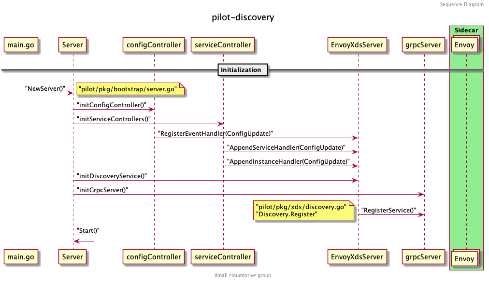
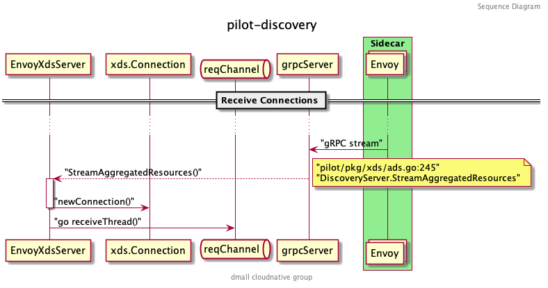
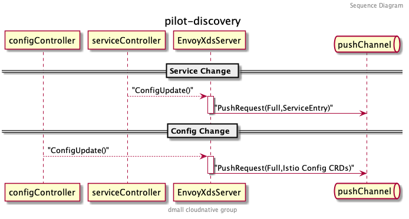
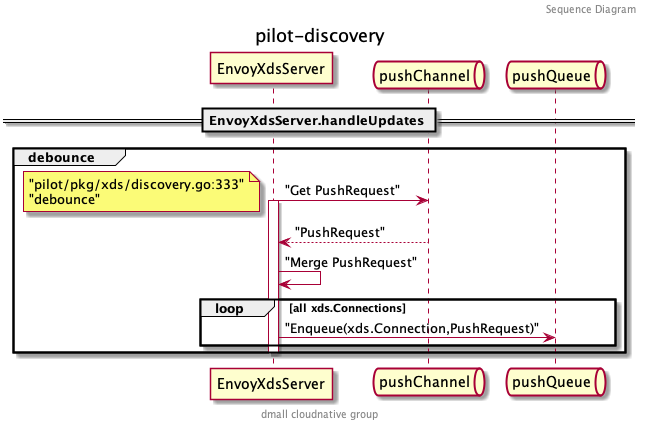
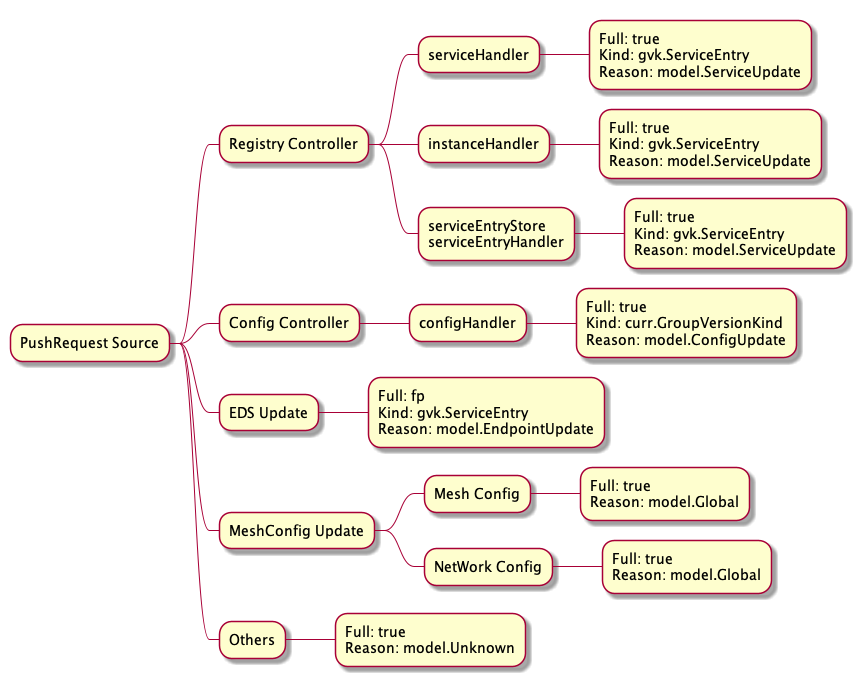
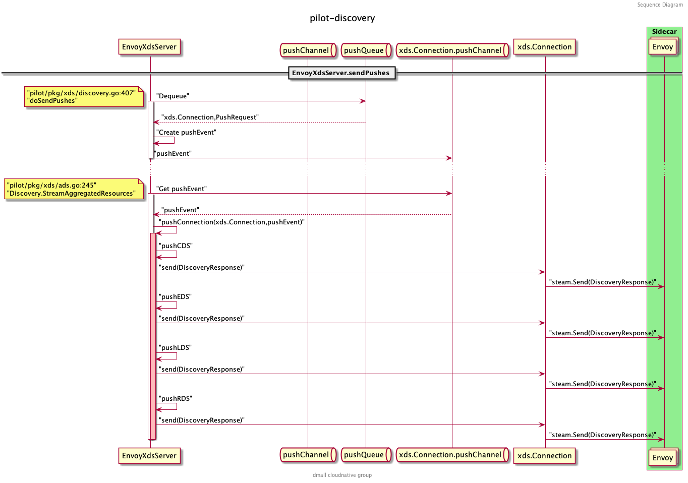
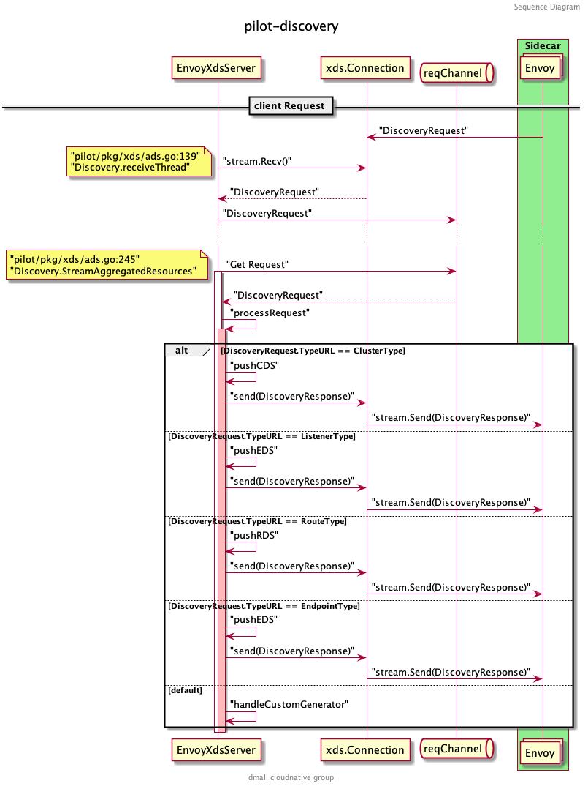

本篇主要探讨上一篇源码分析中留下的问题，如 `EnvoyXdsServer` 是如何工作的，以及 xDS 的下发流程。对推送事件的防抖、`SidecarScope` 的运用做一些细致的分析。

## EnvoyXdsServer

`EnvoyXdsServer` 主要负责 Pilot 中 xDS 协议的生成和下发，接收并处理 `configController` 和 `serviceController` 推送的 PushRequest ，与集群中所有的数据面代理进行 gRPC 通信，并处理它们的请求。在 Pilot Server 中的定义如下：

```go
// Server contains the runtime configuration for the Pilot discovery service.
type Server struct {
  EnvoyXdsServer *xds.DiscoveryServer
}
```

`EnvoyXdsServer` 只是 Pilot Server 中的别名，真正的 `xds.DiscoveryServer` 结构在 `istio/pilot/pkg/xds/discovery.go:71` 中，这里只保留关键的字段进行说明：

```go
// DiscoveryServer is Pilot's gRPC implementation for Envoy's v2 xds APIs
type DiscoveryServer struct {
  Env *model.Environment // 与 Pilot Server 中的 Environment 一样
  ConfigGenerator core.ConfigGenerator // xDS 数据的生成器接口

  // Endpoint 的缓存，以服务名和 namespace 作为索引，主要用于 EDS 更新
  EndpointShardsByService map[string]map[string]*EndpointShards

  // 统一接收其他组件发来的 PushRequest 的 channel
  pushChannel chan *model.PushRequest

  // pushQueue 主要是在真正 xDS 推送前做防抖缓存
  pushQueue *PushQueue

  // 保存了所有生效的 gRPC 连接
  adsClients      map[string]*Connection

  ...
}
```

### Initialization

回忆一下 pilot-discovery 的启动流程：



在初始化 grpcServer 的时候，调用了 `DiscoveryServer.Register()` 方法，向 grpcServer 注册了以下几个服务（以 v2 版本为例）：

```protobuf
service AggregatedDiscoveryService {
  // 全量 ADS Stream 接口
  rpc StreamAggregatedResources(stream api.v2.DiscoveryRequest)
      returns (stream api.v2.DiscoveryResponse) {
  }

  // 增量 ADS Stream 接口
  rpc DeltaAggregatedResources(stream api.v2.DeltaDiscoveryRequest)
      returns (stream api.v2.DeltaDiscoveryResponse) {
  }
}
```

上面的 proto 文件可以在 [ads.proto](https://github.com/envoyproxy/envoy/blob/master/api/envoy/service/discovery/v2/ads.proto) 找到。熟悉 gRPC 的读者可以看到这个服务定义了两个 RPC 接口：

1.  `StreamAggregatedResources` 接收 `DiscoveryRequest` ，返回 `DiscoveryResponse` 流，包含全量的 xDS 数据
2.  `DeltaAggregatedResources` 接收 `DeltaDiscoveryRequest` ，返回 `DeltaDiscoveryResponse` 流，包含增量的 xDS 数据

xDS 相关的介绍可以参考 Envoy 的文档：[xDS REST and gRPC protocol](https://www.envoyproxy.io/docs/envoy/latest/api-docs/xds_protocol) ，写的很详细。

`EnvoyXdsServer` 在启动方法 Start() 中开启了两个比较重要的协程 `handleUpdates` 和 `sendPushes` 。 `handleUpdates` 主要用来处理 `pushChannel` 中收到的推送请求以及防抖。 `sendPushes` 则负责具体的推送。

```go
func (s *DiscoveryServer) Start(stopCh <-chan struct{}) {
  adsLog.Infof("Starting ADS server")
  go s.handleUpdates(stopCh)
  go s.periodicRefreshMetrics(stopCh)
  go s.sendPushes(stopCh)
}
```

### Receive Connection

当服务实例的代理（ Sidecar 模式） 启动的时候，会和 grpcServer 建立连接并调用 `StreamAggregatedResources` 方法：



`StreamAggregatedResources` 会和当前的 Proxy 创建一个连接，并创建一个接受请求的 `reqChannel` 。同时开启一个新的协程 `receiveThread` 处理客户端主动发起的请求：

```go
func (s *DiscoveryServer) StreamAggregatedResources(stream discovery.AggregatedDiscoveryService_StreamAggregatedResourcesServer) error {
  // ...
  con := newConnection(peerAddr, stream)
  var receiveError error
  reqChannel := make(chan *discovery.DiscoveryRequest, 1)
  go s.receiveThread(con, reqChannel, &receiveError)
  // ...
}
```

### Receive Change

一切准备就绪之后， `EnvoyXdsServer` 开始接收来自 `configController` 和 `serviceController` 的配置变化事件，包括服务数据的变化和配置数据的变化，都会创建 PushRequest 发送至 `EnvoyXdsServer` 的 `pushChannel` :



PushRequest 包含是否全量推送的标识以及主要更改的资源类型。全部统一推送到 `pushChannel` 之后，就由 `EnvoyXdsServer` 启动时创建的协程 `handleUpdates` 来处理了。

### Handle Updates

`handleUpdates` 最重要的功能就是防抖，避免因过快的推送带来的问题和压力。

```go
// Debouncing and push request happens in a separate thread, it uses locks
// and we want to avoid complications, ConfigUpdate may already hold other locks.
// handleUpdates processes events from pushChannel
// It ensures that at minimum minQuiet time has elapsed since the last event before processing it.
// It also ensures that at most maxDelay is elapsed between receiving an event and processing it.
func (s *DiscoveryServer) handleUpdates(stopCh <-chan struct{}) {
  debounce(s.pushChannel, stopCh, s.Push)
}
```



什么是防抖（ `Debounce` ）呢？举一个简单的例子，我们每天上班都要坐电梯，当你第一个进电梯后，想上 5 楼，按下了 5 楼并关闭了电梯门，门还没关上的时候，突然碰到一个同事，电梯门又打开，同事进来后你们一起去了 5 楼。这样两个人两次去 5 楼的事件，电梯跑了一趟就解决了。试想如果电梯的门都是秒关不等人，每次只装一个人，第二个人必须等电梯把上一个人送到之后才能重新乘坐，就算写字楼有很多电梯也会在早高峰的时候产生拥挤。

假设电梯容量无限大，你有无数个同事，今天好巧不巧每次电梯快关上的时候都有个同事要进来，门永远关不上，电梯也一直不走，那好了大家今天谁也别想上班，也是个很大的问题。那我们做一个规定，每趟电梯在 1 楼的时候最多等待 3 分钟，到时间了电梯就走，这样电梯的利用率就提升了，大家也不用等太久就可以上班打卡。

如果优化的更好一点，把所有电梯分成奇偶两组，奇组只在奇数层停，偶组只在偶数层停。这样就可以最大化的提升资源利用率。但还有一种情况，如果我们进电梯后，后面没有人进电梯了，白白等待了 3 分钟电梯才走，浪费了时间，这也不行。

那我们就再给电梯系统加一个时间，让电梯在有人进电梯后等待 10 秒，如果过了 10 秒还没有下一个人进来，电梯就不等了。 如有有人进来就重新计时 10 秒钟。

从上面这个例子可以引申出几个概念，一个是最小静默时间，一个是最大延迟时间。最小静默时间就是上面的 10 秒钟，从上一个进电梯的人开始计时，10 秒内有新的人进来就接着等，否则就不等，每进一个人就重新计算这个时间。最大延迟时间就是上面电梯等待的 3 分钟，到了这个时间就算还有很多人没有进电梯，电梯也必须走。另外一个防抖中的重要概念就是分组合并，比如把都去偶数层的人统一在一趟电梯上。

`EnvoyXdsServer` 的防抖函数也一样，把要推送的请求根据资源类型、事件类型分组或者合并，并在 `minQuite` 时间内等待下一个请求，超过 `maxDelay` 时间就进行下一步处理。

在 Pilot 中最小静默时间可以通过 `PILOT_DEBOUNCE_AFTER` 这个环境变量设置，默认为 100 毫秒，最大延迟时间可以通过 `PILOT_DEBOUNCE_MAX` 设置，默认为 10 秒。

```go
// isti/pilot/pkg/features/pilot.go

DebounceAfter = env.RegisterDurationVar(
  "PILOT_DEBOUNCE_AFTER",
  100*time.Millisecond,
  "The delay added to config/registry events for debouncing. This will delay the push by "+
    "at least this internal. If no change is detected within this period, the push will happen, "+
    " otherwise we'll keep delaying until things settle, up to a max of PILOT_DEBOUNCE_MAX.",
).Get()

DebounceMax = env.RegisterDurationVar(
  "PILOT_DEBOUNCE_MAX",
  10*time.Second,
  "The maximum amount of time to wait for events while debouncing. If events keep showing up with no breaks "+
    "for this time, we'll trigger a push.",
).Get()
```

来看一下 `debounce` 方法中定义的 `pushWorker` ，主要的判断逻辑就定义在这里：

```go
pushWorker := func() {
  eventDelay := time.Since(startDebounce)
  quietTime := time.Since(lastConfigUpdateTime)
  // it has been too long or quiet enough
  if eventDelay >= debounceMax || quietTime >= debounceAfter {
    if req != nil {
      pushCounter++
      adsLog.Infof("Push debounce stable[%d] %d: %v since last change, %v since last push, full=%v",
        pushCounter, debouncedEvents,
        quietTime, eventDelay, req.Full)

      free = false
      go push(req)
      req = nil
      debouncedEvents = 0
    }
  } else {
    timeChan = time.After(debounceAfter - quietTime)
  }
}
```

可以看到当事件的延迟时间大于等于最大延迟时间或静默时间大于等于最小静默时间，才会执行 push() 方法。 push() 方法也是 `debounce` 方法中包装的一个过程函数，它会在真正的 `pushFn()` 完成后向 `freeCh` 发送消息表示这次防抖处理完成了，可以开始下一次防抖。

```go
push := func(req *model.PushRequest) {
  pushFn(req)
  freeCh <- struct{}{}
}
```

`debounce()` 方法等待各个 channel 的逻辑如下：

```go
for {
  select {
  case <-freeCh:
    free = true
    pushWorker()
  case r := <-ch:
    // If reason is not set, record it as an unknown reason
    if len(r.Reason) == 0 {
      r.Reason = []model.TriggerReason{model.UnknownTrigger}
    }
    if !enableEDSDebounce && !r.Full {
      // trigger push now, just for EDS
      go pushFn(r)
      continue
    }

    lastConfigUpdateTime = time.Now()
    if debouncedEvents == 0 {
      timeChan = time.After(debounceAfter)
      startDebounce = lastConfigUpdateTime
    }
    debouncedEvents++

    req = req.Merge(r)
  case <-timeChan:
    if free {
      pushWorker()
    }
  case <-stopCh:
    return
  }
}
```

先看 `case r:= <-ch` 这个分支，当收到第一个 PushRequest 的时候，通过一个延时器 `timeChan` 先延迟一个最小静默时间（100 毫秒），期间接收新的请求直接进行 Merge ，同时累加已防抖的事件个数。当第一个 100 毫秒计时结束就会进入 `case <-timeChan` 分支，会判断是否有正在执行的防抖过程，没有的话就执行 `pushWorker()` 做一次防抖判断看是否需要推送。如果第一个请求的延迟时间还没有超过最大延迟时间（10 秒钟）并且距离处理上一次 PushRequest 的时间不足最小静默时间（100 毫秒），则继续延时，等待 `debouncedAfter - quietTime` 也就是不足最小静默时间的部分，再进行下一次 `pushWorker()` 操作。

在看真正的 `pushFn` 函数之前，我们先了解下防抖函数是怎么合并 PushRequest 的。

```go
// istio/pilot/pkg/model/push_context.go:250
// Merge two update requests together
func (first *PushRequest) Merge(other *PushRequest) *PushRequest {
  // ...
  merged := &PushRequest{
    // Keep the first (older) start time
    Start: first.Start,

    // If either is full we need a full push
    Full: first.Full || other.Full,

    // The other push context is presumed to be later and more up to date
    Push: other.Push,

    // Merge the two reasons. Note that we shouldn't deduplicate here, or we would under count
    Reason: append(first.Reason, other.Reason...),
  }

  // Do not merge when any one is empty
  if len(first.ConfigsUpdated) > 0 && len(other.ConfigsUpdated) > 0 {
    merged.ConfigsUpdated = make(map[ConfigKey]struct{}, len(first.ConfigsUpdated)+len(other.ConfigsUpdated))
    for conf := range first.ConfigsUpdated {
      merged.ConfigsUpdated[conf] = struct{}{}
    }
    for conf := range other.ConfigsUpdated {
      merged.ConfigsUpdated[conf] = struct{}{}
    }
  }

  return merged
}
```

合并后的 PushRequest 会保存第一个 PushRequest 的时间以及最新一个 PushRequest 的 `PushContext` ，如果合并的请求中有一个需要全量推送那合并后的请求也必须是全量， `Reason` 描述的是触发这次推送请求的原因，有以下几种：

```go
type TriggerReason string

const (
  // Describes a push triggered by an Endpoint change
  EndpointUpdate TriggerReason = "endpoint"
  // Describes a push triggered by a config (generally and Istio CRD) change.
  ConfigUpdate TriggerReason = "config"
  // Describes a push triggered by a Service change
  ServiceUpdate TriggerReason = "service"
  // Describes a push triggered by a change to an individual proxy (such as label change)
  ProxyUpdate TriggerReason = "proxy"
  // Describes a push triggered by a change to global config, such as mesh config
  GlobalUpdate TriggerReason = "global"
  // Describes a push triggered by an unknown reason
  UnknownTrigger TriggerReason = "unknown"
  // Describes a push triggered for debugging
  DebugTrigger TriggerReason = "debug"
)
```

这里做一个小的拓展：追踪上面所有的原因，可以查询到所有可能发送到 `pushChannel` 的来源：




而 `ConfigsUpdated` 跟踪了所有已经发生变化的配置，这个 Map 主要被用于那些被 [Sidecar](https://istio.io/latest/docs/reference/config/networking/sidecar/) 限定了服务可见性的数据面代理，来过滤不必接收的 xDS 推送。只有与这些代理相关的服务（如 Sidecar 中定义的 Egress 和 Ingress ）发生变化时，才推送到特定的客户端。当 `ConfigsUpdated` 为空时，则表示所有的数据面代理都会收到这次推送。

所以才有上面代码中 `if len(first.ConfigsUpdated) > 0 && len(other.ConfigsUpdated) > 0` 这个判断，只要有一个请求需要推送至所有代理，就不会合并 `ConfigUpdated` 。

对 PushRequest 做完防抖之后，再来看真正的 `pushFn` :

```go
// Push is called to push changes on config updates using ADS. This is set in DiscoveryService.Push,
// to avoid direct dependencies.
func (s *DiscoveryServer) Push(req *model.PushRequest) {
  if !req.Full {
    req.Push = s.globalPushContext()
    go s.AdsPushAll(versionInfo(), req)
    return
  }
  // ...

  oldPushContext := s.globalPushContext()
  if oldPushContext != nil {
    oldPushContext.OnConfigChange()
  }

  push, err := s.initPushContext(req, oldPushContext)
  // ...

  req.Push = push
  go s.AdsPushAll(versionLocal, req)
}
```

可以看到先处理了不是全量推送的请求 `if !req.Full` ，结合之前分析所有 PushRequest 的来源可知， `Full=false` 只在 `EDSUpdate` 的时候才有可能推送，还记得之前分析 `ServiceEntryStore` 里的 `workloadEntryHandler` 吗？ EDS 的变化不需要更新 `PushContext` ，所以这里获取了全局的 `globalPushContext` 后就直接处理了。说到这里读者可能会对 `PushContext` 感到疑惑，这个是用来做什么的呢，为什么 EDS 的增量更新就不用更新它呢？我们先来看看 `PushContext` 的定义：

```go
type PushContext struct {
  // ...
  // privateServices are reachable within the same namespace, with exportTo "."
  privateServicesByNamespace map[string][]*Service
  // publicServices are services reachable within the mesh with exportTo "*"
  publicServices []*Service
  // servicesExportedToNamespace are services that were made visible to this namespace
  // by an exportTo explicitly specifying this namespace.
  servicesExportedToNamespace map[string][]*Service

  // ServiceByHostnameAndNamespace has all services, indexed by hostname then namespace.
  ServiceByHostnameAndNamespace map[host.Name]map[string]*Service `json:"-"`
  ServiceByHostname             map[host.Name]*Service            `json:"-"`
  // ServiceAccounts contains a map of hostname and port to service accounts.
  ServiceAccounts map[host.Name]map[int][]string `json:"-"`

  // VirtualService related
  // This contains all virtual services visible to this namespace extracted from
  // exportTos that explicitly contained this namespace. The keys are namespace,gateway.
  virtualServicesExportedToNamespaceByGateway map[string]map[string][]Config
  // this contains all the virtual services with exportTo "." and current namespace. The keys are namespace,gateway.
  privateVirtualServicesByNamespaceAndGateway map[string]map[string][]Config
  // This contains all virtual services whose exportTo is "*", keyed by gateway
  publicVirtualServicesByGateway map[string][]Config

  // destination rules are of three types:
  //  namespaceLocalDestRules: all public/private dest rules pertaining to a service defined in a given namespace
  //  exportedDestRulesByNamespace: all dest rules pertaining to a service exported by a namespace
  namespaceLocalDestRules      map[string]*processedDestRules
  exportedDestRulesByNamespace map[string]*processedDestRules

  // sidecars for each namespace
  sidecarsByNamespace map[string][]*SidecarScope
  // envoy filters for each namespace including global config namespace
  envoyFiltersByNamespace map[string][]*EnvoyFilterWrapper
  // gateways for each namespace
  gatewaysByNamespace map[string][]Config
  allGateways         []Config
```

`PushContext` 里定义了大量对 Service 、 VirtualService 等的缓存，当服务发生变化时，必须要更新，而 EDS 的增量推送则不用。

在 `Push()` 方法更新了 `PushContext` 之后便调用 `AdsPushAll()` 和 `startPush(req)` 将 PushRequest 重新入队到了 `DiscoveryServer.pushQueue` :

```go
// Send a signal to all connections, with a push event.
func (s *DiscoveryServer) startPush(req *model.PushRequest) {
  pending := []*Connection{}
  for _, v := range s.adsClients {
    pending = append(pending, v)
  }
  // ...
  req.Start = time.Now()
  for _, p := range pending {
    s.pushQueue.Enqueue(p, req)
  }
}
```

`PushQueue` 的结构是什么样的呢？

```go
type PushQueue struct {
  mu   *sync.RWMutex
  cond *sync.Cond

  // eventsMap stores all connections in the queue. If the same connection is enqueued again, the
  // PushEvents will be merged.
  eventsMap map[*Connection]*model.PushRequest

  // connections maintains ordering of the queue
  connections []*Connection

  // inProgress stores all connections that have been Dequeue(), but not MarkDone().
  // The value stored will be initially be nil, but may be populated if the connection is Enqueue().
  // If model.PushRequest is not nil, it will be Enqueued again once MarkDone has been called.
  inProgress map[*Connection]*model.PushRequest
}
```

其中 `eventsMap` 保存了所有代理 gRPC 连接的 PushRequest ，如果相同连接的 PushRequest 再次入队，将会被合并。 `inProgress` 保存了所有连接正在处理的 PushRequest 。这里合并的操作和上面 `debounce` 逻辑一样，调用的是同一个函数。

### Send Pushes

当所有的 PushRequest 经过防抖等一系列处理后，重新入队到 `pushQueue` ，这时在 `EnvoyXdsServer` 启动时创建的协程 `sendPushes` 就开始工作了。

```go
func (s *DiscoveryServer) Start(stopCh <-chan struct{}) {
  adsLog.Infof("Starting ADS server")
  go s.handleUpdates(stopCh)
  go s.periodicRefreshMetrics(stopCh)
  go s.sendPushes(stopCh)
}

func (s *DiscoveryServer) sendPushes(stopCh <-chan struct{}) {
  doSendPushes(stopCh, s.concurrentPushLimit, s.pushQueue)
}
```

这里传入了节流的参数 `s.concurrentPushLimit` ，它是由环境变量 `PILOT_PUSH_THROTTLE` 控制的，默认为 100 。 `doSendPushes` 的逻辑如图：



首先从 `pushQueue` 中通过 `Dequeue()` 方法获取需要处理的代理客户端和对应的 PushRequest ，再根据 PushRequest 生成 Event 传入客户端的 `pushChannel` 中，注意和 `EnvoyXdsServer` 的 `pushChannel` 不同，这里的是针对当前客户端连接的 `pushChannel` 。

```go
func doSendPushes(stopCh <-chan struct{}, semaphore chan struct{}, queue *PushQueue) {
  for {
    select {
    case <-stopCh:
      return
    default:
      semaphore <- struct{}{}

      client, info := queue.Dequeue()

      doneFunc := func() {
        queue.MarkDone(client)
        <-semaphore
      }

      go func() {
        pushEv := &Event{
          full:           info.Full,
          push:           info.Push,
          done:           doneFunc,
          start:          info.Start,
          configsUpdated: info.ConfigsUpdated,
          noncePrefix:    info.Push.Version,
        }

        select {
        case client.pushChannel <- pushEv:
          return
        case <-client.stream.Context().Done(): // grpc stream was closed
          doneFunc()
          adsLog.Infof("Client closed connection %v", client.ConID)
        }
      }()
    }
  }
}
```

当 `client.stream` 返回 gRPC 完成的消息后，标记此次 PushRequest 完成。那么这里传入的 `pushEv` 事件最后在哪里处理了呢？回想最初客户端创建 gRPC 连接的地方，即调用 `StreamAggregatedResources()` 方法时：

```go
// istio/pilot/pkg/xds/ads.go
func (s *DiscoveryServer) StreamAggregatedResources(stream discovery.AggregatedDiscoveryService_StreamAggregatedResourcesServer) error {
  // ...
  con := newConnection(peerAddr, stream)

  var receiveError error
  reqChannel := make(chan *discovery.DiscoveryRequest, 1)
  go s.receiveThread(con, reqChannel, &receiveError)

  for {
    select {

    case req, ok := <-reqChannel:
      if !ok {
        return receiveError
      }
      err := s.processRequest(req, con)
      if err != nil {
        return err
      }

    case pushEv := <-con.pushChannel:
      err := s.pushConnection(con, pushEv)
      pushEv.done()
      if err != nil {
        return nil
      }
    }
  }
}
```

这里处理了两个 channel 的消息，一个是 `reqChannel` ，另一个就是我们刚提到的 `con.pushChannel` 了。 `reqChannel` 之后再讨论，它主要是处理来自客户端的 gRPC 请求的。

从 `con.pushConnection` 中获取到 `pushEv` 事件后，调用 `s.pushConnection()` 进行处理。首先会处理增量推送 EDS 的情况：

```go
if !pushEv.full {
  if !ProxyNeedsPush(con.node, pushEv) {
    adsLog.Debugf("Skipping EDS push to %v, no updates required", con.ConID)
    return nil
  }
  edsUpdatedServices := model.ConfigNamesOfKind(pushEv.configsUpdated, gvk.ServiceEntry)
  // Push only EDS. This is indexed already - push immediately
  // (may need a throttle)
  if len(con.Clusters()) > 0 && len(edsUpdatedServices) > 0 {
    if err := s.pushEds(pushEv.push, con, versionInfo(), edsUpdatedServices); err != nil {
      return err
    }
  }
  return nil
}
```

通过 `ProxyNeedsPush` 判断代理是否需要推送，判断的逻辑主要是检查推送事件 `pushEv` 的 `configsUpdated` 是否和代理相关。之前提到的在大规模下发场景下起很大作用的 [Sidecar](https://istio.io/latest/docs/reference/config/networking/sidecar/) 就在这里生效。注意这里说的是 Istio 的一种流控配置，不是数据面的边车模式。

1.  SidecarScope

    书接上文，我们着重分析下 `SidecarScope` 的处理流程。这里接着看是怎么检测代理依赖的配置文件的：
    
    ```go
    func checkProxyDependencies(proxy *model.Proxy, config model.ConfigKey) bool {
      // Detailed config dependencies check.
      switch proxy.Type {
      case model.SidecarProxy:
        if proxy.SidecarScope.DependsOnConfig(config) {
          return true
        } else if proxy.PrevSidecarScope != nil && proxy.PrevSidecarScope.DependsOnConfig(config) {
          return true
        }
      default:
        // TODO We'll add the check for other proxy types later.
        return true
      }
      return false
    }
    ```
    
    `SidecarScope.DependsOnConfig()` 方法内容如下：
    
    ```go
    // DependsOnConfig determines if the proxy depends on the given config.
    // Returns whether depends on this config or this kind of config is not scoped(unknown to be depended) here.
    func (sc *SidecarScope) DependsOnConfig(config ConfigKey) bool {
      if sc == nil {
        return true
      }
    
      // This kind of config will trigger a change if made in the root namespace or the same namespace
      if _, f := sidecarScopeNamespaceConfigTypes[config.Kind]; f {
        return config.Namespace == sc.RootNamespace || config.Namespace == sc.Config.Namespace
      }
    
      // This kind of config is unknown to sidecarScope.
      if _, f := sidecarScopeKnownConfigTypes[config.Kind]; !f {
        return true
      }
    
      _, exists := sc.configDependencies[config.HashCode()]
      return exists
    }
    ```
    
    它先是判断了变化的配置是否和 `SidecarScope` 是同个命名空间，不过这只针对 Sidecar 和 EnvoyFilter 等特殊配置。再处理一些不常见的配置，如果这些配置不在 `SidecarScope` 管理范围内的话，作为 unknown 类型也返回 true 。 `SidecarScope` 管理的流控配置主要是以下三种：
    
    ```go
    sidecarScopeKnownConfigTypes = map[resource.GroupVersionKind]struct{}{
      gvk.ServiceEntry:    {},
      gvk.VirtualService:  {},
      gvk.DestinationRule: {},
    }
    ```
    
    处理完了特殊情况，就会检测上面三种流控配置是否与当前的代理有关联：
    
    ```go
    _, exists := sc.configDependencies[config.HashCode()]
    return exists
    ```
    
    `configDependencies` 里保存的就是跟当前代理相关的所有流控配置，它是在初始化代理时创建的。还记得当数据面代理第一次连接至控制面时 `StreamAggregatedResources()` 方法里创建的 `receiveThread` 协程吗？
    
    ```go
    func (s *DiscoveryServer) StreamAggregatedResources(stream discovery.AggregatedDiscoveryService_StreamAggregatedResourcesServer) error {
      // ...
      con := newConnection(peerAddr, stream)
    
      var receiveError error
      reqChannel := make(chan *discovery.DiscoveryRequest, 1)
      go s.receiveThread(con, reqChannel, &receiveError)
      // ...
    }
    ```
    
    `receiveThread` 里有个 `initConnection` 方法：
    
    ```go
    func (s *DiscoveryServer) receiveThread(con *Connection, reqChannel chan *discovery.DiscoveryRequest, errP *error) {
      firstReq := true
      for {
        // ...
        if firstReq {
          firstReq = false
          if err := s.initConnection(req.Node, con); err != nil {
            *errP = err
            return
          }
        // ...
        }
        // ...
      }
    }
    ```
    
    `initConnection` 刚开始就会做 `initProxy` 的操作初始化代理，中间会设置代理的状态：
    
    ```go
    // initProxy initializes the Proxy from node.
    func (s *DiscoveryServer) initProxy(node *core.Node) (*model.Proxy, error) {
      // ...
      if err = s.setProxyState(proxy, s.globalPushContext()); err != nil {
        return nil, err
      }
      // ...
      return proxy, nil
    }
    ```
    
    到这里就能看到它在设置 `SidecarScope` 了：
    
    ```go
    func (s *DiscoveryServer) setProxyState(proxy *model.Proxy, push *model.PushContext) error {
      if err := proxy.SetWorkloadLabels(s.Env); err != nil {
        return err
      }
    
      if err := proxy.SetServiceInstances(push.ServiceDiscovery); err != nil {
        return err
      }
    
      proxy.SetSidecarScope(push)
      proxy.SetGatewaysForProxy(push)
      return nil
    }
    ```
    
    如果代理是 `SidecarProxy` 的话（其他还有诸如 `Gateway` 等模式）,调用 `PushContext.getSidecarScope` 初始化 `SidecarScope` :
    
    ```go
    func (node *Proxy) SetSidecarScope(ps *PushContext) {
      sidecarScope := node.SidecarScope
    
      if node.Type == SidecarProxy {
        workloadLabels := labels.Collection{node.Metadata.Labels}
        node.SidecarScope = ps.getSidecarScope(node, workloadLabels)
      } else {
        // Gateways should just have a default scope with egress: */*
        node.SidecarScope = DefaultSidecarScopeForNamespace(ps, node.ConfigNamespace)
      }
      node.PrevSidecarScope = sidecarScope
    }
    ```
    
    因为 `PushContext` 里保存了当前这次推送所用到的所有上下文，通过 `PushContext.sidecarsByNamespace` 就能拿到当前代理所在命名空间的所有 Sidecar 配置。再检查当前代理所依附的实例的 Labels 是否符合 Sidecar 定义的 workloadSelector :
    
    ```go
    func (ps *PushContext) getSidecarScope(proxy *Proxy, workloadLabels labels.Collection) *SidecarScope {
      if sidecars, ok := ps.sidecarsByNamespace[proxy.ConfigNamespace]; ok {
        var defaultSidecar *SidecarScope
        for _, wrapper := range sidecars {
          if wrapper.Config != nil && wrapper.Config.Spec != nil {
            // ...
            if sidecar.GetWorkloadSelector() != nil {
              workloadSelector := labels.Instance(sidecar.GetWorkloadSelector().GetLabels())
              if !workloadLabels.IsSupersetOf(workloadSelector) {
                continue
              }
              return wrapper
            }
            defaultSidecar = wrapper
            continue
          }
          // Not sure when this can happen (Config = nil ?)
          if defaultSidecar != nil {
            return defaultSidecar // still return the valid one
          }
          return wrapper
        }
        if defaultSidecar != nil {
          return defaultSidecar // still return the valid one
        }
      }
    
      return DefaultSidecarScopeForNamespace(ps, proxy.ConfigNamespace)
    }
    ```
    
    这时就把 `SidecarScope` 和 Proxy 关联起来了，这里的 `SidecarScope` 已经是 `PushContext` 处理过的了，里面 `configDependencies` 都是有值的。这个值是在哪里设置的呢？在 `InitContext` 的时候，有个 `PushContext.initSidecarScope()` 方法，这个方法就是解析 Sidecar 里的具体内容，调用 `ConvertToSidecarScope` 将 Engress 和 Ingress 里的定义的服务找出来后，逐个调用 `AddConfigDependencies` 写入 `configuDependencies` 中。
    
    `ConvertToSidecarScope` 函数的代码位于 `istio/pilot/pkg/model/sidecar.go:226` 中，限于篇幅，感兴趣的读者可以自行研读。
    
    到这里 `SidecarScope` 的整个处理流程就处理完了，在生产环境中运用好 `SidecarScope` 能极大的减小数据面收到的 xDS 的数量，希望这段代码分析能帮助各位读者更好的理解，在实际运用过程中可以更好的定位问题。

2.  PushConnection

    回到 `pushConnection` 的主流程，在 `Full=false` 下判断 `ProxyNeedsPush` ，确定需要推送后调用 `pushEds` 增量推送 EDS 。
    
    详细分析下 `pushEds` 的过程，首先遍历所有的 Clusters ，构建生成器生成 EDS ，然后调用 con.send() 进行推送：
    
    ```go
    func (s *DiscoveryServer) pushEds(push *model.PushContext, con *Connection, version string, edsUpdatedServices map[string]struct{}) error {
      // ...
      for _, clusterName := range con.Clusters() {
        // ...
        builder := createEndpointBuilder(clusterName, con.node, push)
        l := s.generateEndpoints(builder)
        if l == nil {
          continue
        }
    
        for _, e := range l.Endpoints {
          endpoints += len(e.LbEndpoints)
        }
    
        if len(l.Endpoints) == 0 {
          empty++
        }
        loadAssignments = append(loadAssignments, l)
      }
      // ...
      response := endpointDiscoveryResponse(loadAssignments, version, push.Version, con.node.RequestedTypes.EDS)
      err := con.send(response)
      // ...
    }
    ```
    
    最后调用 `conn.steam.Send()` 就将 EDS 发送至数据面的客户端了。
    
    ```go
    // Send with timeout
    func (conn *Connection) send(res *discovery.DiscoveryResponse) error {
      done := make(chan error, 1)
      t := time.NewTimer(SendTimeout)
      go func() {
        err := conn.stream.Send(res)
        // ...
        done <- err
      }()
      // ...
    }
    ```
    
    如果是增量推送的话这里就退出了，全量推送和只推送 EDS 一样，也会先判断下 `ProxyNeedsPush` ，确定需要后开始全量推送，根据 `pushTypes` 的不同分别推送 CDS 、 EDS 、 LDS 和 RDS :
    
    ```go
    pushTypes := PushTypeFor(con.node, pushEv)
    
    if con.Watching(v3.ClusterShortType) && pushTypes[CDS] {
      err := s.pushCds(con, pushEv.push, currentVersion)
      if err != nil {
        return err
      }
    } else if s.StatusReporter != nil {
      s.StatusReporter.RegisterEvent(con.ConID, ClusterEventType, pushEv.noncePrefix)
    }
    
    if len(con.Clusters()) > 0 && pushTypes[EDS] {
      err := s.pushEds(pushEv.push, con, currentVersion, nil)
      if err != nil {
        return err
      }
    } else if s.StatusReporter != nil {
      s.StatusReporter.RegisterEvent(con.ConID, EndpointEventType, pushEv.noncePrefix)
    }
    if con.Watching(v3.ListenerShortType) && pushTypes[LDS] {
      err := s.pushLds(con, pushEv.push, currentVersion)
      if err != nil {
        return err
      }
    } else if s.StatusReporter != nil {
      s.StatusReporter.RegisterEvent(con.ConID, ListenerEventType, pushEv.noncePrefix)
    }
    if len(con.Routes()) > 0 && pushTypes[RDS] {
      err := s.pushRoute(con, pushEv.push, currentVersion)
      if err != nil {
        return err
      }
    } else if s.StatusReporter != nil {
      s.StatusReporter.RegisterEvent(con.ConID, RouteEventType, pushEv.noncePrefix)
    }
    proxiesConvergeDelay.Record(time.Since(pushEv.start).Seconds())
    return nil
    ```
    
    推送的逻辑和 EDS 一样，这里就不再赘述。至此，所有 xDS 的下发就完成了。

### Client Request

这部分的内容比较简单，核心推送和上面的 `sendPushes` 一样，流程先是从 `reqChannel` 中获取 `DiscoveryRequest` 看客户端订阅了哪些 xDS ，组装推送即可。



```go
func (s *DiscoveryServer) processRequest(discReq *discovery.DiscoveryRequest, con *Connection) error {
  // ...
  switch discReq.TypeUrl {
  case v2.ClusterType, v3.ClusterType:
    if err := s.handleTypeURL(discReq.TypeUrl, &con.node.RequestedTypes.CDS); err != nil {
      return err
    }
    if err := s.handleCds(con, discReq); err != nil {
      return err
    }
  case v2.ListenerType, v3.ListenerType:
    if err := s.handleTypeURL(discReq.TypeUrl, &con.node.RequestedTypes.LDS); err != nil {
      return err
    }
    if err := s.handleLds(con, discReq); err != nil {
      return err
    }
  case v2.RouteType, v3.RouteType:
    if err := s.handleTypeURL(discReq.TypeUrl, &con.node.RequestedTypes.RDS); err != nil {
      return err
    }
    if err := s.handleRds(con, discReq); err != nil {
      return err
    }
  case v2.EndpointType, v3.EndpointType:
    if err := s.handleTypeURL(discReq.TypeUrl, &con.node.RequestedTypes.EDS); err != nil {
      return err
    }
    if err := s.handleEds(con, discReq); err != nil {
      return err
    }
  default:
    err = s.handleCustomGenerator(con, discReq)
    if err != nil {
      return err
    }
  }
  return nil
```

### 总结

xDS 的推送流程到这里就讲完了。我们从 `EnvoyXdsServer` 的结构开始，对其启动流程、怎么与客户端建立连接、怎么感知配置和服务变化、怎么防抖、怎么推送、`SidecarScope` 如何工作等都做了比较细致的分析，虽然已经阅读了源码，但是距离服务网格化的实际落地、实践中的各种性能问题、针对业务的优化，我们还有很长一段路要走。

限于篇幅， xDS 的生成逻辑我们将在下一篇源码分析中讲解，也就是生成器中构建 xDS 的地方，这部分涉及到很多数据的转化，内容繁杂，需要整篇分析才能讲解的清楚。
