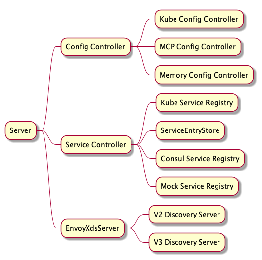
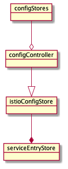
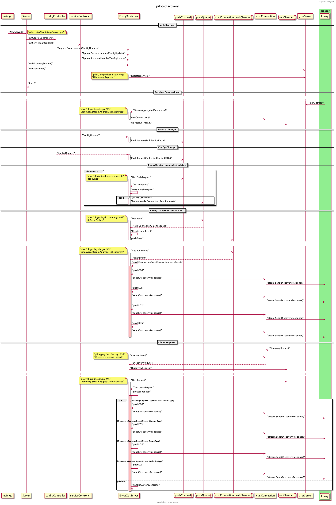
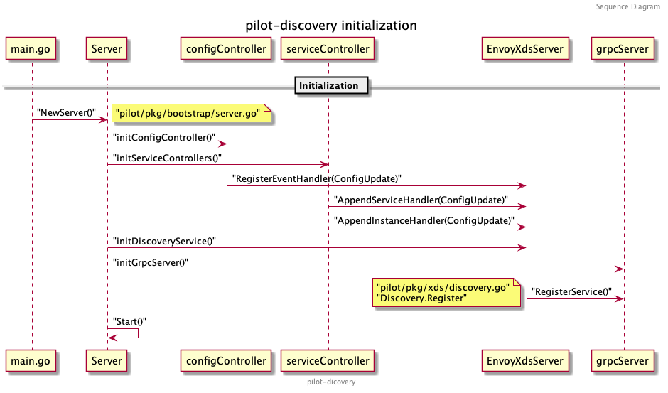

# Istio Pilot 源码分析（一）

`Istio` 作为目前 `ServicMesh` 方案中的翘楚，吸引着越来越多的企业及开发者。越来越多的团队想将其应用于微服务的治理，但在实际落地时却因为不了解 `Istio` 黑盒中的运行机制而左右为难，本文将基于 1.7 的源码讲解 `Istio` 的核心组件 `Pilot` 的结构及运行流程，希望对读者应用 `Istio` 有所助益。

*注：本文基于 `istio release-1.7` 分支分析，其他版本的代码结构会有所不同。*

## 背景

随着 `Istio` 1.7 的发布，内部组件精简后的 `istiod` 日趋稳定，越来越多的公司将其应用到自身微服务的流量治理、安全通信及监测中。多点也不例外，应用 `Istio` 来落地业务系统所有 `Dubbo` 服务的网格化，下沉 `SDK` 逻辑，解决基础中间件与业务系统过于耦合等痛点。 目前，我们是通过自己开发的 `Controller` 组件对接 `Zookeeper` 等注册中心，将注册到 `Zookeeper` 的节点实时转化为 `ServiceEntry` 及 `WorkloadEntry` 等 `Istio` 配置类型写入 `kube-apiserver`，再由 `Pilot` 转化为 `xDS` 协议下发至数据面，同时对集群、虚拟机中的服务进行治理。随着公司服务网格化的逐步落地，对 `Istio` 及数据面组件源码级掌握的诉求越来越高，没有足够的深度及广度很难解决开发过程中遇到的难题，让我们一起揭开 `Istio` 神秘的面纱，看看黑箱内部是如何运作的。

本文作为 `Istio` 控制面组件 `Pilot` 的源码分析系列，主要面向刚接触 `Istio` 或仅停留在使用 `Istio` 基本配置类型（如 `VirtualService`、`DestinationRule` 等）的同学，需要熟悉 `Istio` 的一些 [基础概念及名词](https://istio.io/latest/zh/docs/concepts/traffic-management/) 。文章会涉及较多的代码细节，我们会以不同的篇幅分别介绍以下内容：

1. `pilot-discovery` 宏观架构及启动流程梳理
2. `pilot-discovery` 接口设计及关键接口分析
3. `pilot-discovery xDS` 生成及下发流程梳理
4. `pilot-agent` 流程梳理
5. `pilot` 中的身份认证及安全通信解析

相信通过源码一步一步分析，能消除读者对 `Pilot` 的陌生感，在基于 `Pilot` 做适配开发时会更加清楚的了解其底层运行逻辑，碰到问题时也能更好的定位。

`Pilot` 的代码主要分为两部分: 

- `pilot-discovery`
- `pilot-agent`

其中 `pilot-agent` 负责数据面 `Sidecar` 实例的生命周期管理，而 `pilot-discovery` 负责控制面流量管理配置及路由规则的生成和下发。


## 宏观架构

`pilot-discovery` 的核心组件如图：


其中 `Server` 为 `pilot-discovery` 的主服务，包含了三个比较重要的组件：

- `Config Controller`：从不同来源接收流量控制和路由规则等 `Istio` 的配置，并响应各类事件。
- `Service Controller`：从不同注册中心同步服务及实例，并响应各类事件。
- `EnvoyXdsServer`：核心的 `xDS` 协议推送服务，根据上面组件的数据生成 `xDS` 协议并下发。

`Config Controller` 比较核心的就是对接 `Kubernetes`，从 `kube-apiserver` 中 `Watch` 集群中的 `VirtualService`、`ServiceEntry`、`DestinationRules` 等配置信息，有变化则生成 `PushRequest` 推送至 `EnvoyXdsServer` 中的推送队列。除此之外，还支持对接 `MCP(Mesh Configuration Protocol)` 协议的 `gRPC Server`，如 `Nacos` 的 `MCP` 服务等，不过这种方式需要 `Galley` 组件中的 `MCP Server` 支持，`Galley` 在 `Istio` 后续的版本会慢慢弱化直至删除。最后一种是基于内存的 `Config Controller` 实现，通过 `Watch` 一个文件目录，加载目录中的 `yaml` 文件生成配置数据，主要用来测试。

`Service Controller` 目前原生支持 `Kubernetes` 和 `Consul`，注册在这些注册中心中的服务可以无痛接入 `Mesh`，另外一种比较特殊，就是 `ServiceEntryStore`，它本质是储存在 `Config Controller` 中的 `Istio` 配置数据，但它描述的却是集群外部的服务信息，详情可阅读文档 [ServiceEntry](https://istio.io/latest/docs/reference/config/networking/service-entry/)，`Istio` 通过它将集群外部，如部署在虚拟机中的服务、非 `Kubernetes` 的原生服务同步到 `Istio` 中，纳入网格统一进行流量控制和路由，所以 `ServiceEntryStore` 也可以视为一种注册中心。还有一种就是 `Mock Service Registry`，主要用来测试。

`ServiceEntryStore` 从 `Config Controller` 到 `Service Controller` 的转化流程大致如图（后续会做详细的代码分析，这里简单了解一下即可）：



`ConfigStores` 是一个列表，里面存储了各类 `Istio` 配置文件，包括 `ServiceEntry` 、`WorkloadEntry` 等服务数据，也包括 `VirtualService`、`DestinationRules`、`Sidecar` 等流量控制、路由规则的配置数据，`pilot-discovery` 将这些 `ConfigStores` 聚合成一个 `configController` 统一进行管理，之后再从其中衍生出 `IstioConfigStore`，将其作为 `serviceEntryStore` 的配置源。`serviceEntryStore` 其实就是 `ServiceEntry Controller`，响应 `ServiceEntry` 和 `WorkloadEntry` 这类服务信息的变化。

`EnvoyXdsServer` 比较核心，一切与 `xDS` 协议相关的接收、转换、下发操作都由它完成。`EnvoyXdsServer` 对接所有集群中的边车代理，如 `Envoy`、`MOSN` 等，当配置或服务发生变化时主动推送，也会响应代理发送的请求，依据请求的信息下发相应的 `xDS` 配置。

理解了这三个核心组件的定义，就能比较好的理解下面分析的各类流程了。

`pilot-discovery` 的整个业务流程梳理如下，可以先大概浏览一遍，之后我们逐一进行分析:


## 启动流程梳理

首先详细看一下 `pilot-discovery` 的启动流程。`pilot-discovery` 组件的入口代码在 `istio/pilot/cmd/pilot-discovery` 中。该目录中包含两个文件: `main.go` 和 `request.go`。`main.go` 中定义了 `pilot-discovery` 根命令及 `discovery` 命令，是启动服务发现及配置下发的主流程; 另一个文件 `request.go` 中定义了 `request` 命令，用来请求 `Pilot` 中的 `metrics/debug` 接口，多用来调试。

`main.go` 中 `discoveryCmd`的 `RunE` 函数定义了启动过程，代码如下：

```go
// 创建一个接收空结构的 stop channel 用来停止所有 servers
stop := make(chan struct{})

// 创建服务发现的 Server
discoveryServer, err := bootstrap.NewServer(serverArgs)
if err != nil {
  return fmt.Errorf("failed to create discovery service: %v", err)
}

// 运行 Server 中注册的所有服务
if err := discoveryServer.Start(stop); err != nil {
  return fmt.Errorf("failed to start discovery service: %v", err)
}

// 等待 SIGINT 和 SIGTERM 信号并关闭 stop channel
cmd.WaitSignal(stop)
```

启动流程如图所示：


### 初始化流程

接下来介绍 `discoveryServer` ，即 `pilot-discovery` 组件的核心。在这之前先看下 `Server` 的结构，代码位于 `istio/pilot/pkg/bootstrap/server.go` 文件中。

`Server` 的关键字段如下：

```go
type Server struct {
  XDSServer *xds.DiscoveryServer  // Xds 服务
  environment *model.Environment  // Pilot 环境所需的 API 集合
  kubeRegistry *kubecontroller.Controller   // 处理 Kubernetes 主集群的注册中心
  multicluster *kubecontroller.Multicluster // 处理 Kubernetes 多个集群的注册中心
  configController  model.ConfigStoreCache  // 统一处理配置数据（如 VirtualService 等) 的 Controller
  ConfigStores      []model.ConfigStoreCache // 不同配置信息的缓存器，提供 Get、List、Create 等方法
  serviceEntryStore *serviceentry.ServiceEntryStore // 单独处理 ServiceEntry 的 Controller
  fileWatcher filewatcher.FileWatcher // 文件监听器，主要 watch meshconfig 和 networks 配置文件等
  startFuncs []startFunc // 保存了上述所有服务的启动函数，便于在 Start() 方法中批量启动及管理
}
```

再看 `NewServer()` 方法中的内容，有以下几个关键步骤：


我们对每个步骤逐一进行分析:

1.  初始化 `Environment`

    什么是 `Environment` 呢？根据定义 `Environment` 为 `Pilot` 提供了一个汇总的、运行中所需的 API 集合。 `Environment` 中字段（接口）如下：
    
    ```go
    type Environment struct {
      ServiceDiscovery  // 服务发现的接口模型，主要列出 services 和 instances
      IstioConfigStore  // Istio 配置文件的存储器，主要列出 ServiceEntry 等配置
      mesh.Watcher      // mesh config 文件的监听器
      mesh.NetworksWatcher // mesh network config 文件的监听器
      PushContext *PushContext // 在推送（下发 xDS）生成期间保存信息的上下文
      DomainSuffix string // istio server 默认的后缀域名
    }
    ```
    
    其中 `PushContext` 是 `Pilot` 在推送 `xDS` 前，生成配置期间保存相关信息的上下文的地方，在全量推送配置和配置发生改变时重置。它会保存所有的错误和统计信息，并缓存一些配置的计算信息。 `ServiceDiscovery` 提供了枚举 `Istio` 中服务和实例的方法。 `mesh.Watcher` 和 `mesh.NetworksWatcher` 负责监听 `istiod` 启动时挂载的两个配置文件，这两个配置文件是通过 `configmap` 映射到 `Pod` 的文件系统中的，监听器将在监听到配置文件变化时运行预先注册的 `Handler` 。文件挂载参考 `istiod` 的配置文件：
    
    ```yaml
    apiVersion: v1
    kind: Pod
    metadata:
      name: istiod-56c488887d-z9k5c
      namespace: istio-system
    spec:
      containers:
        volumeMounts:
        - mountPath: /etc/istio/config
          name: config-volume
      volumes:
      - configMap:
          defaultMode: 420
          name: istio
        name: config-volume
    ```
    
    相应的配置存储在 `istio-system/istio` 这个 `configmap` 中，里面保存了 `mesh` 和 `meshNetworks` 两种配置，样例如下:
    
    ```yaml
    apiVersion: v1
    kind: ConfigMap
    metadata:
      name: istio
      namespace: istio-system
    data:
      mesh: |-
        accessLogEncoding: TEXT
        accessLogFile: ""
        accessLogFormat: ""
        defaultConfig:
          binaryPath: /usr/local/bin/mosn
          concurrency: 2
          configPath: ./etc/istio/proxy
        ...
      meshNetworks: 'networks: {}'
    ```
    
    再回头看 `Environment` 的初始化：
    
    ```go
    e := &model.Environment{
      PushContext:  model.NewPushContext(),
      DomainSuffix: args.RegistryOptions.KubeOptions.DomainSuffix,
    }
    ac := aggregate.NewController(aggregate.Options{
      MeshHolder: e,
    })
    e.ServiceDiscovery = ac
    ```
    
    首先是初始化了一份 `PushContext` ，创建 `PushContext` 所需的各种列表和 `Map` 。 其次是初始化了一个聚合所有注册中心的 `Controller` 作为 `Environment` 中的 `ServiceDiscovery` 。 该 `Controller` 提供从所有注册中心（如 `Kubernetes, Consul, MCP` 等）获取服务和实例列表的方法。 这里传入了一个参数 `MeshHolder` 是想利用 `Environment` 中的 `mesh.Watcher` 将 `mesh` 这个配置同步过去。

2.  初始化 `Server`

    `Server` 的结构之前分析过，这里将之前初始化的 `Environment` 传入后，开始初始化 `XDSServer` 。
    
    ```go
    s := &Server{
      clusterID:       getClusterID(args),
      environment:     e,
      XDSServer:       xds.NewDiscoveryServer(e, args.Plugins), // 初始化 XDSServer
      fileWatcher:     filewatcher.NewWatcher(),
      httpMux:         http.NewServeMux(),
      monitoringMux:   http.NewServeMux(),
      readinessProbes: make(map[string]readinessProbe),
    }
    ```
    
    `XDSServer` 相关的代码在 `istio/pilot/pkg/xds/discovery.go` 中，对应为 `DiscoveryServer` ，该服务为 `Envoy xDS APIs ` 的 `gRPC` 实现。 `DiscoveryServer` 关键定义如下：
    
    ```go
    type DiscoveryServer struct {
      Env *model.Environment   // 即上述 pilot server 中的 Environment
      ConfigGenerator core.ConfigGenerator  // 控制面 Istio 配置的生成器，如 VirtualService 等
      Generators map[string]model.XdsResourceGenerator // 针对不同配置类型的定制化生成器
      concurrentPushLimit chan struct{}
      // 不同服务所有实例的集合，增量更新，key 为 service 和 namespace
      // EndpointShards 中是以不同的注册中心名为 key 分组保存实例
      EndpointShardsByService map[string]map[string]*EndpointShards 
      pushChannel chan *model.PushRequest  // 接收 push 请求的 channel
      pushQueue *PushQueue     // 防抖之后，真正 Push xDS 之前所用的缓冲队列
      adsClients      map[string]*Connection  // ADS 和 EDS 的 gRPC 连接
      StatusReporter DistributionStatusCache  // 监听 xDS ACK 和连接断开
      // xDS 状态更新的生成器（更新 connect, disconnect, nacks, acks）
      // 状态更新后向所有 connection 推送 DiscoveryResponse
      InternalGen *InternalGen 
      serverReady bool     // 表示缓存已同步，server 可以接受请求
      debounceOptions debounceOptions  // 防抖设置
      cache Cache // xDS 资源的缓存，目前仅适用于 EDS，线程安全
    }
    ```

3.  初始化 `MeshConfig` 、 `KubeClient` 、 `MeshNetworks` 和 `MeshHandlers`

    ```go
    s.initMeshConfiguration(args, s.fileWatcher)
    if err := s.initKubeClient(args); err != nil {
      return nil, fmt.Errorf("error initializing kube client: %v", err)
    }
    s.initMeshNetworks(args, s.fileWatcher)
    s.initMeshHandlers()
    ```
    
    这几个初始化函数比较好理解， `initMeshConfiguration` 和 `initMeshNetworks` 都是通过 `fileWatcher` 对 `istiod` 从 `configmap` 中挂载的两个配置文件 `mesh` 和 `meshNetworks` 进行监听。当配置文件发生变化时重载配置并触发相应的 `Handlers` 。
    
    `filewatcher` 的代码在另一个管理通用工具包的项目里： `github.com/istio/pkg/filewatcher` ，感兴趣的同学可以再详细研究下，底层使用到了 [fsnotify](https://github.com/fsnotify/fsnotify) 这个库来推送文件变化事件。
    
    `initMeshHandlers` 为上述两个配置文件注册了两个 `Handler` ，当配置文件发生变化时触发全量 `xDS` 下发。

4.  初始化 `Controllers`

    这部分比较核心，初始化了三种控制器分别处理证书、配置信息和注册信息，证书及安全相关的内容本篇先暂不讨论。主要来看 `initConfigController` 和 `initServiceControllers` 。
    
    ```go
    func (s *Server) initControllers(args *PilotArgs) error {
      log.Info("initializing controllers")
      if err := s.initCertController(args); err != nil {
        return fmt.Errorf("error initializing certificate controller: %v", err)
      }
      if err := s.initConfigController(args); err != nil {
        return fmt.Errorf("error initializing config controller: %v", err)
      }
      if err := s.initServiceControllers(args); err != nil {
        return fmt.Errorf("error initializing service controllers: %v", err)
      }
      return nil
    }
    ```
    
    配置信息大都是 `Istio` 定义的一系列 `CRD`（如 `VirtualService` 、 `DestinationRules` 等），一个控制面可以通过 `MCP` 同时接入多个 `Kubernetes` 之外的配置数据源，也可通过文件目录（主要用来调试）挂载，默认是读取 Kubernetes 中的配置数据：
    
    ```go
    func (s *Server) initK8SConfigStore(args *PilotArgs) error {
      configController, err := s.makeKubeConfigController(args)
      ...
      s.initStatusController(args, features.EnableStatus) // 初始化上面提到的 StatusReporter
      return nil
    }
    ```
    
    配置数据包括以下类型，具体每个类型的含义 `Istio` 官网都有介绍及用例，这里不再赘述：

    ```go
    // PilotServiceApi contains only collections used by Pilot, including experimental Service Api.
    PilotServiceApi = collection.NewSchemasBuilder().
        MustAdd(IstioNetworkingV1Alpha3Destinationrules).
        MustAdd(IstioNetworkingV1Alpha3Envoyfilters).
        MustAdd(IstioNetworkingV1Alpha3Gateways).
        MustAdd(IstioNetworkingV1Alpha3Serviceentries).
        MustAdd(IstioNetworkingV1Alpha3Sidecars).
        MustAdd(IstioNetworkingV1Alpha3Virtualservices).
        MustAdd(IstioNetworkingV1Alpha3Workloadentries).
        MustAdd(IstioNetworkingV1Alpha3Workloadgroups).
        MustAdd(IstioSecurityV1Beta1Authorizationpolicies).
        MustAdd(IstioSecurityV1Beta1Peerauthentications).
        MustAdd(IstioSecurityV1Beta1Requestauthentications).
        MustAdd(K8SServiceApisV1Alpha1Gatewayclasses).
        MustAdd(K8SServiceApisV1Alpha1Gateways).
        MustAdd(K8SServiceApisV1Alpha1Httproutes).
        MustAdd(K8SServiceApisV1Alpha1Tcproutes).
        Build()
    ```
    
    详细看下 `initK8SConfigStore` 中的 `makeKubeConfigController` 方法，这里初始化了一个处理 `Istio CRDs` 的 `Client` ，实现 `ConfigStoreCache` 这个接口中增删改查等方法。
    
    ```go
    func (s *Server) makeKubeConfigController(args *PilotArgs) (model.ConfigStoreCache, error) {
      c, err := crdclient.New(s.kubeClient, buildLedger(args.RegistryOptions), args.Revision, args.RegistryOptions.KubeOptions)
      if err != nil {
        return nil, err
      }
      return c, nil
    }
    ```
    
    `Client` 定义如下：
    
    ```go
    type Client struct {
      schemas collection.Schemas  // Istio CRDs shemas
      domainSuffix string
      configLedger ledger.Ledger
      revision string
      kinds map[resource.GroupVersionKind]*cacheHandler // 跟踪已知类型的所有缓存 handler
      queue queue.Instance
      istioClient istioclient.Interface
      serviceApisClient serviceapisclient.Interface
    }
    ```
    
    再依次对这些类型创建 `Informer` 开启监听。回到 `initConfigController` ，创建好 `ConfigStore` 之后，再对其进一步包装：
    
    ```go
    // 将所有 ConfigStore 聚合并缓存
    aggregateConfigController, err := configaggregate.MakeCache(s.ConfigStores)
    // 通过 s.configController 统一操作上面聚合的 ConfigStores
    s.configController = aggregateConfigController
    // 将其包装为 IstioConfigStore 传入 environment，便于操作 ServiceEntry/Gateway 等资源
    // IstioConfigStore 会在之后的 ServiceEntryStore 中用到
    s.environment.IstioConfigStore = model.MakeIstioStore(s.configController)
    ```
    
    最后将该 `Controller` 的启动函数注册到 `startFuncs` 中：
    
    ```go
    s.addStartFunc(func(stop <-chan struct{}) error {
      go s.configController.Run(stop)
      return nil
    })
    ```
    
    再来看 `initServiceControllers` 处理服务发现的 `Controller` 初始化:
    
    ```go
    func (s *Server) initServiceControllers(args *PilotArgs) error {
      serviceControllers := s.ServiceController()
      for _, r := range args.RegistryOptions.Registries {
        // ...
        switch serviceRegistry {
        case serviceregistry.Kubernetes:
          if err := s.initKubeRegistry(serviceControllers, args); err != nil {
            return err
          }
        // ...
      }
      // ...
    }
    ```
    
    从之前初始化的 `environment.ServiceDiscovery` 中获取已注册的服务中心，如果是 `Kubernetes` 则执行 `initKubeRegistry`:
    
    ```go
    // initKubeRegistry creates all the k8s service controllers under this pilot
    func (s *Server) initKubeRegistry(serviceControllers *aggregate.Controller, args *PilotArgs) (err error) {
      // ...
      log.Infof("Initializing Kubernetes service registry %q", args.RegistryOptions.KubeOptions.ClusterID)
      kubeRegistry := kubecontroller.NewController(s.kubeClient, args.RegistryOptions.KubeOptions)
      s.kubeRegistry = kubeRegistry
      serviceControllers.AddRegistry(kubeRegistry)
      return
    }
    ```
    
    进一步初始化 `Kubernetes` 注册中心，方法为 `NewController` ，先看一下这个 `Controller` 的结构：
    
    ```go
    type Controller struct {
      client kubernetes.Interface
      queue queue.Instance
      serviceInformer cache.SharedIndexInformer
      serviceLister   listerv1.ServiceLister
      endpoints kubeEndpointsController
      nodeInformer cache.SharedIndexInformer
      nodeLister   listerv1.NodeLister
      pods *PodCache
      metrics         model.Metrics
      networksWatcher mesh.NetworksWatcher
      xdsUpdater      model.XDSUpdater
      domainSuffix    string
      clusterID       string
      serviceHandlers  []func(*model.Service, model.Event)
      instanceHandlers []func(*model.ServiceInstance, model.Event)
      workloadHandlers []func(*model.WorkloadInstance, model.Event)
      sync.RWMutex
      servicesMap map[host.Name]*model.Service
      nodeSelectorsForServices map[host.Name]labels.Instance
      nodeInfoMap map[string]kubernetesNode
      externalNameSvcInstanceMap map[host.Name][]*model.ServiceInstance
      workloadInstancesByIP map[string]*model.WorkloadInstance
      ranger cidranger.Ranger
      networkForRegistry string
      once sync.Once
    }
    ```
    
    可以看到 `Controller` 对 `Services` 、 `Nodes` 、 `Pods` 等资源各自初始化了 `Informer` 、 Lister 以及对应的 Map，各类 Handlers 在 Informer 监听到增删改查时推送相应的事件到 queue ，再由 `onServiceEvent` 、 `onNodeEvent` 、 `c.pods.onEvent` 中更新对应的 Map 。
    
    回到 `initServiceControllers` ，初始化完 Kubernetes 注册中心之后，还需要关注 Kubernetes 集群之外的服务，这些服务基本都是通过 `ServiceEntry` 注册到控制面的，所有 `ServiceEntry` 配置数据目前还都在之前初始化的 `configController` 配置中心控制器中，这里将 `ServiceEntry` 数据单独拎出来初始化一个 `ServicEntry` 注册中心，加入到 `serviceControllers` 中：
    
    ```go
    s.serviceEntryStore = serviceentry.NewServiceDiscovery(
      s.configController, s.environment.IstioConfigStore, s.XDSServer)
    serviceControllers.AddRegistry(s.serviceEntryStore)
    ```
    
    `serviceEntryStore` 相关的逻辑会在后续 xDS 下发流程的分析中再阐述。
    
    最后将 `serviceControllers` 中所有的服务注册中心的 `Controller` 的启动函数都注册到 `startFuncs` 中:
    
    ```go
    s.addStartFunc(func(stop <-chan struct{}) error {
      go serviceControllers.Run(stop)
      return nil
    })
    ```
    
    ```go
    // Run starts all the controllers
    func (c *Controller) Run(stop <-chan struct{}) {
    
      for _, r := range c.GetRegistries() {
        go r.Run(stop)
      }
    
      <-stop
      log.Info("Registry Aggregator terminated")
    }
    ```

5.  初始化 `RegistryEventHandlers`

    `initRegistryEventHandlers` 设置了三个事件处理器 `serviceHandler` 、 `instanceHandler` 和 `configHandler` 分别响应服务、实例和配置数据的更新事件。
    
    `serviceHandler` 如下：
    
    ```go
    serviceHandler := func(svc *model.Service, _ model.Event) {
      pushReq := &model.PushRequest{
        Full: true,
        ConfigsUpdated: map[model.ConfigKey]struct{}{{
          Kind:      gvk.ServiceEntry,
          Name:      string(svc.Hostname),
          Namespace: svc.Attributes.Namespace,
        }: {}},
        Reason: []model.TriggerReason{model.ServiceUpdate},
      }
      s.XDSServer.ConfigUpdate(pushReq)
    }
    if err := s.ServiceController().AppendServiceHandler(serviceHandler); err != nil {
      return fmt.Errorf("append service handler failed: %v", err)
    }
    ```
    
    可以看到当服务本身发生变化时，会触发 `xDS` 的全量下发，所有与该服务相关的代理都会收到推送。
    
    实例的变动也会触发 `xDS` 的全量下发，不过仅在连接 `Consul` 时生效。`Kubernetes` 和 `MCP` 这两种服务发现的场景下，更新事件的 `Handler` 是在别的地方注册的。
    
    ```go
    instanceHandler := func(si *model.ServiceInstance, _ model.Event) {
      // TODO: This is an incomplete code. This code path is called for consul, etc.
      // In all cases, this is simply an instance update and not a config update. So, we need to update
      // EDS in all proxies, and do a full config push for the instance that just changed (add/update only).
      s.EnvoyXdsServer.ConfigUpdate(&model.PushRequest{
        Full: true,
        ConfigsUpdated: map[model.ConfigKey]struct{}{{
          Kind:      gvk.ServiceEntry,
          Name:      string(si.Service.Hostname),
          Namespace: si.Service.Attributes.Namespace,
        }: {}},
        Reason: []model.TriggerReason{model.ServiceUpdate},
      })
    }
    // 跳过 Kubernetes 和 MCP
    for _, registry := range s.ServiceController().GetRegistries() {
      // Skip kubernetes and external registries as they are handled separately
      if registry.Provider() == serviceregistry.Kubernetes ||
        registry.Provider() == serviceregistry.External {
        continue
      }
      if err := registry.AppendInstanceHandler(instanceHandler); err != nil {
        return fmt.Errorf("append instance handler to registry %s failed: %v", registry.Provider(), err)
      }
    }
    ```
    上一步初始化了 `configController` ，它操作的对象主要是像 `VirtualService` 、 `DestinationRules` 这些 `Istio` 定义的配置，这些配置的变化也会触发 `xDS` 的全量下发，所有与该配置相关的代理都会收到推送。不过 `ServiceEntry` 和 `WorkloadEntry` 除外，这两个资源的配置下发是由 `ServiceEntryStore` 管理的，之前在初始化 `ServiceController` 时定义的 `s.serviceEntryStore` 会处理，之后的篇幅再做详细介绍。

    ```go
    configHandler := func(_, curr model.Config, event model.Event) {
      pushReq := &model.PushRequest{
        Full: true,
        ConfigsUpdated: map[model.ConfigKey]struct{}{{
          Kind:      curr.GroupVersionKind,
          Name:      curr.Name,
          Namespace: curr.Namespace,
        }: {}},
        Reason: []model.TriggerReason{model.ConfigUpdate},
      }
      s.EnvoyXdsServer.ConfigUpdate(pushReq)
    }
    ```
    
    下面是跳过 `ServiceEntry` 和 `WorkloadEntry` 的代码：
    
    ```go
    for _, schema := range schemas {
      // This resource type was handled in external/servicediscovery.go, no need to rehandle here.
      if schema.Resource().GroupVersionKind() == collections.IstioNetworkingV1Alpha3Serviceentries.
        Resource().GroupVersionKind() {
        continue
      }
      if schema.Resource().GroupVersionKind() == collections.IstioNetworkingV1Alpha3Workloadentries.
        Resource().GroupVersionKind() {
        continue
      }
    
      s.configController.RegisterEventHandler(schema.Resource().GroupVersionKind(), configHandler)
    }
    ```

6.  初始化 `DiscoveryService`

    ```go
    func (s *Server) initDiscoveryService(args *PilotArgs) error {
      log.Infof("starting discovery service")
      // Implement EnvoyXdsServer grace shutdown
      s.addStartFunc(func(stop <-chan struct{}) error {
        s.EnvoyXdsServer.Start(stop)
        return nil
      })
    
      s.initGrpcServer(args.KeepaliveOptions)
      grpcListener, err := net.Listen("tcp", args.ServerOptions.GRPCAddr)
      if err != nil {
        return err
      }
      s.GRPCListener = grpcListener
    
      return nil
    }
    ```
    
    这里将 `EnvoyXdsServer` 的启动添加至 `startFuncs` 中，便于后续统一启动。并初始化 `gRPC` 服务器，监听对应的端口。
    
    初始化 `gRPC` 服务器，并注册 `xDS V2` 和 `xDS V3` 的 `ADS` 服务到 `gRPC` 服务器上:
    
    ```go
    func (s *Server) initGrpcServer(options *istiokeepalive.Options) {
      grpcOptions := s.grpcServerOptions(options)
      s.grpcServer = grpc.NewServer(grpcOptions...)
      s.EnvoyXdsServer.Register(s.grpcServer)
      reflection.Register(s.grpcServer)
    }
    ```
    
    ```go
    func (s *DiscoveryServer) Register(rpcs *grpc.Server) {
      // Register v2 and v3 servers
      discovery.RegisterAggregatedDiscoveryServiceServer(rpcs, s)
      discoveryv2.RegisterAggregatedDiscoveryServiceServer(rpcs, s.createV2Adapter())
    }
    ```
    
    可以看到 `ADS` 的 `gRPC` 服务包含两个流式方法，一个是全量推送，一个是增量推送。
    
    ```go
    var _AggregatedDiscoveryService_serviceDesc = grpc.ServiceDesc{
      ServiceName: "envoy.service.discovery.v3.AggregatedDiscoveryService",
      HandlerType: (*AggregatedDiscoveryServiceServer)(nil),
      Methods:     []grpc.MethodDesc{},
      Streams: []grpc.StreamDesc{
        {
          StreamName:    "StreamAggregatedResources",
          Handler:       _AggregatedDiscoveryService_StreamAggregatedResources_Handler,
          ServerStreams: true,
          ClientStreams: true,
        },
        {
          StreamName:    "DeltaAggregatedResources",
          Handler:       _AggregatedDiscoveryService_DeltaAggregatedResources_Handler,
          ServerStreams: true,
          ClientStreams: true,
        },
      },
      Metadata: "envoy/service/discovery/v3/ads.proto",
    }
    ```

7.  注册 `kubeClient.RunAndWait`

    将 `kubeClient.RunAndWait` 方法注册至 `startFuncs` 中， `RunAndWait` 启动后所有 `Informer` 将开始缓存，并等待它们同步完成。之所以在最后运行，可以保证所有的 `Informer` 都已经注册。
    
    ```go
    if s.kubeClient != nil {
      s.addStartFunc(func(stop <-chan struct{}) error {
        s.kubeClient.RunAndWait(stop)
        return nil
      })
    }
    ```

### 启动过程

启动流程比较简单，核心是依次启动初始化过程中注册到 `startFuncs` 中的启动函数：

```go
for _, fn := range s.startFuncs {
  if err := fn(stop); err != nil {
    return err
  }
}
```

然后调用 `waitForCache` 等待需要监听资源的 `Informer` 缓存完毕，完成后开启 `HTTP` 服务响应 `readiness` 事件。

至此 `pilot-discovery` 的启动流程就结束了，有了大概了解后，可以大致归纳出整个 `Pilot` 的接口架构。

## 接口设计

在接口设计方面，`Pilot` 主要有两类接口：一种是 `Store` 类接口，定义对资源的增删改查等方法；另一种是 `Controller` 类接口，定义了 `RegisterEventHandler` 和 `Run` 方法。

`Store` 类接口主要指 `ConfigStore` 接口，以及它衍生出的 `IstioConfigStore`，后者操作的对象为 `Istio` 定义的配置类型，如 `VirtualService`、`ServiceEntry` 等。

而 `Controller` 类接口指基于 `ConfigStore`  定义的 `ConfigStoreCache` 接口，这个接口在哪里用到了呢？之前讨论初始化流程的时候，分析过 `Pilot` 的 `Server` 的结构，其中用到该接口的有如下几个字段：

```go
type Server struct {
  configController  model.ConfigStoreCache
	ConfigStores      []model.ConfigStoreCache
	serviceEntryStore *serviceentry.ServiceEntryStore
}

type ServiceEntryStore struct {
  store model.IstioConfigStore
}
```

可以看到 `ConfigStores` 是存储所有配置类数据的 `Controller` 的地方，`ConfigStores` 都是在哪里添加的呢？之前分析 `initConfigController` 方法中提到过，可以再对照代码看一下调用的地方：


都添加完毕后，会把这些 `ConfigStoreCache` 都聚合到 `Server.configController` 中统一处理。

```go
	// Wrap the config controller with a cache.
	aggregateConfigController, err := configaggregate.MakeCache(s.ConfigStores)
	if err != nil {
		return err
	}
	s.configController = aggregateConfigController
```

而 `ServiceEntryStore` 中用到的 `IstioConfigStore` 也是在这里得到的：

```go
s.environment.IstioConfigStore = model.MakeIstioStore(s.configController)
```

以上，当服务启动后，会逐个调用这些 `ConfigStoreCache` 中的 `Run` 方法处理资源的增删改事件。


## 总结

`pilot-discovery` 的启动流程初看是比较复杂，但理清楚中间核心的步骤后结构也比较清晰。有了本篇的介绍，之后再走读几遍代码，相信就能很好的掌握 `pilot-discovery` 初始化的流程。

`Pilot` 源码分析的第一部分就到这里，后续会针对重要的组件和接口做更细致的分析，如 `EnvoyXdsServer` 、`ServiceEntryStore` 等，以及梳理 `xDS` 协议的生成和下发流程，会比 `pilot-discovery` 的启动流程复杂的多，敬请期待。

## 参考

[Istio Pilot 代码深度解析 - 赵化冰](https://zhaohuabing.com/post/2019-10-21-pilot-discovery-code-analysis/)
