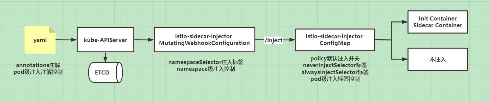
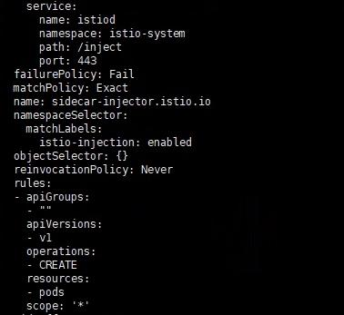
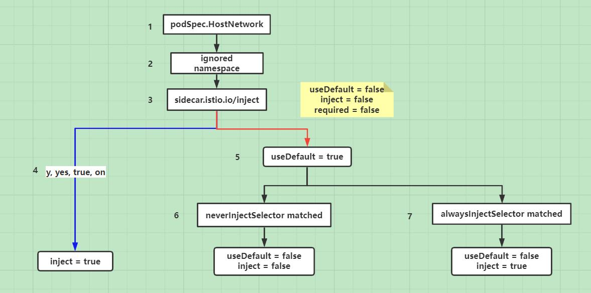
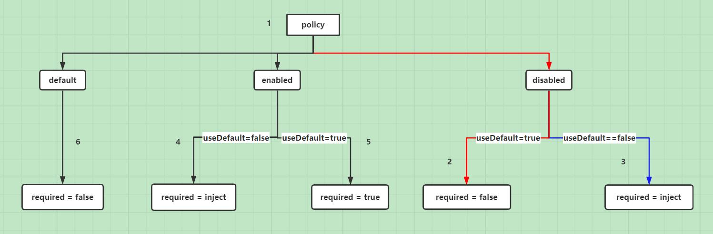
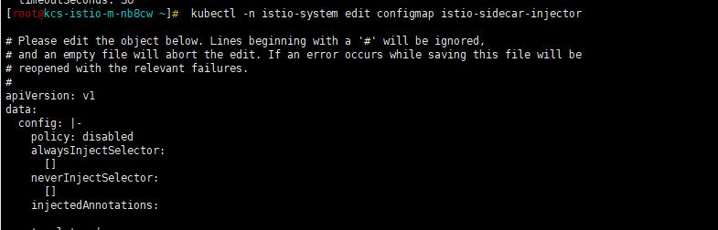
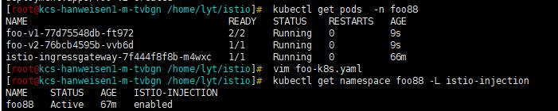

## 背景

我们团队对Istio进行相关研究与探索，并在生产环境进行了相应的应用，初期我们使用Istio主要做产品的灰度发布，同时我们团队也有相关研发人员基于Istio，进行生产环境业务流量管理及可观测性追踪的研究。在做Istio灰度发布的实践中，遇到的第一个问题就是怎么在已经大规模部署产品的Kubernetes集群里，选择性的注入Sidecar。下面详细的介绍下我们遇到的问题以及解决思路，供大家参考。

## 遇到的问题

我们知道如果想把一个服务纳入Istio的网格中，需要在pod中注入Sidecar进行流量的劫持处理，通用的做法就是在namespace上打上istio-injection=enabled标签，这样只要在此namespace下创建或重启pod都会导致pod被注入Sidecar，当然为了不让指定pod注入Sidecar，可以在pod的annotations里加上sidecar.istio.io/inject: "false"。线上产品是以namespace进行隔离的，并且产品namespace下正常运行的pod数较多，这样引入Istio后一个个修改不需要注入Sidecar的pod配置并重启，肯定不是一个好的方案。那么有什么比较好的策略呢？

## 方案调研

Kubernetes提供了自定义资源类型和自定义控制器来扩展功能，还提供了动态准入控制Webhook，其实我理解这个动态准入控制就是一个回调，在Istio的配置里可以看到回调的url路径/inject，Kubernetes通过Webhook来实现准入控制，分为两种：验证性质的准入Webhook(Validating Admission Webhook)和修改性质的准入Webhook(Mutating Admission Webhook)，Istio主要使用的是Mutating Admission Webhook，在资源持久化到ETCD之前进行资源的修改，增加Init Container和Sidecar Container。但是Istio在进行资源修改前，需要满足一些条件，这些条件可以通过配置进行修改。





首先我们看下Istio的mutatingwebhookconfiguration配置





通过配置我们看到，namespaceSelector会去match标签为istio-injection: enabled的namespace，并且根据请求规则，去匹配所有pod的创建 CREATE请求。当apiserver收到一个符合规则的请求时，apiserver会给Webhook服务发送一个通过审核的请求，Istio中的这个Webhook服务是Istiod的service，请求地址为/inject。从代码[/pkg/kube/inject/webhook.go](https://github.com/istio/istio/blob/release-1.8/pkg/kube/inject/webhook.go)，中我们查看Istio是如何处理自动注入的，在Discovery Server中注册了两个用来处理自动注入的请求handler，p.Mux.HandleFunc("/inject", wh.serveInject)、p.Mux.HandleFunc("/inject/", wh.serveInject)，wh.serveInject就是实现自动注入的主要逻辑。在这里我们不详细讲解自动注入的代码逻辑。只讲解下，在满足什么样的条件才会进行自动注入。

通过查看自动注入的代码，我们可以得到如下注入条件的流程图1





1 判断pod的spec中没有设置hostNetwork:true

2 判断待注入的pod不在系统namespace里，如kube-system、kube-public

3 设置三个临时变量，useDefault=false、inject=false、required=false，判断是否配置sidecar.istio.io/inject

4 如果sidecar.istio.io/inject的值设置为y, yes, true, on，则inject=true

5 sidecar.istio.io/inject为其他值，则useDefault=true

6 判断neverInjectSelector是否有匹配到的条件，如果匹配到则设置useDefault = false、inject = false

7 判断alwaysInjectSelector是否有匹配到的条件，如果匹配到则设置useDefault = false、inject = true，alwaysInjectSelector优先级高于neverInjectSelector

经过上述判断，我们得到了useDefault 、inject的结果值，后面我们根据policy的取值以及上述结果值，判断pod是否能够注入Sidecar，继续查看自动注入的流程图2





1 判断policy的取值

2 如果policy取值为disabled，并且上述得到的useDefault=true，则required=false，不进行注入

3 如果policy取值为disabled，并且上述得到的useDefault=false，则需要根据inject的值判断是否需要注入

4 如果policy取值为enabled，并且上述得到的useDefault=false，则需要根据inject的值判断是否需要注入

5 如果policy取值为enabled，并且上述得到的useDefault=true，则required=true，进行注入

6 policy为其他值，不进行注入

在上面的自动注入流程图1、自动注入流程图2中，有几个配置neverInjectSelector、alwaysInjectSelector、policy，这几个值可以根据需求在istio-sidecar-injector configmap进行修改。

## 生产应用

通过上面的分析，可以看到为了最后满足注入条件，需要多种判断条件。结合我们在生产使用中遇到的问题，尽量少修改配置，在这里我们给产品的namespace打上istio-injection=enabled，并且通过kubectl -n istio-system edit configmap istio-sidecar-injector修改policy的值为disable。




因为引入Istio之前启动的pod中没有sidecar.istio.io/inject的值，所以在上面的流程图里会走红色线标志的路径，最后得到required=false，不会注入Sidecar。

如果希望注入Sidecar，则需要在pod里添加sidecar.istio.io/inject=true注解，这样添加完注解的pod会走蓝色线标志的路径，最后required=inject，而inject的值为true，满足注入条件进行Sidecar的注入。

下面演示一下经过上述修改后的实际应用效果，我们给namespace打上标签，并且配置应用的Deployment，我们给foo-v1添加sidecar.istio.io/inject: "true"的注解，作为对比foo-v2不做任何操作，如下

```yaml
apiVersion: apps/v1
kind: Deployment
metadata:
  name: foo-v1
spec:
  template:
    metadata:
      annotations:
        sidecar.istio.io/inject: "true"
      labels:
        app: foo
        version: v1
---
apiVersion: apps/v1
kind: Deployment
metadata:
  name: foo-v2
spec:
  template:
    metadata:
      labels:
        app: foo
        version: v2
```

执行上面的配置后，查询相应的pod如下图





从图中看到，通过正确的配置Istio的Configmap，即使产品所在的namespace打上了istio-injection=enabled标签，引入Istio之前启动的pod也不会因为重启被注入Sidecar，同时又可以选择性的对新服务进行Sidecar的注入，配置的改动量小，应用起来简单方便。

## 总结

通过对Istio自动注入的条件进行探索和研究，我们总结了一套满足共享Kubernetes引入Istio进行服务治理的方法，根据此方法进行生产实施，不会对已有服务造成影响，对新服务可以选择性的自动注入。以上的调研基于Istio 1.8版本，内容可能存在错误或不准确的地方，欢迎大家交流指正。

