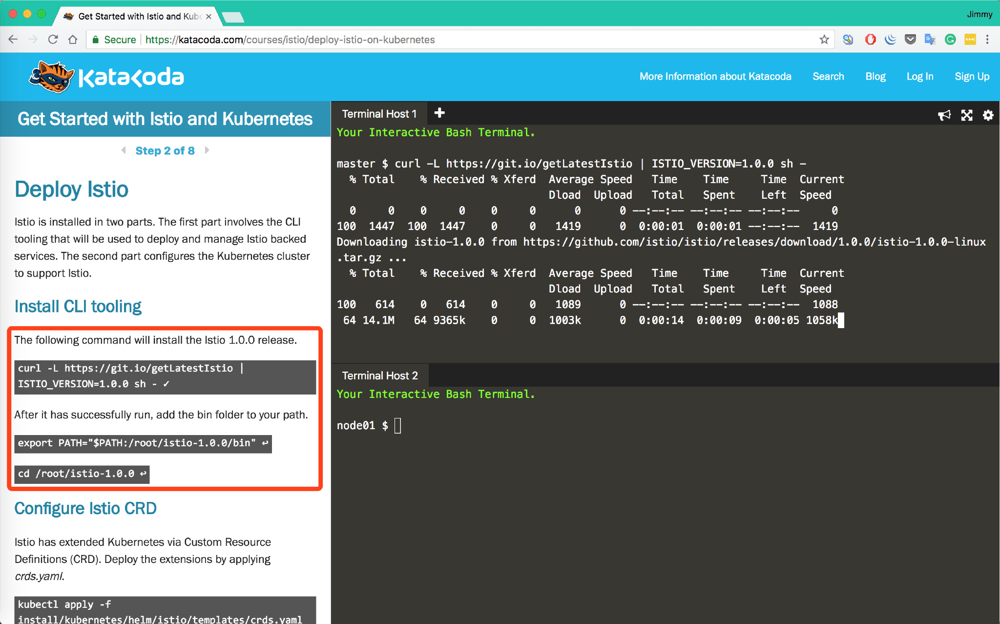
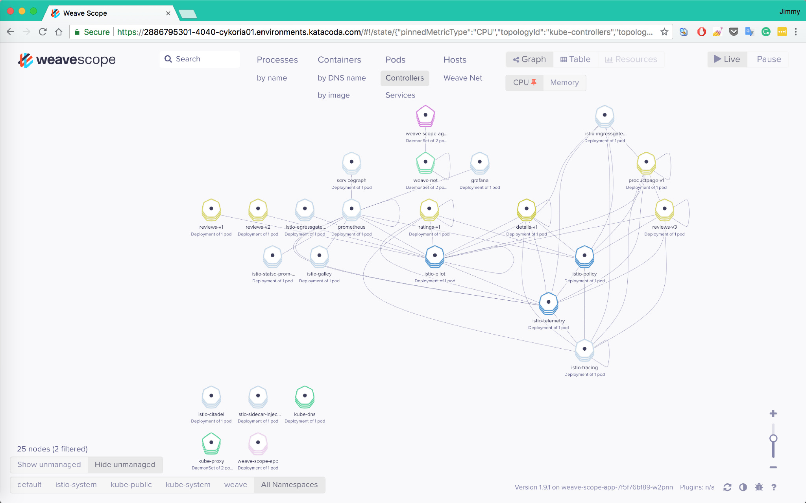
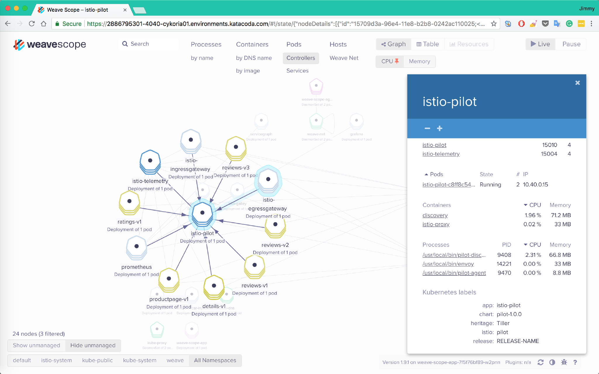
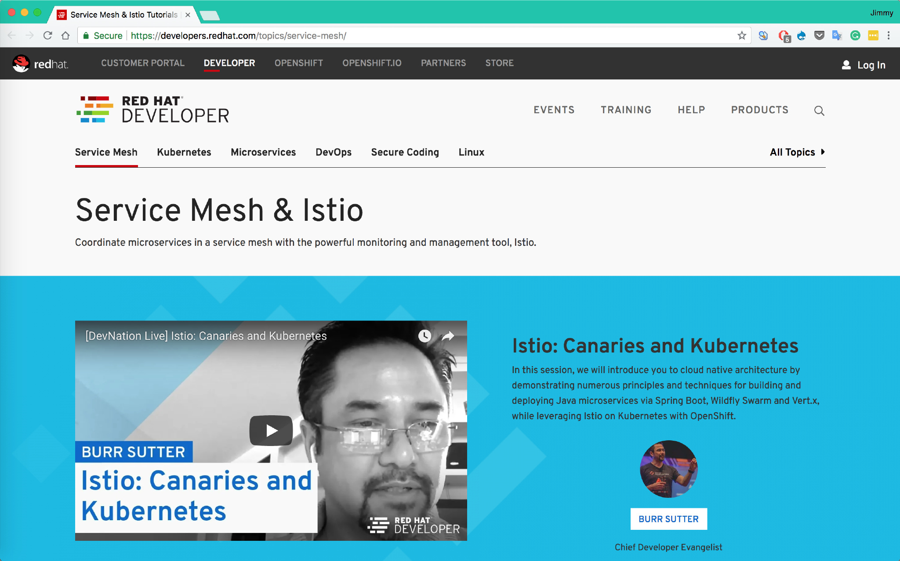
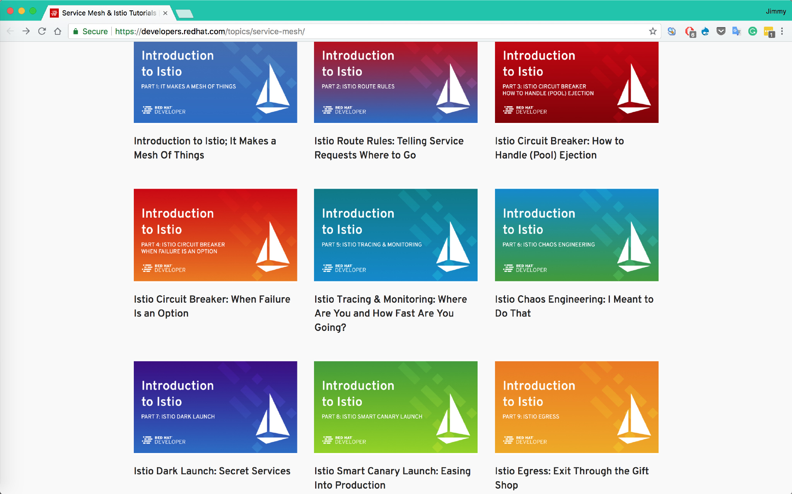
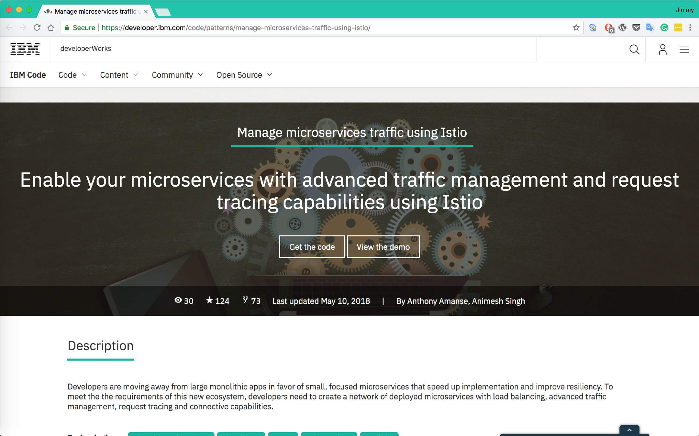
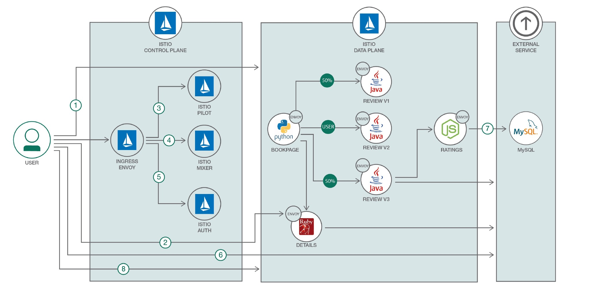
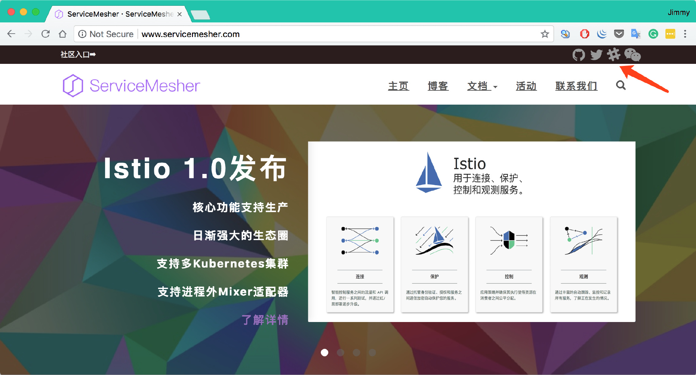

8月1日0点，[Istio 1.0发布，已生产就绪！](/blog/announcing-istio-1.0/)大家都已经跃跃欲试了，几天前我发布了[一键在本地搭建运行Istio 1.0的分布式Kubernetes集群](https://github.com/rootsongjc/kubernetes-vagrant-centos-cluster)教程，在本地搭建起来还是有些门槛，稍显复杂，现在我推荐几个可以在线上学习的地方。这是目前搜集的比较完整的Istio学习环境和包含代码的示例教程有如下几个：

目前搜集的比较完整的Istio学习环境和包含代码的示例教程有如下几个：

- Katacoda的学习环境
- Istio官方的bookinfo教程
- IBM的Istio示例教程
- 我Fork的RedHat的Demo，Christian Posta在OSCON上的Istio workshop

## Katacode上的Istio学习环境

推荐指数：⭑⭑⭑⭑⭑

推荐原因：使用简单，使用官方示例，免费，快速，无需注册，可直接通过互联网访问示例应用页面，支持最新版的Istio。

Katacoda已支持Istio 1.0的学习环境。

地址：https://www.katacoda.com/courses/istio/deploy-istio-on-kubernetes

只要傻瓜式操作就可以部署一个Istio出来，同时还提供了Weave scope可以对service mesh的中的服务关系做可视化呈现。

同时还能提供部分监控功能，比如服务状态，CPU和内存使用情况。

## Red Hat提供的Istio教程

推荐指数：⭑⭑⭑⭑

推荐原因：教程topic划分简洁得当，RedHat大力加持，未来的频繁更新可以预期。

## IBM的Istio示例教程

推荐指数：⭑⭑⭑

推荐原因：IBM作为Istio项目的联合创始公司，在Istio中也有大量的投入，未来可能会有更多的示例放出。

https://developer.ibm.com/code/patterns/manage-microservices-traffic-using-istio

最后更新于2018年5月10号，是基于Istio 0.8的。

GitHub地址：https://github.com/IBM/microservices-traffic-management-using-istio/

## 其他

推荐指数：⭑⭑⭑

推荐原因：个人演示项目，方便定制和修改代码。

- 我个人Fork的RedHat的Java微服务中使用Istio的教程的demo（中文），目前基于Istio 0.8，未来将支持1.0：https://github.com/rootsongjc/istio-tutorial
- Christian Posta在OSCON上的使用的Istio workshop：https://github.com/christian-posta/istio-workshop

------

📣ServiceMesher社区新增Slack和Twitter关注方式，欢迎follow。

网址：<http://www.servicemesher.com/>

Slack：https://servicemesher.slack.com 需要邀请才能加入，有志于加入ServiceMesher社区为Service Mesh作出贡献的同学可以联系我。

Twitter: https://twitter.com/servicemesher
