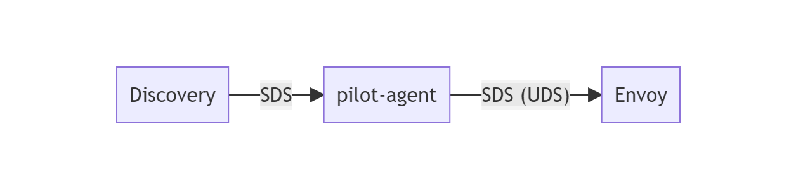
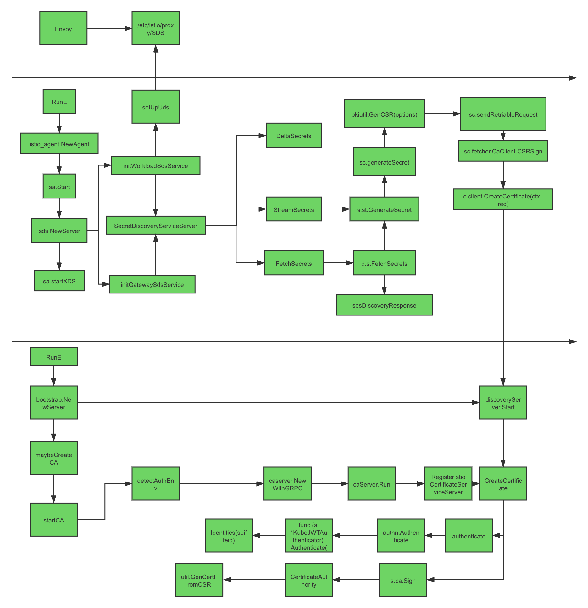

这篇文章是我在公司内部探索与实践私有 CA 与双向 TLS 认证体系时，学习 Istio 安全认证架构的笔记，最初于去年末发表于团队内部，初稿看起来文字空洞乏力，所以我对原文做了较大的调整，补充了更多细节，同时增添了与零信任有关的内容。
本文分析 Istio 安全认证体系与加密通信的源码，让读者对零信任的实践有清晰的认识，这些知识能帮助构建零信任认证与通信体系。

分析过程的代码注释在我的 Github 仓库 [mayocream/istio](https://github.com/mayocream/istio/tree/citadel-review) 的 citadel-review 分支。

## 1. 身份模型

零信任架构下，需要严格区分工作负载的识别和信任，而签发 X.509 证书是推荐的一种认证方式[^1]。在 Kubernetes 集群中，服务间是通过 DNS 名称互相访问的，而网络流量可能被 DNS 欺骗、BGP/路由劫持、ARP 欺骗等手段劫持，为了将服务名称（DNS 名称）与服务身份强关联起来，Istio 使用置于 X.509 证书中的安全命名（Secure naming）机制[^2]。

SPIFFE 是 Istio 所采用的安全命名的规范，它也是云原生定义的一种标准化的、可移植的工作负载身份规范。[^3]

### 1.1. 介绍

[Secure Production Identity Framework For Everyone (SPIFFE)](https://spiffe.io/) 是一套服务之间相互进行身份识别的标准，主要包含以下内容：
  
- SPIFFE ID 标准，SPIFFE ID 是服务的唯一标识，具体实现使用 URI 资源标识符。
- SPIFFE Verifiable Identity Document (SVID) 标准，将 SPIFFE ID 编码到一个加密的可验证的数据格式中。
- 颁发与撤销 SVID 的 API 标准。

SPIFFE ID 规定了形如 `spiffe://<trust domain>/<workload identifier>` 的 URI 格式，作为工作负载（Workload）的唯一标识。SVID 是 SPIFFE ID 的识别凭证，有 X.509 和 JWT 两种格式。

SPIFFE 规范的实现有 spiffe 官方的 [Spire](https://github.com/spiffe/spire) 项目，而 Istio 在自身的生态中只使用到了 SPIFFE ID 作为安全命名，其数据格式由自己实现，通信格式采用 CNCF 支持的 [xDS](https://github.com/cncf/xds) 协议规范（证书认证通信更具体来说是 xDS 的 SDS）。

Istio 使用形如 `spiffe://<trust_domain>/ns/<namespace>/sa/<service_account>` 格式的 SPIFFE ID 作为安全命名，注入到 X.509 证书的 subjectAltName 扩展中。其中“trust domain”参数通过 Istiod 环境变量 `TRUST_DOMAIN` 注入，用于在多集群环境中交互。


### 1.2. 代码实现

SPIFFE 官方提供了 Go SDK [go-spiffe](https://github.com/spiffe/go-spiffe)，提供一种标准的 SPIFFE 协议的客户端实现。
由于 Istio 仅仅使用了 SPIFFE ID，没有必要引入这个 SDK，还值得一提的是该 SDK 引入了 grpc 包，如果你和我一样踩过 grpc 包引用版本冲突的问题，还花费了一下午的时间来解决，这次一定要保持警惕。

Istio 将自己实现的 SPIFFE 相关的代码存放在 pkg 目录下的 spiffe 目录。

#### 数据结构

这里再提一次数据格式是形如 `spiffe://<trust_domain>/ns/<namespace>/sa/<service_account>` 的 URI 字符串。这类身份标识因系统设计不同，定义的格式也各不相同，例如蚂蚁内部使用的身份标识格式是 `spiffe://<domain>/cluster/<cluster>/<required_attr_1_name>/<required_attr_1_value>/<required_attr_2_name>/<required_attr_2_value>`[^4]。
而敝司使用 `spiffe://<site_id>/<cluster_id>/<unique_id>` 格式，怎么样还是简洁点看起来舒服吧。

定义 SPIFFE 的数据结构及其解析方式。

```go
type Identity struct {
    TrustDomain    string
    Namespace      string
    ServiceAccount string
}

func ParseIdentity(s string) (Identity, error) {
    if !strings.HasPrefix(s, URIPrefix) {
        return Identity{}, fmt.Errorf("identity is not a spiffe format: %v", s)
    }
    split := strings.Split(s[URIPrefixLen:], "/")
    ...
    return Identity{
        TrustDomain:    split[0],
        Namespace:      split[2],
        ServiceAccount: split[4],
    }, nil
}

func (i Identity) String() string {
    return URIPrefix + i.TrustDomain + "/ns/" + i.Namespace + "/sa/" + i.ServiceAccount
}
```

信任域（Trust Domain）是由 Istiod 主程序启动时调用 `spiffe.SetTrustDomain(s.environment.Mesh().GetTrustDomain())` 函数方法设置的。


#### TLS 验证


Go 官方的 tls 包提供了 _VerifyPeerCertificate_ 方法，该方法通常会在标准证书校验后（验证服务端 IP 或 DNS 名称以及证书链校验）被调用，提供额外的自定义 Peer 证书验证功能。

由于 SPIFFE ID 属于证书扩展内容，程序需要额外校验 SPIFFE 身份。


```go
// pkg/spiffe/spiffe.go

func (v *PeerCertVerifier) VerifyPeerCert(rawCerts [][]byte, _ [][]*x509.Certificate) error {
    // 下游服务证书
    var peerCert *x509.Certificate
    // CA 证书链
    intCertPool := x509.NewCertPool()
    for id, rawCert := range rawCerts {
        cert, err := x509.ParseCertificate(rawCert)
        if id == 0 {
            // 第一个证书为 Workload 证书
            peerCert = cert
        } else {
            intCertPool.AddCert(cert)
        }
    }
    // ERROR: SAN URIs 没有 SPIFFE ID
    if len(peerCert.URIs) != 1 {
        return fmt.Errorf("peer certificate does not contain 1 URI type SAN, detected %d", len(peerCert.URIs))
    }
    trustDomain, err := GetTrustDomainFromURISAN(peerCert.URIs[0].String())
    if err != nil {
        return err
    }
    // 根证书池
    rootCertPool, ok := v.certPools[trustDomain]
    if !ok {
        return fmt.Errorf("no cert pool found for trust domain %s", trustDomain)
    }

    // 验证证书有效性
    _, err = peerCert.Verify(x509.VerifyOptions{
        Roots:         rootCertPool,
        Intermediates: intCertPool,
    })
    return err
}
```

校验过程会检查 SPIFFE ID 字段是否存在，以及 CA 证书的信任域是否与工作负载的证书处于同一有效的信任域。若校验失败，TLS 握手会以失败告终。

Istiod 在主程序启动时调用 _setPeerCertVerifier_ 方法，设置额外的 mTLS 校验方式，以及添加 CA 证书到 Cert Pool 里：

```go
// setPeerCertVerifier 设置 Istiod 的 SPIFFE 校验方式
func (s *Server) setPeerCertVerifier(tlsOptions TLSOptions) error {
    // 调用上述的 spiffe 包
    s.peerCertVerifier = spiffe.NewPeerCertVerifier()
    var rootCertBytes []byte
    var err error
    // CA 证书
    if tlsOptions.CaCertFile != "" {
        // 传入 CA 证书
        ...
    }

    // 加入 CA 根证书到 SPIFFIE 的信任证书里
    if len(rootCertBytes) != 0 {
        err := s.peerCertVerifier.AddMappingFromPEM(spiffe.GetTrustDomain(), rootCertBytes)
    }
    return nil
}
```

#### 外部 CA

Istio 实现了 [SPIFFE Bundle](https://github.com/spiffe/spiffe/blob/master/standards/SPIFFE_Trust_Domain_and_Bundle.md) 协议，该协议允许访问外部 URI 通过规定的 [JWK（JSON Web Key）](https://datatracker.ietf.org/doc/html/rfc7517)数据格式，获取信任域对应的根证书，而无需将根证书置于程序内部。

Istio 定义的数据格式：

- _<trustdomain, endpoint>_ 元组以 || 分割 
- 每个元组内使用 | 分割 trustdomain 和 endpoint
- 例如：`foo|https://url/for/foo||bar|https://url/for/bar`

下述方式用于获取信任域对应的 X.509 CA 证书链（可以有多层级）。该方法接收 `foo|URL1||bar|URL2` 格式的参数，用 `||` 分隔切片，第一个参数为 trust domain，第二个参数为 CA 服务器 URL。

```go
// RetrieveSpiffeBundleRootCertsFromStringInput 从 SPIFFE bundle 中检索可信的 CA 证书。
// 它可以使用系统证书和提供的证书来进行验证。
// 格式如下：
// "foo|URL1||bar|URL2||baz|URL3..."
func RetrieveSpiffeBundleRootCertsFromStringInput(inputString string, extraTrustedCerts []*x509.Certificate) (
    map[string][]*x509.Certificate, error) {
    spiffeLog.Infof("Processing SPIFFE bundle configuration: %v", inputString)
    config := make(map[string]string)
    tuples := strings.Split(inputString, "||")
    for _, tuple := range tuples {
        items := strings.Split(tuple, "|")
        if len(items) != 2 {
            return nil, fmt.Errorf("config is invalid: %v. Expected <trustdomain>|<url>", tuple)
        }
        trustDomain := items[0]
        endpoint := items[1]
        config[trustDomain] = endpoint
    }
    // 调用 CA 服务器
    return RetrieveSpiffeBundleRootCerts(config, extraTrustedCerts)
}
```

外部服务器返回 JWK 格式的数据：

```go
// pkg/spiffe/spiffe.go

// 返回的 JSON 结构
type bundleDoc struct {
    jose.JSONWebKeySet
    Sequence    uint64 `json:"spiffe_sequence,omitempty"`
    RefreshHint int    `json:"spiffe_refresh_hint,omitempty"`
}

// JSONWebKey represents a public or private key in JWK format.
type JSONWebKey struct {
    // Cryptographic key, can be a symmetric or asymmetric key.
    Key interface{}
    // Key identifier, parsed from `kid` header.
    KeyID string
    // Key algorithm, parsed from `alg` header.
    Algorithm string
    // Key use, parsed from `use` header.
    Use string

    // X.509 certificate chain, parsed from `x5c` header.
    Certificates []*x509.Certificate
    // X.509 certificate URL, parsed from `x5u` header.
    CertificatesURL *url.URL
    // X.509 certificate thumbprint (SHA-1), parsed from `x5t` header.
    CertificateThumbprintSHA1 []byte
    // X.509 certificate thumbprint (SHA-256), parsed from `x5t#S256` header.
    CertificateThumbprintSHA256 []byte
}
```

实际的数据示例如下。

```go
{
    "spiffe_sequence": 1,
    "spiffe_refresh_hint": 450000,
    "keys": [
        {
        "kty": "RSA",
        "use": "x509-svid",
        "n": "<证书签名>",
        "e": "AQAB",
        "x5c": ["<X.509 证书>"]
        }
    ]
}
```

## 2. 私有 PKI

Istio 内部有一套内置的 PKI 证书基础设施。零信任架构中，PKI 是零信任模型身份认证的基石，大多数零信任网络都采用 PKI 来证明身份的真实性。零信任网络颁发的证书数量可能会很多，因此非常有必要对证书进行自动化管理。[^5]

### 2.1. Istiod 配置

Istiod 默认启用内置的 CA 服务器。

```go
// pilot/pkg/features/pilot.go

EnableCAServer = env.RegisterBoolVar("ENABLE_CA_SERVER", true,
        "If this is set to false, will not create CA server in istiod.").Get()
```

证书签名的默认配置项：

```go
// pilot/pkg/bootstrap/istio_ca.go

// 兼容挂载名为 cacerts 的 secret
// 但已经不使用

// 使用 "istio-ca-secret" 来创建证书
// 兼容旧版本

var (
    // 挂载名为 cacerts 的 secret 的目录，Read-only
    LocalCertDir = env.RegisterStringVar("ROOT_CA_DIR", "./etc/cacerts",
        "Location of a local or mounted CA root")
    
    // 默认服务证书 TTL
    workloadCertTTL = env.RegisterDurationVar("DEFAULT_WORKLOAD_CERT_TTL",
        cmd.DefaultWorkloadCertTTL,
        "The default TTL of issued workload certificates. Applied when the client sets a "+
            "non-positive TTL in the CSR.")

    maxWorkloadCertTTL = env.RegisterDurationVar("MAX_WORKLOAD_CERT_TTL",
        cmd.DefaultMaxWorkloadCertTTL,
        "The max TTL of issued workload certificates.")

    // 自签名 CA 证书 TTL
    SelfSignedCACertTTL = env.RegisterDurationVar("CITADEL_SELF_SIGNED_CA_CERT_TTL",
        cmd.DefaultSelfSignedCACertTTL,
        "The TTL of self-signed CA root certificate.")
```

Istio 主程序会挂载两个 Secert，一个是 _cacerts_ Secret，用于指定 Istio 启动时用户定义的 CA 证书，另一个是 _istio-ca-secret_ Secret，用于储存 Istio Pilot Discovery 程序自签名的 CA 证书及其私钥。

```go
    // CA 证书不应该在 Workload 证书失效之前就失效
    // 所以此处设置证书的生命周期为证书链中的最短的时效期
    defaultCertTTL, err := ca.minTTL(opts.DefaultCertTTL)
    if err != nil {
        return ca, fmt.Errorf("failed to get default cert TTL %s", err.Error())
    }
    ca.defaultCertTTL = defaultCertTTL
```

CA 证书不应该在 Workload 证书失效之前就失效，所以此处设置 Workload 证书的生命周期为 CA 证书链中的最短的时效期。

Istio CA 实际挂载的 _istio-ca-secret_ Secret 数据示例：

```yaml
kind: Secret
apiVersion: v1
metadata:
  name: istio-ca-secret
  namespace: istio-system
data:
  ca-cert.pem: >-
LS0tLS1CRUdJTiBDRVJUSUZJQ0FURS0tLS0tCk1JSUMvRENDQWVTZ0F3SUJBZ0lRQWVMc3E2ZDVFN0ZheVY2U...
  ca-key.pem: >-LS0tLS1CRUdJTiBSU0EgUFJJVkFURSBLRVktLS0tLQpNSUlFb3dJQkFBS0NBUUVBd2JpOWtucHVPS1d6SUxkM...
  cert-chain.pem: ''
  key.pem: ''
  root-cert.pem: ''
type: istio.io/ca-root

```

### 2.2. 初始化

#### 2.2.1. 入口流程

```go
// pilot/pkg/bootstrap/server.go

// maybeCreateCA creates and initializes CA Key if needed.
func (s *Server) maybeCreateCA(caOpts *caOptions) error {
    // 默认启用
    if s.EnableCA() {
        log.Info("creating CA and initializing public key")
        var err error
        var corev1 v1.CoreV1Interface
        if s.kubeClient != nil {
            corev1 = s.kubeClient.CoreV1()
        }
        // 从远程 K8S 集群获取证书，默认不启用
        if useRemoteCerts.Get() {
            if err = s.loadRemoteCACerts(caOpts, LocalCertDir.Get()); err != nil {
                return fmt.Errorf("failed to load remote CA certs: %v", err)
            }
        }

        // TODO: Issue #27606 If External CA is configured, use that to sign DNS Certs as well. IstioCA need not be initialized
        if s.CA, err = s.createIstioCA(corev1, caOpts); err != nil {
            return fmt.Errorf("failed to create CA: %v", err)
        }
        if err = s.initPublicKey(); err != nil {
            return fmt.Errorf("error initializing public key: %v", err)
        }
    }
    return nil
}
```

`s.createIstioCA` 里面详细进行 CA 初始化的操作。

```go
// pilot/pkg/bootstrap/istio_ca.go

// createIstioCA initializes the Istio CA signing functionality.
func (s *Server) createIstioCA(client corev1.CoreV1Interface, opts *caOptions) (*ca.IstioCA, error) {
    var caOpts *ca.IstioCAOptions
    var err error

    // In pods, this is the optional 'cacerts' Secret.
    // TODO: also check for key.pem ( for interop )
    signingKeyFile := path.Join(LocalCertDir.Get(), "ca-key.pem")

    // If not found, will default to ca-cert.pem. May contain multiple roots.
    rootCertFile := path.Join(LocalCertDir.Get(), "root-cert.pem")
    if _, err := os.Stat(rootCertFile); err != nil {
        // 兼容 Istio 获取 Root cert 证书
        // In Citadel, normal self-signed doesn't use a root-cert.pem file for additional roots.
        // In Istiod, it is possible to provide one via "cacerts" secret in both cases, for consistency.
        rootCertFile = ""
    }
    if _, err := os.Stat(signingKeyFile); err != nil && client != nil {
        // 在 K8S 集群中创建自签名证书
        // The user-provided certs are missing - create a self-signed cert.
        log.Info("Use self-signed certificate as the CA certificate")
        // Abort after 20 minutes.
        ctx, cancel := context.WithTimeout(context.Background(), time.Minute*20)
        defer cancel()
        // 获取证书操作符
        // rootCertFile will be added to "ca-cert.pem".
        // readSigningCertOnly set to false - it doesn't seem to be used in Citadel, nor do we have a way
        // to set it only for one job.
        caOpts, err = ca.NewSelfSignedIstioCAOptions(ctx,
            selfSignedRootCertGracePeriodPercentile.Get(), SelfSignedCACertTTL.Get(),
            selfSignedRootCertCheckInterval.Get(), workloadCertTTL.Get(),
            maxWorkloadCertTTL.Get(), opts.TrustDomain, true,
            opts.Namespace, -1, client, rootCertFile,
            enableJitterForRootCertRotator.Get(), caRSAKeySize.Get())
        if err != nil {
            return nil, fmt.Errorf("failed to create a self-signed istiod CA: %v", err)
        }
    } else {
        ...
    }
    istioCA, err := ca.NewIstioCA(caOpts)
    if err != nil {
        return nil, fmt.Errorf("failed to create an istiod CA: %v", err)
    }
    istioCA.Run(rootCertRotatorChan)
    return istioCA, nil
}
```

数据操作流程：

1. 首先读取 Kubernetes 中“cacerts”的 secret 挂载的本地目录。

2. 若不存在则通过 go-client 获取 K8S 中 "istio-ca-cert" 的 secret，该 secret 包含 CA 的私钥及证书。

3. K8s 中没有 CA 证书，则开始自签名证书流程。

#### 2.2.2. 自签名 CA 证书

签发与获取证书相关参数配置对照表如下：

| 参数                                   | 默认值                | 备注                                                         |
| -------------------------------------- | --------------------- | ------------------------------------------------------------ |
| DefaultSelfSignedCACertTTL             | 3650 * 24 * time.Hour | 自签名 Root 证书默认的 TTL              |
| DefaultSelfSignedRootCertCheckInterval | 1 * time.Hour         | 自签名证书定期检查证书有效期或进行证书轮换检查的默认间隔时间 |
| DefaultRootCertGracePeriodPercentile   | 20                    | 根证书平滑轮换证书的有效时长百分比，相对于证书的有效周期（TTL） |
| ReadSigningCertRetryInterval           | time.Second * 5       | 读取证书与私钥失败的重试间隔时间 |
| ReadSigningCertRetryMax                | time.Second * 30      | 读取证书与私钥失败的最大重试次数 |
| DefaultMaxWorkloadCertTTL              | 90 * 24 * time.Hour   | 签发工作负载证书的默认最长的 TTL             |
| DefaultWorkloadCertTTL                 | 24 * time.Hour        | 签发工作负载证书的默认的 TTL                 |

Istio 是具体是如何使用 Go 官方包自签名一个 CA 证书的？
主要流程为：

1. 创建 RSA 私钥（Istio 还不支持 ECDSA 私钥）
2. 构建 CSR（Certificate signing request）模板
3. 填充 SPIFFE ID 到 CSR 的扩展字段（ASN.1）
4. 自签名 CSR 生成证书
5. 创建 Kubernetes Secret 资源储存 CA 证书和私钥

```go
// security/pkg/pki/ca/ca.go

// K8S 集群内自签名证书
func NewSelfSignedIstioCAOptions(ctx context.Context,
    rootCertGracePeriodPercentile int, caCertTTL, rootCertCheckInverval, defaultCertTTL,
    maxCertTTL time.Duration, org string, dualUse bool, namespace string,
    readCertRetryInterval time.Duration, client corev1.CoreV1Interface,
    rootCertFile string, enableJitter bool, caRSAKeySize int) (caOpts *IstioCAOptions, err error) {
    // 如果证书不存在则创建证书
    // 后续读取 secret 获取
    // 获取 K8S istio-ca-secret secret 资源
    caSecret, scrtErr := client.Secrets(namespace).Get(context.TODO(), CASecret, metav1.GetOptions{})
    // 获取 secret 失败，尝试多次重新获取
    // 若超时仍然获取不到，则创建自签名证书
    if scrtErr != nil && readCertRetryInterval > time.Duration(0) {
        pkiCaLog.Infof("Citadel in signing key/cert read only mode. Wait until secret %s:%s can be loaded...", namespace, CASecret)
        ticker := time.NewTicker(readCertRetryInterval)
        for scrtErr != nil {
            select {
            case <-ticker.C:
                if caSecret, scrtErr = client.Secrets(namespace).Get(context.TODO(), CASecret, metav1.GetOptions{}); scrtErr == nil {
                    pkiCaLog.Infof("Citadel successfully loaded the secret.")
                }
            }
        }
    }

    caOpts = &IstioCAOptions{
        CAType:         selfSignedCA, // 1 自签名证书 2 用户自定义证书
        DefaultCertTTL: defaultCertTTL,
        MaxCertTTL:     maxCertTTL,
        // CA 轮转检查
        RotatorConfig: &SelfSignedCARootCertRotatorConfig{
            CheckInterval:      rootCertCheckInverval,
            caCertTTL:          caCertTTL,
            retryInterval:      cmd.ReadSigningCertRetryInterval, // 默认 5 秒
            retryMax:           cmd.ReadSigningCertRetryMax, // 默认 30 秒
            certInspector:      certutil.NewCertUtil(rootCertGracePeriodPercentile),
            caStorageNamespace: namespace,
            dualUse:            dualUse, // 默认 true
            org:                org,
            rootCertFile:       rootCertFile,
            enableJitter:       enableJitter,
            client:             client,
        },
    }
    // 获取不到 secret，自签名创建
    if scrtErr != nil {
        pkiCaLog.Infof("Failed to get secret (error: %s), will create one", scrtErr)

        options := util.CertOptions{
            TTL:          caCertTTL,
            Org:          org,
            IsCA:         true, // 证书标识为 CA
            IsSelfSigned: true,
            RSAKeySize:   caRSAKeySize,
            // Whether this certificate is for dual-use clients (SAN+CN).
            IsDualUse:    dualUse, // 这个选项其实没有用到
        }
        pemCert, pemKey, ckErr := util.GenCertKeyFromOptions(options)
        if ckErr != nil {
            return nil, fmt.Errorf("unable to generate CA cert and key for self-signed CA (%v)", ckErr)
        }

        // 获取 RootCertFile 加入根证书链
        rootCerts, err := util.AppendRootCerts(pemCert, rootCertFile)
        if err != nil {
            return nil, fmt.Errorf("failed to append root certificates (%v)", err)
        }

        // 构建储存证书链的并发安全的数据结构体
        if caOpts.KeyCertBundle, err = util.NewVerifiedKeyCertBundleFromPem(pemCert, pemKey, nil, rootCerts); err != nil {
            return nil, fmt.Errorf("failed to create CA KeyCertBundle (%v)", err)
        }

        // 在 K8S 中创建 secret 储存证书
        // Write the key/cert back to secret so they will be persistent when CA restarts.
        secret := k8ssecret.BuildSecret("", CASecret, namespace, nil, nil, nil, pemCert, pemKey, istioCASecretType)
        if _, err = client.Secrets(namespace).Create(context.TODO(), secret, metav1.CreateOptions{}); err != nil {
            ...
        }
    } else {
        ...
        // 从本地读取 CA 证书
    }
    // 返回证书操作符
    return caOpts, nil
}
```

默认使用 RSA 2048 size 生成私钥：

```go
// security/pkg/pki/util/generate_cert.go

// GenCertKeyFromOptions generates a X.509 certificate and a private key with the given options.
func GenCertKeyFromOptions(options CertOptions) (pemCert []byte, pemKey []byte, err error) {
    // 默认忽略，使用 RSA 算法
    if options.ECSigAlg != "" {
        ...
    }

    // 生成 RSA 密钥
    rsaPriv, err := rsa.GenerateKey(rand.Reader, options.RSAKeySize)
    // 生成证书
    return genCert(options, rsaPriv, &rsaPriv.PublicKey)
}
```

创建一个证书模板，随后会从模板创建 CSR：

```go
// security/pkg/pki/util/generate_cert.go

// genCertTemplateFromoptions generates a certificate template with the given options.
func genCertTemplateFromOptions(options CertOptions) (*x509.Certificate, error) {
    var keyUsage x509.KeyUsage
    if options.IsCA {
        // If the cert is a CA cert, the private key is allowed to sign other certificates.
        keyUsage = x509.KeyUsageCertSign
    } else {
        // Otherwise the private key is allowed for digital signature and key encipherment.
        keyUsage = x509.KeyUsageDigitalSignature | x509.KeyUsageKeyEncipherment
    }

    subject := pkix.Name{
        Organization: []string{options.Org},
    }

    // 填充扩展字段
    exts := []pkix.Extension{}
    if h := options.Host; len(h) > 0 {
        // 生成 SAN
        s, err := BuildSubjectAltNameExtension(h)
        if err != nil {
            return nil, err
        }
        if options.IsDualUse {
            // 获取 common name
            cn, err := DualUseCommonName(h)
            if err != nil {
                ...
            } else {
                subject.CommonName = cn
            }
        }
        exts = []pkix.Extension{*s}
    }

    return &x509.Certificate{
        SerialNumber:          serialNum,
        Subject:               subject,
        NotBefore:             notBefore,
        NotAfter:              notBefore.Add(options.TTL),
        KeyUsage:              keyUsage,
        ExtKeyUsage:           extKeyUsages,
        IsCA:                  options.IsCA,
        BasicConstraintsValid: true,
        ExtraExtensions:       exts}, nil
}
```

注入 SPIFFE 工作负载身份标识：

```go
// security/pkg/pki/util/san.go

// BuildSubjectAltNameExtension builds the SAN extension for the certificate.
func BuildSubjectAltNameExtension(hosts string) (*pkix.Extension, error) {
    ids := []Identity{}
    for _, host := range strings.Split(hosts, ",") {
        if ip := net.ParseIP(host); ip != nil {
            // Use the 4-byte representation of the IP address when possible.
            if eip := ip.To4(); eip != nil {
                ip = eip
            }
            ids = append(ids, Identity{Type: TypeIP, Value: ip})
        } else if strings.HasPrefix(host, spiffe.URIPrefix) {
            ids = append(ids, Identity{Type: TypeURI, Value: []byte(host)})
        } else {
            ids = append(ids, Identity{Type: TypeDNS, Value: []byte(host)})
        }
    }

    san, err := BuildSANExtension(ids)
    if err != nil {
        return nil, fmt.Errorf("SAN extension building failure (%v)", err)
    }

    return san, nil
}

// BuildSANExtension builds a `pkix.Extension` of type "Subject
// Alternative Name" based on the given identities.
func BuildSANExtension(identites []Identity) (*pkix.Extension, error) {
    ...
    // 如果 subject 的信息仅存在于 subjectAltName 扩展中(仅于Email地址或URI相关)
    // 则 subject name 必须为非空结构且 subjectAltName 扩展必须为 critical。
    // SAN is Critical because the subject is empty. This is compliant with X.509 and SPIFFE standards.
    return &pkix.Extension{Id: oidSubjectAlternativeName, Critical: true, Value: bs}, nil
}
```

SPIFFE ID 储存在 X.509 证书的 SAN URI 字段中。

#### 2.2.3. 储存证书

Istiod 的 CA 证书同时也会储存到本地一份。

```go
// Save the root public key file and initialize the path the the file, to be used by other components.
func (s *Server) initPublicKey() error {
    // Setup the root cert chain and caBundlePath - before calling initDNSListener.
    if features.PilotCertProvider.Get() == IstiodCAProvider {
        signingKeyFile := path.Join(LocalCertDir.Get(), "ca-key.pem")
        if _, err := os.Stat(signingKeyFile); err != nil {
            // When Citadel is configured to use self-signed certs, keep a local copy so other
            // components can load it via file (e.g. webhook config controller).
            if err := os.MkdirAll(dnsCertDir, 0700); err != nil {
                return err
            }
            // We have direct access to the self-signed
            internalSelfSignedRootPath := path.Join(dnsCertDir, "self-signed-root.pem")

            rootCert := s.CA.GetCAKeyCertBundle().GetRootCertPem()
            if err = ioutil.WriteFile(internalSelfSignedRootPath, rootCert, 0600); err != nil {
                return err
            }
            ...
            s.caBundlePath = internalSelfSignedRootPath
        }
    }
    return nil
}
```

储存到本地目的是为了让各个独立的组件（虽然合并到 Istiod 程序中）都读取到 CA 证书。
同时还会监听文件系统的变化，及时替换证书。

```go
// initCertificateWatches sets up  watches for the certs.
func (s *Server) initCertificateWatches(tlsOptions TLSOptions) error {
    // load the cert/key and setup a persistent watch for updates.
    ...
}
```

### 2.3. CA 证书轮换

CA 证书轮换的代码位于 `security/pkg/pki/ca/selfsignedcarootcertrotator.go` 文件中。

该模块定期检查 CA 证书有效性，比对 Kubernetes 的 Secret 资源中的 CA 证书与内存中储存的 CA 证书是否一致。
若证书即将过期，则使用私钥重新签名，以颁发新的可用的 CA 证书。

```go
// NewSelfSignedCARootCertRotator returns a new root cert rotator instance that
// rotates self-signed root cert periodically.
func NewSelfSignedCARootCertRotator(config *SelfSignedCARootCertRotatorConfig,
    ca *IstioCA) *SelfSignedCARootCertRotator {
    rotator := &SelfSignedCARootCertRotator{
        caSecretController: controller.NewCaSecretController(config.client),
        config:             config,
        ca:                 ca,
    }
    ...
    return rotator
}
```

该证书轮换器带有指数退避算法，以更优雅地定期错误重试。

```go
// Run refreshes root certs and updates config map accordingly.
func (rotator *SelfSignedCARootCertRotator) Run(stopCh chan struct{}) {
    ...
    ticker := time.NewTicker(rotator.config.CheckInterval)
    for {
        select {
        case <-ticker.C:
            rootCertRotatorLog.Info("Check and rotate root cert.")
            rotator.checkAndRotateRootCert()
        }
    }
}
```

`checkAndRotateRootCert` 函数定时被执行，以确认证书的有效性指标。
_Citadel_ 是 Istio 中专门负责认证相关的组件，虽然合并到 Istiod 中，
在代码中它还是被单独归类。

```go
// checkAndRotateRootCert decides whether root cert should be refreshed, and rotates
// root cert for self-signed Citadel.
func (rotator *SelfSignedCARootCertRotator) checkAndRotateRootCert() {
    // 带失败重试获取 CA 证书的 K8s secret
    caSecret, scrtErr := rotator.caSecretController.LoadCASecretWithRetry(CASecret,
        rotator.config.caStorageNamespace, rotator.config.retryInterval, rotator.config.retryMax)

    if scrtErr != nil {
        ...
    } else {
        rotator.checkAndRotateRootCertForSigningCertCitadel(caSecret)
    }
}

// checkAndRotateRootCertForSigningCertCitadel checks root cert secret and rotates
// root cert if the current one is about to expire. The rotation uses existing
// root private key to generate a new root cert, and updates root cert secret.
func (rotator *SelfSignedCARootCertRotator) checkAndRotateRootCertForSigningCertCitadel(
    caSecret *v1.Secret) {
    // Check root certificate expiration time in CA secret
    waitTime, err := rotator.config.certInspector.GetWaitTime(caSecret.Data[caCertID], time.Now(), time.Duration(0))
    if err == nil && waitTime > 0 {
        rootCertRotatorLog.Info("Root cert is not about to expire, skipping root cert rotation.")
        caCertInMem, _, _, _ := rotator.ca.GetCAKeyCertBundle().GetAllPem()
        // 比较内存中的证书与 K8S 中的证书是否一致
        // If CA certificate is different from the CA certificate in local key
        // cert bundle, it implies that other Citadels have updated istio-ca-secret.
        // Reload root certificate into key cert bundle.
        if !bytes.Equal(caCertInMem, caSecret.Data[caCertID]) {
            // 校验证书并将证书加载到内存中缓存
            if err := rotator.ca.GetCAKeyCertBundle().VerifyAndSetAll(caSecret.Data[caCertID],
                caSecret.Data[caPrivateKeyID], nil, rootCerts); err != nil {
                rootCertRotatorLog.Errorf("failed to reload root cert into KeyCertBundle (%v)", err)
            } else {
                rootCertRotatorLog.Info("Successfully reloaded root cert into KeyCertBundle.")
            }
        }
        return
    }

    rootCertRotatorLog.Infof("Refresh root certificate, root cert is about to expire: %s", err.Error())


    options := util.CertOptions{
        TTL:           rotator.config.caCertTTL,
        SignerPrivPem: caSecret.Data[caPrivateKeyID],
        Org:           rotator.config.org,
        IsCA:          true,
        IsSelfSigned:  true,
        RSAKeySize:    rotator.ca.caRSAKeySize,
        IsDualUse:     rotator.config.dualUse,
    }
    // options should be consistent with the one used in NewSelfSignedIstioCAOptions().
    // This is to make sure when rotate the root cert, we don't make unnecessary changes
    // to the certificate or add extra fields to the certificate.
    options = util.MergeCertOptions(options, oldCertOptions)
    // 重新签发证书
    pemCert, pemKey, ckErr := util.GenRootCertFromExistingKey(options)
    if ckErr != nil {
        rootCertRotatorLog.Errorf("unable to generate CA cert and key for self-signed CA: %s", ckErr.Error())
        return
    }

    ...
    // 在 K8S 及内存中更新证书
    if rollback, err := rotator.updateRootCertificate(caSecret, true, pemCert, pemKey, pemRootCerts); err != nil {
        ...
        // caSecret is out-of-date. Need to load the latest istio-ca-secret to roll back root certificate.
        _, err = rotator.updateRootCertificate(nil, false, oldCaCert, oldCaPrivateKey, oldRootCerts)
        if err != nil {
            rootCertRotatorLog.Errorf("Failed to roll backward root certificate (error: %s).", err.Error())
        }
        return
    }
    rootCertRotatorLog.Info("Root certificate rotation is completed successfully.")
}
```

同时证书更新替换时也有失败回滚机制，CA 证书轮换后 Istio 会更新 Kubernetes 中 Secret 资源，以及内存中缓存的证书资源。
这类证书轮换函数，运行在独立的协程中。

```go
func (ca *IstioCA) Run(stopChan chan struct{}) {
    if ca.rootCertRotator != nil {
        // Start root cert rotator in a separate goroutine.
        go ca.rootCertRotator.Run(stopChan)
    }
}
```

### 2.4. 签发 Workload 证书

以上部分是 Istio 如何签发 CA 与轮换 CA 证书，因为证书都是在同一个进程中签发与替换，不涉及额外的网络操作，
相对流程比较清晰。Workload 证书签发是由独立运行的工作负载的 Pod 中的 Agent 进程向 Kubernetes 进行认证后，
发送 CSR 请求给 Istio CA 服务器进行签名的。它还拥有一套特殊的通信协议。

#### 2.4.1. 启动 CA 服务器

Istiod 启动 CA 服务器，响应工作负载签发符合自身权限身份的 CSR 请求。

```go
// StartCA starts the CA or RA server if configured.
func (s *Server) startCA(caOpts *caOptions) {
   s.addStartFunc(func(stop <-chan struct{}) error {
      grpcServer := s.secureGrpcServer
      if s.secureGrpcServer == nil {
         grpcServer = s.grpcServer
      }
      // Start the RA server if configured, else start the CA server
      if s.RA != nil {
        ...
      } else if s.CA != nil {
         log.Infof("Starting IstioD CA")
         s.RunCA(grpcServer, s.CA, caOpts)
      }
      return nil
   })
}
```

CA 服务器的接口注册在 grpc 服务器上，注意这里开启了 TLS，通信协议是 grpcs。

```go
// 在 GRPCS 服务器上开启 CA
// RunCA will start the cert signing GRPC service on an existing server.
// Protected by installer options: the CA will be started only if the JWT token in /var/run/secrets
// is mounted. If it is missing - for example old versions of K8S that don't support such tokens -
// we will not start the cert-signing server, since pods will have no way to authenticate.
func (s *Server) RunCA(grpc *grpc.Server, ca caserver.CertificateAuthority, opts *caOptions) {
    iss := trustedIssuer.Get() // 默认为空
    aud := audience.Get() // 默认为空

    // 填充 iss 和 aud
    // 默认获取 K8S SA Token
    // "/var/run/secrets/kubernetes.io/serviceaccount/token"
    token, err := ioutil.ReadFile(s.jwtPath)
    if err == nil {
        // 获取 JWT Payload
        tok, err := detectAuthEnv(string(token))
        if err != nil {
            log.Warn("Starting with invalid K8S JWT token", err, string(token))
        } else {
            if iss == "" {
                iss = tok.Iss
            }
            if len(tok.Aud) > 0 && len(aud) == 0 {
                aud = tok.Aud[0]
            }
        }
    }

    // The CA API uses cert with the max workload cert TTL.
    // 'hostlist' must be non-empty - but is not used since a grpc server is passed.
    // Adds client cert auth and kube (sds enabled)
    // 创建给 Workload 颁发证书的 CA
    caServer, startErr := caserver.New(ca, maxWorkloadCertTTL.Get(), opts.Authenticators)
    if startErr != nil {
        log.Fatalf("failed to create istio ca server: %v", startErr)
    }

    // 注册 GRPC PB
    caServer.Register(grpc)

    log.Info("Istiod CA has started")
}
```

Kubernetes Serivce Account Token 包含的 Payload 数据示例：

```json
{
  "iss": "kubernetes/serviceaccount",
  "kubernetes.io/serviceaccount/namespace": "istio-system",
  "kubernetes.io/serviceaccount/secret.name": "istio-reader-service-account-token-zmks5",
  "kubernetes.io/serviceaccount/service-account.name": "istio-reader-service-account",
  "kubernetes.io/serviceaccount/service-account.uid": "9a544d83-ed88-474f-967c-27473357ee95",
  "sub": "system:serviceaccount:istio-system:istio-reader-service-account"
}
```

默认配置中，签发给 Workload 的证书的有效期是 90 天。

```go
// security/pkg/server/ca/server.go
// Register registers a GRPC server on the specified port.
func (s *Server) Register(grpcServer *grpc.Server) {
    pb.RegisterIstioCertificateServiceServer(grpcServer, s)
}

// istio.io\api@v0.0.0-20201125194658-3cee6a1d3ab4\security\v1alpha1\ca.pb.go
// IstioCertificateServiceServer is the server API for IstioCertificateService service.
type IstioCertificateServiceServer interface {
    // Using provided CSR, returns a signed certificate.
    CreateCertificate(context.Context, *IstioCertificateRequest) (*IstioCertificateResponse, error)
}
```

CA 服务器的 grpc 接口只有一个 `CreateCertificate` 方法，调用该方法处理 CSR 请求。

#### 2.4.2. 签发证书

通过 grpcs 协议接收到 CSR 请求时，首先会进行认证：

Istio 支持多种方式进行认证，例如客户端证书、K8s JWT、ID Token 等，Istio 认证方法中会尝试从多个认证源进行认证，
选择出能够验证客户端身份的一种方式，当然认证失败就失败了。

```go
// authenticate goes through a list of authenticators (provided client cert, k8s jwt, and ID token)
// and authenticates if one of them is valid.
func (s *Server) authenticate(ctx context.Context) *authenticate.Caller {
    // TODO: apply different authenticators in specific order / according to configuration.
    var errMsg string
    for id, authn := range s.Authenticators {
        u, err := authn.Authenticate(ctx)
        ...
    }
    serverCaLog.Warnf("Authentication failed for %v: %s", getConnectionAddress(ctx), errMsg)
    return nil
}
```

具体处理 CSR 创建证书的接口逻辑：

```go
// CreateCertificate handles an incoming certificate signing request (CSR). It does
// authentication and authorization. Upon validated, signs a certificate that:
// the SAN is the identity of the caller in authentication result.
// the subject public key is the public key in the CSR.
// the validity duration is the ValidityDuration in request, or default value if the given duration is invalid.
// it is signed by the CA signing key.
func (s *Server) CreateCertificate(ctx context.Context, request *pb.IstioCertificateRequest) (
    *pb.IstioCertificateResponse, error) {
    // metrics
    s.monitoring.CSR.Increment()
    // 从 GRPC CTX 获取 TLS Info 里面的 SPIFFE ID
    caller := s.authenticate(ctx)
    if caller == nil {
        // 缺少 TLS Info 的客户端证书的 SAN URI 字段
        s.monitoring.AuthnError.Increment()
        return nil, status.Error(codes.Unauthenticated, "request authenticate failure")
    }

    // TODO: Call authorizer.

    _, _, certChainBytes, rootCertBytes := s.ca.GetCAKeyCertBundle().GetAll()
    // 签发证书
    cert, signErr := s.ca.Sign(
        []byte(request.Csr), caller.Identities, time.Duration(request.ValidityDuration)*time.Second, false)
    
    respCertChain := []string{string(cert)}
    if len(certChainBytes) != 0 {
        // 加入证书链
        respCertChain = append(respCertChain, string(certChainBytes))
    }
    respCertChain = append(respCertChain, string(rootCertBytes))
    response := &pb.IstioCertificateResponse{
        CertChain: respCertChain,
    }
    s.monitoring.Success.Increment()
    serverCaLog.Debug("CSR successfully signed.")
    return response, nil
}
```

### 2.5. RA（注册机构）

> Istio 带有现成的证书颁发机构（CA），但不少用户也希望能够接入现有 CA。
> 在之前的版本中，您需要实现 Istio CSR  API 并自行编写第三方集成。
> 在 Istio 1.8 中，我们引入了一种使用 Kubernetes CSR  API 的新方法，此方法可与任何能够使用此API的工具相集成。
> Istiod 将充当注册机构（RA）角色，负责对工作负载进行身份验证及授权，而后创建、批准并监控 CSR 资源的更新。
> 接下来，第三方工具（例如cert-manager）即可使用正确的签名程序创建具有适当后端 CA 的签名证书。
> 此功能目前尚处于试验阶段。[^6]

```go
// pilot/pkg/bootstrap/server.go

func (s *Server) maybeCreateCA(caOpts *caOptions) error {
    if s.EnableCA() {
        ...
        if caOpts.ExternalCAType != "" {
            if s.RA, err = s.createIstioRA(s.kubeClient, caOpts); err != nil {
                return fmt.Errorf("failed to create RA: %v", err)
            }
        }
        ...
    }
}
```

如果配置了自定义 CA，则启用 RA 功能。

```go
// pilot/pkg/bootstrap/istio_ca.go

// createIstioRA initializes the Istio RA signing functionality.
// the caOptions defines the external provider
func (s *Server) createIstioRA(client kubelib.Client,
   opts *caOptions) (ra.RegistrationAuthority, error) {

   caCertFile := path.Join(ra.DefaultExtCACertDir, constants.CACertNamespaceConfigMapDataName)
   if _, err := os.Stat(caCertFile); err != nil {
      caCertFile = defaultCACertPath
   }
   raOpts := &ra.IstioRAOptions{
      ExternalCAType: opts.ExternalCAType,
      DefaultCertTTL: workloadCertTTL.Get(),
      MaxCertTTL:     maxWorkloadCertTTL.Get(),
      CaSigner:       opts.ExternalCASigner,
      CaCertFile:     caCertFile,
      VerifyAppendCA: true,
      K8sClient:      client.CertificatesV1beta1(),
   }
   return ra.NewIstioRA(raOpts)

}

// security/pkg/pki/ra/common.go

// NewIstioRA is a factory method that returns an RA that implements the RegistrationAuthority functionality.
// the caOptions defines the external provider
func NewIstioRA(opts *IstioRAOptions) (RegistrationAuthority, error) {
    if opts.ExternalCAType == ExtCAK8s {
        istioRA, err := NewKubernetesRA(opts)
        if err != nil {
            return nil, fmt.Errorf("failed to create an K8s CA: %v", err)
        }
        return istioRA, err
    }
    return nil, fmt.Errorf("invalid CA Name %s", opts.ExternalCAType)
}

```

看上去 RA 类型现在只支持 Kubernetes 一种。

RA 默认不启用，同时处于试验阶段，这里不加以分析。

## 3. 通信安全

加密和认证通常是紧密相关的，在零信任流量安全中，
对于客户端/服务器的交互，使用双向认证的 TLS 协议是一种的合理的网络安全方案，
这种方案通常包括配置客户端并将客户端证书提供给服务器端访问代理，以确保连接经过认证和授权[^7]。

### 3.1. 加密与认证

#### 3.1.1. TLS 验证

初始化服务端的 TLS 的校验方式。

```go
// pilot/pkg/bootstrap/server.go

    cfg := &tls.Config{
        GetCertificate: s.getIstiodCertificate,
        ClientAuth:     tls.VerifyClientCertIfGiven,
        ClientCAs:      s.peerCertVerifier.GetGeneralCertPool(),
        VerifyPeerCertificate: func(rawCerts [][]byte, verifiedChains [][]*x509.Certificate) error {
            // 使用 SPIFFE 包校验 TLS 证书有效性
            err := s.peerCertVerifier.VerifyPeerCert(rawCerts, verifiedChains)
            if err != nil {
                log.Infof("Could not verify certificate: %v", err)
            }
            return err
        },
    }
```

ClientAuth 有五种类型，各自的含义是：

- NoClientCert：忽略任何客户端证书，即客户端可以不提供证书。

- RequestClientCer：要求客户端提供证书，但是如果客户端没有提供证书，服务端还是会继续处理请求。
- RequireAnyClientCert：需要客户端提供证书，但不用ClientCA来验证证书的有效性。
- VerifyClientCertIfGiven：如果客户端提供了证书，则用ClientCA来验证证书的有效性。 如果客户端没提供，则会继续处理请求。
- RequireAndVerifyClientCert：需要客户端提供证书，且会用ClientCA来验证证书的有效性。

在 tlsConfig 中如果不显式的指定 ClientAuth，则默认值是 NoClientCert。即使 Server 端配置了 CA，也不会校验客户端证书。

#### 3.1.2. 身份认证

配置服务端对客户端进行身份认证的方式，默认启用客户端证书，以及 K8s JWT。

```go
 // pilot/pkg/bootstrap/server.go
 
     // Notice that the order of authenticators matters, since at runtime
     // authenticators are activated sequentially and the first successful attempt
     // is used as the authentication result.
     // The JWT authenticator requires the multicluster registry to be initialized, so we build this later
     authenticators := []authenticate.Authenticator{
         &authenticate.ClientCertAuthenticator{},
         kubeauth.NewKubeJWTAuthenticator(s.kubeClient, s.clusterID, s.multicluster.GetRemoteKubeClient, spiffe.GetTrustDomain(), features.JwtPolicy.Get()),
     }
 
     // 默认启用
     caOpts.Authenticators = authenticators
     if features.XDSAuth {
         s.XDSServer.Authenticators = authenticators
     }
```

无论是 grpcs，还是 grpc 协议都会启用强认证。

```go
// security/pkg/server/ca/authenticate/model.go

// Caller carries the identity and authentication source of a caller.
type Caller struct {
    AuthSource AuthSource
    Identities []string
}

type Authenticator interface {
    Authenticate(ctx context.Context) (*Caller, error)
    AuthenticatorType() string
}

```

实现了 Authenticator 接口的认证器调用 Authenticate 方法从 grpc 请求的上下文 Metadata 字段中获取 Caller 信息，校验失败则返回错误。

##### 客户端证书认证

```go
// security/pkg/server/ca/authenticate/cert_authenticator.go

// ClientCertAuthenticator extracts identities from client certificate.
type ClientCertAuthenticator struct{}

var _ Authenticator = &ClientCertAuthenticator{}

func (cca *ClientCertAuthenticator) AuthenticatorType() string {
    return ClientCertAuthenticatorType
}

// Authenticate extracts identities from presented client certificates. This
// method assumes that certificate chain has been properly validated before
// this method is called. In other words, this method does not do certificate
// chain validation itself.
func (cca *ClientCertAuthenticator) Authenticate(ctx context.Context) (*Caller, error) {
    // 从 GRPC 连接获取 peer 信息
    peer, ok := peer.FromContext(ctx)
    if !ok || peer.AuthInfo == nil {
        return nil, fmt.Errorf("no client certificate is presented")
    }

    // 连接必须为 TLS
    if authType := peer.AuthInfo.AuthType(); authType != "tls" {
        return nil, fmt.Errorf("unsupported auth type: %q", authType)
    }

    tlsInfo := peer.AuthInfo.(credentials.TLSInfo)
    chains := tlsInfo.State.VerifiedChains
    if len(chains) == 0 || len(chains[0]) == 0 {
        return nil, fmt.Errorf("no verified chain is found")
    }

    ids, err := util.ExtractIDs(chains[0][0].Extensions)
    if err != nil {
        return nil, err
    }

    return &Caller{
        AuthSource: AuthSourceClientCertificate,
        Identities: ids, // id 应该就是 SPIFFE ID
    }, nil
}

```

grpc TLS 包会在 TLS 握手阶段获取 SPIFFIE ID：

```go
// grpc@v1.33.1\credentials\tls.go

// TLSInfo contains the auth information for a TLS authenticated connection.
// It implements the AuthInfo interface.
type TLSInfo struct {
    State tls.ConnectionState
    CommonAuthInfo
    // This API is experimental.
    SPIFFEID *url.URL
}

func (c *tlsCreds) ServerHandshake(rawConn net.Conn) (net.Conn, AuthInfo, error) {
    conn := tls.Server(rawConn, c.config)
    if err := conn.Handshake(); err != nil {
        conn.Close()
        return nil, nil, err
    }
    tlsInfo := TLSInfo{
        State: conn.ConnectionState(),
        CommonAuthInfo: CommonAuthInfo{
            SecurityLevel: PrivacyAndIntegrity,
        },
    }
    id := credinternal.SPIFFEIDFromState(conn.ConnectionState())
    if id != nil {
        tlsInfo.SPIFFEID = id
    }
    return credinternal.WrapSyscallConn(rawConn, conn), tlsInfo, nil
}

// grpc@v1.33.1\internal\credentials\spiffe.go

// SPIFFEIDFromState parses the SPIFFE ID from State. If the SPIFFE ID format
// is invalid, return nil with warning.
func SPIFFEIDFromState(state tls.ConnectionState) *url.URL {
    if len(state.PeerCertificates) == 0 || len(state.PeerCertificates[0].URIs) == 0 {
        return nil
    }
    var spiffeID *url.URL
    for _, uri := range state.PeerCertificates[0].URIs {
        if uri == nil || uri.Scheme != "spiffe" || uri.Opaque != "" || (uri.User != nil && uri.User.Username() != "") {
            continue
        }
        // From this point, we assume the uri is intended for a SPIFFE ID.
        if len(uri.String()) > 2048 {
            logger.Warning("invalid SPIFFE ID: total ID length larger than 2048 bytes")
            return nil
        }
        if len(uri.Host) == 0 || len(uri.RawPath) == 0 || len(uri.Path) == 0 {
            logger.Warning("invalid SPIFFE ID: domain or workload ID is empty")
            return nil
        }
        if len(uri.Host) > 255 {
            logger.Warning("invalid SPIFFE ID: domain length larger than 255 characters")
            return nil
        }
        // A valid SPIFFE certificate can only have exactly one URI SAN field.
        if len(state.PeerCertificates[0].URIs) > 1 {
            logger.Warning("invalid SPIFFE ID: multiple URI SANs")
            return nil
        }
        spiffeID = uri
    }
    return spiffeID
}

```

##### K8s JWT 认证

```go
// security/pkg/server/ca/authenticate/kubeauth/kube_jwt.go

// KubeJWTAuthenticator authenticates K8s JWTs.
type KubeJWTAuthenticator struct {
    trustDomain string
    jwtPolicy   string

    // Primary cluster kube client
    kubeClient kubernetes.Interface
    // Primary cluster ID
    clusterID string

    // remote cluster kubeClient getter
    remoteKubeClientGetter RemoteKubeClientGetter
}

var _ authenticate.Authenticator = &KubeJWTAuthenticator{}

// Authenticate authenticates the call using the K8s JWT from the context.
// The returned Caller.Identities is in SPIFFE format.
func (a *KubeJWTAuthenticator) Authenticate(ctx context.Context) (*authenticate.Caller, error) {
    // 从 HTTP Authenticate 字段获取 JWT Token
    targetJWT, err := authenticate.ExtractBearerToken(ctx)
    clusterID := extractClusterID(ctx)
    var id []string

    kubeClient := a.GetKubeClient(clusterID)
    
    id, err = tokenreview.ValidateK8sJwt(kubeClient, targetJWT, aud)
    ...
    callerNamespace := id[0]
    callerServiceAccount := id[1]
    return &authenticate.Caller{
        AuthSource: authenticate.AuthSourceIDToken,
        Identities: []string{fmt.Sprintf(authenticate.IdentityTemplate, a.trustDomain, callerNamespace, callerServiceAccount)},
    }, nil
}
```

从 grpc 通信 Metadata 中获取 JWT Token，与 K8s API Server 通信认证 Token：

```go
func ValidateK8sJwt(kubeClient kubernetes.Interface, targetToken string, aud []string) ([]string, error) {
    tokenReview := &k8sauth.TokenReview{
        Spec: k8sauth.TokenReviewSpec{
            Token: targetToken,
        },
    }
    reviewRes, err := kubeClient.AuthenticationV1().TokenReviews().Create(context.TODO(), tokenReview, metav1.CreateOptions{})
    ...
    return getTokenReviewResult(reviewRes)
}
```

从代码注释中可以看到请求和返回的示例数据：

```go
    // An example SA token:
    // {"alg":"RS256","typ":"JWT"}
    // {"iss":"kubernetes/serviceaccount",
    //  "kubernetes.io/serviceaccount/namespace":"default",
    //  "kubernetes.io/serviceaccount/secret.name":"example-pod-sa-token-h4jqx",
    //  "kubernetes.io/serviceaccount/service-account.name":"example-pod-sa",
    //  "kubernetes.io/serviceaccount/service-account.uid":"ff578a9e-65d3-11e8-aad2-42010a8a001d",
    //  "sub":"system:serviceaccount:default:example-pod-sa"
    //  }

    // An example token review status
    // "status":{
    //   "authenticated":true,
    //   "user":{
    //     "username":"system:serviceaccount:default:example-pod-sa",
    //     "uid":"ff578a9e-65d3-11e8-aad2-42010a8a001d",
    //     "groups":["system:serviceaccounts","system:serviceaccounts:default","system:authenticated"]
    //    }
    // }
```

### 3.2. xDS 通信协议

SDS 协议是 xDS 协议的一类，在 Istio 中，SDS 用于传输证书数据。



_pilot-agent_ 原本叫 Node Agent，负责转发 Envoy 的 SDS 请求，以及负责生成 CSR 请求到 discovery。

为了避免混淆，注明镜像名：

- pilot-agent: `istio/proxyv2:1.8.0` 中的 `pilot-agent proxy sidecar`
- discovery: `istio/pilot:1.8.0`

#### 3.2.1. Server

##### 事件广播

Discovery 初始化 SDS 服务器：

```go
// initSDSServer starts the SDS server
func (s *Server) initSDSServer(args *PilotArgs) {
    if s.kubeClient != nil {
        if !features.EnableXDSIdentityCheck {
            // Make sure we have security
            log.Warnf("skipping Kubernetes credential reader; PILOT_ENABLE_XDS_IDENTITY_CHECK must be set to true for this feature.")
        } else {
            // 启用 XDS Namespace 认证
            // 默认是 istio-system Namespace
            // 监听 K8S Secrets 变化
            sc := kubesecrets.NewMulticluster(s.kubeClient, s.clusterID, args.RegistryOptions.ClusterRegistriesNamespace)
            sc.AddEventHandler(func(name, namespace string) {
                s.XDSServer.ConfigUpdate(&model.PushRequest{
                    Full: false,
                    ConfigsUpdated: map[model.ConfigKey]struct{}{
                        {
                            Kind:      gvk.Secret,
                            Name:      name,
                            Namespace: namespace,
                        }: {},
                    },
                    Reason: []model.TriggerReason{model.SecretTrigger},
                })
            })
            // XDS Generator
            s.XDSServer.Generators[v3.SecretType] = xds.NewSecretGen(sc, s.XDSServer.Cache)
        }
    }
}
```

`SecretController` 会监视 K8s 集群中特殊类型（Istio 多集群）的 Secret 资源变化，并通过 xDS 广播：

```go
// pkg/kube/secretcontroller/secretcontroller.go

    secretsInformer := cache.NewSharedIndexInformer(
        &cache.ListWatch{
            ListFunc: func(opts meta_v1.ListOptions) (runtime.Object, error) {
                // 限定 Label 为 "istio/multiCluster=true"
                opts.LabelSelector = MultiClusterSecretLabel + "=true"
                return kubeclientset.CoreV1().Secrets(namespace).List(context.TODO(), opts)
            },
            WatchFunc: func(opts meta_v1.ListOptions) (watch.Interface, error) {
                opts.LabelSelector = MultiClusterSecretLabel + "=true"
                return kubeclientset.CoreV1().Secrets(namespace).Watch(context.TODO(), opts)
            },
        },
        &corev1.Secret{}, 0, cache.Indexers{},
    )
```

##### Gateway 证书

`Generate` 方法仅仅在 pilot-agent 类型为 router（即 Gateway）的时候生成 Envoy 使用的证书返回。

```go
// pilot/pkg/xds/sds.go

// 与 Node Agent 也就是 Istio Proxy 进行通信返回的方法
func (s *SecretGen) Generate(proxy *model.Proxy, _ *model.PushContext, w *model.WatchedResource, req *model.PushRequest) model.Resources {
  ...
   // 调用 K8S API Server 确认身份 SA 是否有权限访问 secrets
   if err := secrets.Authorize(proxy.VerifiedIdentity.ServiceAccount, proxy.VerifiedIdentity.Namespace); err != nil {
      adsLog.Warnf("proxy %v is not authorized to receive secrets: %v", proxy.ID, err)
      return nil
   }
   // 如果不是 gateway 则返回 nil
   if req == nil || !needsUpdate(proxy, req.ConfigsUpdated) {
      return nil
   }
   var updatedSecrets map[model.ConfigKey]struct{}
   if !req.Full {
      updatedSecrets = model.ConfigsOfKind(req.ConfigsUpdated, gvk.Secret)
   }
   results := model.Resources{}
   for _, resource := range w.ResourceNames {
      ...
      isCAOnlySecret := strings.HasSuffix(sr.Name, GatewaySdsCaSuffix)
      if isCAOnlySecret {
         secret := secrets.GetCaCert(sr.Name, sr.Namespace)
         if secret != nil {
            res := toEnvoyCaSecret(sr.ResourceName, secret)
            results = append(results, res)
            s.cache.Add(sr, res)
         } else {
            adsLog.Warnf("failed to fetch ca certificate for %v", sr.ResourceName)
         }
      } else {
          // 生成密钥和证书
         key, cert := secrets.GetKeyAndCert(sr.Name, sr.Namespace)
         if key != nil && cert != nil {
            res := toEnvoyKeyCertSecret(sr.ResourceName, key, cert)
            results = append(results, res)
            s.cache.Add(sr, res)
         } else {
            adsLog.Warnf("failed to fetch key and certificate for %v", sr.ResourceName)
         }
      }
   }
   return results
}
```

#### 3.2.2. Client

##### 初始化 SDS

配置项：

```go
// pilot-agent 更新证书周期是 24 小时
secretTTLEnv = env.RegisterDurationVar("SECRET_TTL", 24*time.Hour,
        "The cert lifetime requested by istio agent").Get()
```

```go
// pkg/istio-agent/agent.go

func (sa *Agent) Start(isSidecar bool, podNamespace string) (*sds.Server, error) {

    // 本地进程证书缓存
    // TODO: remove the caching, workload has a single cert
    if sa.WorkloadSecrets == nil {
        sa.WorkloadSecrets, _ = sa.newWorkloadSecretCache()
    }

    server, err := sds.NewServer(sa.secOpts, sa.WorkloadSecrets)


    // Start the local XDS generator.
    if sa.localXDSGenerator != nil {
        err = sa.startXDSGenerator(sa.proxyConfig, sa.WorkloadSecrets, podNamespace)
        if err != nil {
            return nil, fmt.Errorf("failed to start local xds generator: %v", err)
        }
    }

    if err = sa.initLocalDNSServer(isSidecar); err != nil {
        return nil, fmt.Errorf("failed to start local DNS server: %v", err)
    }
    if sa.cfg.ProxyXDSViaAgent {
        sa.xdsProxy, err = initXdsProxy(sa)
        if err != nil {
            return nil, fmt.Errorf("failed to start xds proxy: %v", err)
        }
    }
    return server, nil
}
```

此部分有异常多旧代码以及 TODO，推测是原来架构有 DaemonSet 部署的 Node Agent，目前架构中去除了，Node Agent 的工作由 pilot-agent 完成，只处理自身容器内 Envoy 的请求，自然不需要多复杂的缓存机制。

```go
// security/pkg/nodeagent/sds/server.go

// NewServer creates and starts the Grpc server for SDS.
func NewServer(options *ca2.Options, workloadSecretCache ca2.SecretManager) (*Server, error) {
    s := &Server{
        workloadSds: newSDSService(workloadSecretCache, options, options.FileMountedCerts),
    }
    if options.EnableWorkloadSDS {
        if err := s.initWorkloadSdsService(options); err != nil {
            sdsServiceLog.Errorf("Failed to initialize secret discovery service for workload proxies: %v", err)
            return nil, err
        }
    }
    return s, nil
}

func (s *Server) initWorkloadSdsService(options *ca2.Options) error { //nolint: unparam
    if options.GrpcServer != nil {
        s.grpcWorkloadServer = options.GrpcServer
        s.workloadSds.register(s.grpcWorkloadServer)
        return nil
    }
    s.grpcWorkloadServer = grpc.NewServer(s.grpcServerOptions(options)...)
    s.workloadSds.register(s.grpcWorkloadServer)

    var err error
    // Unix Domain Socket SDS 通信
    s.grpcWorkloadListener, err = uds.NewListener(options.WorkloadUDSPath)
    if err != nil {
        sdsServiceLog.Errorf("Failed to set up UDS path: %v", err)
    }

    go func() {
        sdsServiceLog.Info("Start SDS grpc server")
        ...
    }()

    return nil
}
```

这里可以看到本地监听 UDS，与 Envoy 通信。

##### 构建 CSR

```go
// pkg/istio-agent/agent.go

        ...
            // 获取 Istio CA 的证书，挂载的 Configmap
            caCertFile := sa.FindRootCAForCA()
        ...
             // 与 Istio CA 建立连接
        caClient, err = citadel.NewCitadelClient(sa.secOpts.CAEndpoint, tls, rootCert, sa.secOpts.ClusterID)
```

```go
// security/pkg/nodeagent/cache/secretcache.go

// GenerateSecret generates new secret and cache the secret, this function is called by SDS.StreamSecrets
// and SDS.FetchSecret. Since credential passing from client may change, regenerate secret every time
// instead of reading from cache.
func (sc *SecretCache) GenerateSecret(ctx context.Context, connectionID, resourceName, token string) (*security.SecretItem, error) {

   // First try to generate secret from file.
   sdsFromFile, ns, err := sc.generateFileSecret(connKey, token)

   return ns, nil
}

func (sc *SecretCache) generateSecret(ctx context.Context, token string, connKey ConnKey, t time.Time) (*security.SecretItem, error) {
    ...
    // 构建 SPIFFE SAN 字段
    csrHostName := &spiffe.Identity{
        TrustDomain:    sc.configOptions.TrustDomain,
        Namespace:      sc.configOptions.WorkloadNamespace,
        ServiceAccount: sc.configOptions.ServiceAccount,
    }

    // 构建 CSR 参数
    options := pkiutil.CertOptions{
        Host:       csrHostName.String(),
        RSAKeySize: keySize,
        PKCS8Key:   sc.configOptions.Pkcs8Keys,
        ECSigAlg:   pkiutil.SupportedECSignatureAlgorithms(sc.configOptions.ECCSigAlg),
    }

    // Generate the cert/key, send CSR to CA.
    csrPEM, keyPEM, err := pkiutil.GenCSR(options)

    // 调用 Istio CA 发送 CSR 请求
    certChainPEM, err := sc.sendRetriableRequest(ctx, csrPEM, exchangedToken, connKey, true)
...
}
```

流程：

1. 检查/创建私钥
2. 构建 CSR（CSR 的 Host 是 SAN URI，即 SPIFFE ID）
3. 请求 Istio CA

##### 证书轮换

两种情况：

1. Workload 证书定期更新
2. CA 证书改变

```go
// security/pkg/nodeagent/cache/secretcache.go

func (sc *SecretCache) shouldRotate(secret *security.SecretItem) bool {
    // secret should be rotated before it expired.
    secretLifeTime := secret.ExpireTime.Sub(secret.CreatedTime)
    gracePeriod := time.Duration(sc.configOptions.SecretRotationGracePeriodRatio * float64(secretLifeTime))
    rotate := time.Now().After(secret.ExpireTime.Add(-gracePeriod))
    cacheLog.Debugf("Secret %s: lifetime: %v, graceperiod: %v, expiration: %v, should rotate: %v",
        secret.ResourceName, secretLifeTime, gracePeriod, secret.ExpireTime, rotate)
    return rotate
}
```

默认 Workload 证书 24 小时轮换。

```go
// security/pkg/nodeagent/cache/secretcache.go

func (sc *SecretCache) addFileWatcher(file string, token string, connKey ConnKey) {
    ...

    if err := sc.certWatcher.Add(file); err != nil {
        ...
    }
    go func() {
        var timerC <-chan time.Time
        for {
            select {
            case <-timerC:
                timerC = nil
                // TODO(ramaraochavali): Remove the watchers for unused keys and certs.
                sc.certMutex.RLock()
                connKeys := sc.fileCerts[npath]
                sc.certMutex.RUnlock()
                // Update all connections that use this file.
                for ckey := range connKeys {
                    if _, ok := sc.secrets.Load(ckey); ok {
                        // Regenerate the Secret and trigger the callback that pushes the secrets to proxy.
                        // 重新生成证书
                        sc.generateFileSecret(ckey, token)
                    }
                }
            }
        }
    }()
}
```

监听根证书文件的变化：

```go
// security/pkg/nodeagent/cache/secretcache.go        
    if sitem, err = sc.generateRootCertFromExistingFile(sc.existingRootCertFile, token, connKey, true); err == nil {
            sc.addFileWatcher(sc.existingRootCertFile, token, connKey)
        }
```

附 Istio 证书体系相关流程图[^8]：



[^1]: 摘自《零信任网络 : 在不可信网络中构建安全系统》第 6 章—建立用户信任
[^2]: [Istio / Security - Secure naming](https://istio.io/latest/docs/concepts/security/#secure-naming)
[^3]: [Secure Production Identity Framework for Everyone (SPIFFE) - 1. Introduction](https://github.com/spiffe/spiffe/blob/main/standards/SPIFFE.md#1-introduction)
[^4]: [Kubernetes 下零信任安全架构分析 - 蚂蚁零信任架构体系落地最佳实践](https://developer.aliyun.com/article/740195)
[^5]: 摘自《零信任网络 : 在不可信网络中构建安全系统》第 2 章—信任管理
[^6]: [Announcing Istio 1.8](https://istio.io/latest/news/releases/1.8.x/announcing-1.8/)
[^7]: 摘自《零信任网络 : 在不可信网络中构建安全系统》第 8 章—建立流量信任
[^8]: [Istio 证书签发流程](https://blog.csdn.net/yevvzi/article/details/107863433)