本文根据腾讯云赵化冰和知乎唐阳在 IstioCon 2021 中的演讲 [“How to Manage Any Layer-7 Traffic in an Istio Service Mesh?”](https://events.istio.io/istiocon-2021/sessions/how-to-manage-any-layer-7-traffic-in-an-istio-service-mesh/) 整理而成。

大家好，今天我们想和大家分享的主题是如何扩展 Istio 以支持任何七层协议？作为云原生领域中一个人气非常高的开源项目， Istio 目前已经基本成为了 Service Mesh 的事实标准。腾讯云上也提供了基于 Istio 进行增强，和 Istio API 完全兼容的 Service Mesh 管理服务 TCM（Tencent Cloud Mesh），以帮助我们的用户以较小的迁移成本和维护代价快速利用到 Service Mesh 提供的流量管理和服务治理能力。今天非常高兴能够有这个机会来和大家一起分享一下我们在此过程中的一些经验。

Service Mesh 提供了一个对应用透明的基础设施层，可以解决我们在分布式应用/微服务中遇到的常见挑战，例如：如何找到服务提供者？如何保证服务之间的通信安全？如何得知服务之间的调用关系？如何进行流量管理如灰度发布？等等。Service Mesh 的实现方式是伴随应用部署一个 Sidecar Proxy，该 Sidecar Proxy 会拦截应用的出向和入向流量， 对这些流量进行分析和处理，以达到在不修改应用代码的情况下对服务进行流量管理、安全加密，遥测数据收集的目的。为了实现这些服务治理能力，Sidecar Proxy 不只需要在 OSI 网络模型的三、四层上对流量进行处理，更重要的是需要在七层上进行处理。在七层上，Istio 缺省只支持了 HTTP 和 gPRC 两种协议。但我们在微服务中经常还会使用到的其他七层协议，当将这些微服务应用迁移到 Service Mesh 时，我们希望使用一致的方式对所有的这些七层协议进行统一管理，以充分利用 Service Mesh 基础设施提供的云原生能力。

在今天的分享中，我将会介绍几种将 Istio 流量管理能力扩展到其他七层协议的方法，并对比分析这几种方法各自的优缺点。我会介绍如何利用 Aeraki 开源项目来在 Istio 中管理任何七层协议，包括 Dubbo、Thrift、Redis 等。为了让大家了解 Aeraki 是如何工作的，会展示一个采用 Aeraki 实现 Thrift 服务 Traffic Splitting 的例子。来自知乎的唐阳还会为我们展示如何使用 Aeraki 的一些有趣的真实案例。

## Service Mesh 中常见的七层协议
如下图所示，一个典型的微服务应用中通常会使用到这些七层协议：

* 同步调用：不同服务之间会采用 RPC （远程方法调用）进行相互调用。常见的 RPC 调用协议包括 gRPC，Thrift，Dubbo，HTTP 也可以看做一种 RPC （只支持 GET/SET/POST 这几种标准方法） 。一些大的公司为了满足自己特定业务场景的需求，往往还会采用一些私用的 RPC 协议。
* 异步消息：除了 RPC 之外，异步消息也是微服务通信的一种常见模式，包括 Kafka，RabbitMQ，ActiveMQ 等。
* 各种数据库和缓存系统：例如 Redis， MySQL，MongoDB 等等。


Redis 的一个常见用途是用作数据高速缓存。通过在应用服务器和数据库服务器之间加入一个 Redis 缓存层，可以减少应用服务器对数据库的大量读操作，避免数据库服务器在大压力下响应缓慢甚至宕机的风险，显著加强整个系统的健壮性。Redis 作为数据缓存的原理如图所示：

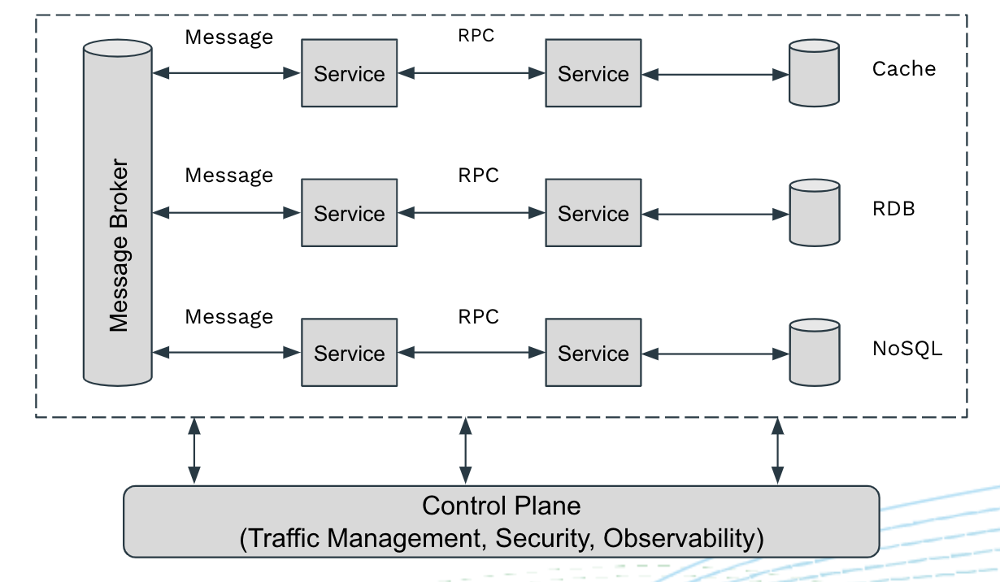

那么当将这样一个微服务应用加入到 Service Mesh 以后，我们希望能够通过 Service Mesh 得到哪些管理能力呢？

理想情况下，我们希望 Service Mesh 能够管理微服务中用到的所有七层协议的流量，包括 RPC、Messaging、Cache、DB等。例如：
* 基于请求的负载均衡：可以将来自同一个 TCP 链接的多个独立的请求分发到不同的后端服务器，以实现更智能，更合理的负载均衡。
* 基于七层 Header 的流量路由：根据七层 Header 中的属性进行路由，例如根据 Dubbo 请求中的服务名或者 Redis 请求的 Key 进行路由。
* 对客户端的请求响应注入延迟或者错误，以测试应微服务用的弹性。
* 提供应用级安全，例如基于 HTTP Header 中的 JWT Token 进行认证，或者对 Redis 服务器进行认证。
* 请求层面的遥测数据，包括请求成功率、请求耗时、调用跟踪等等。

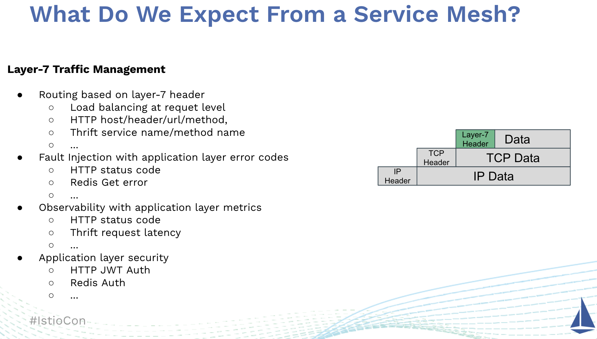

要实现以上这些流量管理和服务治理能力，Service Mesh 需要分析和处理 TCP 数据包中的七层协议的 Header。即 Service Mesh 必须具有七层协议的管理能力，而不只是在 TCP 层面上进行处理。

然而在 Istio 中，对于除了 HTTP 和 gRPC 之外的协议，我们只能在 OSI 三到六层对这些协议进行处理。这意味着我们只能基于三层的 IP 地址，四层的 TCP 端口或者六层的 SNI（Server Name Indication）对这些协议进行路由。只能收集到 TCP 层面的指标，例如 TCP 收发包数量或者打开/关闭的 TCP 链接数量。只能采用 mTLS 进行链路层面的认证和权限控制。换而言之，对于这些协议，我们依然需要在应用代码中处理流量控制、可观测性、安全认证这些本应该由 Service Mesh 基础设施来统一处理的共性问题。这违背了我们将微服务迁移到 Service Mesh 的初衷：将微服务通信和治理的共性问题从应用代码下沉到 Service Mesh 基础设施层。

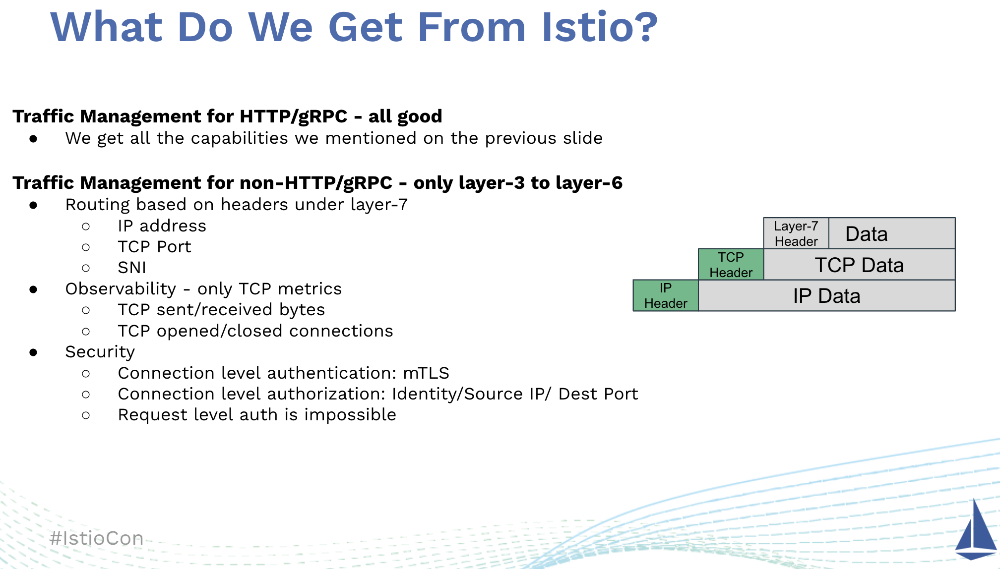

## 如何扩展 Istio 的协议管理能力？
如果我们希望能够在 Istio 中管理这些七层协议，我们应该如何实现呢？假设我们有一个 BookInfo 微服务，但该微服务采用了一种称为 AwesomeRPC 的协议而不是 HTTP 来实现服务间的远程调用。

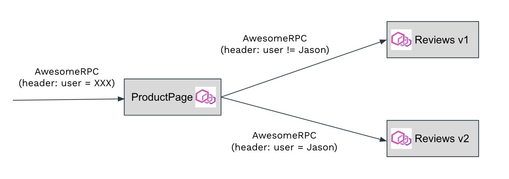

我们来看一下如何才能够在 Istio 中实现 AwesomeRPC 协议的流量管理，例如根据请求 header 中的 user name 字段将来自 ProductPage 的请求路由到不同版本的 Reviews 中，以实现一个灰度发布的场景。

我们想到的最显而易见的方式就是直接修改 Istio 代码。首先我们需要在 Istio 的 VirtualService CRD 中支持 AwesomeRPC 协议。增强后的 VirtualService CRD 如下图中最左的规则配置所示。 AwesomeRPC 和 HTTP 路由的语义类似，都是根据 Header 中某些属性的值进行路由。因此我们只需要将 HTTP 协议类型改为 AwesomeRPC，可以直接采用 VirtualService 中的 HTTPRoute 结构来表示 AwesomeRPC 的路由规则。然后我们需要在 Pilot 代码中根据 AwesomeRPC 的服务定义和 VirtualService 定义的路由规则生成 Envoy 所需的真实配置，并通过 xDS 下发给数据面的 Envoy。当然，以上的前提是我们已经通过 Envoy 的 Filter 扩展机制编写了 AwesomeRPC 的 Filter 插件，实现 AwesomeRPC 的编解码，Header 解析，动态路由等数据面所需的功能。

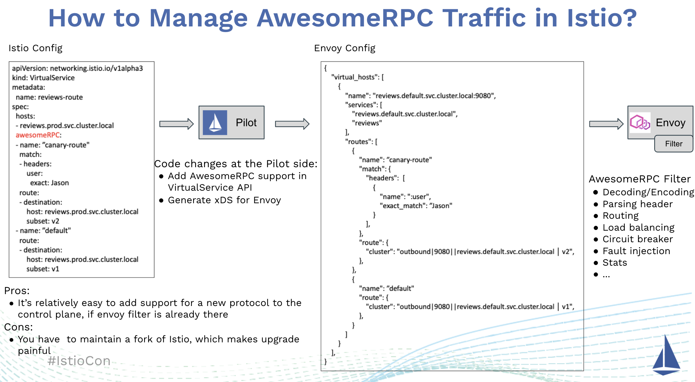

采用这种方式，在 Envoy Filter 已经实现了的情况下，在控制面增加一个新的七层协议的过程是相对比较简单的。但是由于我们修改了 Istio 的源码，因此需要自己维护一个 Istio 的私有分支，这导致了额外的维护代价，并且很难跟上 Istio 快速的迭代步伐。

如果不希望维护自己的 Istio 代码分支，一种可行的替代方式是采用 Istio EnvoyFilter CRD：EnvoyFilter 是 Istio 提供的一种灵活强大的配置机制。我们可以使用 EnvoyFilter为 Pilot 生成的缺省 Envoy 配置打一个补丁，添加、修改或者删除缺省 Envoy 配置中的部分内容，以按我们的要求修改 Envoy 在 Istio Service Mesh 中的缺省行为。

如下图所示，由于 Pilot 并不理解 AwesomeRPC 协议，对于 Pilot 来说， AwesomeRPC 服务只是一个 TCP 服务。在 Pilot 生成的缺省配置中，AwesomeRPC 服务对应的 Outbound Listener 的 FilterChain 中采用了一个 TCP Proxy 来处理其流量。我们在 EnvoyFilter 的 Match 部分中选中该 TCP Proxy，并在 Operation 部分将其替换为一个配置了 Traffic Splitting 规则的 AwesomeRPC Filter。Pilot 会根据 EnvoyFilter 修改其生成的缺省 Envoy 配置，然后下发到数据面的 Envoy 上。这样我们就通过 EnvoyFilter 在 Istio 中实现了对 AwesomeRPC 协议的支持。

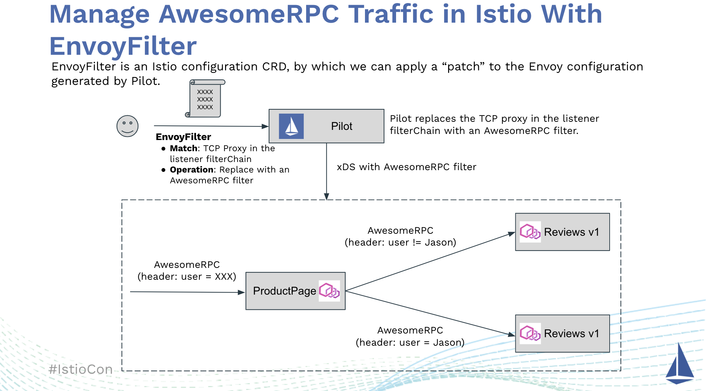

下面我们来看一个采用 Thrift 协议的真实案例。Thrift 是 Apache 基金会下一个轻量级、支持多语言的开源 RPC 框架。Envoy 中已经支持 Thrift，但 Istio 中只对 Thrift 提供了有限的支持，并不能实现 Traffic Splitting 等高级流量管理功能。如果我们希望在 Istio 中提供下图中右下角所示 Thrif 服务的 Traffic Splitting 流量控制，我们可以通过 EnvoyFilter 来实现。

(本示例相关源码可以从 https://github.com/aeraki-framework/thrift-envoyfilter-example 下载）

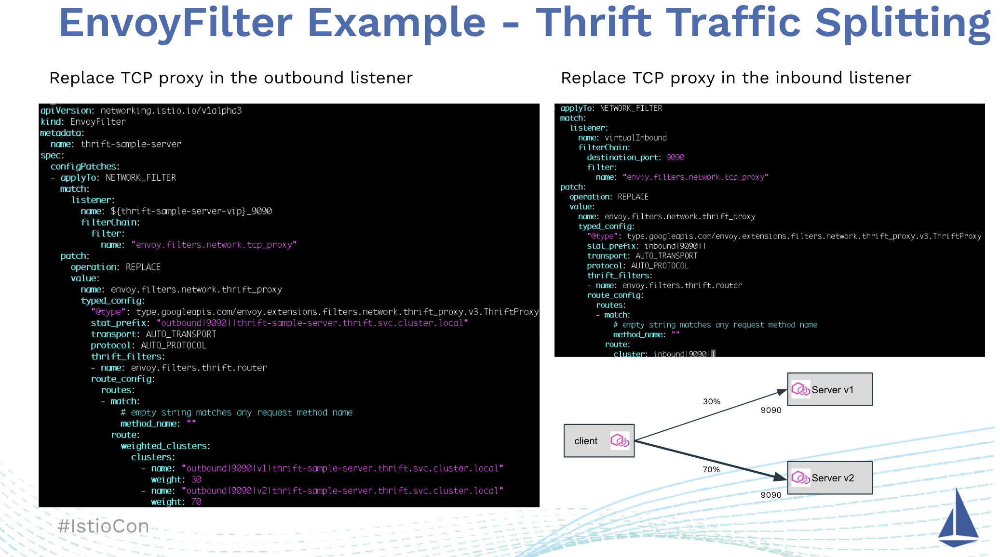

首先，我们需要创建一个图中左边所示的 EnvoyFilter 来处理客户端的出向流量，该 EnvoyFilter 的 Match 条件选中了  $(thrift-sample-server-vip)_9090 这个 Outbound Listener 中 的 tcp_proxy，在 Patch 部分将其替换为一个 thrift_proxy。在该 thrift_proxy 中，我们按照 Traffic Splitting 的要求为其配置了相应的路由：将 30% 的流量路由到 Server v1版本，70% 的流量路由到 Server v2 版本。我们也需要为 Thrift Server 端创建一个如图右上所示的 EnvoyFilter 来处理服务器端的入向流量。相比客户端的 EnvoyFilter 而言，服务器端的 EnvoyFilter 配置要简单一些，因此我们不需要在服务器端配置任何路由规则，只需要将 tcp_proxy 替换为 thrift_proxy 即可。这个 thrift_proxy 虽然没有路由规则，但提供了大量七层的服务通信和治理能力，包括请求层面的负载均衡、产生请求层面的 Metrics 数据等。


从上面的介绍和示例可以看到， EnvoyFilter CRD 好比是 Istio 中的一把瑞士军刀，可以对 Pilot 生成的 Envoy 配置进行非常灵活的定制，以达到对七层协议进行管理的目的。但是 EnvoyFilter 也带来了一些难以处理的问题：

* EnvoyFilter 将 Envoy 的底层实现细节直接暴露给了运维人员：运维人员必须非常了解 Envoy 的配置细节，而这些配置细节往往和 Envoy Filter 内部的实现机制紧密相关，例如 Filter 的名称和 Filter 内部的配置格式等。这导致创建 EnvoyFilter 成为了一种和代码细节高度耦合的工作，难以直接交付给运维人员。更为合理的方式则应该是采用一种面向用户的高级配置语言来屏蔽这些实现细节，例如 Istio 中的 VirtualService 和 DestinationRule。
* EnvoyFilter 中的匹配条件依赖于 Pilot 生成的 Envoy 配置中的结构组成和元素命名，例如 Listener 的名称，FilterChain 的构成等。而这些结构和命名在不同的 Istio 版本之间可能发生变化，导致原本能够正常工作的 EnvoyFilter 在新版本中出现问题。
* EnvoyFilter 中的匹配条件还依赖于一些和特定 K8s 集群相关的内容，例如 Service Cluster IP，这意味着一个 EnvoyFilter 不能用于多个不同集群中的相同服务。当 Service 被重建时，由于 Cluster IP 会发生变化，相应的 EnvoyFilter 也必须进行改动，修改 Match 条件中的 Cluster IP。
* 我们需要为每个 Service 创建相应的 EnvoyFilter，当 Mesh 中管理的服务较多时，手动创建成百上千的 EnvoyFilter 的工作是非常繁琐而且及易出错的。
* 对 Istio 而言，EnvoyFilter 中的 Patch 部分基本上是一个黑盒，因此 Istio 只能对 EnvoyFilter 的正确性进行非常有限的验证。这导致 EnvoyFilter 的调试非常困难，当 Envoy 未能按照你的设想工作时，你很难知道到底是 EnvoyFilter 的什么地方出现了问题。

由于上述的种种问题，我们可以看到，虽然可以使用 EnvoyFilter 来在 Istio 中实现七层协议的管理，但是在一个生产系统，特别是一个中大型的 Service Mesh 中管理和维护这些 EnvoyFilter 是非常困难的。

## Aeraki：在 Istio 中管理任何七层协议

由于难以手动对 EnvoyFilter 进行管理和维护 ，我们创建了[Aeraki](https://github.com/aeraki-framework/aeraki) (发音：[Air-rah-ki]）项目来自动化这个流程。Aeraki 是希腊语中“微风”的意思，我们希望 Aeraki 这股微风能帮助 Istio 在云原生的旅程中航行得更远。

Aeraki 的基本工作原理如下图所示：Aeraki 从 Istio 中拉取服务数据，根据 ServiceEntry 和 Aeraki 流量规则生成 Envoy 配置，并采用 EnvoyFilter 将生成的配置推送到 Istio 中。简而言之，你可以把 Aeraki 看做 Istio 中管理的七层协议的 [Operator](https://kubernetes.io/docs/concepts/extend-kubernetes/operator/)。

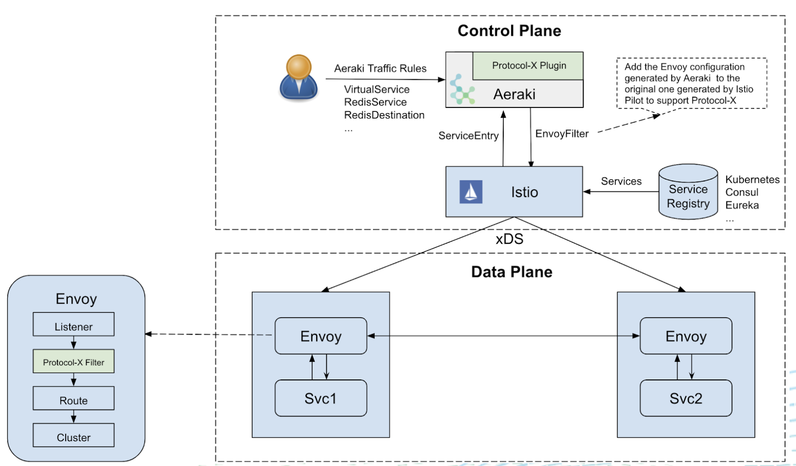

相比于直接修改 Istio 代码和采用 EnvoyFilter 这两种扩展 Istio 流量管理能力的方式，采用 Aeraki 为我们带来了以下的好处：

* 不需要修改 Istio 代码，因此节省了单独维护一个 Istio 的私有代码分支的额外工作量，可以快速跟随 Istio 的版本迭代进行升级。
* Aeraki 作为一个独立组件部署在 Mesh 的控制面，可以很方便地作为一个插件和 Istio 进行集成，对 Istio 的流量管理能力进行扩展。
* 协议相关的缺省配置由 Aeraki 自动生成，并且这些配置可以根据 Istio 版本和 K8s 集群相关信息自动进行调整。节约了大量 EnvoyFilter 的手动创建和维护工作。
* Aeraki 在 Envoy 配置之上进行了抽象，提供了一层面向用户的配置 CRD 来对这些七层协议进行管理。这些高级 CRD 隐藏了 Envoy 的配置细节，屏蔽了不同 Istio 版本生成的缺省 Envoy 配置的差异，对于运维非常友好。对于 Thrift 和 Dubbo 这样的 RPC 协议，由于其语义和 HTTP 类似，Aeraki 直接采用了 Istio VirtualService 和 DestinationRule；对于非 RPC 协议，Aeraki 则定义了一些新的 CRD 来进行管理，例如 RedisService 和 RedisDestination。我们后面将进一步介绍如何使用这些配置 CRD 来定制规则，例如实现 Traffic Splitting。

和 Istio 类似，Aeraki 也采用了端口名称来识别协议类型。端口取名需要遵循 “tcp-七层协议名-xxx” 的命名规则。例如，一个 Thrift 服务应取名为 “tcp-thrift-service”。需要注意的是，我们必须保留端口名中的“tcp-”前缀，因为对于 Istio 而言，这是一个 TCP 协议的服务。Aeraki 则会根据端口名中的七层协议来生成相应的 Envoy 配置，并替换 Istio 缺省生成的 tcp_proxy。

我们来看看如何采用 Aeraki 来实现上面 Thrift 服务的 Traffic Splitting 用例。首先我们需要在 Thrift Service 定义的 Port 命名中声明该 Service 的七层协议类型：“tcp-thrift-hello-server”，然后创建一个 VirtualService 将 Thrift 请求按照指定比例路由到不同的服务版本中。Aeraki 将根据服务定义和 VirtualService 生成所需的 Envoy 配置，并通过 EnvoyFilter 发送给 Istio。

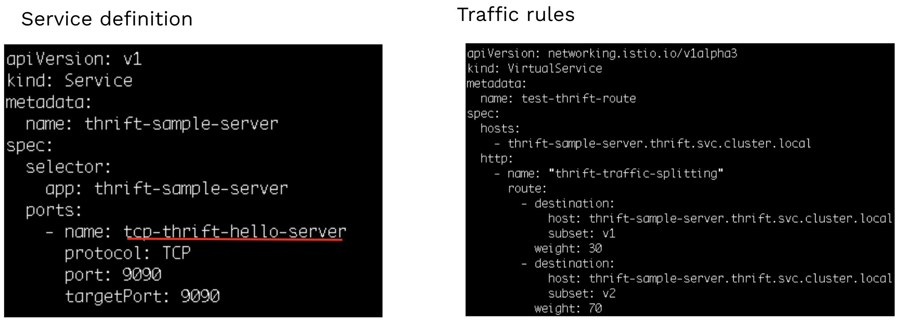

可以看到，相对于手动创建 EnvoyFilter，采用 Aeraki 来管理 Thrift 要简单得多。如果不需要特殊的流量规则，则会更简单，只需要按照命名规范在 Port 名称中声明 Thrift 协议即可，Aeraki 会生成所需的 Envoy 配置，无需任何额外的工作。

想自己试试 Aeraki 的 Thrift、Dubbo、Redis 服务管理能力？非常简单，只需在一个连接到 K8s 集群的命令行终端上运行下面两行代码，就可以安装一个带有 Aeraki 插件的 Istio 集群以及相应的 Demo 程序，欢迎大家尝试！

```bash
git clone https://github.com/aeraki-framework/aeraki.git
aeraki/demo/install-demo.sh
```

也可以访问 Aeraki 的在线 Demo，查看从 Thrift、Dubbo、Redis 等服务收集到的监控指标面板：http://aeraki.zhaohuabing.com:3000/d/pgz7wp-Gz/aeraki-demo?orgId=1&refresh=10s&kiosk

## 使用 Aeraki 增强 Service Mesh

下面我们来看一下使用 Aeraki 的七层协议管理能力来增强 Service Mesh 的一些案例。

### 屏蔽开发/生产环境的差异

我们在开发、测试和生产环境中通常需要访问不同的后端资源，例如需要连接到不同的 Redis 缓存或者不同的 mySQL 数据库。一般来说，我们需要修改随应用程序发布的配置文件中的后端资源地址，以达到在不同环境中切换后端资源的目的。通过 Aeraki 的帮助，我们可以用 Service Mesh 来屏蔽不同后端资源的配置差异，使得应用程序可以用相同的方式访问不同环境中的后端资源。

如下图所示，我们在 Dev、Staging 和 Prod 三个环境中都需要访问 Redis 服务，这三个 Redis 服务有不同的 IP 地址和访问密码，部署方式也可能不同：在开发环境中，为了节约资源和简化部署，我们可能使用单个 Redis 实例；在测试和生产环境中，我们会使用 Redis 集群来保证 Redis 服务的高可用和扩展性，我们也可能直接使用云服务商提供的 Redis 托管服务。当在这三个环境中进行切换时，我们需要配置不同的 IP 地址和访问密码，如果 Redis 部署的方式不同，我们甚至可能需要修改客户端代码来切换 Redis 单实例模式和集群模式，这极大影响了我们开发、测试和上线的效率。

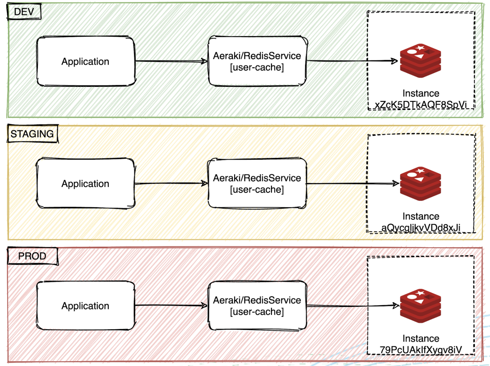

通过 Aeraki 提供的 RedisService 和 RedisDestination CRD，我们可以屏蔽这些不同 Redis 服务提供者之间的差异，允许客户端以统一的方式访问后端的 Redis 服务。

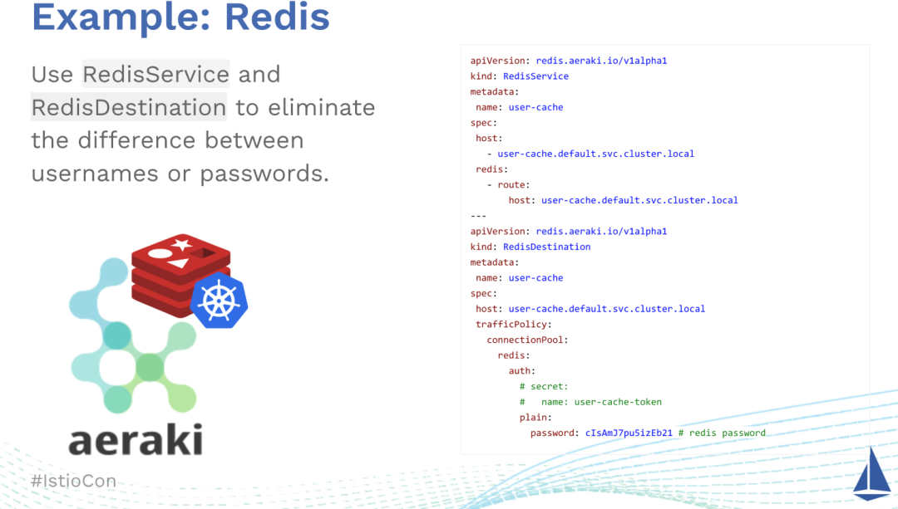

在采用 Aeraki 之前，我们在不同的环境中需要配置不同的 IP 地址和 Redis 访问密码。采用 Aeraki 之后，在客户端可以采用相同的代码和配置，通过修改 Aeraki CRD 来切换不同环境中的 Redis 配置，大大减少在不同环境之间进行切换的成本。即使 Redis 从单实例改为了 Redis 集群，客户端也可以采用相同的方式进行访问。

### 采用流量镜像进行对比测试

有一些数据库或者数据库代理采用相同的网络协议。例如 TiDB、Oceanbase、Aurora、Kingshard等都兼容 MySQL 协议；Twemproxy、Codis、Tendis、Pika等都采用了 Redis 协议。由于业务需求，我们有时需要从一个实现迁移到另一个实现上。在迁移之前，我们需要进行对比测试，以对比不同实现的性能、功能及兼容性。

例如下面的场景：我们最初只用了一个单实例 Redis 来做缓存，随着线上业务的不断扩展，该 Redis 实例已经出现了访问瓶颈，我们希望切换为采用 Twemproxy 来对 Redis 进行水平扩展。通过采用 Aeraki 来将线上的 Redis 流量镜像到 Twemproxy 测试环境，我们可以采用真实的业务数据对 Twemproxy 进行充分的测试，以评估其对线上业务的影响。

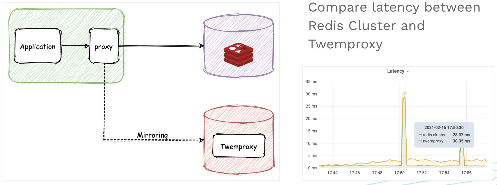

### 采用全流量故障注入测试系统弹性
Istio 可以实现 HTTP 和 gRPC 的故障注入，但这还不够。在一个分布式系统中，应用服务、数据库、缓存、消息系统等都可能由于网络或者其他原因出现不可用的情况。采用 Aeraki，我们可以对系统中的所有这些可能的故障点进行完整的模拟，以测试系统的弹性，保证我们的系统在一部分出现问题后可以自愈或者通过降级保证系统基本可用，而不至于整个系统崩溃。

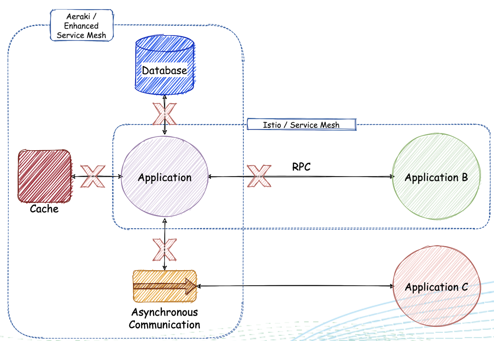

## 小结

Service Mesh 中有大量的七层协议流量，包括 RPC、Database、Cache、Messaging 等类型的七层协议，但 Istio 只提供了 HTTP 和 gRPC 的七层管理能力，对其他七层协议的支持非常有限。Aerkai 开源项目通过非侵入的方式为 Istio 提供了任意七层协议的支持能力，并提供了面向用户的高级配置 CRD，可以很方便地对这些协议的流量进行管理，实现灰度发布等高级流量管理能力。目前 Aeraki 已经支持了 Thrift、Dubbo、Redis、Kafka、Zookeeper，并即将支持更多的协议。Aeraki 的定位是做成一个非侵入式 Istio 功能增强工具集，除了协议扩展之外，还会关注解决在 Istio 使用过程中遇到的其他常见问题，包括效率优化、配置简化、第三方服务发现接入、功能扩展等。如果您希望了解更多关于 Aeraki 的内容，欢迎访问 Github 主页  https://github.com/aeraki-framework 。

__招聘信息__：腾讯云 Service Mesh 团队正在火热招聘中，Base 成都、北京、深圳或者西安，要求候选者熟悉 Kubernetes/Istio/Envoy。欢迎大家发送简历到 huabingzhao@tencent.com 或者微信联系 zhao_huabing。

## 参考链接

* [IstioCon talk “How to Manage Any Layer-7 Traffic in an Istio Service Mesh?” 视频回放](https://www.bilibili.com/video/BV1XN41197Sq)
* [IstioCon talk “How to Manage Any Layer-7 Traffic in an Istio Service Mesh? 讲稿下载](https://zhaohuabing.com/slides/how-to-manage-any-layer-7-traffic-in-istio.pdf)
* [Aeraki Github 主页](https://github.com/aeraki-framework)
* [Aeraki 在线 Demo](http://aeraki.zhaohuabing.com:3000/d/pgz7wp-Gz/aeraki-demo?orgId=1&refresh=10s&kiosk)

