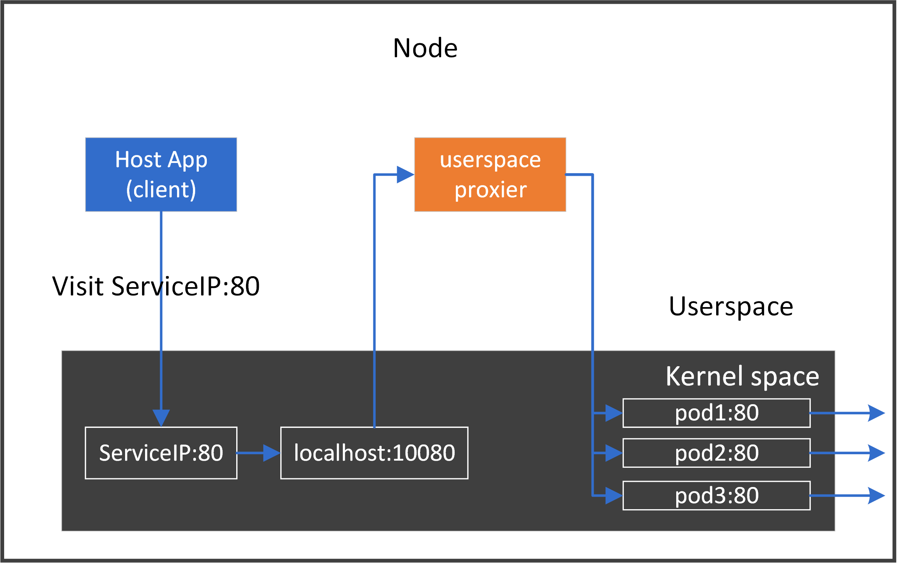

本文译自 [Cracking kubernetes node proxy (aka kube-proxy)](https://arthurchiao.art/blog/cracking-k8s-node-proxy/)。

Kubernetes 中有几种类型的代理。其中有 **node proxier** 或 [kube-proxy](https://kubernetes.io/docs/reference/command-line-tools-reference/kube-proxy/)，它在每个节点上反映 Kubernetes API 中定义的服务，可以跨一组后端执行简单的 TCP/UDP/SCTP 流转发 [1]。

为了更好地理解节点代理模型，在这篇文章中，我们将用不同的方法设计和实现我们自己版本的 `kube-proxy`; 尽管这些只是 `toy-proxy`，但从**透明流量拦截、转发、负载均衡**等方面来说，它们的工作方式与 K8S 集群中运行的普通 `kube-proxy` 基本相同。

通过我们的 `toy-proxy` 程序，非 K8S 节点（不在 K8S 集群中）上的应用程序（无论是宿主本地应用程序，还是在 VM/容器中运行的应用程序）也可以通过 **ClusterIP** 访问 K8S 服务 -- **注意，在 kubernetes 的设计中，ClusterIP 只能在 K8S 集群节点中访问（在某种意义上，我们的 `toy-proxy` 程序将非 K8S 节点变成了 K8S 节点）。**

## 背景知识

了解 Linux 内核中的流量拦截和代理需要具备以下背景知识。

### Netfilter

Netfilter 是 Linux 内核内部的**包过滤和处理框架**。如果你不熟悉 Iptables 和 Netfilter 体系结构，请参阅 [A Deep Dive into Iptables and Netfilter Architecture](https://www.digitalocean.com/community/tutorials/a-deep-dive-into-iptables-and-netfilter-architecture)

一些要点：

- 主机上的**所有数据包**都将通过 netfilter 框架
- 在 netfilter 框架中有 **5 个钩子**点：`PRE_ROUTING`, `INPUT`, `FORWARD`, `OUTPUT`, `POST_ROUTING`
- 命令行工具 `iptables` 可用于**动态地将规则插入到钩子点中**
- 可以通过组合各种 `iptables` 规则来操作数据包（接受/重定向/删除/修改，等等）


此外，这 5 个钩子点还可以与内核的其他网络设施，如内核路由子系统进行协同工作。

此外，在每个钩子点中，规则被组织到具有预定义优先级的不同链中。为了按目的管理链，链被进一步组织到表中。现在有 5 个表：

- `filter`：做正常的过滤，如接受，拒绝/删，跳
- `nat`：网络地址转换，包括 SNAT（源 nat) 和 DNAT（目的 nat)
- `mangle`：修改包属性，例如 TTL
- `raw`：最早的处理点，连接跟踪前的特殊处理 (conntrack 或 CT，也包含在上图中，但这不是链）
- `security`：本文未涉及

将表/链添加到上图中，我们可以得到更详细的视图：


### VIP 与负载均衡 (LB)

虚拟 IP (IP) 将所有后端 IP 隐藏给客户端/用户，因此客户端/用户总是与 VIP 的后端服务通信，而不需要关心 VIP 后面有多少实例。

VIP 总是伴随着负载均衡，因为它需要在不同的后端之间分配流量。


### Cross-host 网络模型

主机 A 上的实例（容器、VM 等）如何与主机 B 上的另一个实例通信？有很多解决方案：

- 直接路由：BGP 等
- 隧道：VxLAN, IPIP, GRE 等
- NAT：例如 docker 的桥接网络模式
- 其它方式

## 节点代理模型

在 kubernetes 中，你可以将应用程序定义为 `Service`。`Service` 是一种抽象，它定义了一组 Pods 的逻辑集和访问它们的策略。

### Service 类型

K8S 中定义了 4 种 `Service` 类型：

- `ClusterIP`：通过 VIP 访问 Service，但该 VIP 只能在此集群内访问
- `NodePort`：通过 NodeIP:NodePort 访问 Service，这意味着该端口将保留在集群内的所有节点上
- `ExternalIP`：与 `ClusterIP` 相同，但是这个 VIP 可以从这个集群之外访问
- `LoadBalancer`

这篇文章将关注 `ClusterIP`，但是其他三种类型在流量拦截和转发方面的底层实现非常相似。

### 节点代理

一个 Service 有一个 VIP（本文中的 `ClusterIP`）和多个端点（后端 pods）。每个 pod 或节点都可以通过 VIP 直接访问应用程序。要做到这一点，节点代理程序需要在每个节点上运行，它应该能够透明地拦截到任何 `ClusterIP:Port`[注解 1] 的流量，并将它们重定向到一个或多个后端 pods。


> 注解 1：
>
> 对 `ClusterIP` 的一个常见误解是，`ClusterIP` 是可访问的——它们不是通过定义访问的。如果 ping 一个 `ClusterIP`，可能会发现它不可访问。
>
> 根据定义，**<Protocol,ClusterIP,Port>** 元组独特地定义了一个服务（因此也定义了一个拦截规则）。例如，如果一个服务被定义为 `<tcp,10.7.0.100,80>`，那么代理只处理 `tcp:10.7.0.100:80` 的流量，其他流量，例如。`tcp:10.7.0.100:8080`, `udp:10.7.0.100:80` 将不会被代理。因此，也无法访问 ClusterIP（ICMP 流量）。
>
> 但是，如果你使用的是带有 IPVS 模式的 `kube-proxy`，那么确实可以通过 ping 访问 `ClusterIP`。这是因为 IPVS 模式实现比定义所需要的做得更多。你将在下面几节中看到不同之处。

### 节点代理的角色：反向代理

想想节点代理的作用，在 K8S 网络模型中，它实际上是一个反向代理，也就是说，在每个节点上，它将：

- 将所有后端 Pods 隐藏到客户端
- 过滤所有出口流量（对后端的请求）

对于 ingress traffic，它什么也不做。

### 性能问题

如果我们在主机上有一个应用程序，并且在 K8S 集群中有 1K 个服务，那么我们永远无法猜测该应用程序在下一时刻将访问哪个服务（这里忽略网络策略）。因此，为了让应用程序能够访问所有服务，我们必须为节点上的所有服务应用所有代理规则。将这个想法推广到整个集群，这意味着：

**所有服务的代理规则应该应用于整个集群中的所有节点。**

在某种意义上，这是一个完全分布式的代理模型，因为任何节点都拥有集群的所有规则。

当集群变大时，这会导致严重的性能问题，因为每个节点上可能有数十万条规则 [6,7]。

## 测试环境

### 集群拓扑和测试环境

我们将使用以下环境进行测试：

- 一个 k8s 集群
    - 一个 master 节点
    - 一个 node 节点
    - 网络解决方案：直接路由（PodIP 可直接路由）
- 一个非 k8s 节点，但是它可以到达工作节点和 Pod（得益于直接路由网络方案）


我们将在工作节点上部署 Pods，并从 test 节点通过 `ClusterIP` 访问 Pods 中的应用程序。

### 创建一个 Service

创建一个简单的 `Statefulset`，其中包括一个 `Service`，该 `Service` 将有一个或多个后端 Pods:

```bash
# see appendix for webapp.yaml
$ kubectl create -f webapp.yaml

$ kubectl get svc -o wide webapp
NAME     TYPE        CLUSTER-IP     EXTERNAL-IP   PORT(S)   AGE     SELECTOR
webapp   ClusterIP   10.7.111.132   <none>        80/TCP    2m11s   app=webapp

$ kubectl get pod -o wide | grep webapp
webapp-0    2/2     Running   0    2m12s 10.5.41.204    node1    <none>  <none>
```

应用程序在带有 tcp 协议的 80 端口上运行。

### 可达性测试

首先访问 PodIP+Port:

```bash
$ curl 10.5.41.204:80
<!DOCTYPE html>
...
</html>
```

成功的！然后用 `ClusterIP` 替换 PodIP 再试一次：

```bash
$ curl 10.7.111.132:80
^C
```

正如所料，它是不可访问的！

在下一节中，我们将研究如何使用不同的方法使 `ClusterIP` 可访问。

## 实现：通过 userspace socket 实现 proxy

### 中间人模型

最容易理解的实现是在此主机上的通信路径中插入我们的 `toy-proxy` 作为中间人：对于从本地客户端到 ClusterIP:Port 的每个连接，**我们拦截该连接并将其分割为两个单独的连接**:

- 本地客户端和 `toy-proxy` 之间的连接
- 连接 `toy-proxy` 和后端 pods

实现此目的的最简单方法是在用户空间中实现它：

- `监听资源`：启动一个守护进程，监听 K8S apiserver、监视服务 (ClusterIP) 和端点 (Pod) 的变化
- `代理通信`：对于从本地客户端到服务 (ClusterIP) 的每个连接请求，通过充当中间人来拦截请求
- `动态应用代理规则`：对于任何 Service/Endpoint 更新，相应地更改 `toy-proxy` 连接设置

对于我们上面的测试应用 `webapp`，数据流程如下图：


### POC 实现

让我们来看看上图的概念验证实现。

#### 代码

以下代码省略了一些错误处理代码，便于阅读：

```golang
func main() {
	clusterIP := "10.7.111.132"
	podIP := "10.5.41.204"
	port := 80
	proto := "tcp"

	addRedirectRules(clusterIP, port, proto)
	createProxy(podIP, port, proto)
}

func addRedirectRules(clusterIP string, port int, proto string) error {
	p := strconv.Itoa(port)
	cmd := exec.Command("iptables", "-t", "nat", "-A", "OUTPUT", "-p", "tcp",
		"-d", clusterIP, "--dport", p, "-j", "REDIRECT", "--to-port", p)
	return cmd.Run()
}

func createProxy(podIP string, port int, proto string) {
	host := ""
	listener, err := net.Listen(proto, net.JoinHostPort(host, strconv.Itoa(port)))

	for {
		inConn, err := listener.Accept()
		outConn, err := net.Dial(proto, net.JoinHostPort(podIP, strconv.Itoa(port)))

		go func(in, out *net.TCPConn) {
			var wg sync.WaitGroup
			wg.Add(2)
			fmt.Printf("Proxying %v <-> %v <-> %v <-> %v\n",
				in.RemoteAddr(), in.LocalAddr(), out.LocalAddr(), out.RemoteAddr())
			go copyBytes(in, out, &wg)
			go copyBytes(out, in, &wg)
			wg.Wait()
		}(inConn.(*net.TCPConn), outConn.(*net.TCPConn))
	}

	listener.Close()
}

func copyBytes(dst, src *net.TCPConn, wg *sync.WaitGroup) {
	defer wg.Done()
	if _, err := io.Copy(dst, src); err != nil {
		if !strings.HasSuffix(err.Error(), "use of closed network connection") {
			fmt.Printf("io.Copy error: %v", err)
		}
	}
	dst.Close()
	src.Close()
}
```

#### 一些解释

##### traffic 拦截

我们想拦截所有发往 `ClusterIP:Port` 的流量，但是在这个节点上任何设备都没有配置`ClusterIP`，因此我们无法执行诸如 listen（ClusterIP，Port）之类的操作，那么我们如何才能拦截呢？答案是：使用`iptables/netfilter` 提供的 `REDIRECT` 能力。

以下命令会将所有发往 `ClusterIP:Port` 的流量定向到 `localhost:Port`：

```bash
$ sudo iptables -t nat -A OUTPUT -p tcp -d $CLUSTER_IP --dport $PORT -j REDIRECT --to-port $PORT
```

如果你现在不能理解这一点，不要害怕。稍后我们将讨论这个问题。

通过下面命令的输出来验证这一点：

```bash
$ iptables -t nat -L -n
...
Chain OUTPUT (policy ACCEPT)
target     prot opt source      destination
REDIRECT   tcp  --  0.0.0.0/0   10.7.111.132         tcp dpt:80 redir ports 80
```

在代码中，函数 `addRedirectRules()` 包装了上述过程。

##### 创建 proxy

函数 `createProxy()` 创建用户空间代理，并执行双向转发。

#### 可达性测试

编译代码并执行二进制文件：

```bash
$ go build toy-proxy-userspace.go
$ sudo ./toy-proxy-userspace
```

现在测试访问：

```bash
$ curl $CLUSTER_IP:$PORT
<!DOCTYPE html>
...
</html>
```

成功！我们的代理传达的信息是：

```bash
$ sudo ./toy-proxy-userspace
Creating proxy between <host ip>:53912 <-> 127.0.0.1:80 <-> <host ip>:40194 <-> 10.5.41.204:80
```

表示，对于原 `<host ip>:53912 <-> 10.7.111.132:80` 的连接请求，将其拆分为两个连接：

1. `<host ip>:53912 <-> 127.0.0.1:80`
2. `<host ip>:40194 <-> 10.5.41.204:80`

删除这条规则：

```bash
$ iptables -t nat -L -n --line-numbers
...
Chain OUTPUT (policy ACCEPT)
num  target     prot opt source               destination
2    REDIRECT   tcp  --  0.0.0.0/0   10.7.111.132         tcp dpt:80 redir ports 80

# iptables -t nat -D OUTPUT <num>
$ iptables -t nat -D OUTPUT 2
```

或者删除（刷新）所有规则，如果你把 iptabels 弄的一团糟的情况下：

```bash
$ iptables -t nat -F # delete all rules
$ iptables -t nat -X # delete all custom chains
```

#### 改进

在这个 `toy-proxy` 实现中，我们拦截了 `ClusterIP:80` 到 `localhost:80`，但是如果该主机上的本机应用程序也想使用 `localhost:80` 怎么办？此外，如果多个服务都公开 80 端口会怎样？显然，我们需要区分这些应用程序或服务。解决这个问题的正确方法是：为每个代理分配一个未使用的临时端口 TmpPort，拦截 `ClusterIP:Port` 到 `local:TmpPort`。例如，app1 使用 10001, app2 使用 10002。

其次，上面的代码只处理一个后端，如果有多个后端 pods 怎么办？因此，我们需要通过负载均衡算法将请求分发到不同的后端 pods。



#### 优缺点

这种方法非常容易理解和实现，但是，它的性能会很差，因为它必须在两端以及内核和用户空间内存之间复制字节。

我们没有在这上面花太多时间，如果你感兴趣，可以在这里查看用户空间 `kube-proxy` 的简单实现。

接下来，让我们看看实现这个任务的另一种方法。

## 实现：通过 iptables 实现 proxy

用户空间代理程序的主要瓶颈来自内核-用户空间切换和数据复制。**如果我们可以完全在内核空间中实现代理**，它将在性能上大大提高，从而击败用户空间的代理。`iptables` 可用于实现这一目标。

在开始之前，让我们首先弄清楚在执行 `curl ClusterIP:Port` 时的流量路径，然后研究如何使用 `iptables` 规则使其可访问。

### Host -> ClusterIP（单一后端）

`ClusterIP` 不存在于任何网络设备上，所以为了让我们的数据包最终到达后端 Pod，我们需要将 `ClusterIP` 转换为 PodIP（可路由），即：

- 条件：匹配 `dst=ClusterIP,proto=tcp,dport=80` 的数据包
- 操作：将数据包的 IP 报头中的 `dst=ClusterIP` 替换为 `dst=PodIP`

用网络术语来说，这是一个网络地址转换 (NAT) 过程。

#### 在哪里做 DNAT

通过 curl 查看出口数据包路径（下图展示了数据流向过程）：


```bash
<curl process> -> raw -> CT -> mangle -> dnat -> filter -> security -> snat -> <ROUTING> -> mangle -> snat -> NIC
```

很明显，在 OUTPUT 钩中只有一个 dnat（链），我们可以在其中进行 DNAT。

让我们看看我们将如何进行黑客入侵。

#### 检查当前的 NAT 规则

`NAT` 规则被组织到 `nat` 表中。检查 `nat` 表中的当前规则：

```bash
# -t <table>
# -L list rules
# -n numeric output
$ iptables -t nat -L -n
Chain PREROUTING (policy ACCEPT)

Chain INPUT (policy ACCEPT)

Chain OUTPUT (policy ACCEPT)
DOCKER     all  --  0.0.0.0/0    !127.0.0.0/8   ADDRTYPE match dst-type LOCAL

Chain POSTROUTING (policy ACCEPT)
```

输出显示除了与 DOCKER 相关的规则外，没有其他规则。这些 DOCKER 规则是 DOCKER 在安装时插入的，但它们不会影响我们在这篇文章中的实验。所以我们忽略它们。

#### 增加 DNAT 规则

为了便于查看，我们不会用 go 代码包装 `iptables` 命令，而是直接显示命令本身。

> 注意：在继续之前，请确保删除了在上一节中添加的所有规则。

确认目前无法访问 ClusterIP：

```bash
$ curl $CLUSTER_IP:$PORT
^C
```

现在添加我们的出口 NAT 规则：

```bash
$ cat ENV
CLUSTER_IP=10.7.111.132
POD_IP=10.5.41.204
PORT=80
PROTO=tcp

# -p               <protocol>
# -A               add rule
# --dport          <dst port>
# -d               <dst ip>
# -j               jump to
# --to-destination <ip>:<port>
$ iptables -t nat -A OUTPUT -p $PROTO --dport $PORT -d $CLUSTER_IP -j DNAT --to-destination $POD_IP:$PORT
```

再次检查规则表：

```bash
$ iptables -t nat -L -n

Chain OUTPUT (policy ACCEPT)
target     prot opt source      destination
DNAT       tcp  --  0.0.0.0/0   10.7.111.132   tcp dpt:80 to:10.5.41.204:80
```

我们可以看到规则已经被添加。

#### 测试可达性

现在再一次访问：

```bash
$ curl $CLUSTER_IP:$PORT
<!DOCTYPE html>
...
</html>
```

就是这样！访问成功。

但是等等！我们期望出口的交通应该是正确的，但我们没有添加任何 NAT 规则的入口路径，怎么可能交通是正常的两个方向？事实证明，当你为一个方向添加一个 NAT 规则时，Linux 内核会自动为另一个方向添加保留规则！这与 conntrack (CT，连接跟踪）模块协同工作。


#### 清理

删除这些规则：

```bash
$ iptables -t nat -L -n --line-numbers
...
Chain OUTPUT (policy ACCEPT)
num  target     prot opt source               destination
2    DNAT       tcp  --  0.0.0.0/0   10.7.111.132   tcp dpt:80 to:10.5.41.204:80

# iptables -t <table> -D <chain> <num>
$ iptables -t nat -D OUTPUT 2
```

### Host -> ClusterIP （多个后端）

在上一节中，我们展示了如何使用一个后端 Pod 执行 NAT。现在让我们看看多后端情况。

> 注意：在继续之前，请确保删除了在上一节中添加的所有规则。

#### 伸缩 webapp

首先扩大我们的服务到 2 个后端 pods:

```bash
$ kubectl scale sts webapp --replicas=2
statefulset.apps/webapp scaled

$ kubectl get pod -o wide | grep webapp
webapp-0   2/2     Running   0   1h24m   10.5.41.204    node1    <none> <none>
webapp-1   2/2     Running   0   11s     10.5.41.5      node1    <none> <none>
```

#### 通过负载平衡添加 DNAT 规则

我们需要 `iptables` 中的 `statistic` 模块以概率的方式将请求分发到后端 Pods，这样才能达到负载均衡的效果：

```bash
# -m <module>
$ iptables -t nat -A OUTPUT -p $PROTO --dport $PORT -d $CLUSTER_IP \
    -m statistic --mode random --probability 0.5  \
    -j DNAT --to-destination $POD1_IP:$PORT
$ iptables -t nat -A OUTPUT -p $PROTO --dport $PORT -d $CLUSTER_IP \
    -m statistic --mode random --probability 1.0  \
    -j DNAT --to-destination $POD2_IP:$PORT
```

上面的命令指定在两个 Pods 之间随机分配请求，每个都有 50% 的概率。

现在检查这些规则：

```bash
$ iptables -t nat -L -n
...
Chain OUTPUT (policy ACCEPT)
target  prot opt source      destination
DNAT    tcp  --  0.0.0.0/0   10.7.111.132  tcp dpt:80 statistic mode random probability 0.50000000000 to:10.5.41.204:80
DNAT    tcp  --  0.0.0.0/0   10.7.111.132  tcp dpt:80 statistic mode random probability 1.00000000000 to:10.5.41.5:80
```


#### 验证

现在，我们来验证下负载均衡是否生效。我们发出 8 个 请求，并捕获到这个主机通信的真实 PodIPs:

在测试节点上打开一个 shell:

```bash
$ for i in {1..8}; do curl $CLUSTER_IP:$PORT 2>&1 >/dev/null; sleep 1; done
```

测试节点上的另一个 shell 窗口：

```bash
$ tcpdump -nn -i eth0 port $PORT | grep "GET /"
10.21.0.7.48306 > 10.5.41.5.80:   ... HTTP: GET / HTTP/1.1
10.21.0.7.48308 > 10.5.41.204.80: ... HTTP: GET / HTTP/1.1
10.21.0.7.48310 > 10.5.41.204.80: ... HTTP: GET / HTTP/1.1
10.21.0.7.48312 > 10.5.41.5.80:   ... HTTP: GET / HTTP/1.1
10.21.0.7.48314 > 10.5.41.5.80:   ... HTTP: GET / HTTP/1.1
10.21.0.7.48316 > 10.5.41.204.80: ... HTTP: GET / HTTP/1.1
10.21.0.7.48318 > 10.5.41.5.80:   ... HTTP: GET / HTTP/1.1
10.21.0.7.48320 > 10.5.41.204.80: ... HTTP: GET / HTTP/1.1
```

在 Pod1 中有 4 次，在 Pod2 中有 4 次，每个 pod 有 50%，这正是我们所期望的。

#### 清理

```bash
$ iptables -t nat -L -n --line-numbers
...
Chain OUTPUT (policy ACCEPT)
num  target     prot opt source               destination
2    DNAT    tcp  --  0.0.0.0/0   10.7.111.132  tcp dpt:80 statistic mode random probability 0.50000000000 to:10.5.41.204:80
3    DNAT    tcp  --  0.0.0.0/0   10.7.111.132  tcp dpt:80 statistic mode random probability 1.00000000000 to:10.5.41.5:80

$ iptables -t nat -D OUTPUT 2
$ iptables -t nat -D OUTPUT 3
```

### Pod (app A) -> ClusterIP (app B)

如果想通过 hostA 上的 `Pod A` 通过 `ClusterIP` 访问 `Pod B`，B 的 Pod 驻留在 hostB 上，我们应该做什么？

实际上，这与 `Host -> ClusterIP` 情况非常相似，但是有一点需要注意：在执行 NAT 之后，源节点 (hostA) 需要将包发送到目的地 Pod 所在的正确目的地节点 (hostB)。根据不同的跨主机网络解决方案，这有很大不同：

1. 对于直接路由的情况下，主机只是发送数据包。对应的有这些解决方案：
    - calico + bird
    - cilium + kube-router（Cilium BGP 的默认解决方案）
    - cilium + bird（实际上这只是我们的测试环境网络解决方案）
2. 对于隧道的情况，每个主机上必须有一个代理，它在 DNAT 之后执行 encap，在 SNAT 之前执行 decap。这些解决方案包括：
    - calico + VxLAN 模式
    - flannel + IPIP 模式
    - flannel + VxLAN 模式
    - cilium + VxLAN 模式
3. 像 aws 的 ENI 模式：类似于直接路由，但不需要 BGP 代理
    - cilium + ENI 模式

下图展示了隧道的情况：


代理与隧道相关的职责包括：

- **同步所有节点之间的隧道信息**，例如描述哪个实例在哪个节点上的信息
- **在 DNAT 之后对 pod 流量执行封装**：对于所有的出口流量，例如来自 hostA 的 `dst=<PodIP>`，其中 PodIP 在 hostB 上，通过添加另一个头来封装数据包，例如 VxLAN 头，其中封装头有 `src=hostA_IP,dst=hostB_IP`
- **在 SNAT 之前对 Pod 流量执行解封装**：解封装每个入口封装的数据包：删除外层（例如 VxLAN 标头）

同时，主机需要决定：

- 哪些数据包应该交给解码器（pod 流量），哪些不应该（例如主机流量）
- 哪些包应该封装（pod 流量），哪些不应该（例如主机流量）

### 重新构造 iptables 规则

> 注意：在继续之前，请确保删除了在上一节中添加的所有规则。

当你有大量的 Service 时，每个节点上的 iptables 规则将相当复杂，因此你需要进行一些结构化工作来组织这些规则。

在本节中，我们将在 nat 表中创建几个专用的 iptables 链，具体如下：

- 链 `KUBE-SERVICES`：拦截 nat 表的输出链中所有到此链的出口流量，如果它们被指定为 ClusterIP，则执行 DNAT
- 链 `KUBE-SVC-WEBAPP`：如果 `dst`、`proto` 和 `port` 匹配，则拦截该链 `KUBE-SERVICES` 中的所有流量
- 链 `KUBE-SEP-WEBAPP1`：拦截 50% 的流量在 `KUBE-SVC-WEBAPP` 到这里
- 链 `KUBE-SEP-WEBAPP2`：拦截 50% 的流量在 `KUBE-SVC-WEBAPP` 到这里

DNAT 路径现在为：

```bash
OUTPUT -> KUBE-SERVICES -> KUBE-SVC-WEBAPP --> KUBE-SEP-WEBAPP1
                                         \
                                          \--> KUBE-SEP-WEBAPP2
```

如果你有多个 Service，DNAT 路径如下：

```bash
OUTPUT -> KUBE-SERVICES -> KUBE-SVC-A --> KUBE-SEP-A1
                      |              \--> KUBE-SEP-A2
                      |
                      |--> KUBE-SVC-B --> KUBE-SEP-B1
                      |              \--> KUBE-SEP-B2
                      |
                      |--> KUBE-SVC-C --> KUBE-SEP-C1
                                     \--> KUBE-SEP-C2
```

iptables 命令：

```bash
$ cat add-dnat-structured.sh
source ../ENV

set -x

KUBE_SVCS="KUBE-SERVICES"        # chain that serves as kubernetes service portal
SVC_WEBAPP="KUBE-SVC-WEBAPP"     # chain that serves as DNAT entrypoint for webapp
WEBAPP_EP1="KUBE-SEP-WEBAPP1"    # chain that performs dnat to pod1
WEBAPP_EP2="KUBE-SEP-WEBAPP2"    # chain that performs dnat to pod2

# OUTPUT -> KUBE-SERVICES
sudo iptables -t nat -N $KUBE_SVCS
sudo iptables -t nat -A OUTPUT -p all -s 0.0.0.0/0 -d 0.0.0.0/0 -j $KUBE_SVCS

# KUBE-SERVICES -> KUBE-SVC-WEBAPP
sudo iptables -t nat -N $SVC_WEBAPP
sudo iptables -t nat -A $KUBE_SVCS -p $PROTO -s 0.0.0.0/0 -d $CLUSTER_IP --dport $PORT -j $SVC_WEBAPP

# KUBE-SVC-WEBAPP -> KUBE-SEP-WEBAPP*
sudo iptables -t nat -N $WEBAPP_EP1
sudo iptables -t nat -N $WEBAPP_EP2
sudo iptables -t nat -A $WEBAPP_EP1 -p $PROTO -s 0.0.0.0/0 -d 0.0.0.0/0 --dport $PORT -j DNAT --to-destination $POD1_IP:$PORT
sudo iptables -t nat -A $WEBAPP_EP2 -p $PROTO -s 0.0.0.0/0 -d 0.0.0.0/0 --dport $PORT -j DNAT --to-destination $POD2_IP:$PORT
sudo iptables -t nat -A $SVC_WEBAPP -p $PROTO -s 0.0.0.0/0 -d 0.0.0.0/0 -m statistic --mode random --probability 0.5  -j $WEBAPP_EP1
sudo iptables -t nat -A $SVC_WEBAPP -p $PROTO -s 0.0.0.0/0 -d 0.0.0.0/0 -m statistic --mode random --probability 1.0  -j $WEBAPP_EP2
```

现在测试我们设计：

```bash
$ ./add-dnat-structured.sh
++ KUBE_SVCS=KUBE-SERVICES
++ SVC_WEBAPP=KUBE-SVC-WEBAPP
++ WEBAPP_EP1=KUBE-SEP-WEBAPP1
++ WEBAPP_EP2=KUBE-SEP-WEBAPP2
++ sudo iptables -t nat -N KUBE-SERVICES
++ sudo iptables -t nat -A OUTPUT -p all -s 0.0.0.0/0 -d 0.0.0.0/0 -j KUBE-SERVICES
++ sudo iptables -t nat -N KUBE-SVC-WEBAPP
++ sudo iptables -t nat -A KUBE-SERVICES -p tcp -s 0.0.0.0/0 -d 10.7.111.132 --dport 80 -j KUBE-SVC-WEBAPP
++ sudo iptables -t nat -N KUBE-SEP-WEBAPP1
++ sudo iptables -t nat -N KUBE-SEP-WEBAPP2
++ sudo iptables -t nat -A KUBE-SEP-WEBAPP1 -p tcp -s 0.0.0.0/0 -d 0.0.0.0/0 --dport 80 -j DNAT --to-destination 10.5.41.204:80
++ sudo iptables -t nat -A KUBE-SEP-WEBAPP2 -p tcp -s 0.0.0.0/0 -d 0.0.0.0/0 --dport 80 -j DNAT --to-destination 10.5.41.5:80
++ sudo iptables -t nat -A KUBE-SVC-WEBAPP -p tcp -s 0.0.0.0/0 -d 0.0.0.0/0 -m statistic --mode random --probability 0.5 -j KUBE-SEP-WEBAPP1
++ sudo iptables -t nat -A KUBE-SVC-WEBAPP -p tcp -s 0.0.0.0/0 -d 0.0.0.0/0 -m statistic --mode random --probability 1.0 -j KUBE-SEP-WEBAPP2
```

检查这些规则：

```bash
$ sudo iptables -t nat -L -n
...
Chain OUTPUT (policy ACCEPT)
target     prot opt source               destination
KUBE-SERVICES  all  --  0.0.0.0/0            0.0.0.0/0

Chain KUBE-SEP-WEBAPP1 (1 references)
target     prot opt source               destination
DNAT       tcp  --  0.0.0.0/0            0.0.0.0/0            tcp dpt:80 to:10.5.41.204:80

Chain KUBE-SEP-WEBAPP2 (1 references)
target     prot opt source               destination
DNAT       tcp  --  0.0.0.0/0            0.0.0.0/0            tcp dpt:80 to:10.5.41.5:80

Chain KUBE-SERVICES (1 references)
target     prot opt source               destination
KUBE-SVC-WEBAPP  tcp  --  0.0.0.0/0            10.7.111.132         tcp dpt:80

Chain KUBE-SVC-WEBAPP (1 references)
target     prot opt source               destination
KUBE-SEP-WEBAPP1  tcp  --  0.0.0.0/0            0.0.0.0/0            statistic mode random probability 0.50000000000
KUBE-SEP-WEBAPP2  tcp  --  0.0.0.0/0            0.0.0.0/0            statistic mode random probability 1.00000000000
```

```bash
$ curl $CLUSTER_IP:$PORT
<!DOCTYPE html>
...
</html>
```

成功！

如果你将上面的输出与普通的 `kube-proxy` 规则进行比较，这两个规则是非常相似的，下面是从启用 `kube-proxy` 的节点提取的：

```bash
Chain OUTPUT (policy ACCEPT)
target         prot opt source               destination
KUBE-SERVICES  all  --  0.0.0.0/0            0.0.0.0/0            /* kubernetes service portals */

Chain KUBE-SERVICES (2 references)
target                     prot opt source               destination
KUBE-SVC-YK2SNH4V42VSDWIJ  tcp  --  0.0.0.0/0            10.7.22.18           /* default/nginx:web cluster IP */ tcp dpt:80

Chain KUBE-SVC-YK2SNH4V42VSDWIJ (1 references)
target                     prot opt source               destination
KUBE-SEP-GL2BLSI2B4ICU6WH  all  --  0.0.0.0/0            0.0.0.0/0            /* default/nginx:web */ statistic mode random probability 0.33332999982
KUBE-SEP-AIRRSG3CIF42U3PX  all  --  0.0.0.0/0            0.0.0.0/0            /* default/nginx:web */

Chain KUBE-SEP-GL2BLSI2B4ICU6WH (1 references)
target          prot opt source               destination
DNAT            tcp  --  0.0.0.0/0            0.0.0.0/0            /* default/nginx:web */ tcp to:10.244.3.181:80

Chain KUBE-SEP-AIRRSG3CIF42U3PX (1 references)
target          prot opt source               destination
DNAT            tcp  --  0.0.0.0/0            0.0.0.0/0            /* default/nginx:web */ tcp to:10.244.3.182:80
```

### 进一步重新构造 iptables 规则

TODO：为来自集群外部的流量添加规则。

## 实现：通过 ipvs 实现 proxy

虽然基于 iptables 的代理在性能上优于基于用户空间的代理，但在集群服务过多的情况下也会导致性能严重下降 [6,7]。

本质上，这是因为 iptables 判决是基于链的，它是一个复杂度为 O(n) 的线性算法。iptables 的一个好的替代方案是 IPVS——内核中的 L4 负载均衡器，它在底层使用 ipset（哈希实现），因此复杂度为 O(1)。

让我们看看如何使用 ipvs 实现相同的目标。

> 注意：在继续之前，请确保删除了在上一节中添加的所有规则。

### 安装 IPVS

```bash
$ yum install -y ipvsadm

# -l  list load balancing status
# -n  numeric output
$ ipvsadm -ln
Prot LocalAddress:Port Scheduler Flags
  -> RemoteAddress:Port           Forward Weight ActiveConn InActConn
```

默认无规则

#### 增加虚拟/真正的 services

使用 ipvs 实现负载均衡：

```bash
# -A/--add-service           add service
# -t/--tcp-service <address> VIP + Port
# -s <method>                scheduling-method
# -r/--real-server <address> real backend IP + Port
# -m                         masquerading (NAT)
$ ipvsadm -A -t $CLUSTER_IP:$PORT -s rr
$ ipvsadm -a -t $CLUSTER_IP:$PORT -r $POD1_IP -m
$ ipvsadm -a -t $CLUSTER_IP:$PORT -r $POD2_IP -m
```

或者使用我的脚本：

```bash
$ ./ipvs-add-server.sh
Adding virtual server CLUSTER_IP:PORT=10.7.111.132:80 ...
Adding real servers ...
10.7.111.132:80 -> 10.5.41.204
10.7.111.132:80 -> 10.5.41.5
Done
```

再次检查状态：

```bash
$ ipvsadm -ln
Prot LocalAddress:Port Scheduler Flags
  -> RemoteAddress:Port           Forward Weight ActiveConn InActConn
TCP  10.7.111.132:80 rr
  -> 10.5.41.5:80                 Masq    1      0          0
  -> 10.5.41.204:80               Masq    1      0          0
```

一些解释：

- 对于所有发往 `10.7.111.132:80` 的流量，将负载均衡到 `10.5.41.5:80` 和 `10.5.41.204:80`
- 使用轮询 (rr) 算法实现负载均衡
- 两个后端，每个后端的权重为 1（各 50％）
- 使用 MASQ（增强型 SNAT）在 VIP 和 RealIP 之间进行流量转发

### 验证

```bash
$ for i in {1..8}; do curl $CLUSTER_IP:$PORT 2>&1 >/dev/null; sleep 1; done

$ tcpdump -nn -i eth0 port $PORT | grep "HTTP: GET"
IP 10.21.0.7.49556 > 10.5.41.204.80: ... HTTP: GET / HTTP/1.1
IP 10.21.0.7.49558 > 10.5.41.5.80  : ... HTTP: GET / HTTP/1.1
IP 10.21.0.7.49560 > 10.5.41.204.80: ... HTTP: GET / HTTP/1.1
IP 10.21.0.7.49562 > 10.5.41.5.80  : ... HTTP: GET / HTTP/1.1
IP 10.21.0.7.49566 > 10.5.41.204.80: ... HTTP: GET / HTTP/1.1
IP 10.21.0.7.49568 > 10.5.41.5.80  : ... HTTP: GET / HTTP/1.1
IP 10.21.0.7.49570 > 10.5.41.204.80: ... HTTP: GET / HTTP/1.1
IP 10.21.0.7.49572 > 10.5.41.5.80  : ... HTTP: GET / HTTP/1.1
```

完美！

### 清理

```bash
$ ./ipvs-del-server.sh
Deleting real servers ...
10.7.111.132:80 -> 10.5.41.204
10.7.111.132:80 -> 10.5.41.5
Deleting virtual server CLUSTER_IP:PORT=10.7.111.132:80 ...
Done
```

## 实现：通过 bpf 实现 proxy

这也是一个 `O(1)` 代理，但是与 IPVS 相比具有更高的性能。

让我们看看如何在不到 100 行 C 代码中使用 eBPF 实现代理功能。

### 先决条件

如果你有足够的时间和兴趣来阅读 eBPF/BPF，可以考虑阅读 [Cilium: BPF and XDP Reference Guide](https://docs.cilium.io/en/v1.6/bpf/)，它对开发人员来说是一个完美的 BPF 文档。

### 实现

让我们看看出口部分的基本概念：

1. 对于所有流量，匹配 `dst=CLUSTER_IP && proto==TCP && dport==80`
2. 更改目标 IP：`CLUSTER_IP -> POD_IP`
3. 更新 IP 和 TCP 报头中的校验和文件（否则我们的数据包将被丢弃）

```c
__section("egress")
int tc_egress(struct __sk_buff *skb)
{
    const __be32 cluster_ip = 0x846F070A; // 10.7.111.132
    const __be32 pod_ip = 0x0529050A;     // 10.5.41.5

    const int l3_off = ETH_HLEN;    // IP header offset
    const int l4_off = l3_off + 20; // TCP header offset: l3_off + sizeof(struct iphdr)
    __be32 sum;                     // IP checksum

    void *data = (void *)(long)skb->data;
    void *data_end = (void *)(long)skb->data_end;
    if (data_end < data + l4_off) { // not our packet
        return TC_ACT_OK;
    }

    struct iphdr *ip4 = (struct iphdr *)(data + l3_off);
    if (ip4->daddr != cluster_ip || ip4->protocol != IPPROTO_TCP /* || tcp->dport == 80 */) {
        return TC_ACT_OK;
    }

    // DNAT: cluster_ip -> pod_ip, then update L3 and L4 checksum
    sum = csum_diff((void *)&ip4->daddr, 4, (void *)&pod_ip, 4, 0);
    skb_store_bytes(skb, l3_off + offsetof(struct iphdr, daddr), (void *)&pod_ip, 4, 0);
    l3_csum_replace(skb, l3_off + offsetof(struct iphdr, check), 0, sum, 0);
	l4_csum_replace(skb, l4_off + offsetof(struct tcphdr, check), 0, sum, BPF_F_PSEUDO_HDR);

    return TC_ACT_OK;
}
```

对于入口部分，非常类似于出口代码：

```c
__section("ingress")
int tc_ingress(struct __sk_buff *skb)
{
    const __be32 cluster_ip = 0x846F070A; // 10.7.111.132
    const __be32 pod_ip = 0x0529050A;     // 10.5.41.5

    const int l3_off = ETH_HLEN;    // IP header offset
    const int l4_off = l3_off + 20; // TCP header offset: l3_off + sizeof(struct iphdr)
    __be32 sum;                     // IP checksum

    void *data = (void *)(long)skb->data;
    void *data_end = (void *)(long)skb->data_end;
    if (data_end < data + l4_off) { // not our packet
        return TC_ACT_OK;
    }

    struct iphdr *ip4 = (struct iphdr *)(data + l3_off);
    if (ip4->saddr != pod_ip || ip4->protocol != IPPROTO_TCP /* || tcp->dport == 80 */) {
        return TC_ACT_OK;
    }

    // SNAT: pod_ip -> cluster_ip, then update L3 and L4 header
    sum = csum_diff((void *)&ip4->saddr, 4, (void *)&cluster_ip, 4, 0);
    skb_store_bytes(skb, l3_off + offsetof(struct iphdr, saddr), (void *)&cluster_ip, 4, 0);
    l3_csum_replace(skb, l3_off + offsetof(struct iphdr, check), 0, sum, 0);
	l4_csum_replace(skb, l4_off + offsetof(struct tcphdr, check), 0, sum, BPF_F_PSEUDO_HDR);

    return TC_ACT_OK;
}

char __license[] __section("license") = "GPL";
```

### 编译并加载到内核中

现在使用我的小脚本编译和加载到内核：

```bash
$ ./compile-and-load.sh
...
++ sudo tc filter show dev eth0 egress
filter protocol all pref 49152 bpf chain 0
filter protocol all pref 49152 bpf chain 0 handle 0x1 toy-proxy-bpf.o:[egress] direct-action not_in_hw id 18 tag f5f39a21730006aa jited

++ sudo tc filter show dev eth0 ingress
filter protocol all pref 49152 bpf chain 0
filter protocol all pref 49152 bpf chain 0 handle 0x1 toy-proxy-bpf.o:[ingress] direct-action not_in_hw id 19 tag b41159c5873bcbc9 jited
```

脚本是这样的：

```bash
$ cat compile-and-load.sh
set -x

NIC=eth0

# compile c code into bpf code
clang -O2 -Wall -c toy-proxy-bpf.c -target bpf -o toy-proxy-bpf.o

# add tc queuing discipline (egress and ingress buffer)
sudo tc qdisc del dev $NIC clsact 2>&1 >/dev/null
sudo tc qdisc add dev $NIC clsact

# load bpf code into the tc egress and ingress hook respectively
sudo tc filter add dev $NIC egress bpf da obj toy-proxy-bpf.o sec egress
sudo tc filter add dev $NIC ingress bpf da obj toy-proxy-bpf.o sec ingress

# show info
sudo tc filter show dev $NIC egress
sudo tc filter show dev $NIC ingress
```

### 验证

```bash
$ curl $CLUSTER_IP:$PORT
<!DOCTYPE html>
...
</html>
```

完美！

### 清理

```bash
$ sudo tc qdisc del dev $NIC clsact 2>&1 >/dev/null
```

## 总结

在这篇文章中，我们用不同的方法手工实现了 `kube-proxy` 的核心功能。希望你现在对 kubernetes 节点代理有了更好的理解，以及关于网络的其他一些配置。

在这篇文章中使用的代码和脚本：[这里](https://github.com/icyxp/icyxp.github.io/tree/master./images/code)。

### 参考文献

1. [Kubernetes Doc: CLI - kube-proxy](https://kubernetes.io/docs/reference/command-line-tools-reference/kube-proxy/)
2. [kubernetes/enhancements: enhancements/0011-ipvs-proxier.md](https://github.com/kubernetes/enhancements/blob/master/keps/sig-network/0011-ipvs-proxier.md)
3. [Kubernetes Doc: Service types](https://kubernetes.io/docs/concepts/services-networking/service/#publishing-services-service-types)
4. [Proxies in Kubernetes - Kubernetes](https://kubernetes.io/docs/concepts/cluster-administration/proxies/)
5. [A minimal IPVS Load Balancer demo](https://medium.com/@benmeier_/a-quick-minimal-ipvs-load-balancer-demo-d5cc42d0deb4)
6. [Scaling Kubernetes to Support 50,000 Services](https://docs.google.com/presentation/d/1BaIAywY2qqeHtyGZtlyAp89JIZs59MZLKcFLxKE6LyM/edit#slide=id.p3)
7. [华为云在 K8S 大规模场景下的 Service 性能优化实践](https://zhuanlan.zhihu.com/p/37230013)

## 附录

webapp.yaml:

```yaml
apiVersion: v1
kind: Service
metadata:
  name: webapp
  labels:
    app: webapp
spec:
  ports:
  - port: 80
    name: web
  selector:
    app: webapp
---
apiVersion: apps/v1
kind: StatefulSet
metadata:
  name: webapp
spec:
  serviceName: "webapp"
  replicas: 1
  selector:
    matchLabels:
      app: webapp
  template:
    metadata:
      labels:
        app: webapp
    spec:
      # affinity:
      #   nodeAffinity:
      #     requiredDuringSchedulingIgnoredDuringExecution:
      #       nodeSelectorTerms:
      #       - matchExpressions:
      #         - key: kubernetes.io/hostname
      #           operator: In
      #           values:
      #           - node1
      tolerations:
      - effect: NoSchedule
        key: smoke
        operator: Equal
        value: test
      containers:
      - name: webapp
        image: nginx-slim:0.8
        ports:
        - containerPort: 80
          name: web
```