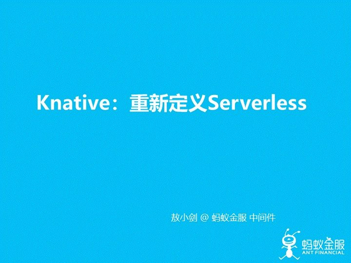

大家好，今天给大家来的演讲专题是“Knative：重新定义Serverless”, 我是来自蚂蚁金服中间件的敖小剑。

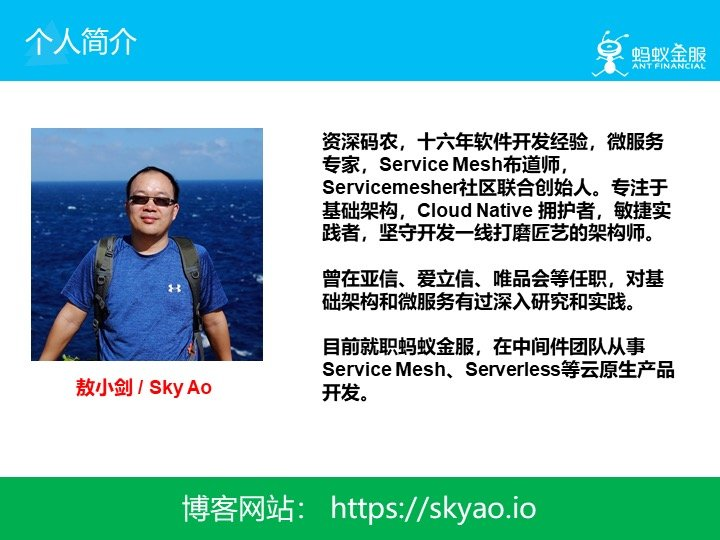

这是我的个人资料，有兴趣的同学可以关注的我的个人技术博客网站 https://skyao.io。

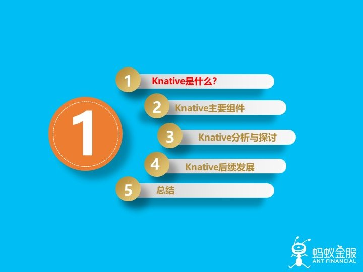

这次演讲的内容将会有这些，首先给大家介绍一下knative是什么，然后是knative的主要组件，让大家对knative有一个基本的了解。之后我会简单的对knative做一些分析和探讨，以及介绍一下knative后续的发展。希望本次的内容让大家能够对knative有一个基本的认知。

## 什么是knative？

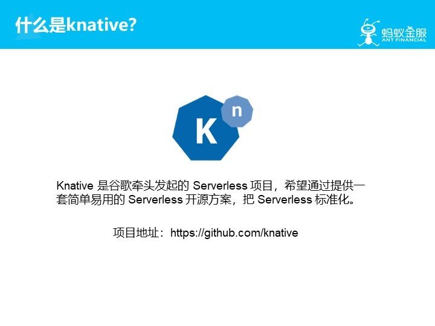

Knative是Google牵头发起的 serverless 项目。

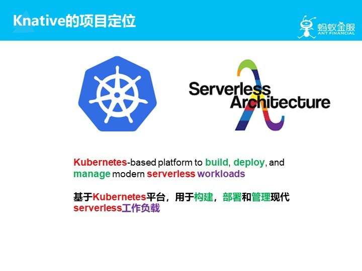

这是Knative的项目定义，注意这句话里面几个关键字：kubernetes，serverless，workload。

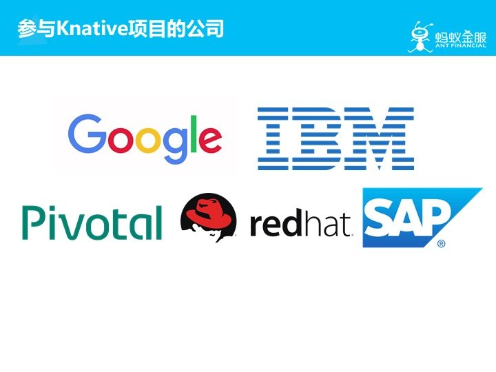

这是最近几年 Google 做大型项目的常态：产品刚出来，阵营就已经很强大了，所谓先声夺人。

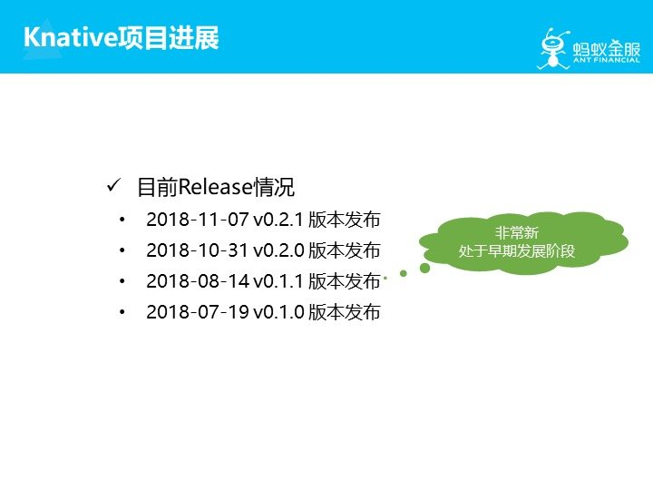

这是目前Knative项目的进展，可以看到这是一个非常新的项目，刚刚起步。

> 备注：这是截至2018-11-24演讲当天的情况，到2018年12月底，knative已经发布了v0.2.2和v0.2.3两个bugfix版本。但也还只是 0.2 ......

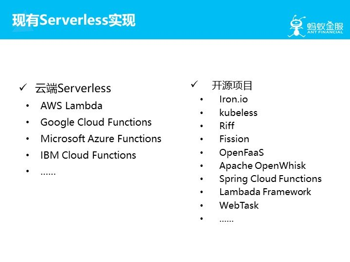

我们来看一下，在knative出来前， serverless 领域已有的实现，包括云端提供的产品和各种开源项目。

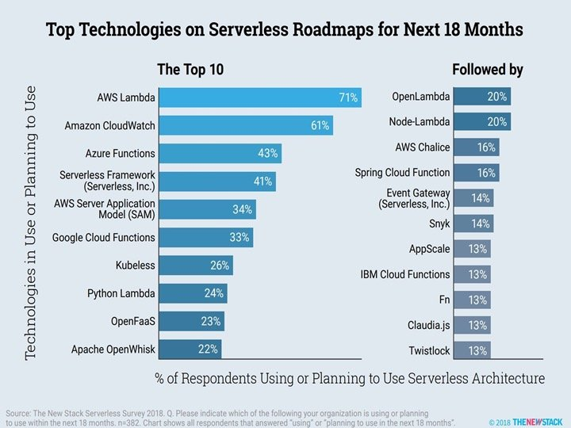

这幅图片摘自The New Stack的一个serverless 调查，我们忽略调查内容，仅仅看看这里列出来的serverless产品的数量——感受是什么？好多serverless项目，好多选择！

那问题来了：到底该怎么选？

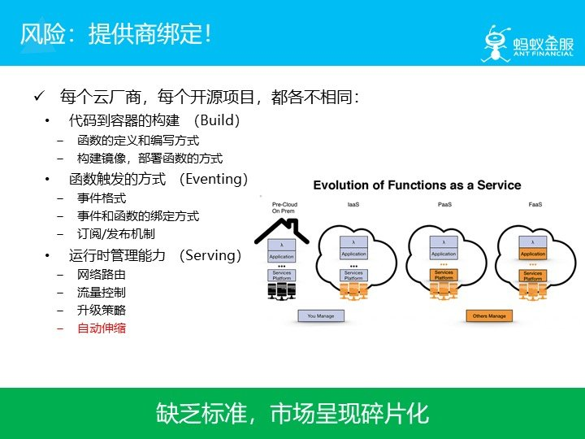

这就是目前 serverless 的问题：由于缺乏标准，市场呈现碎片化。不同厂商，不同项目，各不相同，因此无论怎么选择，都面临一个风险：供应商绑定！

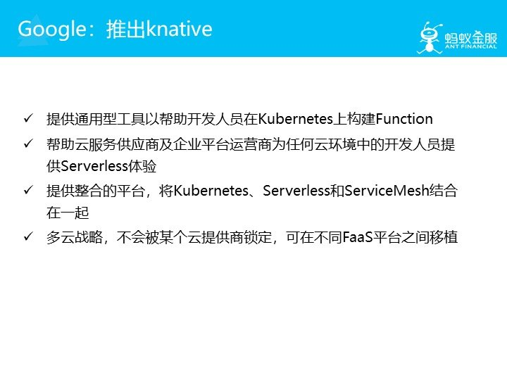

这段话来自 knative 的官方介绍，google 推出 knative 的理由和动机。其中第一条和第二条针对的是当前 serverless 市场碎片的现状。而第四条多云战略，则是针对供应商绑定的风险。

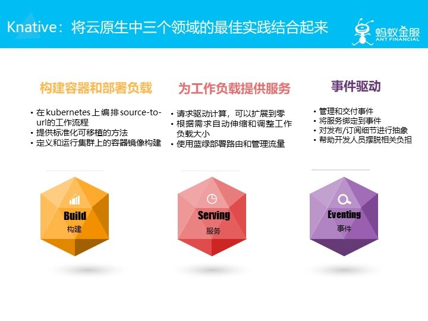

google描述knative的动机之一，是将云原生中三个领域的最佳实践结合起来。

小结：

当前 serverless 市场产品众多导致碎片化严重，存在厂商绑定风险，而 google 推出 knative ，希望能提供一套简单易用的 serverless 方案，实现 serverless 的标准化和规范化。

## Knative的主要组件

第二部分，来介绍一下knative的主要组件。

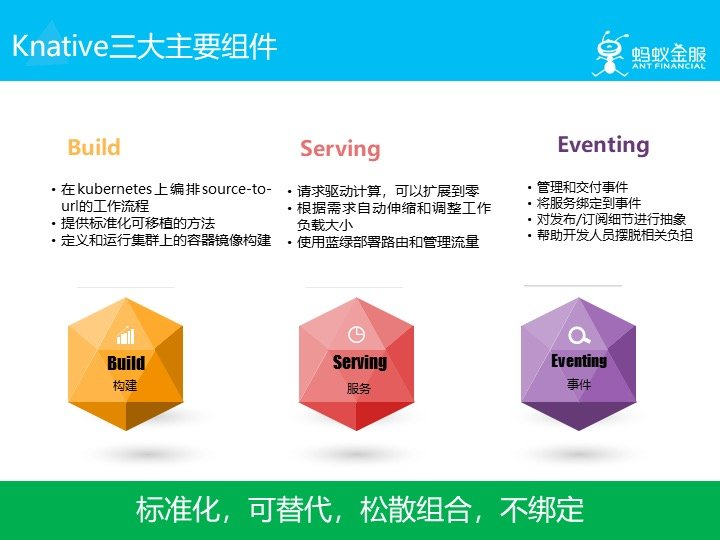

前面提到，google 推出 knative ，试图将云原生中三个领域的最佳实践结合起来。反应到 knative 产品中，就是这三大主要组件：Build，Serving，Eventing。

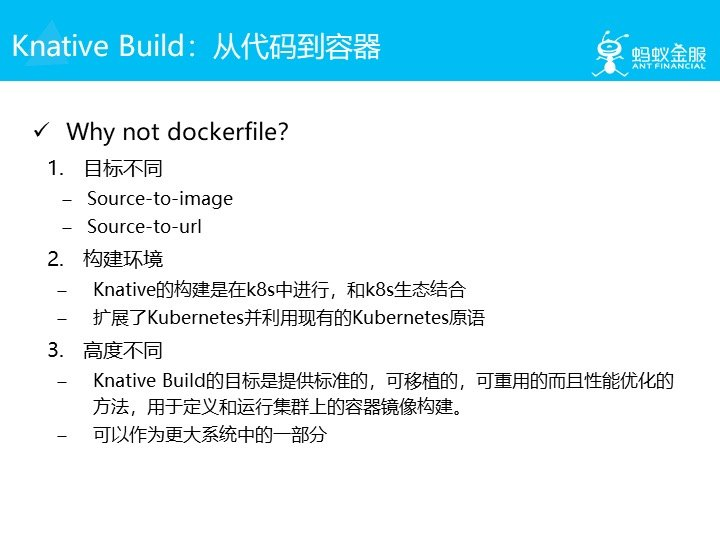

Knative Build 组件，实现从代码到容器的目标。为什么不直接使用 dockfile 来完成这个事情？

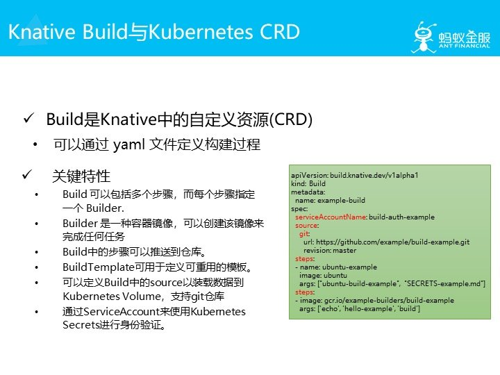

Knative Build 在实现时，是表现为 kubernetes 的 CRD，通过 yaml 文件来定义构建过程。这里引入了很多概念如：build，builder，step，template，source等。另外支持用 service account 做身份验证。

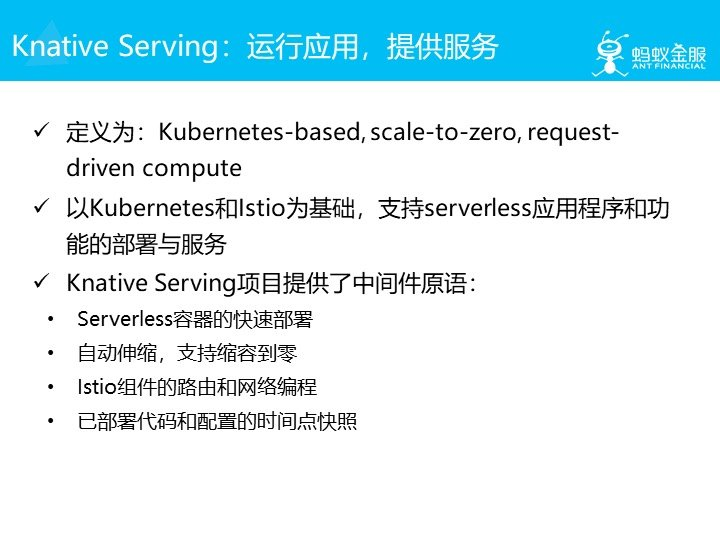

Knative Serving组件的职责是运行应用以对外提供服务，即提供服务、函数的运行时支撑。

注意定义中的三个关键：

1. kubernetes-based：基于k8s，也仅支持k8s，好处是可以充分利用k8s平台的能力
2. scale-to-zero：serverless 最重要的卖点之一，当然要强调
3. request-driven compute：请求驱动的计算

值得注意的是，除了k8s之外，还有另外一个重要基础：istio！后面会详细聊这个。

Knative Serving项目同样也提供了自己的中间件原语，以支持如图所示的几个重要特性。

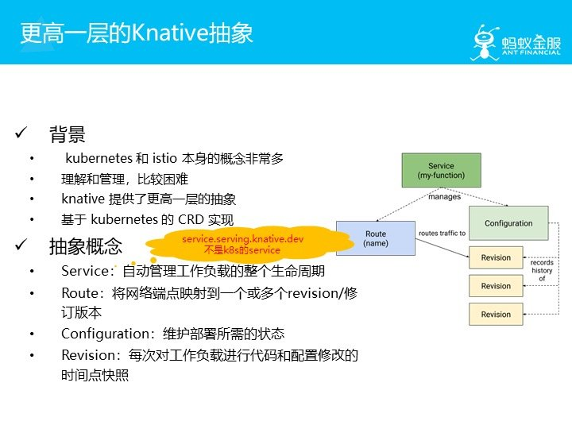

knative中有大量的概念抽象，而在这之后的背景，说起来有些意思：knative 觉得 kubernetes 和 istio 本身的概念非常多，多到难于理解和管理，因此 knative 决定要自己提供更高一层的抽象。至于这个做法，会是釜底抽薪解决问题，还是雪上加霜让问题更麻烦......

knative的这些抽象都是基于 kubernetes 的 CRD 来实现，具体抽象概念有：Service、Route、Configuration 和 Revision。特别提醒的是，右边图中的 Service 是 knative 中的 service 概念，`service.serving.knative.dev`，而不是大家通常最熟悉的 k8s 的 service。 

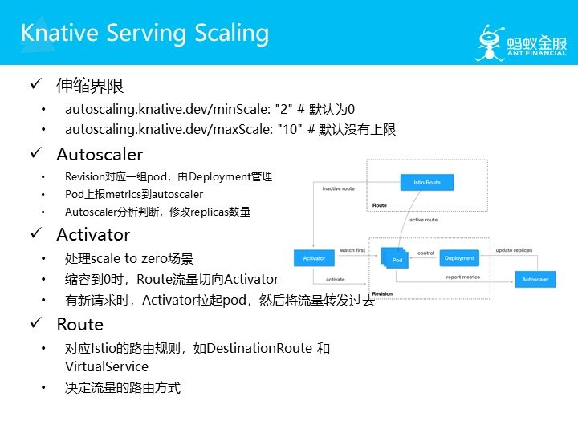

对于Knative Serving 组件，最重要的特性就是自动伸缩的能力。目前伸缩边界支持从0到无限，容许通过配置设置。

Knative 目前是自己实现的 autoscaler ，原来比较简单：Revision 对应的pod由 k8s deployment 管理，pod上的工作负载上报 metrics，汇总到 autoscaler 分析判断做决策，在需要时修改 replicas 数量来实现自动伸缩（后面会再讲这块存在的问题）。

当收缩到0，或者从0扩展到1时，情况会特别一些。knative在这里提供了名为 Activator 的设计，如图所示：

1. Istio Route 控制流量走向，正常情况下规则设置为将流量切到工作负载所在的pod
2. 当没有流量，需要收缩到0时，规则修改为将流量切到 Activator ，如果一直没有流量，则什么都不发生。此时autoscaler 通过 deployment 将 replicas 设置为0。
3. 当新的流量到来时，流量被 Activator 接收，Activator 随即拉起 pod，在 pod 和工作负载准备好之后，再将流量转发过去

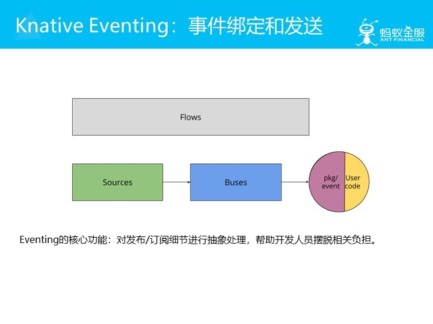

Knative Eventing 组件负责事件绑定和发送，同样提供多个抽象概念：Flow，Source，Bus，以帮助开发人员摆脱概念太多的负担（关于这一点，我保留意见）。 

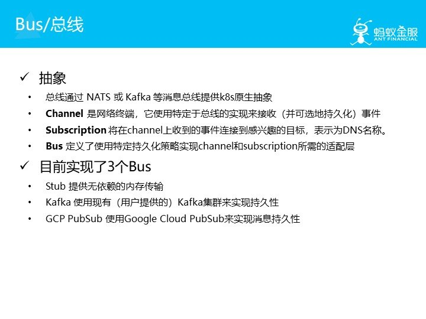

Bus 是对消息总线的抽象。

Source 是事件数据源的抽象。

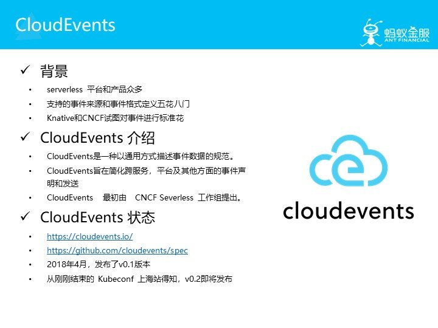

Knative 在事件定义方面遵循了 cloudevents 规范。

小结：

简单介绍了一下 knative 中的三大组件，让大家对 knative 的大体架构和功能有个基本的认知。这次就不再继续深入 knative 的实现细节，以后有机会再展开。

## Knative分析和探讨

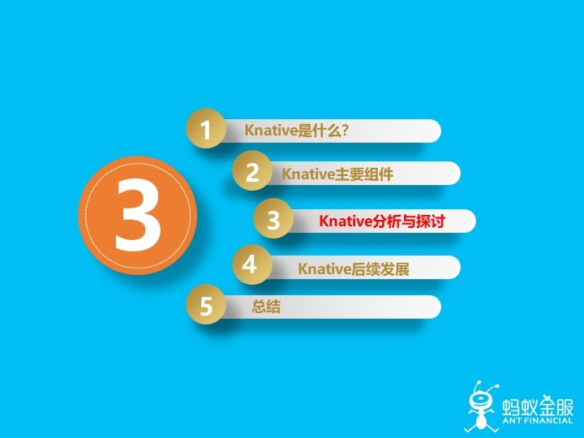

在第三部分，我们来分析探讨一下 knative 的产品定位，顺便也聊一下为什么我们会看好 knative。

首先，最重要的一点是：knative **不是**一个 Serverless 实现，而是一个 Serviceless 平台。

也就是说，knative 不是在现有市场上的20多个 serverless 产品和开源项目的基础上简单再增加一个新的竞争者，而是通过建立一个标准而规范的 serverless 平台，容许其他 serverless 产品在 knative 上运行。

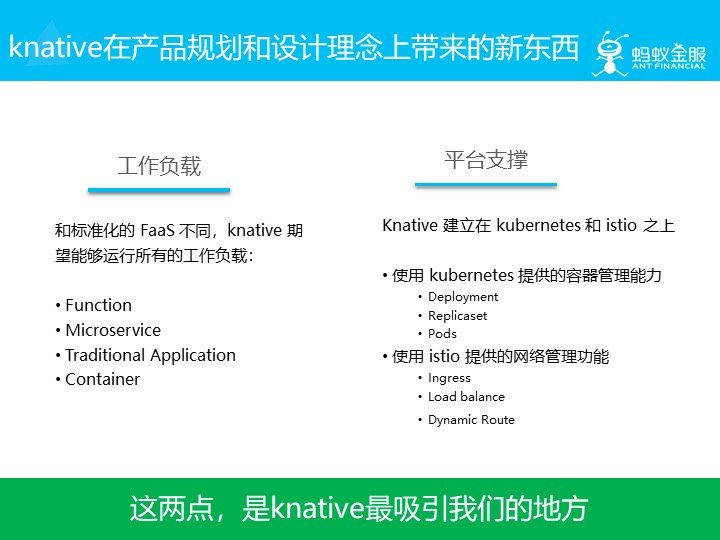

Knative 在产品规划和设计理念上也带来了新的东西，和传统 serverless 不同。工作负载和平台支撑是 knative 最吸引我们的地方。

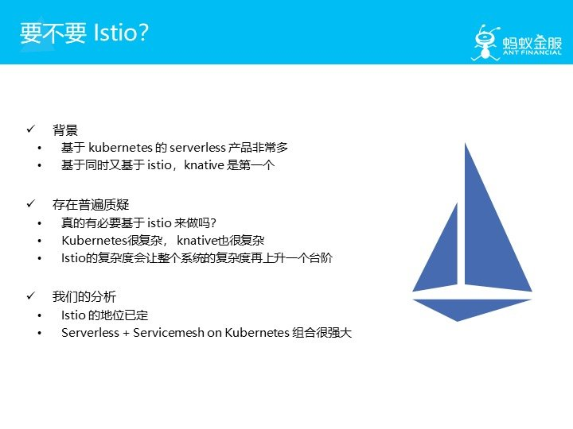

要不要Istio？这是 knative 一出来就被人诟病和挑战的点：因为 Istio 的确是复杂度有点高。而 k8s 的复杂度，还有 knative 自身的复杂度都不低，再加上 Istio......

关于这一点，个人的建议是：

- 如果原有系统中没有规划 Istio/Service mesh 的位置，那么为了 knative 而引入 Istio 的确是代价偏高。可以考虑用其他方式替代，最新版本的 knative 已经实现了对 Istio 的解耦，容许替换。
- 如果本来就有规划使用 Istio/Service mesh ，比如像我们蚂蚁这种，那么 knative 对 Istio 的依赖就不是问题了，反而可以组合使用。

而 kubernetes + servicemesh + serverless 的组合，我们非常看好。

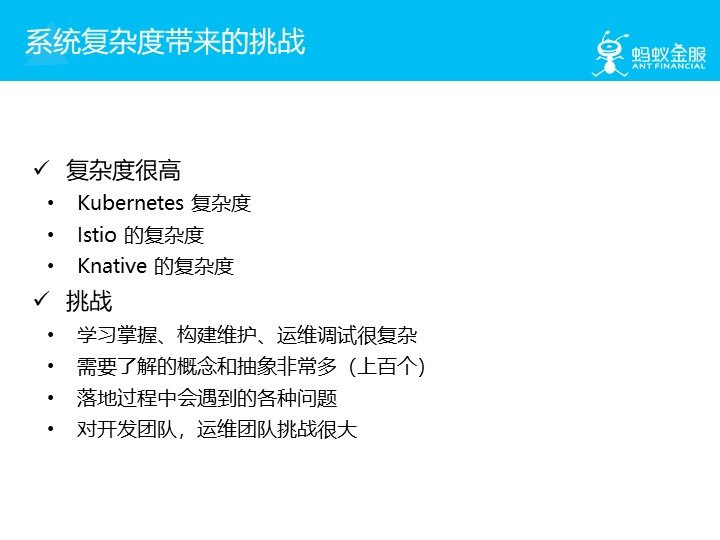

当然，knative 体系的复杂度问题是无法回避的：kubernetes，istio，knative 三者都是复杂度很高的产品， 加在一起整体复杂度就非常可观了，挑战非常大。

## Knative后续发展

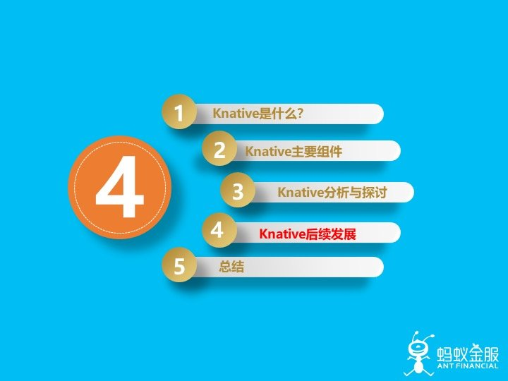

第四个部分，我们来展望一下 knative 的后续发展，包括如何解决一些现有问题。

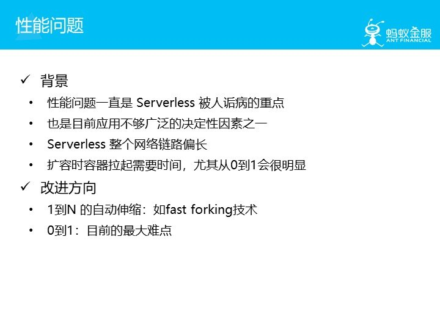

第一个问题就是性能问题。

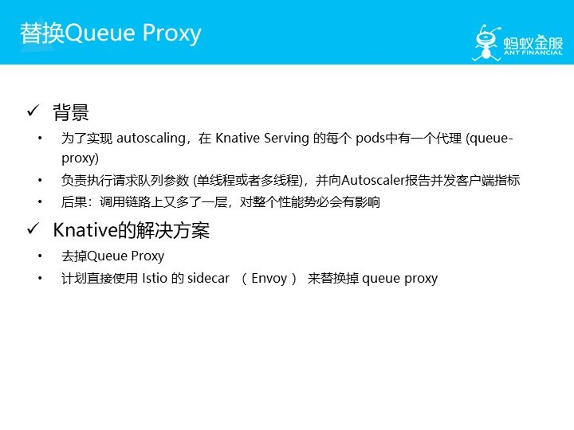

Queue Proxy也是一个现存的需要替换的模块。

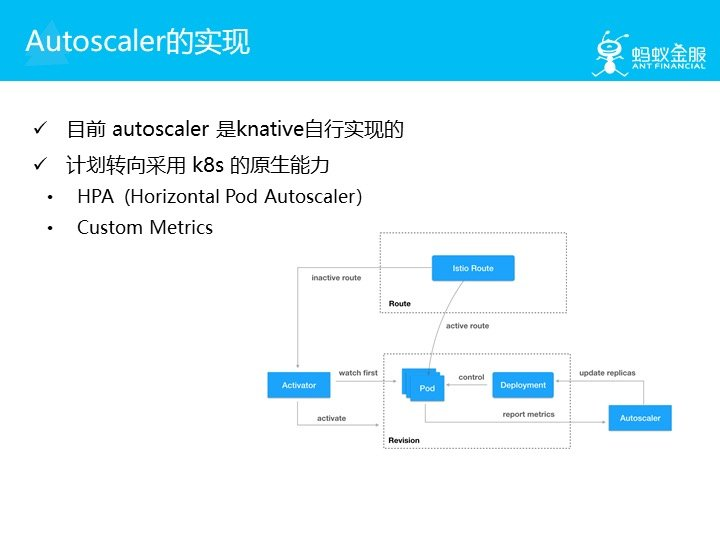

前面讲过 knative 的 Autoscaler 是自行实现的，而 k8s 目前已经有比较健全原生能力： HPA 和 Custom Metrics。目前 knative 已经有计划要转而使用 k8s 的原生能力。这也符合 Cloud Native 的玩法：将基础能力下沉到 k8s 这样的基础设施，上层减负。

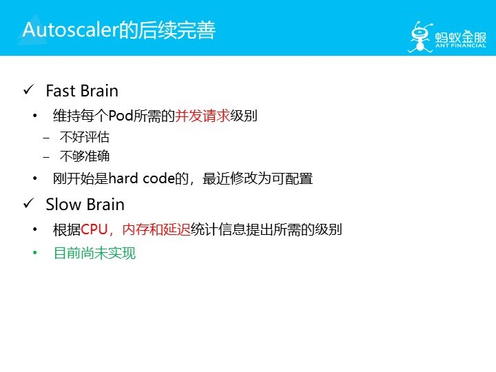

除了下沉到 k8s 之外，autoscaler还有很多细节需要在后续版本中完善。

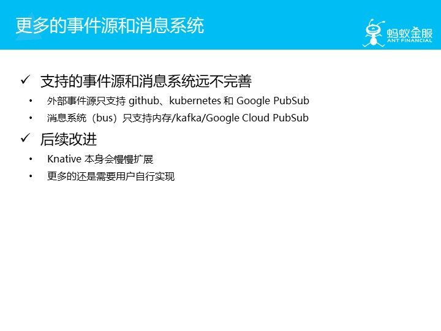

对事件源和消息系统的支持也远不够完善，当然考虑到目前才 0.2.0 版本，可以理解。

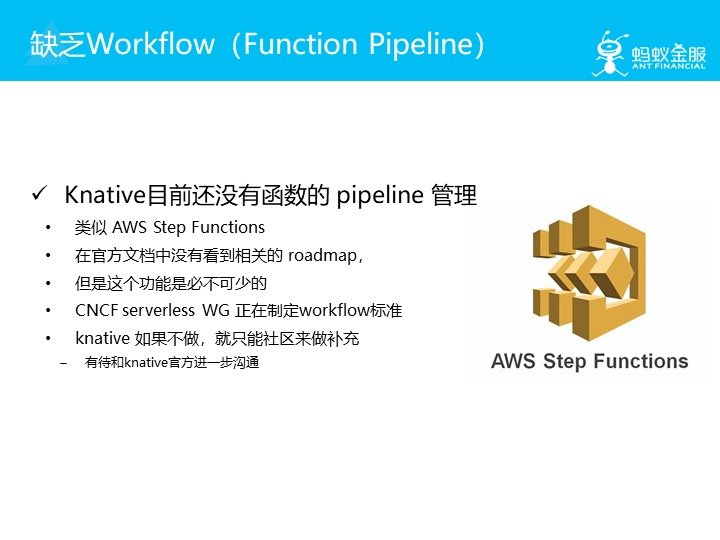

目前 knative 还没有规划 workflow 类的产品。

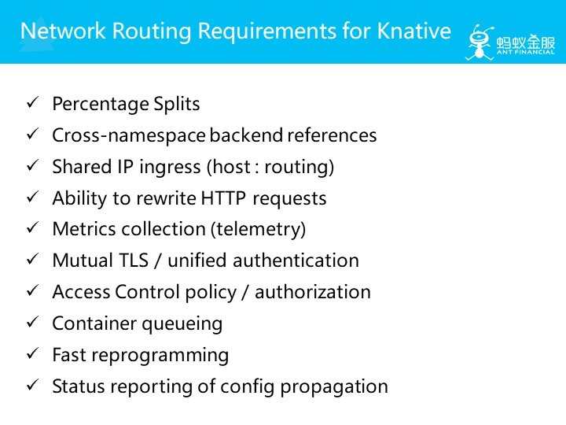

在网络路由能力方面也有很多欠缺，上面是 knative 在文档中列出来的需求列表。

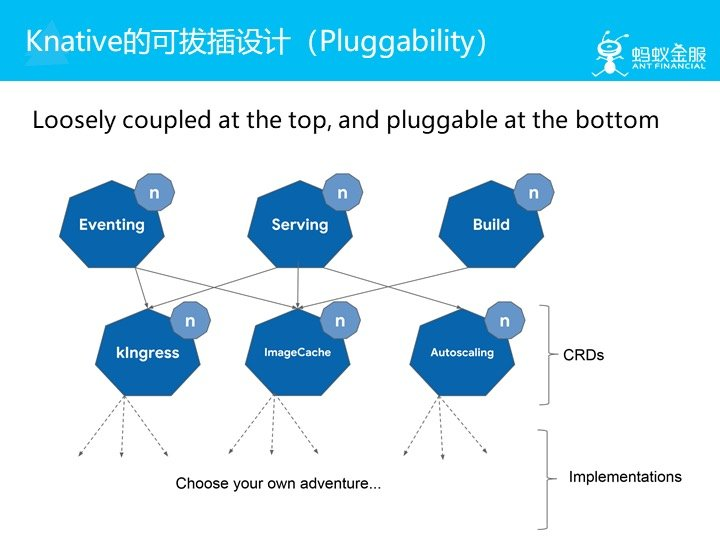

最后聊聊 knative 的可拔插设计，这是 knative 在架构设计上的一个基本原则：顶层松耦合，底层可拔插。

最顶层是 Build / Serving / Eventing 三大组件，中间是各种能力，通过 k8s 的 CRD 方式来进行声明，然后底层是各种实现，按照 CRD 的要求进行具体的实现。

在这个体系中，用户接触的是 Build / Serving / Eventing 通用组件，通过通过标准的 CRD 进行行为控制，而和底层具体的实现解耦。理论上，之后在实现层做适配，knative 就可以运行在不同的底层 serverless 实现上。从而实现 knative 的战略目标：提供 serverless 的通用平台，实现 serverless 的标准化和规范化。

## 总结

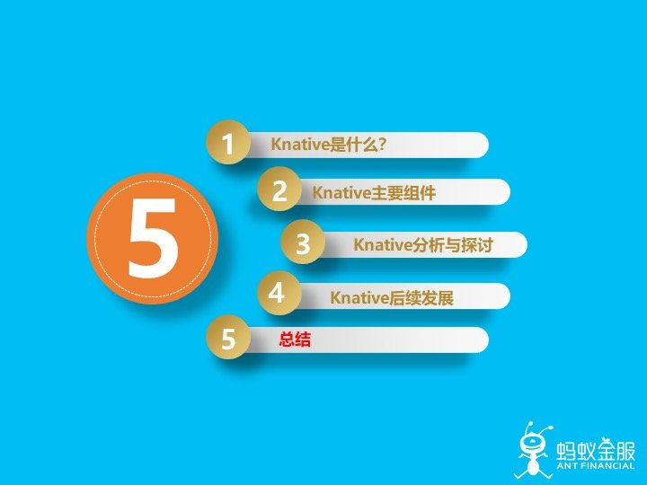

最后，我们对 knative 做一个简单总结。

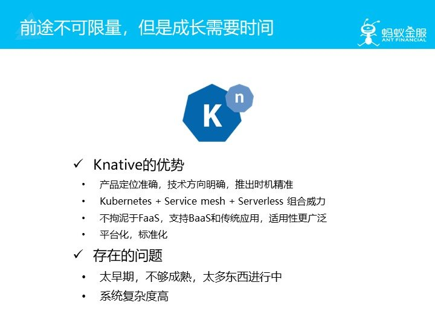

先谈一下 knative 的优势，首先是 knative 自身的几点：

- 产品定位准确：针对市场现状，不做竞争者而是做平台
- 技术方向明确：基于 k8s，走 cloud native 方向
- 推出时机精准：k8s 大势已成，istio 接近成熟

然后，再次强调：kubernetes + service mesh + serverless 的组合，在用好的前提下，应该威力不凡。

此外，knative 在负载的支撑上，不拘泥于传统的FaaS，可以支持 BaaS 和传统应用，在落地时适用性会更好，使用场景会更广泛。（备注：在这里我个人有个猜测，knative 名字中 native 可能指的是 native workload，即在 k8s 和 cloud native 语义下的原生工作负载，如果是这样，那么 google 和 knative 的这盘棋就下的有点大了。）

最后，考虑到目前 serverless 的市场现状，对 serverless 做标准化和规范化，出现一个 serverless 平台，似乎也是一个不错的选择。再考虑到 google 拉拢大佬和社区一起干的一贯风格，携 k8s 和 cloud native 的大势很有可能实现这个目标。

当然，knative 目前存在的问题也很明显，细节不说，整体上个人感觉有：

- 成熟度：目前才 0.2 版本，实在太早期，太多东西还在开发甚至规划中。希望随着时间的推移和版本演进，knative 能尽快走向成熟。
- 复杂度：成熟度的问题还好说，总能一步一步改善的，无非是时间问题。但是 knative 的系统复杂度过高的问题，目前看来几乎是不可避免的。

最后，对 knative 的总结，就一句话：**前途不可限量，但是成长需要时间**。让我们拭目以待。

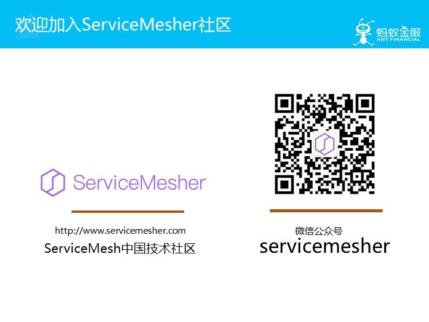

广告时间，欢迎大家加入 servicemesher 社区，也可以通过关注 servicemesher 微信公众号来及时了解 service mesh 技术的最新动态。
