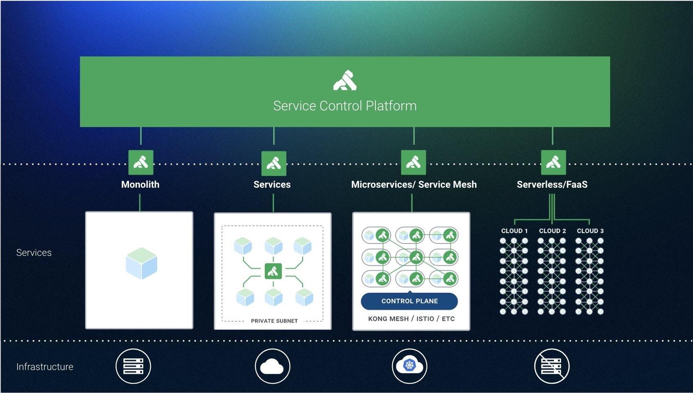

本文为翻译文章，[点击查看原文](https://thenewstack.io/kong-at-1-0-a-service-control-platform/)。

_图片：Kong公司员工们在庆祝第一届Kong Summit举办（来自Kong官方Twitter）_

[Kong](https://konghq.com/)公司的前身是Mashape，发布了其核心开源API网关的1.0版本，名字也为[Kong](https://github.com/Kong/kong) 。这是包括诺基亚、纽约​时报和哈佛大学等客户近四年生产经验的结晶。

**Kong 1.0是该公司构建服务控制平台愿景的基础，该平台结合了人工智能、机器学习和其他先进技术，可以促进信息流在服务之间的流动。**

“我们相信未来所有数据都将处于运动状态，并且将从数据池转移到系统间代理信息的地方。Kong最初是一个网关，在1.0发布之后将转型为服务控制平台，“[Geoff Townsend](https://www.linkedin.com/in / geoff-townsend-25058347 /)，Kong工程副总裁。据该公司称，截至目前，该软件已被下载4500万次。

本周在[Kong Summit 2018](https://konghq.com/kong-summit/?utm_source=pressrelease&utm_medium=referral&utm_content=1-0)上，在该公司的总部旧金山探讨了1.0里程碑以及企业级组件包括开发人员门户、Open API规范、自动生成和自动配置，这些功能将于明年初推出。

“我们希望帮助您获得服务的可见性，并能以简单的方式记录通过平台的所有内容。我们将从生产中的服务自动生成Open API规范，这将能够记录没有登记在册的服务。使用Open API规范自动配置Kong的节点，以便记录的内容与生产中的内容一致。有一个API地图能够显示实时流量的拓扑，“他说。 “Kong位于网络中的绝佳位置，所以它将能够做一系列异常检测和机器学习。”

Kong建立在Nginx反向代理服务器之上。[提供的服务](https://thenewstack.io/mashape-opens-kong-a-microservices-proxy-built-on-nginx/)中包括一个RESTful API接口，用于在注册表中注册API本身的插件平台，提供微服务常用的基础功能。

首席执行官[Augusto Marietti](https://www.linkedin.com/in/sonicaghi/)之前告诉The New Stack，“它解决了在系统中处理身份验证协议的所有问题。”

日志记录是另一个常见服务，可以使用Kong中的插件向微服务公开。

“对于那些已经使用微服务架构的人来说，Kong并没有改变服务的编排方式，但会使微服务变得更轻量，因为使用它后就可以剔除微服务中的许多常用功能，把这些功能集中到Kong中，使服务变得更轻，更易于维护，“Marietti说。

[雅虎日本](https://globenewswire.com/news-release/2018/09/13/1570542/0/en/Yahoo-Japan-Deploys-Kong-Enterprise-API-Platform-to-Improve-Service-Development-Productivity .html)最近宣布，使用单点Kong来代理所有API端点和路由流量，从而消除了为每个API的编写身份验证和授权的冗余代码。它还使用Kong的金丝雀发布功能来评估一小部分用户的版本。

Kong最近宣布[支持服务网格部署](https://konghq.com/blog/service-mesh-new-pattern-not-new-technology/)。去年在MesosCon 2017上，Kong首席技术官[Marco Palladino](https://www.linkedin.com/in/marcopalladino/)预测[API网关和服务网格之间的相似性](https://thenewstack.io/api-gateways-age-microservices/)将继续增长。

传统的API网关用于处理单体应用程序和外部客户端之间的流量，微服务架构将这些大部分流量转移到内部不同微服务之间的通信。

“你依然拥有外部客户端用例，但现在它只是微服务的所有消费者中的一个。”Palladino解释说。
