## 大会背景介绍

2019年6月24-26日，KubeCon + CloudNativeCon + Open Source Summit大会在上海世博中心举行。本次大会是由CNCF的LC3和Linux基金会的OSS两个大会合并而成的，因此规模空前甚大，估计有超过40多个国家，3000多名开发者参与会议。

由于最近两年在从事Service Mesh方面的一些工作，而本次大会中有多个关于Service Mesh和Istio/Envoy相关的议程，我向公司申请报名参加了这次大会。

会议期间上海天气很好，虽然已经是夏天，但这几天的天气并不热，大部分时间天高云淡，中间下了一场小雨。参会地点所在的世博中心在江边，旁边就是世博中国馆，景色很好。
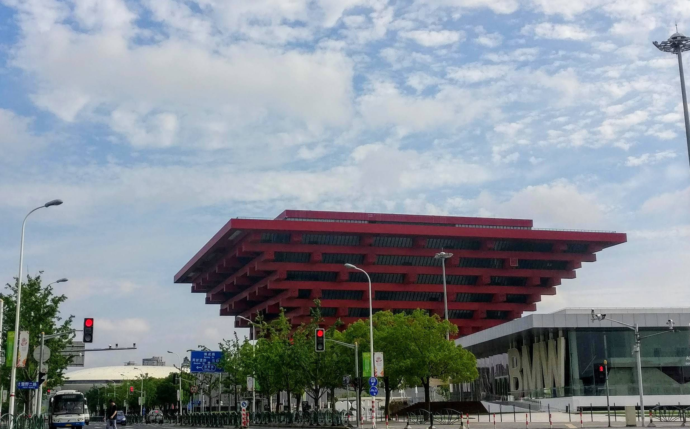

## SOFAStack Workshop

会议第一天参加了蚂蚁金服的SOFAStack Workshop。蚂蚁的同学在国内Service Mesh非常活跃，是中文Istio文档翻译和国内Service Mesh社区 <http://servicemesher.com> 的主要组织者。像小剑、Jimmy、花肉等，我之前和他们在社区中就很熟悉了，因此这次见面感觉很亲切，就像老朋友重逢一样。

可以看出蚂蚁同学为这次Workshop准备得很充分，提供给参与者的材料非常细致，每一步操作都有详细的指导。蚂蚁同学带着参与workshop的开发者使用SOFAStack在云上创建一个网上书店demo程序，demo涉及了微服务构建，动态策略，分布式事务，Serverless，CloudMesh灰度发布等主要的微服务开发和部署流程。感兴趣的同学可以从该地址查看和下载workshop的相关资料：<https://github.com/sofastack-guides/kubecon-workshop-demo-2019>

据蚂蚁的同学介绍，相比阿里系的淘宝而言，蚂蚁金服由于历史技术栈的包袱较小，在云原生这一块是跟进得比较快的，其内部策略基本上是全面拥抱云原生的技术栈，因此一些新出的热点技术如Service Mesh，Serverless等很快就会使用。

workshop参与者在蚂蚁同学的指导下创建demo
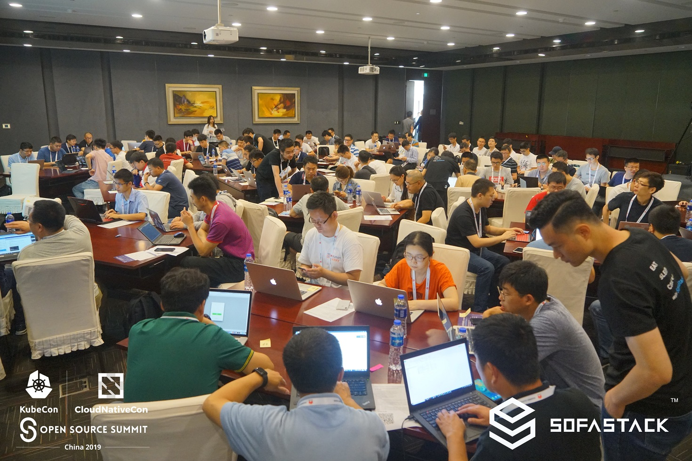

抽奖喜提蚂蚁同学编写的《未来架构-从服务化到云原生》一本
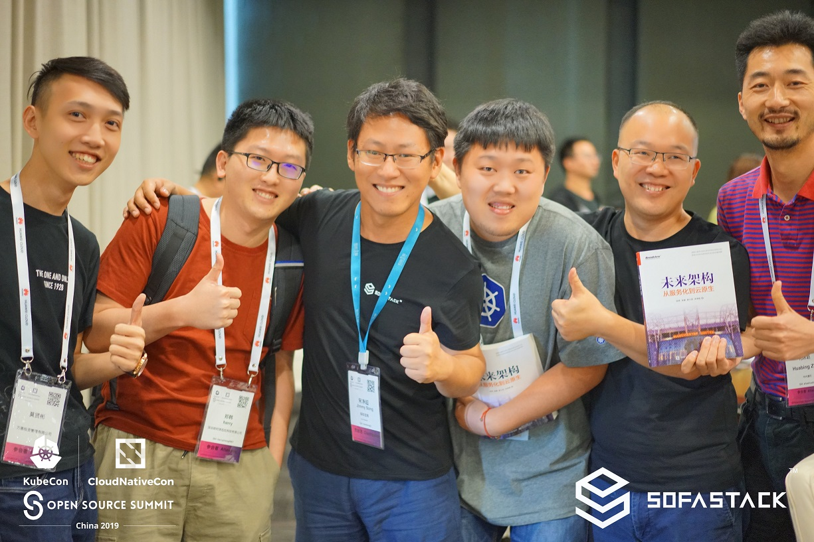

[SOFAStack Cloud Native Workshop](https://www.sofastack.tech/guides/)

[使用CloudMesh 轻松体验ServiceMesh](https://gw.alipayobjects.com/os/basement_prod/c51b71c7-5f85-40a4-9a29-6c2163ef40ba.pdf)

## Keynote

大会第二天的Keynote一直是Linux基金会宣传其理念，愿景以及赞助商进行市场宣传的重要活动。但当天最让人期待的莫过于Linus在keynote后的一次嘉宾谈话。为了一睹Linus的真容，很多人一早就在举行活动的red hall前排起了长队。我由于来得较早，非常幸运地抢到了一个较好的位置，位于第六排中间，正好正对台上的演讲嘉宾。

首先是Linux基金执行董事Jim Zemlin的开场演讲，他的演讲中提到几个重要的事实和数据：

* Linux已经成为世界上最重要的软件平台：100%的超级计算机，82%的手机，68%的企业服务器，90%的公有云负载，62%的嵌入式操作系统都运行在Linux上
* 中国已经成为第二大Kubernetes贡献者
* 开源代码通常占现代操作系统代码总量的80%-90%
* 10%的CNCF会员来自中国，在会议中，宣布了蚂蚁金服充值成为CNCF黄金会员

从他的演讲中可以感受到来自中国的公司和开发者在开源软件，特别是云原生领域中发挥了越来越重要的作用。由于中国的市场体量很大，中国公司在在使用开源软件时会面临一些国外难以遇到的问题，例如如何应对数以亿计的用户量。在解决这些问题的同时，很多中国公司也将这些优化和改进贡献到了上游项目，造福整个开源社区，形成了良性的互动和循环。从后面两天的主题演讲，我也看到中国公司，特别是阿里系在回馈上游开源社区方面是做的非常好的。

Zemlin还提到开源蓬勃发展的一个原因是因为开源不是一个零和游戏，无论是开发者，用户还是商业公司都可以从开源中获益。从开发者角度而言，积极参与开源软件可以获得就业市场上广泛认可的能力，而不是只能做一个公司的某个随时被替换的螺丝钉。从商业公司而言，参与和使用开源软件可以借助社区的力量，并且可以很容易招聘到符合自己要求的人才。从用户而言，开源加速了技术的发展，间接降低了用户获取新技术，新产品的成本。

Zemlin后面是CNCF执行董事Dan Kohn的演讲，Dan没有考虑到中国听众的文化背景，讲得比较晦涩，我没有仔细听。

然后是Huawei的赞助广告演讲，印象最深的是华为将开源方舟编译器，看得出是在为鸿蒙操作系统的生态圈布局。

最激动人心的时刻莫过于Linux上台了，Linus一上台就开了一个典型的Linus类型的玩笑：I don't like presentation, because I don't like preparing the slides and worrying about the audience's response. So I do talk instead of presentation, if it turns out well, it's my credit; if it sucks, you should blame the one who asks silly questions.

看着Linus淘气的小眼神，Dirk Hohndel的内心是崩溃的，下面的问题可不能问错了 :-)
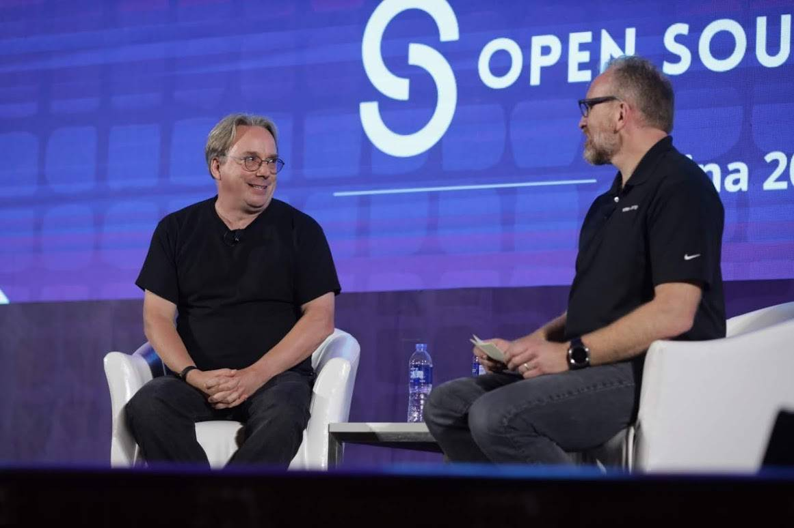

当然这只是一个玩笑而已，不过Linus的性格在这个玩笑中也体现无遗。谈话过程中的一个话题也体现了Linus这种我行我素的性格。当问到如何看待技术和市场时，Linus答到：我只关心技术，我认为如果技术够好，就能赢得市场；当然，有时候行动更快的会赢得市场；但是，I just don't care! 大牛就是霸气，按自己的兴趣而活，希望我有一天也能达到这种境界！

当被问到其它项目可以从Linux项目中借鉴哪些经验时，Linus提到了两点：

* Don't break your users 保持各个版本之间的兼容性，不要影响用户对你的信任
* Common goal 项目内要有统一的目标和共同的文化，这个目标不是一个非常具体的目标，而是一个类似愿景的长远目标

## 参加的一些Session

大会的Session非常多，我根据自己的兴趣选择性地参加了一些Session。

### Envoy的可观察性

该Session的内容本身没有太多特别之处，主要是根据HashiCorp内部使用Envoy的经验讲了Envoy提供了哪些可以用于可观察性的配置/接口。

我在会后和主讲人Nic Jackson聊了一下HashiCorp的Consul Connect项目，Consul Connect是一个支持Hybrid Cloud的Service Mesh项目，采用了Consul作为Service Registry，Envoy作为Sidecar，自己写的控制面，后面会兼容SMI(Service Mesh Interface）。

Consul connect在进行sidecar导流时没有使用IPTables，而是将所有upstream的Service全部映射到了locahost的端口上，并通过Envoy监听Localhost来实现Sidecar流量拦截。这种方式去掉了IPtables，Nic说他们目前的测试性能非常理想。

HashiCorp的方案主要是面向多云环境以及同时存在Kubernetes和VM，bare metal场景的企业用户。其方案和我们目前自己使用的方案比较类似，后面值得长期关注。如果希望了解更多Consul Connect的内容，可以关注HashiCorp的博客及网站： <https://www.hashicorp.com/blog/layer-7-observability-with-consul-service-mesh>

Nic Jackson讲解Envoy的可观察性
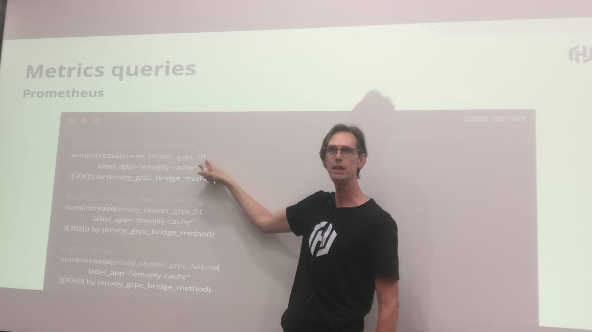

### 基于Envoy和Apache Skywalking的服务网格的可观察性

Tetrate分享了“基于Envoy和Apache Skywalking的服务网格的可观察性”。通过Envoy的ALS（Access log Service）接口直接从Envoy获取访问日志，并结合Istio对Inbound和Outbound的服务命名规则，以及Sidecar的命名规则分析出网格中服务调用的topo和Metrics信息。该方案直接去掉了Mixer，以解决目前Mixer占用资源较大，以及对服务调用的Latency等问题。该方案的思路很好，但采用了一些Hack，不是一个正式方案，希望以后能正式合入社区。

### 边缘计算的前5大问题

中国移动的一个很有意思的演讲，讲述了目前运营商在进行边缘云试点时遇到的一些实际问题。新技术在工程化时常常会遇到一些意想不到的实际问题，例如该演讲中提到的边缘机房中的电力问题。由于边缘云节点规模较小，一般不会从头创建新的机房，而是选择重用小区目前的机房，因此会遇到电源功率不足和不够稳定的问题。

我想到的另一个问题是：虽然边缘云和5G这两个词经常一起出现，但其实边缘云和5G并不是强绑定的。很多边缘云的业务场景在4G的速度和带宽下也可以实现，只要在4G网络中部署类似5G UPF的节点，将流量按一定规则导流到边缘云即可。以后会不会出现和4G网络一起部署的边缘云节点呢？

边缘云架构图
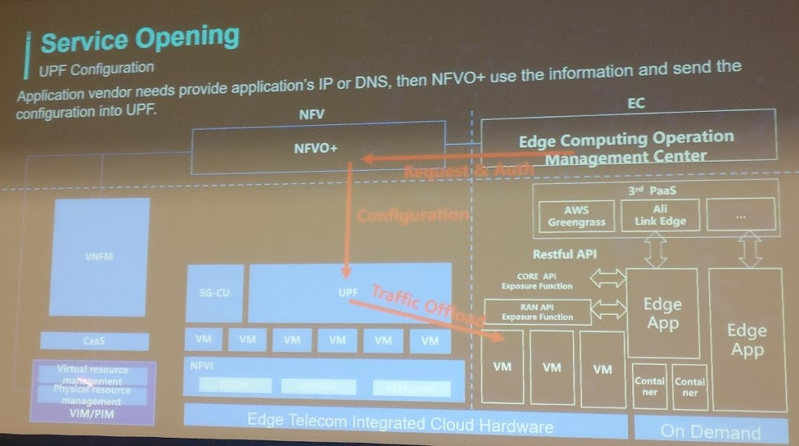

### SPIFFE如何帮助Istio建立服务网格联邦

介绍了一种多个Istio集群（或称为信任域）之间建立相互信任的机制。该机制可以解决跨集群的服务访问的身份认证问题。其基本思路是在两个信任域之间相互交换证书信息，然后使用得到的证书信息对对方的服务进行身份认证。

交换信任域之间的证书信息
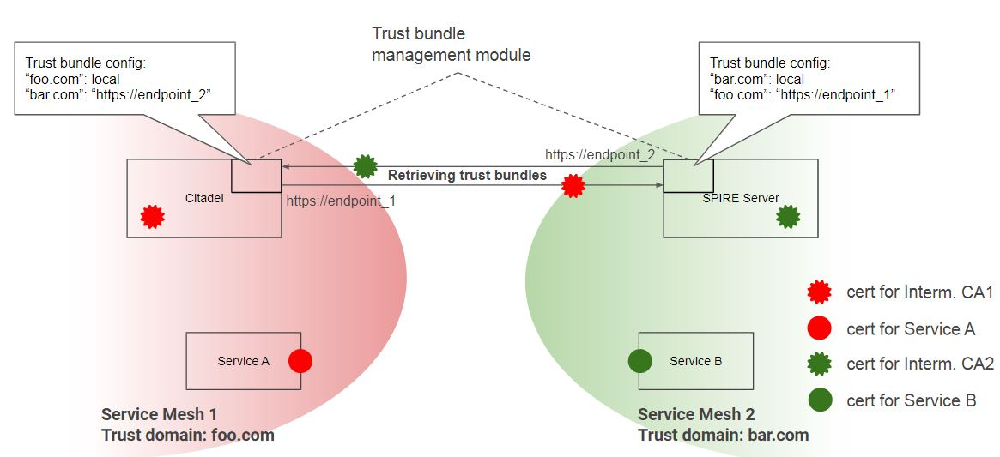

用得到的证书信息对来自另一个信任域的请求进行身份认证
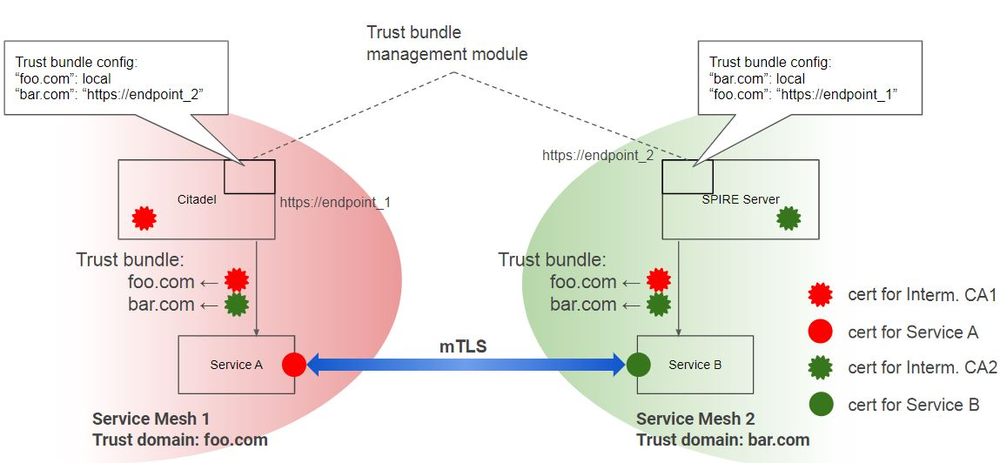

[完整PPT链接](https://gw.alipayobjects.com/os/basement_prod/9d99c849-70f5-4b9a-b7d0-d81d596f2ef0.pdf)

### IngressRoute：如何为 Kubernetes 提供更好的 Ingress 对象

介绍了Kubernetes Ingress的局限性和Contour的解决方案：采用一个新的CRD。Ingress的局限性一直为社区所诟病，Kubernetes中的Ingress只是七层代理的一个最小集合，为了解决该问题，几乎每个Ingress Controller项目都使用了自定义的扩展，包括Annotation和自定义CRD两种方式。

Session后和David Cheney交流了两个问题：

* 是否会把IngressRoute CRD中的特性贡献到Kubernetes社区，他答复说可能会在Kubernetes Ingress的下一个版本中加入部分新特性。
* Contour是否会和Istio进行集成，以支持Service Mesh的一些特性，例如路由控制等。他答复是很可能会和SMI集成，而不是直接和Istio绑定。

其实各个具体的产品对Ingress的要求各不相同，如何在Kubernetes自身API的简洁性和产品要求的功能实用性之间进行平衡是一个难题，因此该问题应该还会存在很长时间。我的建议是采用一个API Gateway + Sidecar 来代替 Kubernetes Ingress，参见我之前的文章[如何为服务网格选择入口网关？](https://zhaohuabing.com/post/2019-03-29-how-to-choose-ingress-for-service-mesh/)

[完整PPT链接](https://gw.alipayobjects.com/os/basement_prod/f3d52428-06ab-424f-9fab-791dce0183fe.pdf)

## 其它

### 大会上的job board

会场上专门设立了一面job board，可以在上面张贴求职信息或者招聘信息。从内容来看，大部分是和云原生相关的工作岗位，集中在北上深地区。找了很久，没有看到成都的招聘信息，看来成都虽然是西南IT行业的中心，但离北上深还是有不小差距。

从这位同学的发量来看，他应该可以找到一个好工作。
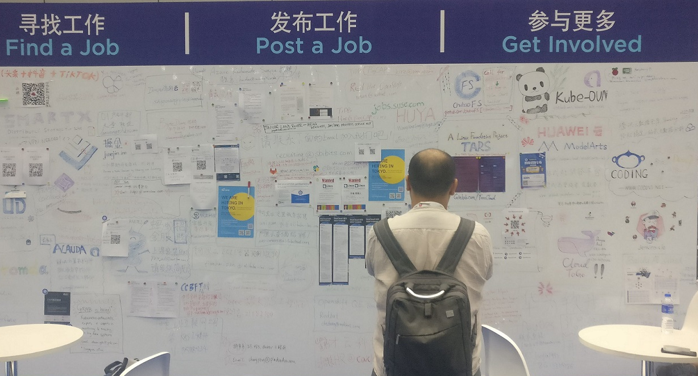

### ServiceMesher社区的朋友

这次大会上见到了很多在ServiceMesher社区中聊过多次，但未曾谋面的朋友，包括小剑，Jimmy，崔总，超盟,fox ...等等, 还有好些以前不认识的同学主动过来给我打招呼说看过我的博客文章。非常高兴能有机会见到这些志同道合的朋友，也希望我们的ServiceMesher社区能越办越好，冲出中国，走向全球!（已经遇到读过我文章的外国朋友向我打听ServiceMesher社区了，他的原话是：Would you agree to say that this is the only place where such in depth material is available?)

ServiceMesher社区的朋友们
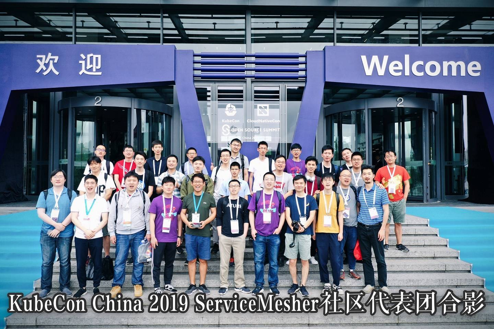

### 恩格斯也来搞Kubernetes了！

最后一天中午时，大会的各个厂商开始陆陆续续拆展台了。我领了一个盒饭坐在展馆门口的台阶上吃，旁边一个国外的参会者在等他的朋友，我就和他聊了两句。他来自德国汉堡，是一个服装公司的IT工程师。目前他们公司正在向云上迁移，使用了Private cloud/public cloud的hybrid方案。前端的Web服务器放在AWS上，后端的业务应用放在公司的数据中心，采用VPN连接数据中心和AWS。从他们公司的案例可以看出，混合云方案将在非常长的时间内存在，也难怪在展会上看到了多家做多云管理服务的公司。

聊了一会儿后，他指着自己胸牌上的名字问到，你知道恩格斯吗？我一时还没有回过神来，他又问了一次，你知道恩格斯吗？他在中国很有名的。我这才想起，问到：是那个搞共产主义的恩格斯吗？他兴奋地说，是的，他是我曾曾曾祖父的侄子。What a small world！没想到恩格斯家族也来搞Kubernetes了。不过Kubernetes的理念和恩格斯、马克思提出的那个世界大同的理想是不是也很相似呢？

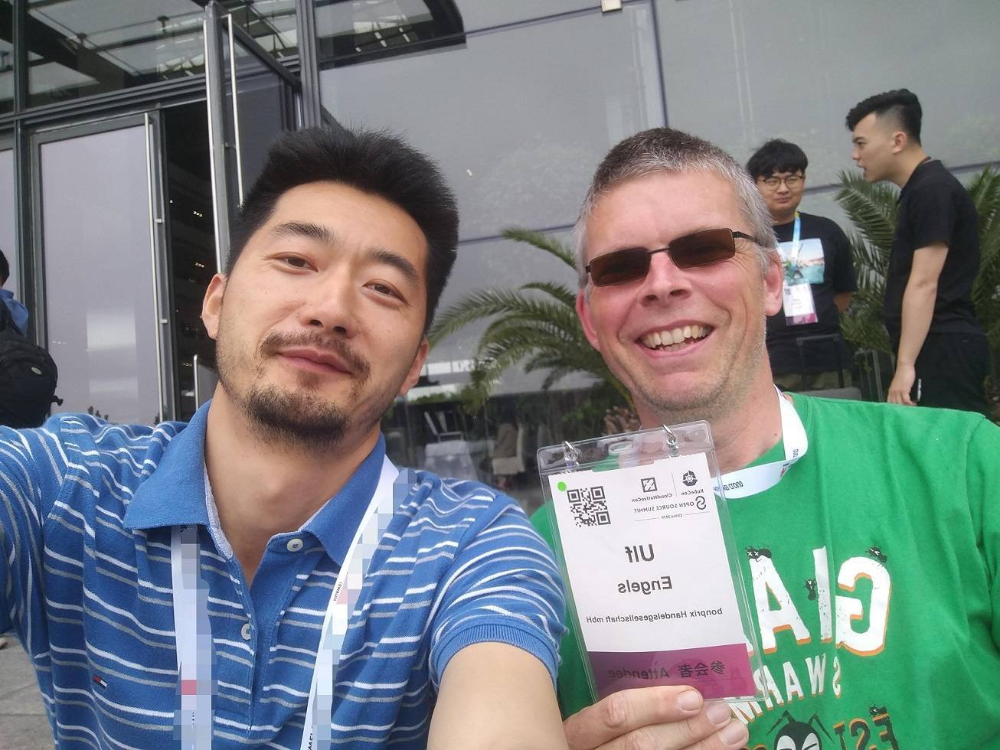

## 参会的几点感想

* Kubernetes已经成为云上的标准，Cloud Native正当时：这个观点是阿里在演讲中提出来的，我非常赞同。从这次大会的参展厂商和技术分享中可以看到，几乎所有的云厂商/运营商/企业都已经采用了容器和Kubernetes，并且在积极推进Service Mesh等云原生技术栈的实践和运用。
* Service Mesh已经从去年的概念阶段逐渐进入试商用阶段，并且成为各大云平台基础设施的一部分。
* 由于多厂商竞争和对hybrid cloud的支持要求，SMI（Service Mesh Interface）得到了较多支持，虽然目前还不成熟，但估计在下半年到明年会逐渐成熟并形成生态，到时Istio也不得不加入SMI并对其进行兼容。
* 对于中小企业而言，hybrid cloud是一个强需求。需要用一个统一的界面来屏蔽差异，共同管理private/public/multi cloud。
