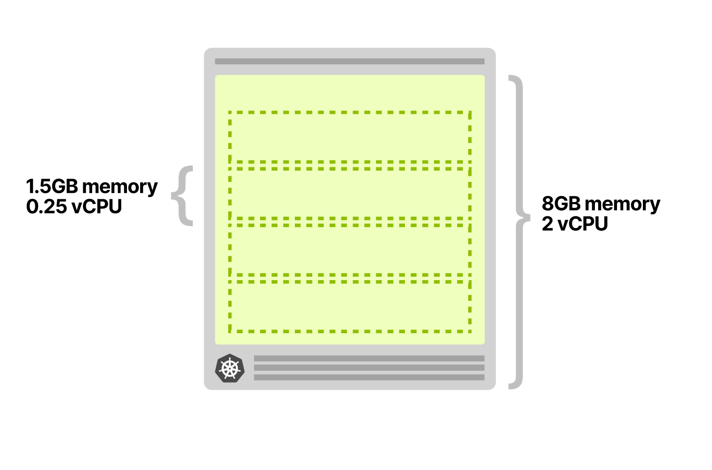
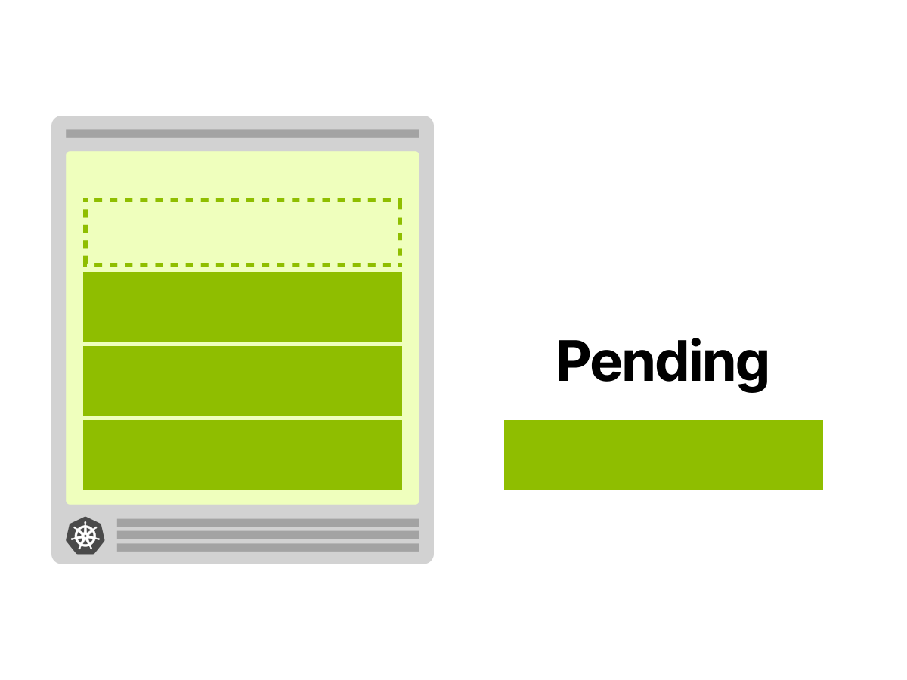
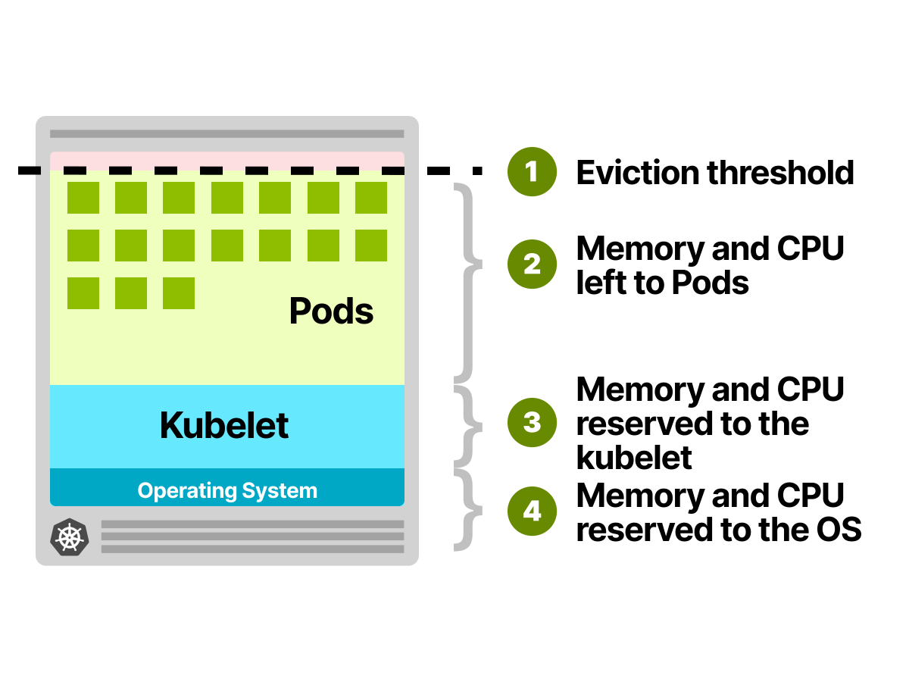
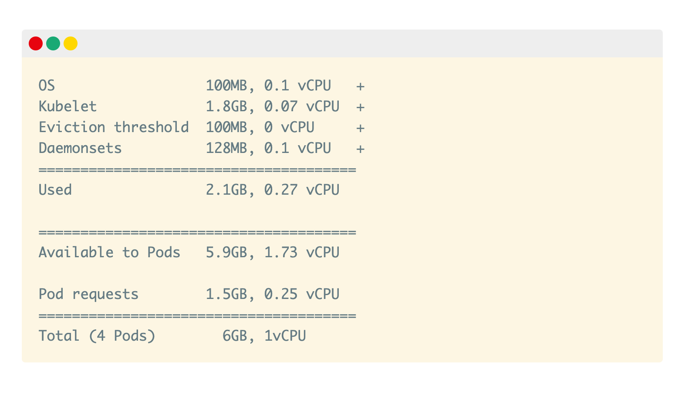

## 前言

TODO

## 目录

- [当自动伸缩的 Pod 报错](#当自动伸缩的-Pod-报错)
- [Kubernetes 的 Cluster Autoscaler 是如何工作的](#Kubernetes-的-Cluster-Autoscaler-是如何工作的)
- [探索 Pod 自动伸缩提前期](#探索-Pod-自动伸缩提前期)
- [为 Kubernetes 节点选择最佳实例大小](#为-Kubernetes-节点选择最佳实例大小)
- [在 Kubernetes 集群中过度配置节点](#在-Kubernetes-集群中过度配置节点)
- [为 Pod 选择正确的内存和CPU资源](#为-Pod-选择正确的内存和CPU资源)
- [关于集群的缩容](#关于集群的缩容)
- [为什么不基于内存或CPU进行自动伸缩](#为什么不基于内存或CPU进行自动伸缩)

在 Kubernetes 中, 自动伸缩功能包括:
- [Pod水平自动伸缩（Horizontal Pod Autoscaler，HPA）](#Horizontal-Pod-Autoscaler)
- [Pod垂直自动伸缩（Vertical Pod Autoscaler，VPA）](#Vertical-Pod-Autoscaler)
- [集群自动伸缩（Cluster Autoscaler，CA）](#Cluster-Autoscaler)

这些自动伸缩组件属于不同的类别，关注点也不同。

Horizontal Pod Autoscaler 负责增加 Pod 的副本数量。随着你的应用接收到的流量越来越多，你可以让自动伸缩组件调整副本数量来处理更多的请求。

Vertical Pod Autoscaler 的使用场景是，当资源不足无法创建更多的 Pod 副本时，而又仍然需要处理更多的流量。
一个简单的例子，你无法通过简单地添加更多的 Pod 副本来扩容数据库。数据库可能需要进行数据分片或者配置只读节点。
但你可以通过增加内存和CPU资源来让数据库能够处理更多的连接数。
这正是 VPA 的目的，增加 Pod 的资源大小。

最后，我们要说说集群自动伸缩组件了。
当你的集群资源不足时，Cluster Autoscaler 会配置一个新的计算单元并将其添加到集群中。如果空节点过多，会移除它们以降低成本。

虽然这三个组件都 “自动伸缩” 了一些东西，但它们并不造成相互之间的干扰。它们各自都有自己使用场景，定义和工作机制。并且它们是在独立的项目中开发的，独立的使用。
然而，更重要的是，为了最好的 scaling 你的集群，你必须花些心思去设置好这些 Autoscaler，让我们看个例子。

## 当自动伸缩的 Pod 报错

想象一下，有一个应用程序始终需要并使用 1.5GB 内存和 0.25 个 vCPU。
你配置了一个具有 8GB 和 2 个 vCPU 的单个节点的集群 —— 它应该能够完美地容纳四个 pod（并且还有一点额外的空间）。

现在，你部署了一个 Pod 并且配置如下：
1. HPA 配置每 10 个请求进来就添加一个 Pod 副本（例如：如果有 40 个并发请求涌入，会扩容到 4 个 Pod 副本）。
2. CA 配置在资源不足时，创建更多的 Node 节点。

> HPA 可以通过在 deployment 文件中使用 Custom Metrics（例如在 Ingress Controller 中的 queries per second（QPS）） 来扩容 Pod 副本数量。

现在，你开始为集群增加 30 个并发请求，并观察一下情况：
1. HPA 开始扩容 Pod。
2. 创建了两个 Pod 副本。
3. CA 没有触发 - 没有新增集群 Node 节点。

这很好理解，因为现在有足够的内存和 CPU 资源来支持更多的 Pod。

你进一步将流量增加到 40 个并发请求，并再次观察：
1. HPA 又创建了一个 Pod。
2. 这个 Pod 是 pending 状态并且无法被部署。
3. CA 触发创建了一个新的 Node 节点。
4. 新 Node 节点启动 4 分钟后开始工作。之后，pending Pod 也成功被部署了。

为什么第四个 Pod 没有部署在第一个 Node 节点上呢？
Pod部署在集群上需要消耗内存，CPU，硬盘空间等资源，在同一个 Node 上，操作系统和 kubelet 组件也需要消耗内存和 CPU 资源。
Kubernetes 中一个 Worker Node 节点的内存和 CPU 等资源使用分布如下：
1. 需要运行操作系统和一些系统级的守护进程，例如 SSH，Systemd 等。
2. 需要运行 Kubernetes Agent 组件，例如 Kubelet，Container Runtime，[Node Problem Detector](https://github.com/kubernetes/node-problem-detector) 等。
3. 需要运行 Pod。
4. 需要保留一些资源用来[驱逐阀值](https://kubernetes.io/docs/tasks/administer-cluster/reserve-compute-resources/#eviction-thresholds) 之用。

你猜的没错，所有这些配额都是可定制的，但你需要好好计算一下。

在一个 8GB 内存和 2vCPU 的单个节点的，可以按如下估算：
- 操作系统运行大概需要 100MB 内存和 0.1vCPU。
- kubelet 运行大概需要 1.8GB 内存和 0.07vCPU。
- 驱逐阀值大概需要 100MB 内存。

剩余的大约 6GB 内存空间和 1.83vCPU 是提供给 Pod 使用的。

如果你的集群需要运行 DaemonSet 资源，像 kube-proxy，那么你应该进一步减少提供给 Pod 的资源。考虑到 kube-proxy 大概需要 128MB 内存和 0.1vCPU，那么剩余大约 5.9GB 内存空间和 1.73vCPU 是提供给 Pod 使用的。

另外，如果还需要运行 CNI 组件（例如：Flannel）和日志收集组件（Flentd），又会进一步减少提供给 Pod 的资源。

在统计完所有其他的资源占用情况后，集群的剩余空间就只够运行三个 Pod 了。

所以第四个会一直保持 “pending” 状态，直到它被调度到其他的 Node 节点上。

既然 Cluster Autoscaler 知道没有空间容纳第四个 Pod，为什么不提前配置一个新节点？
为什么它要在 Pod 处于 “pending” 状态之后再触发创建新 Node 节点的操作？

## Kubernetes 的 Cluster Autoscaler 是如何工作的
