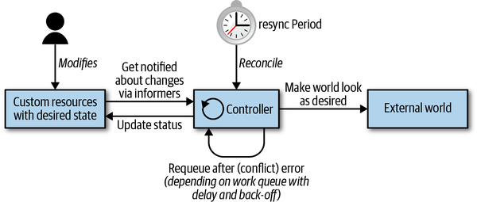
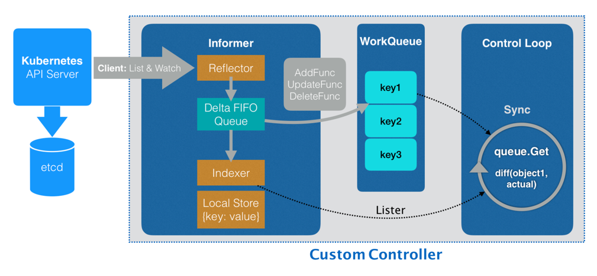
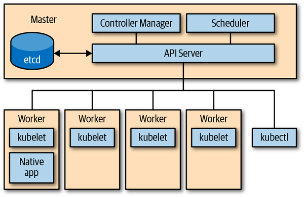
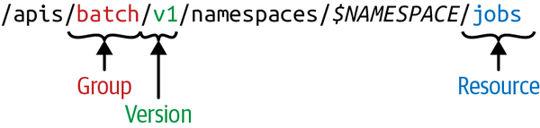
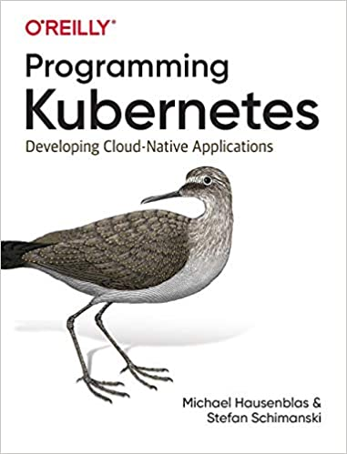

Kubernetes 诞生至今已经 5 年了，火爆整个社区，大家对 Kubernetes 越来越熟悉，越来越了解。但现阶段很多人都是熟练使用 Kubernetes，甚至我们会自嘲为 “YAML 工程师”。

可是随着各类云原生应用的出现、Operator 理念的推广、深入维护 Kubernetes 的需求下，仅仅做一个 "YAML 工程师" 已经不能满足老板的要求了。需要我们进一步了解 Kubernetes 是如何实现的，该怎么扩展 Kubernetes。

我在这样的场景下，开始学习 Kubernetes 编程，在这里总结了我学习到的 Kubernetes 编程的基础知识，让大家对 Kubernetes 编程有个大致的了解。

## 基于 Kubernetes 编程

什么叫做基于 Kubernentes 编程呢？回想一下，我们以前听过基于 Linux 编程，基于 Windows 编程，可以放在‘基于’后面的都是通用标准的平台。基于 Kubernetes 编程有着相同的概念，Kubernetes 经过 5 年的高速发展，已经成为了容器编排调度框架的标准，直接将之定义为 “云原生操作系统” 也不为过。

基于 Kubernnetes 编程可以定义为，开发一个 Kubernetes-native 应用，它直接与 K8S API Server（K8S 的一个核心组件，后面会介绍）交互，查询资源的状态或更新状态。

为什么要基于 Kubernetes 编程呢？大多数基于 Kubernetes 编程的服务都属于 PaaS 层的能力，PaaS 将服务抽象成应用进行分发部署管理，并且对应用屏蔽底下 IaaS 的复杂度。PaaS 层是在 Kubernetes 诞生之前就存在的，在 Kubernetes 环境下以前很多 PaaS 层的应用都需要进行改造迁移，或者被云原生时代的新应用代替，随之诞生了服务网格、Operator 等云原生产物。

这些需求都是要基于 Kubernetes 编程来实现的，因此掌握 Kubernetes 编程是做云原生开发，PaaS 平台的必备基础。

学习 Kubernetes 编程后会对 Kubernetens 的各个组件有更加深刻的认知。比如你了解了 `controller 架构模式 ` 后就会知道（以下说法并不严谨，只列出组件中的部分功能）:

* kube-proxy 是 Service 资源和服务发现负载之间的协调控制器。
* kubelet 是 Pod 资源和容器运行时之间的协调控制器。

了解 API Server 的架构后就知道， kubectl 其实是高级定制版的 curl 工具。

## 扩展模式

Kubernetes 是一个强大的并且内聚的可扩展系统。
常用的有如下扩展点：

* 二进制 `kubelet` 插件，如 [网络 (CNI)](https://github.com/containernetworking/cni)、[设备](https://kubernetes.io/docs/concepts/extend-kubernetes/compute-storage-net/device-plugins/)、[存储 (CSI)](https://github.com/container-storage-interface/spec/blob/master/spec.md)、[容器运行时 (CRI)](https://github.com/kubernetes/community/blob/master/contributors/devel/sig-node/container-runtime-interface.md)
* 二进制 `kubectl` [插件](https://kubernetes.io/docs/tasks/extend-kubectl/kubectl-plugins/)
* API server 中的访问扩展，例如 webhooks 的动态准入控制
* 自定义资源（CRD）和自定义 controller
* 自定义 API servers
* 调度器扩展，例如使用 [webhook](https://github.com/kubernetes/community/blob/master/contributors/design-proposals/scheduling/scheduler_extender.md) 来实现自己的调度决策
* 通过 webhook 进行 [身份验证](https://kubernetes.io/docs/reference/access-authn-authz/authentication/#webhook-token-authentication)

Kubernetes 提供了很强的扩展能力，其本身的很多组件也是使用了这种扩展能力来实现的。`controller` 模式是 Kubernetes 编程中通用性最强，使用最多的扩展能力。

Controller 实现控制循环，通过 API Server 监听集群的共享状态，根据资源的当前状态做出反应更改真实世界，使将资源更接近期望状态。

### 控制循环 The Control Loop

所有的控制器都按照以下逻辑运行:

1. 由事件驱动来读取资源 (resources) 的状态 (state)。
2. 更改集群内或集群外对象的状态 (state)。比如，启动一个 Pod，创建 Endpoint。
3. 通过 API server 更新步骤 1 中的资源状态（status），存储到 etcd 中。
4. 重复循环，返回步骤 1。

  
&ensp;&ensp;&ensp;&ensp;引用自《Programming Kubernetes》

### 控制器组件

从架构的角度来看，Controller 通常使用一下数据结构:

  
&ensp;&ensp;&ensp;&ensp;引用自 “深入剖析 Kubernetes”

* Informers
  从 Kubernetes API Server 里监听它所关心的对象状态，Informer 与 API 对象是一一对应的。
* Reflector
  连接 APIServer，使用 ListAndWatch 方法，获取并监听 API 对象实例的变化。 变化事件及对应的 API 对象，被称为为增量，放进 Delta FIFO Queue。
* Delta FIFO Queue
  存放事件数据
* Store
  对象在本地的缓存
* Indexer
  查询与索引本地缓存的数据结构
* ResourceEventHandler
  在初始化时将事件类型对应的处理函数注册到 Informer，当事件触发时，由 Informer 调用 Handler
* Work queues
  在执行周期里 (processNextWorkItem)，从工作队列 (workqueue) 中获取一个对象来处理。 event handler 可以通过它来排队或重试状态变化处理任务。
  资源在处理中遇到错误时可以被重新入队 (requeued)。

### 事件 Event

Kubernetes 控制平面大量使用事件和松散耦合的组件。 其他分布式系统常使用远程调用（RPC）来触发行为。 但 Kubernetes 并没有这么做。Kubernetes controller 监听 API server 中 Kubernetes 对象的操作：添加，更新和删除。 当发生此类事件时，controller 将执行其业务逻辑。

例如，为了通过 deployment 来启动 pod，就涉及到许多 controller 和其他控制平面组件协同工作：

1. Deployment controller（在 kube-controller-manager 内部）感知到（通过 deployment informer）用户创建了一个 deployment。根据其业务逻辑，它将创建一个 replica set。
1. Replica set controller（同样在 kube-controller-manager 内部）感知到（通过 replica set informer）新的 replica set 被创建了。并随后运行其业务逻辑，它将创建一个 pod 对象。
1. Scheduler（在 kube-scheduler 二进制文件内部）——同样是一个 controller，感知到（通过 pod informer）pod 设置了一个空的 spec.nodeName 字段。根据其业务逻辑，它将该 pod 放入其调度队列中。
1. 与此同时，另一个 controller kubelet（通过其 pod informer）感知到有新的 pod 出现，但是新 pod 的 spec.nodeName 字段为空，因此与 kubelet 的 node name 不匹配。它会忽视该 pod 并返回休眠状态（直到下一个事件）。
1. Scheduler 更新 pod 中的 spec.nodeName 字段，并将该字段写入 API server，由此将 pod 从工作队列中移出，并调度到具有足够可用资源的 node 上。
1. 由于 pod 的更新事件，kubelet 将被再次唤醒，这次再将 pod 的 spec.nodeName 与自己的 node name 进行比较，会发现是匹配的，接着 kubelet 将启动 pod 中的容器，并将容器已启动的信息写入 pod status 中， 由此上报给 API server。
1. Replica set controller 会感知到已更新的 pod，但并不会做什么。
1. 如果 pod 终止，kubelet 将感知到该事件，进而从 API server 获取 pod 对象，并把 pod status 设置为 “terminated”，然后将其写回到 API server。
1. Replica set controller 会感知到终止的 pod，并决定必须更换此 pod。它将在 API server 上删除终止了的 pod，然后创建一个新的 pod。
1. 依此类推。

许多独立的控制循环只通过 API server 上对象的变化进行通信，这些变化通过 informer 触发事件。

书中第一章后面还介绍了事件驱动对应 I/O 模型选择，如何处理并发，Operator 等话题，参考后面给出的 [推荐阅读](# 推荐阅读) 继续阅读。

I/O 模型的相关知识可以额外阅读《Linux/UNIX 系统编程手册》第 63 章。

## The API Server

Kubernetes 由一堆不同角色的节点（集群中机器）组成，如下图所示：主节点的控制面由 API Server，controller manager 和 scheduler 组成。API Server 是系统的中央管理实体（central management entity），它是系统中唯一个与分布式存储组件 etcd 进行直接交互的组件。

主要完成以下任务：

* 为 Kubernetes API 提供服务
  * 读取状态 (state)
  * 操作状态 (state)

* 代理转发集群组件
  * Kubernetes dashboard
  * 代理 kubectl exec 会话

  
&ensp;&ensp;&ensp;&ensp;引用自《Programming Kubernetes》

### API Server HTTP 协议接口

* API server 使用 RESTful HTTP API
* 外部请求正常使用 json 格式
* 内部调用使用 protocol buffer ，为了更高的性能
* 使用 API 路径参数，如 `GET /api/v1/namespaces/{namespace}/pods`

使用 kubectl 指令列出当前命名空间下的 pods，`kubectl -n *THENAMESPACE* get pods`。实际上会发出 GET /api/v1/namespaces/*THENAMESPACE*/pods 的 HTTP 请求，通过 -v 6 参数能看到 HTTP 请求的 log。

```log
I0804 10:55:47.463928   23997 loader.go:375] Config loaded from file:  /root/.kube/config
...
...
I0804 10:55:51.689482   23997 round_trippers.go:443] GET https://172.24.28.3:6443/api/v1/namespaces/default/pods?limit=500 200 OK in 36 milliseconds
NAME                          READY   STATUS    RESTARTS   AGE
busybox                       1/1     Running   119        4d23h
redis-cli                     1/1     Running   303        12d
```

### API 术语

弄清楚什么是 [RESTful 架构](https://www.ruanyifeng.com/blog/2011/09/restful.html) 就很容易理解和区分 Kubernetes API Server 里面这些概念。
如果一个架构符合 REST 原则，就称它为 RESTful 架，REST 是 Representational State Transfer 的缩写，可以翻译为 "表现层状态转化"，这里省略了主语 “资源”（Resources)。 **核心在于 “资源”，它是一种信息实体，可以有很多种外在表现形式，我们把 “资源” 具体呈现出来的形式，叫做它的 “表现层”（Representation）。**

RESTful API 是基于 HTTP 协议且符合 REST 原则的软件架构，controller 架构也符合 REST 原则。在 Kubernetes 中同时使用了这两种架构，所以弄出来了一些术语来区分指代实体，其实都是 “资源” 这一信息实体在不同上下文中的不同表示形态。

| | RESTful API | controller 架构 |
| --- | --- | --- |
| 实体类型 | Resource | Kind |
| 实现方式 | http | controller |
| 资源定位 | URL Path | GroupVersionKind |

#### Kind

表示实体的类型。每个对象都有一个字段 Kind（JSON 中的小写 kind，Golang 中的首字母大写 Kind），该字段告诉如 kubectl 之类的客户端它表示什么类型。

#### API group

在逻辑上相关的一组 Kind 集合。
如 `Job` 和 `ScheduledJob` 都在 `batch API group` 里。

#### Version

标示 API group 的版本更新， API group 会有多个版本 (version)。

* v1alpha1: 初次引入
* v1beta1: 升级改进
* v1: 开发完成毕业

在持续开发中，对象会发生变化，便用 Version 来标示版本变化。
对象会存储所有版本的对象属性的并集。但是在取出时指定版本，即只会取出这个版本所需要的对象定义。

#### Resource

通常是小写的复数词（例如，pod），用于标识一组 HTTP 端点（路径），来对外暴露 CURD 操作。

#### GVR

Resource 和 API group、Version 一起称为 GroupVersionResource（GVR），来唯一标示一个 HTTP 路径。

  
&ensp;&ensp;&ensp;&ensp;引用自《Programming Kubernetes》

### 声明式状态管理

controller 模式能运作的另一大原因是声明式状态管理，它规定资源必须要有在 spec 中定义的期望状态（desired state）, 和由 controller 补充的当前状态（current status），填写在 status 中。

spec 定义的期望状态提供了实现 "infrastructure-as-code" 的基础，让 controller 可以在 event 触发、水平获取、定时同步的时候都可以获取到资源的期望状态。另一方面 status 的设计让 controller 了解到资源当前状态，进而作出操作来调协资源的当前状态与期望状态，再将调协后的当前状态写入 status。这种设计完全可以仍受因网络分区等原因造成的数据短暂不一致问题。

举个例子，在一个 deployment 里你可能指定想要 20 个应用程序的副本（replicas）持续运行。deployment controller 作为控制面中 controller manager 的一部分，将读取你提供的 deployment spec，并创建一个 replica set 用于管理这些副本，再由 replicat set 来负责创建对应数量的 pods，最终结果是在工作节点上启动容器。如果任何的副本挂了，deployment controller 让你通过 status 可以感知到。这就是我们说的声明式状态管理（declarative state management），简而言之，就是声明期望的状态，剩下的交给 Kubernetes。

## 推荐阅读

### [Programming Kubernetes](https://www.amazon.com/Programming-Kubernetes-Developing-Cloud-Native-Applications/dp/1492047104/ref=sr_1_1?dchild=1&keywords=Programming+Kubernetes&qid=1595852427&sr=8-1)



本文是阅读《Programming Kubernetes》书籍前两章时做的笔记与总结。

这本书是由来自 AWS 和 Red Hat 的两位高级工程师写作的，他们自 2015 年以来就一直致力于 Kubernetes 的开发，写作，教学。

书中主要围绕着 “Kubernetes 扩展编程 “ 主题讲了 Kubernetes 编程基础，client-go，自定义资源（CRD），Opeator，API Servers 扩展等内容。

对于接触过云原生但不想仅仅停留在使用阶段的朋友，这本书值得一读，通过学习如何在 Kubernetes 基础上做开发，能让你更加了解 Kubernetes，后续可以深入阅读 Kubernetes 源码。

这本书目前国内还未出版，可以去购买 ACM 会员，在 [Oreilly 官网](https://learning.oreilly.com/library/view/programming-kubernetes/9781492047094/) 上阅读。
或者加入 [云原生社区](https://cloudnative.to/)，社区内分享了 Programming Kubernetes 中文版（腾讯内部翻译）。在 [社区 Github 仓库 Issue](https://github.com/cloudnativeto/community/issues/37) 下回复即可。

### Kubernetes 源码剖析

对 Kubernetes 编程有了基础的了解后，推荐大家阅读 [《Kubernetes 源码剖析》](https://item.jd.com/12665791.html)，由来自百度 BFE 团队的郑东旭大佬写的。
前文说了，Kubernetes 本身的很多组件是通过 controller 模式来写的，对于我们编写 Kubernetes 扩展应用来说，是极好的样例代码。
书中第 3 章分析了 Kubernetes 核心数据结构，第 5 章详细的分析了在扩展编程时必不可少的依赖库 client-go，有需求的同学还可以根据第 2 章的说明自己构建 Kuberntes 组件。

目前（2020-08）云原生社区正在组织 Kubernete 源码剖析精读活动，有兴趣的同学可以加入一起学习，具体信息查看 [社区 Issue](https://github.com/cloudnativeto/community/issues/34)。

### 深入剖析 Kubernetes

这是极客时间的课程，其中的第 23、24、25 节简短的过了一下 Kubernetes 编程。

## 参考

1. [理解 RESTful 架构](https://www.ruanyifeng.com/blog/2011/09/restful.html)
2. [Kubernetes ApiServer 并发安全机制](https://yangxikun.com/kubernetes/2020/01/30/kubernetes-apiserver-concurrent-safe.html)
3. [深入剖析 Kubernetes](https://time.geekbang.org/column/article/42076)
