内容摘要：Service Mesh落地实践三年，效果一直并不理想，到了该反思的时候了。Mecha作为面向服务的分布式能力抽象层，是Service Mesh模式的自然进化版本，预计也将是云原生化和Mesh化的必然趋势，让我们将Mesh进行到底。

## Mecha介绍

### 什么是Macha？

Mecha一词，相信爱好动漫的同学应该都不陌生。是的，就是大家熟悉的那个Mecha（机甲）：


Mecha这个词之所以出现在这里，主要是因为 **Bilgin Ibryam** 的这个博客文章 “**[Multi-Runtime Microservices Architecture](https://www.infoq.com/articles/multi-runtime-microservice-architecture/)**”，提出了微服务架构的一个新的设想：Multiple Runtime。

> 备注：这篇博客文章强烈推荐阅读，我甚至建议在阅读本文之前先阅读这篇文章，因为我今天的内容，可以视为对这个文章的深度解读和思考。为了方便，这里提供一份中文翻译版本 [多运行时微服务架构](https://skyao.io/post/202003-multi-runtime-microservice-architecture/)。

在这篇博客中，Bilgin Ibryam 首先分析并总结了分布式应用的四大需求:

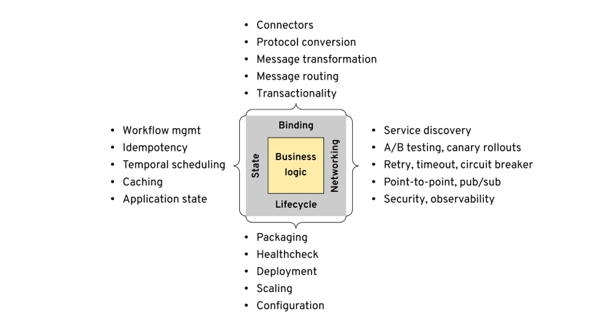

- 生命周期（Lifecycle）
- 网络（Networking）
- 状态（State）
- 捆绑（Binding）

由于每种需求存在的问题和局限性，导致传统解决方案如企业服务总线（ESB）及其变体（例如面向消息的中间件，更轻量级的集成框架等）不再适用。随着微服务架构的发展，以及容器和Kubernetes的普及和广泛使用，云原生思想开始影响这些需求的实现方式。未来的架构趋势是通过将所有传统的中间件功能移至其他运行时来全面发展，最后的目标是在服务中只需编写业务逻辑。

> 备注：详情请见原文，为了节约篇幅，这里只做简单概述，不完全引用原文内容。

下图是传统中间件平台和云原生平台的对比，传统中间件以各种SDK的方式提供能力，而云原生平台则通过各种外围Runtime（典型如大家熟悉的Servicemesh/Istio）：

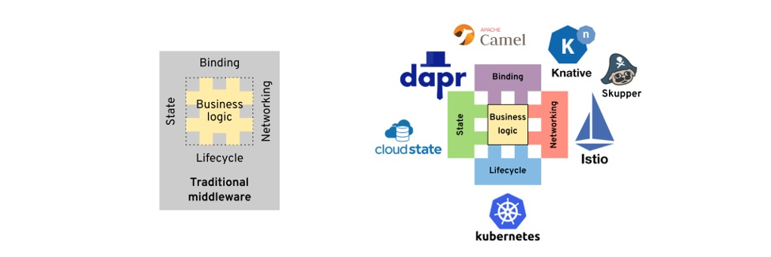

因此作者引入了Multiple Runtime的概念：

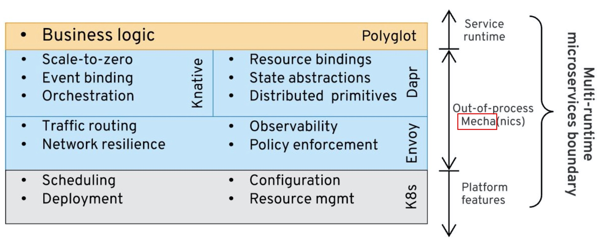

作者提出：很可能在将来，我们最终将使用多个运行时来实现分布式系统。**多个运行时，不是因为有多个微服务，而是因为每个微服务都将由多个运行时组成**，最有可能是两个运行时-自定义业务逻辑运行时和分布式原语运行时。

对多运行时微服务架构和Mecha的说明：

> 您还记得电影《阿凡达》和科学家们制作的用于去野外探索潘多拉的 Amplified Mobility Platform (AMP)“机车服”吗？这个多运行时架构类似于这些 Mecha-套装，为人形驾驶员赋予超能力。在电影中，您要穿上套装才能获得力量并获得破坏性武器。在这个软件架构中，您将拥有构成应用核心的业务逻辑（称为微逻辑/micrologic）和提供强大的开箱即用的分布式原语的sidecar mecha组件。Micrologic与mecha功能相结合，形成多运行时微服务，该服务将进程外功能用于其分布式系统需求。最棒的是，Avatar 2即将面世，以帮助推广这种架构。我们最终可以在所有软件会议上用令人赞叹的机甲图片代替老式的边车摩托车；-)。接下来，让我们看看该软件架构的详细信息。
>
> 这是一个类似于客户端-服务器体系结构的双组件模型，其中每个组件都是独立的运行时。它与纯客户端-服务器架构的不同之处在于，这两个组件都位于同一主机上，彼此之间有可靠的网络连接。这两个组件的重要性相当，它们可以在任一方向上发起操作并充当客户端或服务器。其中的一个组件称为Micrologic，拥有非常少的业务逻辑，把几乎所有分布式系统问题都剥离出去了。另一个伴随的组件是Mecha，提供了我们在本文中一直讨论的所有分布式系统功能（生命周期除外，它是平台功能）。

作者在这里正式提出了Mecha的理念：

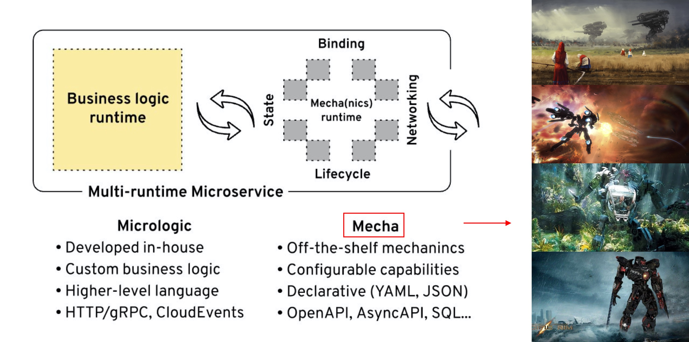

思路大体是：**Smart Runtime， Dumb Pipes**。

我对Mecha的理解是：业务逻辑在编码开始阶段应该是“裸奔”的，专注于业务逻辑的实现，而尽量不涉及到底层实现逻辑；而在运行时，则应该装备“机甲”，全副武装，大杀四方。熟悉的味道是吧？标准而地道的云原生思想。

### Mecha的本质

作者在原文中探讨了Mecha运行时的特性：

1. Mecha是通用的，高度可配置的，可重用的组件，提供分布式原语作为现成的能力。

2. Mecha 可以与单个Micrologic组件一起部署(Sidecar模式)，也可以部署为多个共享(注：我称之为Node模式)。

3. Mecha不对Micrologic运行时做任何假设。它与使用开放协议和格式（例如HTTP/gRPC，JSON，Protobuf，CloudEvents）的多语言微服务甚至单体一起使用。

4. Mecha以简单的文本格式（例如YAML，JSON）声明式地配置，指示要启用的功能以及如何将其绑定到Micrologic端点。

5. 与其依靠多个代理来实现不同的目的（例如网络代理，缓存代理，绑定代理），不如使用一个Mecha提供所有这些能力。

下面是我对上述特性的个人理解：

1. Mecha提供的是**能力**，以分布式原语体现的各种能力，而不局限于单纯的网络代理。
2. Mecha的部署模型，不局限于Sidecar模式，Node模式在某些场景下（如Edge/IoT，Serverless FaaS）可能会是更好的方式。至少，Mecha下有机会按需选择，而不是绑死在Sidecar模式上
3. Mecha和Micrologic之间的交互是开放而有API标准的，Mecha和Micrologic之间的“协议”体现在API上，而不是TCP通讯协议。这提供了一个契机：一个统一Micrologic和Mecha之间通讯方式的契机。
4. Mecha可以以声明式的方式进行配置和控制，这非常符合云原生的理念，同样也使得API更关注于能力本身，而不是能力如何配置。
5. 应用需要的能力如此之多（参见上面的图：分布式应用的四大需求），如果每个能力都对应一个代理（不管是Node还是Sidecar），数量会非常夸张，带来的运维压力会很可怕。因此，如Mecha这个名字暗示的，运行时应该是整套的形式提供能力，而不是分散。

如果用一句话来总结，那么我认为Mecha的本质应该是：

**“面向应用的分布式能力抽象层”**

如Servicemesh的本质是服务间通讯的抽象层一样，Mecha的本质是应用需要的各种分布式能力和原语，包括但不限于服务间通讯。

从这个角度上说，Mecha覆盖的范围是Servicemesh的超集：毕竟Servicemesh只覆盖到应用的部分需求（服务间通讯，还只限于同步/一对一/request-response模式），还有更多的分布式能力和原语有待覆盖。

换一句话说，Mecha的目标应该是：**“将Mesh进行到底！”**

### Mecha的优势和未来

作者指出：Mecha的好处是业务逻辑和越来越多的分布式系统问题之间的松耦合。

下图是业务逻辑和分布式系统问题在不同架构中的耦合：

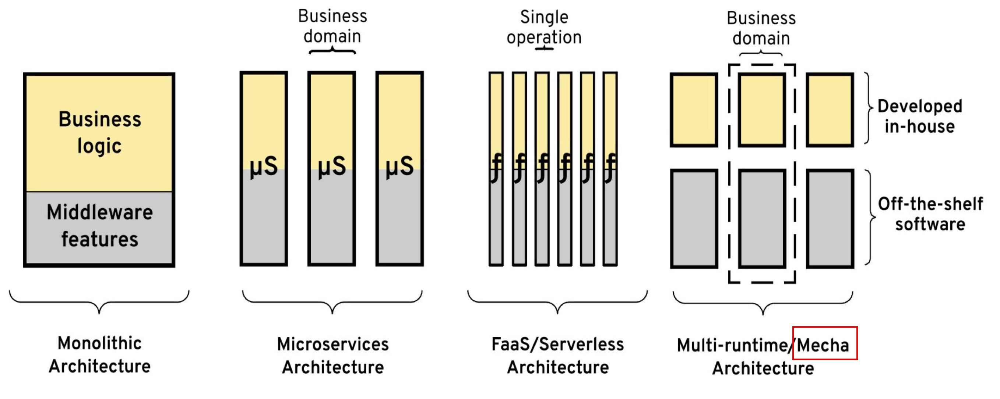

其实思路和Servicemesh是一脉相承的，只是覆盖的分布式能力更广泛一些。

有一个问题：Mecha会不会成为微服务架构的演进的下一个形态？我个人的答案：是，随着云原生的推进，分布式能力（以传统中间件为典型代表）下沉是大势所趋，Mesh化的范围必然会继续扩大，也就离Mecha的形态越来越近了。这也就是本文标题的立意所在，Mecha会是微服务乃至云原生的下一站。

## 微软Dapr

在介绍完 Mecha/Multiple Runtime 的理念之后，我们来看看目前微软新推出来的Dapr项目 —— 这应该是业界第一个Multiple Runtime的开源实践项目。

项目地址：https://github.com/dapr/dapr。

### Dapr介绍

Dapr 是 Distributed Application Runtime （分布式应用运行时）的缩写，官方介绍说Dapr是“一种可移植的，事件驱动的运行时，用于构建跨云和边缘的分布式应用”。

Dapr的详细介绍是：

> Dapr是一种可移植的，serverless的，事件驱动的运行时，它使开发人员可以轻松构建弹性，无状态和有状态微服务，这些服务运行在云和边缘上，并包含多种语言和开发框架。
>
> Dapr 整理了构建微服务应用为开放，独立的构建块的最佳实践，使您能够使用自己选择的语言和框架来构建可移植的应用程序。 每个构建块都是独立的，您可以在应用中使用其中的一个或多个。

Dapr的功能和定位，下面这一张图就可以概括了：

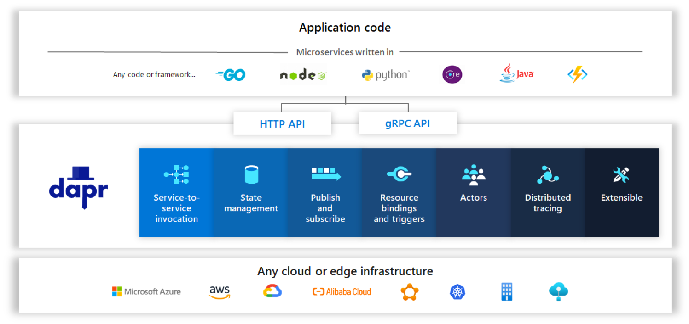

- 最底下基础设施是各种云平台（主流公有云都支持）或者边缘环境
- 其上是dapr提供的分布式能力，dapr称之为“building block”。
- 这些building block的能力，以统一的API（支持HTTP和gRPC）对外提供服务
- 应用可以用各种语言编写，然后通过dapr提供的API使用这些能力，dapr也提供客户端类库来简化对API的调用，实现了多语言的支持。

Dapr提供的具体分布式能力（building block）如下图所示：

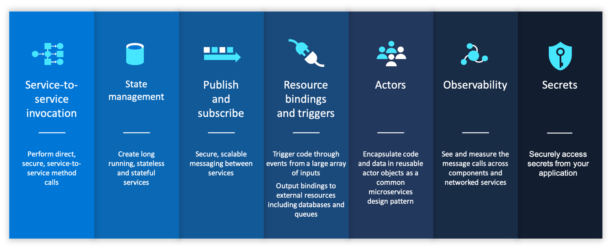

每个building block提供的具体能力请参加 Dapr 的官方文档：https://github.com/dapr/docs/tree/master/concepts。

### Dapr的API例子

我们来看一下应用调用Darp API的例子，体验一下使用Dapr的方式。

以 Service Invocation / 服务调用为例：


部署和调用方式与 Servicemesh/Istio 极为相似，但是，差别在于：Dapr是以提供API的方式提供API背后的能力，而不是提供提供协议代理的方式。

上图中1，是ServiceA发起请求来调用一个远程服务。其HTTP request 如下所示：

```http
POST/GET/PUT/DELETE http://localhost:<daprPort>/v1.0/invoke/<appId>/method/<method-name>
```

其中：

- 参数 daprPort 是Dapr Runtime启动的监听端口，用来接受应用的 outbound 请求
- 参数 appId 是远程应用在darp中的关联id，每个注册到dapr的应用都有一个唯一的appId
- 参数 method-name 是要调用的远程应用的方法名或者URL

负载可以存放在HTTP body中随请求发送，如 json。

注意，虽然都是提供相同的功能，这里体现了Dapr（或者说背后的Mecha）和Servicemesh在方式上的差异：暴露API还是代理通讯协议。

我们看一个更明显的例子，dapr提供的 “publish/subscriptions” 能力，让应用可以方便的发布消息，或者订阅主题并接收消息。下图是应用发布消息，请求直接发给dapr即可：

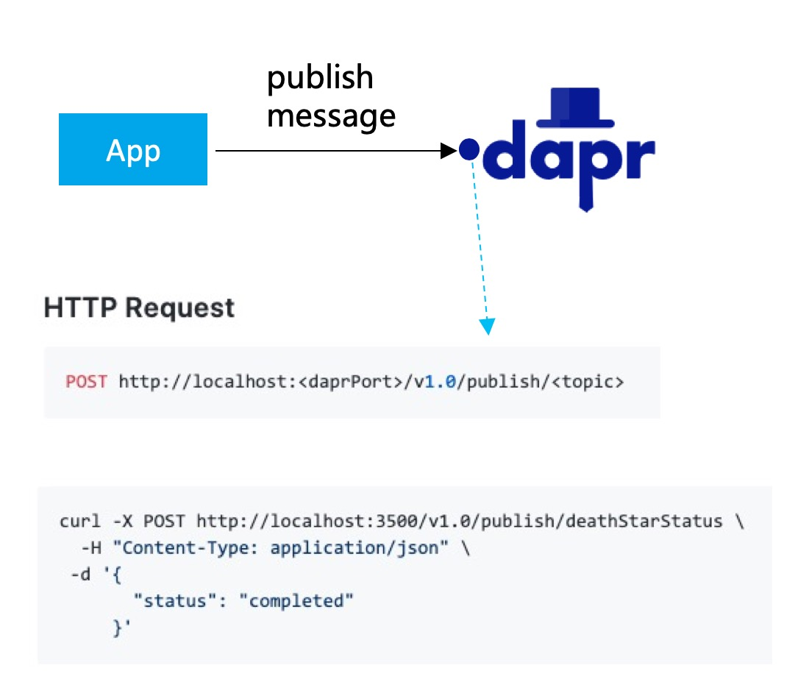

例子中，参数 topic 指定了消息要发往的主题（例子中是  deathStarStatus）。后续dapr会完成将消息入queue，然后推送到订阅了该topic的应用。接收消息的方式也类似，不过这次是darp主动发起：

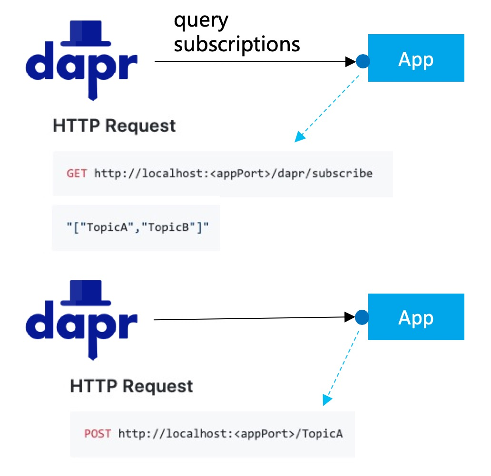

1. dapr首先会请求应用，咨询应用需要订阅那些主题（topic），如例子中应用返回的的TopicA / TopicB
2. dapr实现主题订阅，在接收到消息之后，再把消息发送给应用，通过URL参数的不同来区分不同的主题

注意在这个调用期间，无论是收发消息，应用完全不用理会底层pub/sub的实现机制（比如是kafka，还是rocketmq，还是其他公有云提供的消息机制），也完全不用引入该实现机制的客户端SDK，只是简单的使用darp定义的API即可，从而实现了和底层的解耦，以及“厂商不绑定”。

为了进一步简化调用的过程（毕竟发一个最简单的HTTP GET请求也要应用实现HTTP协议的调用/连接池管理等），dapr提供了各个语言的SDK，如 java / go / python / dotnet / js / cpp / rust 。另外同时提供HTTP客户端和gRPC客户端。

我们以 Java 为例，java的 client API 接口定义如下：

```java
public interface DaprClient {  
   Mono<Void> publishEvent(String topic, Object event);
   Mono<Void> invokeService(Verb verb, String appId, String method, Object request);
	......
}
```

具体可见：

https://github.com/dapr/java-sdk/blob/master/sdk/src/main/java/io/dapr/client/DaprClient.java

## 分析和总结

前面介绍了Multiple Runtime / Mecha 的架构思想，以及参考实现之一的微软Dapr项目。

由于 Multiple Runtime / Mecha 这个思想非常的新，刚刚提出不久，而微软 Dapr 项目也是一个新出来的项目，不管是理论思想还是实践都处于非常早期的状态，也还没有形成完善的方法论。

**特别申明**：以下内容更多是我个人当下的理解和感悟，仅代表个人意见，肯定有很多不成熟甚至谬误的地方，欢迎指正和探讨。

### Mecha和Dapr的启示

1. Mesh 模式应该推向更大的领域

	随着云原生的深入，应用需要的分布式能力应该全面下沉，而不仅仅局限于Servicemesh提供的服务间通讯能力；应用形态会朝纯业务逻辑这个目标更进一步，应用更加的云原生化。
	
	这是大势所趋，也是Mecha架构出现和发展的原动力。

2. Mecha强调是“提供能力”，而不是通讯代理

	Mecha的使用方式和Servicemesh有非常大的差异：Mecha强调的是提供分布式能力给应用使用，这些能力最终以封装完善的API的方式呈现。API体现的是应用对能力的“需求”和“意愿”，不涉及到如何实现，实现是Mecha的职责，采用什么样的实现也是由Mecha来控制。
	
	在Servicemesh下，不存在这个需求：Servicemesh提供的是服务间通讯能力，这个能力是由sidecar来提供，没有其他的更底层的实现，不存在隔离和替换的可能。受服务通讯协议和报文schema的限制，Servicemesh只能做请求的“转发”，能力聚焦在“如何转发”上，没有其他需要隔离和替代的能力。
	
	当Mecha把能力扩展到Servicemesh之外时，很多能力是由外部系统提供：比如 pub-sub 能力可以由不同的Message Queue实现；状态管理能力可以连接不同的Key-Value实现。此时能力的隔离性和可替代性就成为关键需求：解耦应用和能力实现，容许Mecha替换底层实现（进而实现供应商不锁定等）。
	
3. 不强求“零侵入”

	在Servicemesh中，“零侵入”是一个非常强调的特性，为此不惜引入 iptables 等流量劫持方案。“零侵入”在某些特殊场景下会发挥巨大的优势，如旧有应用不做改造的前提下接入servicemesh。好处自然不言而喻，但零侵入也有自身的限制：客户端必须能发出符合服务器端要求的网络通讯请求，这个过程外部无法插手。
	
	对于服务间通讯，这个不是大问题。但是对于其他能力，由于有和实现解耦的需求，再通过客户端自行发起原生协议的请求就不合适了。因此，Mecha中更倾向于采用低侵入的轻量级SDK方案，同样也可以实现跨语言和跨平台，只是需要付出实现各种语言SDK的代价。由于这个SDK足够轻量，因此代价还不算很高。

	而这些少量的工作量，少量的侵入，可以换取轻量级SDK能提供的各种便利和配合（简单理解：开后门），可以实现能力的抽象和API的封装。权衡利弊，Mecha下更倾向于轻量级SDK方案。

4. 不限定 Sidecar 部署

	Sidecar部署模式，存在资源占用、维护成本增加等缺点，在某些情况下可能并不合适：
	
	- 边缘网络，IoT场景：资源非常有限，不适合启动太多Sidecar
	- FaaS场景：应用自身足够轻量，甚至比Sidecar还要轻量
	- Serverless场景：Scale to Zero时，对冷启动速度有严格要求，Sidecar的启动和初始化可能拖累应用启动速度
	
	Mecha下，部署模式不限定于 Sidecar ，在合适时容许选择 Node 模式，甚至 Node 模式和 Sidecar 模式混合使用。

5. API和配置是关键

	API是分布式能力的抽象，需要要对（开发上层业务应用的）客户友好，简单好用，稳定不变。这些API 也需要标准化，被社区广泛接受和采纳，才能实现厂商不锁定和自由迁移，提升客户价值。
	
	另外，API还需要配合配置使用，在把能力抽象为API时，是不提供能力的细节控制的。这些控制将在运行时由Mecha根据配置实现，可以理解为：“API + 配置 = 完整的能力”。
	
	API和配置的制订以及标准化，预计将会是Mecha成败的关键。

### Mecha的精髓

> Program to an **interface**, not an implementation.
> 
> Design Patterns: Elements of Reusable Object-Oriented Software (GOF, 1994)

Mecha的精髓，要从上面这句名言开始：

1. 在Mecha下，为了实现**解耦**和**可替换**， Runtime **隔离**了底层实现，因此演变为："Program to an **Runtime**, not an implementation.""

2. 考虑到 Runtime 不管是部署为Sidecar模式，还是部署为 Node 模式，都是Localhost，因此有： “Program to an **Localhost**, not an implementation.”

3. 为了简化开发，Mecha还是会提供轻量级SDK，提供API作为能力的**抽象**：“Program to an **API**, not an implementation.”

4. 考虑到 API 通常是以 interface 的形式提供，因此绕了一圈，Mecha最后还是回到原点：“Program to an **interface**, not an implementation.” 

个人理解，Mecha的精髓就在于这几个关键点：隔离/抽象/解耦/可替换。如下图所示：

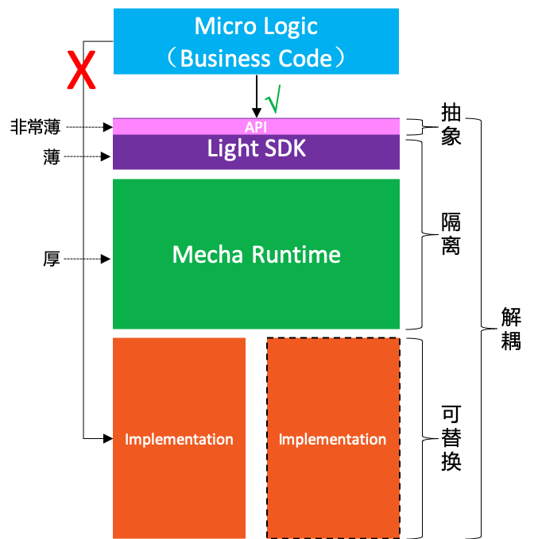

- 在Mecha下，MicroLogic（也就是业务逻辑的代码实现）不容许直接使用底层实现提供的分布式能力
- Mecha Runtime将为Micro Logic提供分布式能力，同时隔离应用和底层实现
- 为了方便使用，提供轻量级SDK，其中的API层实现了分布式能力的抽象，应用只需面向API编程
- 轻量级SDK和Mecah Runtime配合，完成对底层实现的解耦和可替换。

### Mecha的实现原则

在Mecha的实现上，我理解的原则是这样：

1. Runtime 是主力，要做厚
2. 轻量级SDK 主要是给 Runtime 打配合，要做薄

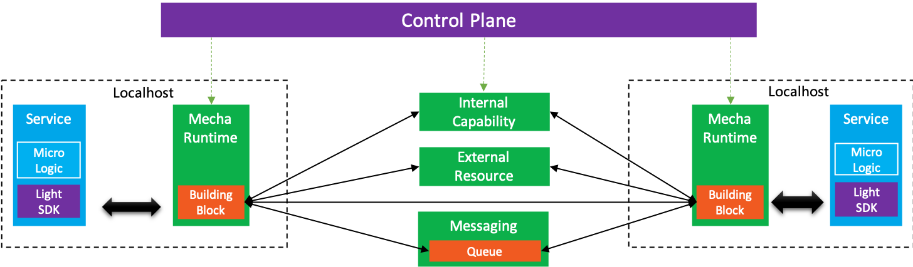

具体的职责划分：

1. 轻量级SDK：实现多语言接入，低侵入（但不追求零侵入）

2. API 接口：由轻量级SDK中提供统一，目标社区化+标准化，给开发者提供一致的编程体验，同时提供可移植性

3. 应用：轻量级SDK/Runtime配合，提供各种分布式能力，应用无感，只需简单使用API，不耦合底层实现

在Mecha架构中，Runtime 自然是整个架构的核心，扮演类似Servicemesh中数据平面的角色

- 所有分布式能力使用的过程（包括访问内部生态体系和访问外部系统）都被 Runtime 接管和屏蔽实现
- 通过CRD/控制平面实现声明式配置和管理（类似Servicemesh）
- 部署方式上 Runtime 可以部署为Sidecar模式，或者Node模式，取决于具体需求，不强制

> 备注：Mecha有非常多的能力，实现上也有非常多的细节，这里先做一个High Level的概述。细节后面会有一系列文章一一覆盖，欢迎多交流讨论。

## Mecha总结

大概是在3月初，当时我第一次阅读 “Multi-Runtime Microservices Architecture” 这篇文章，有一种豁然开朗的感觉，尤其是有很多之前在反复考虑和权衡但是下不了结论的问题，在这个文章中得到了清晰的解答。可谓受益匪浅。

在Servicemesh探索和实践的这三年中，遇到很多问题，有很多之前没有想到过的问题浮现。比如，以前一直觉得Servicemesh中引入Sidecar带来的最大麻烦会是性能，但实际上，从目前的实践看，Sidecar引入后带来的维护代价才是更令人头疼的事情，相比之下Sidecar引入带来的性能损失显得无伤大雅。

总结一下我个人对 Mecha 架构的核心理解，主要是两点：

1. Mecha是云原生化和Mesh化的必然趋势：云原生在继续发展，应用需要的分布式能力需要继续下沉，越来越多的能力会以sidecar的形式出现，这是大势所趋。但不可能出现一个应用部署十几个sidecar的局面，这会是运维地狱。因此，必然需要出现新的形态来解决Sidecar过多的问题，合并为一个或者多个Sidecar就会成为必然。
2. Mecha是Servicemesh模式的自然进化版本：Servicemesh落地实践三年了，效果一直并不理想，到了该反思反省的时候了；而且Mecha的范围也远不止服务间通讯，新的需求下应该有新的思考和突破。Servicemesh现有的固定模式，在Mecha下可以尝试打破以探索新的方式：不必拘泥于Sidecar，试试Node模式；不必拘泥于通讯协议转发，试试Runtime提供能力解耦底层实现；不必拘泥于零侵入，试试在应用中保留一个足够轻的轻量级SDK。

正如曾有说法，说“微服务是SOA实践中正确的部分（the Good Part）”，我希望在 Mecha 的探索和实践中，能够从Servicemesh的实践中吸取成功的经验和失败的教训，希望 Mecha 也能成为Servicemesh的Good Part。希望在云原生的演进路线中，Mecha 可以继微服务和Servicemesh之后，成为云原生落地实践的下一站。

回到现实，目前 Mecha 和 Multi-Runtime 还是一个非常新的想法，Dapr 项目也才刚刚起步，Mecha 要探索的道路还很漫长，一切都还需要摸索着前进。


## 附录：参考资料

在文章的最后，特别鸣谢 “Multi-Runtime Microservices Architecture”一文的作者 “**Bilgin Ibryam**”，我非常认可这篇文章中的思想和理念，分析归纳的非常到位，提炼和升华的能力令人佩服。

> 作者介绍：
>
> 
>
> Red Hat的首席架构师，Apache Software Foundation 的 committer 和成员。开源的布道师，博客作者，偶尔演讲，著有书籍 Kubernetes Patterns 和 Camel Design Patterns 。

本文参考了 Bilgin Ibryam 出品的如下内容：

-  [Multi-Runtime Microservices Architecture](https://www.infoq.com/articles/multi-runtime-microservice-architecture/)，作者 [Bilgin Ibryam](http://ofbizian.com/)，Mecha的思想来自这篇文章，强烈推荐阅读。也可以直接看我翻译的版本 [多运行时微服务架构](https://skyao.io/post/202003-multi-runtime-microservice-architecture/)。如前所述，建议在阅读本文之前先阅读这篇博客文章。
- [The Evolution of Distributed Systems on Kubernetes](https://qconlondon.com/london2020/presentation/evolution-distributed-systems-kubernetes) : 作者 Bilgin Ibryam, 2020年3月在 QCon London的演讲，依然强烈推荐。内容非常精彩，对 Kubernetes 上分布式系统演进做了很好的总结和展望，当然也依然在布道多运行时微服务架构的理念。本文的很多图片 [援引自这份PPT](https://qconlondon.com/system/files/presentation-slides/bilgin_-_evolution_of_distributed_systems_on_kubernetes.pdf)。


