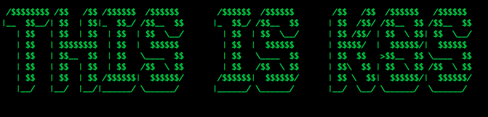
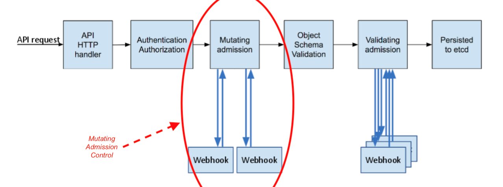
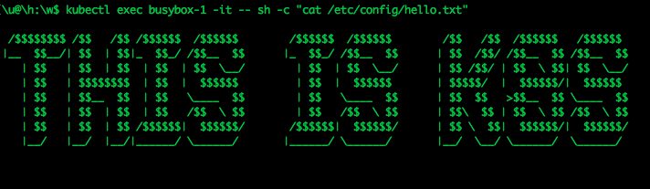

本文译自 [Building a Kubernetes Mutating Admission Webhook](https://medium.com/@didil/building-a-kubernetes-mutating-admission-webhook-7e48729523ed)。

当你在 Kubernetes 中创建 Pod 的时候，是否注意到在容器的 */var/run/secrets/kubernetes.io/serviceaccount/token*  路径上存放了一个用于认证的 token 文件？你可以通过如下命令，在 Kubernetes 集群中验证下：

```shell
$ kubectl run busybox --image=busybox --restart=Never -it --rm -- ls -l /var/run/secrets/kubernetes.io/serviceaccount/token
# output
/var/run/secrets/kubernetes.io/serviceaccount/token
```

注：在 Kubernetes 1.6 以上的版本，你可以 [取消](https://kubernetes.io/docs/tasks/configure-pod-container/configure-service-account/#use-the-default-service-account-to-access-the-api-server) 这一个自动注入的功能。

现在假设有这样一个场景，需要添加一个 “hello.txt” 文件到所有（或某组）pod 的容器文件系统内，不能通过在 pod spec 中显式指定 volumeMount 的方式，我们有没有什么方法达到目的呢？

为了让实验更具趣味性，我们用一个 ASCII “小作品”（用这个工具生成的）来作为我们的 “hello.txt” 文件：



## 何为 Admission Webhook

实现该注入的功能的方式之一，就是我们上文中提到的，使用 Kubernetes Admission Webhooks。这是何方神圣？来看下官方文档给的定义：

> Admission webhook 是一种用于接收准入请求并对其进行处理的 HTTP 回调机制。 可以定义两种类型的 admission webhook，即 [validating admission webhook](https://kubernetes.io/zh/docs/reference/access-authn-authz/admission-controllers/#validatingadmissionwebhook) 和 [mutating admission webhook](https://kubernetes.io/zh/docs/reference/access-authn-authz/admission-controllers/#mutatingadmissionwebhook)。 Mutating admission webhook 会先被调用。它们可以更改发送到 API 服务器的对象以执行自定义的设置默认值操作。

下文这张借用自 [Kubernetes.io blog post](https://kubernetes.io/blog/2019/03/21/a-guide-to-kubernetes-admission-controllers/) 的流程图可以帮助我们理解 Admission Webhook 的概念。



接下来，本文将采用 Kubernetes 提供的 Mutating Admission Webhook 这一机制，来实现注入 “hello.txt” 文件到 Pod 容器中，我们每次发送请求调用 API 创建 Pod 的时候，Pod 的 spec 信息会被先修改，再存储。如此一来，工作节点上的 Kublet 创建 Pod 的时候，将会预置 “hello.txt” 文件。文件的创建流程是全自动的。一起来试试！

## 创建 Admission Webhook

笔者已经把下文提到的代码和命令都上传到了 [github 仓库](https://github.com/didil/k8s-hello-mutating-webhook)。读者可以跟着边看边操作。

首先需要有一个正常运行的 Kubernetes 集群。读者可以通过 [Kind](https://kind.sigs.k8s.io/) 快速起一个集群。

接着，定义一个包含了 “hello.txt” 文件内容的 [ConfigMap](https://kubernetes.io/docs/concepts/configuration/configmap/)：

```yaml
apiVersion: v1
kind: ConfigMap
metadata:
  name: hello-configmap
data:
  hello.txt: "\n /$$$$$$$$ /$$   /$$ /$$$$$$  /$$$$$$        /$$$$$$  /$$$$$$        /$$
    \  /$$  /$$$$$$   /$$$$$$ \n|__  $$__/| $$  | $$|_  $$_/ /$$__  $$      |_  $$_/
    /$$__  $$      | $$  /$$/ /$$__  $$ /$$__  $$\n   | $$   | $$  | $$  | $$  | $$
    \ \\__/        | $$  | $$  \\__/      | $$ /$$/ | $$  \\ $$| $$  \\__/\n   | $$
    \  | $$$$$$$$  | $$  |  $$$$$$         | $$  |  $$$$$$       | $$$$$/  |  $$$$$$/|
    \ $$$$$$ \n   | $$   | $$__  $$  | $$   \\____  $$        | $$   \\____  $$      |
    $$  $$   >$$__  $$ \\____  $$\n   | $$   | $$  | $$  | $$   /$$  \\ $$        |
    $$   /$$  \\ $$      | $$\\  $$ | $$  \\ $$ /$$  \\ $$\n   | $$   | $$  | $$ /$$$$$$|
    \ $$$$$$/       /$$$$$$|  $$$$$$/      | $$ \\  $$|  $$$$$$/|  $$$$$$/\n   |__/
    \  |__/  |__/|______/ \\______/       |______/ \\______/       |__/  \\__/ \\______/
    \ \\______/ \n                                                                                                  \n
    \                                                                                                 \n
    \                                                                                                 \n"

```

为了构建 webhook，我们写一个简洁的 Go API 服务端。http handler 是实现 webhook 代码的最重要部分： 

```go
func (app *App) HandleMutate(w http.ResponseWriter, r *http.Request) {
	admissionReview := &admissionv1.AdmissionReview{}

	// read the AdmissionReview from the request json body
	err := readJSON(r, admissionReview)
	if err != nil {
		app.HandleError(w, r, err)
		return
	}

	// unmarshal the pod from the AdmissionRequest
	pod := &corev1.Pod{}
	if err := json.Unmarshal(admissionReview.Request.Object.Raw, pod); err != nil {
		app.HandleError(w, r, fmt.Errorf("unmarshal to pod: %v", err))
		return
	}

	// add the volume to the pod
	pod.Spec.Volumes = append(pod.Spec.Volumes, corev1.Volume{
		Name: "hello-volume",
		VolumeSource: corev1.VolumeSource{
			ConfigMap: &corev1.ConfigMapVolumeSource{
				LocalObjectReference: corev1.LocalObjectReference{
					Name: "hello-configmap",
				},
			},
		},
	})

	// add volume mount to all containers in the pod
	for i := 0; i < len(pod.Spec.Containers); i++ {
		pod.Spec.Containers[i].VolumeMounts = append(pod.Spec.Containers[i].VolumeMounts, corev1.VolumeMount{
			Name:      "hello-volume",
			MountPath: "/etc/config",
		})
	}

	containersBytes, err := json.Marshal(&pod.Spec.Containers)
	if err != nil {
		app.HandleError(w, r, fmt.Errorf("marshall containers: %v", err))
		return
	}

	volumesBytes, err := json.Marshal(&pod.Spec.Volumes)
	if err != nil {
		app.HandleError(w, r, fmt.Errorf("marshall volumes: %v", err))
		return
	}

	// build json patch
	patch := []JSONPatchEntry{
		JSONPatchEntry{
			OP:    "add",
			Path:  "/metadata/labels/hello-added",
			Value: []byte(`"OK"`),
		},
		JSONPatchEntry{
			OP:    "replace",
			Path:  "/spec/containers",
			Value: containersBytes,
		},
		JSONPatchEntry{
			OP:    "replace",
			Path:  "/spec/volumes",
			Value: volumesBytes,
		},
	}

	patchBytes, err := json.Marshal(&patch)
	if err != nil {
		app.HandleError(w, r, fmt.Errorf("marshall jsonpatch: %v", err))
		return
	}

	patchType := admissionv1.PatchTypeJSONPatch

	// build admission response
	admissionResponse := &admissionv1.AdmissionResponse{
		UID:       admissionReview.Request.UID,
		Allowed:   true,
		Patch:     patchBytes,
		PatchType: &patchType,
	}

	respAdmissionReview := &admissionv1.AdmissionReview{
		TypeMeta: metav1.TypeMeta{
			Kind:       "AdmissionReview",
			APIVersion: "admission.k8s.io/v1",
		},
		Response: admissionResponse,
	}

	jsonOk(w, &respAdmissionReview)
}
```

上面这部分代码，和 Kubernetes 内部代码有诸多类似，都使用了 源自 https://github.com/kubernetes/api  和 https://github.com/kubernetes/apimachinery 的 schema 类型。上述代码主要做了如下事情：

- 将来自 Http 请求中的 AdmissionReview  json 输入反序列化。
- 读取 Pod 的 spec 信息。
- 将 hello-configmap 作为数据源，添加 hello-volume 卷到 Pod。
- 挂载卷至 Pod 容器中。
- 以 [JSON PATCH](http://jsonpatch.com/) 的形式记录变更信息，包括卷的变更，卷挂载信息的变更。顺道为容器添加一个 “hello-added=true” 的标签。
- 构建 json 格式的响应结果，结果中包含了这次请求中的被修改的部分。

笔者 [此处](https://github.com/didil/k8s-hello-mutating-webhook/blob/main/webhook/api/app_test.go) 还为这个 handler 编写了单元/功能测试，以确保它的功能实现符合我们的预期。

## 加点改进：TLS

Webhook API 服务器需要通过 TLS 方式通信。如果想将其部署至 Kubernetes 集群内，我们还需要证书。笔者通过 [New Relic](https://github.com/newrelic/k8s-webhook-cert-manager) 这个软件来生成 Webhook 证书。笔者创建了一个 [个人分支](https://github.com/didil/k8s-webhook-cert-manager)，对代码做了点改动，以确保其可以 Job 方式部署：

```yaml
apiVersion: batch/v1
kind: Job
metadata:
  name: webhook-cert-setup
spec:
  template:
    spec:
      serviceAccountName: webhook-cert-sa
      containers:
      - name: webhook-cert-setup
        # This is a minimal kubectl image based on Alpine Linux that signs certificates using the k8s extension api server
        image: quay.io/didil/k8s-webhook-cert-manager:0.13.19-1-a
        command: ["./generate_certificate.sh"]
        args:
          - "--service"
          - "hello-webhook-service"
          - "--webhook"
          - "hello-webhook.leclouddev.com"
          - "--secret"
          - "hello-tls-secret"
          - "--namespace"
          - "default"
      restartPolicy: OnFailure
  backoffLimit: 3
```

## 其他 YAML

完成 webhook API 服务端的镜像构建后，将其推送至镜像仓库，并将其作为一个 Deployment 部署到集群。

```yaml
apiVersion: apps/v1
kind: Deployment
metadata:
  name: hello-webhook-deployment
  labels:
    app: hello-webhook
spec:
  replicas: 1
  selector:
    matchLabels:
      app: hello-webhook
  template:
    metadata:
      labels:
        app: hello-webhook
    spec:
      containers:
      - name: hello-webhook
        image: CONTAINER_IMAGE
        ports:
        - containerPort: 8000
        volumeMounts:
        - name: hello-tls-secret
          mountPath: "/tls"
          readOnly: true        
        resources:
          limits:
            memory: "128Mi"
            cpu: "500m"           
      volumes:
      - name: hello-tls-secret
        secret:
          secretName: hello-tls-secret
```

然后是一个 ClusterIP 类型的 Service：

```yaml
apiVersion: v1
kind: Service
metadata:
  name: hello-webhook-service
spec:
  type: ClusterIP
  selector:
    app: hello-webhook
  ports:
  - protocol: TCP
    port: 443
    targetPort: 8000
```

接着，创建一个 MutatingWebhookConfiguration 将我们创建的 webhook 信息注册到 Kubernetes API server：

```yaml
apiVersion: admissionregistration.k8s.io/v1
kind: MutatingWebhookConfiguration
metadata:
  name: "hello-webhook.leclouddev.com"
webhooks:
- name: "hello-webhook.leclouddev.com"
  objectSelector:
    matchLabels:    
      hello: "true"
  rules:
  - apiGroups:   [""]
    apiVersions: ["v1"]
    operations:  ["CREATE"]
    resources:   ["pods"]
    scope:       "Namespaced"
  clientConfig:
    service:
      namespace: "default"
      name: "hello-webhook-service"  
      path: /mutate
  admissionReviewVersions: ["v1", "v1beta1"]
  sideEffects: None
  timeoutSeconds: 10
```

如上述的清单信息所示，我们要求 Kubernetes 把（部署了 MutatingWebhookConfiguration ）命名空间中所有的 Pod 创建请求，只要匹配上 “hello=true”标签的，就将其转发到 hello-webhook-service 的 “/mutate”路径下，交给其处理。标签是可选的。此处笔者通过标签匹配来说明，如果标签不匹配或者不具备标签的请求，就可以绕开 Mutating Webhook 的预处理。

[这篇文章](https://kubernetes.io/docs/reference/access-authn-authz/extensible-admission-controllers/#service-reference) 中提到了 “caBundle”，然而我们上面文件中  “clientConfig”  中却不存在  “caBundle” key 字段。不必感到奇怪，那是因为 webhook-cert-setup Job 会为我们自动创建这个 key。

## 部署 Webhook 

项目差不多就绪可以部署了。我们用 [Makefile](https://github.com/didil/k8s-hello-mutating-webhook/blob/main/Makefile#L16) 和 Kustomize 来部署。

```shell
$ make k8s-deploy
# output
kustomize build k8s/other | kubectl apply -f -
configmap/hello-configmap created
service/hello-webhook-service created
mutatingwebhookconfiguration.admissionregistration.k8s.io/hello-webhook.leclouddev.com created
kustomize build k8s/csr | kubectl apply -f -
serviceaccount/webhook-cert-sa created
clusterrole.rbac.authorization.k8s.io/webhook-cert-cluster-role created
clusterrolebinding.rbac.authorization.k8s.io/webhook-cert-cluster-role-binding created
job.batch/webhook-cert-setup created
Waiting for cert creation ...
kubectl certificate approve hello-webhook-service.default
certificatesigningrequest.certificates.k8s.io/hello-webhook-service.default approved
kustomize build k8s/csr | kubectl apply -f -
serviceaccount/webhook-cert-sa unchanged
clusterrole.rbac.authorization.k8s.io/webhook-cert-cluster-role unchanged
clusterrolebinding.rbac.authorization.k8s.io/webhook-cert-cluster-role-binding unchanged
job.batch/webhook-cert-setup unchanged
Waiting for cert creation ...
kubectl certificate approve hello-webhook-service.default
certificatesigningrequest.certificates.k8s.io/hello-webhook-service.default approved
(cd k8s/deployment && \
        kustomize edit set image CONTAINER_IMAGE=quay.io/didil/hello-webhook:0.1.8)
kustomize build k8s/deployment | kubectl apply -f -
deployment.apps/hello-webhook-deployment created
```

运行一个带有 “hello=true” 标签的 busybox 容器，检查看我们的 mutating webhook 是否在正常运行。

```shell
$ kubectl run busybox-1 --image=busybox  --restart=Never -l=app=busybox,hello=true -- sleep 3600
```

看看容器内的文件系统是否有 hello.txt：

```shell
$ kubectl exec busybox-1 -it -- sh -c "ls /etc/config/hello.txt"
# output
/etc/config/hello.txt
```

再检查下文件内容：

```shell
$ kubectl exec busybox-1 -it -- sh -c "cat /etc/config/hello.txt"
```



接下来再创建第二个容器，不带  “hello=true” 标签的：

```shell
$ kubectl run busybox-2 --image=busybox --restart=Never -l=app=busybox -- sleep 3600
# output
pod/busybox-2 created
$ kubectl exec busybox-2 -it -- sh -c "ls /etc/config/hello.txt"
# output
ls: /etc/config/hello.txt: No such file or directory
```

和我们预期的一致，第一次创建的 busybox 容器，匹配上了 webhook 的标签，注入了文件。第二次创建的 busybox 容器则没有。

再来检查下是否只有 buxybox-1 容器具备 “hello-added” 标签：

```shell
$ kubectl get pod -l=app=busybox -L=hello-added
# output
NAME        READY   STATUS    RESTARTS   AGE    HELLO-ADDED
busybox-1   1/1     Running   0          3m7s   OK
busybox-2   1/1     Running   0          53s

```

Mutating Webhook 生效了！

## 总结

我们尝试用 Mutating Admission Webhooks 对 Kubernetes 进行了初次拓展。文中没有提及 Validating Admission Webhooks，如果你需要对  [OpenAPI schemas](https://kubernetes.io/docs/tasks/extend-kubernetes/custom-resources/custom-resource-definitions/#validation) 之外的资源进行校验，你可以进一步深入了解。

希望本文对你有所帮助，如果你有任何问题和评论，可以联系我。下篇文章，我们将讨论另一种拓展 Kubernetes 的方式：实现一个 Kubernetes Operator。