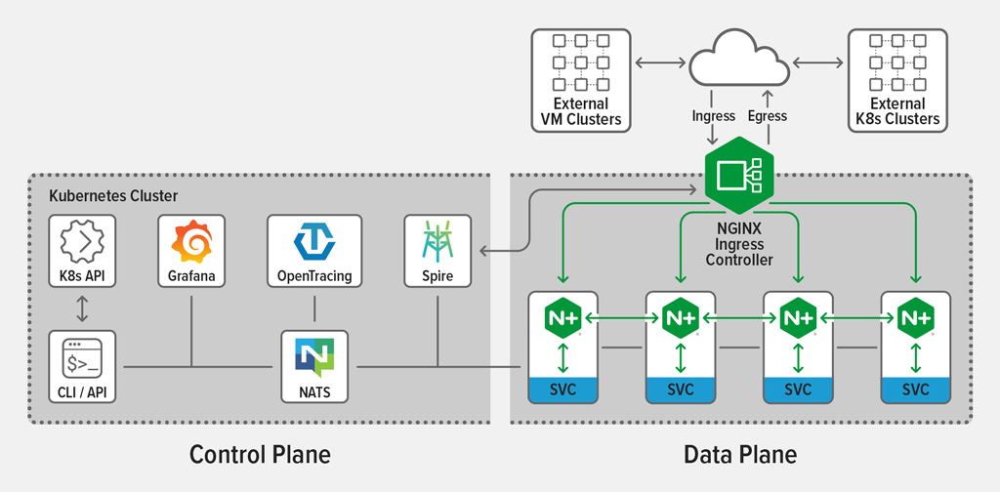

本文译自 [NGINX Steps into the Service Mesh Fray Promising a Simpler Alternative](https://thenewstack.io/nginx-steps-into-the-service-mesh-fray-promising-a-simpler-alternative/)

本月初，NGINX [推出](https://www.nginx.com/blog/introducing-NGINX-service-mesh/)了 一款免费的开源服务网格 [NGINX Service Mesh（NSM）](https://www.nginx.com/products/nginx-service-mesh)。它使用了开源 [NGINX](https://nginx.org/en/) 代理的商业版本 [NGINX Plus](https://www.nginx.com/products/nginx/) 驱动其数据平面。 尽管许多服务网格都是基于完全开源的组件构建的，但 NGINX 营销副总裁 [Rob Whiteley](https://www.nginx.com/people/rob-whiteley/) 认为，与其在市场上投放另一种开源解决方案，不如精力集中将 NSM 聚焦于当前市场缺失的部分。他认为客户正在为 Istio 的规模和复杂性而苦苦挣扎。

“ Istio 诞生于 Google，其设计精巧复杂，以支持运行数以亿计的容器和数千种服务。 但从结果上看， Istio 带来了一定数量的额外开销，也佐证了设计的复杂性。 Istio 采取了一种非常偏执的开发设计方式，其所用到的开源组件关联紧密无法自由组合简化。 从技术上讲，可以将其中用不到的部分精简出去，但其设计时没有做到模块化。“ Whiteley 表示， “ NGINX Service Mesh 更轻量，易于安装，是为那些需求逐渐不能被一个纯粹的只有流量转发的 Ingress Controller 的用户量身打造的。我们希望精简掉一些组件，NSM 也包含了被其他服务网格采用的部分组件。但没有必要把提供复杂的密钥管理、调用跟踪和可观察性等组件一口气的全部装上，这会为你当前设计的方案增加好几个数量级的复杂性。”

NSM 不会直接集成各种组件，而是部署 Sidecar 代理进行集成。 截至 NSM 发布时，这些受支持的组件已经包括Grafana，Kubernetes Ingress Controller，SPIRE，NATS，Open Tracing 和 Prometheus。 在 NSM 中， NGINX Plus 用作数据平面管理东西流量，并且还担当了 Ingress Controller 的角色管理南北流量。这样一来，用户可以获得 NGINX Plus 的所有标准特性，同时还能轻松入门，进行配置和管理。

 “NGINX 已经是市场上主流的 Ingress Controller，如果你已经在使用 NGINX 管理集群的进出流量，那么你接下可能要关心的是集群内服务间调用的问题，开始着手东西流量而不是南北流量的处理。所以，NGINX Service Mesh 的真正目的是提供南北流量问题解决后，接下来一步的解决方案。” Whiteley 表示。

NGINX Plus 为 NSM 带来的功能包括 mTLS 身份验证，负载平衡，高可用性，速率限制，熔断，蓝绿和金丝雀发布以及访问控制。 NGINX Plus 被集成进了 NSM 的二进制文件中免费提供，附带了一些运行环境限制，防止 NGINX Plus 被单独抽离出来使用。 Whiteley 指出，当前 NGINX Plus 具备了处理东西向和南北向流量的能力，因此，基于 NGINX 的 API 网关是将所有内容整合成一个完整平台所需的最后一个组件。

“我们的愿景是将所有功能整合到单一平台中。 从技术上讲，我们的API网关与服务网格是分开的，尽管它们都是基于 NGINX Plus，都是数据平面只是配置状态的不同。”  Whiteley 说， “我们认为，将 Ingress，Sidecar 代理 和 API 网关（实际上也是高度定制化的代理）整合在同一个运维管理平台可以带来一定优势，因此用户不需要在多个地方进行同步修改。 如果用户要更新策略，则应该能够在一个地方更新，而在其他地方自动同步实现。”

Whiteley 说，以 NGINX 为核心，确实对那些仍希望将其某些遗留的老旧应用与 Kubernetes 环境集成的公司来说是一个优势。 他认为，使用基于 Envoy 的 Istio 服务网格进行同样的操作会更为复杂，并且一些问题仍有待 Istio 规划解决。 总之，NSM 被定位为一种初学者的服务网格，Whiteley 表示，他们的长期目标是实现无缝过渡，从 NSM 过渡  [Aspen Mesh](https://aspenmesh.io/)，这是由 [F5 Networks](https://www.f5.com/) 构建的基于 Istio 的更先进的服务网格。

Whiteley 进一步谈到，NSM 的另一个目标是引入一个更好的管理平面。目前，NSM 已经支持[服务网格接口（SMI）](https://smi-spec.io/)，并且有可能新增 NGINX Controller 管理页面，从而为当前主要是命令行的操作带来更多的可视化界面。

除了 NSM 之外，Whiteley 表示，他们希望 [NGINX Unit](https://unit.nginx.org/) 能带来一些与众不同且新颖的内容，促进行业交流。

Whiteley 说：“我们认为，将来可以选择不基于 sidecar 的服务网格，而不必在每项服务中注入 sidecar 容器。取而代之的是，用户仅需加载并执行代码，然后执行代码的默认运行时环境就内置了处理东西流量所需的所有代理功能。 这样一来无需 sidecar 容器，从而实现从两个容器降为一个容器的方案。”