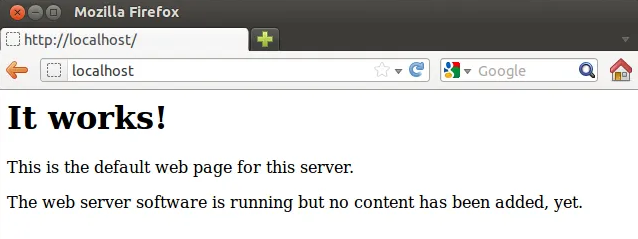
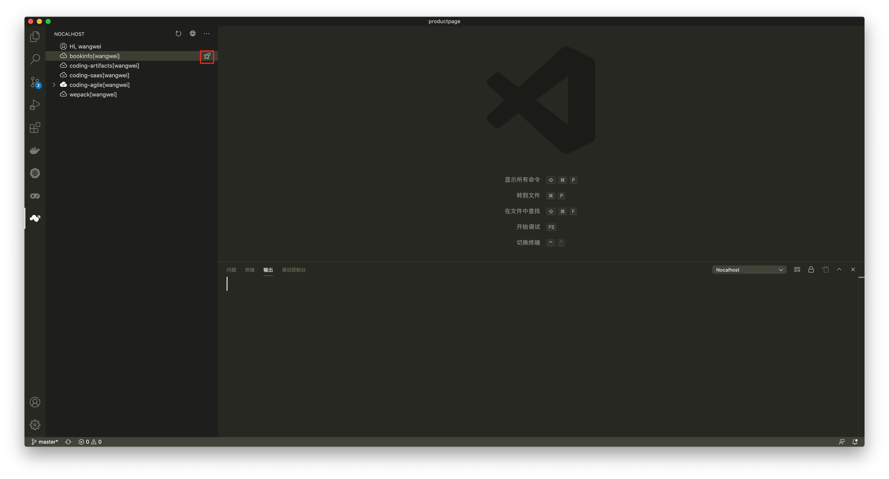
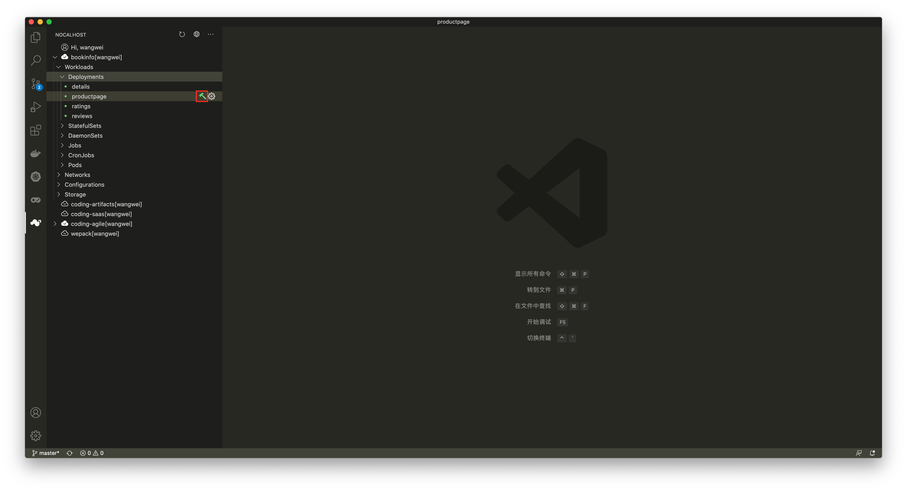
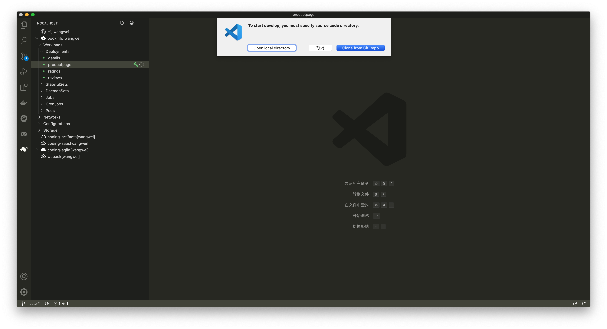
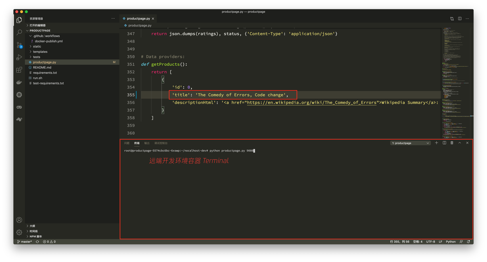
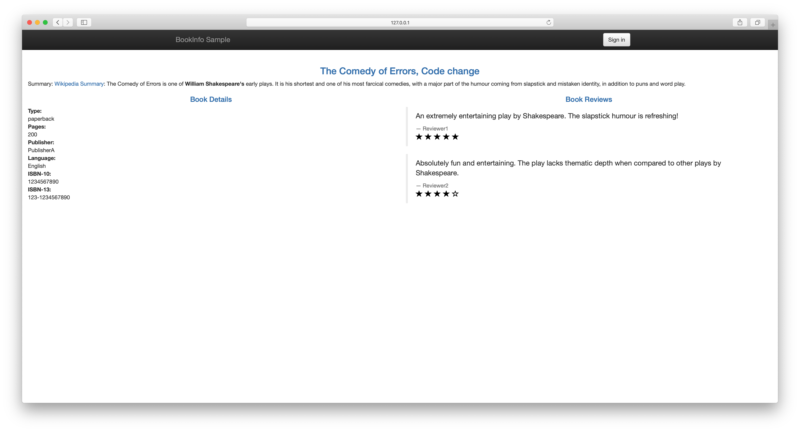
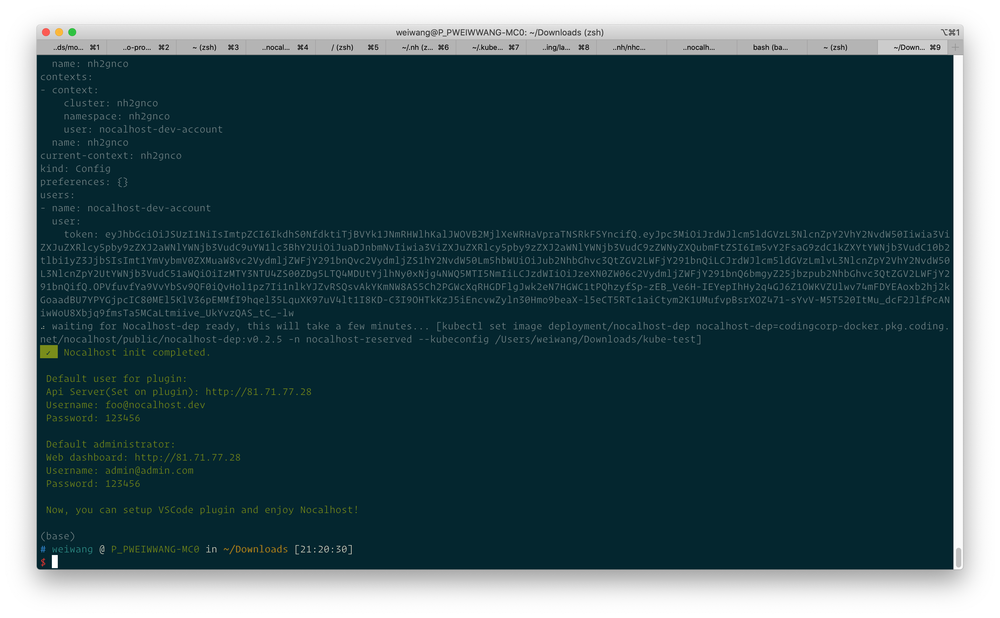
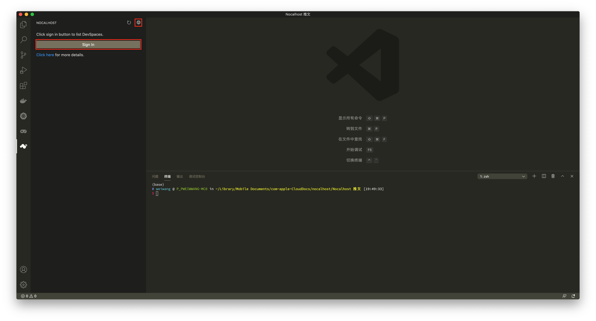

## 前言
随着业务的快速发展，技术部门的组织架构在横向及纵向不断扩大和调整，与此同时，企业的生产资料：应用系统，也变得越来越庞大。为了让应用系统适配企业组织架构的调整，梳理组织架构对于应用权责的边界，大部分组织会选择使用“微服务”架构来对应用系统进行横向拆分，使得应用系统的维护边界适配组织架构的权责边界。

一般来说，越庞大的组织架构，应用系统会被拆分地越来越细，“微服务”的数量也变得越来越多。而在“微服务”的拆分的实践中，很容易出现将组织架构的权责边界一股脑地对标到“微服务”的拆分粒度中，这可能导致“微服务”拆分粒度过细，数量进一步剧增的问题。最终，“微服务”之间的调用关系就像跨部门协作，也变得越来越复杂，问题在想要新增需求时尤为突出。

“微服务”带来便利的同时，对开发人员而言，还带来了额外的挑战：如何快速启动完整的开发环境？开发的需求依赖于其他同事怎么联调？如何快速调试这些微服务？

而对于管理人员来说，也同样带来了一系列的挑战：如何管理开发人员的开发环境？如何让新入职的同事快速进行开发？

试想一下，要开发由 200 个“微服务”组成的云原生应用，会遇到哪些困难呢？

## Localhost 时代
在单体应用的时代，对于开发者来说是极为友好的，开发者使用本机运行应用，修改代码后实时生效，通过浏览器访问 `Localhost` 实时查看代码效果。



单体应用和“微服务”应用不同，单体应用是 “ALL-IN-ONE” 组织方式，所有的调用关系仅限于在自身的类和函数，应用对硬件的要求一般也不会太高。

而开发“微服务”应用则大不相同，由于相互间的依赖关系，当需要开发某一个功能或微服务时，不得不将所有依赖的服务都启动起来。随着微服务数量的增加，开发应用所需要的本地资源越来越多，最终导致本地无法满足开发的配置需求。

## 云原生解放了部署和运维，开发呢？
云原生和 Kubernetes 的普及，进一步屏蔽了“微服务”应用的复杂度，这主要体现在部署和运维阶段。

为了解决微服务应用在开发、测试和生产阶段环境一致性的问题，现代的微服务应用开发，都会将每一个组件打包成 Docker 镜像，并以工作负载的形式对其进行部署。利用 DevOps 流水线中的持续集成和持续部署，配合 Kubernetes 探针、HPA、应用自愈的能力，彻底解放了微服务应用的部署和运维环节。

但我们忽略了一个关键节点：开发阶段

微服务应用使用 Kubernetes 工作负载封装后，解决了开发过程应用的快速启动问题，开发人员只需要在本地安装单节点的 Kubernetes 集群，例如 Minikube、Kind 等即可快速启动微服务应用。

但对于开发人员来说，原来单体应用的开发体验变得不复存在，由于应用很难在 Docker 容器之外运行，所以每次代码修改，都需要经历以下步骤：

* 执行 docker build 构建镜像
* 执行 docker tag 对镜像进行标记
* 执行 docker push 推送镜像到仓库
* 修改 Kubernetes 工作负载的镜像版本
* 等待镜像拉取结束
* 等待 Pod 重建
* 查看修改后的代码效果

这直接拖慢了开发的循环反馈过程，每次修改，动辄需要数分钟甚至十分钟的等待时间。


## Nocalhost - 重新定义云原生开发环境

> Nocalhost 是一个云原生开发环境，希望让开发云原生应用像开发单体应用原始又简单。

Nocalhost 重新梳理了开发过程所涉及到的角色和资源：

* 团队管理人员
* 开发者
* 应用
* 集群
* 开发空间

通过对这些角色和资源的重新整合，Nocalhost 重新定义了云原生开发环境，并带来了全新的云原生开发体验。

为了快速理解 Nocalhost 重新定义的云原生开发环境，让我们首先站在不同的角色来看 Nocalhost 能给他们带来什么。

开发人员：

* **摆脱每次修改需要重新 build 新镜像以及长时间的循环反馈，修改代码立即生效**
* 一键部署开发环境，摆脱本地环境搭建和资源不足的限制
* 本地 IDE 编辑器和开发环境联动，支持远程调试
* 图形化的 IDE 插件，无需熟悉 `kubectl` 命令即可完成云原生环境下的开发

管理人员：

* 统一管理微服务应用包，降低应用的维护成本
* 统一管理开发环境和集群，提高集群资源的利用率，同时具备隔离特性
* 为新员工快速分配开发环境，分配环境后立刻能进行应用开发
* 弹性的开发环境资源，用完销毁，降低开发成本

以 `Nocalhost` 内置的 `Demo`：`Bookinfo` 为例，开发 `Productpage` 微服务，变成了以下简单的几个步骤：

1. 一键部署开发环境



2. 环境部署完成，选择要开发的组件，点击“锤子”进入开发模式



3. 克隆业务代码或选择本地代码目录打开



4. 进入开发模式，本地修改代码并保存，无需重新构建镜像，远端开发环境实时生效，支持远程调试






## 快速体验
想要快速体验 Nocalhost ，有以下几点前置条件：

* 准备一个 Kubernetes 集群（1.16+），支持 TKE、Mnikube、Kind 等
* 已配置好 `kubectl` 且能访问 Kubernetes 集群
* 集群开启了 RBAC
* 安装 Visual Studio Code（1.52+） 和 Nocalhost 插件
* 安装 nhctl cli 工具（<https://nocalhost.dev/installation/>）

对于 TKE 等支持 LoadBalancer 的集群，运行以下命令来快速初始化：

```bash
nhctl init -n nocalhost -p 7000
```

对于 Minikube、Kind、K3S、MicroK8s 等，运行以下命令：

```bash
nhctl init -n nocalhost -t nodeport --set mariadb.primary.persistence.enabled=false
```

以 TKE 为例，init 将自动部署 Nocalhost 组件（默认读取 ~/.kube/config 集群）。init 结束后，得到管理员和自动创建的开发者两个角色默认的账号密码，并输出了 Nocalhost Web 控制台的登陆地址：`http://81.71.77.28`



打开登陆地址，使用默认管理员用户名 admin@admin.com 和密码 `123456` 登陆 Web 控制台，控制台能够管理用户、集群和应用。`init` 阶段自动使用部署 Nocalhost 的集群作为开发集群，同时创建了 `Bookinfo` 应用和开发者，并为开发者分配了 `Bookinfo` 应用的开发空间。

现在打开 VS Code ，进入 Nocalhost 插件，点击上方的“地球”按钮，同样输入 Web 控制台的地址，回车确定。

点击 “Sign In” 按钮，输入开发者的登陆账号：`foo@nocalhost.dev`，密码：`123456`，登陆后即可一键部署 `Bookinfo` 并体验无需重新构建镜像的应用开发。



## 落地案例
目前，腾讯云 CODING DevOps（近 200 微服务）正在使用 Nocalhost 进行开发，实践验证 Nocalhost 能够大大提高开发效率，缩短循环反馈。

## 开源与社区共建
Nocalhost 目前是完全开源的，并已进入 CNCF Landscape: [https://landscape.cncf.io/](https://landscape.cncf.io/?selected=nocalhost)

Github 地址：[https://github.com/nocalhost/nocalhost](https://github.com/nocalhost/nocalhost)。

使用 Apache-2.0 开源协议，可以无限制免费使用。

想了解更多关于 Nocalhost 的信息，欢迎访问官网：[https://nocalhost.dev](https://nocalhost.dev) 获取。

