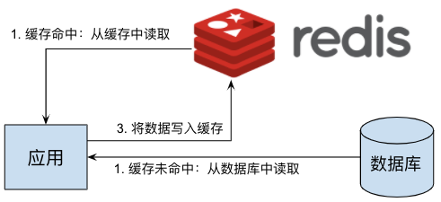
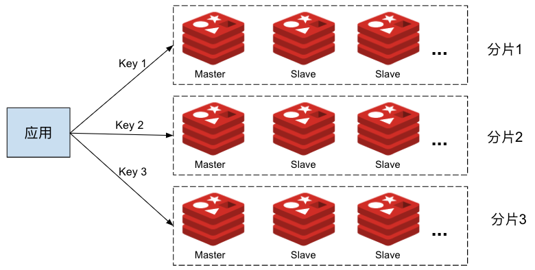
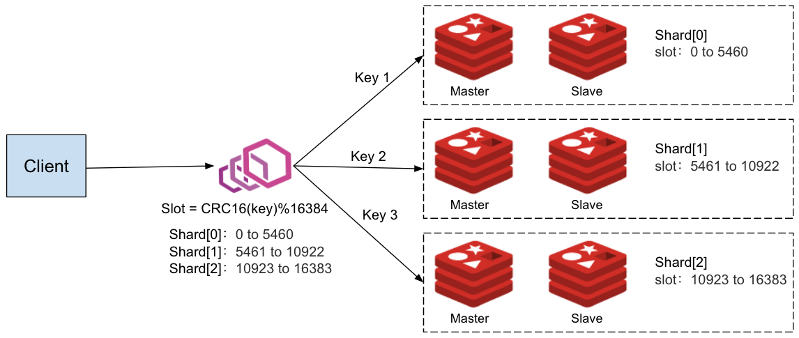
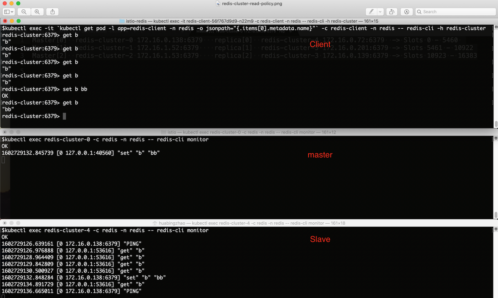
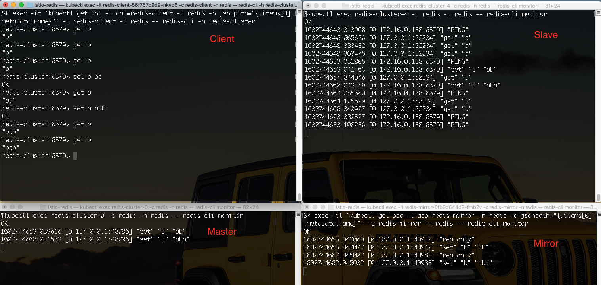

Redis 是一个高性能的 key-value 存储系统，被广泛用于微服务架构中。如果我们想要使用 Redis 集群模式提供的高级特性，则需要对客户端代码进行改动，这带来了应用升级和维护的一些困难。利用 Istio 和 Envoy ，我们可以在不修改客户端代码的前提下实现客户端无感知的 Redis Cluster 数据分片，并提供读写分离、流量镜像等高级流量管理功能。

## Redis Cluster

Redis 的一个常见用途是用作数据高速缓存。通过在应用服务器和数据库服务器之间加入一个 Redis 缓存层，可以减少应用服务器对数据库的大量读操作，避免数据库服务器在大压力下响应缓慢甚至宕机的风险，显著加强整个系统的健壮性。Redis 作为数据缓存的原理如图所示：



在一个小规模的系统中，上图所示的单个 Redis 就可以很好地实现缓存层的功能。当系统中需要缓存的数据量较大时，一个 Redis 服务器无法承担所有应用服务器的缓存需求；同时单个 Redis 实例失效时也会导致大量读请求被直接发送到后端的数据库服务器上，导致数据库服务器瞬时压力超标，影响系统的稳定性。我们可以采用 [Redis Cluster](https://redis.io/topics/cluster-spec) 来对缓存数据进行分片，将不同的数据放到不同的 Redis 分片中，以提高 Redis 缓存层的容量能力。在每个 Redis 分片中，还可以采用多个 replica 节点对缓存的读请求进行负载分担，并实现 Redis 的高可用。采用了 Redis Cluster 的系统如下图所示：



从图中可以看到，在 Redis Cluster 模式下，客户端需要根据集群的分片规则将不同 key 的读写操作发送到集群中不同的 Redis 节点上，因此客户端需要了解 Redis Cluster 的拓扑结构，这导致我们无法在不修改客户端的情况下将一个使用 Redis 独立节点模式的应用平滑迁移到 Redis Cluster 上。另外，由于客户端需要了解 Redis Cluster 的内部拓扑，也将导致客户端代码和 Redis Cluster 运维上的耦合，例如要实现读写分离或者流量镜像的话，就需要修改每个客户端的代码并重新部署。

这种场景下，我们可以在应用服务器和 Redis Cluster 之间放置一个 Envoy 代理服务器，由 Envoy 来负责将应用发出的缓存读写请求路由到正确的 Redis 节点上。一个微服务系统中存在大量需要访问缓存服务器的应用进程，为了避免单点故障和性能瓶颈，我们以 Sidecar 的形式为每个应用进程部署一个 Envoy 代理。同时，为了简化对这些代理的管理工作，我们可以采用 Istio 作为控制面来统一对所有 Envoy 代理进行配置,如下图所示：


在本文的后续部分，我们将介绍如何通过 Istio 和 Envoy 来管理 Redis Cluster，实现客户端无感知的数据分区，以及读写分离、流量镜像等高级路由策略。

## 部署 Istio

Pilot 中已经支持了 Redis 协议，但功能较弱，只能为 Redis 代理配置一个缺省路由，而且不支持 Redis Cluster 模式，无法实现 Redis filter 的数据分片、读写分离、流量镜像等高级流量管理功能。为了让 Istio 可以将 Redis Cluster 相关的配置下发到 Envoy Sidecar 上，我们修改了 EnvoyFilter 配置相关代码，以支持 EnvoyFilter 的 "REPLCAE" 操作。该修改的 PR [Implement REPLACE operation for EnvoyFilter patch](https://github.com/istio/istio/pull/27426/) 已经提交到 Istio 社区，并合入到了主分支中，将在 Istio 后续的版本中发布。

在撰写本文的时候，最新的 Istio 发布版本 1.7.3 中尚未合入该 PR。因此我构建了一个 Pilot 镜像，以启用 EnvoyFilter 的 "REPLACE" 操作。在安装 Istio 时，我们需要在 istioctl 命令中指定采用该 Pilot 镜像，如下面的命令行所示：

```bash
$ cd istio-1.7.3/bin
$ ./istioctl install --set components.pilot.hub=zhaohuabing --set components.pilot.tag=1.7.3-enable-ef-replace
```

备注：如果你采用的 Istio 版本新于 1.7.3，并且已经合入了该 PR，则可以直接采用 Istio 版本中缺省的 Pilot 镜像。

## 部署 Redis Cluster

请从 https://github.com/zhaohuabing/istio-redis-culster 下载下面示例中需要用到的相关代码：

```bash
$ git clone https://github.com/zhaohuabing/istio-redis-culster.git
$ cd istio-redis-culster
```

我们创建一个 "redis" namespace 来部署本例中的 Redis Cluster。

```bash
$ kubectl create ns redis
namespace/redis created
```

部署 Redis 服务器的 Statefulset 和 Configmap。

```bash
$ kubectl apply -f k8s/redis-cluster.yaml -n redis
configmap/redis-cluster created
statefulset.apps/redis-cluster created
service/redis-cluster created
```

### 验证 Redis 部署

确认 Redis 节点已经启动并正常运行：

```bash
$ kubectl get pod -n redis
NAME              READY   STATUS    RESTARTS   AGE
redis-cluster-0   2/2     Running   0          4m25s
redis-cluster-1   2/2     Running   0          3m56s
redis-cluster-2   2/2     Running   0          3m28s
redis-cluster-3   2/2     Running   0          2m58s
redis-cluster-4   2/2     Running   0          2m27s
redis-cluster-5   2/2     Running   0          117s
```

### 创建 Redis Cluster

在上面的步骤中，我们采用 Statefulset 部署了6个 Redis 节点，但目前这6个节点还是相互独立的，并未形成一个集群。下面我们采用 Redis 的 `cluster create` 命令将这些节点组成一个 Redis Cluster。

```bash
$ kubectl exec -it redis-cluster-0 -n redis -- redis-cli --cluster create --cluster-replicas 1 $(kubectl get pods -l app=redis-cluster -o jsonpath='{range.items[*]}{.status.podIP}:6379 ' -n redis)
Defaulting container name to redis.
Use 'kubectl describe pod/redis-cluster-0 -n redis' to see all of the containers in this pod.
>>> Performing hash slots allocation on 6 nodes...
Master[0] -> Slots 0 - 5460
Master[1] -> Slots 5461 - 10922
Master[2] -> Slots 10923 - 16383
Adding replica 172.16.0.72:6379 to 172.16.0.138:6379
Adding replica 172.16.0.201:6379 to 172.16.1.52:6379
Adding replica 172.16.0.139:6379 to 172.16.1.53:6379
M: 8fdc7aa28a6217b049a2265b87bff9723f202af0 172.16.0.138:6379
   slots:[0-5460] (5461 slots) master
M: 4dd6c1fecbbe4527e7d0de61b655e8b74b411e4c 172.16.1.52:6379
   slots:[5461-10922] (5462 slots) master
M: 0b86a0fbe76cdd4b48434b616b759936ca99d71c 172.16.1.53:6379
   slots:[10923-16383] (5461 slots) master
S: 94b139d247e9274b553c82fbbc6897bfd6d7f693 172.16.0.139:6379
   replicates 0b86a0fbe76cdd4b48434b616b759936ca99d71c
S: e293d25881c3cf6db86034cd9c26a1af29bc585a 172.16.0.72:6379
   replicates 8fdc7aa28a6217b049a2265b87bff9723f202af0
S: ab897de0eca1376558e006c5b0a49f5004252eb6 172.16.0.201:6379
   replicates 4dd6c1fecbbe4527e7d0de61b655e8b74b411e4c
Can I set the above configuration? (type 'yes' to accept): yes
>>> Nodes configuration updated
>>> Assign a different config epoch to each node
>>> Sending CLUSTER MEET messages to join the cluster
Waiting for the cluster to join
.
>>> Performing Cluster Check (using node 172.16.0.138:6379)
M: 8fdc7aa28a6217b049a2265b87bff9723f202af0 172.16.0.138:6379
   slots:[0-5460] (5461 slots) master
   1 additional replica(s)
M: 4dd6c1fecbbe4527e7d0de61b655e8b74b411e4c 172.16.1.52:6379
   slots:[5461-10922] (5462 slots) master
   1 additional replica(s)
S: 94b139d247e9274b553c82fbbc6897bfd6d7f693 172.16.0.139:6379
   slots: (0 slots) slave
   replicates 0b86a0fbe76cdd4b48434b616b759936ca99d71c
M: 0b86a0fbe76cdd4b48434b616b759936ca99d71c 172.16.1.53:6379
   slots:[10923-16383] (5461 slots) master
   1 additional replica(s)
S: ab897de0eca1376558e006c5b0a49f5004252eb6 172.16.0.201:6379
   slots: (0 slots) slave
   replicates 4dd6c1fecbbe4527e7d0de61b655e8b74b411e4c
S: e293d25881c3cf6db86034cd9c26a1af29bc585a 172.16.0.72:6379
   slots: (0 slots) slave
   replicates 8fdc7aa28a6217b049a2265b87bff9723f202af0
[OK] All nodes agree about slots configuration.
>>> Check for open slots...
>>> Check slots coverage...
[OK] All 16384 slots covered.
```

### 验证 Redis Cluster

我们可以采用 `cluster info` 命令查看 Redis Cluster 的配置信息和 Cluster 中的成员节点，以验证集群是否创建成功。

```bash
$ kubectl exec -it redis-cluster-0 -c redis -n redis -- redis-cli cluster info 
cluster_state:ok
cluster_slots_assigned:16384
cluster_slots_ok:16384
cluster_slots_pfail:0
cluster_slots_fail:0
cluster_known_nodes:6
cluster_size:3
cluster_current_epoch:6
cluster_my_epoch:1
cluster_stats_messages_ping_sent:206
cluster_stats_messages_pong_sent:210
cluster_stats_messages_sent:416
cluster_stats_messages_ping_received:205
cluster_stats_messages_pong_received:206
cluster_stats_messages_meet_received:5
cluster_stats_messages_received:416
```

### 部署测试用客户端

我们部署一个客户端，以用于发送测试命令:

```bash
$ kubectl apply -f k8s/redis-client.yaml -n redis
deployment.apps/redis-client created
```

## 通过 Istio 下发 Redis Cluster 相关的 Envoy 配置

在下面的步骤中，我们将通过 Istio 向 Envoy Sidecar 下发 Redis Cluster 相关配置，以在无需改动客户端的情况下启用 Redis Cluster 的高级功能，包括数据分片、读写分离和流量镜像。

### 创建 Envoy Redis Cluster

Envoy 提供了 "envoy.clusters.redis" 类型的 Envoy Cluster 来连接后端的 Redis Cluster，Envoy 会通过该 Cluster 获取后端 Redis Cluster 的拓扑结构，包括有多少个分片（shard），每个分片负责哪些 slot，以及分片中包含哪些节点，以将来自客户端的请求分发到正确的 Redis 节点上。

采用 EnvoyFilter 来创建所需的 Envoy Redis Cluster：

```bash
$ kubectl apply -f istio/envoyfilter-custom-redis-cluster.yaml
envoyfilter.networking.istio.io/custom-redis-cluster created
```

### 创建 Envoy Redis Proxy

Istio 缺省下发的 LDS 中配置的是 TCP proxy filter，我们需要将其替换为 Redis Proxy filter。

由于 1.7.3 中尚不支持 EnvoyFilter 的 "REPLACE" 操作，我们首先需要更新 EnvoyFilter 的 CRD 定义，然后才能创建该 EnvoyFilter：

```bash
$ kubectl apply -f istio/envoyfilter-crd.yaml 
customresourcedefinition.apiextensions.k8s.io/envoyfilters.networking.istio.io configured
```

采用 EnvoyFilter 来将 TCP proxy filter 替换为 Redis Proxy filter，以使 Envoy 可以代理来自客户端的 Redis 操作请求：

```bash
$ sed -i .bak "s/\${REDIS_VIP}/`kubectl get svc redis-cluster -n redis -o=jsonpath='{.spec.clusterIP}'`/" istio/envoyfilter-redis-proxy.yaml
$ kubectl apply -f istio/envoyfilter-redis-proxy.yaml
envoyfilter.networking.istio.io/add-redis-proxy created
```

## 验证 Redis Cluster 功能

现在一切就绪，下面我们来验证 Redis Cluster 的各项功能。

### Redis 数据分片

我们通过 Istio 将 EnvoyFilter 中定义的配置下发到 Envoy 后，Envoy 就能够自动发现后端 Redis Cluster 的拓扑结构，并根据客户端请求中的 key 将请求自动分发到 Redis Cluster 中正确的节点上。

根据前面创建 Redis Cluster 步骤中的命令行输出，我们可以看出该 Redis Cluster 的拓扑结构：Cluster 中有三个分片，每个分片中有一个 Master 节点，一个 Slave(Replica) 节点。客户端通过和其部署在同一个 Pod 中的 Envoy Proxy 访问 Redis Cluster，如下图所示：




Redis Cluster 中各个分片的 Master 和 Slave 节点地址：

```
Shard[0] Master[0]  redis-cluster-0 172.16.0.138:6379   replica  redis-cluster-4 172.16.0.72:6379  -> Slots 0 - 5460 
Shard[1] Master[1]  redis-cluster-1 172.16.1.52:6379    replica  redis-cluster-5 172.16.0.201:6379 -> Slots 5461 - 10922
Shard[2] Master[2]  redis-cluster-2 172.16.1.53:6379    replica  redis-cluster-3 172.16.0.139:6379 -> Slots 10923 - 16383
```

备注：如果你在自己的 K8s cluster 中部署该示例，那么 Redis Cluster 中各个节点的 IP 地址和拓扑结构可能稍有不同，但基本结构应该是类似的。

我们尝试从客户端向 Rdeis Cluster 发送一些不同 key 的 `set` 请求:

```bash
$ kubectl exec -it `kubectl get pod -l app=redis-client -n redis -o jsonpath="{.items[0].metadata.name}"` -c redis-client -n redis -- redis-cli -h redis-cluster
redis-cluster:6379> set a a
OK
redis-cluster:6379> set b b
OK
redis-cluster:6379> set c c
OK
redis-cluster:6379> set d d
OK
redis-cluster:6379> set e e
OK
redis-cluster:6379> set f f
OK
redis-cluster:6379> set g g
OK
redis-cluster:6379> set h h
OK
```

从客户端来看，所有的请求都成功了，我们可以使用 `scan` 命令在服务器端查看各个节点中的数据：

查看分片 Shard[0] 中的数据，master 节点是 redis-cluster-0 slave 节点是 redis-cluster-4。

```bash
$ kubectl exec redis-cluster-0 -c redis -n redis -- redis-cli --scan
b
f
$ kubectl exec redis-cluster-4 -c redis -n redis -- redis-cli --scan
f
b
```

查看分片 Shard[1] 中的数据，master 节点是 redis-cluster-1 slave 节点是 redis-cluster-5。

```bash
$ kubectl exec redis-cluster-1 -c redis -n redis -- redis-cli --scan
c
g
$ kubectl exec redis-cluster-5 -c redis -n redis -- redis-cli --scan
g
c
```

查看分片 Shard[2] 中的数据，master 节点是 redis-cluster-2 slave 节点是 redis-cluster-3。

```bash
$ kubectl exec redis-cluster-2 -c redis -n redis -- redis-cli --scan
a
e
d
h
$ kubectl exec redis-cluster-3 -c redis -n redis -- redis-cli --scan
h
e
d
a
```

从上面的验证结果中可以看到，客户端设置的数据被分发到了 Redis Cluster 中的三个分片中。该数据分发过程是由 Envoy Redis Proxy 自动实现的，客户端并不感知后端的 Redis Cluster，对客户端而言，和该 Redis Cluster 的交互与和一个单一 Redis 节点的交互是相同的。

采用该方法，我们可以在应用业务规模逐渐扩张，单一 Redis 节点压力过大时，将系统中的 Redis 从单节点无缝迁移到集群模式。在集群模式下，不同 key 的数据被缓存在不同的数据分片中，我们可以增加分片中 Replica 节点的数量来对一个分片进行扩容，也可以增加分片个数来对整个集群进行扩展，以应对由于业务不断扩展而增加的数据压力。由于 Envoy 可以感知 Redis Cluster 集群拓扑，数据的分发由 Envoy 完成，整个迁移和扩容过程无需客户端，不会影响到线上业务的正常运行。

### Redis 读写分离 

在一个 Redis 分片中，通常有一个 Master 节点，一到多个 Slave（Replica）节点，Master 节点负责写操作，并将数据变化同步到 Slave 节点。当来自应用的读操作压力较大时，我们可以在分片中增加更多的 Replica，以对读操作进行负载分担。Envoy Redis Rroxy 支持设置不同的读策略：

* __MASTER：__        只从 Master 节点读取数据，当客户端要求数据强一致性时需要采用该模式。该模式对 Master 压力较大，在同一个分片内无法采用多个节点对读操作进行负载分担。
* __PREFER_MASTER：__   优先从 Master 节点读取数据，当 Master 节点不可用时，从 Replica 节点读取。
* __REPLICA：__         只从 Replica 节点读取数据，由于 Master 到 Replica 的数据复制过程是异步执行的，采用该方式有可能读取到过期的数据，因此适用于客户端对数据一致性要求不高的场景。该模式下可以采用多个 Replica 节点来分担来自客户端的读负载。
* __PREFER_REPLICA：__  优先从 Replica 节点读取数据，当 Replica 节点不可用时，从 Master 节点读取。
* __ANY：__             从任意节点读取数据。

在前面下发的 EnvoyFilter 中，我们将 Envoy Redis Proxy 的读策略设置为了 "REPLICA"， 因此客户端的读操作应该只会被发送到 Replica 节点。让我们使用下面的命令来验证读写分离的策略:

通过客户端发起一系列 key 为 "b" 的 `get` 和 `set` 操作：

```bash
$ kubectl exec -it `kubectl get pod -l app=redis-client -n redis -o jsonpath="{.items[0].metadata.name}"` -c redis-client -n redis -- redis-cli -h redis-cluster

redis-cluster:6379> get b
"b"
redis-cluster:6379> get b
"b"
redis-cluster:6379> get b
"b"
redis-cluster:6379> set b bb
OK
redis-cluster:6379> get b
"bb"
redis-cluster:6379> 
```

在前面的 Redis Cluster 拓扑中，我们已经得知 key "b" 属于 Shard[0] 这个分片。我们可以通过命令 `redis-cli monitor` 查看该分片中 Master 和 Replica 节点中收到的命令。

Master 节点：

```bash
$ kubectl exec redis-cluster-0 -c redis -n redis -- redis-cli monitor
```

Slave 节点:

```bash
$ kubectl exec redis-cluster-4 -c redis -n redis -- redis-cli monitor
```

从下图中可以看到，所有 `get` 请求都被 Envoy 发送到了 Replica 节点上。


### Redis 流量镜像

Envoy Redis Proxy 支持流量镜像，即将客户端发送的请求同时发送到一个镜像 Redis 服务器/集群上。流量镜像是一个非常有用的功能，我们可以使用流量镜像将生产环境中的线上数据导入到测试环境中，以使用线上数据对应用进行尽可能真实的模拟测试，同时又不会影响到线上用户的正常使用。

我们创建一个单节点的 Redis 节点，用做镜像服务器：

```bash
$ kubectl apply -f k8s/redis-mirror.yaml -n redis 
deployment.apps/redis-mirror created
service/redis-mirror created
```

采用 EnvoFilter 来启用镜像策略：

```bash
$ sed -i .bak "s/\${REDIS_VIP}/`kubectl get svc redis-cluster -n redis -o=jsonpath='{.spec.clusterIP}'`/" istio/envoyfilter-redis-proxy-with-mirror.yaml
$ kubectl apply -f istio/envoyfilter-redis-proxy-with-mirror.yaml
envoyfilter.networking.istio.io/add-redis-proxy configured
```

通过客户端发起一系列 key 为 "b" 的 `get` 和 `set` 操作：

```bash
$ kubectl exec -it `kubectl get pod -l app=redis-client -n redis -o jsonpath="{.items[0].metadata.name}"` -c redis-client -n redis -- redis-cli -h redis-cluster
redis-cluster:6379> get b
"b"
redis-cluster:6379> get b
"b"
redis-cluster:6379> get b
"b"
redis-cluster:6379> set b bb
OK
redis-cluster:6379> get b
"bb"
redis-cluster:6379> set b bbb
OK
redis-cluster:6379> get b
"bbb"
redis-cluster:6379> get b
"bbb"
```

可以通过命令 `redis-cli monitor` 分别查看 Master、Replica 和镜像节点中收到的命令。

Master 节点:

```bash
$ kubectl exec redis-cluster-0 -c redis -n redis -- redis-cli monitor
```

Slave 节点:

```bash
$ kubectl exec redis-cluster-4 -c redis -n redis -- redis-cli monitor
```

镜像节点:

```bash
$ kubectl exec -it `kubectl get pod -l app=redis-mirror -n redis -o jsonpath="{.items[0].metadata.name}"` -c redis-mirror -n redis -- redis-cli monitor
```

从下图中可以看到，所有 `set` 请求都被 Envoy 发送到了一份镜像节点上。


## 实现原理

在上面的步骤中，我们在 Istio 中创建了两个 EnvoyFilter 配置对象。这两个 EnvoyFilter 修改了 Envoy 代理的配置，主要包括两部分内容：Redis Proxy Network Filter 配置和 Redis Cluster 配置。


下面的 EnvoyFilter 替换了 Pilot 为 Redis Service 创建的 Listener 中的 TCP Proxy Network Filter，将其替换为一个 "type.googleapis.com/envoy.config.filter.network.redis_proxy.v2.RedisProxy" 类型的 Network Filter。 该 Redis Proxy 的缺省路由指向 "custom-redis-cluster"，并且配置了读写分离策略和流量镜像策略。 

```yaml
apiVersion: networking.istio.io/v1alpha3
kind: EnvoyFilter
metadata:
  name: add-redis-proxy
  namespace: istio-system
spec:
  configPatches:
  - applyTo: NETWORK_FILTER
    match:
      listener:
        name: ${REDIS_VIP}_6379             # Replace REDIS_VIP with the cluster IP of "redis-cluster service
        filterChain:
          filter:
            name: "envoy.filters.network.tcp_proxy"
    patch:
      operation: REPLACE
      value:
        name: envoy.redis_proxy
        typed_config:
          "@type": type.googleapis.com/envoy.config.filter.network.redis_proxy.v2.RedisProxy
          stat_prefix: redis_stats
          prefix_routes:
            catch_all_route:
              request_mirror_policy:            # Send requests to the mirror cluster
              - cluster: outbound|6379||redis-mirror.redis.svc.cluster.local
                exclude_read_commands: True     # Mirror write commands only:
              cluster: custom-redis-cluster
          settings:
            op_timeout: 5s
            enable_redirection: true
            enable_command_stats: true
            read_policy: REPLICA               # Send read requests to replica
```

下面的 EnvoyFilter 在 Pilot 下发的 CDS 中创建了一个 "envoy.clusters.redis" 类型的 Cluster： "custom-redis-cluster"，该 Cluster 会采用 [CLUSTER SLOTS 命令](https://redis.io/commands/cluster-slots) 向 Redis 集群中的一个随机节点查询集群的拓扑结构，并在本地保存该拓扑结构，以将来自客户端的请求分发到集群中正确的 Redis 节点上。

```yaml
apiVersion: networking.istio.io/v1alpha3
kind: EnvoyFilter
metadata:
  name: custom-redis-cluster
  namespace: istio-system
spec:
  configPatches:
  - applyTo: CLUSTER
    patch:
      operation: INSERT_FIRST
      value:
        name: "custom-redis-cluster"
        connect_timeout: 0.5s
        lb_policy: CLUSTER_PROVIDED
        load_assignment:
          cluster_name: custom-redis-cluster
          endpoints:
          - lb_endpoints:
            - endpoint:
                address:
                  socket_address:
                    address: redis-cluster-0.redis-cluster.redis.svc.cluster.local
                    port_value: 6379
            - endpoint:
                address:
                  socket_address:
                    address: redis-cluster-1.redis-cluster.redis.svc.cluster.local
                    port_value: 6379
            - endpoint:
                address:
                  socket_address:
                    address: redis-cluster-2.redis-cluster.redis.svc.cluster.local
                    port_value: 6379
            - endpoint:
                address:
                  socket_address:
                    address: redis-cluster-3.redis-cluster.redis.svc.cluster.local
                    port_value: 6379
            - endpoint:
                address:
                  socket_address:
                    address: redis-cluster-4.redis-cluster.redis.svc.cluster.local
                    port_value: 6379
            - endpoint:
                address:
                  socket_address:
                    address: redis-cluster-5.redis-cluster.redis.svc.cluster.local
                    port_value: 6379
        cluster_type:
          name: envoy.clusters.redis
          typed_config:
            "@type": type.googleapis.com/google.protobuf.Struct
            value:
              cluster_refresh_rate: 5s
              cluster_refresh_timeout: 3s
              redirect_refresh_interval: 5s
              redirect_refresh_threshold: 5
```

## 小结

本文介绍了如何使用 Envoy 为微服务应用提供客户端无感知的 Redis 数据分片，以及如何通过 Istio 来统一管理系统中多个 Envoy 代理的 Redis Cluster 配置。我们可以看到，采用 Istio 和 Envoy 可以大大简化客户端使用 Redis Cluster 的编码和配置工作，并且可以在线修改 Redis Cluster 的运维策略，实现读写分离、流量镜像等高级流量管理。当然，引入 Istio 和 Envoy 并未减少整个系统的复杂度，而是将 Redis Cluster 维护的工作从各个分散的应用代码中集中到了服务网格基础设施层。对应广大应用开放者来说，其业务价值主要来自于应用代码，将大量精力投入此类基础设施是不太划算的。建议直接采用腾讯云上的云原生 Service Mesh 服务 TCM（Tencent Cloud Mesh），为微服务应用快速引入 Service Mesh 的流量管理和服务治理能力，而无需再关注 Service Mesh 基础设施自身的安装、维护、升级等事项。

## 参考文档

* [Deploying Redis Cluster on Top of Kubernetes](https://rancher.com/blog/2019/deploying-redis-cluster)
* [Migrating to Redis cluster using envoy proxy](https://medium.com/@fr33m0nk/migrating-to-redis-cluster-using-envoy-93a87ae79dc3)
* [Implement REPLACE operation for EnvoyFilter patch](https://github.com/istio/istio/pull/27426/)
