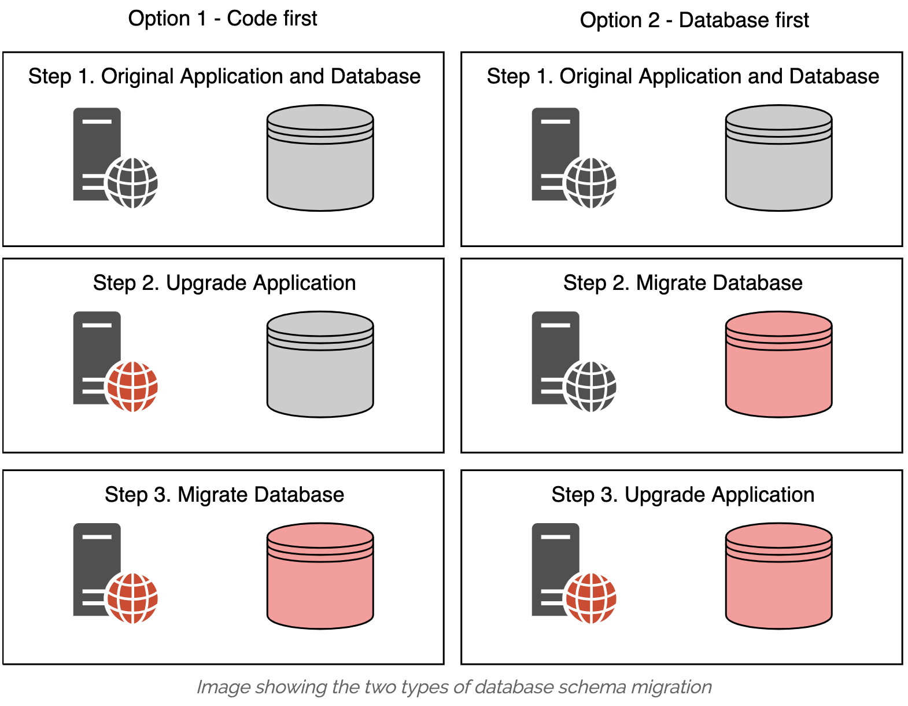
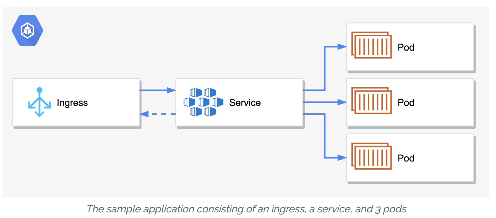
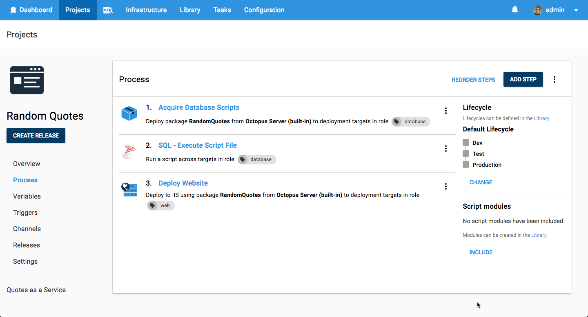
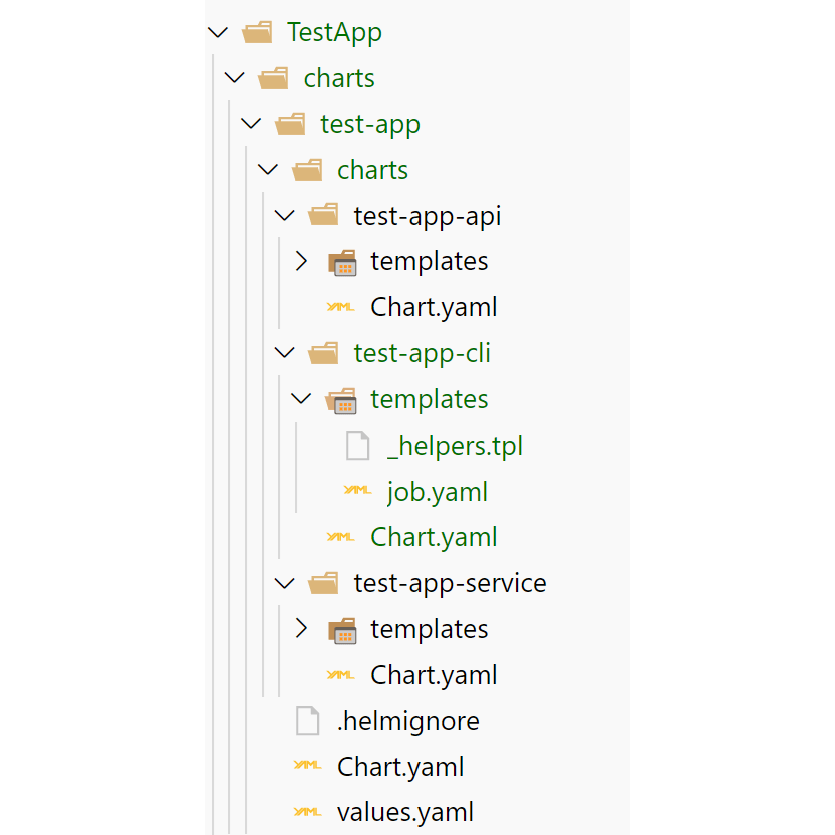
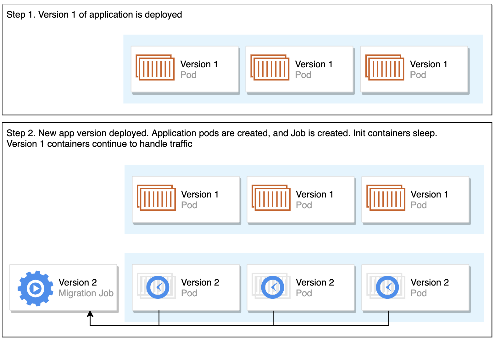
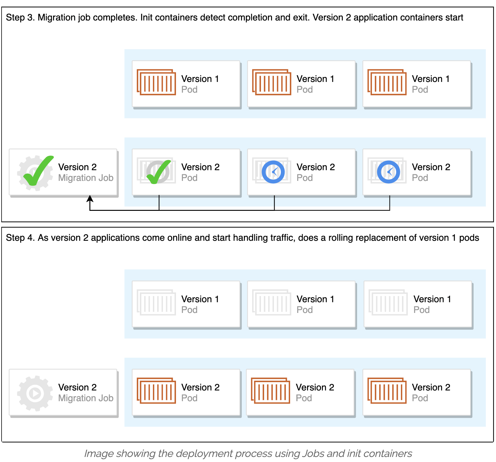

本文为翻译文章，[点击查看原文](https://andrewlock.net/deploying-asp-net-core-applications-to-kubernetes-part-7-running-database-migrations/)。

在这篇文章中，我会介绍在生产环境部署多副本应用时会碰到的一个经典问题： 数据库 schema 更新。

接下来将会讨论几种可能的解决方案，从简单到复杂。最后会总结一下我是如何在生产环境解决这个问题的：使用 Kubernetes Job 和 init container。 了解了这些解决方案（最重要的是谨慎的设计数据库 schema ）你可以比较从容的应对应用升级时的数据库数据更新的问题。

## 经典问题： 不断更新的数据库

这个问题其实非常普遍，新版本的应用需要使用到新的数据库 schema，所以当部署新版本应用时，就需要更新数据库的 schema，通常我们称之为 数据库 schema 变更(database migrations),几乎所有涉及数据库的应用都会碰到类似的问题。

有很多不同的方式来管理数据库的更新，比如说 EF Core，自动生成对应的更新数据来更新数据库。或者也有一些库可供使用，比如 DbUp 或者 FluentMigrator 可以让你以代码或者 SQL 脚本的方式定义数据库变更并自动的应用这些变更。

这些方式都类似的会记录那些已经应用在数据库中的更新，哪些还没有更新，并执行那些待更新的部分将变更部署到数据库里面，但是这些工具无法控制的一点就是什么时候去部署变更。

## 简单的 schema 更新策略

什么时候进行数据库 schema 变更这个问题看起来好像有个很明确的答案：在新应用运行之前。好了，实际应用起来就会发现，这对于大型的网页服务场景将会变得异常困难，特别是应用有很多实例的时候。

一个简单常见的方式可能是：

1. 将流量切换到备份站点
2. 停止应用
3. 部署数据库 schema 更新
4. 将流量切换回主站点

很明显这对于当前 7*24 的商业世界来说，将不会是一个可接受的方案。如果是一个简单的没什么流量的项目，它可能可以满足你的要求。这只是绕开了问题而没有根本的解决这个问题，因此我不会具体再深入讨论这个方案。

接下来探讨的方案会适用于任何网页服务的场景，但是我会主要使用 Kubernetes 的概念和例子，因为这是关于 Kubernetes 的文章。

如果你不打算使用这些方案，但是又想达到零停机的效果，那你需要意识到在数据库变更发生的期间，应用代码会访问到不同版本的数据库实例。

## 安全的执行数据库 schema 更新

让我们看一个更加实用的例子，假设你运行一个博客平台，打算给 BlogPost 加一个 Category 分类功能，每个博文会分配到一个唯一的上层分类，因此需要添加一个包含了分类列表的 categories 表，然后在 blog_posts 表里添加一个 category_id 列，引用 categories 表。

现在让我们考虑怎么部署，我们的应用会有两种状态：

- Category 代码添加前
- Category 代码添加后

对应的数据库也会有两种状态：

- 未创建 categories 表和 category_id 列
- 已创建 categories 表和 category_id 列

那如何应用数据库迁移就有了两种选择：

部署新应用，然后执行数据库变更。这样应用的第一种状态就只需要处理数据库的第一种状态，但是第二种状态的应用则需要处理混合两种状态的数据库

执行数据库变更，然后部署新应用。这样应用的第一种状态需要处理数据库的两种状态，但是第二种状态的应用则可以确保所需的表已经添加。



以上两种方式都适用于数据库变更，但是我偏向于后者。因为数据库的变更通常是整个部署流程中最麻烦的一步，因此我希望能优先处理这一步，如果发生什么问题，整个部署流程会终止，那新版本的应用也就不会部署上去了。

实际操作中，数据库新的 schema 应该是可以适配于旧版本的应用，也就是说你不能给已存在的表插入 NOT NULL 的列，因为应用并不知道哪一列会无法插入。所以要不就把新加的列设置为必须项，这样在接下来的部署中就会强制插入数据，或者配置一个默认值，来确保这一列是非空的。

总的来说，只要你了解了这些方法，数据库的变更不应该会给你带来很大的麻烦。当准备数据库变更的时候，问自己 **”如果只是执行数据库的数据变更，会不会破坏现有的应用运行？“**， 如果这个问题的答案是不会的话，那这次变更就不会有什么麻烦。

## 什么时候执行数据库迁移

现在我们同意在新应用启动之前执行数据库的数据更新，但是这还是不够具体清晰，因为我看到了三种不同的做法：

- 应用启动时执行数据库 schema 更新
- 将数据库 schema 更新作为部署流程的一部分
- 使用 Kuberentes Job 和 初始化容器（init container）来执行数据库 schema 更新

每种做法都各有利弊，接下来让我们逐个讨论。

让我们接着上面的例子，假设你的博客应用部署在 Kubernetes 里面，你会有一个 ingress，一个 service 和一个 deployment，就像我在[这篇文章](https://andrewlock.net/deploying-asp-net-core-applications-to-kubernetes-part-1-an-introduction-to-kubernetes/)提到过的。Deployment 会确保在任何时候都有三个应用的副本来处理网页的流量。



你需要在部署新版本应用的时候，执行数据库 schema 更新，让我们分析一下几个不同方案。

### 应用启动时执行数据库 schema 更新

第一个方案是在应用启动的时候执行数据库 schema 更新，可以通过调用 EF Core 的 `DbContext.Database.Migrate()`:

```java
public static void Main(string[] args)
{
    var host = CreateHostBuilder(args).Build();

    using (var scope = host.Services.CreateScope())
    {
        var db = scope.ServiceProvider.GetRequiredService<ApplicationDbContext>();
        db.Database.Migrate(); // apply the migrations
    }

    host.Run(); // start handling requests
}
```

虽然这个方案很简单，但是它却有一些重要的问题没解决：

- 应用的每个副本都会尝试去应用同样的数据库 schema 更新
- 应用有足够的权限对数据库做摧毁性的改动

第一点是一个很明显的问题，如果我们有三个副本，当我们尝试滚动更新应用的时候会导致的结果就是几个应用同时去修改数据库，这个在我所知道的工具中并不是一个支持的功能，而且伴随而来的是数据崩溃的风险。

当然并非没有办法去确认只有一个副本会修改数据库，但是我并不打算介绍任何一种，因为我不愿意因为任何一种原因导致应用有机会破坏我的数据库。

第二点其实是安全相关的，数据库迁移是一项很危险的操作，因为它有机会导致数据丢失或者毁坏。比较安全的做法是日常应用运行时跟数据库迁移时使用不同的数据库账户， 这样能减少应用运行时意外（或者恶意）的数据丢失的发生机率。 如果应用没有权限执行 `DROP` 表的动作，那就几乎没有这种意外发生的机会了。

如果你的应用除了运行业务代码外还要执行数据库变更的操作，那无法避免的是它一定需要特殊权限。这时候最好的做法就是确保只有在需要执行数据库 schema 更新的时候才使用那些特权账号，当然最最安全的做法就是不允许它使用特权账户。

### 将数据库 schema 更新作为部署流程的一部分

另外一个常见的做法是将数据库 schema 更新作为部署流程的一部分， 比如说 Octopus Deploy 的部署方案。它解决了我上面描述的两个问题，能确保 Octopus 不会并发的去修改数据库 schema, 而且当数据库的变更完成后，才会部署应用的代码。因为这两个部署的步骤被拆分开了，使得不同的权限账户的使用变得更加方便容易。



可能大家会问，Octopus 是如何执行数据库的 schema 更新了，怎么确认这些更新完成了呢？上面的例子里，Octopus 需要一个更新脚本并直接执行这个脚本。好的一面是这样很容易执行你的更新任务，而且不需要在你的应用代码里去解决这些更新的问题。但是它却让你高度依赖 Octopus ，这可能会是你不想看到的一点。

实际上，我自己实用的办法是使用一个简单的 .NET Core CLI 应用作为数据库工具来使用，或者说我简直把它当成一个数据库通用工具来使用，比如说使用 Jeremy D Miller 的 Oakton, 这样甚至可以利用来执行一些常见命令。

> 这篇文章会比较冗长，因此我并不打算在这里解释如何写一个类似的 CLI 工具， 而且这是一个比较简单的 .NET Core 的命令行项目，应该不会有太多麻烦的地方。

如果你采取这种方式，那还有一个问题需要解决，就是在哪里运行这个 CLI 工具？ 你的 CLI 工具应该会运行在某台机器上面，因此你在准备部署的时候也需要考虑到这方面的需求。Serverless 可能不太合适，因为通常数据库的数据操作会是耗时比较长的动作。

你看，Octopus 可以比较好的解决这个问题，如果你刚好正在使用这个项目，很明显，它将会是你的首选方案了。

接下来是一个完全基于 Kubernetes 的方案，也就是我现在采用的方案。

### 使用 Kuberentes Job 和初始化容器来执行数据库 schema 更新

我喜欢的 Kubernetes 原生的解决方案，使用 Job 和初始化容器。

#### Job

Kubernetes Job 会运行一个或者多个 pod 来处理工作负载，如果 pod 出错了，可以重试执行，如果 pod 正常结束，则 Job 顺利完成。

这正是我们想要用来做数据库数据更新的办法，创建一个 job 来执行数据库的 CLI 工具，出现网络问题时可以有选择的重试。因为它是一个 Kubernetes 原生概念，因此我们可以利用 Helm 的功能來模板化管理，将它包含在我们应用的 helm chart 里面。 从下面的图片可以看到，我给 test-app 添加了一个 CLI 项目，主要是一个 job.yaml。



这个方案难在如何在应用启动之前确保 Job 已经完成，我是通过使用 Kubernetes 的初始化容器來解決这个问题的。

#### 初始化容器 (Init Container)

如果你还记得这一系列文章里的第一篇，我讲过 Pod 是 Kubernetes 里包含一个或者多个容器的最小的调度单位。大部分情况下，Pod 会有一个主容器提供应用的主要功能，可能还会有一个或者多个 sidecar 容器提供一些附加的功能，比如说 metrics 或者 service mesh。

我们也可以选择在 Pod 里使用初始化容器，这样 Kubernetes 部署 pod 的时候，就会先运行所有的初始化容器。只有当所有的初始化容器都正常运作并退出时，主容器才会开始运行，通常这样的功能会被用于下载或者做一些主容器要求的预先配置，这样可以让你的主容器只负责运行业务代码而不须关注环境配置。

#### 使用 Job 和初始化容器来处理数据库数据更新

当我刚开始探索初始化容器的时候，我尝试过直接使用初始化容器来负责数据库数据更新，但是这又碰到了那个问题，在应用运行的时候无法避免的出现了同时间几个应用副本都去修改数据库的问题。因此我决定使用两步走的方案：使用初始化容器来延迟主容器启动直至确认数据库迁移的 Job 顺利完成。

主要步骤看起来像是这样：

- 应用的 Helm chart 包含了应用的部署和数据库数据更新的 Job。
- 每个应用的 Pod 都会包含一个初始化容器，这个初始化容器会一直休眠直至相关的 Job 成功完成。当初始化容器发现 Job 完成时，它自己会正常退出，这样主容器才会开始运行。
- 作为滚动更新的一部分，数据库迁移的 Job 一旦部署会马上执行，新版本的应用也会被创建出来但是不会运行，因为数据库数据更新的 Job 还在运行，初始化容器也就还处于休眠状态中，这样新版本的 Pod 就会被推迟运行。而且旧版本的 Pod 不会受到影响，还能继续处理业务流量。
- 当数据库数据更新完成时，Job 就会正常结束。
- 当初始化容器发现相关的 Job 正常结束了，它自己也就会退出。这样应用的容器才会开始启动并处理业务流量。
- 旧版本的 pod 会根据滚动更新的策略被移除。




就像我说过的，这个方案我已经成功的使用了好几年，因此我觉得它是一个合适的解决方案。我在下一篇文章会详细的解释如何实施这个方案。

在我们完成本次探讨之前，我想再聊聊最后的一个做法：使用 Helm Chart Hooks。

#### Helm Chart Hooks

字面上来看，[Helm Chart Hooks](https://helm.sh/docs/topics/charts_hooks/) 看起来好像可以实现我们想要的东西，它可以让我们在执行主要部署任务时，提前运行一个 Job 作为部署这个 helm chart 的一部分。

在我第一次尝试使用这个方法时，这正就是我的做法。 我们可以将一个 Kubernetes 的 Job 通过添加 annotation 来转化成为 Helm Hook，看下面这个例子：

```yaml
apiVersion: batch/v1
kind: Job
metadata:
  name: "{{ .Release.Name }}"
  annotations:
    # This is what defines this resource as a hook
    "helm.sh/hook": pre-install
```

只要添加上这一行就能确保 Helm 不会将这一部分作为主要的安装或者升级流程，相反，它会在部署主应用之前先运行 job ，并等待这个 job 完成。只要这个 job 顺利完成， 这整个 chart 就会开始安装，并对你的应用执行滚动更新。如果 Job 失败了，这个 chart 不会继续安装，正在运行的应用也不会受影响。

我刚开始测试这个方案的时候是可以的，但是有个意外。 如果数据库的更新耗时较长超过了 Helm 的 timeout 时间， Helm 会 timeout退出，这样整个部署就不会继续，但是并不知道数据库迁移到底成功了还是失败了。

事实上生产环境通常有更多的数据量更更高的负载，因此对于数据库的变更很大机率会变得很慢，结果会导致上面的意外发生，所以最终我们还是选择了前面描述的初始化容器的方式。

> 我也有段时间没有了解过 Helm Chart Hooks 了，有可能这个问题已经解决了，但是我并没有在文档中见到相关描述。

## 总结

这篇文章中我描述了应用部署在 kubernetes 的时候如何解决数据库数据更新的问题，也探讨了让数据库数据更新适应多版本应用的必要性和几种不同的解决方案。

我推荐的方案是创建一个 CLI 工具负责执行数据库数据更新，并以 Kubernetes Job 的形式运行。另外，在应用的每个 Pod 添加一个初始化容器，确保 Job 成功完成才启动应用容器。

这篇文章只是探讨了一些概念上的东西，在接下来的文章中我会仔细描述如何实施，如何以 Helm Chart 的形式部署一个 Kubernetes Job 并使用初始化容器来控制应用容器的启动流程。