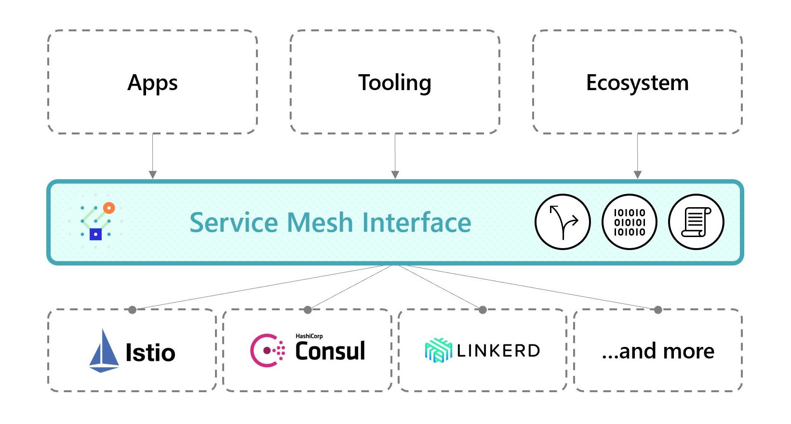
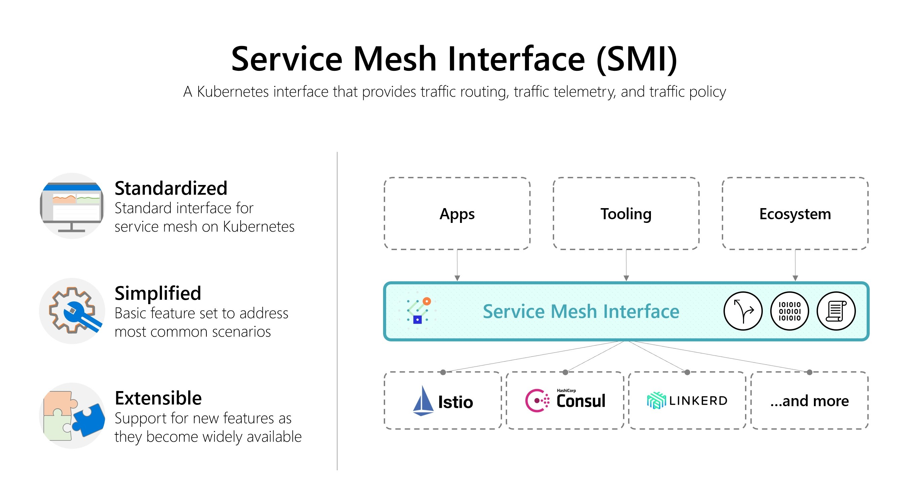
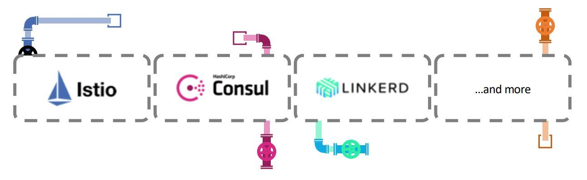
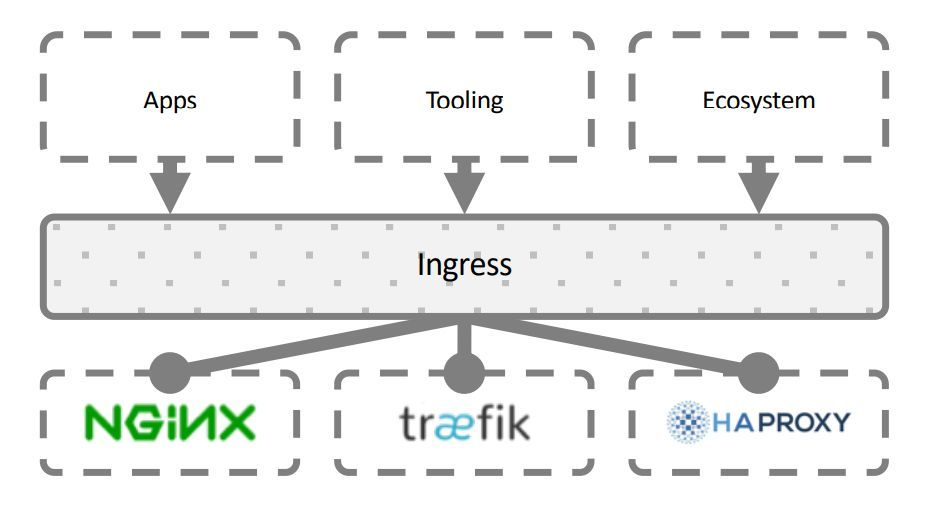
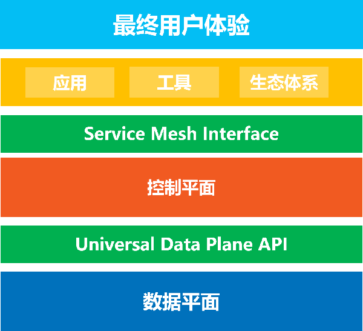
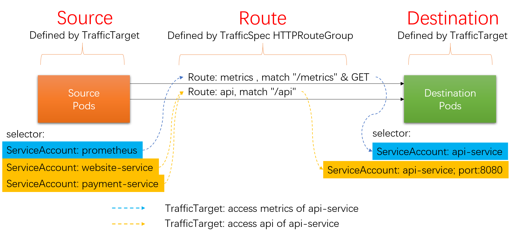
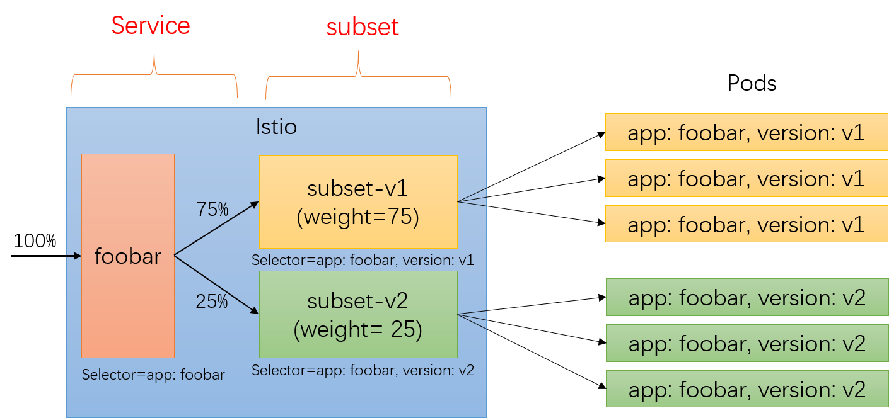

## SMI介绍


### SMI是什么？

5月21号，在 kubeconf上，微软联合一众小伙伴，宣布了 Service Mesh Interface，简称SMI。SMI是一个服务网格规范，定义了通用标准，包含基本特性以满足大多数场景下的通用需求。

援引来自SMI官方网站  [smi-spec.io](https://smi-spec.io/) 的介绍资料，对 Service Mesh Interface 的定位是 ：

> A standard interface for service meshes on Kubernetes.
> 
> Kubernetes上的 service mesh 的标准接口

微软的 [官方博客文章](https://msft.today/hello-service-mesh-interface-smi-a-specification-for-service-mesh-interoperability/) 这样介绍SMI：

> SMI定义了一组通用可移植的API，为开发人员提供跨不同服务网格技术的互通性，包括Istio，Linkerd和Consul Connect。



SMI 是希望在各家 Service Mesh 的实现之上建立一个抽象的API层，然后通过这个抽象来解耦和屏蔽底层 Service Mesh 实现，让上层的应用、工具、生态系统可以建立在一个业界标准之上，从而实现跨不同实现的可移植性和互通性。

### SMI推出的背景

 [Idit Levine](https://medium.com/@idit.levine_92620)，初创公司 solo.io 的创始人兼CEO，作为SMI推出的重要力量之一，撰文描述了 SMI 推出的背景：

> 服务网格生态系统正在兴起，众多的网格供应商和不同的用例需要不同的技术。所以问题来了：我们如何实现在不破坏最终用户体验的前提下促进行业创新？通过以一组标准API达成一致，我们可以提供互通性，并在不同网格以及为这些网格构建的工具之上维持最终用户体验。
>
> 今天发布的 Service Mesh Interface（SMI）是使这一构想走向行业现实的重要一步。

下面这幅图片可以非常清晰的表述SMI的定位，也可以帮助我们一起来解读SMI推出的背景：



1. Service Mesh的价值正在被普遍认可：从最早的Linkerd，Envoy，到两年前Google力推Istio，以及 Linkerd2 的推出，最近 AWS 推出了 App Mesh，Google 则将 Istio 搬上了Google Cloud 推出了 Istio 的公有云托管版本 Google Cloud Service Mesh，还推出了单独的控制平面产品 Google Traffic Director。微软也在去年推出了Azure完全托管版本的Service Fabric Mesh （预览版）。云市场三巨头都已经先后出手。

2. 市场上出现了众多的Service Mesh产品：开源的，闭源的，大公司出的，小公司出的，市场繁荣的同时也带来了市场碎片化的问题。

	

3. 在云原生理念下，我们推崇应用轻量化，只关注业务逻辑。Service Mesh技术很好的实现了这一战略目标：运行在 service mesh 上的应用可以和底层 service mesh 的具体实现解耦。理论上应用在不同的 service mesh 实现上迁移是可行的，从这一点说，service mesh 在云原生的道路上迈出了重要一步。

4. 但是，所有围绕业务应用的外围工作，比如通过 service mesh对流量进行控制，配置各种安全/监控/策略等行为，以及在这些需求上建立起来的工具和生态系统，却不得不牢牢的绑死在某个具体的 service mesh实现上，所谓"供应商锁定"。

5. 其根本问题在于各家实现不同，又没有统一标准。因此，要想解决上述问题，就必须釜底抽薪：**解决 Service Mesh 的标准化问题**。

微软给出的解决方案就是引入SMI，作为一个通用的行业规范/标准，如果能让各家 service mesh 提供商都遵循这个标准，则有机会在具体的 service mesh 产品之上，抽象出一个公共层（如定义一组通用可移植的API），屏蔽掉上层应用/工具/生态系统对具体  service mesh 产品的实现细节。

是不是觉得 SMI 的概念有种熟悉的味道？是的，没错，类似的事情在k8s中之前就发生过很多次，比如 CNI、CRI、CSI，还有下图展示的 Ingress：



在SMI中，将这个目标称为 "**Interoperability**" / 互通性。我个人理解，这其实和 google 一直在倡导的 "not lock-in" 是一个概念：有通用的社区标准/行业标准，在此基础上客户可以在多个实现/多个供应商之间自由选择和迁移，没有被绑定的风险，而且提供给用户的功能以及使用方式也保持一致，也就是 Idit Levine 所强调的 "维持最终用户体验"。

从这个角度说，我很欣喜的看到 SMI 的推出，虽然这条路可能不是那么容易走，但是，的确，"Service Mesh Interface（SMI）是使这一构想走向行业现实的重要一步"。

### 和通用数据平面API的关系

在SMI提出来之前不久（大概早两个星期），CNCF也在进行类似的标准化操作：CNCF正在筹建通用数据平面API工作组（Universal Data Plane API Working Group / UDPA-WG)，以制定数据平面的标准API，为L4/L7数据平面配置提供事实上的标准，初始成员将包括 Envoy 和 gRPC 项目的代表。事实上是 Google 在驱动，主要参与的项目是 Istio 和 Envoy。

下面这张图片展示UDPA 和 SMI 这两个新近推出的 Service Mesh 标准API的关系：



- Universal Data Plane API 是数据平面的标准，控制平面通过这个API来控制数据平面的行为。工作组的初始成员来自包括 Envoy 和 gRPC 项目的代表，**背后的公司主要是 Google** 。 
- Service Mesh Interface 是控制平面的标准，上层的应用/工具/生态体系通过 Service Mesh Interface 来实现跨不同的Service Mesh实现为最终用户提供一致性的体验。**SMI由微软牵头**，联合 Linkerd，HashiCorp，Solo，Kinvolk和Weaveworks。

### SMI的目标和愿景

关于 SMI 的目标和愿景，我援引  Idit Levine 的这段话（这段话也同样出现在 smi-spec 的 github 首页）：

> SMI 是在 Kubernetes 上运行服务网格的规范。它定义了由各种供应商实现的通用标准。这使得最终用户的标准化和服务网格供应商的创新可以两全其美。SMI 实现了灵活性和互通性。

更详细而明确的目标描述来自 smi-spec 的 github 首页：

> 目标
> 
> SMI API的目标是提供一组通用的，可移植的Service Mesh API，Kubernetes用户可以以供应商无关的方式使用这些API。通过这种方式，可以定义使用Service Mesh技术的应用程序，而无需紧密绑定到任何特定实现。

然后还特别强调：

> 非目标
> 
> **SMI项目本身不实现服务网格**。SMI只是试图定义通用规范。同样，SMI不定义服务网格的具体范围，而是一个通用子集。 欢迎SMI供应商添加超出SMI规范的供应商特定扩展和API。 我们希望随着时间的推移，随着更多功能被普遍接受为服务网格的一部分，这些定义将迁移到SMI规范中。

总结：首先非常明确的一点是，SMI是定义标准API，而不是标准实现。

而 SMI 的具体目标，在 SMI 的官方网站是这样介绍的：

1. A standard interface for service meshes on Kubernetes: Kubernetes上的 service mesh 的标准接口
2. A basic feature set for the most common service mesh use cases：用于最通用的服务网格用例的基本特性
3. Flexibility to support new service mesh capabilities over time：随着时间的推移灵活地支持新的服务网格能力
4. Space for the ecosystem to innovate with service mesh technology: 使用服务网格技术实现生态系统创新的空间

### SMI社区

有需求，有市场，有想法，有目标，我们再来看看 SMI 阵营现在都有什么力量。

微软在推出 SMI 时的描述到：SMI是一个开放项目，由微软，Linkerd，HashiCorp，Solo，Kinvolk和Weaveworks联合启动; 并得到了Aspen Mesh，Canonical，Docker，Pivotal，Rancher，Red Hat和VMware的支持。


阵营还是挺强大的：

- 微软：SMI的带头大哥，云计算的三巨头之一
- Buoyant：Service Mesh 技术的拓荒牛 + 布道者，小而弥坚的初创公司，有一个不大但是力量很强又非常有经验还很务实的团队。其旗下的 Linkerd2 已经明确表示将支持 SMI。
- HashiCorp：大名鼎鼎的 consul 就出自这里，Consul Connect 也是目前活跃的 service mesh 实现之一，虽然Consul Connect在国内知名度和影响力都很小（也就年度总结的时候捎带着看一眼状态的那种）。Consul Connect 目前也表示提供了对 SMI 的支持。
- Solo.io：深藏不露的初创型小公司，"产品面很广，除了 Service Mesh 方面大有名气的 SuperGloo 和 Service Mesh hub 之外，还有远程调试、混沌工程、unikernels 以及微服务网关等几个产品。"（这段话我从秀龙的文章里面抄过来的，总结的很好）。另外，业界网红 Christian Posta 前段时间加入这家公司。solo公司旗下的 SuperGloo 是业界第一个 service mesh 编排产品，因此对 SMI 的热爱和支持是无可复加的。SuperGloo 和 Service Mesh Hub 已经实现了对 SMI 的支持。
- Mesery 和 Kinvolk：这两家公司最近在 service mesh社区有点名气，因为他们近期做了 Istio vs Linkerd 的性能测试并给出了报告，闹的满城风雨。而且他们也都喜欢用 solo 出的 SuperGloo（毕竟业界号称 service mesh 编排的也就独此一家）。
- Aspen Mesh： F5 （没错，就是那个巨贵的F5）出的的Istio商业版本。但是没有看到 Aspen Mesh 给出支持 SMI 的信息，暂时还不知道 Aspen Mesh 和 SMI 的关系。 
- vmware：vmware在2018年底推出了 VMware NSX Service Mesh ，和Aspen Mesh一样也是基于 Istio 。

其他公司就不再一一列出来了，主要是不清楚他们在 SMI 这个事情上扮演什么角色。

而关键点在于，Google （还有同属Istio阵营的 IBM / Lyft）不在其列。而 Service Mesh 的其他玩家，几乎都参与了 SMI，甚至包括原本在 Istio 项目上和 google 一直合作的公司，耐人寻味。

## SMI规范内容

### SMI规范介绍

Service Mesh Interface 规范涵盖最常见服务网格能力：

- Traffic Policy/流量策略 - 跨服务应用身份和传输加密等策略
- Traffic Telemetry/流量遥测 - 捕获关键指标，如错误率和服务间的延迟
- Traffic Management/流量管理 - 在不同服务之间转移流量

SMI规范由多个API组成：

- Traffic Access Control/流量访问控制 - 根据客户端的身份配置对特定pod和路由的访问，以将应用程序锁定到仅允许的用户和服务。
- Traffic Specs/流量规范 - 定义流量的表示方式，基于每个协议的基础。 这些资源与访问控制和其他类型的策略协同工作，以在协议级别管理流量。
- Traffic Split/流量分割 - 逐步引导各种服务之间的流量百分比，以帮助构建金丝雀推出。
- Traffic Metrics/流量指标 - 暴露通用的流量指标，供dashboard和autoscaler等工具使用。

注意：SMI 被指定为 Kubernetes Custom Resource Definitions（CRD）和 Extension API Servers 的集合。 这些API可以安装到Kubernetes集群上，并使用标准工具进行操作。

在设计上，SMI 强调 "Provider Agnostic（供应商无关）"：

> SMI API的目标是提供一组通用的可移植的服务网格API，Kubernetes用户可以以供应商无关的方式使用这些API。 通过这种方式，人们可以定义使用服务网格技术的应用程序，而无需紧密绑定到任何特定实现。

下面我们来详细看一下 SMI 规范的具体API定义，其定义来自https://github.com/deislabs/smi-spec 。

### Traffic Spec

Traffic Spec资源用于让用户定义流量。通常与Access Control（访问控制）和其他策略一起使用，以具体定义需要如何处理流经网格的特定类型流量。

用户往往希望在服务网格内运行许多不同的协议。 当然，主要会是HTTP，但也会有其他协议。 Traffic Spec规范中的每个资源都旨在与特定协议1：1匹配。 这让用户可以以协议特定的方式来定义流量。

**HTTPRouteGroup**

HTTPRouteGroup 资源用于描述HTTP/1和HTTP/2流量，它枚举了应用程序可以提供的路由。

```yaml
apiVersion: specs.smi-spec.io/v1alpha1
kind: HTTPRouteGroup
metadata:
  name: the-routes
matches:
- name: metrics
  pathRegex: "/metrics"
  methods:
  - GET
- name: health
  pathRegex: "/ping"
  methods: ["*"]
```

上面的例子定义两个`match`，`metrics`和`health`。 name 字段是key，所有字段都是必需的。 正则表达式用于匹配URI。 HTTP Mesh可以具体制定如 `GET` 或用 `*` 来匹配所有。

HTTPRouteGroup 当前的功能限制（未来会加入，只是当前作为第一个版本内容还比较少）：

1. 只支持 HTTP 协议，连 gRPC 都还未支持
2.  `match` 字段当前仅适用于 `URI`。 很明显这是不够的，未来计划扩展以支持HTTP header，Host等。

> 个人看法：目前在只有 HTTP 协议支持，而且 HTTP 路由定义居然不支持 HTTP header 匹配，足够说明目前 SMI 的确是处于项目早期状态。

**TCPRoute**

TCPRoute资源用于描述 L4 TCP流量。 这个路由极其简单（或者叫做简陋），定义应用程序接收到的原始的、无协议特征的流量。

看完下面的yaml例子就明白为什么称为极其简单了：

```yaml
apiVersion: specs.smi-spec.io/v1alpha1
kind: TCPRoute
metadata:
  name: tcp-route
```

上面的路由只做了定义，尚未与任何资源相关联。 我们继续看如何使用，比如与Access Control 配合。

### Traffic Access Control

Traffic Access Control 资源用来为应用程序定义访问控制策略：

1. 访问控制属于授权（authorization）范畴，默认身份验证（Authentication）已经由底层实现处理
2. SMI规范中的访问控制是附加的，默认情况下**拒绝所有流量**。

**TrafficTarget 规范**

TrafficTarget 规范用来定义流量访问控制，而 SMI 中访问控制是基于服务身份（service identity）的，并且目前只支持通过 Kubernetes service account 来指派服务身份（其他身份机制将在稍后支持）。

流量访问控制有三个概念，分别在 TrafficTarget 中以三个字段定义：

1. Source：流量的来源，体现为具体的 Pod 列表，目前支持通过selector来实现，暂时不支持以资源的方式选择（如指定Deployment、指定Service）
2. Destination：流量的目标，同样体现为具体的 Pod 列表，也只支持selector
3. Route：流量规范，用来区分 Destination 提供的多种不同的流量访问方式，如下图中的api访问和获取metrics信息



在这个例子中，展示对api进行访问和获取metrics信息这两个操作的流量访问控制：

```yaml
# 定义TrafficSpec
apiVersion: specs.smi-spec.io/v1alpha1
kind: HTTPRouteGroup
metadata:
  name: api-service-routes
matches:
  - name: api  # api访问的流量
    pathRegex: /api
    methods: ["*"]
  - name: metrics # 获取metrics的流量
    pathRegex: /metrics
    methods: ["GET"]

---
kind: TrafficTarget
apiVersion: access.smi-spec.io/v1alpha1
metadata:
 name: api-service-metrics # 定义获取metrics的Target
 namespace: default
destination:	# 通过 ServiceAccount 选择pods
 kind: ServiceAccount
 name: api-service
 namespace: default
specs: # 引用traficSec定义的route，指定为获取metrics
- kind: HTTPRouteGroup
  name: api-service-routes
  matches:
    - metrics
sources: # 通过 ServiceAccount 选择pods
- kind: ServiceAccount
  name: prometheus
  namespace: default

---
kind: TrafficTarget
apiVersion: access.smi-spec.io/v1alpha1
metadata:
 name: api-service-api # 定义访问api接口的Target
 namespace: default
destination: # 通过 ServiceAccount 选择pods
 kind: ServiceAccount
 name: api-service
 namespace: default
 port: 8080
specs: # 引用traficSec定义的route，指定为api访问
- kind: HTTPRouteGroup
  name: api-service-routes
  matches:
    - api
sources: # 通过 ServiceAccount 选择pods
- kind: ServiceAccount
  name: website-service
  namespace: default
- kind: ServiceAccount
  name: payments-service
  namespace: default
```

上述实例定义了两个容许的访问控制：

1. 对于以 ServiceAccount 为 api-service 运行的 pods，容许来自以 ServiceAccount 为 prometheus 的 pods 访问 api-service-routes 定义下的 metrics 路由
2. 对于以 ServiceAccount 为 api-service 运行的 pods，容许来自以 ServiceAccount 为 website-service 和 payments-service  的 pods 访问 api-service-routes 定义下的 api 路由

其中有部分字段为可选字段：

- matches 字段：如果省略，则对 TrafficSpec 下定义的所有Route都生效
- Port字段：如果省略，则表示所有端口

SMI 流量访问控制的规则是默认都不容许访问，只有通过 TrafficTarget 指定的符合条件的流量才容许访问。而访问控制的执行，是明确要求在访问的服务器端（即Destination）强制执行，而是否在客户端（即Source）进行访问控制则由SMI的具体实现来决定。

注意目前 Traffic Access Control 在定义 Source 和 Destination 时，都是通过 Selector 来定义的，我们细看这张图片：


从访问控制的业务语义上看，上面两个 TrafficTarget 翻译出来就是：

- 容许以 ServiceAccount prometheus 运行的服务访问以 ServiceAccount api-service 运行的服务的 metrics
- 容许以 ServiceAccount web-service 和 payment-service 运行的服务访问以 ServiceAccount api-service 运行的服务的 api

而不是我们平时熟悉的资源方式如"容许A服务访问B服务"，即访问控制中对服务的标示目前只能通过 ServiceAccount + Selector 来完成，而不是通过简单的服务Id或者名称来指定资源。请注意"容许以身份A运行的服务访问以身份B运行的服务" 和 "容许A服务访问B服务" 的细微差别。

关于这一点，在 SMI 的文档的"Tradeoffs"中提到：

> Resources vs selectors - it would be possible to reference concrete resources such as a deployment instead of selecting across pods.
>
> 资源 vs 选择器 - 可以引用具体资源（如deployment）而不是pod选择。

### Traffic Split

Traffic Split 资源用来实现流量的百分比拆分，熟悉Istio的同学应该非常了解这个功能的强大。

但是 SMI 中 Traffic Split 的配置方式和 Istio 有非常大的不同，比如下面的配置，要对 foobar 服务按照版本进行流量拆分，v1 和 v2 权重分别为 1 和 500m （1=1000m），在 Traffic Split 的配置中会出现多个 service：

```yaml
apiVersion: split.smi-spec.io/v1alpha1
kind: TrafficSplit
metadata:
  name: foobar-rollout
spec:
  service: foobar # root service，客户端用这个服务名来连接目标应用
  backends: # root service 后面的服务，有自己的selectors, endpoints 和 configuration
  - service: foobar-v1
    weight: 1
  - service: foobar-v2
    weight: 500m
```

- "foobar"：通过 `spec.service` 指定，这是 Traffic Split 的 root service，是要配置进行流量拆分的目标服务的FQDN，客户端用这个 service 进行通信，也就是说这个 root service 是暴露给客户端的。
- "footer-v1" 和 "footer-v2"：这两个后端服务，是"隐藏"在 root service 后面的，通常是 root service 的子集，典型实现上是 selector 多加一个 version label 限制。 

这样，如果要对某个服务的两个子集进行流量拆分，典型如版本v1和版本v2，在 SMI 中就会有三个 k8s service 定义：

| 资源                 | selector （label）         | 描述            |
| -------------------- | -------------------------- | --------------- |
| service foobar       | `app: foobar`             | root service    |
| service foobar-v1    | `app: foobar`, `version: v1` | backend service |
| service foobar-v2    | `app: foobar`, `version: v2` | backend service |

这三个 service 和 pod 的关系如下图所示：


我们来对比 Istio 中实现类似功能的方式，Istio中需要为准备进行流量拆分的服务定义 VirtualService，通过 subset 来区分不同的流量去向：

```yaml
apiVersion: networking.istio.io/v1alpha3
kind: VirtualService
metadata:
  name: foobar-route
spec:
  hosts:
  - foobar
  http:
  - route:
    - destination:
        host: foobar
        subset: v2
      weight: 25
    - destination:
        host: foobar
        subset: v1
      weight: 75
```

subset 在 DestinationRule 中定义，注意这里只涉及到 labels，服务（以host标志）并没有多个，还是 foobar：

```yam
apiVersion: networking.istio.io/v1alpha3
kind: DestinationRule
metadata:
  name: foobar-destination
spec:
  host: foobar
  subsets:
  - name: v1
    labels:
      version: v1
  - name: v2
    labels:
      version: v2
```

在Istio 中，service 和 subset 的关系如下图所示：



可以看到 SMI 中的 backend service 和 Istio 中的 subset 在功能上几乎是对等的。

但是：SMI 和 Istio 的根本差异在于 Istio 中的 subset 是一个虚拟的抽象对象，在k8s中并没有实体资源。而在 SMI 中，backend service 是实实在在存在的 k8s service 资源。

这里个人觉得有一个隐忧：在 SMI 中，为了进行流量拆分，就不得不为每个版本建立一个独立的k8s service，service 数量会比 Istio 方案多很多。

另外就是在权重设置上的细微的差别，SMI 用的是相对weight（比如可以设置为1:2），而 Istio 是严格的百分比，而且要求总和为100。

### Traffic Metrics

Traffic Metrics 资源提供通用集成点，工具可以通过访问这些集成点来抓取指标。Traffic Metrics 遵循 `metrics.k8s.io` 的模式，其即时指标可用于各种 CLI工具，HPA伸缩等。

和大多数Metrics系统一致，SMI的Traffic Metrics 数据包含两个核心对象：

1. Resource：Metrics 和资源绑定，资源可以是 pod 和更高级别的概念如 namespaces, deployments 或者 services 。Pod是 Metrics 可以关联的最细粒度的资源，通过集合可以得到推断出其他。
2. Edge：表示流量来源或其目的地，描述力量的方向。

**TrafficMetrics**

TrafficMetrics是核心资源，关联到资源，具有edge，延迟百分位数和请求量：

```yaml
apiVersion: metrics.smi-spec.io/v1alpha1
kind: TrafficMetrics
resource:
  name: foo-775b9cbd88-ntxsl
  namespace: foobar
  kind: Pod
edge:
  direction: to
  resource:
    name: baz-577db7d977-lsk2q
    namespace: foobar
    kind: Pod
timestamp: 2019-04-08T22:25:55Z
window: 30s
metrics:
- name: p99_response_latency
  unit: seconds
  value: 10m
- name: p90_response_latency
  unit: seconds
  value: 10m
- name: p50_response_latency
  unit: seconds
  value: 10m
- name: success_count
  value: 100
- name: failure_count
  value: 100
```

TrafficMetrics 的定义和使用暂时没看到有特殊之处。

### SMI规范总结

从上面我们详细分析的 SMI 主要规范的定义看，Traffic Access Control / Traffic Specs / Traffic Split / Traffic Metrics 这四个目前定义好的规范，无论从功能还是从API设计上看，都缺乏亮点，至少与目前大家熟悉的 Istio API 相比，没有明显优势：

- Traffic Specs 中 HTTPRouteGroup 只支持HTTP1.1，甚至不支持header，TCPRoute更是简陋到极致
- Traffic Access Control 只支持 ServiceAccount
- Traffic Split：需要为每个需要拆分的流量额外增加 k8s service
- TrafficMetrics：平平无奇

考虑到目前 SMI 还是第一个版本，处于项目早期阶段，不够成熟情有可原，我们更要关注的是其后续版本的演进，希望未来 SMI 可以成长为一个足够坚实而可用的标准API。

## SMI分析

前面我们分析过 SMI 推出的背景，我归结为关键的两点：

1. 有利可图：Service Mesh技术被普遍看好，其长远价值被各大厂商认可
2. 有机可趁：作为市场领头羊的Google和Istio，表现疲软

另外Google在Istio项目上，表现也有些令人费解：

1. 迟迟不进CNCF：早先还有未能发布1.0版本不满足CNCF要求的借口，而最近则感觉Google一直在避免讨论这个话题
2. Istio一直没有对 Service Mesh 技术进行标准化：只关注自己的 Istio API，对于标准化和基于标准化构建生态系统完全没兴趣。即便是统一数据平面API的标准化动作，也让人觉得是 Envoy 在推动。
3. 宣传和现实的差距：Istio 1.0 的 "Product Ready"，1.1 版本的"Enterprise Ready"，很让人无语，我很期待 1.2 版本出来时的口号。
4. 架构设计的不务实：Mixer 是被嘲弄的重灾区，躲在Mixer身后的Pilot其实问题也一堆，而 Mixer v2 的进展则成为衡量 Istio 未来走向的风向标，是要成为工业级可用的坚实产品，还是继续摆弄优雅架构做花瓶？未来一年我们拭目以待。
5. 整个社区对Istio的不满情绪一直在酝酿和累积：这次 SMI 推出引发的轰动，很大程度是这种情绪的发泄——除了Google之外几乎所有的 Servic Mesh 的玩家都参与进来了，这就足够说明问题了。

在过去两年，社区一直在期待Google和Istio，但是，这种期待在持续两年的失望之后，开始转向另外的方向：或许我们要更多的考虑Istio之外的选择了。

Service Mesh 的战争，我们原以为会以Istio的胜利而迅速结束，但是现在看来，可能这场战争才刚刚开始。

是重新认真审视这张图片的时候了：


SMI 的推出，意义并不仅仅在于这个 Service Mesh 标准本身，而是带有另外一种特殊含义，就如陈胜吴广的揭竿而起，传递给四方的消息是：天下苦秦久矣！

文章最后，希望未来有更多的优秀 Service Mesh 产品出现，也希望 Istio 可以知耻而后勇。Service Mesh 技术要想成功普及，一定需要一个或者多个强力产品的出现，而 SMI 的出现则为这场短期不能结束的纷争带来了一个理论可能：无论产品竞争如何激烈，都不影响上层生态，从而避免站队失败的风险和由此带来的犹豫与观望。这才是我个人觉得 SMI 推出的最大意义所在。

## 参考资料


- [smi官方网站](https://smi-spec.io/)
- [smi-spec项目@github ](https://github.com/deislabs/smi-spec)
- [Interoperability with the new Service Mesh Interface](https://www.redhat.com/en/blog/interoperability-new-service-mesh-interface)
- [意外：Servicemesh Interface（SMI）](https://blog.fleeto.us/post/servicemesh-interface/)
- [Hello Service Mesh Interface (SMI): A specification for service mesh interoperability](https://msft.today/hello-service-mesh-interface-smi-a-specification-for-service-mesh-interoperability/): 来自微软的博客，比较权威，本文很多内容是援引自此文
- [Service Mesh Interface (SMI) and our Vision for the Community and Ecosystem](https://medium.com/solo-io/service-mesh-interface-smi-and-our-vision-for-the-community-and-ecosystem-2edc7b728c43)：作者 [Idit Levine](https://medium.com/@idit.levine_92620)，是初创公司 solo.io 的创始人兼CEO，本文同样大量援引此文的内容
- [Democratizing Service Mesh on Kubernetes](https://kccnceu19.sched.com/event/MRz7/sponsored-keynote-democratizing-service-mesh-on-kubernetes-gabe-monroy-lead-product-manager-microsoft-azure-container-compute): kubecon上宣布SMI的 keynote，作者 Gabe Monroy ，Microsoft Azure Container Compute的 Lead Product Manager，本文部分图片来自这个演讲的PPT
- [How the Service Mesh Interface (SMI) fits into the Kubernetes landscape](https://kinvolk.io/blog/2019/05/how-the-service-mesh-interface-smi-fits-into-the-kubernetes-landscape/): 介绍SMI和其他类似的kubernetes Interface 如 CNI、CRI、CSI等。
- [KubeCon EU 2019: Top 10 Takeaways](https://blog.getambassador.io/kubecon-eu-2019-top-10-takeaways-123b5fcb30a8): 来自网红 Daniel Bryant 的文章，包含对 SMI 和 Istio 的看法。
- [Service Mesh Wars with William Morgan](https://softwareengineeringdaily.com/2019/05/31/service-mesh-wars-with-william-morgan/)：这是我见过的抨击Istio最为猛烈的一篇文章，极其火爆，又很有道理的样子
- [To Istio and beyond: Azure’s Service Mesh Interface](https://www.infoworld.com/article/3400116/introducing-the-service-mesh-interface.html): 有软文嫌疑，但是还是能看出微软推出SMI的基本想法
- [HashiCorp Consul supports Microsoft’s new Service Mesh Interface](https://www.hashicorp.com/blog/hashicorp-consul-supports-microsoft-s-new-service-mesh-framework): 介绍 Consul Connect 对 SMI 的支持


