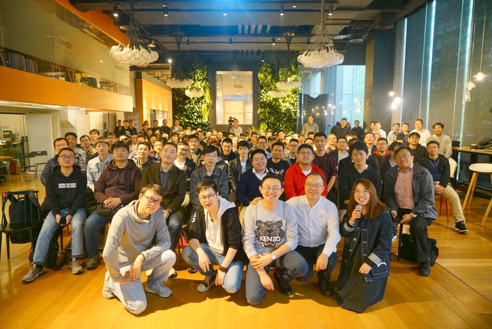

#### Observability and Istio telemetry

吴晟 Apache SkyWalking创始人、Apache Sharding-Sphere原型作者、比特大陆资深技术专家、CNCF OpenTracing标准化委员会成员

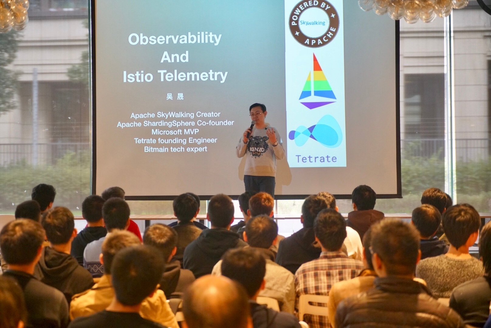

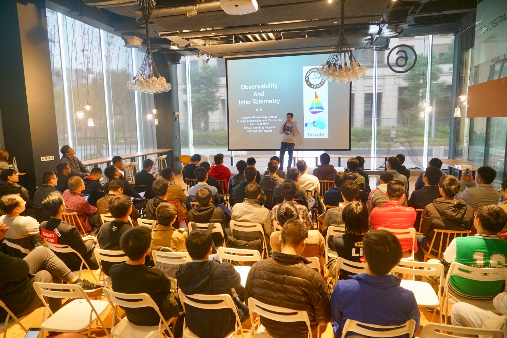

#### 蚂蚁金服 Service Mesh 渐进式迁移方案

敖小剑 蚂蚁金服高级技术专家，十六年软件开发经验，微服务专家，Service Mesh布道师，Servicemesher社区联合创始人

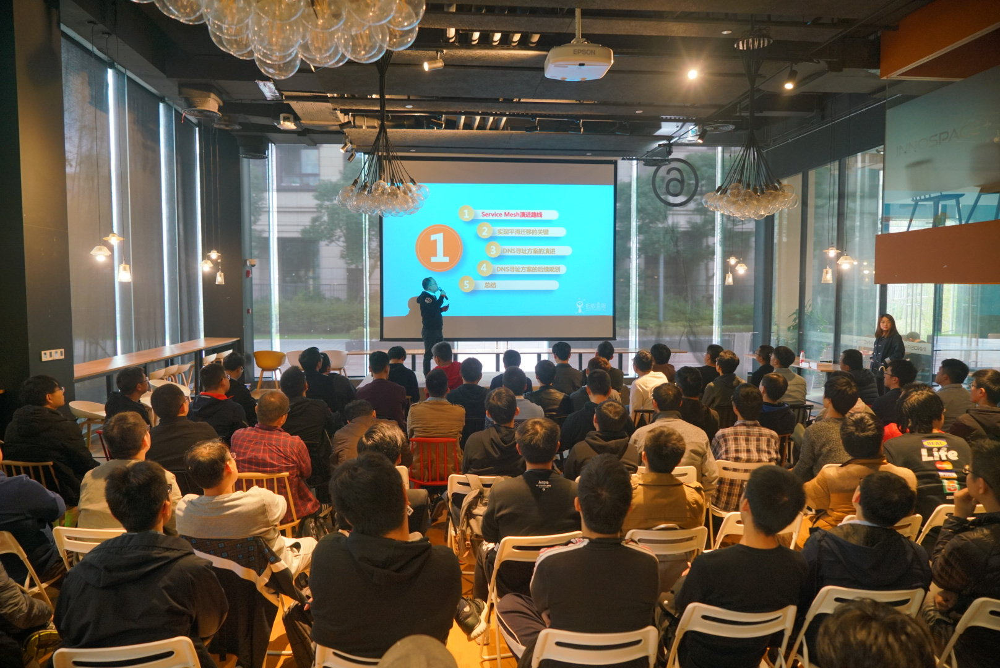

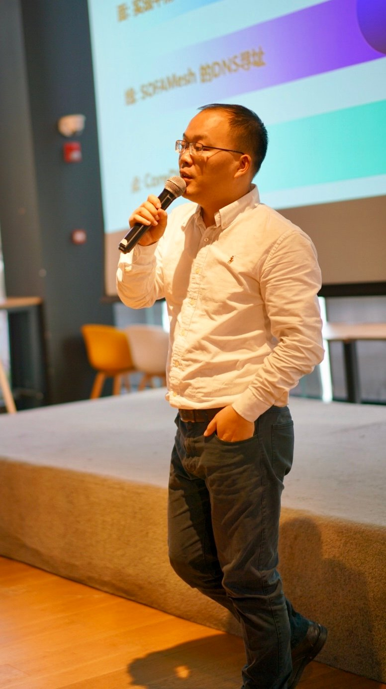

张瑜标 阿里巴巴技术专家、前京东Hadoop负责人、Hadoop代码贡献者、现负责UC 基于Kubernetes自研的PaaS平台整体的稳定性

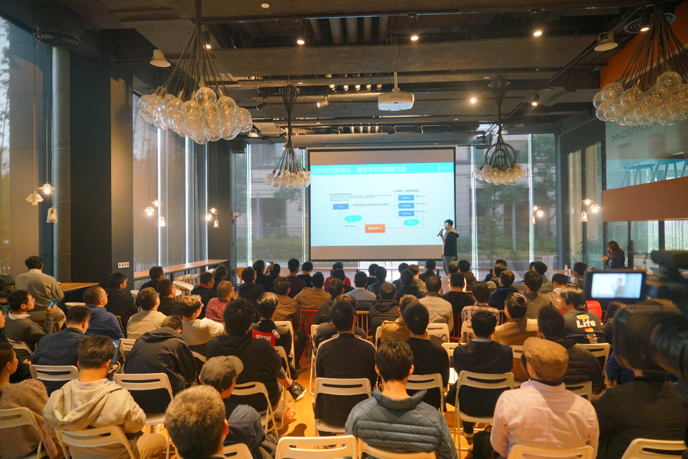

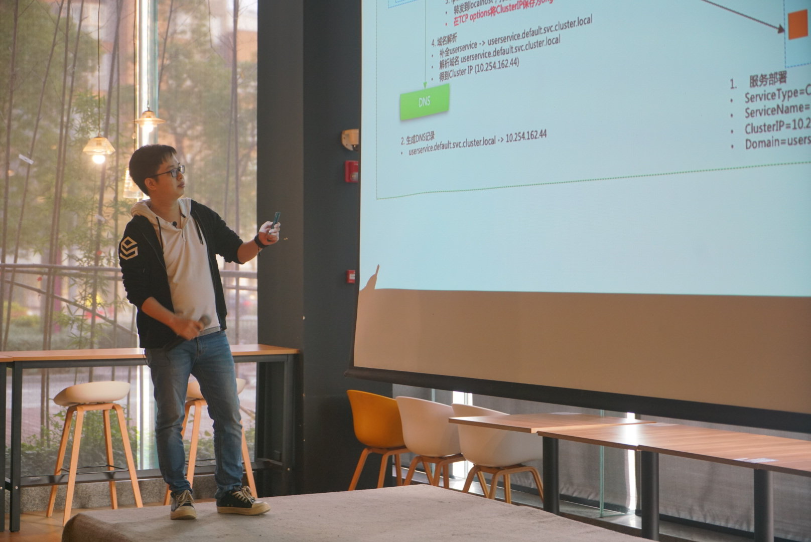

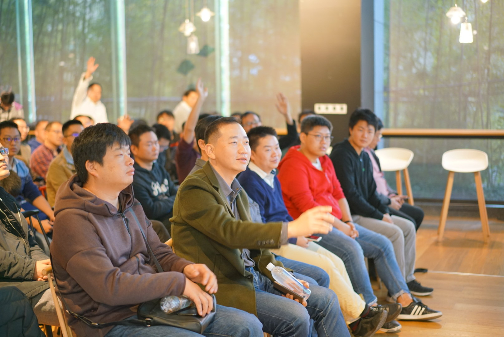

#### 探讨和实践基于Istio的微服务治理事件监控

徐运元 谐云科技云平台架构师，致力于容器 PaaS 平台、企业级容器云平台的方案设计和技术落地

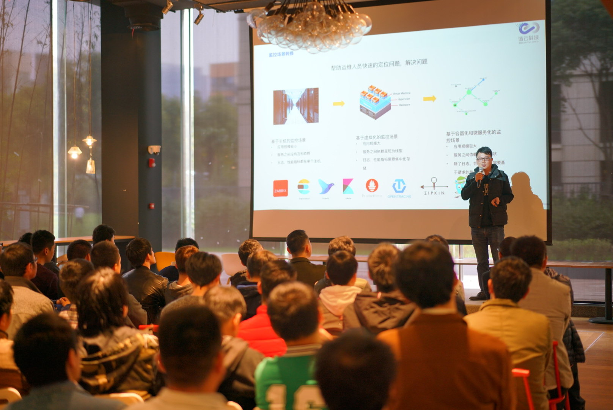

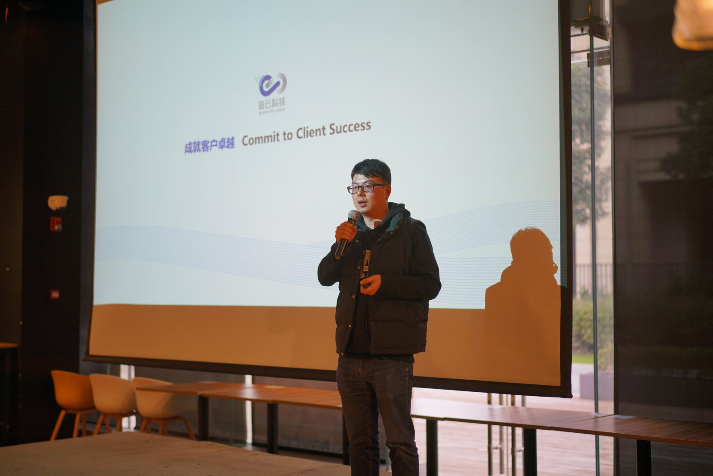

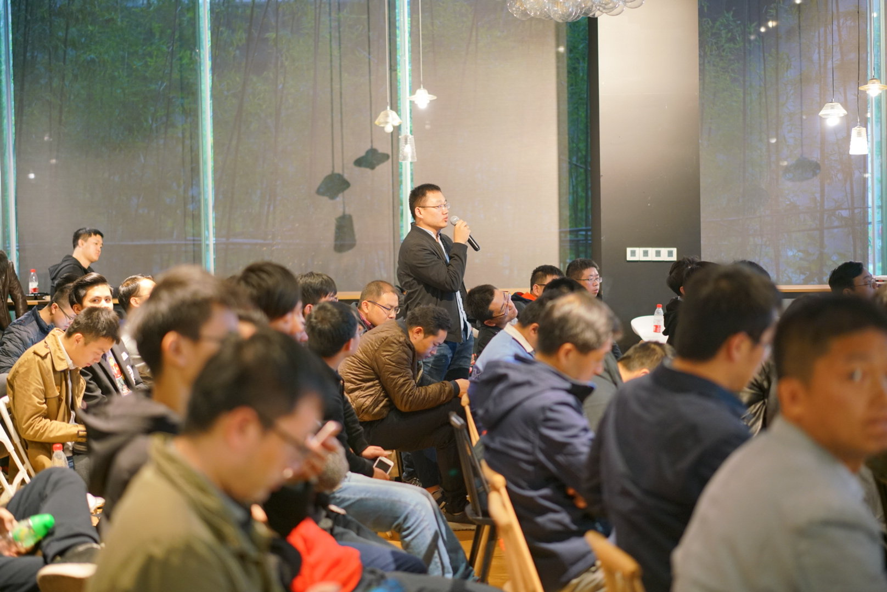

#### Envoy、Contour与Kubernetes实践

冯玮 七牛容器云平台产品架构师，曾在百度和华为从事公有云领域高性能分布式计算和存储平台的架构设计和产品研发

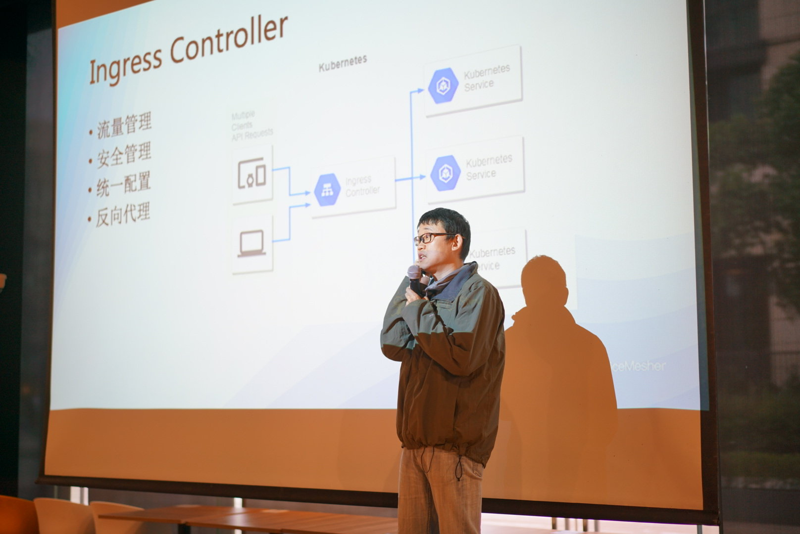

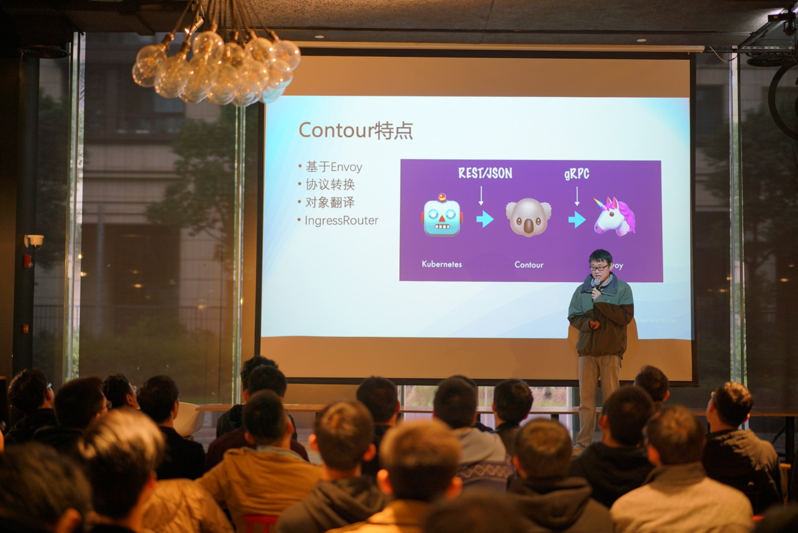

## 视频回放与资料下载

地址：https://tech.antfin.com/activities/2/review

## 致谢

感谢以下单位的大力支持

- 联合主办方[蚂蚁金服金融科技](https://tech.antfin.com/activities/2)
- [电子工业出版社](https://www.phei.com.cn/)赠书
- [INNOSPACE+](http://www.innospaceplus.com.cn/)提供场地
- [谐云科技](http://harmonycloud.cn/)提供茶歇
