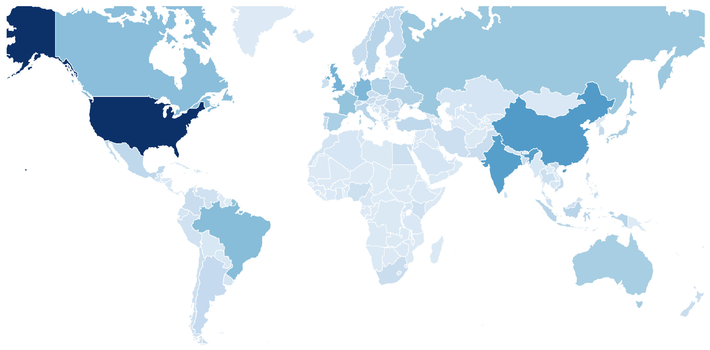
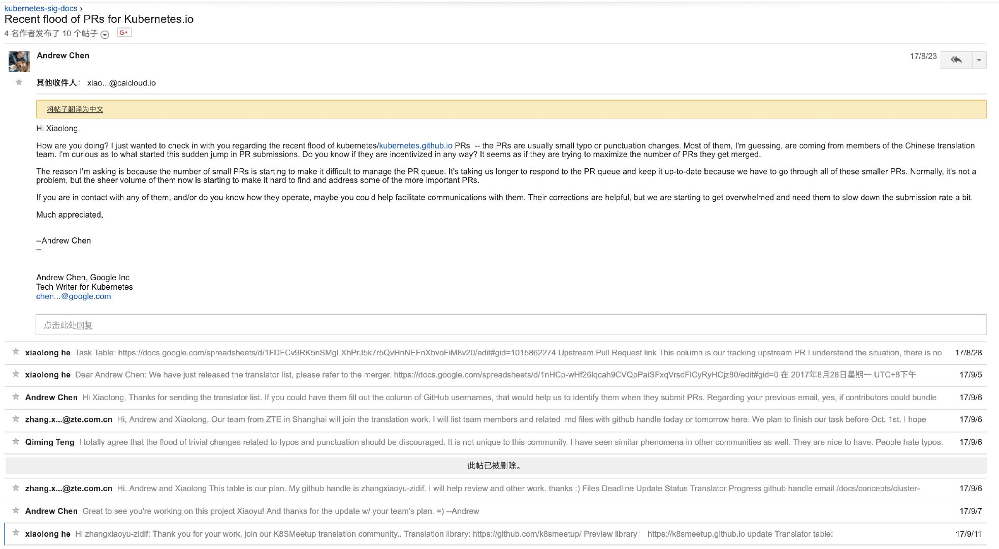

> 本篇主要通过对中国开发者在开源社区中的活动的观察，总结了一些有待提升或者存在弊病的现象。这些现象的背后原因可能是开发者的利益诉求，也可能是公司之间的恶性竞争，不管如何，这些行为或多或少给开源社区技术圈子已经带来了一些影响或冲击，甚至可能影响到了外国开发者对中国开源社区的公共印象。希望随着成熟，这样的现象在未来可以有所改善。

前几天某开源前端框架的事件闹得沸沸扬扬，尽管负责团队已经给出了诚恳的道歉并承认了过失，但是这次事件对中国开源社区敲响了警钟。在开源社区合作互赢的前提是相互信任相互负责，随着开源的概念深入中国开发者圈子，我们应该反省并从中吸取教训。大如阿里尚且会犯下错误，如果把同样的责任和权力转移给其他中国技术公司的头上，处理的未可能未必会更合理。与此同时，这次事件也让我们看到开源项目在中国的火爆程度，通过[Github全球开发者的账号统计](https://www.benfrederickson.com/github-developer-locations/)又让我们看到了中国开发者对全球开源社区的力量。甚至在世界已经有了一定的地位，其中尤其以前端项目领先，那么非前端项目呢？

*Github 全球用户分布，中国为仅此于美国的第二大用户来源，数据来源：https://www.benfrederickson.com/github-developer-locations/*

众所周知，非前端项目（比如Web框架，容器编排框架等）在中国一直是处于一个不温不火的状态，参与的开发者数量远不及前端开发者，也尚处于一个萌芽成长的阶段。笔者深度参与过一些国外大型非前端的开源项目，亲眼见证了一些中国的开源开发者在这些社区存在的一些问题，这些问题如果没有得到大家的正确认识可能渐渐癌变成疾，导致更糟糕的事件爆发。

本篇指出这些项目是希望得到大家的一些反思，热爱开源技术的朋友们有则改之无则加勉，也希望得到在社区活跃的贡献者/维护者的共鸣。以下我们分别从贡献者和维护者的角度拿出一些现象作为例子探讨背后的原因。

### 贡献者篇

__开源“疯狂英语”__

在Github上面绝大部分是英语维护的，在代码仓库难免有一些错别字在里面。日落日升，在中国有这样一群耐苦耐劳的神秘程序员们，他们喜欢钻研开源技术阅读开源代码，但大多数人没想到的是，他们真的是在“阅读”开源代码，并且日以继日地提交一个又一个错别字的PR。这些错别字在大型的项目中几乎“取之不尽，用之不完”，自然这样的PR也是层出不穷甚至泛滥成灾。这些来自中国的开源朋友们每天修改错别字的动力到底是什么呢？这些灌水PR为什么大部分来自中国呢而不是印度人日本人呢？究其根本当然这里面有利可图，毕竟没有开发者愿意一直跟在代码库后面一直捡错别字修改难道不是么？小编从个人和公司层面总结了几种最有可能的原因抛砖引玉：

1. 个人层面：主要是简历造假，当然很少有人会明晃晃直接拿着一摞错别字去伪造自己的开源社区贡献，中国人都懂所谓造假都是“真假混卖”，毕竟很少人会仔细勘误里面掺杂的一半垃圾PR。再不济碰到愣头青面试官把我揪出来，那他走夜路应该小心后面砸来砖头。简历造假本身其实见怪不怪，但是在Github开源贡献造假有明显越来越多的迹象。从为代码仓库花钱购买star，到购买follower早不是什么稀奇的事情。另一部分开发者会比较保守，一般是提交几个错别字之后抱着侥幸的心理在简历声称自己是“XXX贡献者”。

2. 公司层面：竞标项目以及KPI，背景是一些项目招标过程中会白纸黑字写上“需要对XXX开源项目贡献前XX位”，尤其是最近在云计算领域大热的Kubernetes，有些公司尤其是小公司面临生存的压力只能被迫参与这样的恶性竞争中，__可是__,开发/维护开源项目本身的成本是巨大的（有深度维护过开源项目的朋友应该会感同身受），几乎可以断言国内没有小公司能专门分配人力参与开源社区中，这些公司甚至紧咬在社区后面已经有些应付不来了，何况事实上投入开源社区的人力可能几乎没有回报？自然而然，修改错别字或者其他的灌水形式就成了伪造贡献的捷径，只需要一两个程序员或者全公司举力（DDOS式“贡献”？）公司的开源贡献就领先全球前几十位了。如果公司已经有一些“内鬼”维护者在社区中的话，可以源源不断把自己公司的PR合并进来甚至打压竞争对手。骗人骗己，真正参与过社区的朋友自然会体感到哪些公司是有贡献的，这样不能可持续发展，所以渐渐地这些小公司找到了灌水和贡献之间的平衡点：维护僵尸代码。社区迭代过程中会尝试性地创建一系列仓库试验新功能，这样的代码库往往无人问津但是“贡献”源源不断，美其名曰合理利用官方统计贡献的机制里的漏洞。

总的来说，大数量的错别字修改PR提交只是现象，背后的原因待人深思。其实外国人也在提交错别字修改，但是大都是零星的提交远不及中国开发者这样有组织有规模，甚至“军事化”地提交错别字。可能是公司管理层面没有预估到开源技术的投入成本，可能是迫于生存压力。但是如果这样的行为影响到了开源社区的正常维护，还请手下留情。

__开源“苦肉计”__

所谓的“苦肉计”，是指一些“天降”贡献者在忽然开始每天在某个开源项目提交许多PR，一坚持就是几个月，而这些PR很多是可有可无的，（比如修改代码风格，调整字符串风格等等“代码”等价的重构），甚至会反过来浪费维护者的时间。但是他们每天按时按点做这样一件事情，目的是什么呢？可能的原因是开源项目尤其是大型项目里会有“席位”的说法，比如变成了项目的Committer就有了一个社区席位，贡献者每天奋勇提交的十几个PR一段时间就变成了上百个，这个时候就可以拿着自己的贡献列表向开源项目提出申请“席位”，您看我这么辛苦这么肯干给你贡献了这么多（虽然讲真可能没几个是社区需要的），总得回馈给我点什么吧？于是拿到席位之后，这些朋友自然就销声匿迹再也不打开这个开源项目了，因为进一步投入拿到更高的席位是一件投入产出划不来的事情没有动力去做下去。这样的贡献往往来自于某些公司的“开源中心”，既消耗维护者的时间又浪费贡献者的时间，但是KPI所迫没有办法是个死局。扣回上面“疯狂英语”的现象，社区贡献本身不应该紧紧限于PR数量，commit数量，对社区的支持和维护都应该是其中主要的一部分。

既然贡献开源社区的途径有这么多，为什么中国贡献者往往更愿意通过一步到位提交代码的方法终结贡献呢？一部分是大部分管理者衡量贡献的标准如此，像盯着股票大盘一样盯着PR数量，你多一个我少一个，另一部分是原因受限于语言表达，中国贡献者相比于国外往往和社区之间的英语沟通比较吃力所以索性以代码代替交流。一些确实很有能力的开源贡献者参与开源社区的方式却是“闷头苦干”。当然文化来讲中国自古以勤劳朴实为美德，但是社区（Community，更像国外邻里/教会这样的社区）本身不是谁种的南瓜大谁就更厉害，更不是血汗工厂。开发者参与开源社区的方式可以更“温和”一些，比如从在slack上礼貌地提出问题交流想法开始，比如从邮件列表/Google Group中寻求帮助开始。没有了解清楚背景提交的代码PR往往是“离谱”的，看来比较浅的现象后面藏着的可能是一个早前悬而未定的issue。参与开源社区，更好的姿势应该是从搜集资料发问开始以提交代码终结。

__"另外"__

所谓的开源社区席位只是一个名头。在对开源项目的贡献程度上，相比于追逐席位，更高效的参与方式可能是在了解并沟通社区基础上再提交贡献。哪怕是刚刚开始没有任何席位身份的贡献者，只要捕捉到社区未来的发展动向，并提交给社区“计划内”的PR。那社区就是需要你的贡献，这样贡献远比灌水有价值更会被社区认可，以此一步一步深入开源项目，席位就是水到渠成的事情。

### 维护者篇

__开源“吹牛怪”__

首先说个结论，__中国有很多所谓“维护者”是言过其实哗众取宠的__。显而易见，所谓”吹牛“就是放大过言自己的开源社区地位。尤其是在一些国外公司主导的开源项目里，中国个人的开发者想要得到这种社区的信任和托付是一件非常困难的事情，除非你曾经和拥有项目的公司有过合作或者任职才能进入重要的模块参与开发。结合上面提及的贡献者存在的“疯狂英语”和“苦肉计”的问题，很多中国开发者参与社区的心路历程就会变得有些“病态”：先”忍辱负重“提交灌水PR充数，熬出头拿到席位洗白变成开源“明星”。然而开源项目的每个贡献都是在Github上面开放可以查找的，如果身边有所谓“明星”维护者，我们无意冒犯但是可以自己动手确认一下他在开源社区是否是真的有title上面写的那么重要，笔者也接手处理过这样的面试简历，目前来看一大部分所谓维护者在开源社区的贡献上是不诚实的。这种现象的根本原因之一是__造假成本太低或者信用成本太低__，破这个局的解法只有我们每个在关注开源的中国开发者对信誉保持敬畏，对造假持有戒心。

另外讽刺的是往往越资深越有实际社区地位的维护者，越会低调抛开身份纯粹交流技术，而不会彰扬身份扎人耳目。刚刚加入社区的成员摇身一变就成了正了八经维护者，维护社区的子项目头发一甩交流起来就成了开源项目的Partner。当然这种身份变迁往往是一步一步来的，今天成了社区成员（事实如此），明天简历上就是核心成员（发现没人有异议？），后天就是维护者（感觉自我状态不错），大后天就是项目合作者了（“这项目没我转不起来”），这种现象会使得开源技术圈子的风气越来越浮躁，真实贡献的成本很高于是越来越多的人走捷径造假，何况这条路事实上已经是可以“走得通“的了。当然吹牛图心里一爽不会是目的，问题还是怎么进一步变现。一方面是可能是O2O培训开课，线上线下一齐发力，将线上维护线下变现又反过来扩张自己的名气，另一方面可以虚张自己的业界影响力，尤其如果是国外公司维护的项目参与的中国本身就少，了解社区结构的人少之又少，把自己的社区声望稍稍说高一点是抱着侥幸心理，再往高了说就是哗众取宠反正没几个人懂。保持谦虚的态度才可以进一步发掘自己，社区地位是不应该过分追逐，事情做到了地位自然就来了。鲁迅说过“走的人多了，就有了路”（”真的说过“），而牛皮吹出去，尽管听的人多了但事实还是事实。少一些浮躁，维护者自然不会追逐这样的名头，也不会酝酿出开源项目名头靠喊靠编的恶性竞争。

__开源“隐形人”__

维护者可能因为工作内容的变化就离开了一些开源项目，但是出于某些原因可能社区还会需要持续的支持和维护，但是由于个人精力有限应付不来，于是就有了这样的“隐形“维护者。当有用户寻求帮助打开issue甚至直接在slack上登门拜访也杳无音讯。确实开源社区的维护本身是非常辛苦的事情，但是如果维护者可以尽自己所能再把承担一部分社区的责任会是更好的事情。在Github上每一个仓库都是一个由开发者组成的社区，传承下去也是维护的一部分内容，如果发现自己很难腾出时间管理多人在使用的公共仓库，把这样一份成果传承下去而非让代码”死“在那里会是更好的处理方式。

### 最后简言

上述现象可能不限于中国开源开发者，但是我们面对这些事实应该警惕成为“令人讨厌的开发者”，这篇文章对此给出了很好的建议：[https://daimajia.com/2017/03/10/about-open-source](https://daimajia.com/2017/03/10/about-open-source)。道阻且长，希望开源的意识和规范在中国开发者圈子中深入人心，合作共赢。
