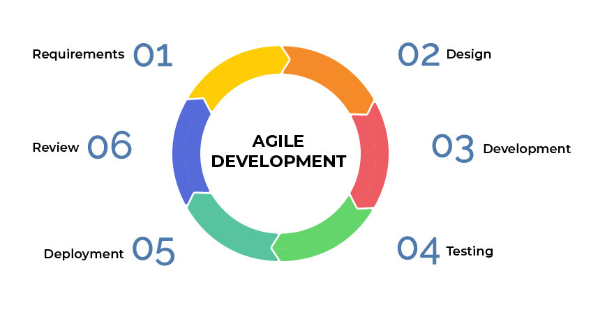

## 开源越来越受欢迎

2019 年的 IDC 北美开源软件使用调查显示，71% 的企业正在使用开源软件，54% 的企业计划扩大使用范围。2020 年的 RedHat 企业开源现状调查显示，有 95% 的 IT 领导者认为企业开源对于企业基础架构软件战略至关重要。

一方面企业越来越接受开源软件，另一方面企业也开始参与开源。现在思考的主要问题，不再是用不用，而是怎样用好开源软件。

可以说开源迎来了一个大时代，对协作模式、研发流程、产品发布等方方面面产生了深远的影响。

## 开源的核心是管理和运营社区

开源不是公开源代码，而是管理和运营社区。

很多关于开源的讨论在强调，license、管理风险、安全风险等防守策略。对于大企业，这些无法避免，为了获得上层的支持，却给开源带来了极大的负担，最终没有精力管理和运营社区。

社区的特征是共识与协作。开源项目是开源社区的共识，也是开源协作的对象。社区成员质量越高、数量越多，就越能代表该领域的先进性。

在有限的人群上，可以构建无限的社区。但在无限的社区上，个人又只能投入有限的精力和时间。这就是开源项目之间争夺的焦点。

更多高质量的人、更长时间地参与是开源项目成功的关键。

## 开源与商业并不冲突

前面说到开源主要是在管理和运营社区，而社区又具有自发性和开放性，提供了很多免费的服务。

之前的一位同事说开源就是白嫖，搭了一个框架，啥都没有，写了 Bug 想着社区给擦屁股。他就是站在社区的角度在思考。社区是反感被利用，被商业化的。

但，你看 Google 开源的 Kubernetes，各大厂商都有发行托管版本、如火如荼的 CKA/CKD 认证考试，也有商业化部分却并没有引起社区反感。这些厂商在 Kubernetes TOC 却占有一席之地，提交了很多 PR，促进了开源项目的发展。

开源社区的用户也需要商业服务。在软件生命周期内，有很多脏活累活是用户不想参与的，都可以成为商业服务的切入点。开源与商业是相互促进与成就的。

## 像经营企业一样经营开源项目

我更愿意以经营企业类比开源项目。开源项目不是项目，不是一次性的。开源项目应该与企业一样，追求永续经营。

一个企业软件的发布是一群人共同努力的结果。需要产品经理、设计师、研发、测试、文档、市场、运营等人员的通力合作，才能交付一个可靠的版本。

可以将整个开源协作理解为一条供应链，需要社区分工协作，人人参与，人人贡献，最终完成组装达成目标。管理开源项目，就是管理这样一条供应链。

我想起一个故事：在灾荒之年，能吃的都被吃了，大家聚在一起准备迁徙，但饿着肚子实在走不动。突然，有个人拿出来一块肉，准备和大家一起吃了再走。接着，有人找来了锅，有人在拾柴火，有人准备挑水，有人挖来了野菜，有人拿出了攒着的面粉…… 就这样煮出来满满一大锅肉汤，大家吃饱一起上路了。

这是一个自由的群体，时刻有人离开，也会有人加入。社区治理是一个很大的话题，也是一个很老的话题，可以在社区设立子部门，分工协作；可以建立指挥中心避免分歧，一致向前。但能不能按时开饭，每次有没有肉，很大程度在于能不能激发大家参与的积极性。

## 目标是贡献者而不是 star

参与需求反馈、测试、设计、讨论、提建议、文档撰写、宣传、问题回复等，都可以称之为贡献者，而不局限于写代码。

star 是一个十分量化的指标，经常被用来衡量一个开源项目的受欢迎程度。我认为 DAU/MAU 也同样适用于开源项目。

观测开源项目应该看的是有多少贡献者、贡献者的质量、每天合并了多少 PR、一个 PR 的合并周期、提交了多少 Issues，一个 Issue 得到回复的等待时间。活的烂项目比死的好项目更具有持久地生命力。只要有人在社区参与贡献，错误的内容终究会得到纠正。

明确目标之后，社区的很多决策就会简单很多。贡献者最重要，那么你就会重视社区用户的反馈，认真地看待用户提出的问题，线上会议，线下走访，深入交流，甩掉那些没有成效的事情。

聚拢足够多的意见领袖，高质量的贡献者才是关键。

## 云原生可能是个机会

我在之前的文档中提到 [现在是云原生最好的时代](https://www.chenshaowen.com/blog/the-best-era-of-cloud-native.html) 。

云原生的技术架构具有分布式的特点，天生有利于开源协作。也反映出，组织架构与软件架构具有一致性。

传统的基于单机 Linux 系统的软件设施，正在往基于 Kubernetes 系统的软件设施迁移。涉及整个软件体系的方方面面，各行各业也在努力融入其中。

这是云原生的机会，更是开源社区的机会。

本文转载自：[陈少文的博客](https://www.chenshaowen.com/blog/the-core-of-open-source-is-community.html)。