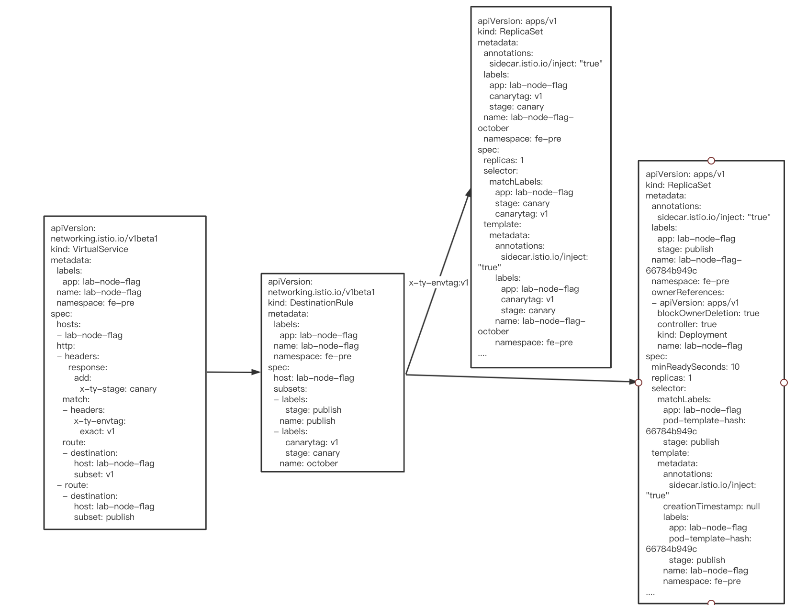
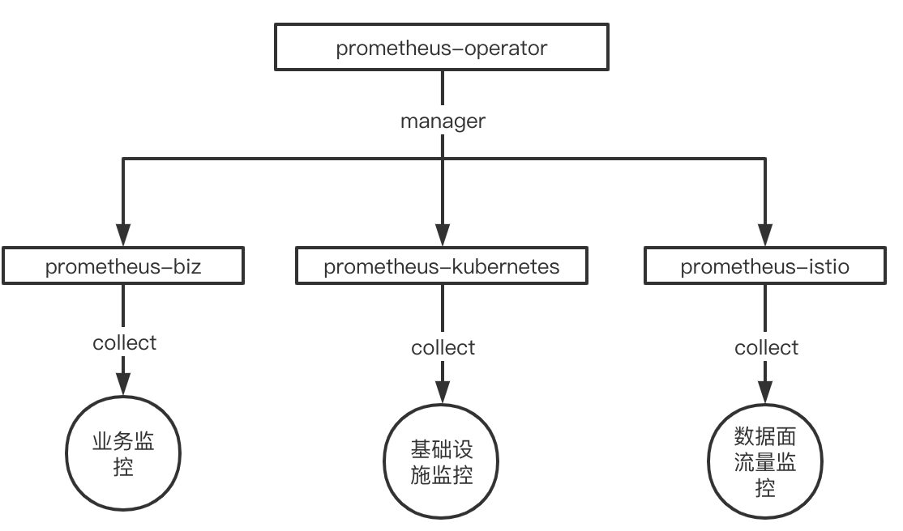
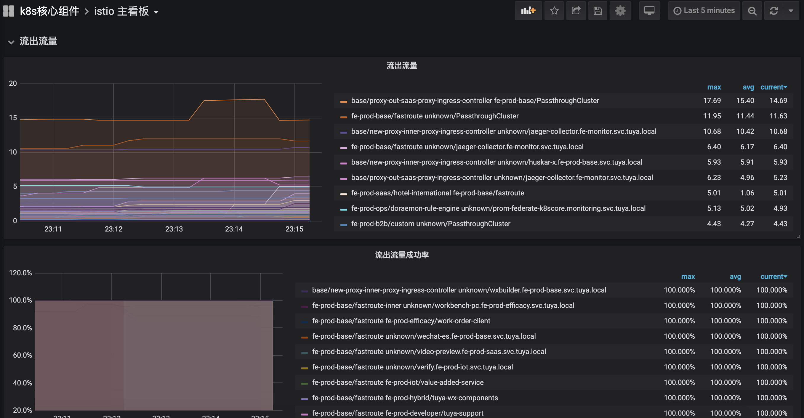
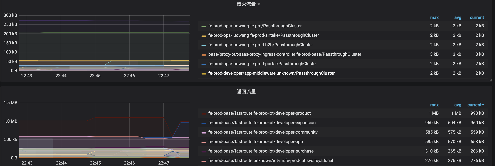

## 背景

Istio 作为当前最活跃的 service mesh 项目，提供着众多的能力，流量管理，安全性，可观察性，每一项能力都是服务治理，运维所必需的。Istio 丰富的能力同时也带来一定性的复杂系统运维的挑战，但是相对于能力以及未来的扩展性，Istio 能力给服务治理带来了无限的想象，机遇同时充满着挑战。

当前涂鸦智能前端业务 Istio 控制面版本为 1.5.0，接入 Istio 控制面 700 + 服务，1100+pod 实例，承担涂鸦智能前端最大的业务集群的流量管控和能力支撑。

## 涂鸦智能在开发流程上存在的问题

前端基础团队 2018 年开始接触 Kubernetes，并基于 kubernetes 自建了发布平台服务于前端业务团队，但随着业务团队越来越大，开发发布流程上开始出现一些问题：

1. 多分支并行开发的验证问题
2. 多地域环境带来的配置复杂性导致的线上问题

最开始考虑让业务团队自己内部调整处理，但由于出现问题的团队越来越多，我们开始考虑通过灰度发布能力来解决这些开发发布流程上的问题，在日常预发环境，多个分支发布多个灰度版本，根据不同的 header 分发流量到不同版本，保证每个 feature 分支有单独的实例进行验证，相互之间互不影响。在线上环境提供灰度能力给测试回归，作为项目质量的最后一道防线。

我们调研了多个方案，也参考内部其他团队的灰度方案，基于实现复杂性和能力的丰富度考量，在 2020 年初，我们开始在生产环境部署了 Istio。虽然 Istio 的接入在一定程度上提高了系统的复杂性，但是它确实给我们带来了惊喜。

## 引入 Istio 解决的问题

### 灰度发布

基于 Istio 原生自带的资源 `VirtualService` 和 `DestinationRule` 构建了发布平台的灰度发布能力。

1. 发布平台发布的每个应用都打上两个 label `canarytag` 和 `stage`，`stage` 用于标识正常发布和灰度发布，`canarytag` 用来标识不同的灰度版本
2. 每发布一个灰度版本，我们就会创建一个对应的灰度 ReplicaSet 实例
3. 发布对应的 `DestinationRule` 配置通过 label `canarytag`，`stage` 把正常发布和不同版本灰度的实例定义为不同实例集合
4. 通过 `VirtualService` 根据不同的 header 分发的不同实例集合

下图展示的是配置信息。



### 流量观测和异常感知

我们基于社区原生的 prometheus-operator 搭建了我们的监控平台，每个集群都会单独部署一个 prometheus-operator，并根据采集的对象，划分为业务、Kubernetes 集群基础设施、Istio 数据面流量三个范围，并部署相应的业务 prometheus 实例：Kubernetes 集群基础设施监控 prometheus 实例和 Istio 流量监控 prometheus 实例。



并通过 Grafana 搭建了整体的数据面流量监控大盘，实现了对流量的观测。



并基于当前的监控数据，配置了对应的告警规则，对流量的异常和波动有手段去感知和发现，并及时处理。

````ini
sum(envoy_cluster_upstream_cx_active{namespace!="fe-pre"}) by (namespace, service) < 1  无可用服务告警
sum by(namespace, service) (rate(envoy_cluster_upstream_rq_503[1m])) > 0    503异常告警
sum by(namespace, service) (rate(envoy_cluster_upstream_rq{response_code_class!="2xx"}[1m])) != 0  业务异常告警
````

## 现阶段的成果以及存在问题

当前线上最大的业务集群所有 pod 实例都已经接入至 Istio 控制面，由 Istio 把控整体的流量，具备流量观测能力。



灰度发布数占发布总数的 60% 以上，越来越来的项目开始使用灰度发布能力，并覆盖了公司最大的两个业务线，灰度能力和稳定性得到了业务的认可和好评。

但随着业务量的越来越大，pod 实例数的越来越多，也碰到了一些问题：

1. 团队使用的 Istio 版本为 1.5.0，该版本在 pilot 推送大量 xds 更新时，会导致 envoy 的 readiness 探针检查失败，并再次导致 eds 的大量更新，导致集群波动，该问题社区已经解决，团队也规划升级至 1.7.7 版本解决。
2. Pilot 所在机器异常重启后，接入该 pilot 实例的 envoy 无法感知到服务端的异常，需要等待 tcp keepalive 超时并检查失败后才会开始重连至正常的 Istiod，在这段时间内，集群的更新都不会被同步，默认配置需要等待 975 秒，该问题可以通过配置 envoy 的引导配置解决，修改 envoy 默认引导配置 xds-grpc cluster upstream_connection_options 的 tcp_keepalive 配置，保证在 1 分钟内进行重连。

```json
"upstream_connection_options": {
  "tcp_keepalive": {
    "keepalive_time": 30,
    "keepalive_probes": 3,
    "keepalive_interval": 5
  }
}
```

## 未来展望

涂鸦前端基础团队在 2020 年初开始使用 Istio，对于 Istio 丰富的能力和强大的扩展性的使用还在探索阶段，对于未来，我们会着重往两个方向进行探索和挖掘：

1. 基于当前 Istio 的能力，实现对流量的精细化管理以及服务的降级、熔断，当前对于前端微服务的治理能力缺失，遇上异常场景没有有效手段来保证服务的稳定性
2. 基于 Istio 的故障注入能力提供故障 use case 并对业务进行注入，提高整体业务系统的容错性，稳定性

