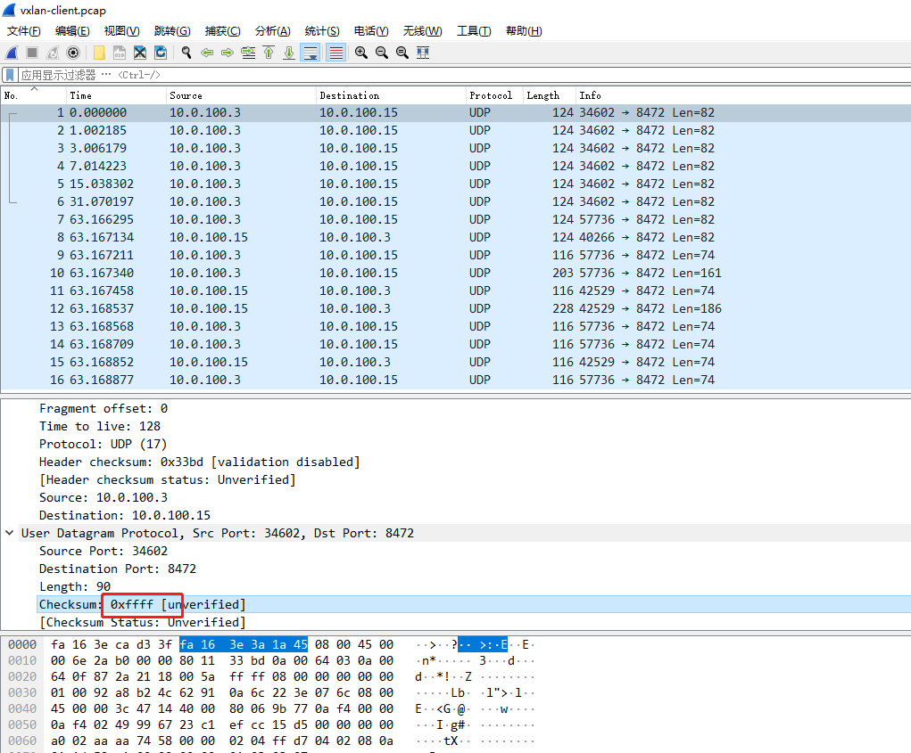

## 前言

这个问题 flannel 和 calico 的 VXLAN 模式下都会发生，部分人的集群的A记录 UDP 下查询可能有问题。原因是 `v1.17+` 的 kubernetes 某部分会引起内核的某个 UDP 相关的 BUG 而不是 CNI 的软件层面， WEAVE 没有这个问题，原因后面会说到。写这篇文章的日期是`05/28`，最开始发现是上周五也就是`05/23`号，文章从时间线写起，因为很多时候想发文章但是没空。

## 由来

上周五我经过同事的工位看到同事的桌面是 `kubectl get po` 的输出，问他咋开始学 Kubernetes 了，他说跟着视频学下。看了下用的 kubeadm 部署了一套`1.18.2`的集群。1.18的 kube-proxy 的 ipvs 包的 parseIP 有 bug ，我推荐他换`v1.17.5`。他当时在部署一个入门的 SVC 实验，无法解析域名。使用dig命令排查了下，下面是对照:

- `dig @<podIP> +short kubernetes.default.svc.cluster.local` 能解析
- `dig @10.96.0.10 +short kubernetes.default.svc.cluster.local` 超时

很多市面上的kubeadm部署教程都是直接命令 `kubeadm init` 的，所以我推荐同事去按照我文章的 [kubeadm部署](https://zhangguanzhang.github.io/2019/11/24/kubeadm-base-use/) 一套后再试试，叫他用`v1.17`的最新版本`v1.17.5`，结果还是上面一样。 coredns 实际上还有 metrics 的 http 接口，从 http 层测了下：

- `curl -I 10.96.0.10:9153/metrics` 超时，很久之后才有返回
- `curl -I <podIP>:9153/metrics` 能直接返回

涉及到本次排查的信息为：

```shell
$ kubectl get node -o wide
NAME     STATUS   ROLES    AGE    VERSION   INTERNAL-IP   EXTERNAL-IP   OS-IMAGE                KERNEL-VERSION          CONTAINER-RUNTIME
master   Ready    master   7d8h   v1.18.2   10.0.100.3    <none>        CentOS Linux 7 (Core)   3.10.0-957.el7.x86_64   docker://19.3.8
node1    Ready    <none>   7d7h   v1.18.2   10.0.100.4    <none>        CentOS Linux 7 (Core)   3.10.0-957.el7.x86_64   docker://19.3.8
node2    Ready    <none>   7d7h   v1.18.2   10.0.100.15   <none>        CentOS Linux 7 (Core)   3.10.0-957.el7.x86_64   docker://19.3.8

$ kubectl get po -o wide -n kube-system -l k8s-app=kube-dns
NAME                       READY   STATUS    RESTARTS   AGE   IP            NODE    NOMINATED NODE   READINESS GATES
coredns-546565776c-v5wwg   1/1     Running   2          25h   10.244.2.73   node2   <none>           <none>
```

多次尝试发现很久的时间都是一样，用 time 命令观察了下一直是63秒返回。包括其他任何 SVC 都是这样。

```shell
$ time    curl -I 10.96.0.10:9153/metrics
HTTP/1.1 200 OK
Content-Type: text/plain; version=0.0.4; charset=utf-8
Date: Wed, 25 May 2020 08:39:35 GMT


real	1m3.091s
user	0m0.002s
sys	0m0.007s
```

proxyMode 是 ipvs ，用 ipvsadm 看下超时的时候的状态，一直是`SYN_RECV`，也就是发送了 SYN ，没收到回包。

```shell
$ ipvsadm -lnc |& grep 9153
TCP 00:59  SYN_RECV    10.96.0.10:41282   10.96.0.10:9153    10.244.2.73:9153
```

### 抓包

因为 CNI 使用的 flannel ，用的 VXLAN 模式。master 上抓9153和`flannel.1`的 8472 端口，coredns 的 POD 所在 node 上抓 flannel 的 VXLAN 包，下面三个是对应的:

```txt
[root@master /root]# tcpdump -nn -i flannel.1 port 9153
tcpdump: verbose output suppressed, use -v or -vv for full protocol decode
listening on flannel.1, link-type EN10MB (Ethernet), capture size 262144 bytes
16:30:56.705696 IP 10.244.0.0.2201 > 10.244.2.73.9153: Flags [S], seq 911217171, win 43690, options [mss 65495,sackOK,TS val 17148909 ecr 0,nop,wscale 7], length 0
16:30:57.708489 IP 10.244.0.0.2201 > 10.244.2.73.9153: Flags [S], seq 911217171, win 43690, options [mss 65495,sackOK,TS val 17149912 ecr 0,nop,wscale 7], length 0
16:30:59.712458 IP 10.244.0.0.2201 > 10.244.2.73.9153: Flags [S], seq 911217171, win 43690, options [mss 65495,sackOK,TS val 17151916 ecr 0,nop,wscale 7], length 0
16:31:03.716441 IP 10.244.0.0.2201 > 10.244.2.73.9153: Flags [S], seq 911217171, win 43690, options [mss 65495,sackOK,TS val 17155920 ecr 0,nop,wscale 7], length 0
16:31:11.732562 IP 10.244.0.0.2201 > 10.244.2.73.9153: Flags [S], seq 911217171, win 43690, options [mss 65495,sackOK,TS val 17163936 ecr 0,nop,wscale 7], length 0
16:31:27.764498 IP 10.244.0.0.2201 > 10.244.2.73.9153: Flags [S], seq 911217171, win 43690, options [mss 65495,sackOK,TS val 17179968 ecr 0,nop,wscale 7], length 0
16:31:59.828493 IP 10.244.0.0.2201 > 10.244.2.73.9153: Flags [S], seq 911217171, win 43690, options [mss 65495,sackOK,TS val 17212032 ecr 0,nop,wscale 7], length 0
16:31:59.829565 IP 10.244.2.73.9153 > 10.244.0.0.2201: Flags [S.], seq 435819916, ack 911217172, win 27960, options [mss 1410,sackOK,TS val 17212067 ecr 17212032,nop,wscale 7], length 0
16:31:59.829611 IP 10.244.0.0.2201 > 10.244.2.73.9153: Flags [.], ack 1, win 342, options [nop,nop,TS val 17212033 ecr 17212067], length 0
16:31:59.829714 IP 10.244.0.0.2201 > 10.244.2.73.9153: Flags [P.], seq 1:88, ack 1, win 342, options [nop,nop,TS val 17212033 ecr 17212067], length 87
16:31:59.829897 IP 10.244.2.73.9153 > 10.244.0.0.2201: Flags [.], ack 88, win 219, options [nop,nop,TS val 17212067 ecr 17212033], length 0
16:31:59.831300 IP 10.244.2.73.9153 > 10.244.0.0.2201: Flags [P.], seq 1:113, ack 88, win 219, options [nop,nop,TS val 17212069 ecr 17212033], length 112
16:31:59.831322 IP 10.244.0.0.2201 > 10.244.2.73.9153: Flags [.], ack 113, win 342, options [nop,nop,TS val 17212034 ecr 17212069], length 0
16:31:59.831435 IP 10.244.0.0.2201 > 10.244.2.73.9153: Flags [F.], seq 88, ack 113, win 342, options [nop,nop,TS val 17212035 ecr 17212069], length 0
16:31:59.831633 IP 10.244.2.73.9153 > 10.244.0.0.2201: Flags [F.], seq 113, ack 89, win 219, options [nop,nop,TS val 17212069 ecr 17212035], length 0
16:31:59.831660 IP 10.244.0.0.2201 > 10.244.2.73.9153: Flags [.], ack 114, win 342, options [nop,nop,TS val 17212035 ecr 17212069], length 0
```

```txt
[root@master /root]# tcpdump -nn -i eth0 port 8472
tcpdump: verbose output suppressed, use -v or -vv for full protocol decode
listening on eth0, link-type EN10MB (Ethernet), capture size 262144 bytes
16:30:56.705718 IP 10.0.100.3.48683 > 10.0.100.15.8472: OTV, flags [I] (0x08), overlay 0, instance 1
IP 10.244.0.0.2201 > 10.244.2.73.9153: Flags [S], seq 911217171, win 43690, options [mss 65495,sackOK,TS val 17148909 ecr 0,nop,wscale 7], length 0
16:30:57.708523 IP 10.0.100.3.48683 > 10.0.100.15.8472: OTV, flags [I] (0x08), overlay 0, instance 1
IP 10.244.0.0.2201 > 10.244.2.73.9153: Flags [S], seq 911217171, win 43690, options [mss 65495,sackOK,TS val 17149912 ecr 0,nop,wscale 7], length 0
16:30:59.712478 IP 10.0.100.3.48683 > 10.0.100.15.8472: OTV, flags [I] (0x08), overlay 0, instance 1
IP 10.244.0.0.2201 > 10.244.2.73.9153: Flags [S], seq 911217171, win 43690, options [mss 65495,sackOK,TS val 17151916 ecr 0,nop,wscale 7], length 0
16:31:03.716452 IP 10.0.100.3.48683 > 10.0.100.15.8472: OTV, flags [I] (0x08), overlay 0, instance 1
IP 10.244.0.0.2201 > 10.244.2.73.9153: Flags [S], seq 911217171, win 43690, options [mss 65495,sackOK,TS val 17155920 ecr 0,nop,wscale 7], length 0
16:31:11.732590 IP 10.0.100.3.48683 > 10.0.100.15.8472: OTV, flags [I] (0x08), overlay 0, instance 1
IP 10.244.0.0.2201 > 10.244.2.73.9153: Flags [S], seq 911217171, win 43690, options [mss 65495,sackOK,TS val 17163936 ecr 0,nop,wscale 7], length 0
16:31:27.764513 IP 10.0.100.3.48683 > 10.0.100.15.8472: OTV, flags [I] (0x08), overlay 0, instance 1
IP 10.244.0.0.2201 > 10.244.2.73.9153: Flags [S], seq 911217171, win 43690, options [mss 65495,sackOK,TS val 17179968 ecr 0,nop,wscale 7], length 0
16:31:59.828541 IP 10.0.100.3.56618 > 10.0.100.15.8472: OTV, flags [I] (0x08), overlay 0, instance 1
IP 10.244.0.0.2201 > 10.244.2.73.9153: Flags [S], seq 911217171, win 43690, options [mss 65495,sackOK,TS val 17212032 ecr 0,nop,wscale 7], length 0
16:31:59.829521 IP 10.0.100.15.56771 > 10.0.100.3.8472: OTV, flags [I] (0x08), overlay 0, instance 1
IP 10.244.2.73.9153 > 10.244.0.0.2201: Flags [S.], seq 435819916, ack 911217172, win 27960, options [mss 1410,sackOK,TS val 17212067 ecr 17212032,nop,wscale 7], length 0
16:31:59.829617 IP 10.0.100.3.56618 > 10.0.100.15.8472: OTV, flags [I] (0x08), overlay 0, instance 1
IP 10.244.0.0.2201 > 10.244.2.73.9153: Flags [.], ack 1, win 342, options [nop,nop,TS val 17212033 ecr 17212067], length 0
16:31:59.829729 IP 10.0.100.3.56618 > 10.0.100.15.8472: OTV, flags [I] (0x08), overlay 0, instance 1
IP 10.244.0.0.2201 > 10.244.2.73.9153: Flags [P.], seq 1:88, ack 1, win 342, options [nop,nop,TS val 17212033 ecr 17212067], length 87
16:31:59.829883 IP 10.0.100.15.34571 > 10.0.100.3.8472: OTV, flags [I] (0x08), overlay 0, instance 1
IP 10.244.2.73.9153 > 10.244.0.0.2201: Flags [.], ack 88, win 219, options [nop,nop,TS val 17212067 ecr 17212033], length 0
16:31:59.831292 IP 10.0.100.15.34571 > 10.0.100.3.8472: OTV, flags [I] (0x08), overlay 0, instance 1
IP 10.244.2.73.9153 > 10.244.0.0.2201: Flags [P.], seq 1:113, ack 88, win 219, options [nop,nop,TS val 17212069 ecr 17212033], length 112
16:31:59.831327 IP 10.0.100.3.56618 > 10.0.100.15.8472: OTV, flags [I] (0x08), overlay 0, instance 1
IP 10.244.0.0.2201 > 10.244.2.73.9153: Flags [.], ack 113, win 342, options [nop,nop,TS val 17212034 ecr 17212069], length 0
16:31:59.831448 IP 10.0.100.3.56618 > 10.0.100.15.8472: OTV, flags [I] (0x08), overlay 0, instance 1
IP 10.244.0.0.2201 > 10.244.2.73.9153: Flags [F.], seq 88, ack 113, win 342, options [nop,nop,TS val 17212035 ecr 17212069], length 0
16:31:59.831612 IP 10.0.100.15.34571 > 10.0.100.3.8472: OTV, flags [I] (0x08), overlay 0, instance 1
IP 10.244.2.73.9153 > 10.244.0.0.2201: Flags [F.], seq 113, ack 89, win 219, options [nop,nop,TS val 17212069 ecr 17212035], length 0
16:31:59.831665 IP 10.0.100.3.56618 > 10.0.100.15.8472: OTV, flags [I] (0x08), overlay 0, instance 1
IP 10.244.0.0.2201 > 10.244.2.73.9153: Flags [.], ack 114, win 342, options [nop,nop,TS val 17212035 ecr 17212069], length 0
```

```txt
[root@node2 /root]# tcpdump -nn  -i eth0 port 8472
tcpdump: verbose output suppressed, use -v or -vv for full protocol decode
listening on eth0, link-type EN10MB (Ethernet), capture size 262144 bytes
16:31:59.836137 IP 10.0.100.3.56618 > 10.0.100.15.8472: OTV, flags [I] (0x08), overlay 0, instance 1
IP 10.244.0.0.2201 > 10.244.2.73.9153: Flags [S], seq 911217171, win 43690, options [mss 65495,sackOK,TS val 17212032 ecr 0,nop,wscale 7], length 0
16:31:59.836328 IP 10.0.100.15.56771 > 10.0.100.3.8472: OTV, flags [I] (0x08), overlay 0, instance 1
IP 10.244.2.73.9153 > 10.244.0.0.2201: Flags [S.], seq 435819916, ack 911217172, win 27960, options [mss 1410,sackOK,TS val 17212067 ecr 17212032,nop,wscale 7], length 0
16:31:59.836811 IP 10.0.100.3.56618 > 10.0.100.15.8472: OTV, flags [I] (0x08), overlay 0, instance 1
IP 10.244.0.0.2201 > 10.244.2.73.9153: Flags [.], ack 1, win 342, options [nop,nop,TS val 17212033 ecr 17212067], length 0
16:31:59.836910 IP 10.0.100.3.56618 > 10.0.100.15.8472: OTV, flags [I] (0x08), overlay 0, instance 1
IP 10.244.0.0.2201 > 10.244.2.73.9153: Flags [P.], seq 1:88, ack 1, win 342, options [nop,nop,TS val 17212033 ecr 17212067], length 87
16:31:59.836951 IP 10.0.100.15.34571 > 10.0.100.3.8472: OTV, flags [I] (0x08), overlay 0, instance 1
IP 10.244.2.73.9153 > 10.244.0.0.2201: Flags [.], ack 88, win 219, options [nop,nop,TS val 17212067 ecr 17212033], length 0
16:31:59.838385 IP 10.0.100.15.34571 > 10.0.100.3.8472: OTV, flags [I] (0x08), overlay 0, instance 1
IP 10.244.2.73.9153 > 10.244.0.0.2201: Flags [P.], seq 1:113, ack 88, win 219, options [nop,nop,TS val 17212069 ecr 17212033], length 112
16:31:59.838522 IP 10.0.100.3.56618 > 10.0.100.15.8472: OTV, flags [I] (0x08), overlay 0, instance 1
IP 10.244.0.0.2201 > 10.244.2.73.9153: Flags [.], ack 113, win 342, options [nop,nop,TS val 17212034 ecr 17212069], length 0
16:31:59.838621 IP 10.0.100.3.56618 > 10.0.100.15.8472: OTV, flags [I] (0x08), overlay 0, instance 1
IP 10.244.0.0.2201 > 10.244.2.73.9153: Flags [F.], seq 88, ack 113, win 342, options [nop,nop,TS val 17212035 ecr 17212069], length 0
16:31:59.838703 IP 10.0.100.15.34571 > 10.0.100.3.8472: OTV, flags [I] (0x08), overlay 0, instance 1
IP 10.244.2.73.9153 > 10.244.0.0.2201: Flags [F.], seq 113, ack 89, win 219, options [nop,nop,TS val 17212069 ecr 17212035], length 0
16:31:59.838836 IP 10.0.100.3.56618 > 10.0.100.15.8472: OTV, flags [I] (0x08), overlay 0, instance 1
IP 10.244.0.0.2201 > 10.244.2.73.9153: Flags [.], ack 114, win 342, options [nop,nop,TS val 17212035 ecr 17212069], length 0
```

先看上面的第一部分，搜了下资料，得知 TCP 默认 SYN 报文最大 retry 5次，每次超时了翻倍，`1s -> 3s -> 7s -> 15s -> 31s -> 63s`。只有63秒的时候 node 的机器上才收到了 VXLAN 的报文。说明 POD 所在 node 压根没收到63秒之前的。

一般 LVS 的 dr 模式下 TCP 的时间戳混乱或者其他几个 ARP 的内核参数不对下 `SYN` 是一直收不到的而不是63秒后有结果，所以和内核相关参数无关。于是同样上面的步骤 tcpdump 抓包，加上`-w filename.pcap`选项把抓的包导出下来导入到 wireshark 里准备看看。

### 报文分析

9153的包 wireshark 里看63秒前面都是 TCP 的 SYN 重传，看到了 master 上向外发送的 VXLAN 报文的时候有了发现。

可以看到 UDP 的 checksum 是`0xffff`，我对 UDP 报文不太熟悉， UDP 的 header 的 Checksum 没记错的话`CRC32`校验的，不可能是这种两个字节都置1的 `0xffff` ，明显就是 UDP 的 header 的校验出错了。后面几个正常包的 Checksum 都是 missing 的。



wireshark 的`编辑`->`首选项`->`Protocols`->`UDP`->`Validate the UDP checksum if possible` 勾上更直观看。


### 不是根本的解决方法

搜了下`wireshark linux udp checksum incorrect`，都是推荐把 `Checksum Offload` disable 掉就行了，例如我这里是 flannel ，则是：

```shell
$ /sbin/ethtool -K flannel.1 tx-checksum-ip-generic off
Actual changes:
tx-checksumming: off
	tx-checksum-ip-generic: off
tcp-segmentation-offload: off
	tx-tcp-segmentation: off [requested on]
	tx-tcp-ecn-segmentation: off [requested on]
	tx-tcp6-segmentation: off [requested on]
	tx-tcp-mangleid-segmentation: off [requested on]
udp-fragmentation-offload: off [requested on]
```

再测下正常，而 WEAVE 他们也用的 VXLAN 模式，但是他们在创建网卡的时候把这个已经 off 掉了，所以 WEAVE 的 VXLAN 模式在`v1.17+`集群没出现这个问题。

```shell
$ time curl -I 10.96.0.10:9153
HTTP/1.1 404 Not Found
Content-Type: text/plain; charset=utf-8
X-Content-Type-Options: nosniff
Date: Wed, 27 May 2020 02:14:04 GMT
Content-Length: 19


real	0m0.009s
user	0m0.005s
sys	0m0.003s
```

你以为这样就完了？其实并没有，因为我自己维护了一套 [ansible 部署 kubernetes](https://github.com/zhangguanzhang/Kubernetes-ansible) 的方案，每次新版本发布我都会实际测下。并且同事反映了他同样云主机开出来用我 ansible 部署`v1.17.5`没有这个问题。这就很奇怪了，原因后面说，请接着继续看。

### 什么是checksum offload

Checksum Offload 是网卡的一个功能选项。如果该选项开启，则网卡层面会计算需要发送或者接收到的消息的校验和，从而节省 CPU 的计算开销。此时，在需要发送的消息到达网卡前，系统会在报头的校验和字段填充一个随机值。但是，尽管校验和卸载能够降低 CPU 的计算开销，但受到计算能力的限制，某些环境下的一些网络卡计算速度不如主频超过 400MHz 的 CPU 快。

## 正文

### 对照组

很奇怪的就是为啥就是我的 ansible 部署的二进制就正常没这个问题，而 kubeadm 部署的就不正常，后面我花时间整了以下几个对照组(期间同事也帮我做了几个条件下的测试，但是不是系统用错了就是版本整错了。。。)，终于找到了问题的范围，下面是我自己统计的对照组信息， kubeadm 和 ansible 版本均为`1.17.5`测试。os 不重要，因为最终排查出和 os 无关：

| os     | type(kubeadm or ansible)   |  flannel version  |   flannel is running in pod? |  will 63 sec delay? |
| :----- |          :----:            |        :----:     |             :----:           |  :----:  |
| 7.6    |        kubeadm             |       v0.11.0     |              yes             |    yes   |
| 7.6    |        kubeadm             |       v0.12.0     |              yes             |    yes   |
| 7.6    |        kubeadm             |       v0.11.0     |              no              |    yes   |
| 7.6    |        kubeadm             |       v0.12.0     |              no              |    yes   |
| 7.6    |        ansible             |       v0.11.0     |              yes             |    no    |
| 7.6    |        ansible             |       v0.12.0     |              yes             |    no    |
| 7.6    |        ansible             |       v0.11.0     |              no              |    no    |
| 7.6    |        ansible             |       v0.12.0     |              no              |    no    |


这就看起来很迷了。但是排查出和 flannel 无关，感觉 kube-proxy 有关系，然后今天`05/28`针对 kube-proxy 做了个对照组：

| os     | type(kubeadm or ansible)   |  kube-proxy version  | kube-proxy is running in pod?  |   will 63 sec delay? |
| :----- |          :----:            |        :----:        |             :----:             |     :----:    |
| 7.6    |        kubeadm             |       v1.17.5        |               yes              |      yes      |
| 7.6    |        kubeadm             |       v1.17.5        |               no               |      no       |
| 7.6    |        kubeadm             |       v1.16.9        |               yes              |      no       |
| 7.6    |        kubeadm             |       v1.16.9        |               no               |      no       |
| 7.6    |        ansible             |       v1.17.5        |               yes              |      yes      |
| 7.6    |        ansible             |       v1.17.5        |               no               |      no       |


可以看出就是1.17以上的 kube-proxy 如果使用 POD 则会有这个问题，而非 POD 则不会， 在github 上 [compare 了下v1.17.0和v1.16.3](https://github.com/kubernetes/kubernetes/compare/v1.16.3...v1.17.0)。

发现了 [Dockerfile的改动](https://github.com/kubernetes/kubernetes/commit/fed582333f639dc22e879f4bbb258e403c210c30) ， `1.17.0`里的 Dockerfile 的BASEIMAGE是用  [指定了一个源安装了最新的iptables](https://github.com/coreos/flannel/pull/1282#issuecomment-635273081)，然后利用`update-alternatives`把脚本`/usr/sbin/iptables-wrapper`去替代`iptables` 来检测应该使用`nft`还是`legacy`， hack 下镜像回自带源里的 iptables 验证下。

```Dockerfile
FROM registry.aliyuncs.com/google_containers/kube-proxy:v1.17.5
RUN rm -f /usr/sbin/iptables && 
    clean-install iptables
```

构建的镜像推送到了 dockerhub 上`zhangguanzhang/hack-kube-proxy:v1.17.5`，更改下集群 kube-proxy ds 的镜像。

```shell
$ kubectl -n kube-system get ds kube-proxy -o yaml | grep image:
        image: zhangguanzhang/hack-kube-proxy:v1.17.5
```

测试访问成功。

```shell
$ time curl -I 10.96.0.10:9153
HTTP/1.1 404 Not Found
Content-Type: text/plain; charset=utf-8
X-Content-Type-Options: nosniff
Date: Thu, 28 May 2020 04:47:21 GMT
Content-Length: 19


real	0m0.008s
user	0m0.003s
sys	0m0.003s
```

对于这个问题我在 [flannel 的 pr](https://github.com/coreos/flannel/pull/1282) 下面也参与了回复，同时在官方 github 上提了一个 [issue](https://github.com/kubernetes/kubernetes/issues/91519)。

这个问题的触发是由于`v1.17+`的 kube-proxy 的 docker 镜像里安装了最新的 iptables ， `--random-fully`选项[会触发内核vxlan的bug](https://github.com/kubernetes/kubernetes/issues/88986#issuecomment-635640143)。

## 总结

目前解决问题三种办法:

- 关闭 CNI 的 VXLAN 网卡的 `checksum offload`
- 更改 Docker 镜像
- 升级到新内核，具体版本就不知道了，只要在这个 [内核pr](https://github.com/torvalds/linux/commit/ea64d8d6c675c0bb712689b13810301de9d8f77a) 合并后出的内核版本都行，有人说这些可以 `Stable kernels 5.6.13, 5.4.41, 4.19.123, 4.14.181 and later have the checksum patch included.`

## 参考链接

- [TCP超时重传定时器梳理](https://blog.csdn.net/u010039418/article/details/78234570)
- [wireshark文档](https://wiki.wireshark.org/CaptureSetup/Offloading)
- [offloading](https://zh.wikipedia.org/wiki/TCP%E6%A0%A1%E9%AA%8C%E5%92%8C%E5%8D%B8%E8%BD%BD)
