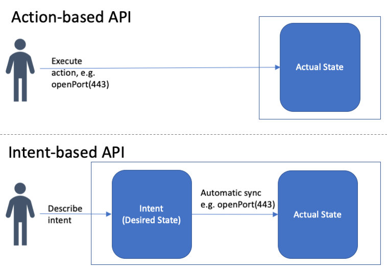
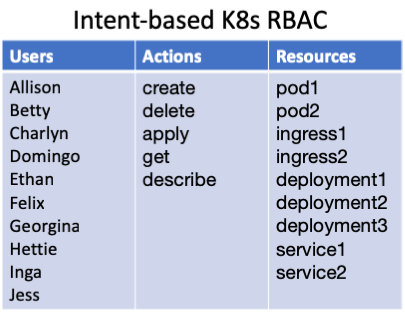
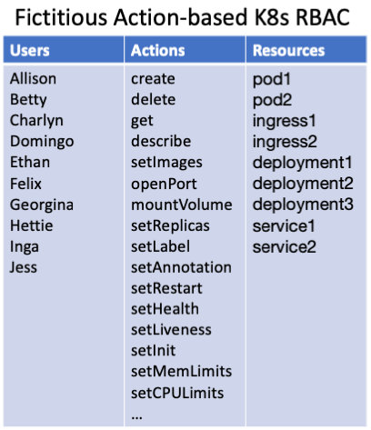
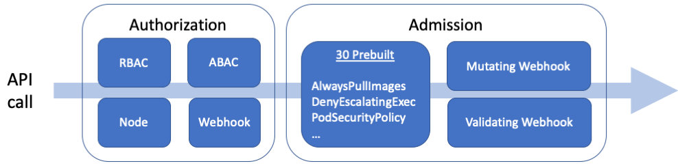

Kubernetes 不再是（只是）好玩的游戏了。它正在被用于生产；它是关键任务；所有旧有的安全和合规规则和法规都需要以某种方式加装到 Kubernetes 上。不幸的是，像 RBAC 这样的旧的访问控制工具根本无法应对挑战。 

## 概述

- **Kubernetes API 的设计与大多数现代 API 不同。** 它是基于意图的，这意味着使用 API 的人考虑的是他们想要 Kubernetes 做什么，而不是如何实现。其结果是一个令人难以置信的可扩展性、弹性，和一个强大而流行的系统。
- **同时，其基于意图的 API 给安全带来了挑战。** 标准的访问控制解决方案（基于角色的访问控制、基于属性的访问控制、访问控制列表或 IAM 策略）都不够强大，无法强制执行基本的策略，比如谁可以更改 pod 上的标签，或者哪些镜像存储库是安全的。
- **Kubernetes Admission Control 就是为了解决这个问题而设计的。** Kubernetes Admission Controller 并不能解决开箱即用的访问控制问题，但它们允许你使用 Webhook 来解决授权挑战与解耦策略。

## Kubernetes 基于意图的 API

Kubernetes API 接受了一个与我们大家习惯的 API 范式截然不同的 API。今天的大多数 API 都是所谓的 *基于行动的（action-based）*，这意味着当你想到一个 API 调用时，你正在考虑你想要执行的行动，以改变软件的运行方式。例如，如果你想让一个应用程序暴露在互联网上，你可能会运行 API openport (443)，改变应用程序上的网络设置，使端口 443 打开。

相比之下，Kubernetes 有所谓的 *基于意图的（intent-based）* API（最近在网络领域流行，例如 [SDXCentral](https://medium.com/r/?url=https%3A%2F%2Fwww.sdxcentral.com%2Fsdn%2Fdefinitions%2Fwhat-is-intent-based-networking%2F)），这意味着当你想要进行一个 API 调用时，你要考虑的是你希望该系统处于何种状态。你并不关心用什么操作来实现这种希望的状态。你只需告诉系统你想要什么（你的意图），系统就会想出如何实现它 —— 采取哪些动作将系统过渡到期望的状态。例如，你可以说你的应用程序应该运行 1.7 版本的二进制文件，应该使用带加密的持久存储，并且应该连接到互联网。系统会计算出如何升级或降级二进制文件，如何开启加密，以及如何重新配置网络以允许互联网连接。

架构上的关键区别在于，*基于意图的* 系统既能理解系统当前所处的状态（有时称为 *实际状态* ），也能理解你对系统应该处于何种状态的意图（*期望状态*）。系统不断地计算两者之间的差距，并采取任何必要的行动使实际状态变成期望状态。用户可以直接通过 API 调用来改变期望状态，而依靠系统本身来改变实际状态。



Kubernetes 的 API 是基于意图的。每个 API 调用都允许你指定 Kubernetes 众多对象中的一个对象的期望状态：pod、service、ingress、configmap 等。例如，下面是你为一个 nginx 工作负载定义的期望状态。

```yaml
# nginx-pod.yaml
kind: Pod
apiVersion: v1
metadata:
 name: nginx
 labels:
 app: nginx
spec:
 containers:
 - image: nginx
 name: nginx	
```

然后要把这个想要的状态发送到 Kubernetes，用 kubectl，把上面的 YAML 文件交给它就行了。

```bash
kubectl apply -f nginx-pod.yaml
```

假设你想改变 nginx 的版本，挂载一个外部卷，或者提供额外的配置，你更新 nginx-pod.yaml 文件到任何你想要的状态，然后再使用 kubectl apply。更新 nginx-pod.yaml 文件到任何需要的状态，然后再使用 kubectl apply。

```bash
kubectl apply -f nginx-pod.yaml
```

这里的关键要点是，你不是在运行像 updateVersion 或 mountVolume 这样的 API，而是在改变一些描述系统应该处于什么状态的 YAML，并通过运行 apply 来说" 使之如此 "。

Kubernetes 的 API 模型有几个优势：

- **减少学习曲线**。你要学习每个对象的 YAML 格式和一系列动作，如创建、应用、获取、描述、删除。无论如何，你都需要学习每个对象的 YAML 配置格式（这样你才能读懂它）。相比之下，*基于动作的* API 还需要你学习可能是 1,000 个动作。
- **可扩展性**。Kubernetes 支持自定义资源定义（CRD）。因此，除了所有常见的 pod、service、ingress 等，你还可以定义自己的资源。这是可能的，因为 API 表面不需要扩展来处理新的资源类型。你只需要写一些描述资源的 YAML，然后调用同样的十几个动作，例如：创建、应用、获取、描述、删除。
- **分布式系统**。在使用商用硬件构建的云上运行大规模系统，要求在面对故障时具有难以置信的弹性。Kubernetes 基于意图的架构让它知道自己应该做什么，所以当比如说发生硬件故障时，它可以尝试进行补偿。Brian Grant（Google Kubernetes 的联合技术负责人）曾就 [声明式应用管理](https://docs.google.com/document/d/1cLPGweVEYrVqQvBLJg6sxV-TrE5Rm2MNOBA_cxZP2WU/edit) 和 [Kubernetes 资源管理](https://docs.google.com/document/d/1RmHXdLhNbyOWPW_AtnnowaRfGejw-qlKQIuLKQWlwzs/edit) 写过大量文章，并指出 Kubernetes API 是解决许多分布式系统问题的关键：故障、分布、自动伸缩、多所有者、可用性、性能、可逆性。

## 为什么 RBAC 不足以保证 Kubernetes 的 API 安全？

基于 Kubernetes 意图的 API 的挑战来自于你想要保护和保障 API 的安全时 —— 当你想要控制哪些人可以使用该 API 做什么时。想象一下，你是 Kubernetes 管理员，负责集群的运维、安全和合规性。新手 Kubernetes 开发人员需要护栏；安全团队需要控制和可见性；合规团队需要帮助将古老的规定映射到这个全新的系统；你从自己的经验中知道你需要采用哪些 Kubernetes 最佳实践。

理想情况下，你会在 Kubernetes 本身内部通过设置访问控制来执行这些规则、法规和最佳实践。基于角色的访问控制（RBAC）是几十年来的解决方案，使你能够控制哪些用户可以在哪些资源上运行哪些 API。Kubernetes RBAC（自 [2017 年末](https://kubernetes.io/blog/2017/10/using-rbac-generally-available-18/) 开始提供）是你的第一道防线。它可以让你为特定的用户组提供对资源的只读访问。它让你通过给不同的用户组分配 Kubernetes 的不同部分（也就是 *namespace*）来隔离不同的用户组（虽然不是完全隔离）。它可以让你限制 service account
的权限。所有这些都是有价值的。

但与基于动作的系统相比，RBAC 处理了绝大部分的访问控制需求，Kubernetes 中的 RBAC 由于其基于意图的 API，提供的控制 *要少得多*。从 API 的角度来看，只有十几个动作，这意味着如果 alice 可以更新一个资源，她就可以更新这个资源的任何部分。

例如，SRE 需要读取集群中的大部分资源，以便在出现问题时能够诊断出问题。但当 SRE 发现某个节点上出现问题时，例如邻居有噪音，她可能需要对该节点进行排空（drain），以便将工作负载转移到不同的节点上，缓解问题。不幸的是，API 没有 drain 动作 —— 那些是 CLI 提供的宏，只是更新节点上的注释。使用 RBAC 试图达到这个级别的粒度是繁琐而复杂的，以至于不切实际。

下面的基于意图的 K8s RBAC 图从概念上显示了你必须使用 RBAC 的工作内容 —— 你可以选择哪些用户 / 操作 / 资源组合是允许的。



相反，想象一下，如果 Kubernetes 是基于动作的（例如，它包括 cordon、drain、setImage、mountVolume、openPort 等 API）。那么我们就可以使用 RBAC 来授予读以及 cordon 和 drain，但没有其他的功能。基于动作的 API 只是有更多的名字，你可以在编写 RBAC 策略时使用。



简而言之，Kubernetes API 提供了一个强大的、可扩展的、统一的资源模型，但也正是这个资源模型使得 RBAC 对于很多用例来说过于粗粒度。RBAC 所能提供的控制是非常宝贵的，但比起其他系统，RBAC 还远不能满足 Kubernetes 的需要。

### 我们需要什么来保证 K8s 的 API 安全？

那么如果 RBAC 不能提供足够的控制，我们该怎么做呢？我们来看一个例子。"所有的 pod 必须只使用来自受信任的存储库的镜像"（比如说，hooli.com）任何时候有人运行，比如说，kubectl apply，访问控制系统需要根据用户、动作 apply 和描述 pod 的 YAML 做出决定。

```yaml
kind: Pod
metadata:
  labels:
    app: nginx
  name: nginx-1493591563-bvl8q
  namespace: production
spec:
  containers:
  - image: nginx
    name: nginx
    securityContext:
      privileged: true
  - image: hooli.com/frontend
    name: frontend
    securityContext:
      privileged: true 
 dnsPolicy: ClusterFirst
 restartPolicy: Always
```

为了做出正确的决策，访问控制系统需要提取镜像名称列表（如`nginx`和`hooli.com/frontend`），并进行字符串操作以提取仓库的名称（如默认的 repo 和 hooli.com）。

一种方案是将一堆关于 Kubernetes 资源的知识构建到访问控制系统本身。然后管理员可以写一个策略，比如谁可以 `update-labels`，`permitted-image-registries` 是什么，等等。这就是大多数系统的做法 —— 发明一堆权限，然后在上面建立一个自定义的访问控制系统。

但是构建一个自定义的访问控制系统对于 Kubernetes 来说是行不通的，因为它允许用户和厂商发明自己的 YAML 格式（自定义资源定义），并安装实现这些格式的代码。所以 Kubernetes 的资源可扩展性要求任何定制的 Kubernetes 访问控制系统本身都是可扩展的。

所以，不管我们做什么，我们都需要一个访问控制系统，让管理员编写策略：

- 通过 YAML 文件的层次结构进行递减。
- 对数组中的元素进行迭代。
- 操作字符串、IP、数字等。

标准的访问控制范式都不能满足这些要求。这包括基于角色的访问控制（RBAC）、基于属性的访问控制（ABAC）、访问控制列表（ACL），甚至是 IAM 风格的策略。

### 使用准许控制来应急

幸运的是，Kubernetes 团队预见到了这个问题，并创建了一个 [Admission Control](https://medium.com/r/?url=https%3A%2F%2Fkubernetes.io%2Fdocs%2Freference%2Faccess-authn-authz%2Fadmission-controllers%2F) 机制，在这里你可以把控制的范围远远超过 RBAC 和标准的访问控制机制。Kubernetes API 服务器提供了一条访问控制的管道，分为 Authorization（如 RBAC），和 Admission。

 

授权（Authorization）发生在每次 API 调用上，而准许（Addmission）只发生在更新（创建、更新和删除）上。通过授权，你将获得以下信息以做出决定：

- **用户**：用户、组、认证提供的额外属性。
- **动作**：路径、API 动词、HTTP 动词。
- **资源**：资源、子资源、命名空间、API 组。

通过 Admission，你会得到一个 YAML 中的 AdmissionReview 对象。它包括所有关于资源被修改的信息，以做出任何你想要的决定（见下面的 `request.object`）。

```yaml
apiVersion: admission.k8s.io/v1beta1
kind: AdmissionReview
request:
  kind:
    group: ''
    kind: Pod
    version: v1
  namespace: frontend
  object:
    metadata:
      creationTimestamp: '2018-10-27T02:12:20Z'
      labels:
        app: nginx
      name: nginx
      namespace: frontend
      uid: bbfee96d-d98d-11e8-b280-080027868e77
    spec:
      containers:
      - image: nginx
        imagePullPolicy: Always
        name: nginx
        resources: {}
        terminationMessagePath: "/dev/termination-log"
        terminationMessagePolicy: File
        volumeMounts:
        - mountPath: "/var/run/secrets/kubernetes.io/serviceaccount"
        name: default-token-tm9v8
        readOnly: true
      dnsPolicy: ClusterFirst
      restartPolicy: Always
      schedulerName: default-scheduler
      securityContext: {}
      serviceAccount: default
      serviceAccountName: default
      terminationGracePeriodSeconds: 30
      tolerations:
      - effect: NoExecute
        key: node.kubernetes.io/not-ready
        operator: Exists
        tolerationSeconds: 300
      - effect: NoExecute
        key: node.kubernetes.io/unreachable
        operator: Exists
        tolerationSeconds: 300
      volumes:
      - name: default-token-tm9v8
        secret:
          secretName: default-token-tm9v8
    status:
      phase: Pending
      qosClass: BestEffort
    oldObject: 
    operation: CREATE
    resource:
      group: ''
      resource: pods
      version: v1
    uid: bbfeef88-d98d-11e8-b280-080027868e77
    userInfo:
      groups:
      - system:masters
      - system:authenticated
      username: minikube-user 
```

当然，你可以通过编写、部署和维护实现准入控制 webhook 协议（一个简单的 HTTP/json API）的自定义代码，编写任何你喜欢的逻辑来保护你的 API。现在，如果你不想支持和维护自定义代码，你可以使用 [Open Policy Agent](https://medium.com/r/?url=https%3A%2F%2Fwww.openpolicyagent.org) 作为 Kubernetes [准入控制器](https://www.openpolicyagent.org/docs/latest/kubernetes-tutorial/)，并利用其声明式策略语言。该语言包括上述所需的表达能力：迭代、点注和 50 多个内置的可用于字符串操纵等。更多信息，请参见 [" 利用 Open Policy Agent 确保 Kubernetes API 安全 " 一文](https://blog.openpolicyagent.org/securing-the-kubernetes-api-with-open-policy-agent-ce93af0552c3)。

## 总结

在这篇文章中，我们深入研究了 Kubernetes 所面临的 API 安全挑战，并重点介绍了以下几个关键要点：

- Kubernetes 基于意图的 API 让用户专注于他们希望 Kubernetes 处于什么状态，而不是如何实现它。
- 基于意图的方法的核心好处之一是，它使 Kubernetes 在面对故障时具有弹性。因为系统知道自己应该做什么，所以当故障发生时，Kubernetes 知道如何恢复。
- Kubernetes 的 API 还提供了巨大的可扩展性。用户可以创建自己的自定义资源，而无需扩展 API。
- Kubernetes 的 API 所面临的挑战是，一个访问控制决策可能需要分析一个任意的 YAML 文档，例如使用点符号、迭代和字符串操纵。标准的访问控制系统，如 RBAC、ABAC、ACLs 和 IAM，根本没有足够的表达能力。
- Kubernetes 团队引入了准入控制（Admission Control），以赋予用户控制 API 的额外权力。你可以使用声明式授权解决方案（如 Open Policy Agent）作为 Kubernetes Admission Controller，为你提供所需的表达能力，以克服这些新的访问挑战，并提供真正有效的粒度。