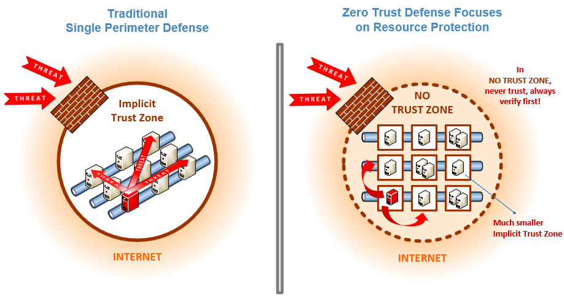

本文译自 [Zero Trust Cybersecurity:'Never Trust, Always Verify'](https://www.nist.gov/blogs/taking-measure/zero-trust-cybersecurity-never-trust-always-verify)。

啊？什么？这是我第一次听到零信任网络安全这个词时候的反应，我是从 2018 年秋天开始在国家标准技术研究所 (NIST) 的国家网络安全中心部门 [(NCCoE)](https://www.nccoe.nist.gov/) 开始工作的。值得注意的是，我有了一个新的开始，同时也是一个巨大的转变，即从通常意义上讲的软件开发工程师转变为网络安全工程师。当然，在我的职业生涯中我曾经设计和开发了一些安全软件方案，甚至会做一些安全系统的平台的工作，但是零信任网络对我来讲，完全是另一回事。一方面，它没有围栏（意指防火墙之类的网络安全，后文有介绍）。

我为什么这么说呢？传统的网络安全方式依赖的是网络屏障——防火墙——它控制着进出网络的流量。从另一个角度来讲，零信任网络是指没有这些网络屏障的情况。它通常和“消除边界”，“缩小边界”，“减小边界”，“无边界”这些词语一起提及。这些都是“去边界化”思想的常见提法，这种提法最早是在 2005 年由一个叫做 Jericho Forum 的团队首次提出的。2010 年，在 Forrester Research 工作的网络安全专家 John Kindervag 创造了“零信任”这个词语。简单来说，零信任假设系统一定会被损坏，就好像没有任何边界一样设计安全性。因此，默认情况下不信任任何事情，从网络开始重新设计。

我们即将深入了解零信任网络到底意味着什么。但是首先，NCCoE 和我是怎么涉入到零信任的呢？这是一个很长的故事。

##  一次数据泄漏引发的大动作

我敢说事情是由 [2015 年人事管理局 (OPM) 的数据泄漏](https://www.opm.gov/cybersecurity/cybersecurity-incidents/) 引起的。据估计大约有 2210 万条记录被泄漏！如果你的脑海中还没有概念的话，你现在应该明白，这次事件被认定为美国历史上政府数据泄漏最严重的一次事件。它暴漏了那些接受过背景调查的人的信息，以及他们的家庭、朋友、熟人，他们中的大部分甚至都不是政府职员。社会保险号码，姓名，生日和出生地，还有地址都是被泄漏的个人身份信息类型。

人事管理局的数据泄漏给美国政府强化他们的信息系统和基础设施敲响了警钟。此后，美国政府发起了多个用来改善安全态势并使其变得现代化的行动。2017 年 5 月，在总统的领导下成立了 [美国技术委员会](https://www.whitehouse.gov/articles/american-technology-council-summit-modernize-government-services/)，并在同年晚些时候协调并编写了一份联邦 IT 现代化报告。

尔后，在一年以后的 2018 年 2 月，由联邦 IT 官员组成的 CIO 服务、战略与基础设施委员会，特许成立了零信任和软件定义网络的指导小组。这个小组的工作就是支持，在零信任网络的指导原则下，采用更有效的方法和技术来对联邦政府数据资产的访问做验证、保障、执行和连续监测。在 2018 年 12 月 25 日，该小组在 NCCoE 召开了一次研讨会。此次研讨会包括来自联邦民用和国防机构的 21 名代表和主题专家，讨论零信任网络和软件定义网络的定义并达成共识。在研讨会之后不久，我开始到 NIST/NCCoE 工作并以技术负责人的身份被要求加入指导小组会议。这种互动促使 CIO 理事会和 NIST NCCoE 在 2019 年 2 月共同发起了一个项目，来调查研究零信任和零信任架构 (ZTA)，目的是为了产生一个采用零信任架构 (ZTA) 的指导文档来加强美国政府信息系统和基础设施的安全防护。

2020 年 8 月，NIST NCCoE 发布了通用指导文件 NIST SP 800-207：[零信任架构](https://csrc.nist.gov/publications/detail/sp/800-207/final)，以便让联邦政府采用 ZTA。这份指导文档对零信任和零信任架构提供了概念层面的解释，包括部署模式，使用场景以及技术差距的挖掘。

我们即将深入了解零信任网络到底意味着什么。但是首先，NCCoE 和我是怎么涉入到零信任的呢？这是一个很长的故事。

## 从今往后，让网络保持安全

让你的意识快速接受零信任的最好方式就是考虑传统和当前的网络环境。早些时候从事于 IT 行业的人员肯定会记得那些我们把网络组合在一起的天真时代。至少可以说，他们有着很大的不同，因为我们没有像今天这样在云中远程访问资源、应用程序和服务。当然，我们使用数字化资源和应用程序来完成我们的工作；然而，它们是专用的内部网络，在这个环境中的工作人员可以通过个人电脑和笔记本电脑来获取网络访问。但是我们如何保护它们免受互联网的威胁呢？我们围绕着它们建立了一个数字防御——一个边界，它以一种经过验证和授权的方式让外部访问通过一个入口点。这样可以允许内部用户访问被保护在边界内的资源池和应用。这是一个在很长时间内被广泛采用的策略。

如今，随着云计算的普及，网络全球化达程度到了前所未有高度。很多人都采用移动设备远程办理业务。我们在私有云、公有云、混合云以及其他变种云环境中来消费、交换和存储我们的数字化数据。毋庸置疑，传统的边界已经得到了扩展和变得越来越模糊，以允许应用程序和服务能在任何地点被访问。当然，随着这种变化，网络安全漏洞的数量也随之上升。现在我们的受攻击面变大了，受攻击点变多了。我们尤其容易受到来自网络内部——也就是边界内的网络安全漏洞的攻击。

事实上，在上面提到的臭名昭著的人事管理局数据泄漏中，黑客首先使用偷来的凭证信息来获取人事管理局内部网络的访问权限，然后放置了安装在内网中的恶意软件包，该程序包将自身安装在人事管理局的网络中从而做为一个数据泄漏的后门。然后，黑客从那里升级了自己的权限来获取其他人事管理局系统的访问权限，一个典型的权限升级场景，也是通常被称之为外围安全漏洞的“横向移动”或“东西向通信”。传统边界防御的缺点是一旦在边界内部发生安全威胁，它没有提供安全控制机制来阻止内部威胁“横向移动”的发生，因为在策略上总是认定内部是安全的或可信任的区域。

这就是“零信任”来拯救这一天的原因。你可以在企业专属的网络里、咖啡店、家里或者世界上的任何一个地方工作，可以跨越多种边界去访问资源，从内部环境到多云环境。无论你的网络位置如何，零信任网络安全的表现总是：“我对你是零信任的，在我能够信任你并给你赋予你所需要资源的访问权限之前，我需要对你进行验证”。因此，“从不信任，坚持验证”——要针对每一个访问请求！

*易受东西方流量攻击的传统防火墙网络与具有零信任体系结构的网络之间的区别说明。*

进一步强调一下，验证流程是零信任网络方法中很关键的一方面。在权限被赋予之前，对资源的每一个访问请求都必须依据现有的访问策略和使用凭证、设备、应用程序和服务等的当前状态以及其他一些可观测的行为表现和环境属性来进行全面且实时的动态评估。比如说，一个正式员工或者合同工，甚至是一个客户可能已经被验证并被赋予特定资源的权限，但是在零信任网络的环境中，当他们需要访问其他资源时，依旧需要被重新验证。这种持续审查是一种安全控制机制，可以阻止受恶意行为影响的受损系统在整个网络环境中进行扩散，这基本上是任何零信任方案的本质。

在我的职业生涯中有很多惊奇的工作经历，但是我必须承认，NIST/NCCoE 的这份零信尝试的经验在目前为止绝对是排在榜首的。更令人感到欣慰的是我们的零信任尝试正受到其他政府部门或者业内人士的密切关注和高度评价，所有的荣誉都应该归功于我们团队的所有成员在我们的零信任尝试和活动中所做出的努力。
